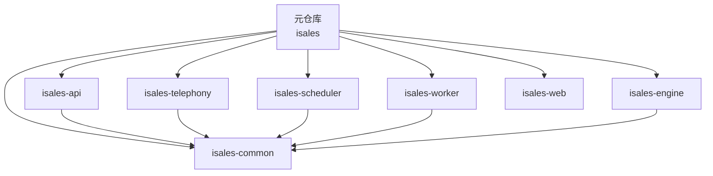
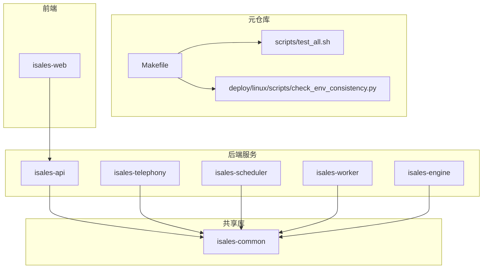
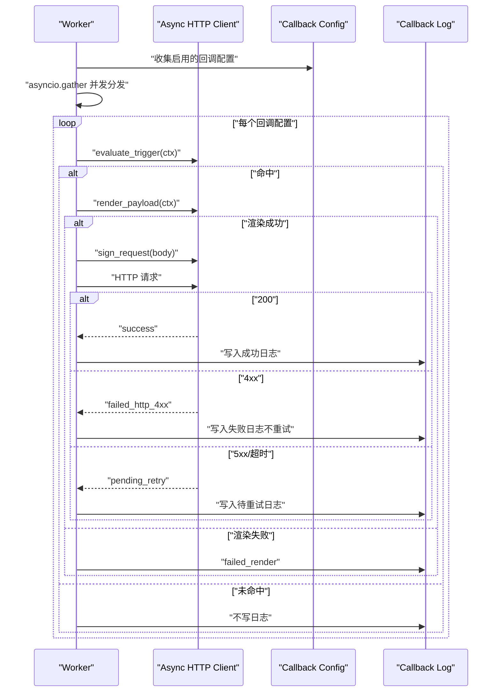
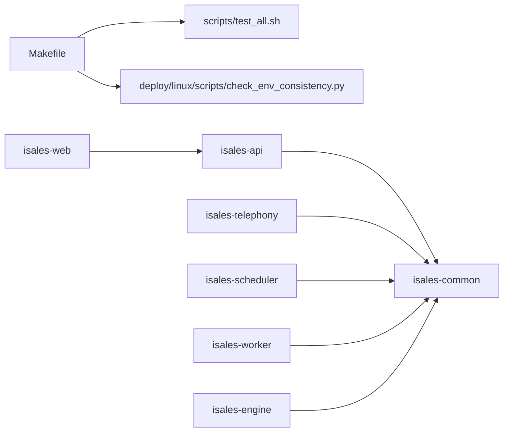

# 开发规范

<cite>
**本文引用的文件**
- [README.md](file://README.md)
- [DESIGN.md](file://DESIGN.md)
- [Makefile](file://Makefile)
- [scripts/test_all.sh](file://scripts/test_all.sh)
- [deploy/linux/scripts/check_env_consistency.py](file://deploy/linux/scripts/check_env_consistency.py)
- [deploy/cloud/env/SECRETS.md.example](file://deploy/cloud/env/SECRETS.md.example)
- [openspec/specs/service-communication/spec.md](file://openspec/specs/service-communication/spec.md)
- [openspec/changes/archive/2026-05-06-impl-worker/tasks.md](file://openspec/changes/archive/2026-05-06-impl-worker/tasks.md)
- [openspec/changes/archive/2026-05-06-impl-worker/design.md](file://openspec/changes/archive/2026-05-06-impl-worker/design.md)
- [openspec/changes/archive/2026-05-27-engine-artc-sdk-thread-model/design.md](file://openspec/changes/archive/2026-05-27-engine-artc-sdk-thread-model/design.md)
- [openspec/changes/archive/2026-05-17-windows-client-core/tasks.md](file://openspec/changes/archive/2026-05-17-windows-client-core/tasks.md)
- [CLAUDE.md](file://CLAUDE.md)
- [openspec/changes/arch-cloud-edge-split/proposal.md](file://openspec/changes/arch-cloud-edge-split/proposal.md)
- [openspec/changes/arch-cloud-edge-split/design.md](file://openspec/changes/arch-cloud-edge-split/design.md)
- [openspec/changes/arch-cloud-edge-split/specs/architecture/spec.md](file://openspec/changes/arch-cloud-edge-split/specs/architecture/spec.md)
</cite>

## 更新摘要
**变更内容**
- 新增通信风格指南章节，要求选项展示以「说人话」总结结尾
- 更新服务间通信规范，结合云边架构的通信风格要求
- 增强代码审查检查清单，包含通信风格合规性检查

## 目录
1. [简介](#简介)
2. [项目结构](#项目结构)
3. [核心组件](#核心组件)
4. [架构总览](#架构总览)
5. [详细组件分析](#详细组件分析)
6. [通信风格指南](#通信风格指南)
7. [依赖关系分析](#依赖关系分析)
8. [性能考虑](#性能考虑)
9. [故障排查指南](#故障排查指南)
10. [结论](#结论)
11. [附录](#附录)

## 简介
本开发规范面向iSales多仓库协作体系，聚焦Python代码风格与格式化、注释与命名约定、模块化设计（isales-common共享库）、服务间接口设计、异步编程最佳实践（asyncio、并发控制、错误处理）、日志与调试、性能优化与内存管理、安全编码与数据保护、以及代码审查与质量评估。内容基于仓库中的OpenSpec规范、部署脚本与运行手册、以及关键实现文档提炼而来，旨在统一跨仓库的工程实践。

**更新** 新增通信风格指南，要求所有技术选项展示以「说人话」总结结尾，确保团队沟通的清晰性和实用性。

## 项目结构
iSales采用"元仓库 + 多子仓"的组织方式：本仓库（isales）作为元仓库，集中OpenSpec规范、实施计划与跨仓工具脚本；实际运行时代码分布在7个同级仓库中，彼此通过isales-common进行共享契约与数据模型的耦合。

- 元仓库职责
  - OpenSpec规范与变更流程（变更提案/应用/归档）
  - 跨仓测试编排（test-all）
  - 部署一致性校验（shellcheck + env模板一致性）

- 子仓概览（来自README与CLAUDE说明）
  - isales-common：Pydantic/SQLAlchemy模型、Provider抽象、迁移脚本
  - isales-api：FastAPI后台（管理面）
  - isales-telephony：telephony-api + modem控制器守护进程
  - isales-scheduler：拨号调度与时间窗
  - isales-worker：后置回调分发、摘要生成
  - isales-engine：实时通话引擎（状态机 + 三层AI管线）
  - isales-web：Vue3管理前端

**章节来源**
- [README.md:1-86](file://README.md#L1-L86)
- [CLAUDE.md:7-19](file://CLAUDE.md#L7-L19)

## 核心组件
- 跨仓测试与质量门禁
  - 一键测试：元仓库提供test-all，遍历各子仓pytest/vitest，汇总结果与耗时，任一失败即退出非零
  - OpenSpec校验：make spec-validate统一校验specs与changes，并联动DingRTC版本一致性检查
  - 部署一致性：make deploy-check执行shellcheck与env模板变量与各服务README的一致性校验

- 环境变量与密钥管理
  - 云环境密钥离线备份模板，强调主密钥泄漏的灾难恢复流程
  - 部署脚本校验env模板与服务README的变量声明一致性，避免"文档未更新"导致的运行时错误

- 服务间通信契约
  - WebSocket消息形状由message-contract约束，前端以discriminated union解析，未知type仅告警不中断
  - 新事件类型变更需同步isales-common的联合类型定义，前后端协同上线

**章节来源**
- [scripts/test_all.sh:1-144](file://scripts/test_all.sh#L1-L144)
- [Makefile:1-30](file://Makefile#L1-L30)
- [deploy/linux/scripts/check_env_consistency.py:1-161](file://deploy/linux/scripts/check_env_consistency.py#L1-L161)
- [deploy/cloud/env/SECRETS.md.example:1-86](file://deploy/cloud/env/SECRETS.md.example#L1-L86)
- [openspec/specs/service-communication/spec.md:132-150](file://openspec/specs/service-communication/spec.md#L132-L150)

## 架构总览
下图展示元仓库与子仓的关系、共享库isales-common的作用，以及测试与部署质量门禁如何贯穿整个体系。

**图表来源**
- [Makefile:1-30](file://Makefile#L1-L30)
- [scripts/test_all.sh:18-25](file://scripts/test_all.sh#L18-L25)
- [README.md:7-14](file://README.md#L7-L14)

## 详细组件分析

### 代码风格与格式化（Python）
- 命名约定
  - 环境变量：统一使用ISALES_前缀，参考env模板与README中的变量声明
  - 变量与函数：遵循清晰可读的驼峰或下划线风格，结合具体子仓已有习惯
  - 类型标注：建议在公共接口与模型层保持类型注解，提升可维护性

- 注释规范
  - 关键逻辑与边界条件处提供简明注释，解释"为什么"而非"是什么"
  - 对跨仓库共享的契约（如EngineEvent、ProviderABC）提供指向OpenSpec的链接或引用

- 格式化与静态检查
  - 使用shellcheck对部署脚本进行静态检查
  - 通过make deploy-check确保env模板与README变量声明一致，减少配置漂移

**章节来源**
- [deploy/linux/scripts/check_env_consistency.py:55-56](file://deploy/linux/scripts/check_env_consistency.py#L55-L56)
- [openspec/specs/service-communication/spec.md:132-150](file://openspec/specs/service-communication/spec.md#L132-L150)

### 模块化设计与isales-common共享库
- 设计原则
  - 将跨服务共享的数据模型、Pydantic/SQLAlchemy实体、Provider抽象下沉至isales-common
  - 子仓仅消费共享契约，避免重复定义与不一致

- 接口设计
  - 服务间通信通道矩阵与消息契约由OpenSpec约束，确保前后端一致演进
  - 新增事件类型需先在isales-common中同步联合类型定义，再在前端补充解析逻辑

- 版本与兼容
  - OpenSpec变更流程要求"提议→应用→归档"，确保变更可追溯与可审计
  - 通过make spec-validate统一校验，防止规范层面的不一致

**章节来源**
- [README.md:7-14](file://README.md#L7-L14)
- [DESIGN.md:49-55](file://DESIGN.md#L49-L55)
- [openspec/specs/service-communication/spec.md:132-150](file://openspec/specs/service-communication/spec.md#L132-L150)

### 异步编程最佳实践（asyncio）
- 并发控制
  - 在worker中使用并发聚合（如asyncio.gather）对多个callback配置进行并行分发，降低整体延迟
  - 对于高延迟下游（如第三方回调），通过并发与重试策略平衡吞吐与可靠性

- 错误处理
  - 渲染失败、HTTP 4xx直接失败不再重试；HTTP 5xx/超时进入待重试队列并指数退避
  - 对底层异常进行分类与降级，保证主流程（如通话结束处理）不受阻塞

- 事件循环与线程模型
  - 引擎侧采用"周期泵驱动 + 队列派发"的单线程模型，避免与供应商SDK内部run_until_complete冲突
  - 外部线程通过命令队列将调用派发到驱动线程的事件循环，保证供应商API可用且线程安全

**图表来源**
- [openspec/changes/archive/2026-05-06-impl-worker/tasks.md:31-40](file://openspec/changes/archive/2026-05-06-impl-worker/tasks.md#L31-L40)

**章节来源**
- [openspec/changes/archive/2026-05-06-impl-worker/tasks.md:31-40](file://openspec/changes/archive/2026-05-06-impl-worker/tasks.md#L31-L40)
- [openspec/changes/archive/2026-05-06-impl-worker/design.md:155-166](file://openspec/changes/archive/2026-05-06-impl-worker/design.md#L155-L166)
- [openspec/changes/archive/2026-05-27-engine-artc-sdk-thread-model/design.md:53-108](file://openspec/changes/archive/2026-05-27-engine-artc-sdk-thread-model/design.md#L53-L108)

### 日志记录与调试
- 日志策略
  - 对关键路径（渲染失败、HTTP错误、重试、硬件告警）进行明确的日志记录，便于定位
  - 对未知事件类型或字段缺失，前端仅告警并跳过，避免影响整体连接稳定性

- 调试技巧
  - 使用最小化复现：针对Windows音频路径、CPCMREG启停等场景，提供mock与测试用例，隔离平台差异
  - 通过环境变量开关（如MOCK_*）快速切换到模拟路径，加速问题定位

**章节来源**
- [openspec/changes/archive/2026-05-06-impl-worker/design.md:155-166](file://openspec/changes/archive/2026-05-06-impl-worker/design.md#L155-L166)
- [openspec/changes/archive/2026-05-17-windows-client-core/tasks.md:59-66](file://openspec/changes/archive/2026-05-17-windows-client-core/tasks.md#L59-L66)

### 性能优化与内存管理
- 并发与I/O
  - 在worker中对回调分发使用并发聚合，缩短端到端延迟
  - 对高延迟下游采用重试与退避策略，避免阻塞主流程

- 事件循环与线程
  - 引擎侧采用"周期泵驱动 + 队列派发"的单线程模型，降低上下文切换与竞态风险
  - 通过命令队列在驱动线程内执行供应商API，避免与SDK内部run_until_complete冲突

- 内存与资源
  - 音频后端在构造期lazy打开串口，避免在无模组的CI环境中导入失败
  - 资源释放（如串口）幂等关闭，防止句柄泄露

**章节来源**
- [openspec/changes/archive/2026-05-27-engine-artc-sdk-thread-model/design.md:53-108](file://openspec/changes/archive/2026-05-27-engine-artc-sdk-thread-model/design.md#L53-L108)
- [openspec/changes/archive/2026-05-17-windows-client-core/tasks.md:59-66](file://openspec/changes/archive/2026-05-17-windows-client-core/tasks.md#L59-L66)

### 安全编码与数据保护
- 密钥与凭证
  - 主密钥（Fernet）在4个服务共享，泄漏需立即轮换并重建provider凭据
  - JWT Secret轮换会导致用户重登与edge重签发，需提前演练

- 传输与签名
  - 回调请求使用HMAC-SHA256签名，包含时间戳与正文摘要，确保完整性与防重放
  - 模板渲染使用受限沙箱环境，避免任意代码执行

- 环境变量与配置
  - 通过部署脚本校验env模板与README声明的一致性，防止遗漏或多余变量

**章节来源**
- [deploy/cloud/env/SECRETS.md.example:12-28](file://deploy/cloud/env/SECRETS.md.example#L12-L28)
- [openspec/changes/archive/2026-05-06-impl-worker/tasks.md:31-40](file://openspec/changes/archive/2026-05-06-impl-worker/tasks.md#L31-L40)
- [deploy/linux/scripts/check_env_consistency.py:118-156](file://deploy/linux/scripts/check_env_consistency.py#L118-L156)

### 代码审查检查清单与质量评估
- 规范与一致性
  - 是否通过make spec-validate与make deploy-check
  - OpenSpec变更是否完整走"提议→应用→归档"流程
  - 环境变量是否在env模板与README中一致声明

- 代码质量
  - 是否具备最小可复现测试用例（尤其是跨平台/跨组件场景）
  - 是否对异常路径与边界条件进行了显式处理与日志记录
  - 是否遵循共享契约（如EngineEvent联合类型）并在isales-common同步更新

- 安全与合规
  - 是否正确使用加密与签名（Fernet/HMAC）
  - 是否避免在日志中泄露敏感信息
  - 是否对下游依赖（供应商SDK）的事件循环约束有明确处理

- **通信风格合规性**（新增）
  - 技术选项展示是否包含「说人话」总结
  - 选项描述是否简洁明了，避免过度技术化
  - 是否提供了实用性的总结建议

**章节来源**
- [Makefile:8-29](file://Makefile#L8-L29)
- [DESIGN.md:49-55](file://DESIGN.md#L49-L55)
- [openspec/specs/service-communication/spec.md:132-150](file://openspec/specs/service-communication/spec.md#L132-L150)

## 通信风格指南

### 概述
在iSales项目中，我们采用统一的通信风格指南，确保团队成员之间的沟通既专业又易于理解。特别要求在提供技术选项时，必须以「说人话」总结结尾，帮助非技术背景的同事也能快速理解决策要点。

### 核心原则
- **实用性优先**：技术讨论必须服务于业务目标和用户体验
- **简洁明了**：避免过度复杂的技术术语，确保信息传达效率
- **可操作性强**：每个选项都应包含明确的实施建议和预期效果
- **包容性沟通**：照顾不同技术背景的团队成员，促进有效协作

### 选项展示规范

#### 基本格式
当提供技术选项时，必须按照以下格式组织内容：

**选项**：
- (A) 方案A
- (B) 方案B  
- (C) 方案C

**采纳/排除理由**：
- 采纳方案A的理由
- 排除方案B的理由
- 排除方案C的理由

**「说人话」总结**：
- 一句话总结：选择A，因为...
- 实际影响：对业务/用户/开发的影响
- 建议行动：下一步应该做什么

#### 示例应用

**决策示例**（基于云边架构设计）：
- **选项**：
  - (A) 阿里RTC PaaS + IMS纯通道接入 ← 选定
  - (B) 阿里IMS AICallKit（托管智能体）
  - (C) 自建coturn + aiortc SFU

**采纳/排除理由**：
- 采纳(A)的理由：阿里官方ARTC SDK完整支持服务端入会、IMS纯通道接入方案明确AI服务编排需要自行实现，与iSales多角色PK管线完全解耦
- 排除(B)的理由：AICallKit内置ASR/LLM/TTS编排与多角色PK管线冲突，即使能配自研LLM也无法实现N×M裁判+1润色的管线内多次LLM调用
- 排除(C)的理由：PoC已确认(A)可行，(C)是fallback；自建增加运维负担且阿里RTC单价已被接受

**「说人话」总结**：
- 一句话总结：选择阿里RTC PaaS，因为它最符合我们的多角色PK业务需求
- 实际影响：云端负责AI编排，边缘只负责音频传输，这样既能保证通话质量又能简化边缘设备复杂度
- 建议行动：立即开始阿里云资源开通和ARTC SDK集成准备工作

### 适用场景
- 架构决策讨论
- 技术栈选型
- 部署方案比较
- 性能优化策略
- 安全方案设计
- 代码重构方案

### 质量标准
- 每个技术选项都必须有明确的优缺点分析
- 必须包含具体的实施步骤和预期效果
- 必须提供「说人话」总结，帮助非技术背景人员理解
- 选项数量建议控制在3个以内，避免选择困难症
- 避免使用过于专业的技术术语，必要时提供通俗解释

**章节来源**
- [CLAUDE.md:121-124](file://CLAUDE.md#L121-L124)
- [openspec/changes/arch-cloud-edge-split/proposal.md:44-61](file://openspec/changes/arch-cloud-edge-split/proposal.md#L44-L61)
- [openspec/changes/arch-cloud-edge-split/design.md:42-61](file://openspec/changes/arch-cloud-edge-split/design.md#L42-L61)

## 依赖关系分析
- 元仓库对子仓的依赖
  - Makefile与test_all.sh驱动跨仓测试与汇总
  - check_env_consistency.py驱动部署一致性校验

- 子仓对共享库的依赖
  - 各后端服务均依赖isales-common提供的模型与抽象
  - 前端isales-web通过API与后端交互

**图表来源**
- [Makefile:1-30](file://Makefile#L1-L30)
- [scripts/test_all.sh:18-25](file://scripts/test_all.sh#L18-L25)
- [README.md:7-14](file://README.md#L7-L14)

**章节来源**
- [Makefile:1-30](file://Makefile#L1-L30)
- [scripts/test_all.sh:18-25](file://scripts/test_all.sh#L18-L25)
- [README.md:7-14](file://README.md#L7-L14)

## 性能考虑
- 并发与吞吐
  - 在worker中对多个回调配置并行分发，缩短端到端延迟
  - 对下游高延迟场景采用重试与退避策略，避免阻塞主流程

- 事件循环与线程模型
  - 引擎侧采用"周期泵驱动 + 队列派发"的单线程模型，降低上下文切换与竞态风险
  - 通过命令队列在驱动线程内执行供应商API，避免与SDK内部run_until_complete冲突

- I/O与资源
  - 音频后端lazy打开串口，避免在无模组的CI环境中导入失败
  - 资源释放幂等关闭，防止句柄泄露

**章节来源**
- [openspec/changes/archive/2026-05-27-engine-artc-sdk-thread-model/design.md:53-108](file://openspec/changes/archive/2026-05-27-engine-artc-sdk-thread-model/design.md#L53-L108)
- [openspec/changes/archive/2026-05-17-windows-client-core/tasks.md:59-66](file://openspec/changes/archive/2026-05-17-windows-client-core/tasks.md#L59-L66)

## 故障排查指南
- 环境变量不一致
  - 使用make deploy-check快速定位env模板与README声明的变量差异
  - 对于telephony README中的表格，按列过滤仅校验相关变量

- 回调失败与重试
  - 渲染失败：记录failed_render并跳过重试
  - HTTP 4xx：记录failed_http_4xx并终止重试
  - HTTP 5xx/超时：记录pending_retry并进入重试队列

- 硬件与音频路径
  - Windows音频后端通过串口实现，需确保ISALES_MODEM_AUDIO_SERIAL_PATH正确
  - CPCMREG启停失败触发硬件告警并尽快挂断，避免进一步资源占用

**章节来源**
- [deploy/linux/scripts/check_env_consistency.py:77-115](file://deploy/linux/scripts/check_env_consistency.py#L77-L115)
- [openspec/changes/archive/2026-05-06-impl-worker/tasks.md:31-40](file://openspec/changes/archive/2026-05-06-impl-worker/tasks.md#L31-L40)
- [openspec/changes/archive/2026-05-17-windows-client-core/tasks.md:59-66](file://openspec/changes/archive/2026-05-17-windows-client-core/tasks.md#L59-L66)

## 结论
本规范以OpenSpec为纲、以元仓库工具为目，围绕isales-common共享库与服务间通信契约，构建了统一的Python开发风格、模块化设计、异步编程、日志与调试、性能与安全实践，并配套代码审查与质量评估清单。**新增的通信风格指南**进一步强化了团队沟通的专业性和实用性，确保技术决策能够被所有团队成员理解和执行。

建议在日常开发中坚持：
- 严格遵循OpenSpec变更流程
- 通过make test-all与make spec-validate确保质量门禁
- 在共享契约与并发/线程模型上保持一致的工程实践
- 对安全与密钥管理保持最高优先级
- **在技术讨论中始终提供「说人话」总结，确保决策透明易懂**

## 附录
- OpenSpec工作流
  - 提议变更：/opsx:propose <change-name>
  - 应用变更：/opsx:apply <change-name>
  - 归档：/opsx:archive <change-name>

- 常用命令
  - 一键测试：make test-all
  - 规范校验：make spec-validate
  - 部署一致性：make deploy-check

**章节来源**
- [DESIGN.md:49-55](file://DESIGN.md#L49-L55)
- [Makefile:5-29](file://Makefile#L5-L29)