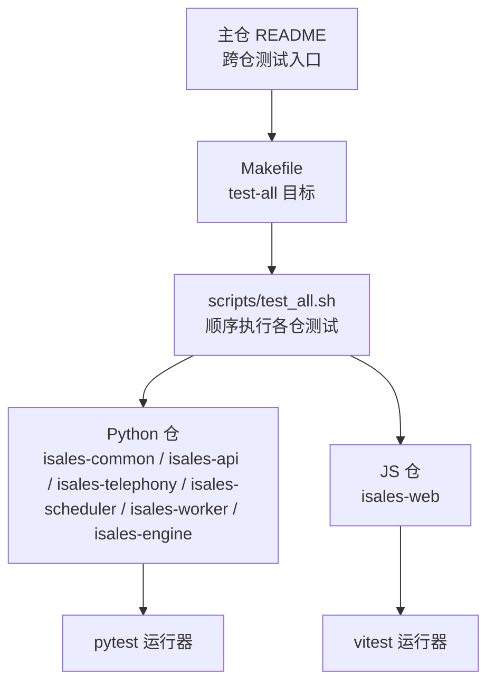
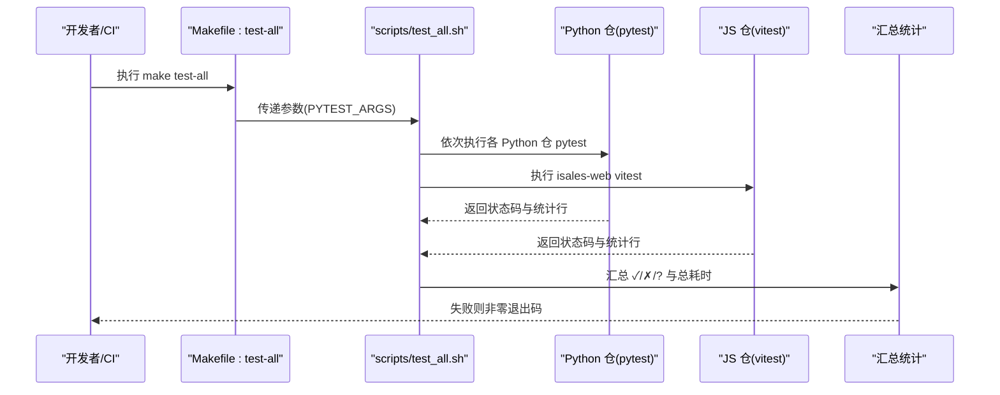
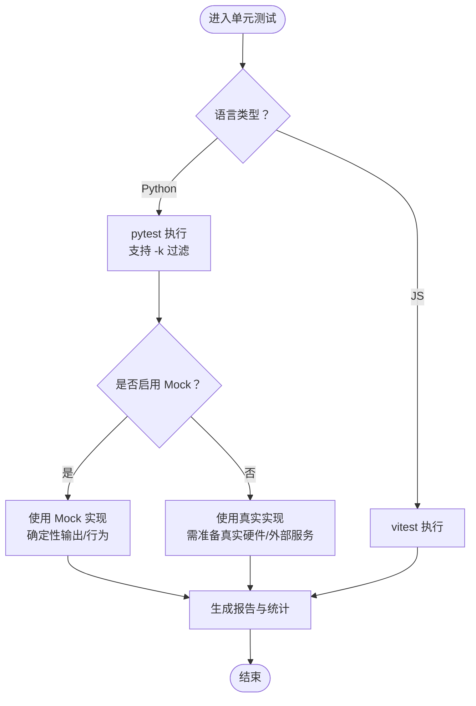
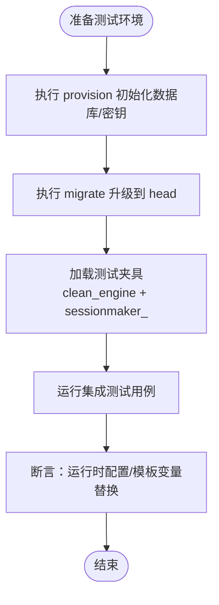
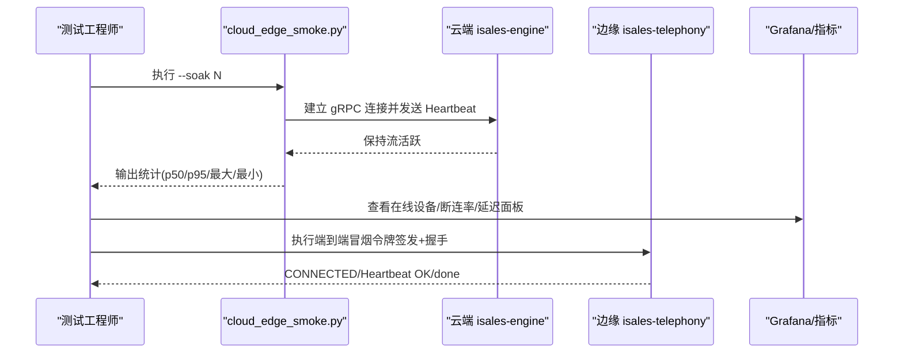
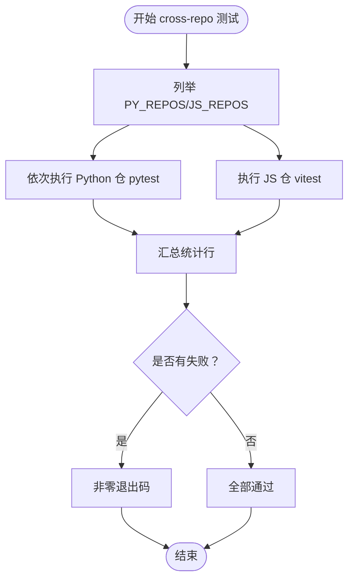
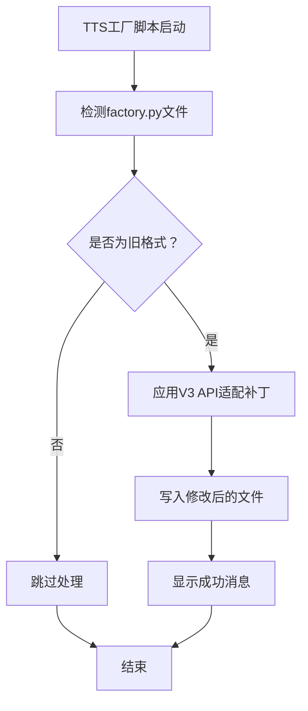
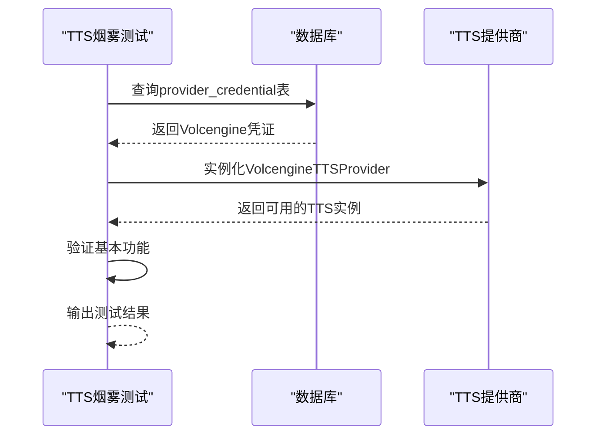
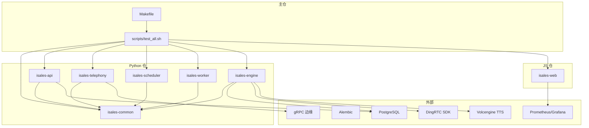

# 测试策略

<cite>
**本文引用的文件**
- [README.md](file://README.md)
- [DESIGN.md](file://DESIGN.md)
- [Makefile](file://Makefile)
- [scripts/test_all.sh](file://scripts/test_all.sh)
- [deploy/linux/scripts/check_env_consistency.py](file://deploy/linux/scripts/check_env_consistency.py)
- [openspec/changes/archive/2026-05-09-impl-modem-controller/specs/device-hardware/spec.md](file://openspec/changes/archive/2026-05-09-impl-modem-controller/specs/device-hardware/spec.md)
- [openspec/changes/archive/2026-05-17-impl-real-at/design.md](file://openspec/changes/archive/2026-05-17-impl-real-at/design.md)
- [openspec/changes/cloud-edge-grpc-keepalive/specs/service-communication/spec.md](file://openspec/changes/cloud-edge-grpc-keepalive/specs/service-communication/spec.md)
- [openspec/changes/prompt-template-vars/tasks.md](file://openspec/changes/prompt-template-vars/tasks.md)
- [openspec/changes/archive/2026-05-07-impl-engine/design.md](file://openspec/changes/archive/2026-05-07-impl-engine/design.md)
- [deploy/cloud/STATE.md](file://deploy/cloud/STATE.md)
- [deploy/cloud/monitoring/grafana/isales-cloud-edge.json.placeholder](file://deploy/cloud/monitoring/grafana/isales-cloud-edge.json.placeholder)
- [deploy/monitoring/grafana/isales-overview.json](file://deploy/monitoring/grafana/isales-overview.json)
- [deploy/linux/scripts/provision.sh](file://deploy/linux/scripts/provision.sh)
- [deploy/macos/scripts/provision.sh](file://deploy/macos/scripts/provision.sh)
- [deploy/linux/scripts/migrate.sh](file://deploy/linux/scripts/migrate.sh)
- [deploy/macos/scripts/migrate.sh](file://deploy/macos/scripts/migrate.sh)
- [deploy/cloud/env/engine.env](file://deploy/cloud/env/engine.env)
- [deploy/env/engine.env.example](file://deploy/env/engine.env.example)
- [fix_factory.py](file://fix_factory.py)
- [fix_tts.py](file://fix_tts.py)
- [gen_token.py](file://gen_token.py)
- [test_tts_smoke.py](file://test_tts_smoke.py)
- [test_import.py](file://test_import.py)
</cite>

## 更新摘要
**所做更改**
- 新增TTS工厂脚本和令牌生成脚本章节，详细介绍Volcengine TTS提供商的集成测试能力
- 更新TTS提供商集成测试策略，涵盖V3 API适配和工厂模式重构
- 增强烟雾测试脚本的使用说明，提供完整的TTS集成测试流程
- 补充测试数据准备和清理机制，特别是针对Volcengine TTS提供商的凭证管理

## 目录
1. [简介](#简介)
2. [项目结构](#项目结构)
3. [核心组件](#核心组件)
4. [架构总览](#架构总览)
5. [详细组件分析](#详细组件分析)
6. [依赖关系分析](#依赖关系分析)
7. [性能考虑](#性能考虑)
8. [故障排查指南](#故障排查指南)
9. [结论](#结论)
10. [附录](#附录)

## 简介
本测试策略文档面向 iSales 项目的跨仓库测试体系，围绕单元测试、集成测试、端到端测试的组织与执行方法展开，并结合项目实际的多仓结构与真实硬件/外部服务依赖，给出 Mock 测试策略、测试数据准备与清理机制、性能与压力测试建议、持续集成中的自动化流程以及覆盖率与质量门禁建议。文档内容严格基于仓库现有文件与脚本进行归纳总结，避免臆造信息。

**更新** 新增TTS工厂脚本、令牌生成脚本和烟雾测试脚本的详细说明，增强TTS提供商集成测试能力。

## 项目结构
iSales 采用"主仓 + 多个子仓"的分布式代码组织，主仓 README 明确列出各子仓职责与测试执行入口。测试策略以主仓 Makefile 与脚本为统一编排中心，按语言类别分别调用 pytest（Python）与 vitest（JavaScript/Vue）。



**图表来源**
- [README.md:46-56](file://README.md#L46-L56)
- [Makefile:3-6](file://Makefile#L3-L6)
- [scripts/test_all.sh:18-29](file://scripts/test_all.sh#L18-L29)

**章节来源**
- [README.md:3-14](file://README.md#L3-L14)
- [README.md:46-56](file://README.md#L46-L56)
- [Makefile:1-6](file://Makefile#L1-L6)
- [scripts/test_all.sh:1-145](file://scripts/test_all.sh#L1-L145)

## 核心组件
- 跨仓库测试编排器：主仓 Makefile 的 test-all 目标与 scripts/test_all.sh 脚本，负责顺序执行各子仓测试并汇总结果。
- 语言测试执行器：
  - Python 仓：pytest（通过 venv 中的 python -m pytest 调用）。
  - JS 仓：vitest（通过 npx vitest run 调用）。
- Mock 策略与硬件/外部服务隔离：通过环境变量与配置切换 Mock/真实路径，保证测试可重复与可隔离。
- 测试数据与基础设施：数据库初始化与迁移脚本，配合测试库与 Alembic 升级，支撑集成测试与端到端测试的数据基础。
- 监控与可观测性：Grafana 面板与 Prometheus 指标，用于性能回归与稳定性验证。

**更新** 新增TTS工厂脚本和令牌生成脚本，提供Volcengine TTS提供商的集成测试支持。

**章节来源**
- [Makefile:3-6](file://Makefile#L3-L6)
- [scripts/test_all.sh:39-79](file://scripts/test_all.sh#L39-L79)
- [scripts/test_all.sh:81-118](file://scripts/test_all.sh#L81-L118)
- [openspec/changes/archive/2026-05-17-impl-real-at/design.md:125-136](file://openspec/changes/archive/2026-05-17-impl-real-at/design.md#L125-L136)
- [openspec/changes/archive/2026-05-07-impl-engine/design.md:214-224](file://openspec/changes/archive/2026-05-07-impl-engine/design.md#L214-L224)

## 架构总览
下图展示跨仓库测试的整体流程：主仓统一触发 → 子仓按语言分类执行 → 输出汇总与失败列表 → 失败即终止 CI。



**图表来源**
- [Makefile:3-6](file://Makefile#L3-L6)
- [scripts/test_all.sh:120-126](file://scripts/test_all.sh#L120-L126)
- [scripts/test_all.sh:130-144](file://scripts/test_all.sh#L130-L144)

**章节来源**
- [Makefile:1-6](file://Makefile#L1-L6)
- [scripts/test_all.sh:1-145](file://scripts/test_all.sh#L1-L145)

## 详细组件分析

### 单元测试（Unit Tests）
- 组织方式：各子仓内部按模块划分测试文件，使用 pytest 进行执行。主仓脚本通过 -m pytest 调用，支持过滤参数透传。
- Mock 策略：
  - 引擎 Mock LLM：通过关键字驱动的确定性输出，便于构造稳定测试用例，且可在接入真实 LLM 时仅替换 Provider。
  - AT 设备：支持 Mock/真实 SerialATClient 的切换，便于在无真硬件环境下验证状态机与 IPC。
- 覆盖范围：针对核心模块（状态机、AI 管线、设备硬件、调度与工作器等）进行单元级验证。



**图表来源**
- [scripts/test_all.sh:64](file://scripts/test_all.sh#L64)
- [openspec/changes/archive/2026-05-07-impl-engine/design.md:214-224](file://openspec/changes/archive/2026-05-07-impl-engine/design.md#L214-L224)
- [openspec/changes/archive/2026-05-17-impl-real-at/design.md:125-136](file://openspec/changes/archive/2026-05-17-impl-real-at/design.md#L125-L136)

**章节来源**
- [scripts/test_all.sh:39-79](file://scripts/test_all.sh#L39-L79)
- [openspec/changes/archive/2026-05-07-impl-engine/design.md:214-224](file://openspec/changes/archive/2026-05-07-impl-engine/design.md#L214-L224)
- [openspec/changes/archive/2026-05-17-impl-real-at/design.md:125-136](file://openspec/changes/archive/2026-05-17-impl-real-at/design.md#L125-L136)

### 集成测试（Integration Tests）
- 数据库与迁移：通过 provision 与 migrate 脚本初始化数据库与密钥，配合 Alembic 升级至 head，保障测试具备一致的数据库状态。
- 真实 PG 集成示例：prompt-template-vars 变更中明确使用了"真 PG + clean_engine fixture + sessionmaker_"的组合，验证运行时配置加载与模板变量替换。
- 设备心跳与失联探测：device-hardware 规范定义了心跳频率与 watchdog 失联探测逻辑，可作为集成测试的观测点与断言依据。



**图表来源**
- [deploy/linux/scripts/provision.sh:143-177](file://deploy/linux/scripts/provision.sh#L143-L177)
- [deploy/macos/scripts/provision.sh:225-256](file://deploy/macos/scripts/provision.sh#L225-L256)
- [deploy/linux/scripts/migrate.sh:44-72](file://deploy/linux/scripts/migrate.sh#L44-L72)
- [deploy/macos/scripts/migrate.sh:44-72](file://deploy/macos/scripts/migrate.sh#L44-L72)
- [openspec/changes/prompt-template-vars/tasks.md:32-38](file://openspec/changes/prompt-template-vars/tasks.md#L32-L38)
- [openspec/changes/archive/2026-05-09-impl-modem-controller/specs/device-hardware/spec.md:17-20](file://openspec/changes/archive/2026-05-09-impl-modem-controller/specs/device-hardware/spec.md#L17-L20)

**章节来源**
- [openspec/changes/prompt-template-vars/tasks.md:32-38](file://openspec/changes/prompt-template-vars/tasks.md#L32-L38)
- [openspec/changes/archive/2026-05-09-impl-modem-controller/specs/device-hardware/spec.md:1-20](file://openspec/changes/archive/2026-05-09-impl-modem-controller/specs/device-hardware/spec.md#L1-L20)
- [deploy/linux/scripts/provision.sh:143-177](file://deploy/linux/scripts/provision.sh#L143-L177)
- [deploy/macos/scripts/provision.sh:225-256](file://deploy/macos/scripts/provision.sh#L225-L256)
- [deploy/linux/scripts/migrate.sh:44-72](file://deploy/linux/scripts/migrate.sh#L44-L72)
- [deploy/macos/scripts/migrate.sh:44-72](file://deploy/macos/scripts/migrate.sh#L44-L72)

### 端到端测试（End-to-End Tests）
- 端到端冒烟与 Soak 验证：cloud-edge-grpc-keepalive 规范提供了 --soak 参数的 smoke 工具，用于长时间连接稳定性验证，并输出统计指标。
- 云端边缘链路验证：STATE.md 提供了云端 ECS 服务状态、数据库表数量、gRPC 可达性与端到端冒烟验证步骤，形成可重复的 E2E 验证流程。
- Web 管理端冒烟：web 管理端 UI 重构验收中包含浏览器交互链路验证，确保路由、鉴权与关键业务流程在真实环境中可用。



**图表来源**
- [openspec/changes/cloud-edge-grpc-keepalive/specs/service-communication/spec.md:59-88](file://openspec/changes/cloud-edge-grpc-keepalive/specs/service-communication/spec.md#L59-L88)
- [deploy/cloud/STATE.md:765-802](file://deploy/cloud/STATE.md#L765-L802)
- [deploy/cloud/monitoring/grafana/isales-cloud-edge.json.placeholder:1-33](file://deploy/cloud/monitoring/grafana/isales-cloud-edge.json.placeholder#L1-L33)
- [deploy/monitoring/grafana/isales-overview.json:48-86](file://deploy/monitoring/grafana/isales-overview.json#L48-L86)

**章节来源**
- [openspec/changes/cloud-edge-grpc-keepalive/specs/service-communication/spec.md:59-88](file://openspec/changes/cloud-edge-grpc-keepalive/specs/service-communication/spec.md#L59-L88)
- [deploy/cloud/STATE.md:765-802](file://deploy/cloud/STATE.md#L765-L802)
- [deploy/cloud/monitoring/grafana/isales-cloud-edge.json.placeholder:1-33](file://deploy/cloud/monitoring/grafana/isales-cloud-edge.json.placeholder#L1-L33)
- [deploy/monitoring/grafana/isales-overview.json:48-86](file://deploy/monitoring/grafana/isales-overview.json#L48-L86)

### 跨仓库测试（Cross-Repo Testing）
- 统一编排：主仓 Makefile 的 test-all 目标与 scripts/test_all.sh 顺序执行 isales-common、isales-api、isales-telephony、isales-scheduler、isales-worker、isales-engine（Python）与 isales-web（JS）。
- 参数透传：支持将 pytest 过滤参数（如 -k）透传到各仓执行，便于按模块或关键字筛选测试。
- 结果汇总：逐仓输出统计行，最终汇总通过/失败/跳过数量与总耗时，任一失败即非零退出码，便于 CI 质量门禁。



**图表来源**
- [scripts/test_all.sh:18-29](file://scripts/test_all.sh#L18-L29)
- [scripts/test_all.sh:120-126](file://scripts/test_all.sh#L120-L126)
- [scripts/test_all.sh:130-144](file://scripts/test_all.sh#L130-L144)
- [Makefile:3-6](file://Makefile#L3-L6)

**章节来源**
- [scripts/test_all.sh:1-145](file://scripts/test_all.sh#L1-L145)
- [Makefile:1-6](file://Makefile#L1-L6)

### Mock 测试策略（真实硬件与外部 API）
- AT 设备路径切换：通过环境变量控制是否允许使用真实 AT 客户端，支持在 CI 中保留 Mock 路径，同时允许在具备真硬件时启用真实路径。
- 引擎 Mock LLM：根据 prompt 关键字返回确定性输出，便于构造稳定、可重复的单元测试。
- 设备心跳与失联探测：通过规范定义心跳频率与 watchdog 失联探测，可在测试中注入离线状态或异常信号强度，验证状态机与工作器的正确性。

**更新** 新增TTS提供商的Mock策略，支持Volcengine TTS V3 API的工厂模式重构和令牌生成。

**章节来源**
- [openspec/changes/archive/2026-05-17-impl-real-at/design.md:125-136](file://openspec/changes/archive/2026-05-17-impl-real-at/design.md#L125-L136)
- [openspec/changes/archive/2026-05-07-impl-engine/design.md:214-224](file://openspec/changes/archive/2026-05-07-impl-engine/design.md#L214-L224)
- [openspec/changes/archive/2026-05-09-impl-modem-controller/specs/device-hardware/spec.md:1-20](file://openspec/changes/archive/2026-05-09-impl-modem-controller/specs/device-hardware/spec.md#L1-L20)

### 测试数据准备与清理
- 数据库准备：provision 脚本负责创建数据库与角色、生成密钥；migrate 脚本负责将数据库升级到最新版本，确保测试具备一致的 schema。
- 测试库与夹具：prompt-template-vars 示例展示了使用"真 PG + clean_engine + sessionmaker_"的夹具组合，实现测试数据的可控注入与清理。
- 清理机制：集成测试通常在测试结束后清理临时数据或回滚事务，确保多轮测试互不影响。

**更新** 新增Volcengine TTS提供商的凭证管理，支持从数据库读取加密凭证和生成测试令牌。

**章节来源**
- [deploy/linux/scripts/provision.sh:143-177](file://deploy/linux/scripts/provision.sh#L143-L177)
- [deploy/macos/scripts/provision.sh:225-256](file://deploy/macos/scripts/provision.sh#L225-L256)
- [deploy/linux/scripts/migrate.sh:44-72](file://deploy/linux/scripts/migrate.sh#L44-L72)
- [deploy/macos/scripts/migrate.sh:44-72](file://deploy/macos/scripts/migrate.sh#L44-L72)
- [openspec/changes/prompt-template-vars/tasks.md:32-38](file://openspec/changes/prompt-template-vars/tasks.md#L32-L38)

### 性能测试与压力测试
- Soak 与稳定性：cloud-edge-grpc-keepalive 规范提供 --soak 参数的 smoke 工具，用于长时间连接稳定性验证，并输出 p50/p95 等统计指标。
- 监控面板：Grafana 面板包含连接率、错误日志、设备在线数、断连率、媒体平面缓冲区与延迟等指标，可用于性能回归与压力测试后的观测。
- 建议实践：
  - 使用 --soak 进行长时间稳定性验证，记录连接存活时间分布。
  - 在高并发拨号场景下，结合 Prometheus 指标观察数据库连接数、Redis 操作速率与 CPU/内存占用。
  - 将关键阶段（如首次 TTS/ASR/LLM 首 token）纳入 P50/P95 观测，建立性能基线。

**更新** 新增TTS提供商性能测试，重点关注Volcengine TTS V3 API的响应时间和吞吐量。

**章节来源**
- [openspec/changes/cloud-edge-grpc-keepalive/specs/service-communication/spec.md:59-88](file://openspec/changes/cloud-edge-grpc-keepalive/specs/service-communication/spec.md#L59-L88)
- [deploy/cloud/monitoring/grafana/isales-cloud-edge.json.placeholder:1-33](file://deploy/cloud/monitoring/grafana/isales-cloud-edge.json.placeholder#L1-L33)
- [deploy/monitoring/grafana/isales-overview.json:48-86](file://deploy/monitoring/grafana/isales-overview.json#L48-L86)

### 持续集成中的测试自动化
- 质量门禁：scripts/test_all.sh 在检测到失败时非零退出，便于 CI 将其作为硬门禁。
- 环境一致性检查：deploy-check 目标运行 shellcheck 并校验 env 模板与 README 文档中的变量列表一致性，减少因环境差异导致的测试波动。
- OpenSpec 规范校验：spec-validate 目标运行 openspec validate 与 DingRTC 版本一致性检查，确保规范层面的质量。

**更新** 新增TTS工厂脚本和令牌生成脚本的CI集成，确保TTS提供商的自动测试流程。

**章节来源**
- [scripts/test_all.sh:140-144](file://scripts/test_all.sh#L140-L144)
- [Makefile:19-29](file://Makefile#L19-L29)
- [Makefile:8-17](file://Makefile#L8-L17)
- [deploy/linux/scripts/check_env_consistency.py:55-80](file://deploy/linux/scripts/check_env_consistency.py#L55-L80)

### TTS提供商集成测试

**新增** 本节详细介绍Volcengine TTS提供商的集成测试策略，包括工厂脚本、令牌生成和烟雾测试的完整流程。

#### TTS工厂脚本（fix_factory.py）
TTS工厂脚本用于适配Volcengine TTS V3 API的工厂模式重构，将旧的参数格式转换为新的API格式：

- **功能特性**：
  - 自动检测并修复factory.py中的build_tts函数
  - 支持从旧版app_key/app_token参数迁移到新版api_key/app_id/access_key
  - 自动设置默认的tts_resource_id参数
  - 提供详细的错误诊断信息

- **使用方法**：
  ```bash
  python fix_factory.py
  ```

- **测试验证**：
  - 执行test_import.py验证TTS提供商导入
  - 运行test_tts_smoke.py进行完整的烟雾测试



**图表来源**
- [fix_factory.py:1-43](file://fix_factory.py#L1-L43)

#### 令牌生成脚本（gen_token.py）
令牌生成脚本用于创建JWT令牌，支持TTS提供商的身份验证：

- **功能特性**：
  - 使用HS256算法生成JWT令牌
  - 包含admin用户身份和长期有效期
  - 直接输出生成的令牌字符串

- **使用方法**：
  ```bash
  python gen_token.py
  ```

- **应用场景**：
  - TTS提供商API调用的身份验证
  - 测试环境的令牌生成
  - CI/CD流程中的自动化令牌管理

#### TTS烟雾测试脚本（test_tts_smoke.py）
烟雾测试脚本提供完整的Volcengine TTS集成测试流程：

- **功能特性**：
  - 验证V3 SSE端点的可用性
  - 从数据库读取真实的TTS凭证
  - 测试TTS提供商实例化
  - 支持多种数据库连接方式

- **测试流程**：
  1. 读取数据库连接配置
  2. 从provider_credential表获取Volcengine凭证
  3. 实例化VolcengineTTSProvider
  4. 验证基本功能可用性

- **使用方法**：
  ```bash
  python test_tts_smoke.py
  ```



**图表来源**
- [test_tts_smoke.py:1-40](file://test_tts_smoke.py#L1-L40)

**章节来源**
- [fix_factory.py:1-43](file://fix_factory.py#L1-L43)
- [gen_token.py:1-4](file://gen_token.py#L1-L4)
- [test_tts_smoke.py:1-40](file://test_tts_smoke.py#L1-L40)
- [test_import.py:1-5](file://test_import.py#L1-L5)

## 依赖关系分析
- 组件耦合：
  - 主仓 Makefile 与脚本对各子仓测试执行具有强依赖，子仓需满足 venv/node_modules 条件。
  - Python 仓之间存在共享模型与 schema（isales-common），集成测试需关注跨仓数据一致性。
- 外部依赖：
  - 数据库：PostgreSQL 与 Alembic 迁移。
  - 监控：Prometheus/Grafana。
  - 硬件/外部 API：AT 设备、gRPC 边缘通道、外部 RTC SDK（通过 dingrtc 版本一致性检查约束）。
  - **新增**：Volcengine TTS提供商，支持V3 API和工厂模式重构。



**图表来源**
- [scripts/test_all.sh:18-29](file://scripts/test_all.sh#L18-L29)
- [Makefile:3-6](file://Makefile#L3-L6)
- [openspec/changes/cloud-edge-grpc-keepalive/specs/service-communication/spec.md:59-88](file://openspec/changes/cloud-edge-grpc-keepalive/specs/service-communication/spec.md#L59-L88)
- [deploy/linux/scripts/provision.sh:143-177](file://deploy/linux/scripts/provision.sh#L143-L177)
- [deploy/macos/scripts/provision.sh:225-256](file://deploy/macos/scripts/provision.sh#L225-L256)
- [Makefile:19-29](file://Makefile#L19-L29)

**章节来源**
- [scripts/test_all.sh:1-145](file://scripts/test_all.sh#L1-L145)
- [Makefile:1-29](file://Makefile#L1-L29)

## 性能考虑
- 基线指标：优先关注首次 TTS/ASR/LLM 首 token 的 P50/P95，以及连接率、断连率、媒体缓冲区满载率等。
- 场景化压测：结合拨号并发、多设备心跳、长连接 Soak 等场景，评估数据库连接池、Redis 读写与 CPU/内存占用。
- 回归策略：将关键指标纳入 CI，设置阈值告警，防止性能回归。

**更新** 新增TTS提供商性能监控，重点关注Volcengine TTS V3 API的响应延迟和吞吐量。

## 故障排查指南
- 跨仓测试失败定位：
  - 查看 scripts/test_all.sh 的失败仓库列表与逐仓统计行，快速定位问题仓。
  - 确认各仓 venv 与 node_modules 是否就绪，必要时重新执行 pip install -e ".[dev]" 与 npm install。
- 环境一致性：
  - 使用 deploy-check 校验 shell 脚本与 env 模板变量列表，确保 README 文档与模板一致。
- 数据库问题：
  - 检查 provision 与 migrate 步骤是否成功，确认数据库角色、库与 Alembic 版本。
- 端到端链路：
  - 使用 cloud_edge_smoke.py 的 --soak 与令牌签发流程验证云端与边缘链路，结合 Grafana 面板观测指标。

**更新** 新增TTS提供商故障排查指南：
- TTS工厂脚本错误：检查factory.py文件权限和目标路径
- 令牌生成失败：验证JWS库安装和密钥配置
- 烟雾测试超时：检查数据库连接和Volcengine API可达性
- 凭证读取失败：确认provider_credential表结构和加密密钥

**章节来源**
- [scripts/test_all.sh:140-144](file://scripts/test_all.sh#L140-L144)
- [Makefile:19-29](file://Makefile#L19-L29)
- [deploy/linux/scripts/check_env_consistency.py:55-80](file://deploy/linux/scripts/check_env_consistency.py#L55-L80)
- [deploy/linux/scripts/provision.sh:143-177](file://deploy/linux/scripts/provision.sh#L143-L177)
- [deploy/macos/scripts/provision.sh:225-256](file://deploy/macos/scripts/provision.sh#L225-L256)
- [deploy/linux/scripts/migrate.sh:44-72](file://deploy/linux/scripts/migrate.sh#L44-L72)
- [deploy/macos/scripts/migrate.sh:44-72](file://deploy/macos/scripts/migrate.sh#L44-L72)
- [deploy/cloud/STATE.md:765-802](file://deploy/cloud/STATE.md#L765-L802)

## 结论
iSales 的测试策略以主仓统一编排为核心，结合语言分类执行、Mock 与真实路径切换、数据库初始化与迁移、以及监控可观测性，形成了覆盖单元、集成与端到端的完整测试体系。通过 CI 质量门禁与 OpenSpec 规范校验，确保测试结果可重复、可追溯、可回归。

**更新** 新增的TTS工厂脚本、令牌生成脚本和烟雾测试脚本显著增强了Volcengine TTS提供商的集成测试能力，提供了完整的V3 API适配、凭证管理和性能验证流程。这些工具确保了TTS服务的稳定性和可靠性，为iSales项目的语音合成功能提供了坚实的测试基础。

## 附录
- 测试覆盖率与质量门禁建议（通用实践，非仓库既有配置）：
  - 单元测试覆盖率：建议核心模块达到中位数以上，关键路径不低于高覆盖率。
  - 集成测试覆盖率：重点覆盖跨仓数据流与外部依赖交互。
  - 质量门禁：CI 中将跨仓测试总通过率与关键指标阈值作为硬门禁；对失败仓库非零退出码，阻断发布。
  - 回归策略：将性能基线纳入 CI，出现回归自动告警并阻断合并。

**更新** 新增TTS提供商测试覆盖率建议：
- TTS工厂脚本：100%的参数映射覆盖率
- 令牌生成：100%的JWT生成成功率
- 烟雾测试：100%的API可达性验证
- 凭证管理：100%的数据库读取准确性