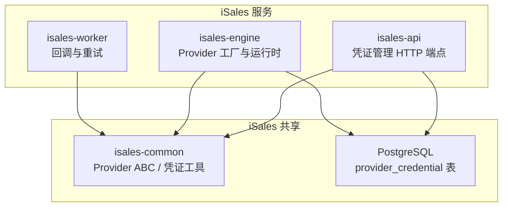
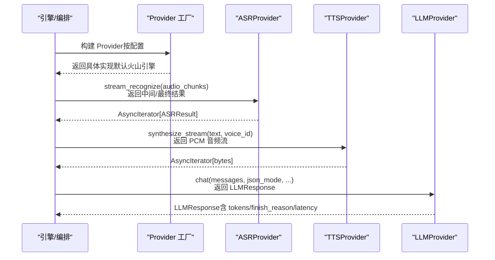
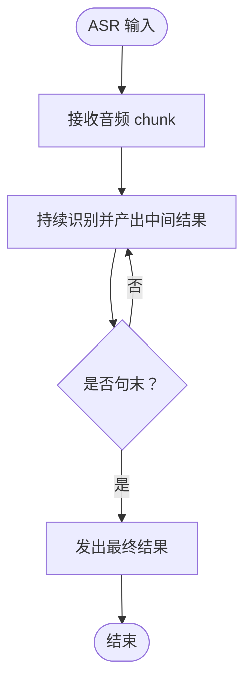
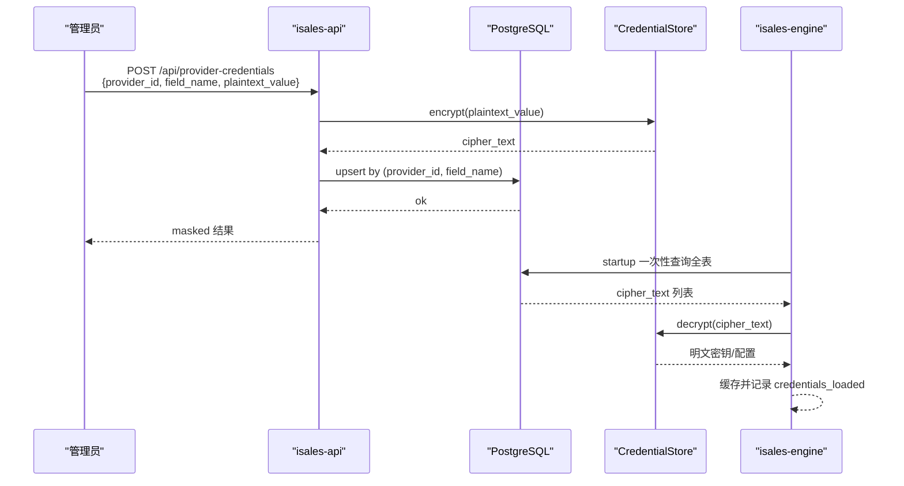
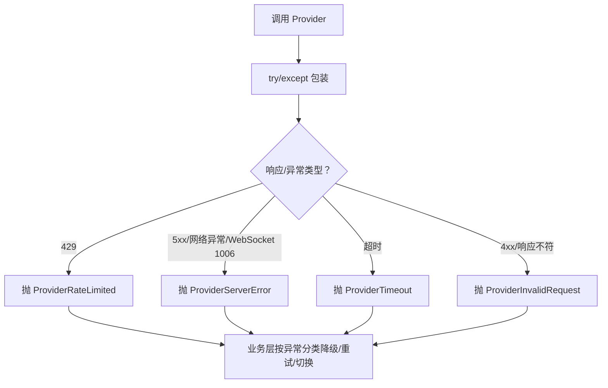
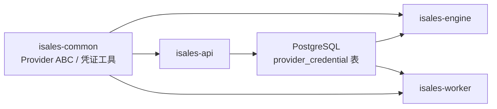

# Provider 集成

<cite>
**本文引用的文件**
- [README.md](file://README.md)
- [DESIGN.md](file://DESIGN.md)
- [provider-abc 规范](file://openspec/specs/provider-abc/spec.md)
- [provider-credential 规范](file://openspec/specs/provider-credential/spec.md)
- [实现提案：引擎真实 Provider](file://openspec/changes/archive/2026-05-08-impl-engine-providers/proposal.md)
- [实现设计：引擎真实 Provider](file://openspec/changes/archive/2026-05-08-impl-engine-providers/design.md)
- [凭证 DB SSOT 实施任务](file://openspec/changes/archive/2026-05-24-impl-provider-credential-db-ssot/tasks.md)
- [凭证 DB SSOT 接受与偏差](file://openspec/changes/archive/2026-05-24-impl-provider-credential-db-ssot/acceptance.md)
- [云环境凭据与密钥说明](file://deploy/cloud/env/README.md)
- [云环境密钥离线备份模板](file://deploy/cloud/env/SECRETS.md.example)
- [云环境部署手册](file://deploy/cloud/README.md)
- [回调签名与重试流程](file://openspec/changes/archive/2026-05-06-impl-worker/tasks.md)
</cite>

## 目录
1. [简介](#简介)
2. [项目结构](#项目结构)
3. [核心组件](#核心组件)
4. [架构总览](#架构总览)
5. [详细组件分析](#详细组件分析)
6. [依赖关系分析](#依赖关系分析)
7. [性能考量](#性能考量)
8. [故障排查指南](#故障排查指南)
9. [结论](#结论)
10. [附录](#附录)

## 简介
本技术指南面向 iSales Provider 集成，围绕 ASR、TTS、LLM 三类 AI 服务的抽象契约与真实实现，系统阐述如下主题：
- 如何基于统一 Provider ABC 实现新的 AI 服务提供商，确保业务代码与供应商解耦
- 凭证管理体系的设计与配置，包括密钥存储、轮换与安全传输机制
- 流式接口的实现要求，涵盖异步音频流处理、文本流式合成与实时响应优化
- 具体集成示例与对接要点（以火山引擎、OpenAI 为例）
- 错误处理机制、超时管理与重试策略的落地细节

## 项目结构
iSales 采用多仓协作与 OpenSpec 规范化管理，Provider 集成相关的关键位置如下：
- Provider 抽象契约与流式接口要求集中在 isales-common 的 provider-abc 规范
- 凭证集中存储与安全传输在 isales-common 的 provider-credential 规范中定义
- 真实 Provider 的实现与工厂装配位于 isales-engine
- isales-api 提供凭证管理的 HTTP 端点
- 部署与运维参考 deploy/cloud/env 与 RUNBOOK

**图示来源**
- [provider-abc 规范](file://openspec/specs/provider-abc/spec.md)
- [provider-credential 规范](file://openspec/specs/provider-credential/spec.md)
- [实现提案：引擎真实 Provider](file://openspec/changes/archive/2026-05-08-impl-engine-providers/proposal.md)

**章节来源**
- [README.md](file://README.md)
- [DESIGN.md](file://DESIGN.md)

## 核心组件
- Provider ABC（ASR/TTS/LLM）：定义统一接口契约，确保实现与业务解耦
- Provider 工厂：按配置构建具体 Provider 实例（默认火山引擎，支持 mock）
- 凭证存储与加载：Fernet 对称加密、DB 单一事实源、启动期装载
- 流式接口：ASR 异步流式识别、TTS 异步流式合成、LLM JSON Mode
- 错误模型：ProviderError 体系（超时/限流/非法请求/服务端错误）
- 回调与重试：Webhook 签名与指数退避重试

**章节来源**
- [provider-abc 规范](file://openspec/specs/provider-abc/spec.md)
- [provider-credential 规范](file://openspec/specs/provider-credential/spec.md)
- [实现提案：引擎真实 Provider](file://openspec/changes/archive/2026-05-08-impl-engine-providers/proposal.md)
- [实现设计：引擎真实 Provider](file://openspec/changes/archive/2026-05-08-impl-engine-providers/design.md)

## 架构总览
Provider 集成遵循“抽象契约 + 集中式凭证 + 工厂装配 + 流式接口 + 统一错误”的整体设计。

**图示来源**
- [provider-abc 规范](file://openspec/specs/provider-abc/spec.md)
- [实现提案：引擎真实 Provider](file://openspec/changes/archive/2026-05-08-impl-engine-providers/proposal.md)

## 详细组件分析

### Provider ABC 与流式接口
- ASR Provider
  - 异步流式识别：输入音频 chunk 流，输出识别结果流（含中间结果与最终标记）
  - 中间结果驱动打断检测：LISTENING 状态下持续推送中间结果，避免仅句末返回
- TTS Provider
  - 异步流式合成：输入文本与音色，输出 PCM 音频字节流
  - 首包尽快返回：首包在 500ms 内开始返回（实现自测）
- LLM Provider
  - chat 接口：messages、json_mode、temperature、top_p、max_tokens
  - JSON Mode 强制：支持原生 JSON Mode 或等效手段保证输出为合法 JSON

**图示来源**
- [provider-abc 规范](file://openspec/specs/provider-abc/spec.md)

**章节来源**
- [provider-abc 规范](file://openspec/specs/provider-abc/spec.md)

### 凭证管理系统（DB SSOT + Fernet）
- 单一事实源：provider_credential 表承载所有 provider 密钥与配置（api_key/app_key/app_token/endpoint/default_model/enabled）
- Fernet 对称加密：使用 ISALES_FERNET_KEY 对称加密，禁止在 env 中存放 provider 密钥
- 启动期装载：isales-engine 在启动期一次性从 DB 装载并解密缓存，失败时可按配置硬失败或 dev/CI 回退至 mock
- Admin CRUD：isales-api 暴露 JWT 鉴权的 CRUD 端点，返回掩码值，写入触发审计（updated_by/updated_at）
- 迁移工具：isales-cred-migrate 支持 import-env/export-env，dry-run 与 apply 分离
- 轮换 Recipe：RUNBOOK-cloud.md 的“凭据轮换”小节覆盖主密钥轮换、单 provider 密钥旋转与回滚路径

**图示来源**
- [provider-credential 规范](file://openspec/specs/provider-credential/spec.md)
- [云环境凭据与密钥说明](file://deploy/cloud/env/README.md)
- [凭证 DB SSOT 实施任务](file://openspec/changes/archive/2026-05-24-impl-provider-credential-db-ssot/tasks.md)

**章节来源**
- [provider-credential 规范](file://openspec/specs/provider-credential/spec.md)
- [云环境凭据与密钥说明](file://deploy/cloud/env/README.md)
- [云环境密钥离线备份模板](file://deploy/cloud/env/SECRETS.md.example)
- [凭证 DB SSOT 实施任务](file://openspec/changes/archive/2026-05-24-impl-provider-credential-db-ssot/tasks.md)
- [凭证 DB SSOT 接受与偏差](file://openspec/changes/archive/2026-05-24-impl-provider-credential-db-ssot/acceptance.md)

### Provider 工厂与默认实现
- 工厂扩展：build_llm/build_asr/build_tts 支持 openai/volcengine/mock，默认值均为 volcengine
- Campaign 级模型切换：role_config.model 作为路由 key，Provider 内部按 model 选择 endpoint/payload
- mock provider：用于测试，忽略 model 字段保持兼容

**章节来源**
- [实现提案：引擎真实 Provider](file://openspec/changes/archive/2026-05-08-impl-engine-providers/proposal.md)

### 错误处理与统一异常模型
- ProviderError 体系：ProviderTimeout/ProviderRateLimited/ProviderInvalidRequest/ProviderServerError
- 触发条件硬契约：HTTP 429/协议限流→ProviderRateLimited；5xx/连接/DNS/SSL/WebSocket 异常→ProviderServerError；超时→ProviderTimeout；4xx/响应不符契约→ProviderInvalidRequest
- 业务层降级：超时触发降级路径（润色失败兜底/默认回复）；限流可触发切换/重试

**图示来源**
- [provider-abc 规范](file://openspec/specs/provider-abc/spec.md)
- [实现设计：引擎真实 Provider](file://openspec/changes/archive/2026-05-08-impl-engine-providers/design.md)

**章节来源**
- [provider-abc 规范](file://openspec/specs/provider-abc/spec.md)
- [实现设计：引擎真实 Provider](file://openspec/changes/archive/2026-05-08-impl-engine-providers/design.md)

### 流式接口实现与实时优化
- ASR：中间结果持续推送，LISTENING 状态下即时驱动打断检测
- TTS：首包尽快返回（spec 要求），实现应自测首包时延
- LLM：chat 接口支持 JSON Mode，保障输出为合法 JSON 字符串
- 引擎实时打断：SPEAKING/FILLER 状态下监听中间结果，命中打断立即取消音频播放并进入 PROCESSING；连续打断计数达到阈值触发短回复或仅听模式

**章节来源**
- [provider-abc 规范](file://openspec/specs/provider-abc/spec.md)
- [实现提案：引擎真实 Provider](file://openspec/changes/archive/2026-05-08-impl-engine-providers/proposal.md)

### 回调签名与重试策略
- 签名机制：callback_config.signing_secret 加密存储；worker 解密后对“时间戳.消息体”计算 HMAC-SHA256，附加 X-Isales-* 请求头
- 重试调度：指数退避重试，HTTP 2xx 成功，4xx 失败不再重试，5xx/超时进入 pending_retry 并递增 retry_count，超过上限 exhausted

**章节来源**
- [回调签名与重试流程](file://openspec/changes/archive/2026-05-06-impl-worker/tasks.md)
- [provider-credential 规范](file://openspec/specs/provider-credential/spec.md)

## 依赖关系分析
- isales-engine 依赖 isales-common 的 Provider ABC 与凭证工具
- isales-api 依赖 isales-common 的凭证工具进行加密/解密与掩码
- isales-worker 依赖凭证工具解密 callback_config.signing_secret
- provider_credential 表为 DB SSOT，isales-engine 与 isales-worker 通过 DB 获取凭据

**图示来源**
- [provider-abc 规范](file://openspec/specs/provider-abc/spec.md)
- [provider-credential 规范](file://openspec/specs/provider-credential/spec.md)

**章节来源**
- [provider-abc 规范](file://openspec/specs/provider-abc/spec.md)
- [provider-credential 规范](file://openspec/specs/provider-credential/spec.md)

## 性能考量
- 流式接口首包时延：TTS 首包应在 500ms 内开始返回，实现应自测并优化
- 中间结果驱动：ASR 中间结果持续推送，有助于 LISTENING 状态下的即时打断判定
- 令牌用量监控：累计 tokens 超预算触发告警事件，便于成本控制
- 重试退避：回调重试采用指数退避，减少对下游压力

**章节来源**
- [provider-abc 规范](file://openspec/specs/provider-abc/spec.md)
- [实现提案：引擎真实 Provider](file://openspec/changes/archive/2026-05-08-impl-engine-providers/proposal.md)
- [回调签名与重试流程](file://openspec/changes/archive/2026-05-06-impl-worker/tasks.md)

## 故障排查指南
- 凭据装载失败
  - 现象：启动时报错 cred_load_failed，或 dev/CI 模式下强制走 mock
  - 排查：确认 ISALES_FERNET_KEY 合法；检查 DB 可达性与 provider_credential 表结构；核对 RUNBOOK 的凭据轮换与回滚步骤
- 超时/限流/非法请求
  - 现象：ProviderTimeout/ProviderRateLimited/ProviderInvalidRequest
  - 排查：根据异常类型区分降级/重试/切换；检查网络/证书/WebSocket 连接；核对请求参数与响应格式
- 回调失败
  - 现象：HTTP 4xx 不再重试；5xx/超时进入 pending_retry
  - 排查：确认 signing_secret 加密正确；核对时间戳与签名头；检查下游服务健康状况

**章节来源**
- [provider-credential 规范](file://openspec/specs/provider-credential/spec.md)
- [实现设计：引擎真实 Provider](file://openspec/changes/archive/2026-05-08-impl-engine-providers/design.md)
- [回调签名与重试流程](file://openspec/changes/archive/2026-05-06-impl-worker/tasks.md)

## 结论
通过 Provider ABC 的抽象契约、DB SSOT 的凭证管理、工厂装配与流式接口实现，iSales 实现了与多家 AI 服务提供商的解耦集成。统一的错误模型与重试策略进一步提升了系统的鲁棒性与可维护性。建议在新增 Provider 时严格遵循上述规范与流程，确保平滑过渡与稳定运行。

## 附录

### 集成步骤速查
- 凭证准备
  - 生成/轮换 ISALES_FERNET_KEY 并备份
  - 使用 isales-cred-migrate 将 env 中的 provider 密钥导入 DB
- Provider 实现
  - 继承对应 ABC，实现流式接口与 JSON Mode
  - 按统一异常模型包装 SDK 原生异常
- 工厂装配
  - 在工厂中注册新 Provider，设置默认值与路由键
- 部署与验证
  - 启动 isales-engine，确认 credentials_loaded
  - 运行集成测试，验证流式接口与实时打断

**章节来源**
- [云环境凭据与密钥说明](file://deploy/cloud/env/README.md)
- [云环境密钥离线备份模板](file://deploy/cloud/env/SECRETS.md.example)
- [provider-abc 规范](file://openspec/specs/provider-abc/spec.md)
- [provider-credential 规范](file://openspec/specs/provider-credential/spec.md)
- [实现提案：引擎真实 Provider](file://openspec/changes/archive/2026-05-08-impl-engine-providers/proposal.md)