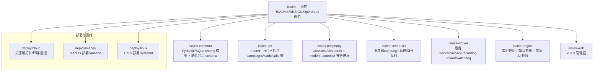
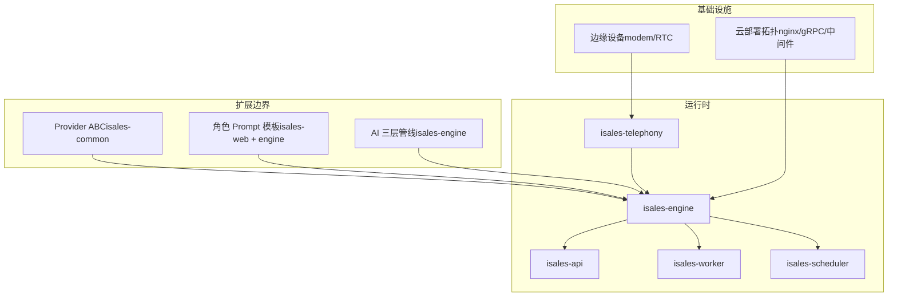
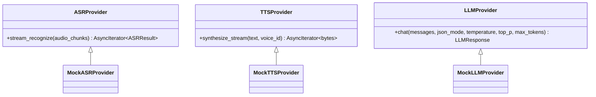
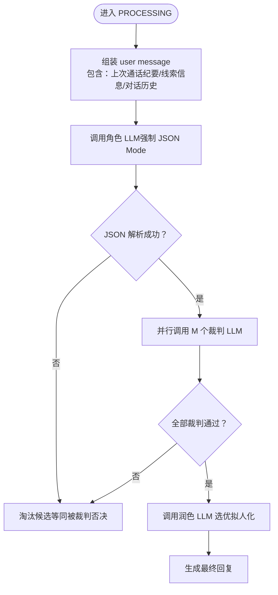
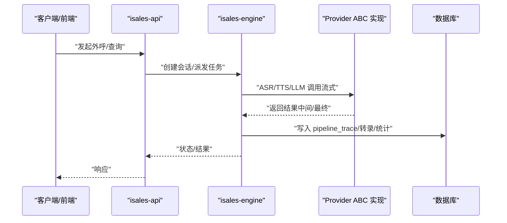
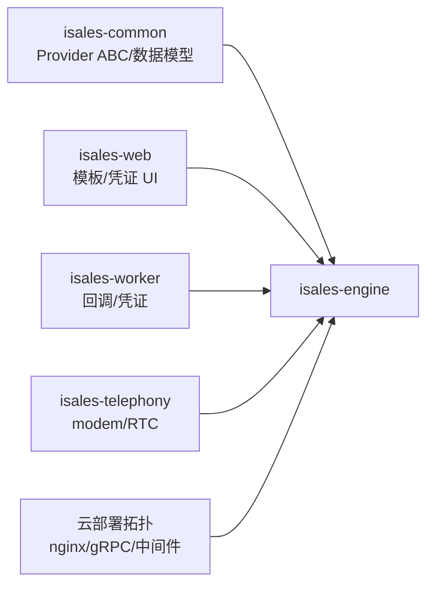

# 扩展开发

<cite>
**本文引用的文件**
- [README.md](file://README.md)
- [DESIGN.md](file://DESIGN.md)
- [provider-abc 规范](file://openspec/specs/provider-abc/spec.md)
- [角色 Prompt 规范](file://openspec/specs/role-prompt/spec.md)
- [AI 三层管线规范](file://openspec/specs/ai-pipeline/spec.md)
- [架构拆分（云边分离）架构规范](file://openspec/changes/arch-cloud-edge-split/specs/architecture/spec.md)
- [部署（云）拓扑说明](file://deploy/cloud/README.md)
- [OpenSpec 变更提案：实现 Provider ABC](file://openspec/changes/archive/2026-05-08-impl-engine-providers/proposal.md)
- [OpenSpec 变更提案：实现 Engine（含 Provider 错误模型）](file://openspec/changes/archive/2026-05-07-impl-engine/proposal.md)
- [OpenSpec 设计：Engine 实现（三层管线编排）](file://openspec/changes/archive/2026-05-07-impl-engine/design.md)
- [OpenSpec 变更任务：凭证数据库 SSOT](file://openspec/changes/archive/2026-05-24-impl-provider-credential-db-ssot/tasks.md)
</cite>

## 目录
1. [简介](#简介)
2. [项目结构](#项目结构)
3. [核心组件](#核心组件)
4. [架构总览](#架构总览)
5. [详细组件分析](#详细组件分析)
6. [依赖分析](#依赖分析)
7. [性能考量](#性能考量)
8. [故障排查指南](#故障排查指南)
9. [结论](#结论)
10. [附录](#附录)

## 简介
本指南面向 iSales 扩展开发者，围绕“插件开发、Provider 集成、自定义功能与第三方集成”展开，重点阐释 Provider ABC 接口的设计理念、实现要求与扩展机制；详解角色提示词系统的自定义配置、模板管理与动态调整；并给出插件架构的设计原理、加载机制与生命周期管理建议。文档同时提供扩展示例、开发模板与集成指南，以及扩展测试方法、性能考量与兼容性保障，帮助开发者构建稳定、可演进的扩展生态。

## 项目结构
iSales 采用多仓协作与 OpenSpec 规范化治理的组织方式，核心服务与能力分布在多个子仓中，统一通过 OpenSpec 的变更提案流程进行演进。整体结构如下：

图示来源
- [README.md:1-86](file://README.md#L1-L86)
- [DESIGN.md:1-75](file://DESIGN.md#L1-L75)

章节来源
- [README.md:1-86](file://README.md#L1-L86)
- [DESIGN.md:1-75](file://DESIGN.md#L1-L75)

## 核心组件
- Provider ABC：定义 ASR/TTS/LLM 三类外部服务的抽象接口契约，集中于 isales-common，isales-engine 的真实实现必须继承并实现全部抽象方法，确保“切换供应商不改业务代码”的可移植性。
- 角色 Prompt 系统：定义每次 LLM 调用的 prompt 组装规则、对话历史注入、跟进上下文与收尾期间的动态调整，支持版本管理与调试回放。
- AI 三层管线：N 个角色 LLM 并行 PK → N×M 个裁判 LLM 并行审查 → 1 个润色 LLM 选优拟人化，覆盖失败兜底、降级路径与 pipeline_trace 写入。
- 架构与部署：云边分离，AI 编排在云端 engine 内执行，边缘仅作媒体通道，部署拓扑清晰，便于扩展与运维。

章节来源
- [provider-abc 规范:1-131](file://openspec/specs/provider-abc/spec.md#L1-L131)
- [角色 Prompt 规范:1-238](file://openspec/specs/role-prompt/spec.md#L1-L238)
- [AI 三层管线规范:1-166](file://openspec/specs/ai-pipeline/spec.md#L1-L166)
- [架构拆分（云边分离）架构规范:125-143](file://openspec/changes/arch-cloud-edge-split/specs/architecture/spec.md#L125-L143)
- [部署（云）拓扑说明:10-53](file://deploy/cloud/README.md#L10-L53)

## 架构总览
iSales 的扩展开发以“接口契约 + 模板系统 + 管线编排 + 云边职责分离”为核心，形成稳定的扩展边界与演进路径。下图展示了扩展开发的关键交互关系：

图示来源
- [provider-abc 规范:1-131](file://openspec/specs/provider-abc/spec.md#L1-L131)
- [角色 Prompt 规范:1-238](file://openspec/specs/role-prompt/spec.md#L1-L238)
- [AI 三层管线规范:1-166](file://openspec/specs/ai-pipeline/spec.md#L1-L166)
- [部署（云）拓扑说明:10-53](file://deploy/cloud/README.md#L10-L53)
- [架构拆分（云边分离）架构规范:125-143](file://openspec/changes/arch-cloud-edge-split/specs/architecture/spec.md#L125-L143)

## 详细组件分析

### Provider ABC 接口设计与扩展机制
- 设计目标
  - 将 ASR/TTS/LLM 三类外部服务的接口契约集中定义在 isales-common，isales-engine 的实现必须继承 ABC，确保“切换供应商不改业务代码”。
  - 提供 mock 测试能力，便于在本地与 CI 中不依赖真实供应商进行单元/集成测试。
- 接口要求
  - ASR Provider：异步流式识别接口，输入音频 chunk 流，输出识别结果流（含中间结果与最终结果标记），中间结果驱动打断检测。
  - TTS Provider：异步流式合成接口，输入文本与音色，输出 PCM 音频字节流，首包尽快返回以降低端到端延迟。
  - LLM Provider：chat 方法，参数包含 messages/json_mode/temperature/top_p/max_tokens；json_mode=True 时实现必须启用供应商的 JSON Mode 或等效约束，满足三层管线对角色 LLM 的强制 JSON 输出要求。
- 统一错误模型
  - 三类 Provider 的实现必须把供应商原生异常包装为 ProviderError 体系（ProviderTimeout/ProviderRateLimited/ProviderInvalidRequest/ProviderServerError），并严格按 HTTP/协议响应定义触发条件，支撑业务层的降级与重试决策。
- 扩展机制
  - 新供应商实现必须继承对应 ABC 并实现全部抽象方法；新增可选参数优先使用带默认值的关键字参数，避免破坏现有实现；破坏性修改必须经 OpenSpec 变更提案并同步升级所有实现并通过契约测试。

图示来源
- [provider-abc 规范:10-131](file://openspec/specs/provider-abc/spec.md#L10-L131)

章节来源
- [provider-abc 规范:1-131](file://openspec/specs/provider-abc/spec.md#L1-L131)
- [OpenSpec 变更提案：实现 Provider ABC:67](file://openspec/changes/archive/2026-05-08-impl-engine-providers/proposal.md#L67)
- [OpenSpec 变更提案：实现 Engine（含 Provider 错误模型）:68-77](file://openspec/changes/archive/2026-05-07-impl-engine/proposal.md#L68-L77)

### 角色提示词系统：自定义配置、模板管理与动态调整
- Prompt 组装规则
  - 每次调用角色 LLM 时，engine 按“system message + 单条 user message”组装；user message 顺序包含：上次通话纪要（跟进时存在）、线索信息、对话历史（AI/用户发言用特定前缀区分，最后一行以 AI: 结尾）。
  - 不使用标准多轮 chat multi-turn，而是把整通对话作为单条 user message 文本传入。
- 模板与版本管理
  - Campaign 完全自定义所有 LLM prompt 内容，系统仅提供模板与工具（v1 命令行 + v2 Web UI 可视化）。
  - prompt_version 表存储历史版本，role_config.current_prompt_version_id 指向当前生效版本；通话开始时把各 LLM 的 prompt_version_id 写入 call_record.prompt_versions，便于调试回放时精准复现。
- 动态调整
  - WRAPPING_UP 期间在原 system prompt 末尾追加收尾指令段落；跟进通话在 system prompt 末尾追加“跟进上下文”段落；prompt_versions 快照包含 wrap_up_appended 标记。
- JSON Mode 强制策略
  - 优先使用 Provider 原生 JSON Mode；不支持时在 system prompt 末尾贴 schema 描述并对响应做后处理，解析失败则淘汰候选。

图示来源
- [角色 Prompt 规范:21-176](file://openspec/specs/role-prompt/spec.md#L21-L176)
- [AI 三层管线规范:7-84](file://openspec/specs/ai-pipeline/spec.md#L7-L84)

章节来源
- [角色 Prompt 规范:1-238](file://openspec/specs/role-prompt/spec.md#L1-L238)
- [AI 三层管线规范:1-166](file://openspec/specs/ai-pipeline/spec.md#L1-L166)

### 插件架构：设计原理、加载机制与生命周期管理
- 设计原理
  - 云边职责分离：AI 编排（ASR/LLM/TTS/多角色 PK/流式管线/垫词/打断决策）全部运行在云端 engine 进程内，边缘仅作媒体通道（PCM 重采样 + Opus 编码 + RTC 推流）。
  - Provider 抽象：通过 Provider ABC 将外部服务接入统一抽象，实现“插件式”替换与扩展。
- 加载机制
  - isales-common 集中定义 Provider ABC 与数据模型；isales-engine 通过依赖注入加载具体 Provider 实现；mock 测试通过 isales_common.providers.testing 提供的 Mock*Provider 适配。
- 生命周期管理
  - 通话生命周期由状态机驱动，engine 在状态转移时记录异常与事件，支持通过 transcript 调试；pipeline_trace 每轮 PROCESSING 完成后写入，异常路径亦保证落库，确保可观测性与可恢复性。

图示来源
- [架构拆分（云边分离）架构规范:125-143](file://openspec/changes/arch-cloud-edge-split/specs/architecture/spec.md#L125-L143)
- [AI 三层管线规范:40-69](file://openspec/specs/ai-pipeline/spec.md#L40-L69)
- [部署（云）拓扑说明:10-53](file://deploy/cloud/README.md#L10-L53)

章节来源
- [架构拆分（云边分离）架构规范:125-143](file://openspec/changes/arch-cloud-edge-split/specs/architecture/spec.md#L125-L143)
- [AI 三层管线规范:1-166](file://openspec/specs/ai-pipeline/spec.md#L1-L166)
- [部署（云）拓扑说明:10-53](file://deploy/cloud/README.md#L10-L53)

### 第三方集成指南：凭证与安全
- 凭证集中化与解密
  - Provider 凭证通过 isales-common 的 CredentialStore 管理，worker 在发送 webhook 前先解密 callback_config.signing_secret，确保签名与传输安全。
- 集成步骤
  - 在 isales-web 中提供 Provider 凭证的列表/按 Provider 查询/新增/删除/刷新提示等 API；
  - 在 isales-worker 中加载凭证并在发送 webhook 前解密；
  - 在 isales-engine 中以相同形态装载凭证，确保三端一致。

章节来源
- [OpenSpec 变更任务：凭证数据库 SSOT:67-72](file://openspec/changes/archive/2026-05-24-impl-provider-credential-db-ssot/tasks.md#L67-L72)

## 依赖分析
- 组件耦合
  - isales-engine 对 isales-common 的 Provider ABC 与数据模型存在强依赖，确保实现与契约一致；
  - isales-web 与 isales-engine 通过 API/模板协同，isales-worker 与 isales-engine 通过回调/凭证协同。
- 外部依赖
  - 云部署拓扑中使用 nginx/gRPC/中间件（PostgreSQL/Redis/OSS/RTC PaaS），边缘设备依赖 modem/RTC SDK。
- 循环依赖规避
  - 通过 isales-common 作为共享契约与数据模型中心，避免服务间循环导入。

图示来源
- [provider-abc 规范:1-131](file://openspec/specs/provider-abc/spec.md#L1-L131)
- [部署（云）拓扑说明:10-53](file://deploy/cloud/README.md#L10-L53)

章节来源
- [provider-abc 规范:1-131](file://openspec/specs/provider-abc/spec.md#L1-L131)
- [部署（云）拓扑说明:10-53](file://deploy/cloud/README.md#L10-L53)

## 性能考量
- 流式接口与延迟
  - ASR/TTS 采用异步流式接口，中间结果驱动打断检测，TTS 首包尽快返回以降低端到端延迟。
- 并行管线与超时
  - 三层管线并行调用，Layer 1 等待全部完成（含超时/异常）后再进入 Layer 2，避免竞态导致 pipeline_trace 字段顺序不稳定；单角色级超时与指数退避重试策略减少尾延迟影响。
- Token 监控与告警
  - 记录并监控 LLM token 用量，超阈值触发告警，避免成本失控。
- 云边分离与媒体通道
  - 边缘仅作媒体通道，AI 编排在云端执行，降低边缘资源占用与网络抖动影响。

章节来源
- [provider-abc 规范:20-47](file://openspec/specs/provider-abc/spec.md#L20-L47)
- [AI 三层管线规范:91-102](file://openspec/changes/archive/2026-05-07-impl-engine/design.md#L91-L102)
- [AI 三层管线规范:40-69](file://openspec/specs/ai-pipeline/spec.md#L40-L69)
- [架构拆分（云边分离）架构规范:125-143](file://openspec/changes/arch-cloud-edge-split/specs/architecture/spec.md#L125-L143)

## 故障排查指南
- Provider 错误分类与降级
  - ProviderTimeout/ProviderRateLimited/ProviderInvalidRequest/ProviderServerError 严格按 HTTP/协议响应定义触发，业务层据此做降级与重试决策。
- pipeline_trace 可观测性
  - 每轮 PROCESSING 完成后写入 pipeline_trace，异常路径亦保证落库；写入失败进行重试并记录日志，不影响通话主路径。
- 状态机异常
  - 非法状态转移抛出 IllegalTransition 异常并记录 transcript 事件，支持前端/运维调试。

章节来源
- [provider-abc 规范:67-107](file://openspec/specs/provider-abc/spec.md#L67-L107)
- [AI 三层管线规范:40-69](file://openspec/specs/ai-pipeline/spec.md#L40-L69)
- [OpenSpec 变更提案：实现 Engine（含 Provider 错误模型）:133-145](file://openspec/changes/archive/2026-05-07-impl-engine/proposal.md#L133-L145)

## 结论
通过 Provider ABC 的统一抽象、角色 Prompt 的模板化与版本化管理、AI 三层管线的并行编排与可观测性设计，以及云边职责分离的部署架构，iSales 为扩展开发提供了清晰的边界与稳定的演进路径。开发者可在不侵入业务逻辑的前提下，快速替换/扩展 Provider、定制角色 Prompt、集成第三方凭证与安全机制，并通过完善的测试与监控保障扩展质量与性能。

## 附录

### 扩展示例与开发模板
- Provider 扩展示例
  - 在 isales-engine/providers 下新增实现类，继承对应 ABC 并实现全部抽象方法；参考 mock 实现进行本地与 CI 测试。
- 角色 Prompt 扩展示例
  - 在 isales-web 中创建/编辑角色 Prompt 模板，保存为新版本；通话开始时写入 prompt_versions 快照，支持调试回放。
- 第三方集成模板
  - 在 isales-web 中提供 Provider 凭证的 CRUD API，在 isales-worker 中加载并解密，在 isales-engine 中以相同形态装载。

章节来源
- [provider-abc 规范:108-131](file://openspec/specs/provider-abc/spec.md#L108-L131)
- [角色 Prompt 规范:150-176](file://openspec/specs/role-prompt/spec.md#L150-L176)
- [OpenSpec 变更任务：凭证数据库 SSOT:67-72](file://openspec/changes/archive/2026-05-24-impl-provider-credential-db-ssot/tasks.md#L67-L72)

### 开发工具链与最佳实践
- OpenSpec 工作流
  - 使用 /opsx:propose → /opsx:apply → /opsx:archive 的变更提案流程，确保变更可追溯与审计。
- 测试与验证
  - 优先使用 isales_common.providers.testing 的 Mock*Provider 进行本地与 CI 测试；通过 pipeline_trace 与 transcript 进行回归验证。
- 兼容性与演进
  - 新增可选参数优先使用带默认值的关键字参数；破坏性修改必须经 OpenSpec 变更提案并同步升级所有实现并通过契约测试。

章节来源
- [README.md:75-85](file://README.md#L75-L85)
- [provider-abc 规范:117-131](file://openspec/specs/provider-abc/spec.md#L117-L131)