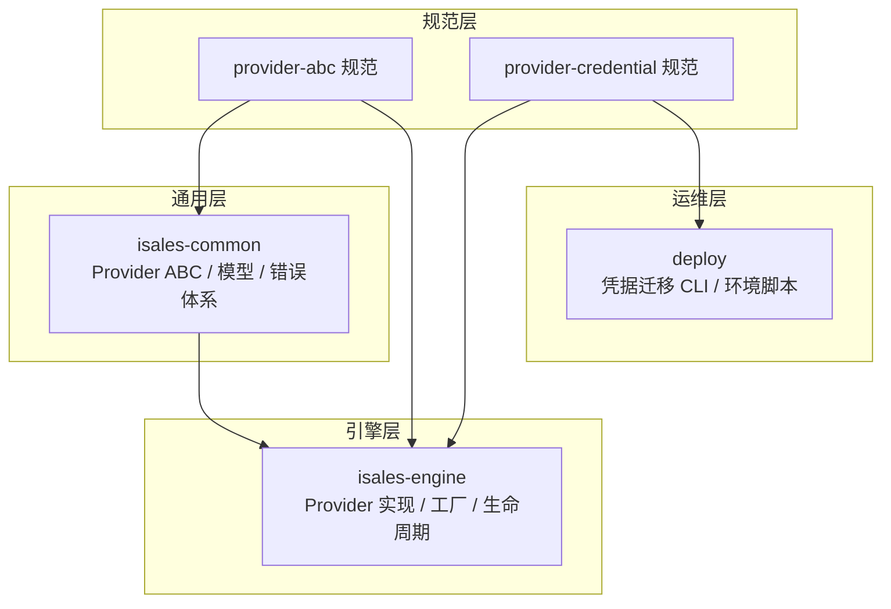
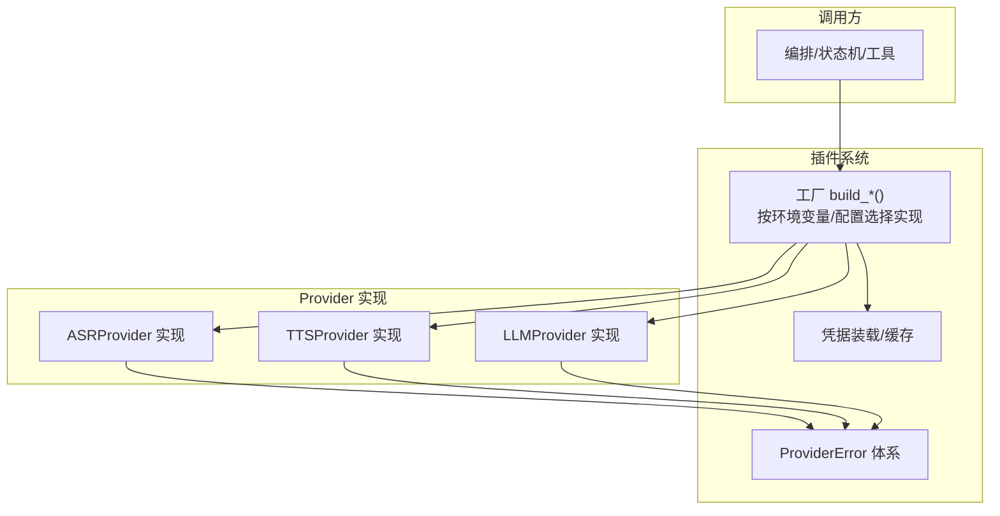
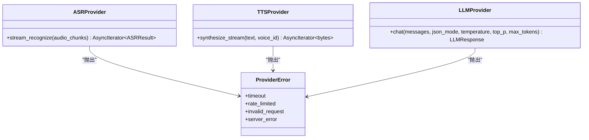
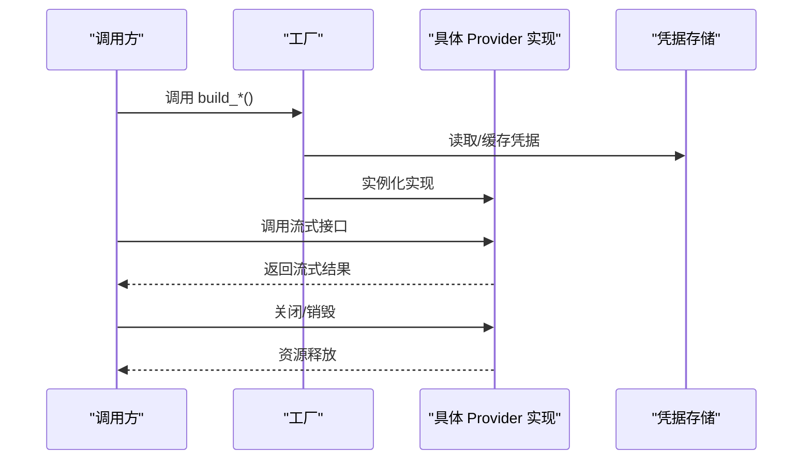
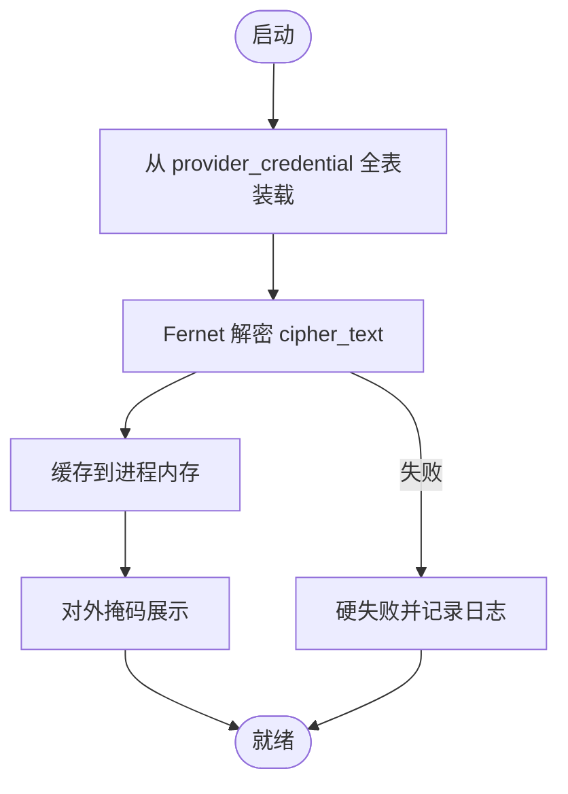
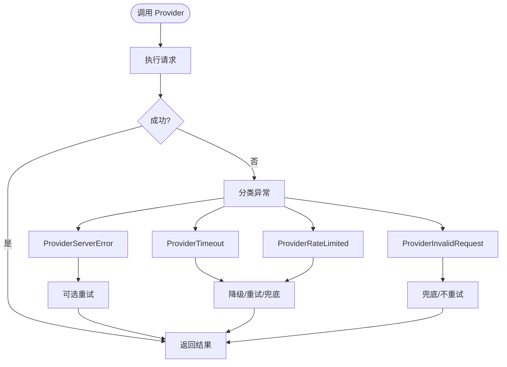
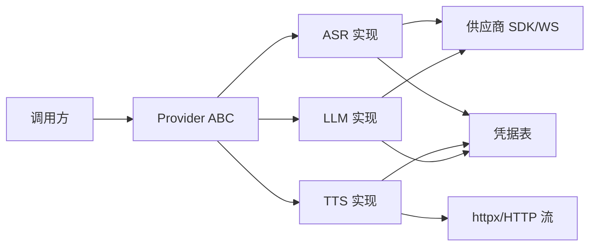

# 插件系统

<cite>
**本文引用的文件**
- [README.md](file://README.md)
- [DESIGN.md](file://DESIGN.md)
- [provider-abc 规范](file://openspec/specs/provider-abc/spec.md)
- [provider-credential 规范](file://openspec/specs/provider-credential/spec.md)
- [变更提案：实现引擎 Provider](file://openspec/changes/archive/2026-05-08-impl-engine-providers/proposal.md)
- [变更设计：实现引擎 Provider](file://openspec/changes/archive/2026-05-08-impl-engine-providers/design.md)
- [变更任务：实现引擎 Provider](file://openspec/changes/archive/2026-05-08-impl-engine-providers/tasks.md)
- [变更提案：初始化 isales-common](file://openspec/changes/archive/2026-05-01-init-isales-common/specs/provider-abc/spec.md)
- [变更任务：初始化 isales-common](file://openspec/changes/archive/2026-05-01-init-isales-common/tasks.md)
</cite>

## 目录
1. [简介](#简介)
2. [项目结构](#项目结构)
3. [核心组件](#核心组件)
4. [架构总览](#架构总览)
5. [组件详解](#组件详解)
6. [依赖关系分析](#依赖关系分析)
7. [性能考量](#性能考量)
8. [故障排查指南](#故障排查指南)
9. [结论](#结论)
10. [附录](#附录)

## 简介
本开发指南面向 iSales 插件系统，聚焦 Provider ABC 接口的抽象与实现、插件的注册与工厂模式、凭据与配置管理、生命周期与错误模型、测试策略与调试技巧、性能优化与版本兼容性，以及热更新与依赖管理建议。文档基于仓库内的 OpenSpec 规范与变更记录进行系统化整理，帮助开发者快速理解并扩展 ASR、TTS、LLM 三类 Provider。

## 项目结构
iSales 采用多仓协作与 OpenSpec 规范驱动的工程组织方式，插件系统的核心契约与实现分布如下：
- 规范层（OpenSpec）：provider-abc 与 provider-credential 的需求与约束定义
- 引擎层（isales-engine）：Provider ABC 的具体实现与工厂模式接入
- 通用层（isales-common）：Provider ABC、模型与错误体系的集中定义
- 运维层（deploy）：凭据导入/导出 CLI、环境变量与部署脚本

**图示来源**
- [provider-abc 规范](file://openspec/specs/provider-abc/spec.md)
- [provider-credential 规范](file://openspec/specs/provider-credential/spec.md)
- [变更提案：实现引擎 Provider](file://openspec/changes/archive/2026-05-08-impl-engine-providers/proposal.md)

**章节来源**
- [README.md: 项目概览与部署指引:1-86](file://README.md#L1-L86)
- [DESIGN.md: 能力索引与 OpenSpec 工作流:1-75](file://DESIGN.md#L1-L75)

## 核心组件
- Provider ABC 抽象基类：ASRProvider、TTSProvider、LLMProvider，定义统一接口与契约
- Provider 错误模型：ProviderError 及子类（ProviderTimeout、ProviderRateLimited、ProviderInvalidRequest、ProviderServerError）
- 凭据与配置：统一凭据表与 Fernet 加密、凭据装载与缓存、凭据迁移 CLI
- 工厂与路由：按环境变量与 Campaign 配置选择 Provider 实现
- 生命周期与测试：启动期装载、运行期隔离、Mock 测试与烟测

**章节来源**
- [provider-abc 规范: Provider ABC 契约:1-131](file://openspec/specs/provider-abc/spec.md#L1-L131)
- [provider-credential 规范: 凭据 DB 与加密:1-211](file://openspec/specs/provider-credential/spec.md#L1-L211)
- [变更提案：实现引擎 Provider: 工厂与路由:28-31](file://openspec/changes/archive/2026-05-08-impl-engine-providers/proposal.md#L28-L31)

## 架构总览
iSales 插件系统围绕“抽象契约 + 工厂路由 + 统一错误 + 凭据安全”构建，形成稳定的插件生态与可演进的实现层。

**图示来源**
- [provider-abc 规范: 统一错误模型:67-107](file://openspec/specs/provider-abc/spec.md#L67-L107)
- [provider-credential 规范: 启动装载与错误处理:27-50](file://openspec/specs/provider-credential/spec.md#L27-L50)
- [变更提案：实现引擎 Provider: 工厂与路由:28-31](file://openspec/changes/archive/2026-05-08-impl-engine-providers/proposal.md#L28-L31)

## 组件详解

### Provider ABC 接口设计与实现要求
- ASRProvider
  - 异步流式识别接口：输入音频 chunk 流，输出识别结果流（含中间结果与最终结果标记）
  - 中间结果驱动打断检测：持续推送中间结果，避免仅句末返回
- TTSProvider
  - 异步流式合成接口：输入文本与音色，输出 PCM 音频字节流
  - 首包尽快返回：首包在 500ms 内开始返回
  - 音色由 voice_id 选择：透传 voice_model.voice_id
- LLMProvider
  - chat 接口：包含 messages、json_mode、temperature、top_p、max_tokens
  - JSON Mode 强制：启用供应商 JSON Mode 或等效约束，保证输出为合法 JSON
  - 普通对话：返回 LLMResponse，包含 content、tokens_in/out、finish_reason、latency_ms

**图示来源**
- [provider-abc 规范: ASR/TTS/LLM 要求:20-66](file://openspec/specs/provider-abc/spec.md#L20-L66)

**章节来源**
- [provider-abc 规范: ASR/TTS/LLM 要求:20-66](file://openspec/specs/provider-abc/spec.md#L20-L66)

### 工厂模式与插件注册/发现/初始化/销毁
- 工厂 build_*：根据环境变量与配置选择具体实现（如 volcengine/openai/mock）
- 注册与发现：通过工厂函数集中注册实现，调用方仅依赖 ABC
- 初始化：启动期装载凭据、初始化连接池/会话、建立流式通道
- 销毁：关闭流式连接、释放资源、清理缓存

**图示来源**
- [变更提案：实现引擎 Provider: 工厂与路由:28-31](file://openspec/changes/archive/2026-05-08-impl-engine-providers/proposal.md#L28-L31)
- [provider-credential 规范: 启动装载与错误处理:27-50](file://openspec/specs/provider-credential/spec.md#L27-L50)

**章节来源**
- [变更提案：实现引擎 Provider: 工厂与路由:28-31](file://openspec/changes/archive/2026-05-08-impl-engine-providers/proposal.md#L28-L31)
- [变更任务：实现引擎 Provider: 任务清单:26-48](file://openspec/changes/archive/2026-05-08-impl-engine-providers/tasks.md#L26-L48)

### 凭据与配置管理
- 凭据 DB：provider_credential 表为单一事实来源，字段含 api_key/app_key/app_token/endpoint/default_model/enabled
- 加密与掩码：统一使用 Fernet 对称加密，对外掩码展示
- 装载策略：启动期一次性装载全表，失败硬失败（可配置 dev/CI 回退）
- HTTP 端点：isales-api 暴露 CRUD，返回值掩码，审计字段 updated_by/updated_at
- 迁移工具：isales-cred-migrate 支持 import-env/export-env，dry-run 与 apply

**图示来源**
- [provider-credential 规范: 启动装载与错误处理:27-50](file://openspec/specs/provider-credential/spec.md#L27-L50)
- [provider-credential 规范: 凭据表结构与字段:82-92](file://openspec/specs/provider-credential/spec.md#L82-L92)
- [provider-credential 规范: API CRUD 与掩码:107-139](file://openspec/specs/provider-credential/spec.md#L107-L139)
- [provider-credential 规范: 迁移 CLI:170-196](file://openspec/specs/provider-credential/spec.md#L170-L196)

**章节来源**
- [provider-credential 规范: 凭据 DB 与加密:6-81](file://openspec/specs/provider-credential/spec.md#L6-L81)
- [provider-credential 规范: 启动装载与错误处理:27-50](file://openspec/specs/provider-credential/spec.md#L27-L50)
- [provider-credential 规范: API CRUD 与掩码:107-139](file://openspec/specs/provider-credential/spec.md#L107-L139)
- [provider-credential 规范: 迁移 CLI:170-196](file://openspec/specs/provider-credential/spec.md#L170-L196)

### 生命周期与错误模型
- 统一错误模型：将供应商原生异常包装为 ProviderError 体系，严格区分触发条件
- 降级与重试：基于异常分类做候选淘汰、默认回复兜底或重试策略
- 超时与限流：超时抛 ProviderTimeout；429 抛 ProviderRateLimited；5xx/网络错误抛 ProviderServerError；4xx/解析失败抛 ProviderInvalidRequest

**图示来源**
- [provider-abc 规范: 统一错误模型:67-107](file://openspec/specs/provider-abc/spec.md#L67-L107)

**章节来源**
- [provider-abc 规范: 统一错误模型:67-107](file://openspec/specs/provider-abc/spec.md#L67-L107)

### 插件开发示例与接口实现模板
- 开发步骤
  - 在 isales-engine 新建实现类，继承对应 ABC（ASRProvider/TTSProvider/LLMProvider）
  - 实现流式接口与错误包装，遵循统一异常分类
  - 在工厂中注册新实现，支持环境变量切换
  - 编写单元测试（MockTransport/aioresponses/fake WebSocket）与可选烟测
- 接口实现模板
  - ASR：实现 stream_recognize，持续产出中间结果，句末标记 is_final
  - TTS：实现 synthesize_stream，首包尽快返回，支持取消
  - LLM：实现 chat，json_mode 时启用供应商 JSON Mode 或等效约束
- 配置管理
  - 通过环境变量控制 Provider 选择与模型切换
  - Campaign 级 role_config.model 作为路由键穿透至实现

**章节来源**
- [变更提案：实现引擎 Provider: 真 Provider 实现与工厂:9-36](file://openspec/changes/archive/2026-05-08-impl-engine-providers/proposal.md#L9-L36)
- [变更设计：实现引擎 Provider: SPEAKING 期间实时打断:91-114](file://openspec/changes/archive/2026-05-08-impl-engine-providers/design.md#L91-L114)

### 测试策略与调试技巧
- 单元测试
  - 使用 httpx.MockTransport/aioresponses/fake WebSocket 隔离真实供应商
  - 覆盖 happy path、超时、429、5xx、4xx、JSON 解析失败、鉴权失败
- 集成测试（烟测）
  - tests/test_real_providers.py 在 ISALES_LIVE_PROVIDER_TESTS=1 时启用
  - 本地验证真接口，CI 默认跳过
- 调试技巧
  - 关注首包延迟、中间结果推送频率、取消传播与缓冲区残留
  - 使用日志定位 ProviderError 分类与降级路径

**章节来源**
- [变更提案：实现引擎 Provider: 测试策略:52-57](file://openspec/changes/archive/2026-05-08-impl-engine-providers/proposal.md#L52-L57)

## 依赖关系分析
- 组件耦合
  - 调用方仅依赖 ABC，耦合度低，便于替换实现
  - 工厂集中管理实现注册与路由，避免散落配置
- 外部依赖
  - 供应商 SDK/WebSocket/httpx/websockets 等
  - 数据库（凭据表）与 Fernet 加密库
- 循环依赖
  - 通过抽象层隔离，避免实现层循环引用

**图示来源**
- [provider-abc 规范: Provider ABC 契约:1-131](file://openspec/specs/provider-abc/spec.md#L1-L131)
- [provider-credential 规范: 凭据 DB 与加密:6-81](file://openspec/specs/provider-credential/spec.md#L6-L81)

**章节来源**
- [provider-abc 规范: Provider ABC 契约:1-131](file://openspec/specs/provider-abc/spec.md#L1-L131)
- [provider-credential 规范: 凭据 DB 与加密:6-81](file://openspec/specs/provider-credential/spec.md#L6-L81)

## 性能考量
- 流式接口与首包延迟
  - ASR：中间结果持续推送，降低端到端延迟
  - TTS：首包在 500ms 内返回，减少用户感知空白
- 取消传播与缓冲区
  - audio_out 支持取消，避免取消后仍有残留
- Token 用量与预算
  - 单通通话累计超预算记录告警，为后续事件总线预留钩子

**章节来源**
- [provider-abc 规范: TTS 首包与取消要求:34-47](file://openspec/specs/provider-abc/spec.md#L34-L47)
- [变更设计：实现引擎 Provider: SPEAKING 期间实时打断:91-127](file://openspec/changes/archive/2026-05-08-impl-engine-providers/design.md#L91-L127)

## 故障排查指南
- 凭据装载失败
  - 现象：启动失败并记录 cred_load_failed
  - 处理：检查 DB 可达性、Fernet 主密钥合法性、凭据完整性
- ProviderError 分类误判
  - 现象：异常未按预期分类导致降级策略偏差
  - 处理：核对 HTTP 状态码与响应体，修正实现中的异常包装
- 真实 Provider 烟测不稳定
  - 现象：网络/配额波动影响测试稳定性
  - 处理：CI 跳过，本地启用 ISALES_LIVE_PROVIDER_TESTS=1 进行验证

**章节来源**
- [provider-credential 规范: 启动装载与错误处理:35-50](file://openspec/specs/provider-credential/spec.md#L35-L50)
- [provider-abc 规范: 统一错误模型:67-107](file://openspec/specs/provider-abc/spec.md#L67-L107)
- [变更提案：实现引擎 Provider: 测试策略:52-57](file://openspec/changes/archive/2026-05-08-impl-engine-providers/proposal.md#L52-L57)

## 结论
iSales 插件系统通过 Provider ABC 抽象、工厂路由、统一错误模型与凭据安全机制，实现了低耦合、可替换、可观测的 Provider 生态。开发者可在遵循契约的前提下快速扩展新实现，并通过完善的测试与运维工具保障稳定性与可演进性。

## 附录
- 版本兼容性
  - ABC 方法签名视作公共 API，破坏性变更需经 OpenSpec 变更提案评估
  - 优先使用带默认值关键字参数扩展，避免破坏现有实现
- 热更新机制
  - v1 通过重启服务 + 环境变量切换；凭据轮换需重启服务
  - 运维参考 RUNBOOK 与迁移 CLI

**章节来源**
- [provider-abc 规范: ABC 接口稳定性:117-130](file://openspec/specs/provider-abc/spec.md#L117-L130)
- [provider-credential 规范: 凭据轮换与迁移:197-210](file://openspec/specs/provider-credential/spec.md#L197-L210)
- [变更设计：实现引擎 Provider: 部署与回滚:178-186](file://openspec/changes/archive/2026-05-08-impl-engine-providers/design.md#L178-L186)