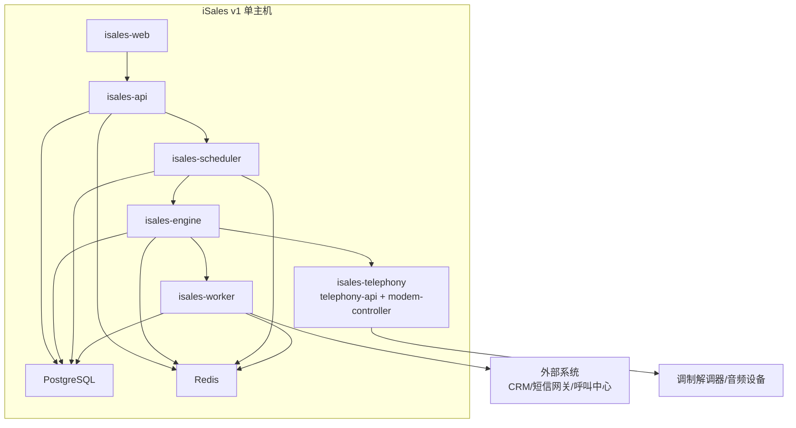
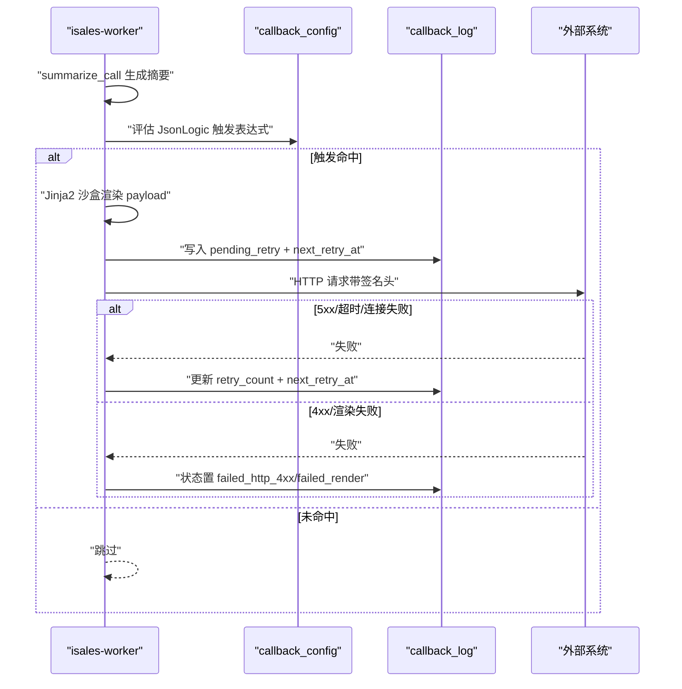
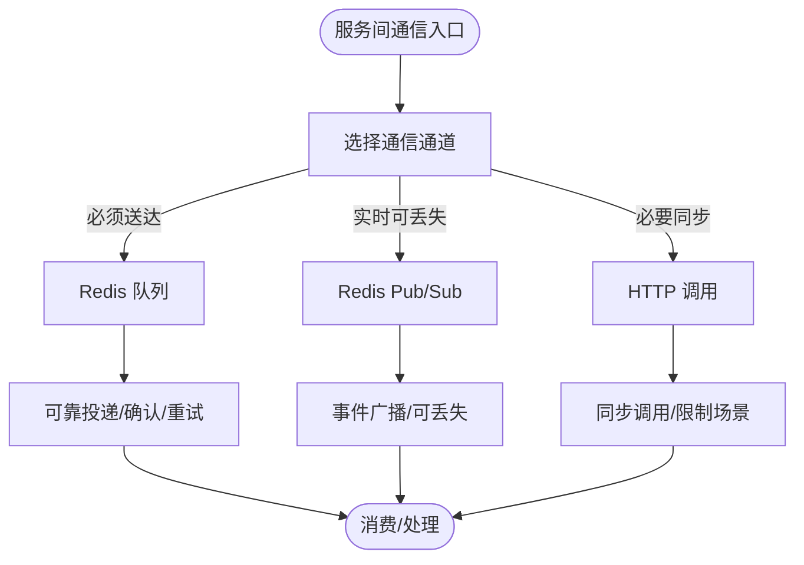
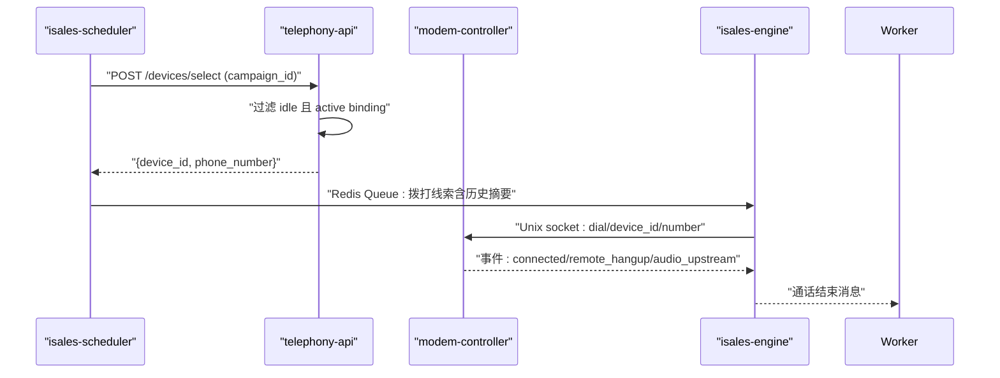
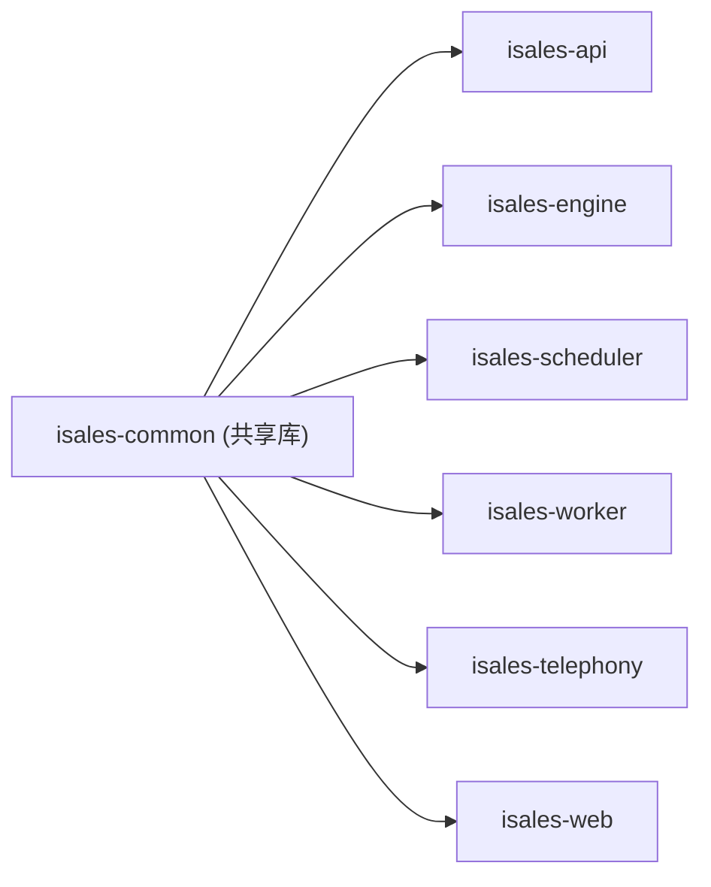

# 第三方集成

<cite>
**本文档引用的文件**
- [README.md](file://README.md)
- [DESIGN.md](file://DESIGN.md)
- [architecture/spec.md](file://openspec/specs/architecture/spec.md)
- [service-communication/spec.md](file://openspec/specs/service-communication/spec.md)
- [webhook-callback/spec.md](file://openspec/specs/webhook-callback/spec.md)
- [device-hardware/spec.md](file://openspec/specs/device-hardware/spec.md)
- [deployment-topology/spec.md](file://openspec/specs/deployment-topology/spec.md)
- [data-model/spec.md](file://openspec/specs/data-model/spec.md)
- [api.env.example](file://deploy/env/api.env.example)
- [engine.env.example](file://deploy/env/engine.env.example)
- [worker.env.example](file://deploy/env/worker.env.example)
- [modem-controller.env.example](file://deploy/env/modem-controller.env.example)
- [cloud/api.env.example](file://deploy/cloud/env/api.env.example)
- [cloud/engine.env.example](file://deploy/cloud/env/engine.env.example)
</cite>

## 目录
1. [简介](#简介)
2. [项目结构](#项目结构)
3. [核心组件](#核心组件)
4. [架构总览](#架构总览)
5. [详细组件分析](#详细组件分析)
6. [依赖分析](#依赖分析)
7. [性能考量](#性能考量)
8. [故障排查指南](#故障排查指南)
9. [结论](#结论)
10. [附录](#附录)

## 简介
本指南面向 iSales 第三方集成开发，围绕外部系统对接、Webhook 回调机制、外部 API 调用与数据交换协议、服务间通信设计模式（消息队列、事件驱动、异步处理）、以及外部设备（调制解调器、音频设备等）接入方法，提供系统化说明与最佳实践。文档基于 OpenSpec 规范与部署拓扑，结合仓库 README 与环境变量示例，帮助读者快速理解并落地集成。

## 项目结构
iSales 采用 7 仓微服务架构，isales-common 作为共享库被其余 6 个服务依赖。v1 单主机部署，服务通过 systemd 管理，PostgreSQL 与 Redis 作为共享基础设施，nginx 反向代理前端静态资源与 API/WebSocket。

```mermaid
graph TB
subgraph "前端"
WEB["isales-web (Vue 3 SPA)"]
end
subgraph "云/边缘"
API["isales-api (管理 API + WS 代理)"]
ENGINE["isales-engine (实时通话引擎)"]
SCHED["isales-scheduler (线索调度)"]
WORKER["isales-worker (异步后处理)"]
TELEPH["isales-telephony (telephony-api + modem-controller)"]
end
REDIS["Redis (队列/缓存/Pub/Sub)"]
PG["PostgreSQL (共享数据库)"]
WEB --> API
API --> SCHED
SCHED --> ENGINE
ENGINE --> WORKER
API <- --> REDIS
ENGINE <- --> REDIS
SCHED <- --> REDIS
WORKER <- --> REDIS
API --> PG
ENGINE --> PG
SCHED --> PG
WORKER --> PG
TELEPH --> PG
ENGINE --> TELEPH
WORKER --> WEB
```

图表来源
- [architecture/spec.md:130-168](file://openspec/specs/architecture/spec.md#L130-L168)
- [service-communication/spec.md:11-24](file://openspec/specs/service-communication/spec.md#L11-L24)

章节来源
- [README.md:1-86](file://README.md#L1-L86)
- [architecture/spec.md:1-168](file://openspec/specs/architecture/spec.md#L1-L168)
- [deployment-topology/spec.md:1-414](file://openspec/specs/deployment-topology/spec.md#L1-L414)

## 核心组件
- Webhook 回调：基于 JsonLogic 触发、Jinja2 沙盒渲染、HMAC-SHA256 签名与指数退避重试，派发至外部系统。
- 服务间通信：Redis 队列用于“必须送达”的工作派发，Redis Pub/Sub 用于“实时可丢失”的事件广播；HTTP 仅用于必要同步调用（如设备选择）。
- 设备与音频：modem-controller 通过 udev/AT 命令与 PCM 音频控制，engine 与 modem-controller 通过本地 Unix socket 通信。
- 数据模型：统一由 isales-common 管理，跨服务共享；回调配置与日志、设备与 SIM 等表均在此规范中定义。

章节来源
- [webhook-callback/spec.md:1-231](file://openspec/specs/webhook-callback/spec.md#L1-L231)
- [service-communication/spec.md:1-150](file://openspec/specs/service-communication/spec.md#L1-L150)
- [device-hardware/spec.md:1-525](file://openspec/specs/device-hardware/spec.md#L1-L525)
- [data-model/spec.md:1-83](file://openspec/specs/data-model/spec.md#L1-L83)

## 架构总览
下图展示 iSales v1 的总体架构与服务边界，以及与外部系统的交互点（Webhook 外部系统、设备硬件、前端 Web）。



图表来源
- [architecture/spec.md:130-168](file://openspec/specs/architecture/spec.md#L130-L168)
- [service-communication/spec.md:11-24](file://openspec/specs/service-communication/spec.md#L11-L24)
- [webhook-callback/spec.md:22-231](file://openspec/specs/webhook-callback/spec.md#L22-L231)
- [device-hardware/spec.md:1-525](file://openspec/specs/device-hardware/spec.md#L1-L525)

## 详细组件分析

### Webhook 回调机制
- 触发时机：通话结束后由 worker 先执行摘要生成与二次校验，再评估 JsonLogic 触发表达式，决定是否派发回调。
- Payload 渲染：使用 Jinja2 沙盒环境渲染模板，禁止危险能力；模板可引用 call_summary、lead、call 等字段。
- 签名与安全：为每个回调配置生成加密存储的 signing_secret，请求头包含时间戳与 HMAC-SHA256 签名；接收方可校验时间窗与签名。
- 重试策略：指数退避间隔与最大尝试次数由配置决定；失败分类（5xx 触发重试，4xx/渲染失败不重试）；重试调度器周期扫描并复用上次请求体。
- 隔离原则：Webhook 派发与 lead 状态流转、engine 主流程完全解耦，失败不影响业务状态。



图表来源
- [webhook-callback/spec.md:5-170](file://openspec/specs/webhook-callback/spec.md#L5-L170)
- [webhook-callback/spec.md:100-179](file://openspec/specs/webhook-callback/spec.md#L100-L179)

章节来源
- [webhook-callback/spec.md:1-231](file://openspec/specs/webhook-callback/spec.md#L1-L231)
- [data-model/spec.md:44-45](file://openspec/specs/data-model/spec.md#L44-L45)

### 服务间通信设计模式
- 通道矩阵：队列用于必须送达的工作派发，Pub/Sub 用于实时可丢失事件；HTTP 仅用于必要同步调用（v1 仅 scheduler → telephony-api）。
- 队列与 Pub/Sub 边界：队列强调可靠性与确认重试，Pub/Sub 强调低延迟与可丢失容忍。
- 全局并发控制：跨实例并发用 Redis 原子计数器；v1 单实例部署下由实现负责。
- API ↔ 前端 WebSocket：isales-api 提供 /ws/calls/{campaign_id}，订阅 Redis Pub/Sub 并 fan-out 给连接客户端；鉴权使用 JWT。
- 容错策略：Redis/DB/modem-controller 短暂不可用时需具备重连与优雅清理；engine 中断重连期间拒绝新拨号但可完成当前通话。



图表来源
- [service-communication/spec.md:31-150](file://openspec/specs/service-communication/spec.md#L31-L150)

章节来源
- [service-communication/spec.md:1-150](file://openspec/specs/service-communication/spec.md#L1-L150)
- [architecture/spec.md:130-168](file://openspec/specs/architecture/spec.md#L130-L168)

### 外部设备集成（调制解调器与音频）
- 自研控制层：modem-controller 负责 udev 监听、AT 命令通道、PCM 音频管道；engine 通过本地 Unix socket 与之通信。
- 设备状态机：从 unknown → detected → registered → idle → dialing → in_call → idle，USB 拔出或错误状态进入 offline/flagged/error。
- SIM 管理：SIM 卡资料化，记录 ICCID/IMSI/手机号/运营商/余额/信号等；device_sim_binding 记录绑定历史与唯一活跃约束。
- 选设备 API：telephony-api 暴露 POST /devices/select，按 idle 且 active binding 选择最早 last_call_at 的设备。
- 心跳与失联探测：modem-controller 每 30s 心跳，worker 每 30s watchdog 将超过 120s 未心跳的设备置 offline。
- Windows/macOS/边缘形态：Windows 通过串口与音频 COM 端口实现 PCM；macOS 通过 PyObjC 绑定接入 AliRTC SDK（dev/QA 形态）；边缘形态支持 dev-no-modem 路径。



图表来源
- [service-communication/spec.md:13-21](file://openspec/specs/service-communication/spec.md#L13-L21)
- [device-hardware/spec.md:106-146](file://openspec/specs/device-hardware/spec.md#L106-L146)
- [device-hardware/spec.md:171-193](file://openspec/specs/device-hardware/spec.md#L171-L193)
- [device-hardware/spec.md:208-236](file://openspec/specs/device-hardware/spec.md#L208-L236)

章节来源
- [device-hardware/spec.md:1-525](file://openspec/specs/device-hardware/spec.md#L1-L525)
- [deployment-topology/spec.md:133-211](file://openspec/specs/deployment-topology/spec.md#L133-L211)

### 外部系统对接示例

#### CRM 系统对接
- 触发条件：基于 JsonLogic 表达式，如“达成目标且为预约”或“勿打命中”等。
- Payload 模板：使用 Jinja2 沙盒渲染，引用 lead、call、call_summary 中的字段生成 CRM 所需 JSON。
- 签名与超时：请求头包含时间戳与 HMAC-SHA256 签名；可按配置覆盖超时。
- 重试策略：指数退避，失败分类与上限控制，避免对 CRM 造成冲击。

章节来源
- [webhook-callback/spec.md:19-127](file://openspec/specs/webhook-callback/spec.md#L19-L127)

#### 短信网关集成
- 触发条件：可基于通话结果（如未接通、忙线）或提取字段（如手机号）触发短信发送。
- Payload 模板：渲染短信内容与目标号码；注意模板渲染失败的处理与日志记录。
- 签名与安全：与 CRM 方案一致，确保请求不可篡改与防重放。

章节来源
- [webhook-callback/spec.md:68-99](file://openspec/specs/webhook-callback/spec.md#L68-L99)

#### 呼叫中心平台连接
- 事件推送：通过回调将通话摘要、提取字段与通话时长等信息推送到呼叫中心。
- 重试与可观测：利用重试调度器与日志记录，确保事件最终送达；结合监控指标进行告警。

章节来源
- [webhook-callback/spec.md:100-133](file://openspec/specs/webhook-callback/spec.md#L100-L133)

### 数据模型与集成契约
- 统一数据模型：所有服务通过 isales-common 的 SQLAlchemy 模型访问数据库，避免跨服务数据网关。
- 回调配置与日志：callback_config 与 callback_log 表承载触发表达式、签名密钥、重试策略与执行日志。
- 设备与 SIM：device、sim_card、device_sim_binding 与 campaign_device 表支撑设备选择与绑定管理。

章节来源
- [data-model/spec.md:1-83](file://openspec/specs/data-model/spec.md#L1-L83)

## 依赖分析
- 7 仓微服务：isales-common、isales-api、isales-engine、isales-scheduler、isales-worker、isales-telephony、isales-web。
- 共享基础设施：PostgreSQL、Redis；isales-common 管理数据库迁移。
- 通信通道：Redis 队列/Pub/Sub；HTTP 仅用于必要同步调用；engine 与 modem-controller 通过本地 IPC 通信。
- 环境变量：集中化注入，跨服务一致性约束（数据库/Redis/JWT/Fernet 密钥）。



图表来源
- [architecture/spec.md:5-44](file://openspec/specs/architecture/spec.md#L5-L44)

章节来源
- [architecture/spec.md:1-168](file://openspec/specs/architecture/spec.md#L1-L168)
- [deployment-topology/spec.md:40-61](file://openspec/specs/deployment-topology/spec.md#L40-L61)

## 性能考量
- 队列与 Pub/Sub 边界：将“必须送达”与“实时可丢失”分离，降低延迟与资源占用。
- 全局并发控制：使用 Redis 原子计数器，避免过载；engine 异常崩溃后需对账清理。
- HTTP 超时与重试：为回调配置提供单条覆盖超时；指数退避避免雪崩。
- 音频与 IPC：v1 音频与控制在同一 IPC 流中，减少分帧开销；Windows/macOS 平台音频路径遵循规范，避免错误路径导致延迟。

章节来源
- [service-communication/spec.md:31-100](file://openspec/specs/service-communication/spec.md#L31-L100)
- [webhook-callback/spec.md:148-156](file://openspec/specs/webhook-callback/spec.md#L148-L156)
- [device-hardware/spec.md:132-170](file://openspec/specs/device-hardware/spec.md#L132-L170)

## 故障排查指南
- Webhook 失败定位：检查 callback_log 状态（pending_retry/pending/success/failed_render/failed_http_4xx/failed_http_5xx/exhausted），核对触发表达式与 payload 渲染错误信息。
- 重试与退避：确认 retry_policy 配置与重试调度器扫描周期；避免对下游系统造成压力。
- 设备与音频：modem-controller 心跳缺失与 watchdog 失联探测；USB 拔出或串口被占用导致的设备 offline。
- JWT 与密钥：isales-api 为唯一签发方，telephony-api 仅验证；HMAC 密钥通过环境变量注入，Fernet 主密钥需跨服务一致。
- 监控与告警：Prometheus 指标与 Grafana 仪表盘，关注队列深度、设备 flagged 比例、回调失败率、PG 连接数等。

章节来源
- [webhook-callback/spec.md:134-179](file://openspec/specs/webhook-callback/spec.md#L134-L179)
- [device-hardware/spec.md:208-236](file://openspec/specs/device-hardware/spec.md#L208-L236)
- [architecture/spec.md:96-129](file://openspec/specs/architecture/spec.md#L96-L129)
- [deployment-topology/spec.md:95-113](file://openspec/specs/deployment-topology/spec.md#L95-L113)

## 结论
iSales 的第三方集成以 OpenSpec 规范为依据，通过标准化的 Webhook 回调、严格的触发与渲染契约、安全的签名与重试策略，以及清晰的服务间通信边界，实现了与 CRM、短信网关、呼叫中心等外部系统的稳健对接。配合设备层自研控制与统一数据模型，可在单主机 v1 部署下快速落地并具备良好的可维护性与扩展性。

## 附录

### 环境变量与部署要点
- 集中式注入：/etc/isales/env/*.env，权限 0640 root:isales；明文 secret 仅落本地，不提交到仓库。
- 跨服务一致性：ISALES_DATABASE_URL、ISALES_REDIS_URL、ISALES_JWT_SECRET、ISALES_FERNET_KEY。
- 服务启停顺序：telephony-api → scheduler → worker → engine → api；engine 重启会中断当前通话。
- 备份与监控：PostgreSQL/Redis 日级别备份；Prometheus 抓取与 Grafana 仪表盘模板。

章节来源
- [deployment-topology/spec.md:40-132](file://openspec/specs/deployment-topology/spec.md#L40-L132)
- [api.env.example:1-14](file://deploy/env/api.env.example#L1-L14)
- [engine.env.example:1-21](file://deploy/env/engine.env.example#L1-L21)
- [worker.env.example:1-20](file://deploy/env/worker.env.example#L1-L20)
- [modem-controller.env.example:1-15](file://deploy/env/modem-controller.env.example#L1-L15)
- [cloud/api.env.example:1-24](file://deploy/cloud/env/api.env.example#L1-L24)
- [cloud/engine.env.example:1-76](file://deploy/cloud/env/engine.env.example#L1-L76)