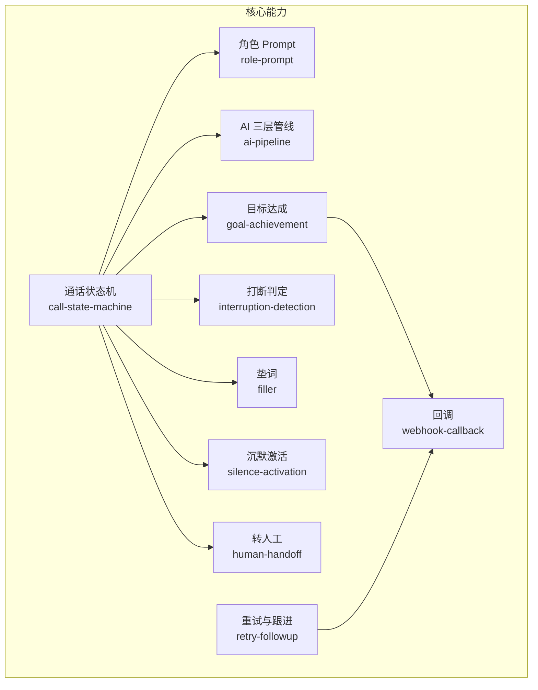
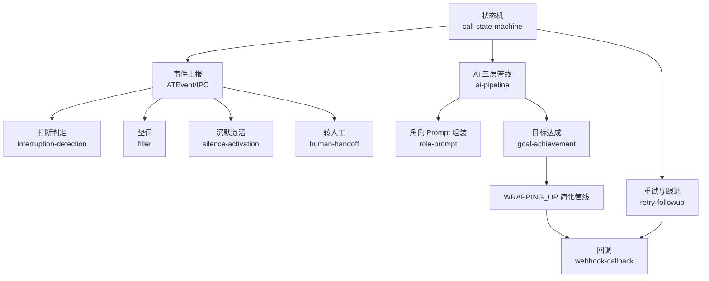
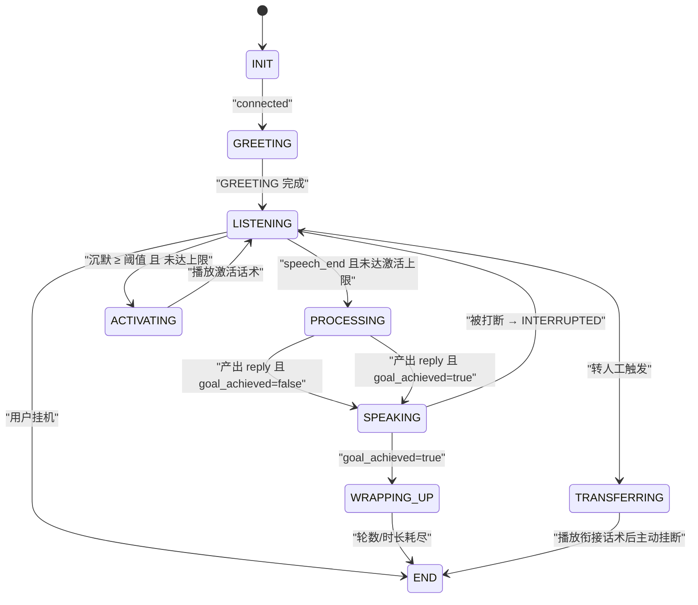
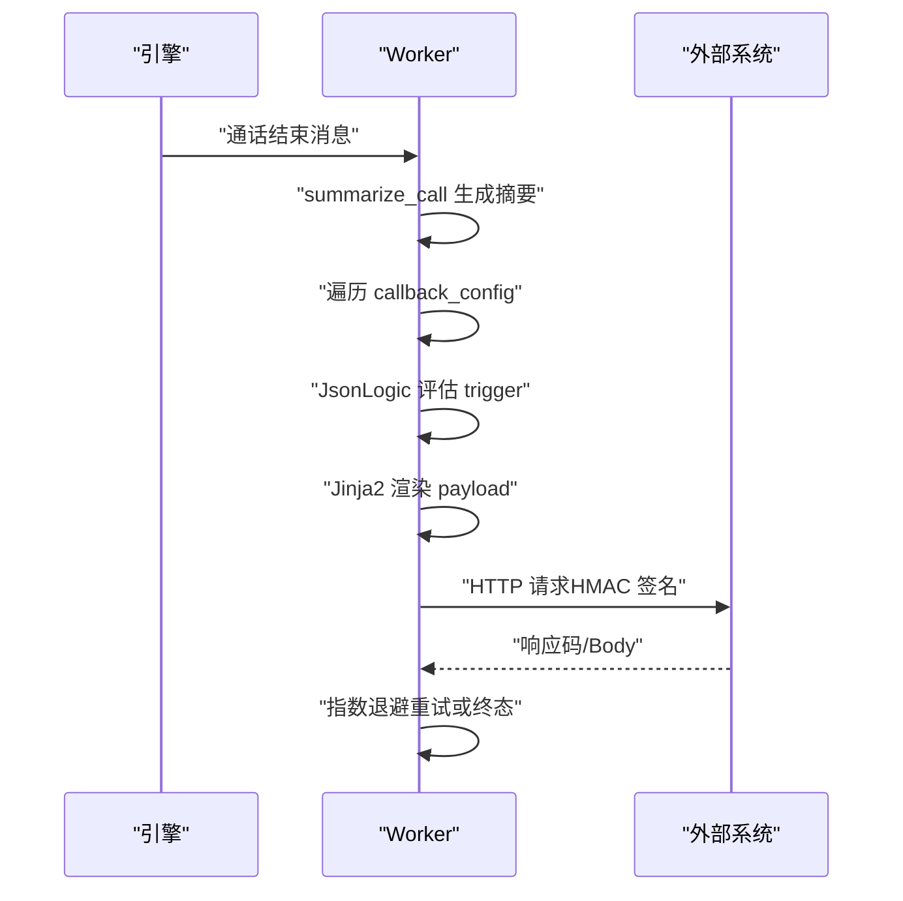
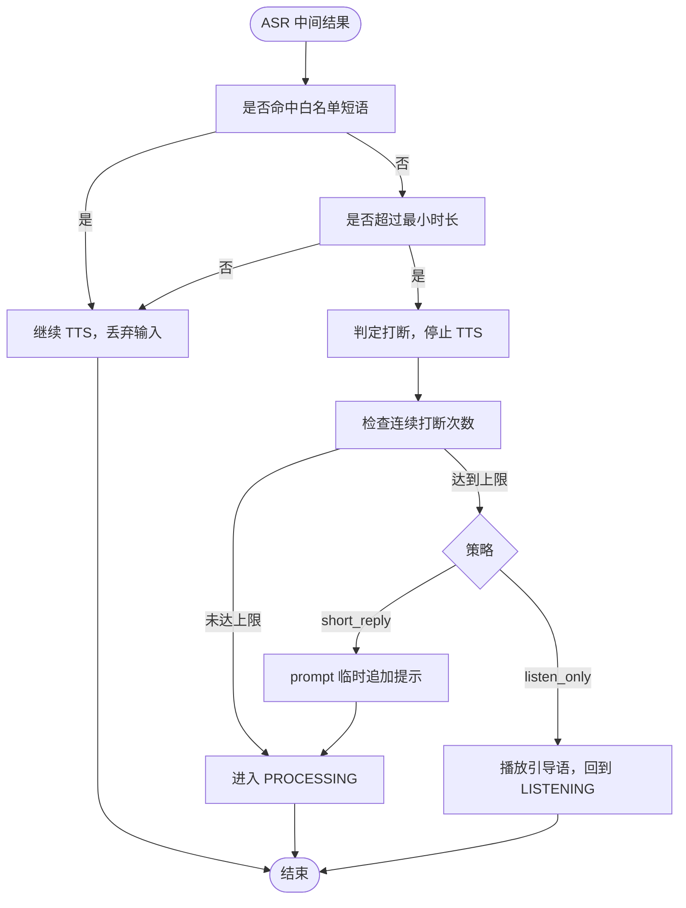
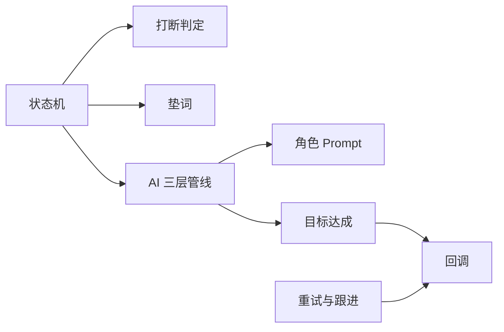

# 自定义功能

<cite>
**本文引用的文件**
- [README.md](file://README.md)
- [DESIGN.md](file://DESIGN.md)
- [openspec/specs/call-state-machine/spec.md](file://openspec/specs/call-state-machine/spec.md)
- [openspec/specs/role-prompt/spec.md](file://openspec/specs/role-prompt/spec.md)
- [openspec/specs/ai-pipeline/spec.md](file://openspec/specs/ai-pipeline/spec.md)
- [openspec/specs/goal-achievement/spec.md](file://openspec/specs/goal-achievement/spec.md)
- [openspec/specs/interruption-detection/spec.md](file://openspec/specs/interruption-detection/spec.md)
- [openspec/specs/filler/spec.md](file://openspec/specs/filler/spec.md)
- [openspec/specs/silence-activation/spec.md](file://openspec/specs/silence-activation/spec.md)
- [openspec/specs/human-handoff/spec.md](file://openspec/specs/human-handoff/spec.md)
- [openspec/specs/webhook-callback/spec.md](file://openspec/specs/webhook-callback/spec.md)
- [openspec/specs/retry-followup/spec.md](file://openspec/specs/retry-followup/spec.md)
</cite>

## 目录
1. [简介](#简介)
2. [项目结构](#项目结构)
3. [核心组件](#核心组件)
4. [架构总览](#架构总览)
5. [详细组件分析](#详细组件分析)
6. [依赖分析](#依赖分析)
7. [性能考虑](#性能考虑)
8. [故障排查指南](#故障排查指南)
9. [结论](#结论)
10. [附录](#附录)

## 简介
本指南面向 iSales 自定义功能开发者，围绕三大主题提供系统化实操建议：
- 角色提示词系统的自定义配置、模板管理与动态调整
- 通话状态机的扩展机制（新增状态、转换逻辑定制、事件扩展）
- 业务规则引擎的集成方法（条件判断、动作执行、状态持久化）

文档同时给出可落地的开发示例、测试方法、配置管理与版本控制最佳实践，帮助你在不破坏系统契约的前提下安全扩展。

## 项目结构
iSales 采用多仓协作与 OpenSpec 规范化治理。核心与本文相关的能力分布在以下规范中：
- 通话状态机：定义状态集合、合法转移、关键事件与异常处理
- 角色 Prompt：定义 Prompt 组装结构、JSON Mode、版本管理与收尾追加
- AI 三层管线：定义角色 PK、裁判审查、润色选优与兜底降级
- 目标达成：实时判定、WRAPPING_UP 简化管线与回调匹配
- 打断判定：双条件判定、连续打断保护与 ASR Provider 抽象
- 垫词：PROCESSING 期间的覆盖播放、多集合轮询与失败兜底
- 沉默激活：LISTENING 长时间沉默的激活策略与上限控制
- 转人工：v1 标记+通知流程与派发回拨任务
- 回调：JsonLogic 触发、Jinja2 渲染、HMAC 签名与指数退避重试
- 重试与跟进：基于 hangup_cause 的重试策略与固定间隔跟进

**图表来源**
- [openspec/specs/call-state-machine/spec.md](file://openspec/specs/call-state-machine/spec.md)
- [openspec/specs/role-prompt/spec.md](file://openspec/specs/role-prompt/spec.md)
- [openspec/specs/ai-pipeline/spec.md](file://openspec/specs/ai-pipeline/spec.md)
- [openspec/specs/goal-achievement/spec.md](file://openspec/specs/goal-achievement/spec.md)
- [openspec/specs/interruption-detection/spec.md](file://openspec/specs/interruption-detection/spec.md)
- [openspec/specs/filler/spec.md](file://openspec/specs/filler/spec.md)
- [openspec/specs/silence-activation/spec.md](file://openspec/specs/silence-activation/spec.md)
- [openspec/specs/human-handoff/spec.md](file://openspec/specs/human-handoff/spec.md)
- [openspec/specs/webhook-callback/spec.md](file://openspec/specs/webhook-callback/spec.md)
- [openspec/specs/retry-followup/spec.md](file://openspec/specs/retry-followup/spec.md)

**章节来源**
- [README.md:1-86](file://README.md#L1-L86)
- [DESIGN.md:1-75](file://DESIGN.md#L1-L75)

## 核心组件
- 通话状态机：定义状态集合、合法转移、关键事件与异常处理契约，是引擎内部与运行时调试的硬契约
- 角色 Prompt：定义 Prompt 三段式组装、JSON Mode 强制策略、版本快照与收尾追加
- AI 三层管线：定义角色并行 PK、裁判并行审查、润色选优与兜底/降级路径
- 目标达成：实时判定、WRAPPING_UP 简化管线、回调匹配
- 打断判定：双条件判定、连续打断保护、ASR Provider 抽象
- 垫词：PROCESSING 期间覆盖播放、多集合轮询、失败兜底
- 沉默激活：LISTENING 长时间沉默的激活策略、上限与话术复用
- 转人工：v1 标记+通知、派发回拨任务
- 回调：JsonLogic 触发、Jinja2 渲染、HMAC 签名、指数退避重试
- 重试与跟进：基于 hangup_cause 的重试策略与固定间隔跟进

**章节来源**
- [openspec/specs/call-state-machine/spec.md:1-190](file://openspec/specs/call-state-machine/spec.md#L1-L190)
- [openspec/specs/role-prompt/spec.md:1-238](file://openspec/specs/role-prompt/spec.md#L1-L238)
- [openspec/specs/ai-pipeline/spec.md:1-166](file://openspec/specs/ai-pipeline/spec.md#L1-L166)
- [openspec/specs/goal-achievement/spec.md:1-126](file://openspec/specs/goal-achievement/spec.md#L1-L126)
- [openspec/specs/interruption-detection/spec.md:1-94](file://openspec/specs/interruption-detection/spec.md#L1-L94)
- [openspec/specs/filler/spec.md:1-132](file://openspec/specs/filler/spec.md#L1-L132)
- [openspec/specs/silence-activation/spec.md:1-99](file://openspec/specs/silence-activation/spec.md#L1-L99)
- [openspec/specs/human-handoff/spec.md:1-128](file://openspec/specs/human-handoff/spec.md#L1-L128)
- [openspec/specs/webhook-callback/spec.md:1-231](file://openspec/specs/webhook-callback/spec.md#L1-L231)
- [openspec/specs/retry-followup/spec.md:1-176](file://openspec/specs/retry-followup/spec.md#L1-L176)

## 架构总览
下图展示了 iSales 自定义功能开发的关键交互：状态机驱动事件，Prompt 管线产出候选，目标达成触发 WRAPPING_UP，回调与重试跟进贯穿生命周期。

**图表来源**
- [openspec/specs/call-state-machine/spec.md:1-190](file://openspec/specs/call-state-machine/spec.md#L1-L190)
- [openspec/specs/role-prompt/spec.md:1-238](file://openspec/specs/role-prompt/spec.md#L1-L238)
- [openspec/specs/ai-pipeline/spec.md:1-166](file://openspec/specs/ai-pipeline/spec.md#L1-L166)
- [openspec/specs/goal-achievement/spec.md:1-126](file://openspec/specs/goal-achievement/spec.md#L1-L126)
- [openspec/specs/interruption-detection/spec.md:1-94](file://openspec/specs/interruption-detection/spec.md#L1-L94)
- [openspec/specs/filler/spec.md:1-132](file://openspec/specs/filler/spec.md#L1-L132)
- [openspec/specs/silence-activation/spec.md:1-99](file://openspec/specs/silence-activation/spec.md#L1-L99)
- [openspec/specs/human-handoff/spec.md:1-128](file://openspec/specs/human-handoff/spec.md#L1-L128)
- [openspec/specs/webhook-callback/spec.md:1-231](file://openspec/specs/webhook-callback/spec.md#L1-L231)
- [openspec/specs/retry-followup/spec.md:1-176](file://openspec/specs/retry-followup/spec.md#L1-L176)

## 详细组件分析

### 角色提示词系统：自定义配置、模板管理与动态调整
- 自定义范围
  - Campaign 完全自定义角色/裁判/润色 prompt，系统仅提供工具与模板（v1 命令行 + v2 Web UI）
  - 角色 prompt 完全独立，不共享 base prompt，保障多样性
- Prompt 组装
  - 三段式：system message（角色身份+目标+JSON schema）+ 单条 user message（上次通话纪要、线索信息、对话历史）
  - 不拆 chat multi-turn，整通对话作为单条 user message 传入
- JSON Mode 强制策略
  - 优先使用 Provider 原生 JSON Mode；不支持时在 system prompt 末尾贴 schema 描述并做后处理
  - 单角色 JSON 解析失败直接淘汰，全部失败走兜底
- 版本管理与调试回放
  - prompt_version 表记录历史；通话开始时写入 call_record.prompt_versions 快照，支持精准复现
- WRAPPING_UP 与跟进通话增强
  - WRAPPING_UP 在原 system prompt 末尾追加收尾指令段落
  - 跟进通话在 system prompt 末尾追加「上次通话纪要」与「跟进上下文」段落

开发要点
- 新增角色类型：在 isales-web 模板基础上完全覆写，确保输出符合 JSON schema
- 动态调整：编辑角色 prompt 自动生成新版本，启用新版本时更新 current_prompt_version_id
- 调试回放：通过 prompt_versions 快照定位历史 prompt 原文，复现调用时使用的 prompt

**章节来源**
- [openspec/specs/role-prompt/spec.md:1-238](file://openspec/specs/role-prompt/spec.md#L1-L238)

### 通话状态机：扩展机制（新增状态、转换逻辑、事件扩展）
- 状态集合与合法转移
  - 状态集合：INIT/GREETING/LISTENING/SPEAKING/INTERRUPTED/FILLER/PROCESSING/WRAPPING_UP/ACTIVATING/TRANSFERRING/END
  - 合法转移由统一事件触发；非法转移抛 IllegalTransition 并写 state_error 事件
- 关键状态转换
  - connected → GREETING；speech_end → PROCESSING；打断 → INTERRUPTED → PROCESSING
  - 目标达成 → SPEAKING → WRAPPING_UP；沉默激活 → ACTIVATING；转人工 → TRANSFERRING → END
- 特殊状态边界
  - WRAPPING_UP 走简化管线（单角色+润色，不 PK/裁判）
  - TRANSFERRING 期间不调用 AI 管线，直接进入 END
- 事件扩展与异常处理
  - 事件必须来自 ATEvent（IPC 上抛）；ATD ACK/中间 URC 不单独触发转换
  - 非法转移可恢复 vs 不可恢复：可忽略事件继续，不可忽略强制进 END（force=True）

扩展建议
- 新增状态：在状态机契约内定义合法转移集合与进入/退出条件，确保与现有模块（打断、垫词、目标达成、转人工、沉默）协同
- 转换逻辑定制：通过统一事件驱动 API（如 session.transition_to）实现，便于 transcript 记录与单元测试
- 事件扩展：仅允许来自 ATEvent 的事件触发状态转换，避免“伪事件”绕过合法性校验

**图表来源**
- [openspec/specs/call-state-machine/spec.md:1-190](file://openspec/specs/call-state-machine/spec.md#L1-L190)

**章节来源**
- [openspec/specs/call-state-machine/spec.md:1-190](file://openspec/specs/call-state-machine/spec.md#L1-L190)

### 业务规则引擎集成：条件判断、动作执行与状态持久化
- 条件判断
  - JsonLogic 表达式触发：在 worker summarize_call 之后评估 call_summary 与 call_record 字段
  - 支持引用：goal_achieved、goal_type、extracted.*、lead.*、call.*
- 动作执行
  - Jinja2 sandbox 渲染 payload，HMAC-SHA256 签名，HTTP 请求
  - 指数退避重试，失败分类与日志记录
- 状态持久化
  - 回调状态写入 callback_log，与 lead 状态流转解耦
  - 重试与跟进基于 hangup_cause 与目标达成标记，写回 lead.status 与 next_call_at

**图表来源**
- [openspec/specs/webhook-callback/spec.md:1-231](file://openspec/specs/webhook-callback/spec.md#L1-L231)
- [openspec/specs/goal-achievement/spec.md:1-126](file://openspec/specs/goal-achievement/spec.md#L1-L126)
- [openspec/specs/retry-followup/spec.md:1-176](file://openspec/specs/retry-followup/spec.md#L1-L176)

**章节来源**
- [openspec/specs/webhook-callback/spec.md:1-231](file://openspec/specs/webhook-callback/spec.md#L1-L231)
- [openspec/specs/goal-achievement/spec.md:1-126](file://openspec/specs/goal-achievement/spec.md#L1-L126)
- [openspec/specs/retry-followup/spec.md:1-176](file://openspec/specs/retry-followup/spec.md#L1-L176)

### 打断判定：算法、保护策略与 ASR Provider 抽象
- 双条件判定：白名单短语命中或时长 < 阈值时不视为打断
- 不可撤销策略：一旦判定打断立即停止 TTS 并切换状态，不回退
- 连续打断保护：超过阈值触发 short_reply 或 listen_only 策略
- ASR Provider 抽象：必须实现统一接口，提供流式中间结果与 VAD 事件

**图表来源**
- [openspec/specs/interruption-detection/spec.md:1-94](file://openspec/specs/interruption-detection/spec.md#L1-L94)

**章节来源**
- [openspec/specs/interruption-detection/spec.md:1-94](file://openspec/specs/interruption-detection/spec.md#L1-L94)

### 垫词：触发场景、播放策略与失败兜底
- 触发场景：仅在常规对话 PROCESSING 下播放，开场白后首轮、WRAPPING_UP、转人工/沉默激活/告别/挂断时不播
- 启动时机：与 AI 管线同时启动，TTS 准备好后等垫词播完再接 reply
- 多集合轮询与集内随机不重复：按 sort_order 轮询，同一通电话内避免重复
- 失败兜底：预生成未完成/下载失败/全部不可用时跳过垫词，允许“无声延迟”

**章节来源**
- [openspec/specs/filler/spec.md:1-132](file://openspec/specs/filler/spec.md#L1-L132)

### 沉默激活：阈值、上限与话术复用
- 沉默检测：从 max(用户最后一次 speech_end, AI 上一轮 TTS 播完时刻) 开始计时
- 触发与上限：超过阈值且未达上限进入 ACTIVATING；达到上限播放告别话术后挂断
- 话术复用：按数组下标顺序使用，不足时复用最后一条，多余时仅使用前 N 条
- 与其他模块优先级：转人工优先于沉默激活；与“无进展挂断”机制边界清晰

**章节来源**
- [openspec/specs/silence-activation/spec.md:1-99](file://openspec/specs/silence-activation/spec.md#L1-L99)

### 转人工：v1 标记+通知与回拨派发
- v1 衰减为标记 + 通知：AI 识别后礼貌告知 → 主动结束通话 → 派发 handoff_task → 坐席手动回拨
- 4 种独立触发机制：关键词、意图分类、轮次阈值、独立 LLM 判定，任一命中即触发
- TRANSFERRING 流程：播衔接话术 → 主动挂断 → 写入 transfer_status/transfer_reason → 派发 handoff_task

**章节来源**
- [openspec/specs/human-handoff/spec.md:1-128](file://openspec/specs/human-handoff/spec.md#L1-L128)

### 目标达成与 WRAPPING_UP：简化管线与回调匹配
- 实时判定：角色 LLM 在每轮 JSON 输出中标注 goal_achieved/goal_type/extracted
- WRAPPING_UP：先播放当前轮 reply，再走简化管线（单角色+润色），不启用 PK/裁判
- 回调匹配：worker 通过 JsonLogic 评估 call_summary 字段触发外部 webhook

**章节来源**
- [openspec/specs/goal-achievement/spec.md:1-126](file://openspec/specs/goal-achievement/spec.md#L1-L126)

### 重试与跟进：指数退避与固定间隔
- 重试：基于 hangup_cause ∈ {no_answer,user_busy,network_out_of_order,temporary_failure}，指数退避间隔 + 最大次数
- 跟进：基于 hangup_cause ∈ {normal_clearing,wrap_up_completed,silence_max_reached} 且 goal_achieved=false，固定间隔 + 最大次数
- 勿打识别：关键词命中或独立 LLM 判定，标记 do_not_call 并清理未来调度任务

**章节来源**
- [openspec/specs/retry-followup/spec.md:1-176](file://openspec/specs/retry-followup/spec.md#L1-L176)

## 依赖分析
- 状态机是核心契约，所有实时行为模块（打断、垫词、目标达成、转人工、沉默）通过状态转换接入
- Prompt 与管线耦合：角色 Prompt 决定输入内容，AI 三层管线决定调用次数与评审流程
- 回调与重试跟进解耦：回调写入 callback_log，不改变 lead 状态；重试/跟进由 worker 写回 lead.status 与 next_call_at

**图表来源**
- [openspec/specs/call-state-machine/spec.md:1-190](file://openspec/specs/call-state-machine/spec.md#L1-L190)
- [openspec/specs/role-prompt/spec.md:1-238](file://openspec/specs/role-prompt/spec.md#L1-L238)
- [openspec/specs/ai-pipeline/spec.md:1-166](file://openspec/specs/ai-pipeline/spec.md#L1-L166)
- [openspec/specs/goal-achievement/spec.md:1-126](file://openspec/specs/goal-achievement/spec.md#L1-L126)
- [openspec/specs/webhook-callback/spec.md:1-231](file://openspec/specs/webhook-callback/spec.md#L1-L231)
- [openspec/specs/retry-followup/spec.md:1-176](file://openspec/specs/retry-followup/spec.md#L1-L176)

**章节来源**
- [openspec/specs/call-state-machine/spec.md:1-190](file://openspec/specs/call-state-machine/spec.md#L1-L190)
- [openspec/specs/ai-pipeline/spec.md:1-166](file://openspec/specs/ai-pipeline/spec.md#L1-L166)
- [openspec/specs/webhook-callback/spec.md:1-231](file://openspec/specs/webhook-callback/spec.md#L1-L231)
- [openspec/specs/retry-followup/spec.md:1-176](file://openspec/specs/retry-followup/spec.md#L1-L176)

## 性能考虑
- Prompt 不截断：依赖 LLM 长上下文能力，需监控 token 用量并设置告警
- 垫词覆盖延迟：与 AI 管线同时启动，保证对话节拍稳定，避免快响应破坏节奏
- 简化管线：WRAPPING_UP 期间单角色+润色，降低延迟与成本
- 回调重试：指数退避 + 最大次数，避免雪崩与资源浪费

[本节为通用指导，无需特定文件分析]

## 故障排查指南
- 状态机异常
  - 现象：非法状态转移抛异常并写 state_error
  - 排查：检查事件来源（必须来自 ATEvent），确认 LEGAL_TRANSITIONS 集合与当前状态是否匹配
- Prompt 解析失败
  - 现象：单角色 JSON 解析失败直接淘汰，全部失败走兜底
  - 排查：检查 system prompt 是否包含 JSON schema，Provider 是否支持原生 JSON Mode
- 回调失败
  - 现象：HTTP 5xx 超时/连接失败重试；4xx 不重试
  - 排查：核对 JsonLogic 表达式、Jinja2 模板、HMAC 签名与重试策略配置
- 重试/跟进异常
  - 现象：hangup_cause 与目标达成标记决定后续状态
  - 排查：确认 hangup_cause 枚举一致性与 worker 写回逻辑

**章节来源**
- [openspec/specs/call-state-machine/spec.md:33-44](file://openspec/specs/call-state-machine/spec.md#L33-L44)
- [openspec/specs/role-prompt/spec.md:140-149](file://openspec/specs/role-prompt/spec.md#L140-L149)
- [openspec/specs/webhook-callback/spec.md:100-133](file://openspec/specs/webhook-callback/spec.md#L100-L133)
- [openspec/specs/retry-followup/spec.md:90-118](file://openspec/specs/retry-followup/spec.md#L90-L118)

## 结论
通过遵循 OpenSpec 规范与系统契约，开发者可在以下方面安全扩展：
- 角色提示词：完全自定义、版本管理、调试回放
- 通话状态机：新增状态与转换、事件扩展、异常兜底
- 业务规则：JsonLogic 触发、Jinja2 渲染、HMAC 签名与指数退避重试

建议在变更前先通过 OpenSpec change proposal 流程，确保可追溯与审计。

[本节为总结，无需特定文件分析]

## 附录

### 开发示例：新角色类型的实现
- 在 isales-web 模板基础上创建新角色，完全覆写 system prompt 与输出 schema
- 确保输出严格遵循 JSON 格式（reply、goal_achieved、goal_type、extracted）
- 编辑后自动生成新版本，启用新版本时更新 current_prompt_version_id

**章节来源**
- [openspec/specs/role-prompt/spec.md:57-92](file://openspec/specs/role-prompt/spec.md#L57-L92)

### 开发示例：自定义对话流程设计
- 设计 WRAPPING_UP 简化流程：单角色 LLM + 润色，不启用 PK/裁判
- 在 WRAPPING_UP 期间对新问题走简化管线，不退回主管线
- 通过 prompt_versions 快照记录 wrap_up_appended 状态，便于回放

**章节来源**
- [openspec/specs/goal-achievement/spec.md:53-62](file://openspec/specs/goal-achievement/spec.md#L53-L62)
- [openspec/specs/role-prompt/spec.md:93-111](file://openspec/specs/role-prompt/spec.md#L93-L111)

### 开发示例：业务逻辑注入（回调与重试跟进）
- 回调：使用 JsonLogic 表达式引用 call_summary 与 call_record 字段，Jinja2 渲染 payload，HMAC 签名，指数退避重试
- 重试/跟进：基于 hangup_cause 与目标达成标记，指数退避与固定间隔策略，勿打识别与状态机终态

**章节来源**
- [openspec/specs/webhook-callback/spec.md:19-46](file://openspec/specs/webhook-callback/spec.md#L19-L46)
- [openspec/specs/retry-followup/spec.md:5-18](file://openspec/specs/retry-followup/spec.md#L5-L18)

### 功能测试方法
- 单元测试：针对状态机的 transition_to 与事件驱动 API，覆盖合法/非法转移
- 集成测试：模拟打断判定、垫词播放、沉默激活、转人工、目标达成与回调
- 回放测试：通过 prompt_versions 与 pipeline_trace 快照复现历史通话

**章节来源**
- [openspec/specs/call-state-machine/spec.md:187-190](file://openspec/specs/call-state-machine/spec.md#L187-L190)
- [openspec/specs/ai-pipeline/spec.md:40-69](file://openspec/specs/ai-pipeline/spec.md#L40-L69)

### 配置管理与版本控制最佳实践
- OpenSpec 变更：通过 /opsx:propose → /opsx:apply → /opsx:archive 流程，确保可追溯与审计
- 配置一致性：使用 deploy 脚本与环境文件校验，确保 shellcheck 与环境变量一致性
- Prompt 版本：编辑即生成新版本，启用新版本时更新 current_prompt_version_id，保留历史只读

**章节来源**
- [README.md:75-86](file://README.md#L75-L86)
- [DESIGN.md:49-56](file://DESIGN.md#L49-L56)
- [openspec/specs/role-prompt/spec.md:150-171](file://openspec/specs/role-prompt/spec.md#L150-L171)