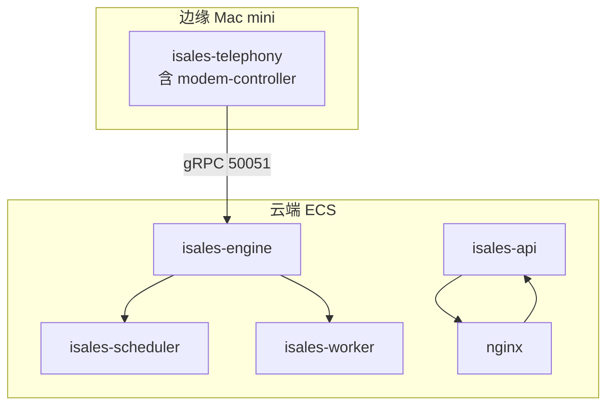
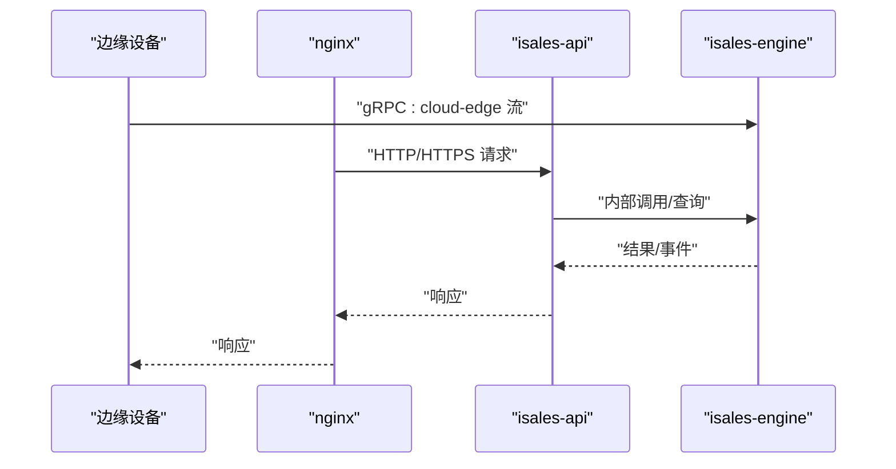
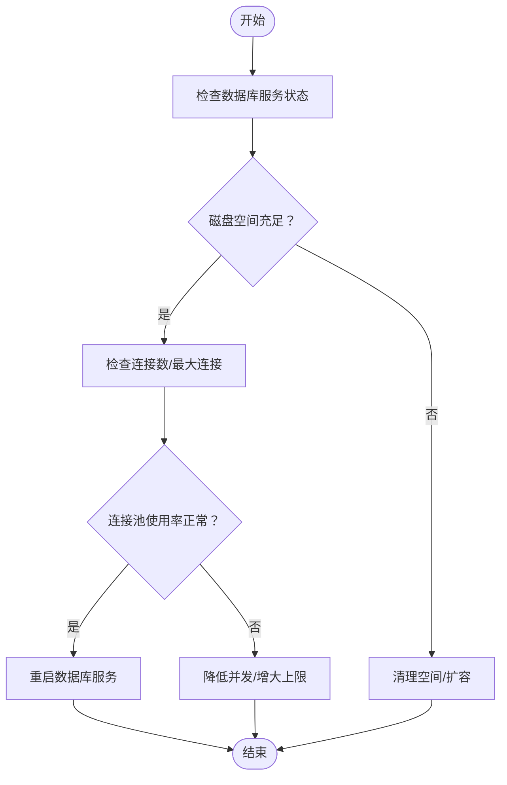
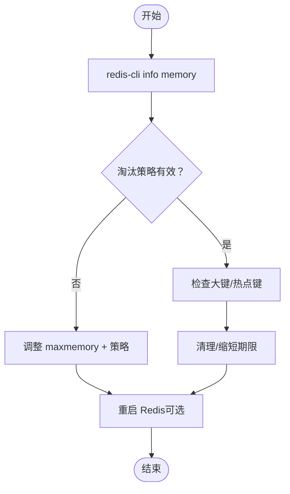
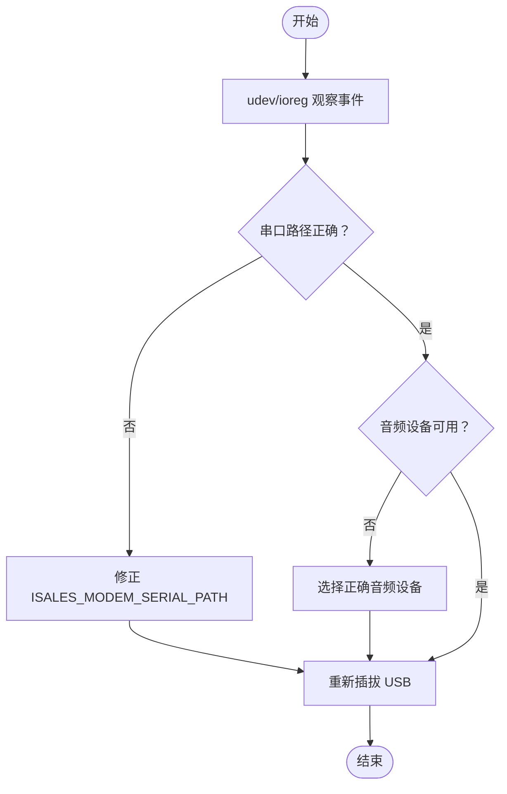
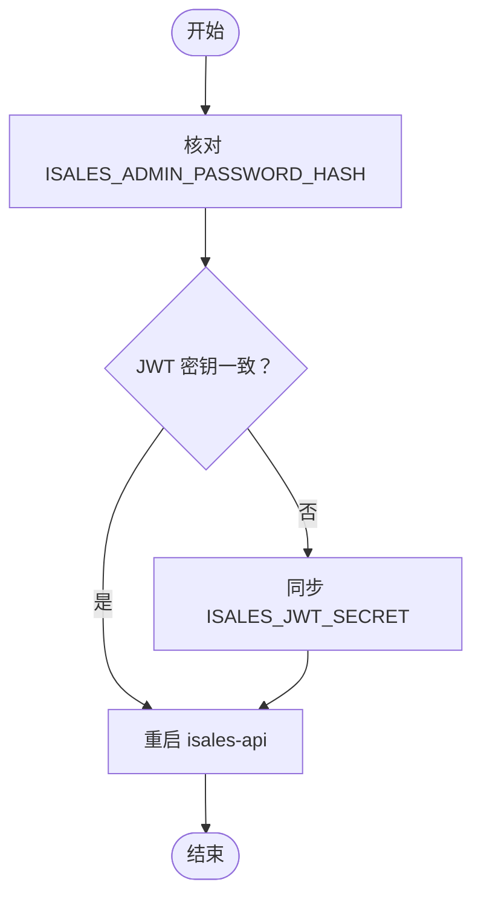
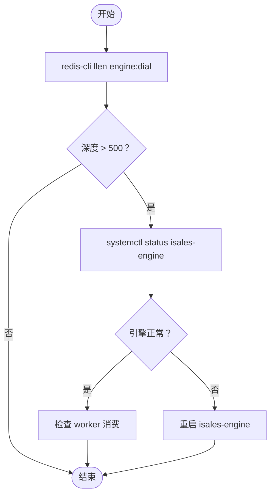
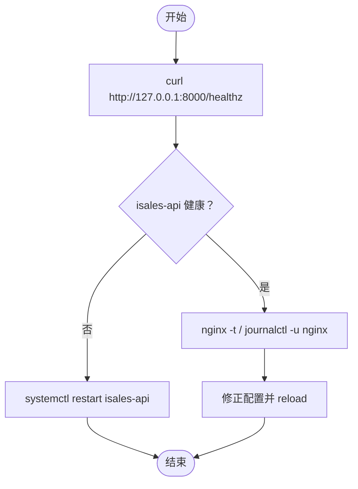
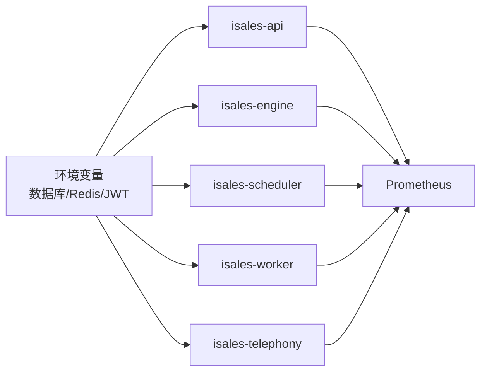
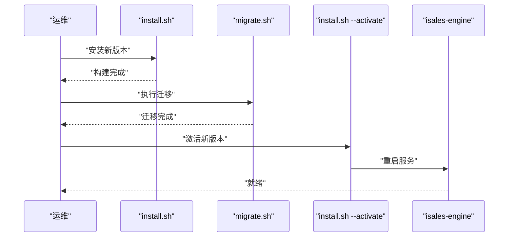

# 常见问题排查

<cite>
**本文引用的文件**
- [README.md](file://README.md)
- [RUNBOOK.md](file://deploy/RUNBOOK.md)
- [RUNBOOK-cloud.md](file://deploy/RUNBOOK-cloud.md)
- [RUNBOOK-edge.md](file://deploy/RUNBOOK-edge.md)
- [README.md](file://deploy/cloud/monitoring/README.md)
- [alert_rules.yml.example](file://deploy/cloud/monitoring/alert_rules.yml.example)
- [prometheus.yml.example](file://deploy/cloud/monitoring/prometheus.yml.example)
- [api.env.example](file://deploy/env/api.env.example)
- [api.env.example](file://deploy/cloud/env/api.env.example)
- [deploy.sh](file://deploy/linux/scripts/deploy.sh)
- [deploy.sh](file://deploy/macos/scripts/deploy.sh)
- [install.sh](file://deploy/cloud/scripts/install.sh)
- [install.sh](file://deploy/edge/scripts/install.sh)
</cite>

## 目录
1. [简介](#简介)
2. [项目结构](#项目结构)
3. [核心组件](#核心组件)
4. [架构总览](#架构总览)
5. [详细组件分析](#详细组件分析)
6. [依赖关系分析](#依赖关系分析)
7. [性能考量](#性能考量)
8. [故障排查指南](#故障排查指南)
9. [结论](#结论)
10. [附录](#附录)

## 简介
本指南面向 iSales 运维工程师与现场工程师，围绕“运行手册”中的故障清单，系统化梳理常见问题的识别、定位与处置流程，覆盖数据库连接问题、Redis 内存溢出、调制解调器设备断开、服务认证失败等典型场景，并提供标准化的诊断命令、检查要点与修复步骤，帮助快速恢复业务。

## 项目结构
iSales 采用多仓协同与统一部署脚本的组织方式，核心服务包括：
- isales-api：后台管理与对外接口
- isales-engine：实时通话引擎
- isales-scheduler：调度器（拨号队列）
- isales-worker：后台任务与看门狗
- isales-telephony：设备与调制解调器守护进程
- isales-web：管理界面

部署层面分为两类拓扑：
- 单主机（Linux systemd 或 macOS launchd）
- 云边分离（cloud-edge split）：云端（api/engine/scheduler/worker/nginx）与边缘（edge）分离

图表来源
- [install.sh:1-300](file://deploy/cloud/scripts/install.sh#L1-L300)
- [install.sh:1-222](file://deploy/edge/scripts/install.sh#L1-L222)

章节来源
- [README.md:1-86](file://README.md#L1-L86)
- [RUNBOOK.md:1-394](file://deploy/RUNBOOK.md#L1-L394)
- [RUNBOOK-cloud.md:1-599](file://deploy/RUNBOOK-cloud.md#L1-L599)
- [RUNBOOK-edge.md:1-254](file://deploy/RUNBOOK-edge.md#L1-L254)

## 核心组件
- 数据库（PostgreSQL）：isales-api、isales-engine、isales-scheduler、isales-worker 共享数据库连接；云边拓扑下通过 RDS 提供。
- 缓存（Redis）：用于队列、并发控制与会话缓存；云边拓扑下通过 Tair/Redis Cloud 提供。
- 服务编排：Linux 使用 systemd，macOS 使用 launchd；边缘使用 LaunchAgent。
- 监控与告警：Prometheus + Grafana + Alert Rules，覆盖边缘离线、流健康、音频缓冲、引擎管道延迟预算等。

章节来源
- [api.env.example:1-14](file://deploy/env/api.env.example#L1-L14)
- [api.env.example:1-24](file://deploy/cloud/env/api.env.example#L1-L24)
- [README.md:1-37](file://deploy/cloud/monitoring/README.md#L1-L37)

## 架构总览
云边分离拓扑下，边缘设备通过 gRPC 与云端引擎建立双向流，边缘负责设备与网络，云端负责业务编排与媒体处理。nginx 作为前端入口，转发 /api/ 与 /ws/ 请求至 isales-api。

图表来源
- [install.sh:174-221](file://deploy/cloud/scripts/install.sh#L174-L221)
- [RUNBOOK-cloud.md:325-393](file://deploy/RUNBOOK-cloud.md#L325-L393)

## 详细组件分析

### 数据库连接问题
- 症状
  - psql: connection refused
  - 连接池耗尽导致调度器/引擎连接失败
- 快速定位
  - 检查数据库服务状态与磁盘空间
  - 查看数据库连接数与最大连接阈值
- 修复步骤
  - 重启数据库服务或释放连接
  - 调整连接池上限或优化查询
  - 云边拓扑下检查 RDS 安全组与只读副本指标

图表来源
- [RUNBOOK.md:167-178](file://deploy/RUNBOOK.md#L167-L178)
- [alert_rules.yml.example:103-116](file://deploy/cloud/monitoring/alert_rules.yml.example#L103-L116)

章节来源
- [RUNBOOK.md:167-178](file://deploy/RUNBOOK.md#L167-L178)
- [alert_rules.yml.example:103-116](file://deploy/cloud/monitoring/alert_rules.yml.example#L103-L116)

### Redis 内存溢出（OOM）
- 症状
  - OOM command not allowed
  - 引擎拨号队列堆积、worker 卡住
- 快速定位
  - 查看内存使用与 maxmemory 设置
  - 检查关键键空间（如 engine:dial、isales:concurrency:active）
- 修复步骤
  - 调整 maxmemory 或淘汰策略
  - 清理过期键或缩短 TTL
  - 重启 Redis 服务（云边拓扑下为托管 Redis）

图表来源
- [RUNBOOK.md:168-173](file://deploy/RUNBOOK.md#L168-L173)

章节来源
- [RUNBOOK.md:168-173](file://deploy/RUNBOOK.md#L168-L173)

### 调制解调器设备断开（边缘）
- 症状
  - modem-controller “device disconnected”
  - 拨号失败、设备状态异常
- 快速定位
  - 观察 udev 事件（Linux）或 ioreg（macOS）
  - 检查串口占用与 Core Audio 设备
- 修复步骤
  - 重新插拔 USB，确保权限与规则正确
  - macOS 下检查系统服务是否占用串口
  - 配置正确的 ISALES_MODEM_SERIAL_PATH 与音频设备名

图表来源
- [RUNBOOK.md:169-171](file://deploy/RUNBOOK.md#L169-L171)
- [RUNBOOK-edge.md:196-222](file://deploy/RUNBOOK-edge.md#L196-L222)

章节来源
- [RUNBOOK.md:169-171](file://deploy/RUNBOOK.md#L169-L171)
- [RUNBOOK-edge.md:196-222](file://deploy/RUNBOOK-edge.md#L196-L222)

### 服务认证失败（API 登录/JWT）
- 症状
  - API 登录失败
  - JWT 校验失败（api ↔ telephony-api）
- 快速定位
  - 检查管理员密码哈希与 JWT 密钥
  - 核对 api.env 与 telephony-api.env 的 ISALES_JWT_SECRET
- 修复步骤
  - 重新生成管理员密码哈希并重启 isales-api
  - 确保跨服务 JWT 密钥一致并重新部署

图表来源
- [RUNBOOK.md:176-177](file://deploy/RUNBOOK.md#L176-L177)
- [api.env.example:1-14](file://deploy/env/api.env.example#L1-L14)

章节来源
- [RUNBOOK.md:176-177](file://deploy/RUNBOOK.md#L176-L177)
- [api.env.example:1-14](file://deploy/env/api.env.example#L1-L14)

### 引擎拨号队列堆积
- 症状
  - redis-cli llen engine:dial 显示深度 > 500
  - 引擎进程异常或未启动
- 快速定位
  - 检查 isales-engine 服务状态
  - 查看队列长度与 worker 端消费情况
- 修复步骤
  - 重启 isales-engine（注意会丢弃进行中通话）
  - 检查上游调度器/工作器是否正常

图表来源
- [RUNBOOK.md:172-173](file://deploy/RUNBOOK.md#L172-L173)

章节来源
- [RUNBOOK.md:172-173](file://deploy/RUNBOOK.md#L172-L173)

### nginx 502（API/WS）
- 症状
  - /api/ 502
  - /ws/ 502（WebSocket 仅 1 个工作进程）
- 快速定位
  - curl 直连 8000 端口验证 isales-api
  - 检查 nginx 配置与日志
- 修复步骤
  - 重启 isales-api 或修复其健康检查
  - 修正 nginx 配置并 reload

图表来源
- [RUNBOOK.md:174-175](file://deploy/RUNBOOK.md#L174-L175)

章节来源
- [RUNBOOK.md:174-175](file://deploy/RUNBOOK.md#L174-L175)

### 备份任务未运行
- 症状
  - 备份未产生新文件
- 快速定位
  - 检查 cron 服务与日志标签
  - 校验定时任务权限
- 修复步骤
  - 启动 cron 并修复权限
  - 手动触发并验证输出

章节来源
- [RUNBOOK.md:178-178](file://deploy/RUNBOOK.md#L178-L178)

## 依赖关系分析
- 环境一致性
  - 数据库与 Redis URL 必须在 api/engine/scheduler/worker 之间保持一致
  - JWT 密钥在 api 与 telephony-api 之间保持一致
- 发布与回滚
  - 单主机与云边拓扑均提供 install/deploy/rollback 脚本，遵循严格的服务重启顺序
- 监控指标
  - Prometheus 抓取各服务 /metrics 端点，结合告警规则实现自动化预警

图表来源
- [api.env.example:1-14](file://deploy/env/api.env.example#L1-L14)
- [api.env.example:1-24](file://deploy/cloud/env/api.env.example#L1-L24)
- [prometheus.yml.example:1-77](file://deploy/cloud/monitoring/prometheus.yml.example#L1-L77)

章节来源
- [api.env.example:1-14](file://deploy/env/api.env.example#L1-L14)
- [api.env.example:1-24](file://deploy/cloud/env/api.env.example#L1-L24)
- [prometheus.yml.example:1-77](file://deploy/cloud/monitoring/prometheus.yml.example#L1-L77)

## 性能考量
- 引擎管道延迟预算
  - 当首 TTS P95 超过 800ms 时，按设计降级策略将多角色 PK 默认 N=1，减少并发压力
- 连接池与并发
  - 数据库连接数接近上限时，需调整连接池或优化查询
- 缓存与队列
  - Redis 内存与淘汰策略直接影响引擎拨号与通话处理吞吐

章节来源
- [alert_rules.yml.example:69-86](file://deploy/cloud/monitoring/alert_rules.yml.example#L69-L86)
- [RUNBOOK-cloud.md:591-591](file://deploy/RUNBOOK-cloud.md#L591-L591)

## 故障排查指南

### 问题分类与处置矩阵
- 数据库连接问题
  - 诊断命令：systemctl status postgresql；journalctl -u postgresql -n 100；检查磁盘空间
  - 修复：重启数据库；调整连接池；云边拓扑检查 RDS 安全组
- Redis 内存溢出
  - 诊断命令：redis-cli info memory；redis-cli dbsize；检查热点键
  - 修复：调整 maxmemory/淘汰策略；清理过期键；必要时重启
- 调制解调器断开
  - 诊断命令：udevadm monitor（Linux）；ioreg（macOS）；检查串口占用
  - 修复：重新插拔；修正 ISALES_MODEM_SERIAL_PATH；解除系统服务占用
- 服务认证失败
  - 诊断命令：核对 ISALES_ADMIN_PASSWORD_HASH；检查 ISALES_JWT_SECRET
  - 修复：重新生成哈希；同步密钥并重启服务
- 引擎拨号队列堆积
  - 诊断命令：redis-cli llen engine:dial；systemctl status isales-engine
  - 修复：重启 isales-engine；检查 worker 消费
- nginx 502
  - 诊断命令：curl http://127.0.0.1:8000/healthz；nginx -t；journalctl -u nginx
  - 修复：重启 isales-api；修正配置并 reload
- 备份任务未运行
  - 诊断命令：systemctl status cron；journalctl -t isales-backup
  - 修复：修复权限；手动触发验证

章节来源
- [RUNBOOK.md:163-196](file://deploy/RUNBOOK.md#L163-L196)

### 快速检查清单
- 服务状态
  - Linux：systemctl status isales-{api,engine,scheduler,worker,telephony-api,modem-controller}
  - macOS：launchctl print system/com.isales.<svc>；或 brew services list
- 近期错误日志
  - Linux：journalctl --since '5 min ago' -p err -u 'isales-*'
  - macOS：log show --predicate 'subsystem BEGINSWITH "com.isales." ' --last 5m | grep -i error
- 运行指标
  - Redis 队列深度：redis-cli --scan --pattern 'engine:*' | xargs -I% redis-cli llen %
  - 活跃通话数：redis-cli get isales:concurrency:active

章节来源
- [RUNBOOK.md:180-196](file://deploy/RUNBOOK.md#L180-L196)

### 预防措施建议
- 环境一致性
  - 定期校验 /etc/isales/env/* 文件，确保数据库/Redis/JWT 一致
- 监控与告警
  - 部署 Prometheus + Grafana + Alert Rules，关注边缘离线、流健康、音频缓冲、延迟预算
- 发布窗口
  - 引擎重启窗口限制在低峰时段，避免影响进行中通话
- 备份演练
  - 季度级备份恢复演练，验证 RDS/Redis/OSS 恢复流程

章节来源
- [README.md:1-37](file://deploy/cloud/monitoring/README.md#L1-L37)
- [deploy.sh:15-16](file://deploy/linux/scripts/deploy.sh#L15-L16)
- [deploy.sh:23-24](file://deploy/macos/scripts/deploy.sh#L23-L24)

## 结论
本指南基于 iSales 运行手册与部署脚本，提供了从症状识别到处置闭环的标准化流程。通过统一的诊断命令、检查清单与预防措施，可显著提升故障响应效率与系统稳定性。建议在生产环境中持续完善监控与演练，确保问题早发现、早处置。

## 附录

### 发布与回滚流程（云边拓扑）

图表来源
- [install.sh:68-94](file://deploy/cloud/scripts/install.sh#L68-L94)
- [install.sh:71-92](file://deploy/edge/scripts/install.sh#L71-L92)

章节来源
- [install.sh:68-94](file://deploy/cloud/scripts/install.sh#L68-L94)
- [install.sh:71-92](file://deploy/edge/scripts/install.sh#L71-L92)