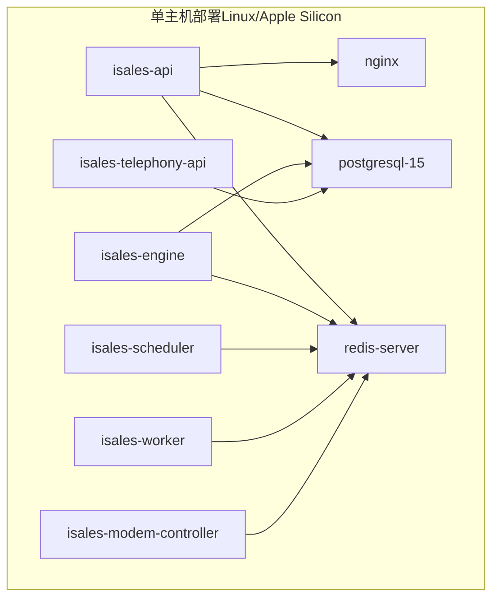
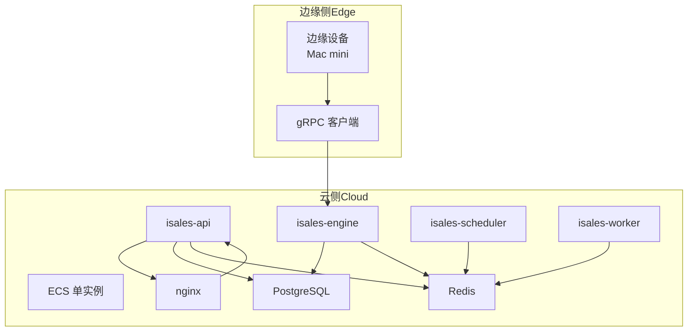
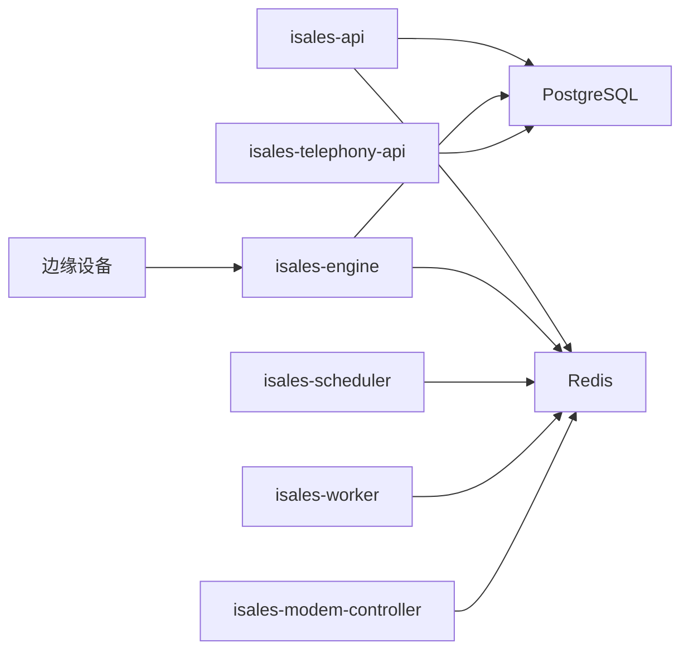

# 应急响应流程

<cite>
**本文引用的文件**
- [RUNBOOK.md](file://deploy/RUNBOOK.md)
- [RUNBOOK-cloud.md](file://deploy/RUNBOOK-cloud.md)
- [RUNBOOK-edge.md](file://deploy/RUNBOOK-edge.md)
- [README.md](file://README.md)
- [deploy/README.md](file://deploy/README.md)
- [deploy/cloud/monitoring/README.md](file://deploy/cloud/monitoring/README.md)
- [deploy/monitoring/README.md](file://deploy/monitoring/README.md)
- [deploy/cloud/STATE.md](file://deploy/cloud/STATE.md)
- [deploy/cloud/env/README.md](file://deploy/cloud/env/README.md)
- [openspec/specs/service-communication/spec.md](file://openspec/specs/service-communication/spec.md)
- [openspec/specs/deployment-topology/spec.md](file://openspec/specs/deployment-topology/spec.md)
- [IMPLEMENTATION_PLAN.md](file://IMPLEMENTATION_PLAN.md)
</cite>

## 目录
1. [简介](#简介)
2. [项目结构](#项目结构)
3. [核心组件](#核心组件)
4. [架构总览](#架构总览)
5. [详细组件分析](#详细组件分析)
6. [依赖关系分析](#依赖关系分析)
7. [性能考量](#性能考量)
8. [故障排查指南](#故障排查指南)
9. [结论](#结论)
10. [附录](#附录)

## 简介
本应急响应手册面向 iSales 生产环境的运维与值班工程师，基于运行手册中的故障处理清单，制定标准化的应急响应预案与操作步骤。内容覆盖故障分级、响应优先级、升级流程、沟通机制、标准处置模板、临时解决方案与恢复策略，并提供值班制度安排、联系方式管理与故障记录规范，确保在紧急情况下能够快速、有序、可追溯地解决问题。

## 项目结构
iSales 采用多仓协同与统一部署脚本的架构，生产部署支持两类单主机模型：
- Linux + systemd（主线）
- macOS 14+ + launchd（Apple Silicon 门店/现场）

部署骨架与环境模板一致，差异在于服务管理、包管理器与硬件后端。监控与告警模板提供 Prometheus/Grafana 配置与基础告警集。

图表来源
- [deploy/README.md:14-49](file://deploy/README.md#L14-L49)

章节来源
- [deploy/README.md:1-112](file://deploy/README.md#L1-L112)
- [README.md:16-31](file://README.md#L16-L31)

## 核心组件
- 服务层：API、引擎、调度器、Worker、Telephony API、Modem 控制器
- 基础设施：PostgreSQL、Redis、Nginx
- 监控与告警：Prometheus、Grafana、Alert Rules
- 云边分离（A2）：ECS 单实例承载云侧服务，边缘 Mac mini 通过 gRPC 连接

章节来源
- [deploy/README.md:12-49](file://deploy/README.md#L12-L49)
- [deploy/cloud/monitoring/README.md:1-37](file://deploy/cloud/monitoring/README.md#L1-L37)

## 架构总览
云边分离架构下，边缘设备通过公网 gRPC 与云端引擎交互，引擎负责实时通话状态机与 AI 管线，调度器与 Worker 负责线索调度与异步处理，API 提供管理与回调接口，数据库与缓存支撑数据与队列。

图表来源
- [deploy/cloud/STATE.md:207-214](file://deploy/cloud/STATE.md#L207-L214)
- [deploy/cloud/monitoring/README.md:9-25](file://deploy/cloud/monitoring/README.md#L9-L25)

## 详细组件分析

### 1. 故障分级与响应优先级
- P0（最高优先级）：影响全部活跃通话或核心服务不可用
  - 例如：引擎崩溃导致全部通话中断、数据库连接打满、gRPC 长连接大量断开
- P1（高优先级）：影响业务连续性或关键功能
  - 例如：拨号队列持续积压、回调失败率上升、边缘设备大规模离线
- P2（中优先级）：影响用户体验或可观测性
  - 例如：个别边缘设备离线、延迟告警、日志异常
- P3（低优先级）：维护与优化类问题
  - 例如：指标未实现、告警阈值微调

章节来源
- [openspec/specs/service-communication/spec.md:71-88](file://openspec/specs/service-communication/spec.md#L71-L88)
- [deploy/cloud/monitoring/README.md:14-24](file://deploy/cloud/monitoring/README.md#L14-L24)

### 2. 应急响应流程（标准处置模板）
- 2.1 发现与初步评估
  - 通过监控告警、日志与用户反馈定位故障现象与影响范围
  - 判断故障级别与影响面，决定是否升级
- 2.2 临时缓解与隔离
  - 降低影响面：暂停新拨号、限制并发、隔离故障节点
  - 临时修复：重启关键服务、切换到备用实例、降级功能
- 2.3 根因分析与修复
  - 深入排查：查看服务日志、数据库与缓存状态、网络连通性
  - 修复：回滚到稳定版本、修复配置、升级依赖
- 2.4 验证与恢复
  - 验证修复效果：健康检查、端到端冒烟测试、监控回归
  - 恢复：解除临时措施、恢复全量流量、更新文档
- 2.5 记录与复盘
  - 记录故障过程、处置步骤、恢复时间与经验教训
  - 更新应急预案与知识库

章节来源
- [deploy/RUNBOOK.md:163-196](file://deploy/RUNBOOK.md#L163-L196)
- [deploy/RUNBOOK-cloud.md:584-599](file://deploy/RUNBOOK-cloud.md#L584-L599)

### 3. 升级流程与沟通机制
- 3.1 升级流程
  - 云边分离：云端服务回滚仅切换软链并重启服务，不触碰数据库 schema
  - 边缘侧：回滚切换软链并重启 LaunchAgent，SQLite 离线缓冲在用户目录，回滚不丢
- 3.2 沟通机制
  - 值班制度：明确 on-call 轮值与交接流程
  - 联系方式：紧急联系人、备用联系方式、跨团队协作渠道
  - 通知模板：故障公告、升级通知、恢复通报

章节来源
- [deploy/RUNBOOK-cloud.md:281-297](file://deploy/RUNBOOK-cloud.md#L281-L297)
- [deploy/RUNBOOK-edge.md:123-135](file://deploy/RUNBOOK-edge.md#L123-L135)
- [deploy/RUNBOOK.md:207-216](file://deploy/RUNBOOK.md#L207-L216)

### 4. 临时解决方案与恢复策略
- 4.1 临时缓解
  - 降低并发：调整引擎/调度器连接池上限、限制拨号速率
  - 降级功能：关闭非关键指标、禁用部分回调
  - 服务重启：按依赖顺序重启服务，避免雪崩
- 4.2 恢复策略
  - 回滚：切换到上一个稳定版本，验证服务可用性
  - 数据恢复：按备份恢复演练步骤验证数据一致性
  - 网络修复：检查安全组、SLB、NAT 与防火墙配置

章节来源
- [deploy/RUNBOOK.md:84-115](file://deploy/RUNBOOK.md#L84-L115)
- [deploy/RUNBOOK-cloud.md:300-323](file://deploy/RUNBOOK-cloud.md#L300-L323)

### 5. 值班制度与联系方式管理
- 5.1 值班制度
  - 明确 on-call 责任人、轮值周期、交接班流程
  - 建立值班日志与交接清单，确保信息连续
- 5.2 联系方式
  - 紧急联系人：运维负责人、技术负责人、供应商支持
  - 通知渠道：钉钉/飞书群、邮件列表、电话
- 5.3 故障记录规范
  - 记录时间、现象、影响面、处置步骤、恢复时间、根因与改进项
  - 与监控告警联动，形成闭环

章节来源
- [deploy/RUNBOOK.md:207-216](file://deploy/RUNBOOK.md#L207-L216)
- [deploy/cloud/STATE.md:527-596](file://deploy/cloud/STATE.md#L527-L596)

### 6. 监控与告警
- 6.1 告警类型
  - 边缘离线风暴、RTT 推送反压、引擎管道延迟预算、PG 连接压力
- 6.2 告警阈值与收敛
  - 基于历史峰值与业务 SLA 设定阈值
  - 设置收敛窗口，避免告警风暴
- 6.3 可观测性
  - 服务指标端点逐步补齐，仪表盘持续完善

章节来源
- [deploy/cloud/monitoring/README.md:14-24](file://deploy/cloud/monitoring/README.md#L14-L24)
- [deploy/monitoring/README.md:30-47](file://deploy/monitoring/README.md#L30-L47)

### 7. 通信故障容错（云边分离）
- 7.1 Redis 短暂不可用：各云端服务重连重试，引擎在重连期间不接受新拨号但允许完成当前通话
- 7.2 PostgreSQL 短暂不可用：各云端服务重连重试，引擎在 DB 不可用时按异常通话处理
- 7.3 云-边 gRPC 中断：边缘自动指数退避重连，断线期间事件写入本地 SQLite 缓冲，云端超过 120s 无心跳的边缘设备置为 offline

章节来源
- [openspec/specs/service-communication/spec.md:71-88](file://openspec/specs/service-communication/spec.md#L71-L88)

## 依赖关系分析
- 服务依赖：API 依赖数据库与缓存；引擎依赖数据库与缓存；调度器与 Worker 依赖缓存；Telephony API 依赖数据库；Modem 控制器依赖串口与音频后端
- 云边依赖：边缘通过公网 gRPC 与引擎交互，引擎绑定 0.0.0.0:50051，需抑制中间网络层的空闲断开
- 数据依赖：数据库 schema 通过 Alembic 管理，备份恢复演练验证一致性

图表来源
- [deploy/README.md:17-47](file://deploy/README.md#L17-L47)
- [deploy/cloud/STATE.md:207-214](file://deploy/cloud/STATE.md#L207-L214)

章节来源
- [deploy/README.md:12-49](file://deploy/README.md#L12-L49)
- [openspec/specs/deployment-topology/spec.md:90-116](file://openspec/specs/deployment-topology/spec.md#L90-L116)

## 性能考量
- 7.1 延迟预算与降级策略
  - 引擎管道 P95 超过 800ms 时，可通过调整引擎环境变量降低并发或降级功能
- 7.2 并发与连接池
  - 调度器与引擎各自连接池上限，避免数据库连接打满
- 7.3 端到端时延
  - macOS 端到端 p95 时延 ≤ 200ms，超出阈值需单独排查

章节来源
- [deploy/RUNBOOK-cloud.md:584-599](file://deploy/RUNBOOK-cloud.md#L584-L599)
- [deploy/RUNBOOK.md:163-196](file://deploy/RUNBOOK.md#L163-L196)
- [deploy/RUNBOOK.md:383-392](file://deploy/RUNBOOK.md#L383-L392)

## 故障排查指南
- 8.1 常见症状与首查步骤
  - 数据库连接拒绝：检查 PostgreSQL 状态与磁盘空间
  - Redis OOM：检查内存使用与淘汰策略
  - Modem 断连：检查 USB 事件与串口路径
  - 引擎拨号队列积压：检查引擎状态与 Redis 队列长度
  - Worker 卡住：检查 Celery active 任务与队列
  - API 登录失败：检查管理员密码哈希与 JWT 密钥一致性
  - 备份任务未运行：检查 Cron 状态与日志标签
- 8.2 云边调试
  - 查看边缘设备心跳与在线状态
  - 使用 grpcurl 测试 gRPC 可达性
  - 检查安全组与 SLB idle-timeout 配置
- 8.3 边缘侧调试
  - 检查 LaunchAgent 状态与日志
  - 离线缓冲状态与清理方法
  - 网络连通性与硬件诊断

章节来源
- [deploy/RUNBOOK.md:163-196](file://deploy/RUNBOOK.md#L163-L196)
- [deploy/RUNBOOK-cloud.md:325-443](file://deploy/RUNBOOK-cloud.md#L325-L443)
- [deploy/RUNBOOK-edge.md:166-252](file://deploy/RUNBOOK-edge.md#L166-L252)

## 结论
本应急响应手册以运行手册为基础，结合云边分离架构与监控告警体系，提供了从发现、缓解、修复到恢复与复盘的全流程规范。通过明确的故障分级、响应优先级、升级流程与沟通机制，配合标准处置模板与临时解决方案，确保在紧急情况下能够快速、有序、可追溯地解决问题，保障业务连续性与服务质量。

## 附录
- A. 附录A：故障处理检查清单
  - [RUNBOOK.md:200-216](file://deploy/RUNBOOK.md#L200-L216)
  - [RUNBOOK-cloud.md:300-323](file://deploy/RUNBOOK-cloud.md#L300-L323)
- B. 附录B：凭据与密钥管理
  - [deploy/cloud/env/README.md:28-47](file://deploy/cloud/env/README.md#L28-L47)
  - [deploy/cloud/STATE.md:527-596](file://deploy/cloud/STATE.md#L527-L596)
- C. 附录C：部署与回滚脚本
  - [deploy/README.md:83-101](file://deploy/README.md#L83-L101)
  - [deploy/RUNBOOK.md:84-115](file://deploy/RUNBOOK.md#L84-L115)
  - [deploy/RUNBOOK-cloud.md:281-297](file://deploy/RUNBOOK-cloud.md#L281-L297)
  - [deploy/RUNBOOK-edge.md:123-135](file://deploy/RUNBOOK-edge.md#L123-L135)