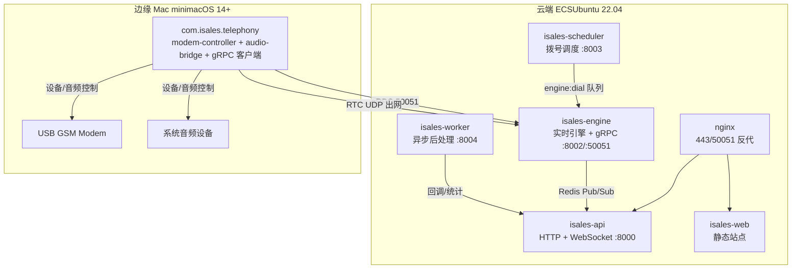
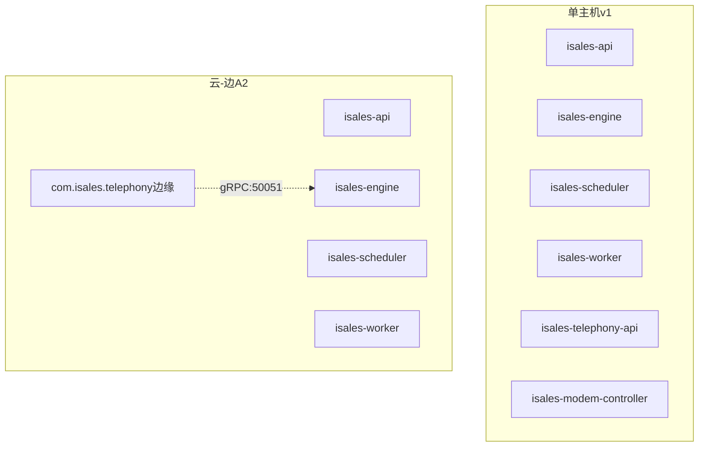
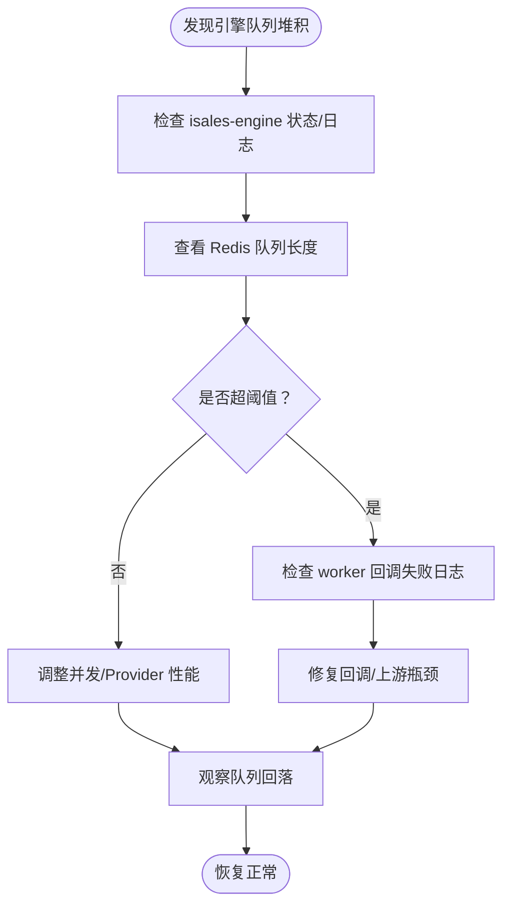
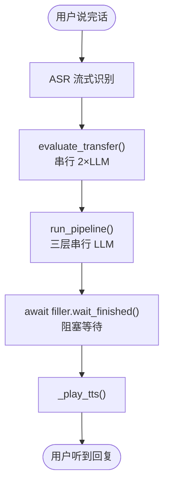
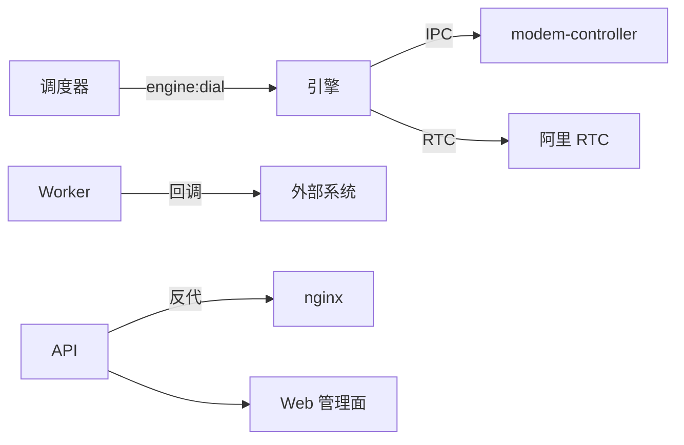

# 故障排查指南

<cite>
**本文引用的文件**
- [README.md](file://README.md)
- [RUNBOOK.md](file://deploy/RUNBOOK.md)
- [RUNBOOK-cloud.md](file://deploy/RUNBOOK-cloud.md)
- [RUNBOOK-edge.md](file://deploy/RUNBOOK-edge.md)
- [cloud/README.md](file://deploy/cloud/README.md)
- [edge/README.md](file://deploy/edge/README.md)
- [monitoring/README.md](file://deploy/monitoring/README.md)
- [cloud/monitoring/README.md](file://deploy/cloud/monitoring/README.md)
- [monitoring/alert_rules.yml.example](file://deploy/monitoring/alert_rules.yml.example)
- [cloud/monitoring/alert_rules.yml.example](file://deploy/cloud/monitoring/alert_rules.yml.example)
- [monitoring/prometheus.yml.example](file://deploy/monitoring/prometheus.yml.example)
- [cloud/monitoring/prometheus.yml.example](file://deploy/cloud/monitoring/prometheus.yml.example)
- [DESIGN.md](file://DESIGN.md)
- [IMPLEMENTATION_PLAN.md](file://IMPLEMENTATION_PLAN.md)
- [通话响应延迟分析.md](file://通话响应延迟分析.md)
- [通话响应延迟分析报告.md](file://通话响应延迟分析报告.md)
</cite>

## 目录
1. [简介](#简介)
2. [项目结构](#项目结构)
3. [核心组件](#核心组件)
4. [架构总览](#架构总览)
5. [详细组件分析](#详细组件分析)
6. [依赖分析](#依赖分析)
7. [性能考量](#性能考量)
8. [故障排查指南](#故障排查指南)
9. [结论](#结论)
10. [附录](#附录)

## 简介
本指南面向 iSales 运维工程师与现场支持人员，提供从单主机到云-边分离部署形态的完整故障排查手册。内容覆盖常见症状定位、诊断步骤、日志分析技巧、性能监控指标与告警处理流程，并深入解析通话响应延迟的影响因素与优化策略。同时给出硬件、网络、服务异常的排查方法与实战案例，帮助快速恢复业务。

## 项目结构
iSales 采用多仓协作与统一部署脚本的组织方式，核心服务包括 API、引擎、调度器、Worker、Telephony（设备与拨号）、Web 管理面。部署支持 Linux systemd 与 macOS launchd 两种平台，v1.0 提供云-边分离拓扑（ECS 云端 + Mac mini 边缘）。

图表来源
- [cloud/README.md:10-53](file://deploy/cloud/README.md#L10-L53)
- [edge/README.md:10-40](file://deploy/edge/README.md#L10-L40)

章节来源
- [README.md:16-30](file://README.md#L16-L30)
- [cloud/README.md:10-53](file://deploy/cloud/README.md#L10-L53)
- [edge/README.md:10-40](file://deploy/edge/README.md#L10-L40)

## 核心组件
- API 服务：提供管理后台 CRUD、统计、WebSocket 推送、健康检查。
- 引擎服务：实时通话引擎，包含状态机、AI 三层管线、打断/沉默/垫词、转人工、收尾等模块。
- 调度器：按时间窗口与并发限制分发待拨号码至引擎队列。
- Worker：异步后处理（摘要、字段提取、回调、指标聚合）。
- Telephony：设备/卡管理与拨号控制，包含 modem-controller 与 telephony-api。
- Web：Vue3 管理面，SPA 由 nginx 提供静态托管。

章节来源
- [DESIGN.md:9-44](file://DESIGN.md#L9-L44)
- [IMPLEMENTATION_PLAN.md:95-147](file://IMPLEMENTATION_PLAN.md#L95-L147)
- [IMPLEMENTATION_PLAN.md:151-187](file://IMPLEMENTATION_PLAN.md#L151-L187)
- [IMPLEMENTATION_PLAN.md:190-261](file://IMPLEMENTATION_PLAN.md#L190-L261)

## 架构总览
- 单主机形态：服务均在单机运行，modem-controller 与 telephony-api 与引擎同机部署。
- 云-边分离形态：云端仅运行 API、引擎、调度器、Worker、Web（nginx），边缘 Mac mini 仅运行 telephony（含 modem-controller + audio-bridge + gRPC 客户端 + 本地 telephony-api loopback）。
- 通信：边缘通过 gRPC:50051 与云端引擎交互，媒体面通过阿里 RTC PaaS。

图表来源
- [cloud/README.md:10-53](file://deploy/cloud/README.md#L10-L53)
- [edge/README.md:10-40](file://deploy/edge/README.md#L10-L40)

章节来源
- [cloud/README.md:10-53](file://deploy/cloud/README.md#L10-L53)
- [edge/README.md:10-40](file://deploy/edge/README.md#L10-L40)

## 详细组件分析

### 引擎服务（isales-engine）故障排查
- 常见症状
  - 引擎队列堆积（engine:dial 队列长度异常升高）
  - 引擎进程重启/崩溃导致活跃通话中断
  - 回调失败率上升
  - 延迟预算告警（首 TTS P95 > 800ms）

- 诊断步骤
  - 检查引擎服务状态与日志：systemctl/status + journalctl
  - 查看 Redis 队列深度：redis-cli llen engine:dial
  - 检查回调失败详情：worker callback_log
  - 观察延迟预算指标：engine 首 TTS P95

- 解决方案
  - 重启引擎服务，确认队列回落
  - 降低并发或优化 Provider 性能
  - 临时降级：将多角色 PK 从 N>1 降至 N=1 以缓解延迟

图表来源
- [RUNBOOK.md:163-196](file://deploy/RUNBOOK.md#L163-L196)
- [cloud/monitoring/alert_rules.yml.example:69-86](file://deploy/cloud/monitoring/alert_rules.yml.example#L69-L86)

章节来源
- [RUNBOOK.md:163-196](file://deploy/RUNBOOK.md#L163-L196)
- [cloud/monitoring/alert_rules.yml.example:69-86](file://deploy/cloud/monitoring/alert_rules.yml.example#L69-L86)

### 调度器（isales-scheduler）与 Worker（isales-worker）故障排查
- 常见症状
  - 调度器队列堆积（engine:dial 深度异常）
  - Worker 任务卡住（summarize_call 未执行）
  - 回调失败率高

- 诊断步骤
  - 查看调度器/Worker 状态与日志
  - 检查 Redis 队列长度与内容
  - 核对回调日志与签名密钥一致性

- 解决方案
  - 重启 Worker 服务
  - 检查 Redis 计数器与会话 TTL，清理孤儿计数
  - 修复回调签名密钥或 Provider 凭据

章节来源
- [RUNBOOK.md:163-196](file://deploy/RUNBOOK.md#L163-L196)
- [cloud/monitoring/alert_rules.yml.example:89-102](file://deploy/cloud/monitoring/alert_rules.yml.example#L89-L102)

### Telephony（设备/拨号）故障排查
- 常见症状
  - modem-controller 设备断连
  - 拨号失败（dial_ack 失败）
  - 设备离线/心跳缺失

- 诊断步骤
  - 检查 udev 事件与串口路径
  - 核对 SIM 状态与信号强度
  - 查看边缘心跳与 gRPC 连通性

- 解决方案
  - 重新插拔 USB，确认串口路径
  - 更换 SIM 卡或检查套餐余额
  - 修复 gRPC 令牌或网络配置

章节来源
- [RUNBOOK.md:163-196](file://deploy/RUNBOOK.md#L163-L196)
- [RUNBOOK-edge.md:166-195](file://deploy/RUNBOOK-edge.md#L166-L195)

### API/Web 故障排查
- 常见症状
  - nginx 502（/api/ 或 /ws/）
  - 登录鉴权失败（JWT）
  - Web SPA 加载但操作 401

- 诊断步骤
  - 直连健康检查：curl http://127.0.0.1:8000/healthz
  - 检查 API 服务状态与日志
  - 核对管理员密码哈希与 JWT 密钥一致性

- 解决方案
  - 重启 API 服务或修复 nginx 配置
  - 重新生成管理员密码哈希并重启服务
  - 重新登录获取新 Token

章节来源
- [RUNBOOK.md:163-196](file://deploy/RUNBOOK.md#L163-L196)
- [cloud/monitoring/alert_rules.yml.example:89-102](file://deploy/cloud/monitoring/alert_rules.yml.example#L89-L102)

### 通话响应延迟分析
- 延迟主因
  - 三层串行 LLM（角色→裁判→润色）+ 非流式整段生成
  - 转人工判断串行前置，阻塞垫词起播
  - 垫词 wait_finished 强制阻塞回复播放
  - Provider 每次调用新建 httpx client，无连接复用

- 优化建议
  - 将垫词起播前置至 transfer 判断之前
  - 垫词播放改为预渲染音频，跳过实时 TTS
  - Provider 持有长生命周期 httpx.AsyncClient，复用连接
  - 评估是否每轮都需完整三层管线，简单回复走“单角色直出”

图表来源
- [通话响应延迟分析报告.md:21-50](file://通话响应延迟分析报告.md#L21-L50)
- [通话响应延迟分析.md:9-27](file://通话响应延迟分析.md#L9-L27)

章节来源
- [通话响应延迟分析报告.md:54-106](file://通话响应延迟分析报告.md#L54-L106)
- [通话响应延迟分析.md:30-56](file://通话响应延迟分析.md#L30-L56)

## 依赖分析
- 服务耦合
  - 调度器 → 引擎：engine:dial 队列
  - 引擎 → Telephony：本地 IPC（modem-controller）
  - 引擎 → RTC：阿里 RTC PaaS
  - Worker → 回调：外部 HTTP Endpoint
  - API → Web：nginx 反代

- 外部依赖
  - 数据库：PostgreSQL（RDS）
  - 缓存：Redis（Tair/Redis Cloud）
  - 对象存储：OSS（录音/预渲染）
  - 通信：阿里 RTC PaaS

图表来源
- [IMPLEMENTATION_PLAN.md:151-187](file://IMPLEMENTATION_PLAN.md#L151-L187)
- [cloud/README.md:25-29](file://deploy/cloud/README.md#L25-L29)

章节来源
- [IMPLEMENTATION_PLAN.md:151-187](file://IMPLEMENTATION_PLAN.md#L151-L187)
- [cloud/README.md:25-29](file://deploy/cloud/README.md#L25-L29)

## 性能考量
- 监控与告警
  - 单主机：dial 队列堆积、设备标记率、回调失败率、PG 连接压力
  - 云-边：边缘离线/重连风暴、ARTC 推流缓冲满、引擎管线延迟预算、会话数漂移

- 指标建议
  - 引擎：活跃通话数、队列深度、首 TTS 首字节延迟、Provider 调用耗时
  - 边缘：心跳时间、gRPC 断线次数、RTC 推流缓冲满次数
  - 回调：失败率、平均耗时、重试次数

- 资源规划
  - CPU/内存：按并发与 Provider 响应时间预留 20-40% 缓冲
  - 网络：RTC UDP 大范围出网，gRPC 50051 长连接需抑制 idle
  - 存储：PG/Redis 持久化与备份策略，OSS 归档与跨域复制

章节来源
- [monitoring/README.md:8-48](file://deploy/monitoring/README.md#L8-L48)
- [cloud/monitoring/README.md:9-37](file://deploy/cloud/monitoring/README.md#L9-L37)
- [cloud/monitoring/alert_rules.yml.example:12-86](file://deploy/cloud/monitoring/alert_rules.yml.example#L12-L86)

## 故障排查指南

### 一、通用排查流程
- 快速定位
  - 先看服务状态：systemctl status 或 launchctl print
  - 再看错误日志：journalctl -p err 或 log stream
  - 最后看关键指标：Prometheus/Grafana

- 一小时应急清单
  - 检查引擎队列深度与活跃通话数
  - 核对回调失败日志与签名密钥
  - 验证数据库/缓存连通性
  - 确认边缘心跳与 gRPC 连通性

章节来源
- [RUNBOOK.md:180-196](file://deploy/RUNBOOK.md#L180-L196)
- [RUNBOOK-edge.md:241-254](file://deploy/RUNBOOK-edge.md#L241-L254)

### 二、常见症状与处置
- 引擎队列堆积
  - 检查引擎状态与日志
  - 重启引擎服务
  - 降低并发或优化 Provider

- 回调失败率高
  - 检查回调签名密钥与外部系统可达性
  - 查看回调日志中的响应码分布
  - 临时降级或修复凭据

- 边缘离线/重连风暴
  - 检查边缘心跳与 gRPC 令牌
  - 核对网络与安全组配置
  - 修复边缘机网络或令牌轮换

- nginx 502
  - 直连后端健康检查
  - 检查 nginx 配置与上游状态
  - 重启相关服务并观察

章节来源
- [RUNBOOK.md:163-196](file://deploy/RUNBOOK.md#L163-L196)
- [cloud/monitoring/alert_rules.yml.example:12-38](file://deploy/cloud/monitoring/alert_rules.yml.example#L12-L38)

### 三、日志分析技巧
- systemd/journald
  - 近 5 分钟错误日志：journalctl --since '5 min ago' -p err -u 'isales-*'
  - 引擎队列深度：redis-cli llen engine:dial
  - 活跃通话数：redis-cli get isales:concurrency:active

- macOS unified logging
  - 结构化日志：log stream --predicate 'subsystem BEGINSWITH "com.isales."'
  - LaunchAgent 状态：launchctl print

- 关键日志点
  - 引擎：gRPC 流连接、RTC 加入/离开、Provider 调用耗时
  - Telephony：设备注册/断连、拨号/挂断、音频设备状态
  - Worker：回调失败详情、任务重试

章节来源
- [RUNBOOK.md:180-196](file://deploy/RUNBOOK.md#L180-L196)
- [RUNBOOK-edge.md:224-240](file://deploy/RUNBOOK-edge.md#L224-L240)

### 四、性能监控与告警
- 单主机告警
  - dial 队列堆积、设备标记率、回调失败率、PG 连接压力

- 云-边告警
  - 边缘离线/重连风暴、ARTC 推流缓冲满、引擎管线延迟预算、会话数漂移

- 指标采集
  - Prometheus 抓取各服务 /metrics（待实现）
  - 云资源指标：RDS/Redis 通过 exporter 或云监控
  - 自定义指标：引擎首 TTS 首字节延迟、边缘心跳间隔

章节来源
- [monitoring/alert_rules.yml.example:8-77](file://deploy/monitoring/alert_rules.yml.example#L8-L77)
- [cloud/monitoring/alert_rules.yml.example:8-116](file://deploy/cloud/monitoring/alert_rules.yml.example#L8-L116)
- [monitoring/prometheus.yml.example:7-47](file://deploy/monitoring/prometheus.yml.example#L7-L47)
- [cloud/monitoring/prometheus.yml.example:7-37](file://deploy/cloud/monitoring/prometheus.yml.example#L7-L37)

### 五、通话响应延迟优化
- 短期优化
  - 将垫词起播前置至 transfer 判断之前
  - 垫词播放改为预渲染音频
  - Provider 复用 HTTP 连接，减少握手开销

- 中长期优化
  - 评估是否每轮都需完整三层管线
  - 将润色层改为 token 流式，边生成边喂 TTS
  - 裁判层与角色层流水化，缩短串行深度

章节来源
- [通话响应延迟分析报告.md:146-165](file://通话响应延迟分析报告.md#L146-L165)
- [通话响应延迟分析.md:185-196](file://通话响应延迟分析.md#L185-L196)

### 六、硬件与网络问题排查
- 硬件
  - USB GSM modem：检查串口路径、SIM 状态、信号强度
  - 音频设备：确认系统音频设备可用，必要时设置音频设备名
  - 边缘机：SQLite 离线 buffer 状态与容量

- 网络
  - gRPC 50051：DNS 解析、TLS 握手、keepalive 配置
  - RTC UDP：SDK 自检或工单协助
  - WAN 抖动：mtr 监控路径稳定性

章节来源
- [RUNBOOK.md:346-381](file://deploy/RUNBOOK.md#L346-L381)
- [RUNBOOK-edge.md:166-195](file://deploy/RUNBOOK-edge.md#L166-L195)

### 七、服务异常与回滚
- 回滚策略
  - 仅切换 release 软链 + 重启服务，不触碰数据库 schema
  - 云侧：DingRTC SDK 与 pybind 绑定按 release 版本恢复
  - 边缘：SQLite 离线 buffer 不丢，重连后自动补发

- schema 回退（例外）
  - 确认旧 schema 兼容性，必要时手工 downgrade

章节来源
- [RUNBOOK.md:84-115](file://deploy/RUNBOOK.md#L84-L115)
- [RUNBOOK-cloud.md:281-297](file://deploy/RUNBOOK-cloud.md#L281-L297)

### 八、应急响应流程
- 一级故障（影响通话/回调）
  - 立即检查引擎与 Telephony
  - 重启引擎与相关服务
  - 观察队列回落与回调恢复

- 二级故障（边缘离线/网络）
  - 检查边缘心跳与 gRPC 令牌
  - 核对安全组与 SLB 配置
  - 修复网络或令牌轮换

- 三级故障（平台性问题）
  - 检查数据库/缓存连通性
  - 重启相关服务并验证
  - 恢复后持续观察指标

章节来源
- [RUNBOOK.md:163-196](file://deploy/RUNBOOK.md#L163-L196)
- [RUNBOOK-cloud.md:584-599](file://deploy/RUNBOOK-cloud.md#L584-L599)

## 结论
本指南提供了从部署形态到具体组件的全链路故障排查方法，结合监控告警与延迟分析，帮助运维团队快速定位并解决问题。建议在日常运维中：
- 建立标准化巡检与压测流程
- 持续优化 Provider 与引擎管线，降低首 TTS 延迟
- 完善边缘与网络的可观测性，尽早发现离线与抖动
- 定期演练回滚与灾备，确保业务连续性

## 附录

### A. 快速命令索引
- 服务状态概览：systemctl status isales-{api,engine,scheduler,worker,telephony-api,modem-controller}
- 近期错误日志：journalctl --since '5 min ago' -p err -u 'isales-*'
- 活跃通话数：redis-cli get isales:concurrency:active
- 引擎队列深度：redis-cli llen engine:dial

章节来源
- [RUNBOOK.md:180-196](file://deploy/RUNBOOK.md#L180-L196)

### B. 监控模板与告警
- 单主机监控模板：prometheus.yml.example、alert_rules.yml.example
- 云-边监控模板：cloud/monitoring 下的 prometheus.yml.example、alert_rules.yml.example
- 建议：将模板复制到 Prometheus 主机并校验语法

章节来源
- [monitoring/README.md:8-48](file://deploy/monitoring/README.md#L8-L48)
- [cloud/monitoring/README.md:9-37](file://deploy/cloud/monitoring/README.md#L9-L37)