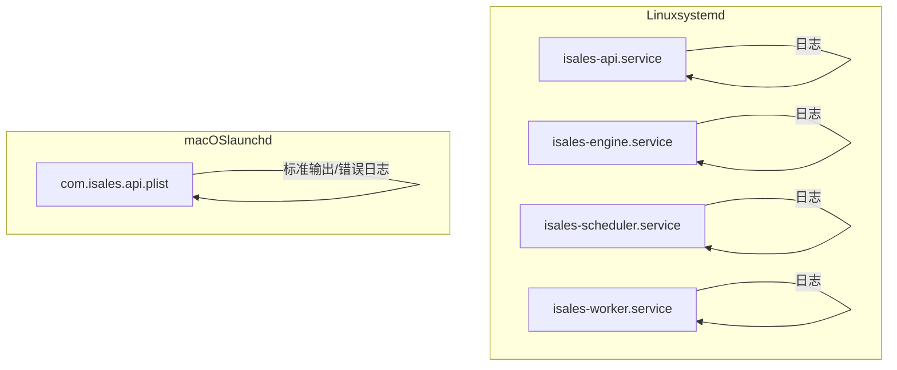
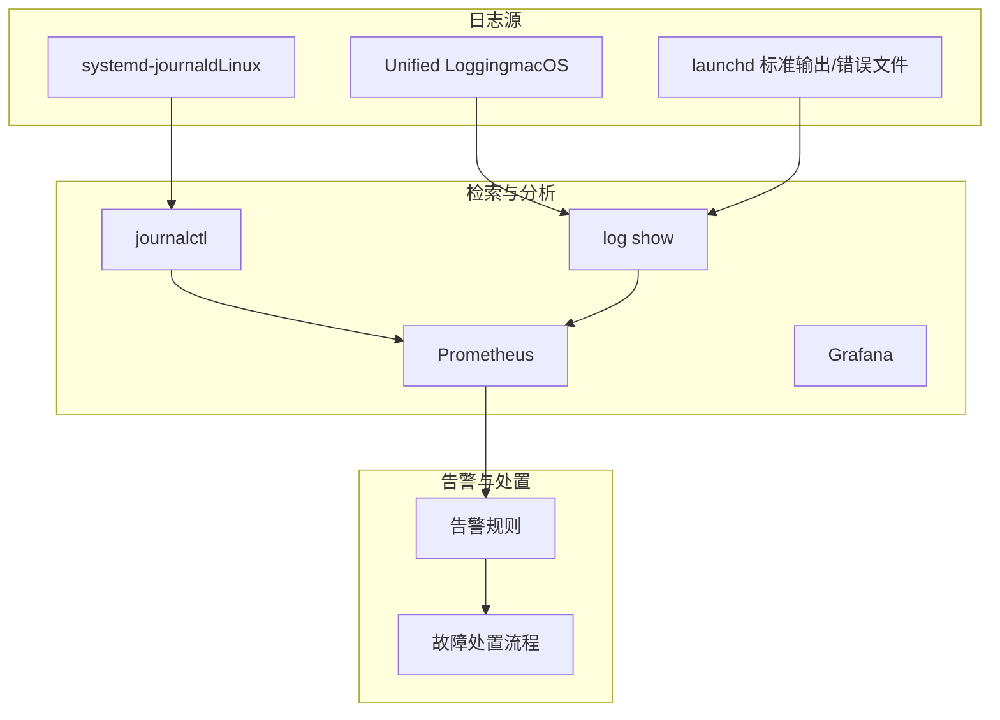
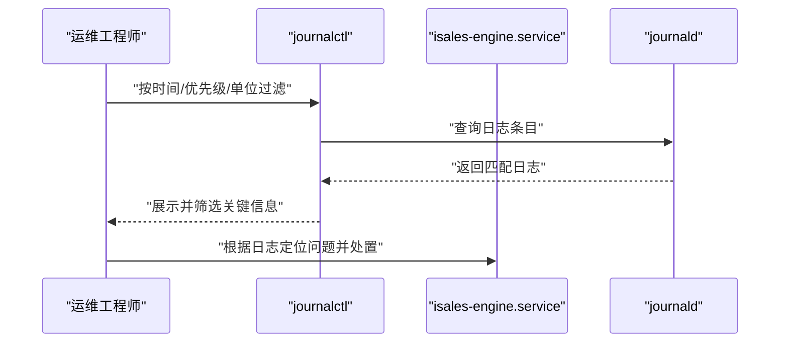
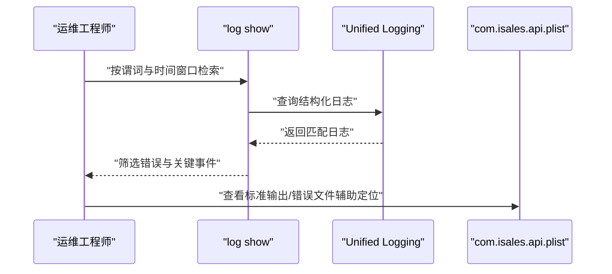
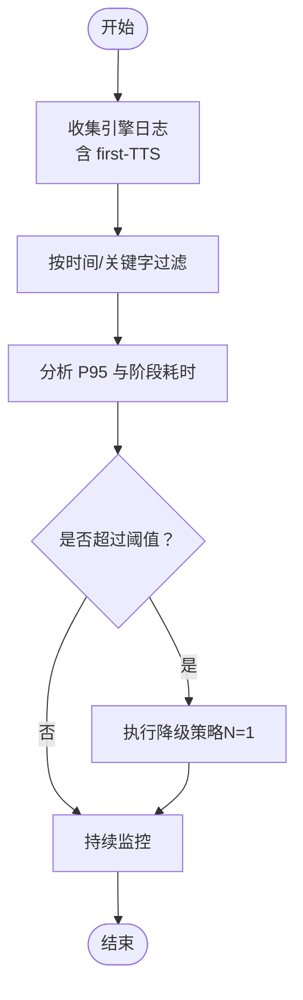
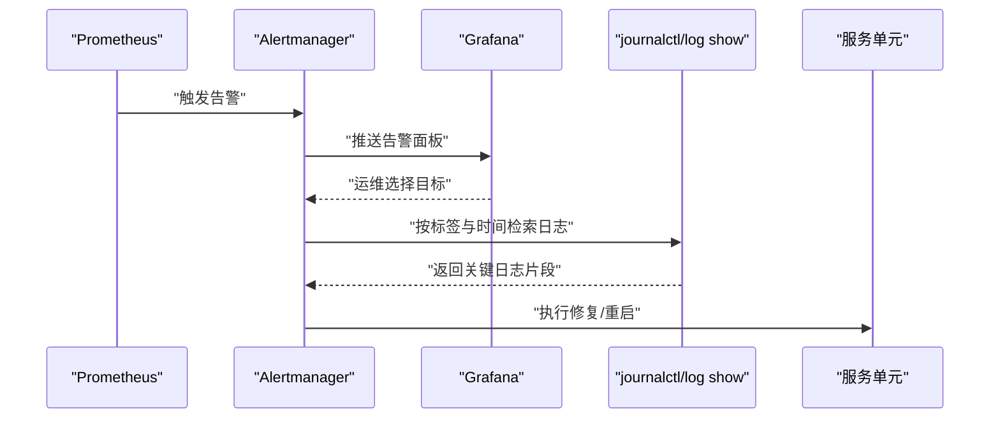

# 日志分析技巧

<cite>
**本文引用的文件**
- [RUNBOOK.md](file://deploy/RUNBOOK.md)
- [RUNBOOK-cloud.md](file://deploy/RUNBOOK-cloud.md)
- [RUNBOOK-edge.md](file://deploy/RUNBOOK-edge.md)
- [isales-api.service](file://deploy/cloud/systemd/isales-api.service)
- [isales-engine.service](file://deploy/cloud/systemd/isales-engine.service)
- [isales-scheduler.service](file://deploy/cloud/systemd/isales-scheduler.service)
- [isales-worker.service](file://deploy/cloud/systemd/isales-worker.service)
- [com.isales.api.plist](file://deploy/macos/plist/com.isales.api.plist)
- [README.md（监控）](file://deploy/monitoring/README.md)
- [alert_rules.yml.example](file://deploy/cloud/monitoring/alert_rules.yml.example)
- [prometheus.yml.example](file://deploy/cloud/monitoring/prometheus.yml.example)
</cite>

## 目录
1. [简介](#简介)
2. [项目结构](#项目结构)
3. [核心组件](#核心组件)
4. [架构总览](#架构总览)
5. [详细组件分析](#详细组件分析)
6. [依赖关系分析](#依赖关系分析)
7. [性能考量](#性能考量)
8. [故障排查指南](#故障排查指南)
9. [结论](#结论)
10. [附录](#附录)

## 简介
本技术指南面向 iSales 运维工程师，聚焦于系统各组件的日志结构、日志级别与关键信息提取方法，结合运行手册中的日志分析示例，系统讲解如何使用 journalctl、log show 等工具进行日志检索与分析，并提供错误日志识别技巧、性能日志分析方法与告警日志处理流程。内容覆盖 Linux systemd 与 macOS launchd 场景，包含常用日志查询命令、日志过滤技巧与批量日志分析方法，帮助快速定位问题并高效诊断。

## 项目结构
iSales 采用多服务分布式架构，支持 Linux（systemd）与 macOS（launchd）两种平台。日志采集主要依赖：
- Linux：systemd-journald（journalctl）
- macOS：Unified Logging（log show）与 launchd 标准输出/错误文件

服务单元文件定义了工作目录、环境变量文件、重启策略与超时时间，直接影响日志上下文与可观测性。

**图表来源**
- [isales-api.service:1-35](file://deploy/cloud/systemd/isales-api.service#L1-L35)
- [isales-engine.service:1-42](file://deploy/cloud/systemd/isales-engine.service#L1-L42)
- [isales-scheduler.service:1-31](file://deploy/cloud/systemd/isales-scheduler.service#L1-L31)
- [isales-worker.service:1-31](file://deploy/cloud/systemd/isales-worker.service#L1-L31)
- [com.isales.api.plist:1-37](file://deploy/macos/plist/com.isales.api.plist#L1-L37)

**章节来源**
- [isales-api.service:1-35](file://deploy/cloud/systemd/isales-api.service#L1-L35)
- [isales-engine.service:1-42](file://deploy/cloud/systemd/isales-engine.service#L1-L42)
- [isales-scheduler.service:1-31](file://deploy/cloud/systemd/isales-scheduler.service#L1-L31)
- [isales-worker.service:1-31](file://deploy/cloud/systemd/isales-worker.service#L1-L31)
- [com.isales.api.plist:1-37](file://deploy/macos/plist/com.isales.api.plist#L1-L37)

## 核心组件
- isales-api：HTTP/WebSocket 服务，承载前端与外部接口交互，日志用于追踪鉴权、路由与下游依赖。
- isales-engine：实时通话引擎，负责 gRPC 云端-边缘流、AI 管道与 RTC SDK 集成，日志用于分析流连通性、延迟预算与 SDK 异常。
- isales-scheduler：线索调度器，日志用于队列深度、重试与并发控制分析。
- isales-worker：异步后处理，日志用于回调失败率、硬件告警与离线缓冲区健康度。
- macOS Telephony（边缘侧）：LaunchAgent 进程，日志位于统一日志与 SQLite 离线缓冲数据库，便于排查网络、设备与音频链路问题。

**章节来源**
- [RUNBOOK.md:163-196](file://deploy/RUNBOOK.md#L163-L196)
- [RUNBOOK-cloud.md:325-443](file://deploy/RUNBOOK-cloud.md#L325-L443)
- [RUNBOOK-edge.md:224-233](file://deploy/RUNBOOK-edge.md#L224-L233)

## 架构总览
下图展示日志采集与分析的关键路径：服务单元文件决定日志来源与上下文，运维通过 journalctl/log show 进行检索，Prometheus/Grafana 以告警规则驱动问题发现。

**图表来源**
- [isales-api.service:1-35](file://deploy/cloud/systemd/isales-api.service#L1-L35)
- [com.isales.api.plist:1-37](file://deploy/macos/plist/com.isales.api.plist#L1-L37)
- [README.md（监控）:1-65](file://deploy/monitoring/README.md#L1-L65)
- [alert_rules.yml.example:1-116](file://deploy/cloud/monitoring/alert_rules.yml.example#L1-L116)
- [prometheus.yml.example:1-77](file://deploy/cloud/monitoring/prometheus.yml.example#L1-L77)

## 详细组件分析

### Linux 日志结构与检索
- systemd-journald 作为日志守护进程，按服务单元聚合日志，支持按单位、优先级、时间范围过滤。
- 常用检索模式：
  - 按单位：journalctl -u isales-engine -n 50 --no-pager
  - 按优先级：journalctl -p err -u isales-api
  - 按时间：journalctl --since '5 min ago'
  - 组合过滤：journalctl --since '10 min ago' -u isales-{api,engine,scheduler,worker} -p err
- 关键信息提取：
  - gRPC 流连通性：搜索“edge.*stream”“stream disconnected”
  - 引擎延迟预算：搜索“first-TTS”“pipeline”相关日志
  - 回调失败：搜索“callback failed”
  - 数据库连接压力：搜索“pg_stat_activity”

**图表来源**
- [isales-engine.service:1-42](file://deploy/cloud/systemd/isales-engine.service#L1-L42)
- [RUNBOOK.md:74-75](file://deploy/RUNBOOK.md#L74-L75)

**章节来源**
- [RUNBOOK.md:74-75](file://deploy/RUNBOOK.md#L74-L75)
- [RUNBOOK.md:188-189](file://deploy/RUNBOOK.md#L188-L189)
- [RUNBOOK-cloud.md:337-349](file://deploy/RUNBOOK-cloud.md#L337-L349)

### macOS 日志结构与检索
- Unified Logging 通过 log show 从系统日志中检索结构化日志，支持谓词过滤与时间窗口。
- 常用检索模式：
  - 按子系统：log show --predicate 'subsystem BEGINSWITH "com.isales."' --last 5m
  - 按错误级别：log show --predicate 'subsystem == "com.isales.api"' --last 5m | grep -i error
- 关键信息提取：
  - LaunchAgent 状态：launchctl print system/com.isales.api
  - 标准输出/错误文件：/opt/isales/logs/api.{out,err}.log
  - 边缘 Telephony：log stream --predicate 'subsystem == "isales.telephony"'

**图表来源**
- [com.isales.api.plist:1-37](file://deploy/macos/plist/com.isales.api.plist#L1-L37)
- [RUNBOOK.md:371-372](file://deploy/RUNBOOK.md#L371-L372)

**章节来源**
- [RUNBOOK.md:371-372](file://deploy/RUNBOOK.md#L371-L372)
- [RUNBOOK-edge.md:224-233](file://deploy/RUNBOOK-edge.md#L224-L233)

### 错误日志识别技巧
- Linux：
  - 使用 -p err 限定错误级别，快速收敛范围
  - 结合 --since '5 min ago' 获取近实时错误
  - 通过 -u 组合多个服务，定位跨服务链路问题
- macOS：
  - 使用谓词过滤 subsystem，缩小检索范围
  - 结合 grep -i error 进行关键词过滤
  - 对比标准输出/错误文件与 Unified Logging，交叉验证

**章节来源**
- [RUNBOOK.md:188-189](file://deploy/RUNBOOK.md#L188-L189)
- [RUNBOOK.md:371-372](file://deploy/RUNBOOK.md#L371-L372)

### 性能日志分析方法
- 引擎延迟预算（P95 > 800 ms）：
  - 通过 RUNBOOK 中的降级策略（降低多角色并发）缓解
  - 结合引擎日志中的“first-TTS”阶段耗时分析
- gRPC 流连通性：
  - 搜索“edge.*stream”“stream disconnected”，结合安全组与 SLB 配置核查
- 回调失败率：
  - 通过 worker 日志统计失败次数，结合告警阈值评估

**图表来源**
- [RUNBOOK-cloud.md:589-591](file://deploy/RUNBOOK-cloud.md#L589-L591)

**章节来源**
- [RUNBOOK-cloud.md:589-591](file://deploy/RUNBOOK-cloud.md#L589-L591)

### 告警日志处理流程
- Prometheus 告警规则触发后，Grafana 展示仪表盘，指引定位具体服务与指标。
- 处理流程：
  - 根据告警标签（如 device_id）缩小范围
  - 使用 journalctl/log show 检索对应时间段内的日志
  - 结合服务单元文件的工作目录与环境变量，核对日志上下文
  - 执行修复（如重启服务、调整配置、核查网络）

**图表来源**
- [README.md（监控）:1-65](file://deploy/monitoring/README.md#L1-L65)
- [alert_rules.yml.example:1-116](file://deploy/cloud/monitoring/alert_rules.yml.example#L1-L116)
- [prometheus.yml.example:1-77](file://deploy/cloud/monitoring/prometheus.yml.example#L1-L77)

**章节来源**
- [README.md（监控）:1-65](file://deploy/monitoring/README.md#L1-L65)
- [alert_rules.yml.example:1-116](file://deploy/cloud/monitoring/alert_rules.yml.example#L1-L116)
- [prometheus.yml.example:1-77](file://deploy/cloud/monitoring/prometheus.yml.example#L1-L77)

## 依赖关系分析
- 服务单元文件定义了环境变量文件（/etc/isales/env/*.env）、工作目录与重启策略，直接影响日志上下文与可观测性。
- Linux 与 macOS 的日志采集方式不同，但可通过统一的检索命令实现跨平台分析。
- 监控配置与告警规则依赖服务的指标端点，当前部分服务尚未实现 /metrics，建议逐步落地。

**图表来源**
- [isales-api.service:16-17](file://deploy/cloud/systemd/isales-api.service#L16-L17)
- [isales-engine.service:20-25](file://deploy/cloud/systemd/isales-engine.service#L20-L25)
- [com.isales.api.plist:33-34](file://deploy/macos/plist/com.isales.api.plist#L33-L34)
- [README.md（监控）:1-65](file://deploy/monitoring/README.md#L1-L65)

**章节来源**
- [isales-api.service:16-17](file://deploy/cloud/systemd/isales-api.service#L16-L17)
- [isales-engine.service:20-25](file://deploy/cloud/systemd/isales-engine.service#L20-L25)
- [com.isales.api.plist:33-34](file://deploy/macos/plist/com.isales.api.plist#L33-L34)
- [README.md（监控）:1-65](file://deploy/monitoring/README.md#L1-L65)

## 性能考量
- 服务重启与超时：
  - isales-engine 的 TimeoutStopSec=35，确保优雅关闭过程中不打断正在进行的通话
  - systemd 的 RestartSec=5，避免频繁重启导致日志抖动
- 日志级别与过滤：
  - 使用 -p err 与 --since '5 min ago' 降低噪声，提升定位效率
- 指标端点：
  - 部分服务尚未实现 /metrics，建议优先补齐关键指标（如延迟、队列深度、连接数），以减少仅靠日志分析的盲区

**章节来源**
- [isales-engine.service:16-18](file://deploy/cloud/systemd/isales-engine.service#L16-L18)
- [RUNBOOK.md:188-189](file://deploy/RUNBOOK.md#L188-L189)

## 故障排查指南
- 常见症状与首查步骤：
  - API 登录失败：检查鉴权与 JWT 密钥一致性
  - gRPC 502：检查 engine 是否崩溃与 core dump
  - 边缘离线：检查 worker watchdog 日志与 nginx 错误日志
  - 回调失败率高：检查 worker 日志与下游服务状态
- 常用命令与技巧：
  - Linux：journalctl -u isales-{api,engine,scheduler,worker} --no-pager；按优先级与时间过滤
  - macOS：log show --predicate 'subsystem BEGINSWITH "com.isales."' --last 5m；对比标准输出/错误文件
  - 批量分析：组合 -u 与 -p，配合管道 grep 进行关键词筛选

**章节来源**
- [RUNBOOK.md:163-196](file://deploy/RUNBOOK.md#L163-L196)
- [RUNBOOK-cloud.md:584-599](file://deploy/RUNBOOK-cloud.md#L584-L599)
- [RUNBOOK-edge.md:241-251](file://deploy/RUNBOOK-edge.md#L241-L251)

## 结论
通过系统化的日志结构理解、检索命令与过滤技巧，结合监控告警与服务单元文件的上下文信息，iSales 的运维工程师可以在 Linux 与 macOS 平台上高效开展日志诊断与故障定位。建议逐步补齐各服务的 /metrics 端点，以实现“日志+指标”的双轨观测，进一步提升问题定位速度与准确性。

## 附录
- 常用命令速查
  - Linux：journalctl -u isales-engine -n 50 --no-pager；journalctl --since '5 min ago' -p err -u 'isales-*'
  - macOS：log show --predicate 'subsystem BEGINSWITH "com.isales."' --last 5m；log show --predicate 'subsystem == "com.isales.api"' --last 5m | grep -i error
- 批量日志分析
  - 组合 -u 与 -p，使用管道 grep 进行关键词筛选
  - 对比不同服务的时间窗口，交叉验证问题发生时间线
- 日志保留与轮转
  - macOS 日志保留：可参考 RUNBOOK-edge.md 中的 cron 截断示例，避免日志文件过大影响检索效率

**章节来源**
- [RUNBOOK.md:188-189](file://deploy/RUNBOOK.md#L188-L189)
- [RUNBOOK.md:371-372](file://deploy/RUNBOOK.md#L371-L372)
- [RUNBOOK-edge.md:234-239](file://deploy/RUNBOOK-edge.md#L234-L239)