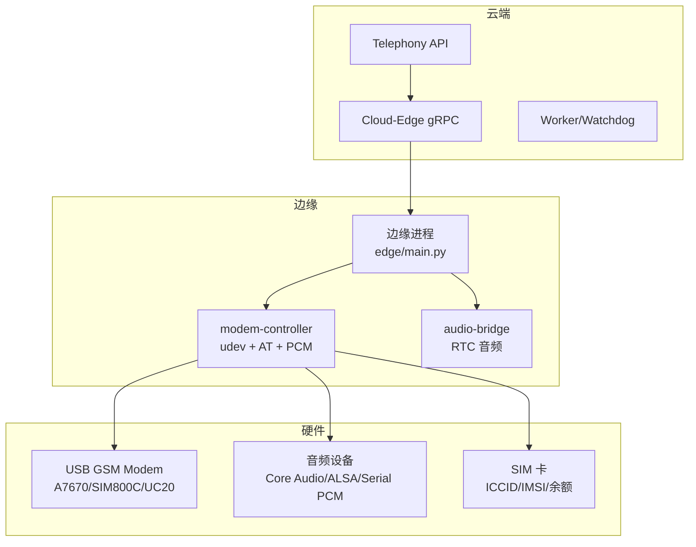
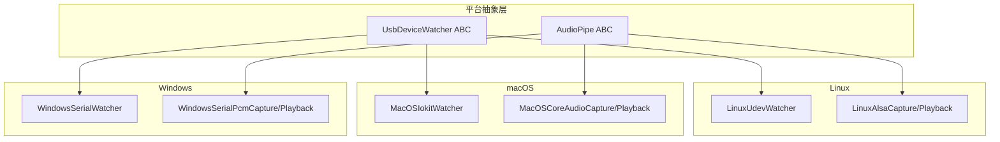
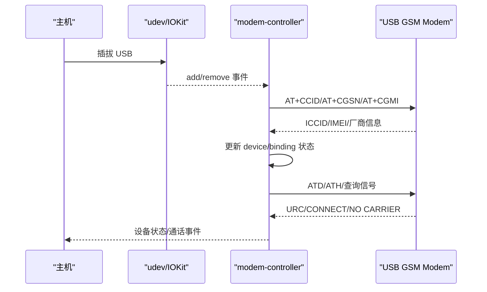
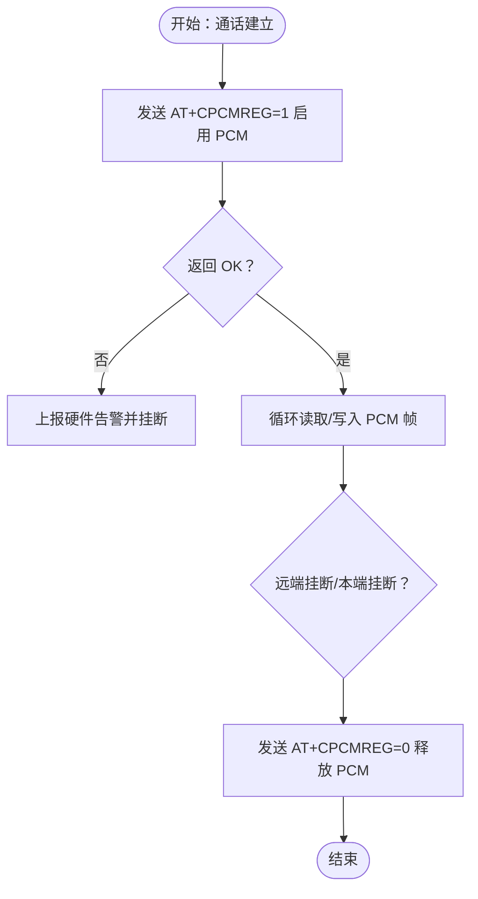
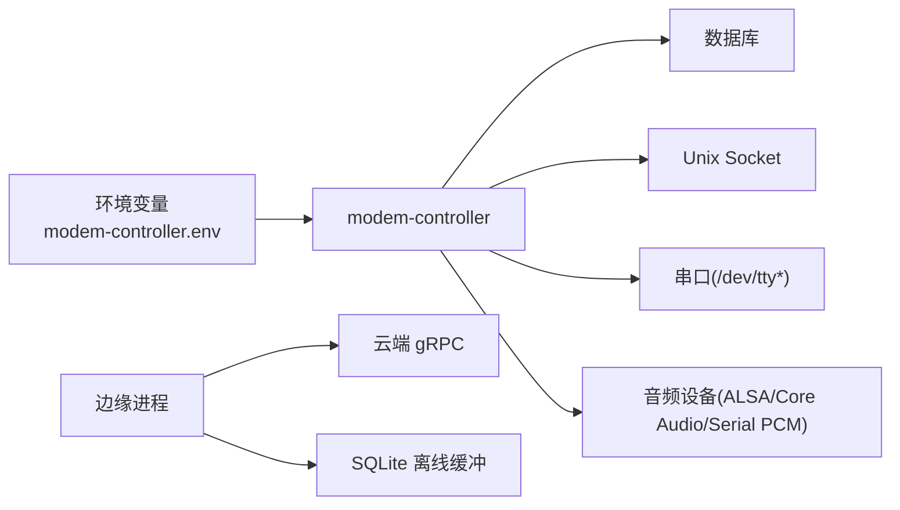
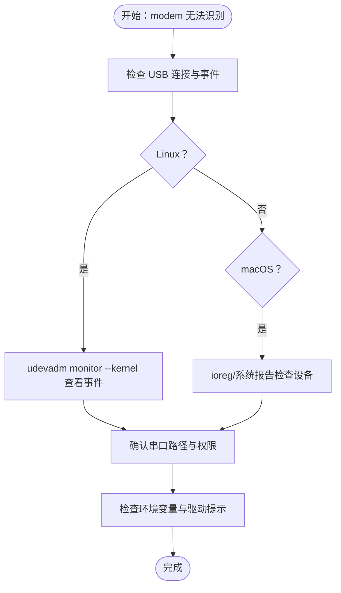

# 硬件问题排查

<cite>
**本文档引用的文件**
- [README.md](file://README.md)
- [RUNBOOK.md](file://deploy/RUNBOOK.md)
- [RUNBOOK-edge.md](file://deploy/RUNBOOK-edge.md)
- [device-hardware 规范.md](file://openspec/specs/device-hardware/spec.md)
- [macOS 本地音频设备变更设计.md](file://openspec/changes/macos-local-audio-dev/design.md)
- [Windows 客户端核心变更验收.md](file://openspec/changes/archive/2026-05-17-windows-client-core/acceptance.md)
- [Windows 客户端核心变更提案.md](file://openspec/changes/archive/2026-05-17-windows-client-core/proposal.md)
- [Windows 客户端核心变更设计.md](file://openspec/changes/archive/2026-05-17-windows-client-core/design.md)
- [modem-controller 环境变量示例](file://deploy/env/modem-controller.env.example)
</cite>

## 目录
1. [简介](#简介)
2. [项目结构](#项目结构)
3. [核心组件](#核心组件)
4. [架构总览](#架构总览)
5. [详细组件分析](#详细组件分析)
6. [依赖关系分析](#依赖关系分析)
7. [性能考量](#性能考量)
8. [故障排查指南](#故障排查指南)
9. [结论](#结论)
10. [附录](#附录)

## 简介
本技术指南面向现场工程师，聚焦 iSales 硬件问题排查，涵盖 USB 调制解调器、音频设备、SIM 卡等关键硬件组件的故障识别与处理。内容基于运行手册中的硬件故障案例，结合设备连接检测、串口通信诊断、音频设备配置验证，提供硬件兼容性检查、驱动程序安装与设备权限配置指导，并包含硬件替换流程、设备状态监控与预防性维护建议，帮助快速定位并解决现场问题。

## 项目结构
iSales v1 采用云边分离架构，边缘侧运行 modem-controller 与 audio-bridge，负责 USB GSM modem 的设备管理、AT 命令交互与音频管道；云端通过 gRPC 与边缘通信，调度拨号与通话状态。部署支持 Linux systemd 与 macOS launchd 两种模式，边缘侧另有专用的 edge 部署流程与诊断工具。

**图表来源**
- [device-hardware 规范.md](file://openspec/specs/device-hardware/spec.md)
- [RUNBOOK-edge.md](file://deploy/RUNBOOK-edge.md)

**章节来源**
- [README.md:1-86](file://README.md#L1-L86)
- [RUNBOOK.md:1-394](file://deploy/RUNBOOK.md#L1-L394)
- [RUNBOOK-edge.md:1-254](file://deploy/RUNBOOK-edge.md#L1-L254)

## 核心组件
- USB GSM Modem：通过 USB 直连主机，modem-controller 通过 udev（Linux）或 IOKit（macOS）监听设备插拔事件，自动识别并初始化，支持 AT 命令（拨号、挂断、信号强度、SIM 状态等）。
- 音频设备：Linux 使用 ALSA，macOS 使用 Core Audio，Windows 使用 Serial PCM-over-COM；音频在 8kHz/16kHz 之间重采样，双向传输 PCM。
- SIM 卡：记录 ICCID、IMSI、号码、运营商、套餐、余额、信号强度、状态等，支持热插拔变更绑定。
- 边缘进程：负责与云端 gRPC 通信、设备选择、心跳上报、硬件告警上报与离线事件缓冲。

**章节来源**
- [device-hardware 规范.md:26-525](file://openspec/specs/device-hardware/spec.md#L26-L525)
- [RUNBOOK.md:163-394](file://deploy/RUNBOOK.md#L163-L394)
- [RUNBOOK-edge.md:196-254](file://deploy/RUNBOOK-edge.md#L196-L254)

## 架构总览
边缘侧硬件控制与音频路径遵循平台抽象层设计，业务代码不感知底层差异。Linux/macOS 使用原生 USB 监听与音频后端，Windows 采用 USB watcher + Serial PCM-over-COM 的专用路径。

**图表来源**
- [device-hardware 规范.md:21-42](file://openspec/specs/device-hardware/spec.md#L21-L42)
- [Windows 客户端核心变更设计.md:118-158](file://openspec/changes/archive/2026-05-17-windows-client-core/design.md#L118-L158)

**章节来源**
- [device-hardware 规范.md:21-42](file://openspec/specs/device-hardware/spec.md#L21-L42)
- [Windows 客户端核心变更设计.md:118-158](file://openspec/changes/archive/2026-05-17-windows-client-core/design.md#L118-L158)

## 详细组件分析

### USB 调制解调器（Linux/macOS）
- 设备检测：udev（Linux）或 IOKit（macOS）监听 USB 添加/移除事件，modem-controller 自动识别 GSM modem，获取 ICCID/IMEI/厂商信息，维护 device 与 binding 状态。
- AT 命令通道：通过 `/dev/ttyUSB*`（Linux）或 `/dev/cu.usbmodem*`（macOS）发送 AT 命令，支持拨号、挂断、查询信号强度与 SIM 状态。
- 环境配置：需正确设置串口路径与驱动提示，避免 mock 模式泄露到生产。

**图表来源**
- [device-hardware 规范.md:88-105](file://openspec/specs/device-hardware/spec.md#L88-L105)
- [device-hardware 规范.md:301-334](file://openspec/specs/device-hardware/spec.md#L301-L334)

**章节来源**
- [device-hardware 规范.md:88-105](file://openspec/specs/device-hardware/spec.md#L88-L105)
- [device-hardware 规范.md:301-334](file://openspec/specs/device-hardware/spec.md#L301-L334)
- [RUNBOOK.md:169-171](file://deploy/RUNBOOK.md#L169-L171)

### 音频设备（Linux/macOS/Windows）
- Linux：ALSA 后端，8kHz/16kHz 重采样，双向 PCM 流。
- macOS：Core Audio 后端，使用 PortAudio（Core Audio）实现 8kHz↔16kHz 重采样与双向流。
- Windows：Serial PCM-over-COM，通过 AT+CPCMREG 控制 PCM 字节流启停，帧格式 8kHz/16bit/LE/mono/20ms（320 字节）。

**图表来源**
- [Windows 客户端核心变更设计.md:132-158](file://openspec/changes/archive/2026-05-17-windows-client-core/design.md#L132-L158)
- [Windows 客户端核心变更验收.md:95-123](file://openspec/changes/archive/2026-05-17-windows-client-core/acceptance.md#L95-L123)

**章节来源**
- [Windows 客户端核心变更设计.md:132-158](file://openspec/changes/archive/2026-05-17-windows-client-core/design.md#L132-L158)
- [Windows 客户端核心变更验收.md:95-123](file://openspec/changes/archive/2026-05-17-windows-client-core/acceptance.md#L95-L123)

### SIM 卡管理
- SIM 卡资料化：记录 ICCID、IMSI、电话号码、运营商、套餐、余额、信号强度、状态、最后检查时间。
- 热插拔绑定：检测到 SIM 变更时，关闭旧绑定并新建活跃绑定，确保设备与 SIM 的唯一活跃绑定。

**章节来源**
- [device-hardware 规范.md:69-87](file://openspec/specs/device-hardware/spec.md#L69-L87)

### 边缘进程与 gRPC 通信
- 边缘进程负责与云端 gRPC 通信、设备选择、心跳上报、硬件告警上报与离线事件缓冲（SQLite）。
- 网络诊断：支持 DNS/TCP/SSL/TLS 握手与 gRPC ping，便于定位网络问题。

**章节来源**
- [RUNBOOK-edge.md:166-195](file://deploy/RUNBOOK-edge.md#L166-L195)
- [RUNBOOK-edge.md:136-165](file://deploy/RUNBOOK-edge.md#L136-L165)

## 依赖关系分析
- 环境变量：modem-controller 需要正确的数据库连接、IPC socket、串口路径与驱动提示；macOS 需要正确的音频设备名称。
- 平台差异：Linux/macOS 使用原生 USB/音频后端；Windows 使用 Serial PCM-over-COM。
- 服务依赖：边缘进程依赖云端 gRPC、数据库、Redis；modem-controller 依赖串口与音频设备。

**图表来源**
- [modem-controller 环境变量示例](file://deploy/env/modem-controller.env.example)
- [device-hardware 规范.md:106-170](file://openspec/specs/device-hardware/spec.md#L106-L170)
- [RUNBOOK-edge.md:224-233](file://deploy/RUNBOOK-edge.md#L224-L233)

**章节来源**
- [modem-controller 环境变量示例](file://deploy/env/modem-controller.env.example)
- [device-hardware 规范.md:106-170](file://openspec/specs/device-hardware/spec.md#L106-L170)
- [RUNBOOK-edge.md:224-233](file://deploy/RUNBOOK-edge.md#L224-L233)

## 性能考量
- 音频延迟：Windows Serial PCM 路径端到端延迟 P95 ≤ 50ms；macOS Core Audio 路径端到端延迟 P95 ≤ 200ms（需使用真实回环设备测量）。
- 心跳与失联探测：modem-controller 每 30s 发送心跳，worker 每 30s 运行 watchdog，超过 120s 未心跳的设备置为 offline。
- 离线缓冲：边缘断网时事件暂存 SQLite，重连后按序补发。

**章节来源**
- [device-hardware 规范.md:394-398](file://openspec/specs/device-hardware/spec.md#L394-L398)
- [RUNBOOK.md:208-211](file://deploy/RUNBOOK.md#L208-L211)
- [RUNBOOK-edge.md:136-165](file://deploy/RUNBOOK-edge.md#L136-L165)

## 故障排查指南

### USB 调制解调器故障
- 症状：modem-controller 报“设备断开”或启动即退出并提示需要串口路径。
- 排查步骤：
  - Linux：使用内核事件监控确认 USB 事件是否触发；重新插拔 USB；检查串口路径与权限。
  - macOS：使用系统报告与 IOKit 查询设备；确认串口路径；检查是否有系统服务占用串口。
  - 环境配置：检查 modem-controller 环境变量，确保串口路径正确，避免 mock 模式泄露到生产。

**图表来源**
- [RUNBOOK.md:169-171](file://deploy/RUNBOOK.md#L169-L171)
- [RUNBOOK.md:350-357](file://deploy/RUNBOOK.md#L350-L357)

**章节来源**
- [RUNBOOK.md:169-171](file://deploy/RUNBOOK.md#L169-L171)
- [RUNBOOK.md:350-357](file://deploy/RUNBOOK.md#L350-L357)

### 串口通信诊断
- Linux：使用串口工具手动发送 AT 命令（如 AT、AT+CSQ、AT+CPIN?），验证串口是否可用。
- macOS：使用 lsof 检查串口是否被系统服务占用（如 usbmuxd/commcenter），必要时终止相应进程。
- Windows：通过 VID:PID 白名单与 AT 试探识别 modem，确认音频 COM 端口路径。

**章节来源**
- [RUNBOOK-edge.md:198-223](file://deploy/RUNBOOK-edge.md#L198-L223)
- [RUNBOOK.md:352-352](file://deploy/RUNBOOK.md#L352-L352)
- [Windows 客户端核心变更设计.md:132-158](file://openspec/changes/archive/2026-05-17-windows-client-core/design.md#L132-L158)

### 音频设备配置验证
- macOS：使用音频设备查询工具确认设备可用；设置音频设备名称以避免歧义。
- Linux：确认 ALSA 设备与权限；确保音频后端正常工作。
- Windows：确认 Serial PCM-over-COM 路径与帧格式；检查 AT+CPCMREG 启停是否成功。

**章节来源**
- [RUNBOOK.md:354-354](file://deploy/RUNBOOK.md#L354-L354)
- [Windows 客户端核心变更设计.md:132-158](file://openspec/changes/archive/2026-05-17-windows-client-core/design.md#L132-L158)

### 硬件兼容性检查与驱动安装
- Linux：安装系统依赖包（udev、ALSA 开发库、pyudev、pyserial），确保 udev 规则正确。
- macOS：确认系统版本与音频框架可用；避免系统服务占用串口。
- Windows：确认 USB GSM modem 的 VID:PID 白名单与 AT 试探识别；安装必要的串口驱动。

**章节来源**
- [IMPLEMENTATION_PLAN.md:50](file://IMPLEMENTATION_PLAN.md#L50)
- [Windows 客户端核心变更提案.md:27-45](file://openspec/changes/archive/2026-05-17-windows-client-core/proposal.md#L27-L45)

### 设备权限配置
- Linux：确保运行用户对串口具有访问权限；udev 规则正确。
- macOS：确认串口路径权限与音频设备权限；避免系统服务抢占。
- Windows：确认串口独占访问，避免多进程竞争。

**章节来源**
- [device-hardware 规范.md:327-334](file://openspec/specs/device-hardware/spec.md#L327-L334)
- [RUNBOOK.md:352-352](file://deploy/RUNBOOK.md#L352-L352)

### 硬件替换流程
- 断电与断开连接：先停止相关服务，断开电源与数据线。
- 更换硬件：插入新设备，确认系统识别与权限正确。
- 重新配置：更新环境变量（串口路径、驱动提示、音频设备名称），重启服务。
- 验证：检查设备状态、SIM 状态与拨号连通性。

**章节来源**
- [RUNBOOK.md:169-171](file://deploy/RUNBOOK.md#L169-L171)
- [RUNBOOK-edge.md:213-223](file://deploy/RUNBOOK-edge.md#L213-L223)

### 设备状态监控
- 心跳与离线探测：关注设备 last_seen_at 与 status；超过阈值未心跳的设备置为 offline。
- 队列深度：监控拨号队列长度，异常升高时检查 engine 与 worker 状态。
- 日志采集：使用系统日志与统一日志收集工具，定期归档。

**章节来源**
- [device-hardware 规范.md:208-236](file://openspec/specs/device-hardware/spec.md#L208-L236)
- [RUNBOOK.md:180-196](file://deploy/RUNBOOK.md#L180-L196)

### 预防性维护建议
- 定期检查硬件连接与串口占用；保持系统与驱动更新。
- 监控设备信号强度与 SIM 状态，及时处理欠费与停机。
- 定期备份与演练恢复流程，确保离线缓冲与重连机制可靠。

**章节来源**
- [RUNBOOK.md:118-160](file://deploy/RUNBOOK.md#L118-L160)
- [RUNBOOK-edge.md:136-165](file://deploy/RUNBOOK-edge.md#L136-L165)

## 结论
本指南提供了 iSales 硬件问题排查的系统化方法，覆盖 USB 调制解调器、音频设备与 SIM 卡的关键故障场景。通过设备连接检测、串口通信诊断与音频配置验证，结合环境变量与平台差异的注意事项，工程师可以快速定位并解决问题。建议在日常运维中落实预防性维护与演练，确保系统稳定性与可恢复性。

## 附录

### 常用命令与工具
- Linux：udevadm、journalctl、lsof、screen、串口 AT 命令测试。
- macOS：system_profiler、ioreg、log show、lsof、音频设备查询。
- Windows：VID:PID 白名单、AT 试探、串口 COM 端口识别、Serial PCM-over-COM 验证。

**章节来源**
- [RUNBOOK.md:180-196](file://deploy/RUNBOOK.md#L180-L196)
- [RUNBOOK.md:350-380](file://deploy/RUNBOOK.md#L350-L380)
- [RUNBOOK-edge.md:198-223](file://deploy/RUNBOOK-edge.md#L198-L223)