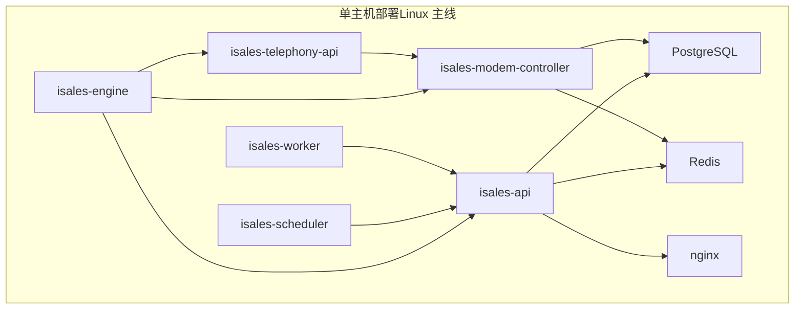
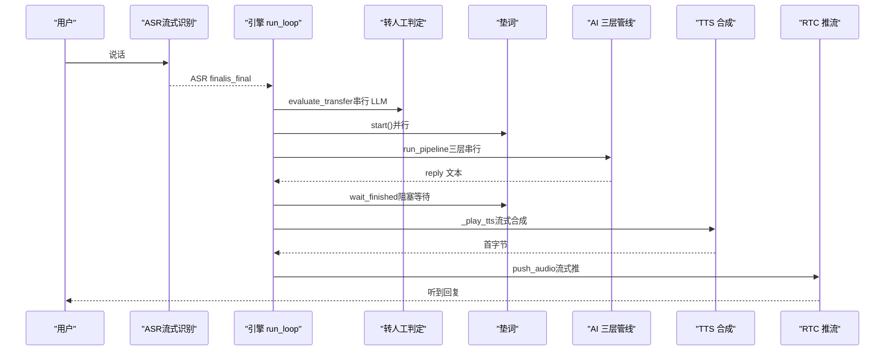
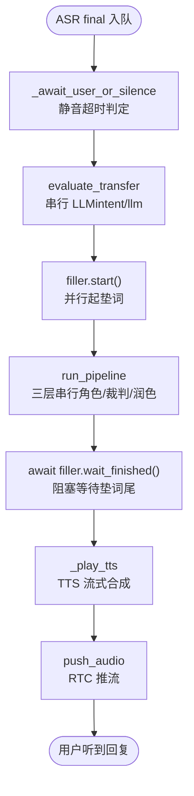

# 系统性能分析

<cite>
**本文引用的文件**
- [通话响应延迟分析.md](file://通话响应延迟分析.md)
- [通话响应延迟分析报告.md](file://通话响应延迟分析报告.md)
- [DESIGN.md](file://DESIGN.md)
- [README.md](file://README.md)
- [openspec/specs/ai-pipeline/spec.md](file://openspec/specs/ai-pipeline/spec.md)
- [openspec/specs/call-state-machine/spec.md](file://openspec/specs/call-state-machine/spec.md)
- [openspec/specs/filler/spec.md](file://openspec/specs/filler/spec.md)
- [deploy/README.md](file://deploy/README.md)
- [deploy/monitoring/README.md](file://deploy/monitoring/README.md)
- [deploy/cloud/monitoring/prometheus.yml.example](file://deploy/cloud/monitoring/prometheus.yml.example)
- [deploy/cloud/monitoring/alert_rules.yml.example](file://deploy/cloud/monitoring/alert_rules.yml.example)
</cite>

## 目录
1. [简介](#简介)
2. [项目结构](#项目结构)
3. [核心组件](#核心组件)
4. [架构总览](#架构总览)
5. [详细组件分析](#详细组件分析)
6. [依赖分析](#依赖分析)
7. [性能考量](#性能考量)
8. [故障排查指南](#故障排查指南)
9. [结论](#结论)
10. [附录](#附录)

## 简介
本指南面向系统管理员与工程师，围绕 iSales 实时通话引擎的“通话响应延迟”进行系统化性能分析。通过对 ASR、AI 三层管线（角色/裁判/润色）、垫词、TTS、RTC 等环节的链路拆解，定位延迟来源、量化瓶颈、给出可落地的优化策略与监控告警建议，并提供性能数据采集、回归检测与容量规划思路。

## 项目结构
iSales 采用多仓协作的单主机部署模型，核心服务包括实时通话引擎、调度器、后台 worker、Telephony API、Modem 控制器与 Web 管理面。部署与运维脚本、监控模板位于 deploy 目录，OpenSpec 规范文档定义了状态机、AI 管线、垫词等关键能力的行为契约。

图表来源
- [deploy/README.md:14-49](file://deploy/README.md#L14-L49)

章节来源
- [README.md:6-14](file://README.md#L6-L14)
- [deploy/README.md:12-49](file://deploy/README.md#L12-L49)

## 核心组件
- 实时通话引擎（isales-engine）：负责状态机、ASR/RTC 推流、AI 三层管线编排、垫词播放、转人工判定与 TTS 播放。
- AI 三层管线：N 个角色 LLM 并行 → N×M 个裁判 LLM 并行审查 → 1 个润色 LLM 选优拟人化。
- 垫词（Filler）：在 PROCESSING 期间与管线并行播放，覆盖延迟。
- Provider 抽象：LLM/TTS/RTC 等外部服务的统一接口封装。
- 监控与告警：Prometheus/Grafana 模板与基础告警规则。

章节来源
- [openspec/specs/ai-pipeline/spec.md:1-166](file://openspec/specs/ai-pipeline/spec.md#L1-L166)
- [openspec/specs/filler/spec.md:1-132](file://openspec/specs/filler/spec.md#L1-L132)
- [openspec/specs/call-state-machine/spec.md:1-190](file://openspec/specs/call-state-machine/spec.md#L1-L190)

## 架构总览
下图展示一次典型“用户说完话 → 听到 AI 回复”的端到端链路，标注关键延迟点与并行/串行关系。

图表来源
- [通话响应延迟分析报告.md:21-50](file://通话响应延迟分析报告.md#L21-L50)
- [通话响应延迟分析.md:11-24](file://通话响应延迟分析.md#L11-L24)

## 详细组件分析

### 1) 通话响应链路与延迟归因
- ASR 端点检测：依赖 is_final 与静音超时，延迟取决于厂商端点时机与配置。
- 转人工判定：在进入 PROCESSING 前串行执行，额外增加 1~2 次往返。
- AI 三层管线：严格串行（角色→裁判→润色），每层均为非流式整段返回，首字延迟≈整段生成时间。
- 垫词播放：设计上与管线并行，但 wait_finished 导致回复被垫词尾段阻塞。
- TTS/RTC：本身流式，首字延迟可观测；瓶颈在上游管线未产出文本。

章节来源
- [通话响应延迟分析报告.md:54-131](file://通话响应延迟分析报告.md#L54-L131)
- [通话响应延迟分析.md:30-167](file://通话响应延迟分析.md#L30-L167)

### 2) 延迟来源与修复建议（按严重度）
- P0：三层管线串行 + 非流式整段返回
  - 现状：串行深度≥3 次往返，每层等整段 completion，首字延迟≈全量生成。
  - 建议：仅对润色层做 token 流式，或在高价值场景跳过裁判/润色走单角色直出。
- P0：转人工判定前置阻塞
  - 现状：transfer 的 intent/llm 串行在管线前，每轮多 1~2 次往返。
  - 建议：与管线并行或移至播放后异步判定。
- P0：垫词 wait_finished 强制阻塞
  - 现状：回复必须等垫词整句播完才开始，净延迟=max(管线耗时, 垫词时长)。
  - 建议：允许回复音频就绪即接管，垫词淡出/截断。
- P1：垫词实时 TTS（非预渲染）
  - 现状：每次垫词现场合成，DB 已具备 audio_url 字段但未启用。
  - 建议：直接流式拉取 OSS 预渲染 PCM，彻底去除垫词路径上的 TTS 延迟。
- P1：Provider 每次调用新建 httpx AsyncClient，无连接复用
  - 现状：N=3、M=2 时一轮对话约 10 次握手浪费。
  - 建议：Provider 持有长生命周期 client，复用连接与 TLS 会话。
- P2：单层超时 8s，无差异化快速失败
  - 现状：任意一层卡住最坏 8s，三层叠加最坏 24s。
  - 建议：按层差异化超时（裁判 2~3s），首 token 监控快速降级。
- P2：润色失败回退链
  - 现状：超时/解析失败回退到首个通过候选，叠加串行延迟。
  - 建议：结合管线裁剪与流式润色，减少不必要的回退。

章节来源
- [通话响应延迟分析报告.md:146-165](file://通话响应延迟分析报告.md#L146-L165)
- [通话响应延迟分析.md:185-196](file://通话响应延迟分析.md#L185-L196)

### 3) 状态机与垫词播放时序
- 状态机要求：FILLER 与 PROCESSING 并行；垫词期间被打断需立即停止并丢弃当前 PROCESSING。
- 垫词策略：仅在常规对话 PROCESSING 播放；开场白后首轮、WRAPPING_UP、转人工/沉默激活/告别时不播。

章节来源
- [openspec/specs/call-state-machine/spec.md:119-131](file://openspec/specs/call-state-machine/spec.md#L119-L131)
- [openspec/specs/filler/spec.md:7-49](file://openspec/specs/filler/spec.md#L7-L49)

### 4) AI 三层管线编排与降级路径
- 编排：角色并行→裁判并行审查→润色选优；Layer 1 与垫词同时启动。
- 降级：全部角色失败→默认回复；全部裁判否决→默认回复；润色失败→取首个通过候选；异常路径仍写 pipeline_trace。
- 简化管线：WRAPPING_UP 期间单角色+润色，不启用 PK/裁判。

章节来源
- [openspec/specs/ai-pipeline/spec.md:7-166](file://openspec/specs/ai-pipeline/spec.md#L7-L166)

### 5) 端到端时序流程图（代码级）

图表来源
- [通话响应延迟分析报告.md:21-50](file://通话响应延迟分析报告.md#L21-L50)
- [通话响应延迟分析.md:11-24](file://通话响应延迟分析.md#L11-L24)

## 依赖分析
- 组件耦合
  - 引擎 run_loop 依赖 ASR、Provider（LLM/TTS）、RTC、FillerManager、Transcript/Trace。
  - 三层管线与 Provider 的 IO 质量（是否流式、是否复用连接）直接影响端到端延迟。
- 外部依赖
  - LLM/TTS/ASR 厂商服务的响应特性（是否首 token 流式、端点触发时机）。
  - 网络质量（跨公网握手开销、丢包/抖动）。
- 监控依赖
  - Prometheus/Grafana 模板与 alert_rules，用于观测首 TTS P95、ARTC buffer-full、边缘设备心跳等。

章节来源
- [deploy/cloud/monitoring/prometheus.yml.example:27-37](file://deploy/cloud/monitoring/prometheus.yml.example#L27-L37)
- [deploy/cloud/monitoring/alert_rules.yml.example:71-86](file://deploy/cloud/monitoring/alert_rules.yml.example#L71-L86)

## 性能考量
- 延迟预算与设计决策
  - 设计文档明确首 TTS P95 预算为 800ms；当预算被突破，应考虑降级策略（如单角色直出）。
- 端到端延迟分解
  - ASR 端点延迟（静音超时与 is_final 时机）
  - LLM 非流式整段延迟（三层串行）
  - 垫词阻塞（wait_finished）
  - TTS 首字节 + RTC 推流（流式，非瓶颈）
- 优化优先级
  - 最高：打通 LLM→TTS 流式（仅润色层 token 流式或简化管线）
  - 高：转人工判定移出关键路径、垫词不阻塞回复
  - 中：垫词预渲染音频、Provider 连接复用、分层差异化超时

章节来源
- [deploy/cloud/monitoring/alert_rules.yml.example:71-86](file://deploy/cloud/monitoring/alert_rules.yml.example#L71-L86)
- [通话响应延迟分析报告.md:146-165](file://通话响应延迟分析报告.md#L146-L165)

## 故障排查指南
- 快速定位
  - 查看状态机事件与 transcript，确认是否在 PROCESSING/FILLER/WRAPPING_UP 等状态下的垫词播放策略符合预期。
  - 检查引擎日志中是否有 ARTC push_audio buffer-full 回调频繁，指示上游 TTS 生产速率过快或网络拥塞。
- 常见问题
  - 垫词阻塞：确认是否仍在等待 filler.wait_finished；若垫词较长，建议允许回复接管。
  - 转人工判定串行：检查 evaluate_transfer 是否在管线前串行执行，必要时改为并行或延后。
  - Provider 握手开销：确认 LLM/TTS Provider 是否持有长生命周期 client，避免每调用一次重建连接。
- 监控与告警
  - 使用 Prometheus 抓取 isales-engine 的 /metrics（待实现）；关注首 TTS P95、ARTC buffer-full、边缘心跳等指标。
  - 基于 alert_rules.yml.example 设置阈值告警，结合 Grafana 仪表盘进行趋势分析。

章节来源
- [deploy/monitoring/README.md:30-48](file://deploy/monitoring/README.md#L30-L48)
- [deploy/cloud/monitoring/alert_rules.yml.example:14-86](file://deploy/cloud/monitoring/alert_rules.yml.example#L14-L86)

## 结论
iSales 的通话响应延迟主要由“三层严格串行 + 非流式整段 + 转人工前置 + 垫词阻塞”三重叠加造成。建议优先实施“润色层 token 流式/简化管线”“转人工判定并行/延后”“垫词不阻塞回复”三大工程优化，辅以垫词预渲染与 Provider 连接复用，可在不改变业务 spec 的前提下显著降低端到端延迟。同时，完善 /metrics 指标与告警，建立性能基线与回归检测机制，支撑容量规划与持续优化。

## 附录

### A. 性能监控指标与解读
- 首 TTS P95：衡量从管线产出文本到 TTS 首字节的延迟，应不超过 800ms。
- ARTC push_audio buffer-full：指示 TTS 产出速率与 SDK 编码/发送速率不匹配，可能由网络拥塞或上游 burst 引起。
- 边缘设备心跳与断线：反映云端-边缘链路稳定性，频繁断线需核查 WAN 与鉴权轮换。

章节来源
- [deploy/cloud/monitoring/alert_rules.yml.example:71-86](file://deploy/cloud/monitoring/alert_rules.yml.example#L71-L86)
- [deploy/cloud/monitoring/prometheus.yml.example:31-37](file://deploy/cloud/monitoring/prometheus.yml.example#L31-L37)

### B. 基准测试方法
- 场景设计
  - 空闲环境下的“单轮回复”基准：固定 N/M 配置，测量从 ASR final 到用户听到回复的端到端延迟分布（P50/P95/P99）。
  - “高并发场景”：多通并发，观察 ARTC buffer-full 比例与平均延迟变化。
- 指标采集
  - 使用 Prometheus 抓取 isales-engine 的 /metrics（待实现）；或在引擎侧埋点记录各阶段耗时。
- 回归检测
  - 设定阈值（如 P95>800ms）并纳入 CI/发布门禁；每次变更后进行 A/B 对比。

章节来源
- [deploy/cloud/monitoring/prometheus.yml.example:27-37](file://deploy/cloud/monitoring/prometheus.yml.example#L27-L37)
- [deploy/cloud/monitoring/alert_rules.yml.example:71-86](file://deploy/cloud/monitoring/alert_rules.yml.example#L71-L86)

### C. 容量规划建议
- LLM/TTS 并发与超时
  - 按峰值并发与 SLA（P95≤800ms）倒推出 Provider 的 QPS 与超时配置；为裁判层设置更短超时，避免拖累整体。
- 网络与连接
  - 估算每轮对话的 LLM/TTS 调用次数（N×角色 + M×裁判 + 1×润色 + 0~2×转人工），计算握手次数与带宽占用，预留冗余。
- 存储与垫词
  - 预渲染垫词音频，减少实时 TTS 峰值压力；按垫词集合规模与并发需求评估 OSS 带宽与缓存命中率。

章节来源
- [通话响应延迟分析.md:138-153](file://通话响应延迟分析.md#L138-L153)
- [openspec/specs/filler/spec.md:78-91](file://openspec/specs/filler/spec.md#L78-L91)

### D. 性能数据收集工具使用
- Prometheus 抓取
  - 参考 prometheus.yml.example 中 isales-engine 的 /metrics 端点与指标命名，逐步补齐各服务的 /metrics 实现。
- Grafana 仪表盘
  - 导入 isales-overview.json（单主机）或云边仪表盘占位文件，按面板清单补充所需指标。
- 日志与事件
  - 通过 transcript 与状态机事件定位异常路径；关注 ARTC buffer-full 回调频率与边缘心跳缺失。

章节来源
- [deploy/monitoring/README.md:10-28](file://deploy/monitoring/README.md#L10-L28)
- [deploy/cloud/monitoring/prometheus.yml.example:27-37](file://deploy/cloud/monitoring/prometheus.yml.example#L27-L37)