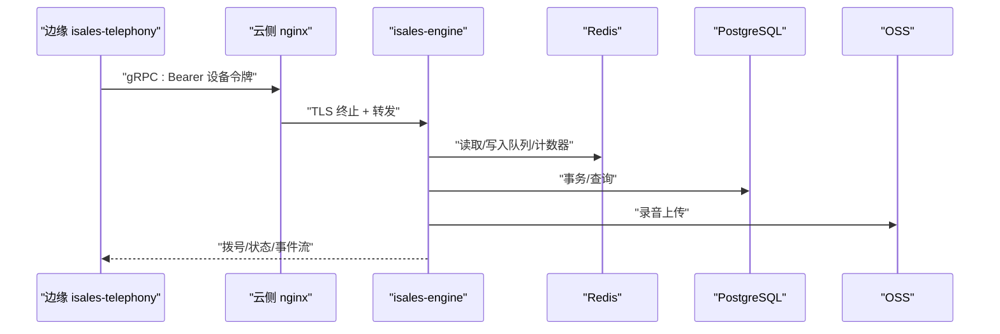
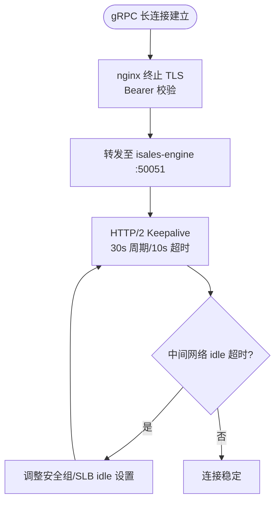
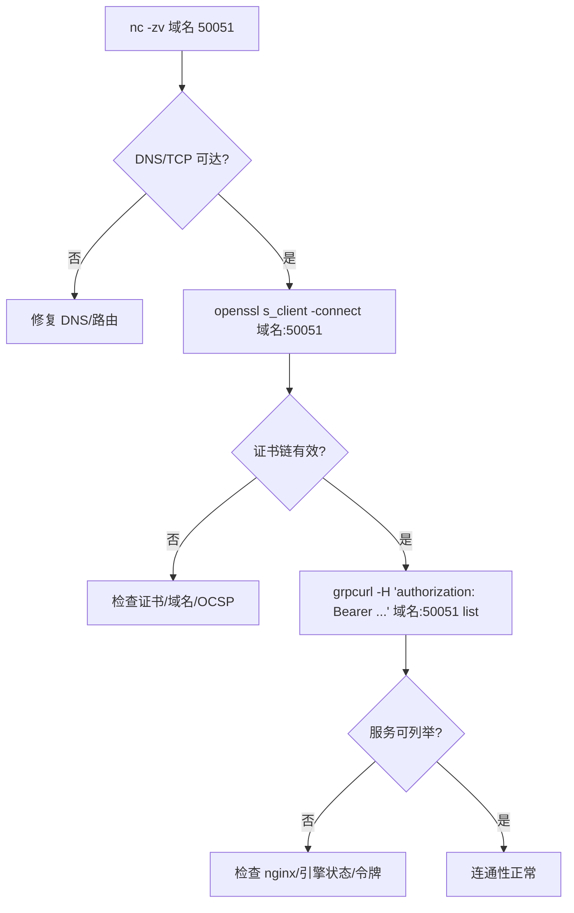
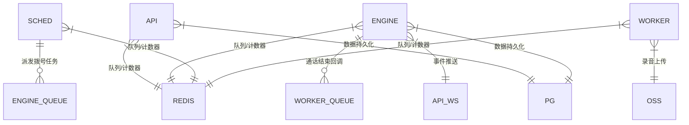
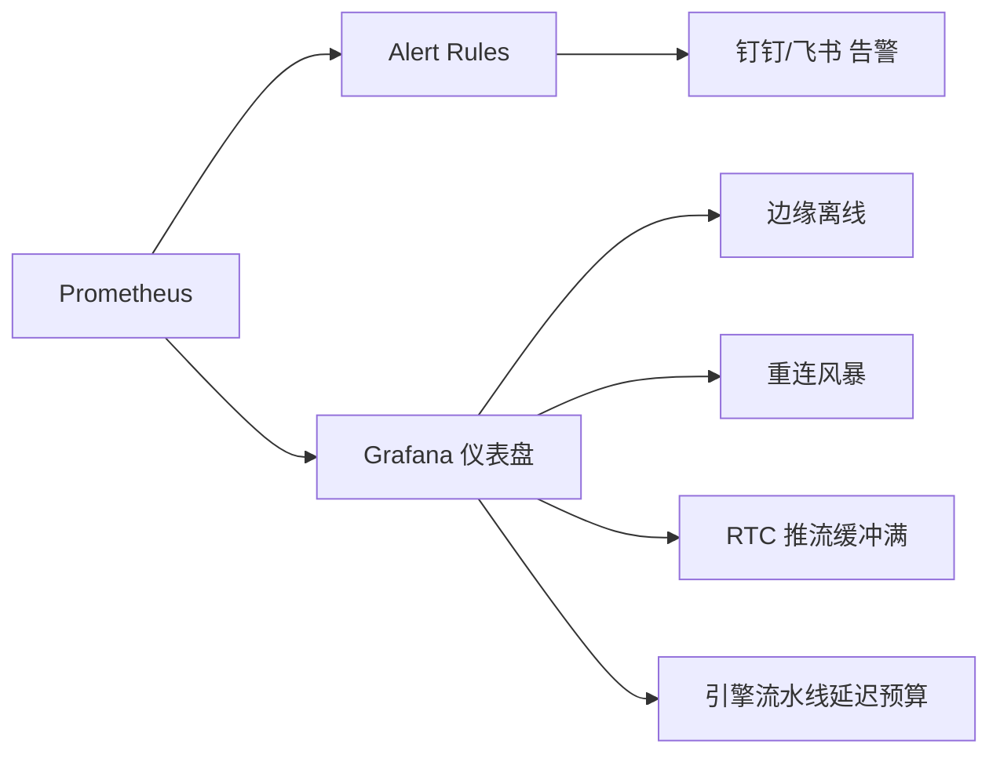
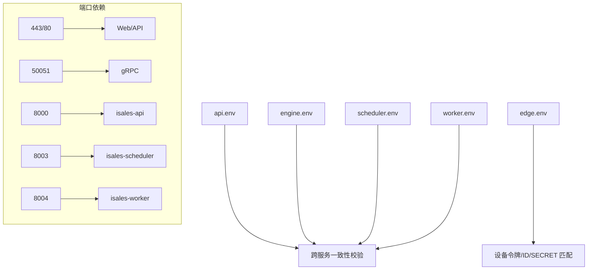

# 网络连接问题

<cite>
**本文引用的文件**
- [RUNBOOK.md](file://deploy/RUNBOOK.md)
- [RUNBOOK-cloud.md](file://deploy/RUNBOOK-cloud.md)
- [RUNBOOK-edge.md](file://deploy/RUNBOOK-edge.md)
- [cloud/README.md](file://deploy/cloud/README.md)
- [edge/README.md](file://deploy/edge/README.md)
- [monitoring/README.md](file://deploy/cloud/monitoring/README.md)
- [alert_rules.yml.example](file://deploy/cloud/monitoring/alert_rules.yml.example)
- [prometheus.yml.example](file://deploy/cloud/monitoring/prometheus.yml.example)
- [nginx/isales.conf](file://deploy/cloud/nginx/isales.conf)
- [service-communication/spec.md](file://openspec/specs/service-communication/spec.md)
- [api.env.example](file://deploy/cloud/env/api.env.example)
- [engine.env.example](file://deploy/cloud/env/engine.env.example)
- [scheduler.env.example](file://deploy/cloud/env/scheduler.env.example)
- [worker.env.example](file://deploy/cloud/env/worker.env.example)
- [edge.env.example](file://deploy/edge/env/edge.env.example)
</cite>

## 目录
1. [简介](#简介)
2. [项目结构](#项目结构)
3. [核心组件](#核心组件)
4. [架构总览](#架构总览)
5. [详细组件分析](#详细组件分析)
6. [依赖分析](#依赖分析)
7. [性能考虑](#性能考虑)
8. [故障排查指南](#故障排查指南)
9. [结论](#结论)
10. [附录](#附录)

## 简介
本指南面向网络管理员与运维工程师，聚焦 iSales 在云-边拓扑下的网络连接问题排查。围绕服务间通信、外部 API 集成、公网入口与 TLS、gRPC 长连接保活、边缘节点网络同步与离线缓冲、以及云环境安全组与负载均衡配置，提供系统化的诊断流程、工具使用与处置策略。文档严格基于仓库中的运行手册、监控模板与配置文件，确保可操作性与可追溯性。

## 项目结构
- 云侧（ECS 单实例）：isales-api、isales-engine、isales-scheduler、isales-worker，配合 nginx 反代与 gRPC 终止。
- 边缘侧（Mac mini）：isales-telephony（含 modem-controller、audio-bridge、cloud-edge gRPC client、telephony-api loopback），通过公网 gRPC 与云侧交互。
- 监控与告警：Prometheus + Grafana + Alert Rules，覆盖云-边流健康、RTC 推流缓冲、引擎流水线延迟预算等。

```mermaid
graph TB
subgraph "边缘侧 Mac mini"
EDGE["isales-telephony<br/>gRPC 客户端 + 音频桥 + 调制解调器"]
EDGE_CFG["edge.env<br/>设备令牌/端点/缓冲"]
end
subgraph "云侧 ECS"
NGINX["nginx<br/>:443 Web/API + :50051 gRPC 终止"]
API["isales-api :8000"]
ENGINE["isales-engine :50051 gRPC 服务器"]
SCHED["isales-scheduler :8003"]
WORKER["isales-worker :8004"]
REDIS["Redis 内网"]
RDS["PostgreSQL 内网"]
OSS["OSS 私有桶"]
end
EDGE --> NGINX
NGINX --> ENGINE
API <- --> REDIS
ENGINE <- --> REDIS
SCHED <- --> REDIS
WORKER <- --> REDIS
API <- --> RDS
ENGINE <- --> RDS
WORKER <- --> OSS
EDGE_CFG --> EDGE
```

图表来源
- [cloud/README.md:10-53](file://deploy/cloud/README.md#L10-L53)
- [edge/README.md:10-40](file://deploy/edge/README.md#L10-L40)
- [nginx/isales.conf:1-103](file://deploy/cloud/nginx/isales.conf#L1-L103)

章节来源
- [cloud/README.md:10-53](file://deploy/cloud/README.md#L10-L53)
- [edge/README.md:10-40](file://deploy/edge/README.md#L10-L40)

## 核心组件
- 云侧服务与反代
  - isales-api：HTTP/WS（:8000），负责用户会话、回调与前端 API。
  - isales-engine：实时引擎与 cloud-edge gRPC 服务器（:50051），负责通话调度、RTC 会话与媒体面协调。
  - isales-scheduler：队列派发与并发控制（:8003）。
  - isales-worker：后处理与回调（:8004）。
  - nginx：:443 Web/API 反代；:50051 gRPC 终止（TLS 终结 + Bearer 校验）。
- 边缘服务
  - isales-telephony：gRPC 客户端与音频桥，维持与云侧的长连接，上报心跳，处理离线事件缓冲。
- 中间件
  - Redis：队列、Pub/Sub、计数器。
  - RDS/PG：数据持久化。
  - OSS：录音与预渲染资源存储。
- 监控
  - Prometheus 抓取各服务指标；Grafana 仪表盘；告警规则覆盖边缘离线、重连风暴、RTC 推流缓冲、引擎流水线延迟预算。

章节来源
- [cloud/README.md:10-53](file://deploy/cloud/README.md#L10-L53)
- [edge/README.md:10-40](file://deploy/edge/README.md#L10-L40)
- [monitoring/README.md:1-37](file://deploy/cloud/monitoring/README.md#L1-L37)

## 架构总览
云-边分离架构下，边缘通过公网 gRPC 与云侧引擎建立双向长连接，nginx 在云侧终止 TLS 并将请求转发至引擎。引擎与各服务通过 Redis/Pg 完成数据与消息流转。外部 API（如 RTC PaaS、OSS、第三方提供商）通过内网/公网出站访问。



图表来源
- [nginx/isales.conf:71-102](file://deploy/cloud/nginx/isales.conf#L71-L102)
- [service-communication/spec.md:11-24](file://openspec/specs/service-communication/spec.md#L11-L24)

章节来源
- [nginx/isales.conf:1-103](file://deploy/cloud/nginx/isales.conf#L1-L103)
- [service-communication/spec.md:11-24](file://openspec/specs/service-communication/spec.md#L11-L24)

## 详细组件分析

### 云侧 gRPC 入口与保活
- nginx 在 50051 端口终止 TLS，并将请求转发至本地引擎 gRPC 服务器。错误码 502 将映射为 gRPC UNAVAILABLE，便于边缘侧快速感知云侧不可达。
- 引擎与边缘客户端均启用 HTTP/2 keepalive（周期 30s，超时 10s，允许无调用时 ping），并要求中间网络层抑制 idle 超时。
- 安全组与 SLB 配置需关闭 stateful idle 清理或提升 idle-timeout 至 ≥ 60min，避免长连接在中间网络被截断。



图表来源
- [nginx/isales.conf:71-102](file://deploy/cloud/nginx/isales.conf#L71-L102)
- [RUNBOOK-cloud.md:351-393](file://deploy/RUNBOOK-cloud.md#L351-L393)

章节来源
- [nginx/isales.conf:71-102](file://deploy/cloud/nginx/isales.conf#L71-L102)
- [RUNBOOK-cloud.md:351-393](file://deploy/RUNBOOK-cloud.md#L351-L393)

### 边缘 gRPC 连通性与 DNS/TLS 握手
- 使用 nc 检查 DNS 解析与端口可达性；openssl s_client 验证 TLS 证书链；grpcurl 带 Bearer 令牌测试服务列表。
- 若 gRPC ping 成功但流立即断开，优先检查安全组/SLB idle 配置与中间防火墙策略。



图表来源
- [RUNBOOK-edge.md:166-181](file://deploy/RUNBOOK-edge.md#L166-L181)

章节来源
- [RUNBOOK-edge.md:166-181](file://deploy/RUNBOOK-edge.md#L166-L181)

### 服务间通信与外部 API 集成
- Redis 队列/发布订阅承载服务间消息；API ↔ 引擎使用 Redis Pub/Sub 推送通话事件；引擎 ↔ 外部使用 HTTP webhook。
- 引擎与外部提供商（如 RTC PaaS、OSS、第三方 ASR/LLM/TTS）通过内网/公网出站访问，需关注网络延迟与带宽。



图表来源
- [service-communication/spec.md:11-24](file://openspec/specs/service-communication/spec.md#L11-L24)

章节来源
- [service-communication/spec.md:11-24](file://openspec/specs/service-communication/spec.md#L11-L24)

### 监控与告警（云-边）
- Prometheus 抓取引擎、调度器、工作器指标；Grafana 导入仪表盘；告警规则覆盖边缘离线、重连风暴、RTC 推流缓冲、引擎流水线延迟预算。
- 关键阈值与持续时间在模板中给出，需结合业务流量特征进行调优。



图表来源
- [monitoring/README.md:1-37](file://deploy/cloud/monitoring/README.md#L1-L37)
- [alert_rules.yml.example:1-116](file://deploy/cloud/monitoring/alert_rules.yml.example#L1-L116)
- [prometheus.yml.example:1-77](file://deploy/cloud/monitoring/prometheus.yml.example#L1-L77)

章节来源
- [monitoring/README.md:1-37](file://deploy/cloud/monitoring/README.md#L1-L37)
- [alert_rules.yml.example:1-116](file://deploy/cloud/monitoring/alert_rules.yml.example#L1-L116)
- [prometheus.yml.example:1-77](file://deploy/cloud/monitoring/prometheus.yml.example#L1-L77)

## 依赖分析
- 环境一致性
  - 数据库/Redis URL 必须在 api/engine/scheduler/worker 保持一致。
  - JWT_SECRET 与 FERNET_KEY 在 4 个服务 env 中必须一致。
  - 边缘设备令牌与云侧设备 ID、JWT SECRET 需匹配。
- 端口与协议
  - 443/80（Web/API）、50051（gRPC）、8000/8003/8004（服务端口）。
- 外部依赖
  - RTC PaaS（DingRTC）、OSS、第三方提供商（ASR/LLM/TTS）。



图表来源
- [api.env.example:1-24](file://deploy/cloud/env/api.env.example#L1-L24)
- [engine.env.example:1-76](file://deploy/cloud/env/engine.env.example#L1-L76)
- [scheduler.env.example:1-25](file://deploy/cloud/env/scheduler.env.example#L1-L25)
- [worker.env.example:1-28](file://deploy/cloud/env/worker.env.example#L1-L28)
- [edge.env.example:1-34](file://deploy/edge/env/edge.env.example#L1-L34)

章节来源
- [api.env.example:1-24](file://deploy/cloud/env/api.env.example#L1-L24)
- [engine.env.example:1-76](file://deploy/cloud/env/engine.env.example#L1-L76)
- [scheduler.env.example:1-25](file://deploy/cloud/env/scheduler.env.example#L1-L25)
- [worker.env.example:1-28](file://deploy/cloud/env/worker.env.example#L1-L28)
- [edge.env.example:1-34](file://deploy/edge/env/edge.env.example#L1-L34)

## 性能考虑
- gRPC 长连接保活：确保中间网络层（安全组/SLB/NAT/防火墙）不截断 idle，必要时延长 idle-timeout。
- 引擎流水线延迟预算：P95 首字节 TTS 超过 800ms 时，可按设计决策降级（如减少多角色并发）。
- RTC 推流缓冲：频繁 buffer-full 提示表明上游 TTS 生产或网络拥塞，需优化提供商或网络路径。
- 前端 WebSocket：高并发订阅需避免重复 Redis 订阅，降低资源消耗。

## 故障排查指南

### 一、gRPC 长连接断开
- 现象
  - 边缘反复重连；Worker 报告重连风暴；流寿命 p95 远低于阈值。
- 诊断步骤
  - 检查 nginx 50051 访问日志与引擎日志，确认 502 映射与 gRPC 可用性。
  - 使用 grpcurl 带令牌测试服务列表，确认服务可达。
  - 核对安全组/SLB idle-timeout 配置，必要时提升至 ≥ 60min。
- 处置建议
  - 调整中间网络 idle 抑制策略；如为 SLB WAF，默认 ≤ 1min 不支持 HTTP/2 长连接，需切换为七层 HTTP/2 或四层 TCP 模式。

章节来源
- [RUNBOOK-cloud.md:337-393](file://deploy/RUNBOOK-cloud.md#L337-L393)
- [nginx/isales.conf:71-102](file://deploy/cloud/nginx/isales.conf#L71-L102)

### 二、边缘离线/心跳异常
- 现象
  - Prometheus 告警“边缘离线”；Worker watchdog 标记设备离线。
- 诊断步骤
  - 检查 nginx 与引擎状态；确认 gRPC 50051 监听与 TLS 终止。
  - 查看边缘日志与 SQLite 离线缓冲状态，确认断线是否触发本地缓冲。
- 处置建议
  - 修复网络/证书/令牌问题后，边缘自动重连；若缓冲堆积，按离线缓冲排查章节清理。

章节来源
- [monitoring/alert_rules.yml.example:14-26](file://deploy/cloud/monitoring/alert_rules.yml.example#L14-L26)
- [RUNBOOK-edge.md:166-181](file://deploy/RUNBOOK-edge.md#L166-L181)

### 三、RTC 推流缓冲频繁满
- 现象
  - 告警“RTC 推流缓冲满”；通话音质异常或卡顿。
- 诊断步骤
  - 检查引擎日志中 OnPushAudioFrameBufferFull 回调频率；评估提供商延迟与网络拥塞。
- 处置建议
  - 优化上游 TTS 提供商或网络路径；必要时降低并发或调整流水线预算。

章节来源
- [alert_rules.yml.example:42-54](file://deploy/cloud/monitoring/alert_rules.yml.example#L42-L54)

### 四、引擎流水线延迟超限
- 现象
  - 告警“引擎流水线延迟预算”；首字节 TTS P95 > 800ms。
- 诊断步骤
  - 查看引擎流水线阶段耗时直方图；核对提供商性能与网络状况。
- 处置建议
  - 采用设计决策降级策略（如减少多角色并发），随后优化提供商或网络。

章节来源
- [alert_rules.yml.example:71-86](file://deploy/cloud/monitoring/alert_rules.yml.example#L71-L86)

### 五、Web/API 502/空白
- 现象
  - 访问 http://121.89.85.150/ 返回 502 或空白页。
- 诊断步骤
  - 检查 nginx 状态与配置语法；验证 Swagger 直连 :8000 是否可用；查看 nginx 错误日志定位 upstream 失败。
- 处置建议
  - 修复 nginx 配置或引擎不可用问题；确保健康检查通过。

章节来源
- [RUNBOOK-cloud.md:595](file://deploy/RUNBOOK-cloud.md#L595)

### 六、边缘 DNS/TLS/端口问题
- 现象
  - gRPC ping 失败；边缘反复重连。
- 诊断步骤
  - 使用 nc 检查 DNS 与端口；openssl s_client 验证证书链；grpcurl 带令牌测试。
- 处置建议
  - 修正 DNS/证书/安全组/SLB；确保 50051 可达且 idle 抑制生效。

章节来源
- [RUNBOOK-edge.md:166-181](file://deploy/RUNBOOK-edge.md#L166-L181)

### 七、边缘离线缓冲排查
- 现象
  - 重连后事件积压；SQLite 缓冲表堆积。
- 诊断步骤
  - 查询 events 表数量与 seq 范围；确认是否超过环形容量被覆盖。
- 处置建议
  - 停止进程后备份，清空 events 表并 VACUUM；重启后自动补发。

章节来源
- [RUNBOOK-edge.md:136-164](file://deploy/RUNBOOK-edge.md#L136-L164)

### 八、环境变量不一致
- 现象
  - JWT 认证失败；服务间通信异常。
- 诊断步骤
  - 核对 api/engine/scheduler/worker 的 DATABASE_URL/REDIS_URL/JWT_SECRET/FERNET_KEY 是否一致；边缘 edge.env 的设备令牌与云侧设备 ID/SECRET 是否匹配。
- 处置建议
  - 同步 env 文件并重启相关服务；确保一致性。

章节来源
- [api.env.example:1-24](file://deploy/cloud/env/api.env.example#L1-L24)
- [engine.env.example:1-76](file://deploy/cloud/env/engine.env.example#L1-L76)
- [scheduler.env.example:1-25](file://deploy/cloud/env/scheduler.env.example#L1-L25)
- [worker.env.example:1-28](file://deploy/cloud/env/worker.env.example#L1-L28)
- [edge.env.example:1-34](file://deploy/edge/env/edge.env.example#L1-L34)

## 结论
iSales 云-边拓扑的网络问题主要集中在公网 gRPC 长连接保活、边缘 DNS/TLS/端口连通性、中间网络 idle 抑制、以及引擎流水线与 RTC 推流的性能瓶颈。通过标准化的诊断流程、监控告警与环境一致性校验，可快速定位并解决绝大多数网络连接问题。建议在变更窗口内进行发版与回滚，确保边缘自动重连与业务连续性。

## 附录

### A. 网络连通性测试清单
- DNS 解析与端口可达性：nc -zv 域名 50051
- TLS 证书链：openssl s_client -connect 域名:50051 -servername 域名
- gRPC 服务列表：grpcurl -H "authorization: Bearer $TOKEN" 域名:50051 list
- WAN 抖动：mtr -r -c 20 域名

章节来源
- [RUNBOOK-edge.md:166-194](file://deploy/RUNBOOK-edge.md#L166-L194)

### B. 端口与服务对照
- 443/80：Web/API（nginx）
- 50051：gRPC（nginx 终止 + 转发）
- 8000：isales-api（HTTP/WS）
- 8003：isales-scheduler
- 8004：isales-worker

章节来源
- [cloud/README.md:15-20](file://deploy/cloud/README.md#L15-L20)

### C. 云环境安全组与 SLB 建议
- 安全组：50051/TCP 对业务 IP 白名单放行；关闭 stateful idle 清理或设置最长超时。
- SLB：七层 HTTP/2 或四层 TCP 模式；idle-timeout ≥ 60min；避免 WAF 默认 ≤ 1min 的限制。

章节来源
- [RUNBOOK-cloud.md:351-393](file://deploy/RUNBOOK-cloud.md#L351-L393)