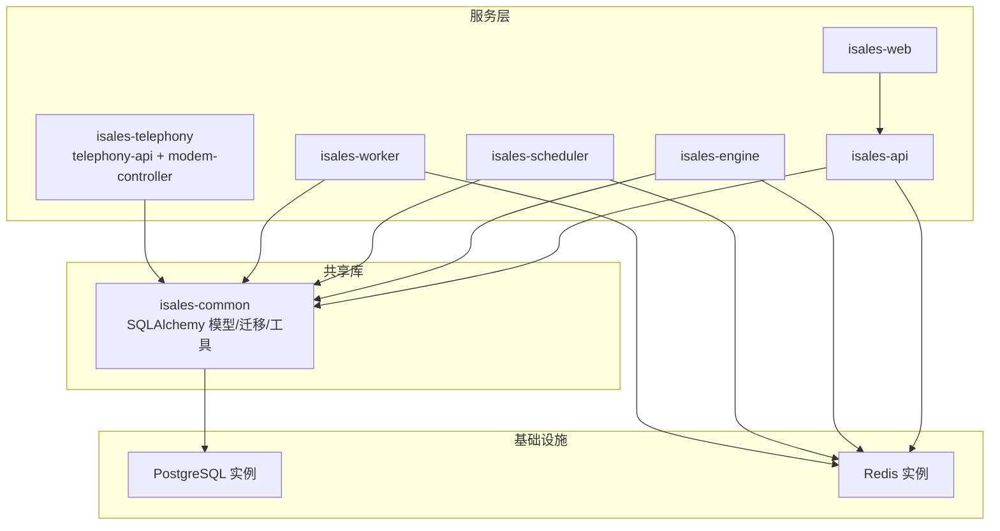
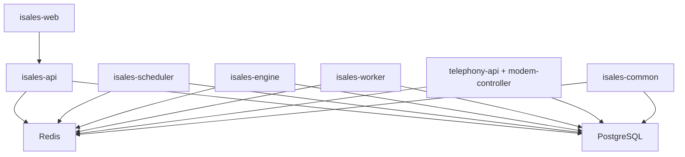
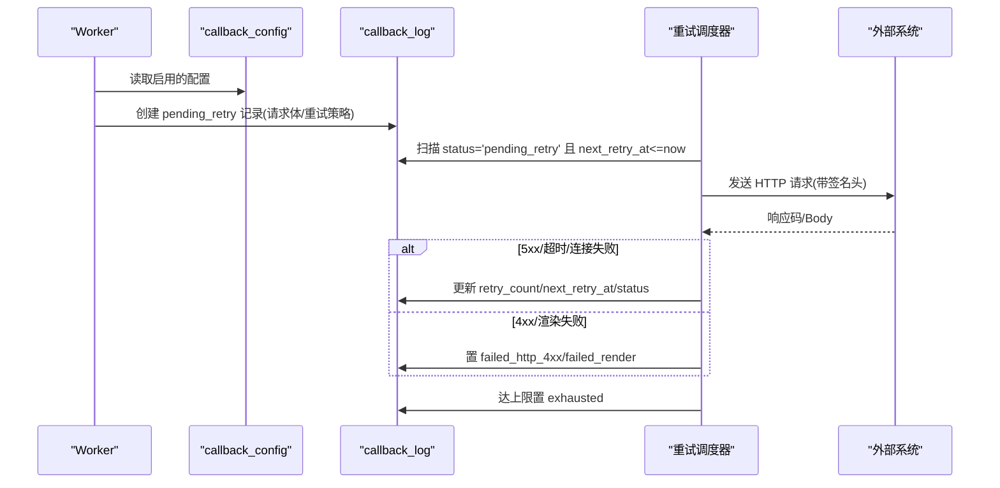
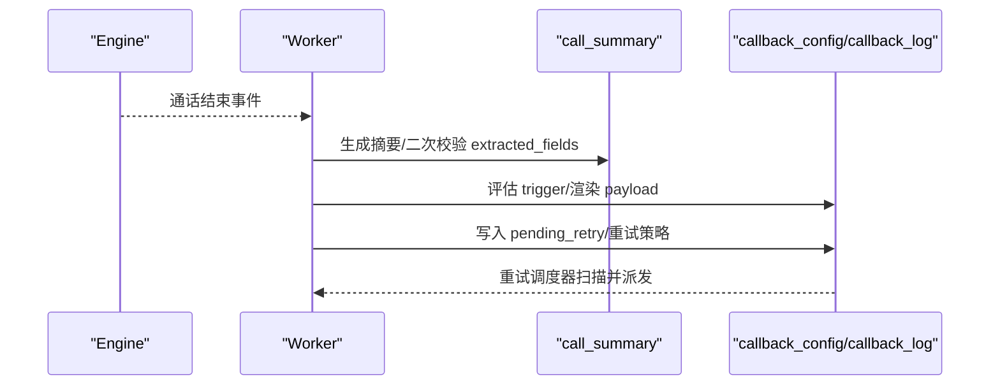
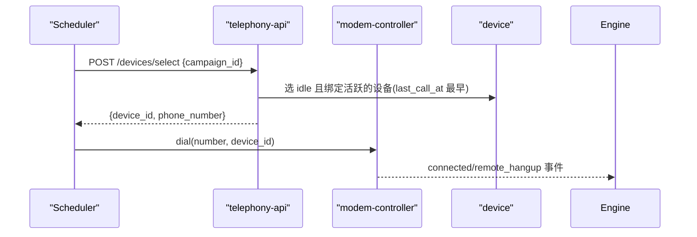
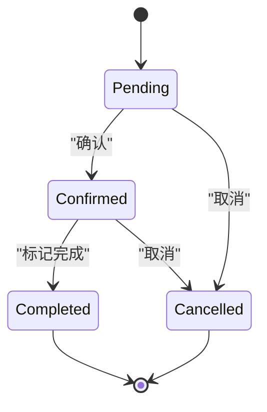
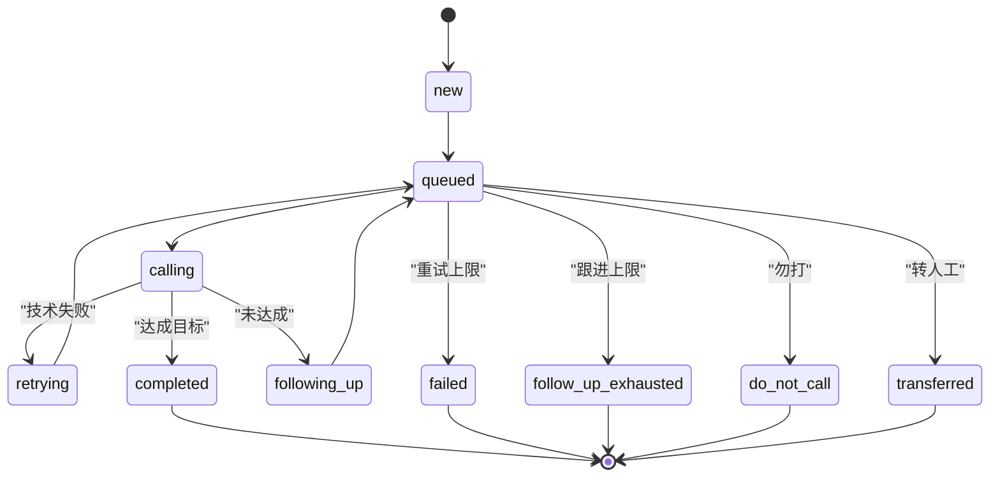
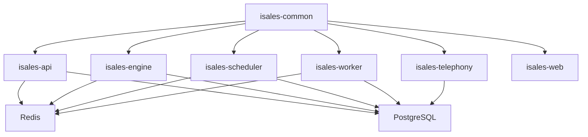
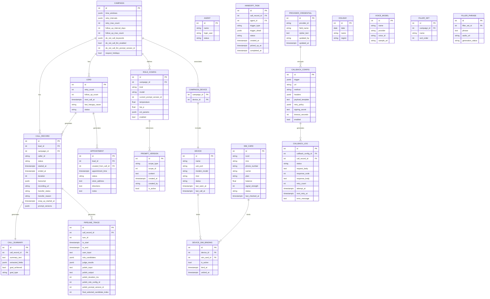

# 数据模型设计

<cite>
**本文档引用的文件**
- [data-model/spec.md](file://openspec/specs/data-model/spec.md)
- [architecture/spec.md](file://openspec/specs/architecture/spec.md)
- [provider-credential/spec.md](file://openspec/specs/provider-credential/spec.md)
- [webhook-callback/spec.md](file://openspec/specs/webhook-callback/spec.md)
- [appointment/spec.md](file://openspec/specs/appointment/spec.md)
- [retry-followup/spec.md](file://openspec/specs/retry-followup/spec.md)
- [role-prompt/spec.md](file://openspec/specs/role-prompt/spec.md)
- [time-window/spec.md](file://openspec/specs/time-window/spec.md)
- [human-handoff/spec.md](file://openspec/specs/human-handoff/spec.md)
- [device-hardware/spec.md](file://openspec/specs/device-hardware/spec.md)
- [README.md](file://README.md)
</cite>

## 目录
1. [简介](#简介)
2. [项目结构](#项目结构)
3. [核心组件](#核心组件)
4. [架构总览](#架构总览)
5. [详细组件分析](#详细组件分析)
6. [依赖分析](#依赖分析)
7. [性能考虑](#性能考虑)
8. [故障排查指南](#故障排查指南)
9. [结论](#结论)
10. [附录](#附录)

## 简介
本文件面向 iSales 数据模型设计，基于 OpenSpec 规范，系统化梳理实体关系、字段定义、数据类型、主键/外键、索引与约束、验证与业务规则、数据访问模式、缓存策略、性能考量、数据生命周期与归档、迁移路径与版本管理、安全与隐私、访问控制，以及最佳实践与设计原则。本文档既提供数据库模式图与示例数据，也给出关键流程的时序图与状态图，帮助读者快速理解并落地实施。

## 项目结构
- 数据模型由 isales-common 统一管理，其他服务通过依赖访问。
- 数据库统一为 PostgreSQL，所有迁移由 isales-common/alembic 管理。
- Redis 用于队列、Pub/Sub、全局并发计数器与缓存。

图表来源
- [architecture/spec.md:59-71](file://openspec/specs/architecture/spec.md#L59-L71)
- [data-model/spec.md:52-59](file://openspec/specs/data-model/spec.md#L52-L59)

章节来源
- [README.md:1-14](file://README.md#L1-L14)
- [architecture/spec.md:59-71](file://openspec/specs/architecture/spec.md#L59-L71)
- [data-model/spec.md:52-59](file://openspec/specs/data-model/spec.md#L52-L59)

## 核心组件
- 数据模型集中管理：所有 SQLAlchemy 模型与 Alembic 迁移由 isales-common 维护，其他服务仅依赖调用。
- 单库统一：所有表位于同一 PostgreSQL 实例与 schema，跨服务事务使用 PG 事务。
- JSONB 约束：半结构化配置与事件流使用 JSONB，需附带 JSON Schema 描述；强结构与外键关系使用关系建模，不滥用 JSONB。
- 表归属与一致性：每张表标注主要业务归属，归属决定 schema 演进与 PR 主导权；跨服务读写权由“数据库直连”与“跨服务读 vs 写”约束。

章节来源
- [data-model/spec.md:4-17](file://openspec/specs/data-model/spec.md#L4-L17)
- [data-model/spec.md:19-26](file://openspec/specs/data-model/spec.md#L19-L26)
- [data-model/spec.md:52-74](file://openspec/specs/data-model/spec.md#L52-L74)

## 架构总览
- 七仓微服务：isales-common 作为共享库被六个服务依赖。
- 单主机部署：v1 将全部服务部署在同一主机，≤8 路并发。
- 数据存储统一：共享 PostgreSQL 与 Redis；迁移统一由 isales-common 管理。
- 服务间通信：Redis 队列、Pub/Sub；内部 HTTP 服务统一 JWT 鉴权（isales-api 为唯一签发方）。

图表来源
- [architecture/spec.md:130-167](file://openspec/specs/architecture/spec.md#L130-L167)
- [architecture/spec.md:59-71](file://openspec/specs/architecture/spec.md#L59-L71)

章节来源
- [architecture/spec.md:5-24](file://openspec/specs/architecture/spec.md#L5-L24)
- [architecture/spec.md:45-58](file://openspec/specs/architecture/spec.md#L45-L58)
- [architecture/spec.md:59-71](file://openspec/specs/architecture/spec.md#L59-L71)

## 详细组件分析

### 数据模型总览与归属
- 全表清单与归属服务：数据模型规范列出核心表及其归属服务，涵盖 campaign、lead、call_record、call_summary、appointment、agent、handoff_task、role_config、prompt_version、pipeline_trace、device、sim_card、device_sim_binding、campaign_device、callback_config、callback_log、provider_credential、holiday、voice_model、filler_set、filler_phrase 等。
- JSONB 字段约束：半结构化字段需附带 JSON Schema；强结构与外键关系不得用 JSONB 简化。
- 跨引用：各表字段语义、约束、状态机在相应 capability spec 中定义。

章节来源
- [data-model/spec.md:23-50](file://openspec/specs/data-model/spec.md#L23-L50)
- [data-model/spec.md:61-74](file://openspec/specs/data-model/spec.md#L61-L74)
- [data-model/spec.md:75-83](file://openspec/specs/data-model/spec.md#L75-L83)

### 表结构与字段定义

#### 通话与摘要
- call_record：主键 id；外键 lead_id、campaign_id；字段包括 caller_id、status、started_at、ended_at、duration、transcript(JSONB)、recording_url、transfer_status、transfer_reason、wrap_up_started_at、prompt_versions(JSONB)。
- call_summary：主键 id；外键 call_record_id；字段包括 summary_text、extracted_fields(JSONB)、goal_achieved、goal_type。
- pipeline_trace：主键 id；外键 call_record_id；字段包括 turn_id、ts_start、ts_end、user_input、role_candidates(JSONB)、judge_results(JSONB)、polish_input、polish_output、polish_duration_ms、polish_role_config_id、polish_prompt_version_id、final_selected_candidate_index。

章节来源
- [data-model/spec.md:36-39](file://openspec/specs/data-model/spec.md#L36-L39)
- [data-model/spec.md:39-40](file://openspec/specs/data-model/spec.md#L39-L40)
- [data-model/spec.md:36](file://openspec/specs/data-model/spec.md#L36)

#### 线索与重试跟进
- lead：主键 id；字段包括 name、phone、source、custom_data(JSONB)、status、retry_count、follow_up_count、next_call_at、last_hangup_cause。
- campaign：主键 id；字段包括 name、voice_id、default_replies(JSONB)、concurrency、time_windows(JSONB)、extraction_fields(JSONB)、max_silence_activations、silence_threshold_ms、silence_phrases(JSONB)、silence_hangup_phrase、max_no_progress_seconds、wrap_up_max_rounds、wrap_up_max_seconds、wrap_up_closing_phrases(JSONB)、interruption_whitelist(JSONB)、interruption_min_duration_ms、max_continuous_interruptions、continuous_interruption_strategy、transfer_keyword_enabled、transfer_keywords(JSONB)、transfer_intent_enabled、transfer_intent_threshold、transfer_round_enabled、transfer_round_threshold、transfer_llm_enabled、transfer_llm_prompt_version_id、transfer_phrases(JSONB)、retry_intervals(JSONB)、retry_max_count、follow_up_interval_days、follow_up_max_count、do_not_call_keywords(JSONB)、do_not_call_llm_enabled、do_not_call_llm_prompt_version_id、respect_holidays。

章节来源
- [data-model/spec.md:37-38](file://openspec/specs/data-model/spec.md#L37-L38)
- [data-model/spec.md:30](file://openspec/specs/data-model/spec.md#L30)

#### 预约管理
- appointment：主键 id；外键 lead_id、created_from_call_id；字段包括 appointment_time、status（枚举：pending/confirmed/completed/cancelled）、store_address、directions、notes；关联 lead 状态联动：创建推进到 appointed，完成推进到 visited，取消不回退。

章节来源
- [data-model/spec.md:40](file://openspec/specs/data-model/spec.md#L40)
- [appointment/spec.md:6-13](file://openspec/specs/appointment/spec.md#L6-L13)

#### 角色与提示词
- role_config：主键 id；外键 campaign_id；字段包括 kind（role/judge/polish）、model、current_prompt_version_id、temperature、top_p、ext_params(JSONB)、enabled。
- prompt_version：主键 id；字段包括 scope_type（role/judge/polish）、scope_id、content、created_at、created_by、is_active；通话开始时写入 call_record.prompt_versions 快照。

章节来源
- [data-model/spec.md:34](file://openspec/specs/data-model/spec.md#L34)
- [data-model/spec.md:35](file://openspec/specs/data-model/spec.md#L35)
- [role-prompt/spec.md:150-170](file://openspec/specs/role-prompt/spec.md#L150-L170)

#### 设备与 SIM 卡
- device：主键 id；字段包括 name、usb_port、modem_model、imei、status（状态机）、last_seen_at、last_call_at。
- sim_card：主键 id；字段包括 iccid、imsi、phone_number、carrier、plan、balance、signal_strength、status、last_checked_at。
- device_sim_binding：主键 id；外键 device_id、sim_card_id；字段包括 is_active、bind_at、unbind_at。
- campaign_device：复合主键（campaign_id、device_id）；记录 campaign 与设备的关联。

章节来源
- [data-model/spec.md:46-49](file://openspec/specs/data-model/spec.md#L46-L49)
- [device-hardware/spec.md:517-525](file://openspec/specs/device-hardware/spec.md#L517-L525)

#### 转人工与坐席
- agent：主键 id；字段包括 name、login_user、status（online/offline）。
- handoff_task：主键 id；外键 call_record_id、agent_id；字段包括 trigger_type、trigger_detail、status、created_at、picked_up_at、completed_at。

章节来源
- [data-model/spec.md:32-33](file://openspec/specs/data-model/spec.md#L32-L33)
- [data-model/spec.md:33](file://openspec/specs/data-model/spec.md#L33)
- [human-handoff/spec.md:69-87](file://openspec/specs/human-handoff/spec.md#L69-L87)

#### 回调与凭证
- callback_config：主键 id；字段包括 trigger(JSONB, JsonLogic)、url、method、headers(JSONB)、payload_template(text, Jinja2)、retry_policy(JSONB)、signing_secret(Text, Fernet)、timeout_seconds、enabled。
- callback_log：主键 id；外键 callback_config_id；字段包括 status（枚举）、request_body、response_code、response_body、retry_count、attempt_at、next_retry_at、error_message。
- provider_credential：主键 id；唯一索引(provider_id, field_name)；字段包括 provider_id、field_name、cipher_text(Fernet)、updated_by、updated_at。

章节来源
- [data-model/spec.md:44-45](file://openspec/specs/data-model/spec.md#L44-L45)
- [data-model/spec.md:50](file://openspec/specs/data-model/spec.md#L50)
- [webhook-callback/spec.md:210-231](file://openspec/specs/webhook-callback/spec.md#L210-L231)
- [provider-credential/spec.md:82-91](file://openspec/specs/provider-credential/spec.md#L82-L91)

#### 其他支撑表
- holiday：主键 id；字段包括 date、name、region。
- voice_model：主键 id；字段包括 name、provider、voice_id、sample_url。
- filler_set：主键 id；字段包括 campaign_id、name、sort_order。
- filler_phrase：主键 id；字段包括 filler_set_id、phrase、audio_url、generation_status。

章节来源
- [data-model/spec.md:31](file://openspec/specs/data-model/spec.md#L31)
- [data-model/spec.md:41-43](file://openspec/specs/data-model/spec.md#L41-L43)

### 主键、外键、索引与约束
- 主键：绝大多数表采用自增主键（如 BIGSERIAL/INTEGER），部分中间表采用复合主键。
- 外键：明确的外键关系包括：
  - call_record(lead_id, campaign_id)
  - call_summary(call_record_id)
  - pipeline_trace(call_record_id)
  - role_config(campaign_id)
  - prompt_version(scope_id)
  - appointment(lead_id, created_from_call_id)
  - agent(id)
  - handoff_task(call_record_id, agent_id)
  - device_sim_binding(device_id, sim_card_id)
  - campaign_device(campaign_id, device_id)
  - callback_config(id)
  - callback_log(callback_config_id)
  - provider_credential(id)
- 索引与约束：
  - provider_credential 唯一索引(provider_id, field_name)，普通索引(provider_id)。
  - callback_log 状态与重试相关字段用于调度器扫描。
  - device_sim_binding 活跃绑定唯一性约束。
  - campaign_device 关联 campaign 与设备。

章节来源
- [data-model/spec.md:30-50](file://openspec/specs/data-model/spec.md#L30-L50)
- [provider-credential/spec.md:82-91](file://openspec/specs/provider-credential/spec.md#L82-L91)
- [device-hardware/spec.md:78-87](file://openspec/specs/device-hardware/spec.md#L78-L87)

### 数据验证与业务规则

#### 重试与跟进
- 重试：技术失败（no_answer、user_busy、network_out_of_order、temporary_failure）进入 retrying，按 retry_intervals 指数退避；达到 retry_max_count 进入 failed。
- 跟进：通话正常结束且未达成目标，按 follow_up_interval_days 固定间隔跟进；达到 follow_up_max_count 进入 follow_up_exhausted。
- “勿打”识别：关键词命中或独立 LLM 判定任一成立即标记 do_not_call 并清理未来任务。

章节来源
- [retry-followup/spec.md:5-26](file://openspec/specs/retry-followup/spec.md#L5-L26)
- [retry-followup/spec.md:38-51](file://openspec/specs/retry-followup/spec.md#L38-L51)
- [retry-followup/spec.md:71-89](file://openspec/specs/retry-followup/spec.md#L71-L89)

#### 预约状态机
- pending → confirmed → completed；pending → cancel → cancelled；completed/cancelled 为终态。
- 创建 appointment 推进 lead.status 至 appointed；完成 appointment 推进 lead.status 至 visited；取消不回退。

章节来源
- [appointment/spec.md:20-33](file://openspec/specs/appointment/spec.md#L20-L33)
- [appointment/spec.md:54-72](file://openspec/specs/appointment/spec.md#L54-L72)

#### 转人工
- 4 种触发机制（关键词/意图/轮次/独立 LLM）任一命中进入 TRANSFERRING，礼貌告知后主动挂断，派发 handoff_task。
- v1 不做实时桥接，仅标记 + 通知。

章节来源
- [human-handoff/spec.md:21-44](file://openspec/specs/human-handoff/spec.md#L21-L44)
- [human-handoff/spec.md:45-68](file://openspec/specs/human-handoff/spec.md#L45-L68)

#### 时间窗口与节假日
- campaign.time_windows(JSONB) 支持多窗口配置；respect_holidays 控制是否遵循全局 holiday 表。
- 窗口外 lead 推迟到最近窗口开始时刻；跨边界保护：通话进行中跨过窗口结束时刻不强制中断。

章节来源
- [time-window/spec.md:7-27](file://openspec/specs/time-window/spec.md#L7-L27)
- [time-window/spec.md:37-50](file://openspec/specs/time-window/spec.md#L37-L50)
- [time-window/spec.md:51-78](file://openspec/specs/time-window/spec.md#L51-L78)

#### 提示词版本管理
- prompt_version 记录历史；role_config.current_prompt_version_id 指向当前生效版本；通话开始写入 call_record.prompt_versions 快照。

章节来源
- [role-prompt/spec.md:150-170](file://openspec/specs/role-prompt/spec.md#L150-L170)

### 数据访问模式与缓存策略
- 访问模式：所有服务通过 isales-common 的 SQLAlchemy 模型访问数据库，避免直接 SQL。
- 缓存：Redis 用作队列（调度器→引擎、引擎→工作者、API→调度器）、Pub/Sub（API↔引擎实时控制与事件推送）、全局并发计数器（INCR/DECR）、缓存。
- 凭据缓存：isales-engine 启动时一次性从 provider_credential 表装载并缓存到进程内存。

章节来源
- [architecture/spec.md:63-71](file://openspec/specs/architecture/spec.md#L63-L71)
- [provider-credential/spec.md:27-34](file://openspec/specs/provider-credential/spec.md#L27-L34)

### 性能考虑
- JSONB 字段：仅用于半结构化配置或事件流，避免强关系建模；复杂查询建议配合索引与物化视图。
- 并发控制：全局并发计数器（Redis INCR）限制同时拨号；调度器主循环按时间窗口与并发上限取数。
- 重试调度：独立调度器后台任务按 next_retry_at 扫描，避免重复评估 trigger 与渲染 payload。
- 长上下文：v1 不截断对话历史，依赖 LLM 长上下文能力，需监控 token 用量。

章节来源
- [webhook-callback/spec.md:100-133](file://openspec/specs/webhook-callback/spec.md#L100-L133)
- [retry-followup/spec.md:119-159](file://openspec/specs/retry-followup/spec.md#L119-L159)
- [role-prompt/spec.md:43-56](file://openspec/specs/role-prompt/spec.md#L43-L56)

### 数据生命周期、保留与归档
- 生命周期：线索状态机包含终态（completed、failed、follow_up_exhausted、do_not_call、transferred），调度器不再扫描终态。
- 保留策略：规范未给出具体天数，建议结合合规与审计要求制定；可基于 lead.status 与 call_record.created_at 制定保留策略。
- 归档规则：建议对历史通话、摘要与回调日志按月/季度归档，保留关键索引字段以支持检索。

章节来源
- [retry-followup/spec.md:90-112](file://openspec/specs/retry-followup/spec.md#L90-L112)

### 数据迁移路径与版本管理
- 迁移单一来源：Alembic 迁移仅由 isales-common 管理，其他服务不得引入独立迁移工具。
- 版本管理：isales-common 作为共享库，通过 pip 包分发；变更频率低、跨服务复用稳定的接口与模型。
- 凭据迁移：提供 isales-cred-migrate CLI，支持 import-env/export-env，dry-run 与 --apply 控制。

章节来源
- [data-model/spec.md:14-18](file://openspec/specs/data-model/spec.md#L14-L18)
- [provider-credential/spec.md:170-196](file://openspec/specs/provider-credential/spec.md#L170-L196)

### 数据安全、隐私与访问控制
- 凭据安全：provider_credential 使用 Fernet 对称加密，主密钥 ISALES_FERNET_KEY 由环境变量注入；API 返回值掩码显示；signing_secret 与回调签名使用同一加密 Fabric。
- JWT 鉴权：isales-api 为唯一签发方，telephony-api 仅验证；HMAC 密钥通过环境变量注入；isales-web 直连 telephony-api。
- 访问控制：回调配置编辑器提供 validate/rotate-secret 辅助 API，前端编辑时的安全与校验流程由后端契约保障。

章节来源
- [provider-credential/spec.md:51-91](file://openspec/specs/provider-credential/spec.md#L51-L91)
- [provider-credential/spec.md:107-139](file://openspec/specs/provider-credential/spec.md#L107-L139)
- [architecture/spec.md:96-129](file://openspec/specs/architecture/spec.md#L96-L129)
- [webhook-callback/spec.md:171-204](file://openspec/specs/webhook-callback/spec.md#L171-L204)

### 示例数据
- campaign：包含 time_windows(JSONB)、retry_intervals(JSONB)、follow_up_interval_days、follow_up_max_count、do_not_call_keywords(JSONB)、transfer_* 系列配置。
- lead：包含 retry_count、follow_up_count、next_call_at、last_hangup_cause、status。
- call_record：包含 transcript(JSONB)、prompt_versions(JSONB)。
- callback_config：包含 trigger(JsonLogic)、payload_template(Jinja2)、retry_policy(JSONB)、signing_secret(Fernet)。
- provider_credential：包含 provider_id、field_name、cipher_text(Fernet)、updated_by、updated_at。

章节来源
- [data-model/spec.md:30-50](file://openspec/specs/data-model/spec.md#L30-L50)

### 关键流程时序图

#### 回调派发与重试

图表来源
- [webhook-callback/spec.md:100-133](file://openspec/specs/webhook-callback/spec.md#L100-L133)
- [webhook-callback/spec.md:134-137](file://openspec/specs/webhook-callback/spec.md#L134-L137)

#### 通话结束与摘要生成

图表来源
- [webhook-callback/spec.md:5-18](file://openspec/specs/webhook-callback/spec.md#L5-L18)
- [webhook-callback/spec.md:210-231](file://openspec/specs/webhook-callback/spec.md#L210-L231)

#### 设备选号与拨号

图表来源
- [device-hardware/spec.md:171-193](file://openspec/specs/device-hardware/spec.md#L171-L193)
- [device-hardware/spec.md:106-131](file://openspec/specs/device-hardware/spec.md#L106-L131)

### 状态图

#### 预约状态机

图表来源
- [appointment/spec.md:20-33](file://openspec/specs/appointment/spec.md#L20-L33)

#### 线索状态机（简化）

图表来源
- [retry-followup/spec.md:90-112](file://openspec/specs/retry-followup/spec.md#L90-L112)

## 依赖分析
- 组件耦合：isales-common 为共享库，被六个服务依赖；服务间通过 Redis 与 HTTP 通信。
- 直接依赖：各服务直接依赖 isales-common 的模型与工具；telephony-api 与 modem-controller 同仓库不同进程。
- 外部依赖：PostgreSQL、Redis；JWT/HMAC 密钥通过环境变量注入；Fernet 主密钥集中管理。

图表来源
- [architecture/spec.md:59-71](file://openspec/specs/architecture/spec.md#L59-L71)

章节来源
- [architecture/spec.md:5-24](file://openspec/specs/architecture/spec.md#L5-L24)
- [architecture/spec.md:59-71](file://openspec/specs/architecture/spec.md#L59-L71)

## 性能考虑
- JSONB 查询：对频繁查询的 JSONB 字段建议建立 GIN 索引或物化视图；避免在热路径上进行复杂 JSONB 运算。
- 并发控制：Redis 全局并发计数器 INCR/DECR 限制拨号并发；调度器按时间窗口与并发上限取数。
- 重试调度：独立调度器后台任务按 next_retry_at ASC 扫描，减少重复评估与渲染。
- 长上下文：不截断对话历史，需监控 token 用量并设置告警阈值。

章节来源
- [webhook-callback/spec.md:100-133](file://openspec/specs/webhook-callback/spec.md#L100-L133)
- [retry-followup/spec.md:119-159](file://openspec/specs/retry-followup/spec.md#L119-L159)
- [role-prompt/spec.md:43-56](file://openspec/specs/role-prompt/spec.md#L43-L56)

## 故障排查指南
- 凭据装载失败：engine 启动时从 provider_credential 表装载并解密，失败时硬失败并记录日志；dev/CI 可通过 ISALES_CREDENTIALS_REQUIRED=false 跳过。
- Fernet 主密钥问题：主密钥格式校验失败时启动失败并指向 RUNBOOK；密钥轮换需停机窗口。
- 回调签名：signing_secret 使用 Fernet 加密存储，解密后进行 HMAC-SHA256 签名；失败时记录 failed_render/failed_http_4xx。
- 设备离线：udev 拔出或 watchdog 超时将设备置 offline；心跳兜底覆盖进程崩溃/网络分区场景。

章节来源
- [provider-credential/spec.md:35-50](file://openspec/specs/provider-credential/spec.md#L35-L50)
- [provider-credential/spec.md:61-67](file://openspec/specs/provider-credential/spec.md#L61-L67)
- [webhook-callback/spec.md:68-99](file://openspec/specs/webhook-callback/spec.md#L68-L99)
- [device-hardware/spec.md:208-236](file://openspec/specs/device-hardware/spec.md#L208-L236)

## 结论
iSales 数据模型以 isales-common 为核心，统一管理 SQLAlchemy 模型与迁移，确保跨服务一致性与演进可控。通过 PostgreSQL 单实例与 Redis 统一缓存/队列，结合严格的 JSONB 约束与业务规则，形成高内聚、低耦合的数据层。凭据安全、JWT 鉴权与回调签名机制保障数据与通信安全。建议在生产环境中严格执行迁移单一来源、凭据集中管理与密钥轮换流程，并结合监控与告警完善数据生命周期与归档策略。

## 附录

### 数据模型 ER 图

图表来源
- [data-model/spec.md:23-50](file://openspec/specs/data-model/spec.md#L23-L50)
- [provider-credential/spec.md:82-91](file://openspec/specs/provider-credential/spec.md#L82-L91)
- [webhook-callback/spec.md:210-231](file://openspec/specs/webhook-callback/spec.md#L210-L231)