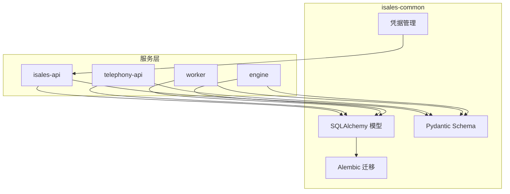
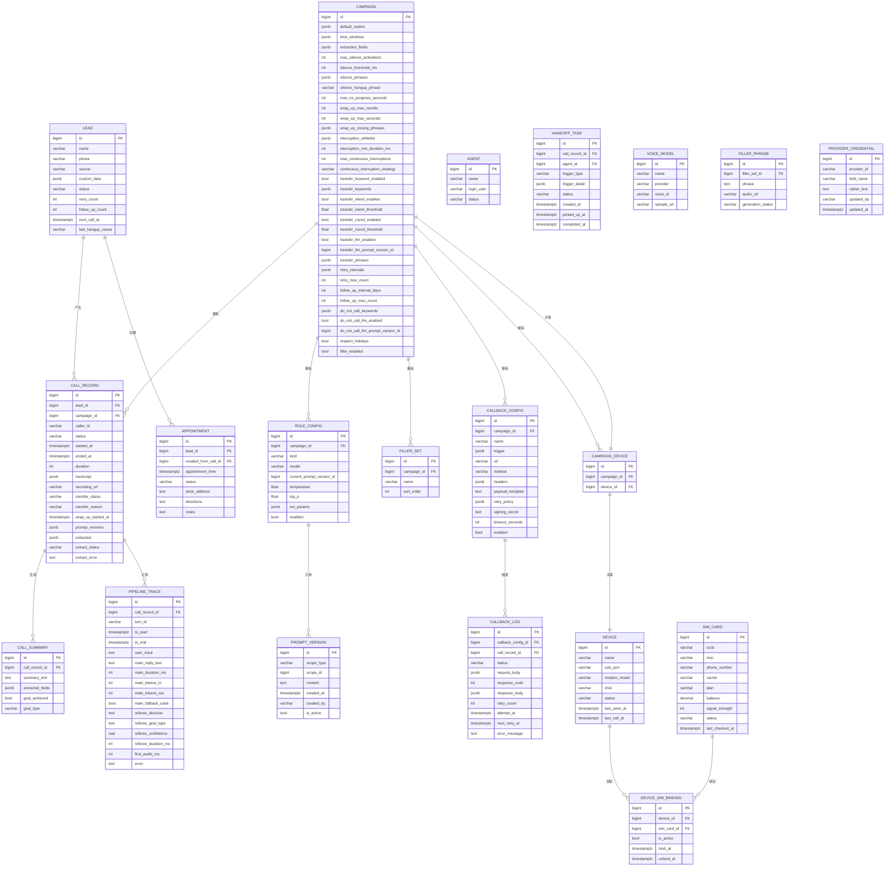
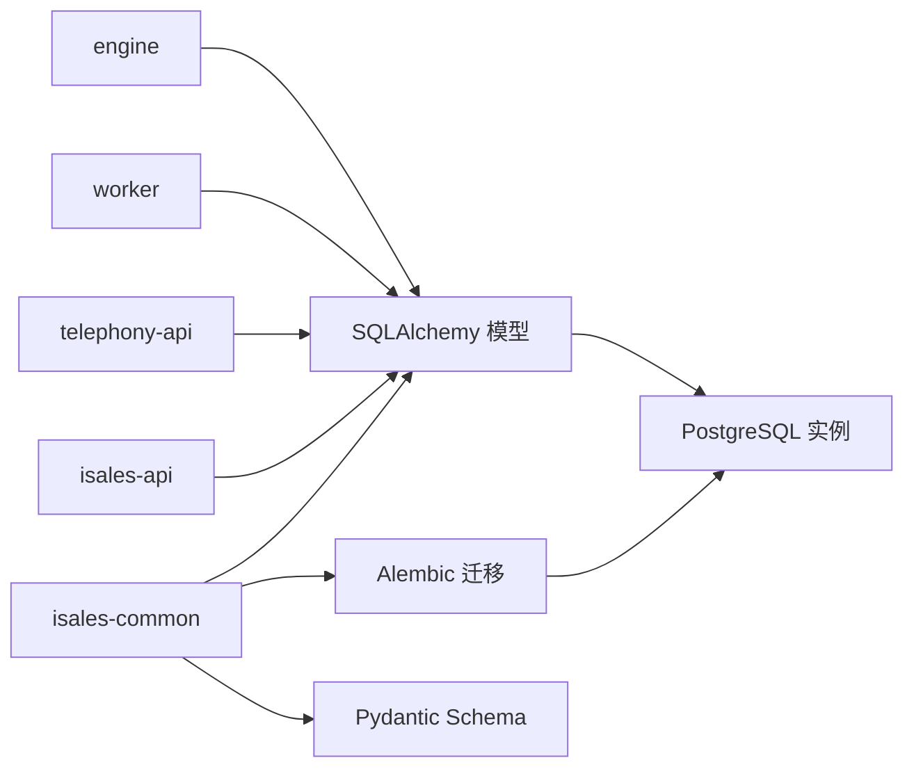

# 数据模型设计

<cite>
**本文引用的文件**
- [数据模型规范](file://openspec/specs/data-model/spec.md)
- [管道流与裁判变更规范](file://openspec/changes/pipeline-stream-and-referee/specs/data-model/spec.md)
- [管道流与裁判变更设计文档](file://openspec/changes/pipeline-stream-and-referee/design.md)
- [管道流与裁判变更任务清单](file://openspec/changes/pipeline-stream-and-referee/tasks.md)
- [AI 管道规范](file://openspec/specs/ai-pipeline/spec.md)
- [转录规范](file://openspec/specs/transcript/spec.md)
- [目标达成规范](file://openspec/specs/goal-achievement/spec.md)
- [服务通信规范](file://openspec/specs/service-communication/spec.md)
- [初始化 isales-common 任务清单](file://openspec/changes/archive/2026-05-01-init-isales-common/tasks.md)
- [SSOT 凭据实现任务清单](file://openspec/changes/archive/2026-05-24-impl-provider-credential-db-ssot/tasks.md)
- [重试与跟进能力规范](file://openspec/specs/retry-followup/spec.md)
- [Alembic 迁移脚本（Linux）](file://deploy/linux/scripts/migrate.sh)
- [Alembic 迁移脚本（macOS）](file://deploy/macos/scripts/migrate.sh)
- [设备选择集成任务清单](file://openspec/changes/archive/2026-05-06-impl-scheduler/tasks.md)
</cite>

## 更新摘要
**变更内容**
- 更新 role_config.kind 枚举值从 {role,judge,polish} 到 {main,referee,extractor}
- 重构 pipeline_trace 字段集，删除旧字段，新增流式处理相关字段
- 更新 call_record.prompt_versions JSONB schema 文档
- 新增 call_record.extracted、extract_status、extract_error 字段
- 新增 campaign.filler_enabled 字段
- 更新数据访问模式以适配新的双 LLM 架构
- 新增提取器状态管理机制和异步抽取流程

## 目录
1. [简介](#简介)
2. [项目结构](#项目结构)
3. [核心组件](#核心组件)
4. [架构总览](#架构总览)
5. [详细组件分析](#详细组件分析)
6. [依赖分析](#依赖分析)
7. [性能考虑](#性能考虑)
8. [故障排除指南](#故障排除指南)
9. [结论](#结论)
10. [附录](#附录)

## 简介
本文件为 iSales 数据模型的全面数据建模文档，聚焦核心实体关系、字段定义与数据类型，明确主键/外键、索引与约束，并解释数据验证与业务规则。文档还涵盖数据库模式图、示例数据、数据访问模式、缓存策略、性能考量、数据生命周期与保留策略、归档规则、数据迁移路径与版本管理、数据安全与隐私要求、访问控制，以及 JSONB 字段使用规范与最佳实践。最后提供数据模型演进历史与未来规划。

**更新** 本版本反映了 pipeline-stream-and-referee 变更，包括角色配置枚举更新、管道追踪字段重构和提取器状态管理。该变更将三层管线架构升级为双 LLM 架构，显著提升了通话首音频延迟性能。

## 项目结构
iSales 将数据模型统一由 isales-common 管理，其他服务通过依赖访问。数据库采用单一 PostgreSQL 实例，所有表位于同一 schema，跨服务事务使用 PG 事务，避免分布式事务。

**章节来源**
- [数据模型规范: 第52-60条:52-60](file://openspec/specs/data-model/spec.md#L52-L60)

## 核心组件
本节概述核心数据表及其归属服务，字段清单与职责边界。

- campaign：营销活动配置，包含重试策略、时间窗、提取字段、静默激活、打断检测、转接策略、回调触发等 JSONB 配置，**新增 filler_enabled 字段**。
- holiday：节假日信息，支持按地区生效。
- agent：坐席信息，含在线状态。
- handoff_task：人工转接任务，关联通话记录与坐席。
- role_config：角色提示词配置，包含模型参数与提示词版本，**枚举值已更新为 {main,referee,extractor}**。
- prompt_version：提示词版本管理，**scope_type 允许值已更新为 {main,referee,extractor}**。
- pipeline_trace：通话流水追踪，记录每轮对话的开始/结束、输入输出与评分，**字段集已重构**。
- lead：潜在客户，包含重试/跟进计数、下次拨打电话时间、挂断原因与自定义数据。
- call_record：通话记录，包含转写文本、转接状态、包装时间、**新增提取器状态字段**。
- call_summary：通话摘要与抽取字段。
- appointment：预约管理，关联 lead，支持从通话创建。
- voice_model：语音模型元数据。
- filler_set / filler_phrase：填充短语集合与短语。
- callback_config / callback_log：外呼回调配置与日志。
- device / sim_card / device_sim_binding：设备与 SIM 卡管理及绑定关系。
- campaign_device：活动与设备的关联表。
- provider_credential：第三方提供商凭据的加密存储。

**章节来源**
- [数据模型规范: 第28-50条:28-50](file://openspec/specs/data-model/spec.md#L28-L50)

## 架构总览
下图展示数据模型在服务间的分布与交互，强调归属服务与跨服务读写边界。

**图表来源**
- [数据模型规范: 第28-50条:28-50](file://openspec/specs/data-model/spec.md#L28-L50)

**章节来源**
- [数据模型规范: 第28-50条:28-50](file://openspec/specs/data-model/spec.md#L28-L50)

## 详细组件分析

### campaign 表
- 关键字段：名称、语音模型、默认回复、并发、时间窗、提取字段、静默激活阈值、打断白名单、转接策略、重试间隔、跟进间隔与次数、勿打关键词与 LLM 判定、**新增 filler_enabled 字段**。
- JSONB 字段：default_replies、time_windows、extraction_fields、silence_phrases、wrap_up_closing_phrases、interruption_whitelist、transfer_keywords、transfer_phrases、retry_intervals、do_not_call_keywords。
- 业务规则：遵循重试与跟进能力规范；节假日尊重策略由 respect_holidays 控制；**filler_enabled 控制是否启用填充音功能**。

**章节来源**
- [数据模型规范: 第30条](file://openspec/specs/data-model/spec.md#L30)
- [管道流与裁判变更规范: 第16-16条:16](file://openspec/changes/pipeline-stream-and-referee/specs/data-model/spec.md#L16)
- [重试与跟进能力规范: 第160-176条:160-176](file://openspec/specs/retry-followup/spec.md#L160-L176)

### lead 表
- 关键字段：姓名、电话、来源、自定义数据、状态、重试/跟进计数、下次拨打电话时间、上次挂断原因。
- JSONB 字段：custom_data。
- 业务规则：状态枚举包含 new/queued/calling/retrying/following_up/completed/failed/follow_up_exhausted/do_not_call/transferred；next_call_at 由调度器根据 campaign 重试策略计算。

**章节来源**
- [数据模型规范: 第37条](file://openspec/specs/data-model/spec.md#L37)
- [重试与跟进能力规范: 第160-176条:160-176](file://openspec/specs/retry-followup/spec.md#L160-L176)

### call_record 表
- 关键字段：关联 lead 与 campaign、主叫号码、状态、开始/结束时间、时长、录音地址、转接状态与原因、包装开始时间、提示词版本快照、**新增提取器状态字段**。
- JSONB 字段：transcript、prompt_versions、**新增 extracted 字段**。
- 业务规则：转接状态与转接原因由引擎驱动；包装阶段由 wrap_up_started_at 标识；**prompt_versions schema 已更新为 {main_llm, referee_llm, extractor_llm, wrap_up_appended}**。

**更新** 新增提取器状态管理字段：
- `extracted(JSONB, nullable)`：提取器处理后的结构化数据
- `extract_status(VARCHAR(16), nullable)`：提取器状态，包含 null/pending/done/failed
- `extract_error(Text, nullable)`：提取器错误信息

**章节来源**
- [数据模型规范: 第38条](file://openspec/specs/data-model/spec.md#L38)
- [管道流与裁判变更规范: 第24-24条:24](file://openspec/changes/pipeline-stream-and-referee/specs/data-model/spec.md#L24)

### call_summary 表
- 关键字段：关联 call_record、摘要文本、抽取字段、目标达成标识与类型。
- JSONB 字段：extracted_fields。
- 业务规则：由 worker 生成，用于后续分析与归档。

**章节来源**
- [数据模型规范: 第39条](file://openspec/specs/data-model/spec.md#L39)

### pipeline_trace 表
- 关键字段：关联 call_record、轮次标识、开始/结束时间、用户输入、**新增 main_reply_text、main_duration_ms、main_tokens_in、main_tokens_out、main_fallback_used、referee_decision、referee_goal_type、referee_confidence、referee_duration_ms、first_audio_ms、error**。
- JSONB 字段：**已删除 role_candidates、judge_results、polish_input、polish_output、polish_duration_ms、polish_role_config_id、polish_prompt_version_id、final_selected_candidate_index**。
- 业务规则：记录每次对话轮次的完整轨迹，便于审计与复盘；**字段集已重构为双 LLM 架构**。

**更新** 字段语义更新：
- `main_reply_text`: main LLM 流式聚合后的完整 reply 文本（或 default_reply 兜底时的兜底文本）
- `main_duration_ms`: main LLM 从 chat_stream 启动到 last token 总时长
- `main_tokens_in` / `main_tokens_out`: token 计费
- `main_fallback_used`: 是否走了 streaming → chat() 非流式 fallback
- `referee_decision`: referee 输出的 decision 字段（含 "timeout" / "invalid" / "low_confidence" 三种 fail-open 标记）
- `referee_goal_type`: referee 输出的 goal_type（goal_achieved 时非空）
- `referee_confidence`: referee 输出的 confidence（fail-open 时为 null）
- `referee_duration_ms`: referee LLM 调用时长
- `first_audio_ms`: 从 PROCESSING 入口到首 PCM chunk 推到 RTC 的时间差（监控用）
- `error`: 任意失败原因（兜底场景）

**章节来源**
- [数据模型规范: 第36条](file://openspec/specs/data-model/spec.md#L36)
- [管道流与裁判变更规范: 第44-57条:44-57](file://openspec/changes/pipeline-stream-and-referee/specs/data-model/spec.md#L44-L57)

### role_config 与 prompt_version
- role_config：关联 campaign，定义角色类型、模型、当前提示词版本、温度、top_p、扩展参数与启用状态，**kind 枚举值已更新为 {main,referee,extractor}**。
- prompt_version：按作用域（如 campaign/role）管理提示词内容、创建者、创建时间与激活状态，**scope_type 允许值已更新为 {main,referee,extractor}**。
- 业务规则：current_prompt_version_id 指向当前生效的提示词版本；**Campaign 启动前必须包含恰好 1 个 main + 1 个 referee + 1 个 extractor 三行 role_config**。

**更新** 枚举值变更：
- 从 {role,judge,polish} 改为 {main,referee,extractor}
- main：主要对话角色，负责流式回复生成
- referee：裁判角色，负责决策判断和目标达成评估
- extractor：提取器角色，负责结构化数据抽取

**章节来源**
- [数据模型规范: 第34-35条:34-35](file://openspec/specs/data-model/spec.md#L34-L35)
- [管道流与裁判变更规范: 第38-42条:38-42](file://openspec/changes/pipeline-stream-and-referee/specs/data-model/spec.md#L38-L42)

### callback_config 与 callback_log
- callback_config：关联 campaign，定义回调触发条件（JsonLogic）、目标 URL、HTTP 方法、请求头、负载模板（Jinja2）、重试策略（JSONB）、签名密钥（加密存储）、超时与启用状态。
- callback_log：记录每次回调尝试的状态、请求/响应体、重试次数、时间戳与错误信息。
- 业务规则：签名密钥与提供商凭据采用相同加密格式（urlsafe base64 Fernet）。

**章节来源**
- [数据模型规范: 第44-45条:44-45](file://openspec/specs/data-model/spec.md#L44-L45)

### device / sim_card / device_sim_binding / campaign_device
- device：设备信息与状态机，包含 last_call_at 用于设备选择负载均衡。
- sim_card：SIM 卡信息与信号强度、余额等。
- device_sim_binding：设备与 SIM 的绑定关系与有效时段。
- campaign_device：活动与设备的关联表，归属 api（生命周期跟随 campaign）。
- 业务规则：设备选择算法利用 last_call_at 进行负载均衡。

**章节来源**
- [数据模型规范: 第46-49条:46-49](file://openspec/specs/data-model/spec.md#L46-L49)
- [设备选择集成任务清单: 第40-45条:40-45](file://openspec/changes/archive/2026-05-06-impl-scheduler/tasks.md#L40-L45)

### provider_credential
- 字段：provider_id、field_name、cipher_text（urlsafe base64 Fernet 加密）、updated_by（JWT sub）、updated_at。
- 约束：UNIQUE(provider_id, field_name)，普通索引 provider_id。
- 业务规则：禁止写入未知 provider_id；UI 写入多字段需分别 upsert。

**章节来源**
- [数据模型规范: 第50条](file://openspec/specs/data-model/spec.md#L50)
- [SSOT 凭据实现任务清单: 第7-12条:7-12](file://openspec/changes/archive/2026-05-24-impl-provider-credential-db-ssot/tasks.md#L7-L12)

### JSONB 字段使用规范与最佳实践
- 用途：用于半结构化配置或事件流，必须附带 JSON Schema 描述。
- 约束：不得替代关系建模；强结构与外键关系应使用独立表与外键。
- 示例：transcript、prompt_versions、role_candidates、judge_results、retry_intervals、time_windows 等均需在对应 capability spec 中给出 schema。

**更新** prompt_versions schema 已更新：
- 从旧的 {role_llms, judge_llms, polish_llm, wrap_up_appended} 更新为 {main_llm, referee_llm, extractor_llm, wrap_up_appended}
- main_llm：主要对话角色的提示词版本
- referee_llm：裁判角色的提示词版本  
- extractor_llm：提取器角色的提示词版本

**章节来源**
- [数据模型规范: 第61-74条:61-74](file://openspec/specs/data-model/spec.md#L61-L74)

## 依赖分析
- 统一管理：所有 SQLAlchemy 模型与 Alembic 迁移由 isales-common 管理，其他服务通过依赖访问。
- 迁移单一来源：部署时仅由 isales-common 执行迁移，避免多源迁移冲突。
- 跨服务通信：服务间通过消息契约与 API 交互，数据一致性通过归属服务写入与 PG 事务保障。

**图表来源**
- [数据模型规范: 第9-17条:9-17](file://openspec/specs/data-model/spec.md#L9-L17)
- [初始化 isales-common 任务清单: 第79-86条:79-86](file://openspec/changes/archive/2026-05-01-init-isales-common/tasks.md#L79-L86)

**章节来源**
- [数据模型规范: 第9-17条:9-17](file://openspec/specs/data-model/spec.md#L9-L17)
- [初始化 isales-common 任务清单: 第79-86条:79-86](file://openspec/changes/archive/2026-05-01-init-isales-common/tasks.md#L79-L86)

## 性能考虑
- 单库统一：所有表位于同一 PostgreSQL 实例，减少跨库事务复杂性。
- 索引策略：针对常用过滤字段（如 campaign_id、lead_id、call_record_id、status、updated_at）建立索引，提升查询性能。
- JSONB 查询：对频繁查询的 JSONB 键使用 GIN 索引，结合 @>、?、#>> 等操作符优化。
- 缓存策略：热点数据（如提示词版本、设备选择结果）可使用 Redis 缓存，降低数据库压力。
- 分页与限制：对大表查询设置合理分页与结果集大小限制，避免内存溢出。
- 迁移性能：迁移脚本在部署时执行，建议在低峰期运行，避免影响线上业务。

**更新** 新增性能考虑：
- 流式处理监控：first_audio_ms 字段用于监控首音频延迟，建议建立相应索引和监控告警
- 提取器状态监控：extract_status 字段用于跟踪异步提取器处理进度，建议建立状态索引
- 双 LLM 架构优化：main_reply_text 和 referee_decision 字段的查询优化，避免重复计算
- 异步抽取性能：post-call extractor 通过 Redis 队列异步处理，避免阻塞主通话流程

**章节来源**
- [数据模型规范: 第52-60条:52-60](file://openspec/specs/data-model/spec.md#L52-L60)
- [初始化 isales-common 任务清单: 第13条](file://openspec/changes/archive/2026-05-01-init-isales-common/tasks.md#L13)

## 故障排除指南
- 迁移失败：检查 Alembic 配置与数据库连接字符串，确保仅由 isales-common 执行迁移。
- JSONB 结构异常：核对对应 capability spec 的 JSON Schema，确保写入结构与校验一致。
- 凭据写入失败：确认 provider_id 在已知集合内，且 cipher_text 使用 urlsafe base64 Fernet 格式。
- 设备选择冲突：last_call_at 写入时机需避免并发导致的重复选择。
- **提取器处理异常**：检查 extract_status 字段，确认异步提取器队列 isales:extract 的处理状态，必要时手动重试。

**更新** 新增故障排除项：
- **角色配置枚举错误**：确认 role_config.kind 字段值为 {main,referee,extractor}，避免使用旧的 {role,judge,polish} 值
- **管道追踪字段缺失**：确认 pipeline_trace 表已按新架构重构，包含 main_reply_text、referee_decision 等新字段
- **流式处理监控异常**：检查 first_audio_ms 字段是否正常更新，确认流式主链路的性能监控
- **提取器队列堆积**：监控 Redis 队列长度，确保 worker 服务能够及时处理提取任务

**章节来源**
- [Alembic 迁移脚本（Linux）: 第44-72条:44-72](file://deploy/linux/scripts/migrate.sh#L44-L72)
- [Alembic 迁移脚本（macOS）: 第44-72条:44-72](file://deploy/macos/scripts/migrate.sh#L44-L72)
- [SSOT 凭据实现任务清单: 第7-12条:7-12](file://openspec/changes/archive/2026-05-24-impl-provider-credential-db-ssot/tasks.md#L7-L12)

## 结论
iSales 数据模型通过 isales-common 统一管理，采用单一 PostgreSQL 实例与清晰的表归属与跨服务读写边界，确保数据一致性与可维护性。JSONB 字段用于半结构化配置，配合严格的 schema 描述与校验，既满足灵活性又保证数据质量。通过合理的索引、缓存与迁移策略，系统具备良好的性能与可演进性。

**更新** 本版本反映了 pipeline-stream-and-referee 变更带来的重大架构调整：
- 从三层管线架构升级为双 LLM 架构（main + referee）
- 角色配置枚举标准化为 {main,referee,extractor}
- 管道追踪字段重构，强化流式处理监控
- 新增提取器状态管理，支持异步数据抽取
- 填充音功能可选启用，优化首音频延迟
- 引入 post-call extractor 异步抽取机制，提升系统整体性能

## 附录

### 数据访问模式
- ORM 访问：通过 SQLAlchemy 模型进行 CRUD 操作，结合 Pydantic Schema 进行序列化与反序列化。
- 查询优化：针对高频查询建立索引，使用分页与投影字段减少网络传输。
- 事务管理：跨服务更新使用 PG 事务，避免分布式事务。
- **流式处理访问**：新增对 pipeline_trace 的流式处理监控查询，重点关注 first_audio_ms、main_duration_ms 等性能指标字段。
- **提取器状态查询**：支持按 extract_status 字段进行过滤查询，监控异步提取器处理进度。

**更新** 新增数据访问模式：
- **提取器状态查询**：支持按 extract_status 字段进行过滤查询，监控异步提取器处理进度
- **双 LLM 架构查询**：支持按 main_reply_text、referee_decision 等字段进行分析查询
- **性能监控查询**：支持按 first_audio_ms、main_duration_ms 等字段进行性能分析

**章节来源**
- [初始化 isales-common 任务清单: 第38-56条:38-56](file://openspec/changes/archive/2026-05-01-init-isales-common/tasks.md#L38-L56)

### 数据生命周期、保留策略与归档规则
- 生命周期：通话记录与摘要按业务需要保留一定周期，到期后进入归档。
- 保留策略：根据法规与业务需求设定保留期限，定期清理过期数据。
- 归档规则：归档前进行数据脱敏与压缩，保留必要索引字段以便检索。
- **提取器数据管理**：extracted 字段包含结构化抽取数据，建议与通话记录同步归档策略。

**更新** 新增数据生命周期考虑：
- **流式处理数据**：pipeline_trace 表包含大量实时性能数据，建议短期保留用于监控分析
- **提取器状态数据**：extract_status 和 extract_error 字段用于故障诊断，建议短期保留
- **异步抽取数据**：post-call extractor 产生的 extracted 数据，建议与主通话数据同步管理

### 数据迁移路径与版本管理
- 迁移工具：Alembic 异步迁移，统一由 isales-common 管理。
- 版本管理：通过 Git Tag 与 CHANGELOG 记录版本演进，CI 中包含迁移往返测试。
- **迁移兼容性**：新版本迁移包含数据迁移逻辑，如将 call_summary.extracted_fields 迁移到 call_record.extracted。

**更新** 新增迁移路径：
- **角色配置迁移**：从旧枚举值 {role,judge,polish} 迁移到新枚举值 {main,referee,extractor}
- **管道追踪迁移**：删除旧字段并添加新字段，包含数据迁移逻辑
- **提取器状态迁移**：将历史抽取数据从 call_summary 迁移到 call_record
- **填充音功能迁移**：新增 filler_enabled 字段，默认关闭

**章节来源**
- [初始化 isales-common 任务清单: 第79-86条:79-86](file://openspec/changes/archive/2026-05-01-init-isales-common/tasks.md#L79-L86)

### 数据安全、隐私要求与访问控制
- 凭据加密：敏感凭据与签名密钥采用 Fernet 对称加密，密文存储于数据库。
- 访问控制：服务间 JWT 共享鉴权体系，isales-api 为唯一签发方，telephony-api 仅验证。
- 最小权限：数据库用户仅授予必要权限，API 层进行细粒度授权校验。

**章节来源**
- [SSOT 凭据实现任务清单: 第5-12条:5-12](file://openspec/changes/archive/2026-05-24-impl-provider-credential-db-ssot/tasks.md#L5-L12)
- [数据模型规范: 第50条](file://openspec/specs/data-model/spec.md#L50)

### JSONB 字段使用规范与最佳实践
- 必须附带 JSON Schema 描述，明确键、类型、必填/可选。
- 不替代关系建模；强结构字段使用外键表。
- 查询时使用 GIN 索引与合适的操作符，避免全表扫描。

**更新** 新增 JSONB 字段规范：
- **prompt_versions 字段**：schema 已更新为 {main_llm, referee_llm, extractor_llm, wrap_up_appended}
- **extracted 字段**：结构化抽取数据，建议在对应 capability spec 中定义 schema
- **transcript 字段**：保持原有结构，继续支持事件流记录

**章节来源**
- [数据模型规范: 第61-74条:61-74](file://openspec/specs/data-model/spec.md#L61-L74)

### 数据模型演进历史与未来规划
- 历史：从 v0.1.0 开始，逐步完善数据模型与迁移机制；v0.1.2 调整设备选择与 campaign_device 归属。
- **近期变更**：v0.1.6 实现 pipeline-stream-and-referee 变更，包括角色配置枚举更新、管道追踪字段重构、提取器状态管理等。
- 规划：持续完善 JSONB 字段的 schema 文档，增强查询与分析能力；优化索引与缓存策略，提升性能。

**更新** 新增演进历史：
- **v0.1.6 (pipeline-stream-and-referee)**：双 LLM 架构升级，角色配置标准化，管道追踪重构
- **后续规划**：进一步优化流式处理监控，完善提取器状态管理，考虑移除填充音功能
- **长期规划**：基于运行时监控数据，持续优化双 LLM 架构的性能表现

**章节来源**
- [初始化 isales-common 任务清单: 第88-101条:88-101](file://openspec/changes/archive/2026-05-01-init-isales-common/tasks.md#L88-L101)
- [数据模型规范: 第19-21条:19-21](file://openspec/specs/data-model/spec.md#L19-L21)

### 提取器状态管理机制
**更新** 新增提取器状态管理机制：

- **状态流转**：null → pending → done/failed
- **触发时机**：通话结束（engine 进入 END 状态之前）自动触发
- **处理方式**：通过 Redis 队列异步处理，worker 服务消费并更新数据库
- **错误处理**：失败时记录详细错误信息，支持人工重试
- **监控告警**：通过 extract_status 字段监控处理进度和异常情况

**章节来源**
- [AI 管道规范: 第130-152条:130-152](file://openspec/specs/ai-pipeline/spec.md#L130-L152)
- [管道流与裁判变更规范: 第59-67条:59-67](file://openspec/changes/pipeline-stream-and-referee/specs/data-model/spec.md#L59-L67)
- [服务通信规范: 第41-46条:41-46](file://openspec/specs/service-communication/spec.md#L41-L46)