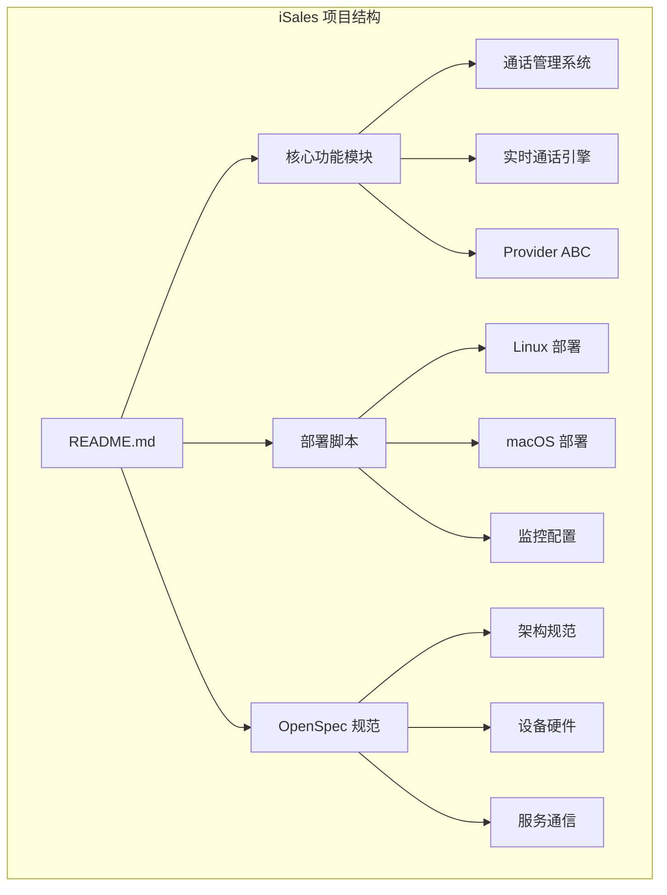
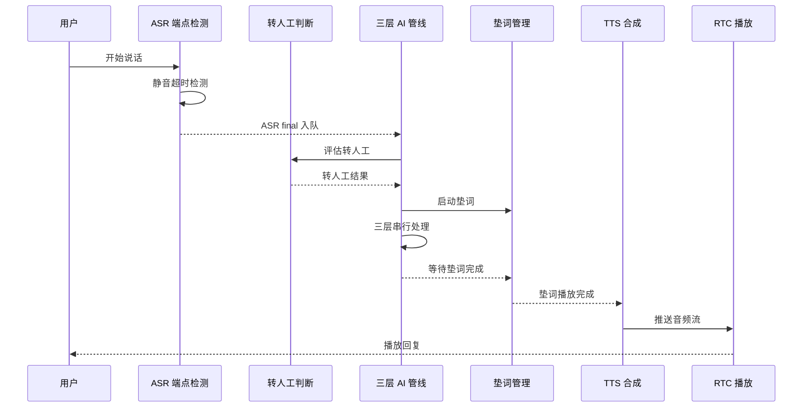
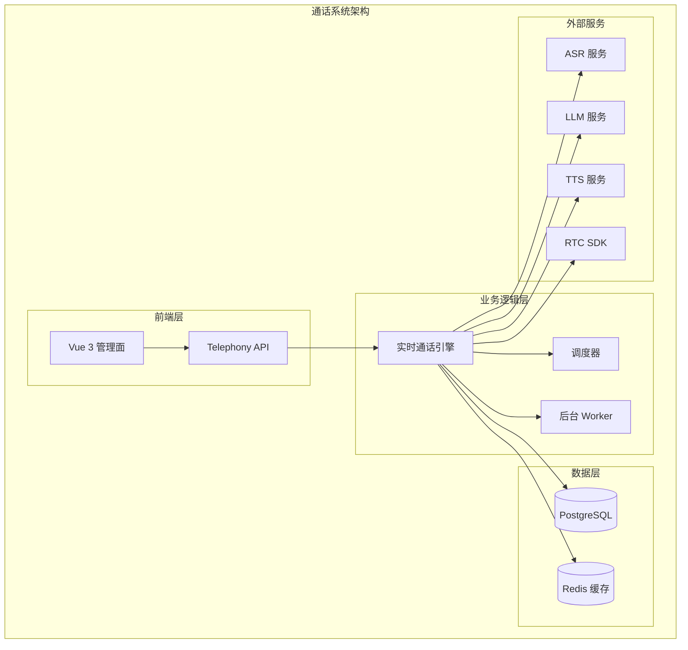
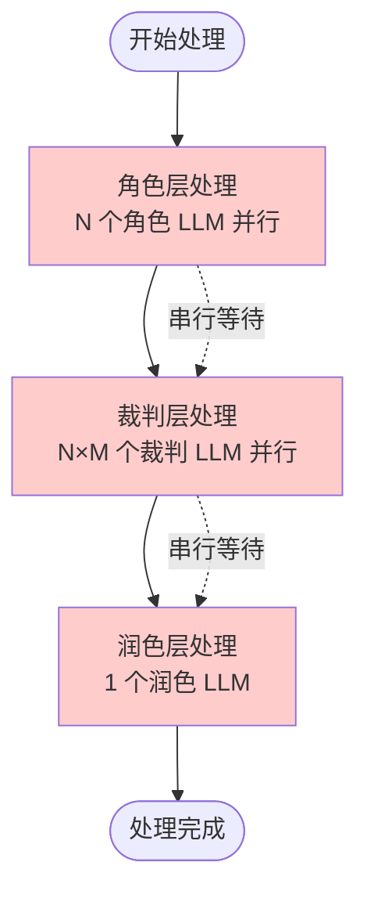
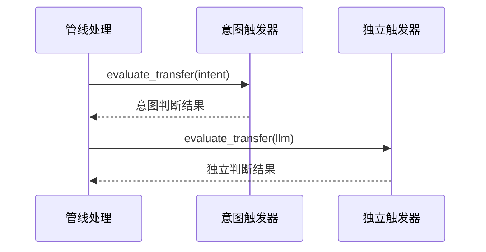
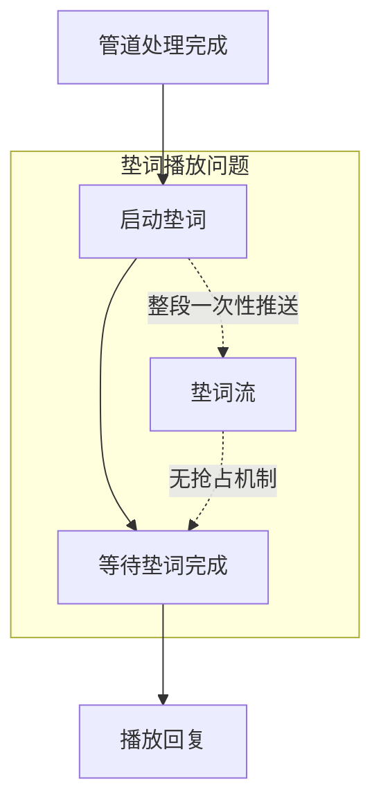
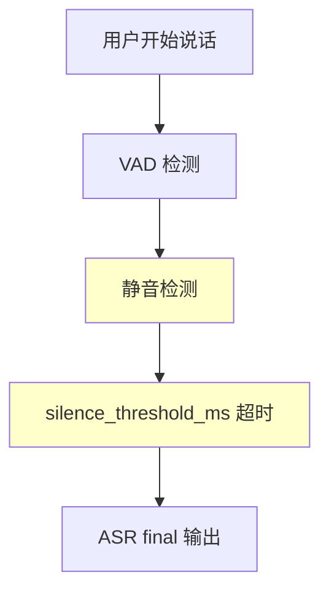
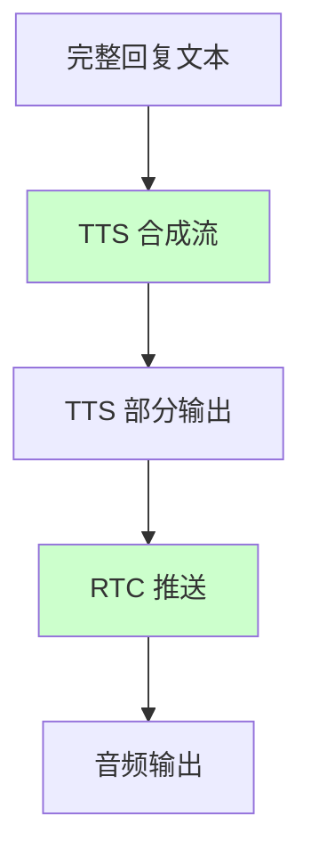
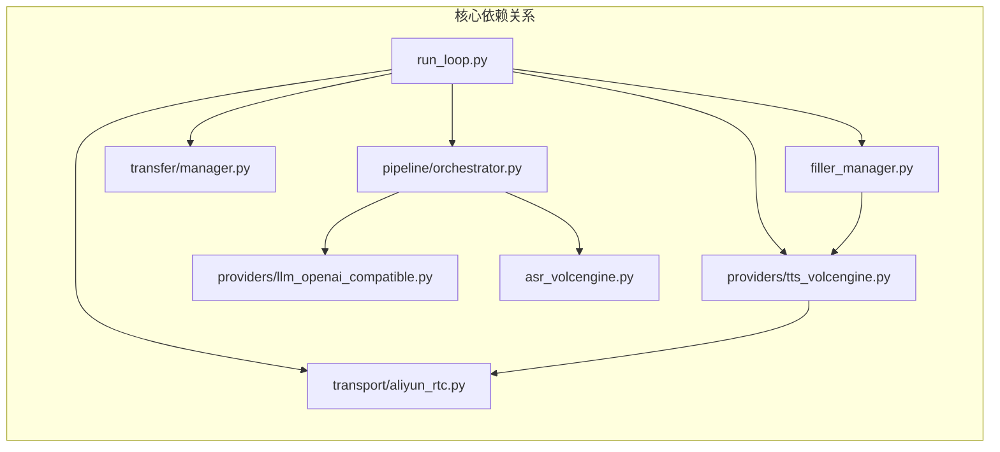
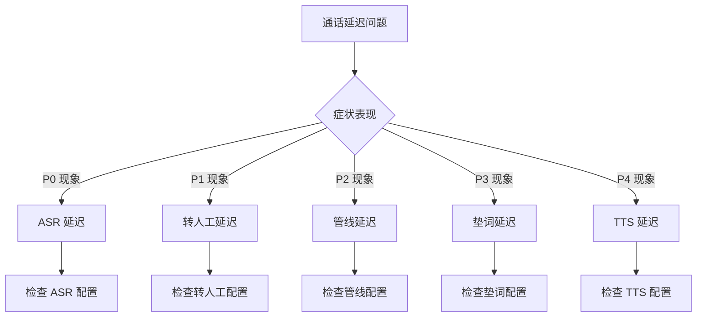

# 通话响应延迟分析报告

<cite>
**本文档引用的文件**
- [README.md](file://README.md)
- [通话响应延迟分析报告.md](file://通话响应延迟分析报告.md)
- [fix_hangup.py](file://fix_hangup.py)
- [.qoder.local-backup-20260601/repowiki/zh/content/核心功能模块/通话管理系统.md](file://.qoder.local-backup-20260601/repowiki/zh/content/核心功能模块/通话管理系统.md)
</cite>

## 目录
1. [简介](#简介)
2. [项目结构](#项目结构)
3. [核心组件](#核心组件)
4. [架构概览](#架构概览)
5. [详细组件分析](#详细组件分析)
6. [依赖关系分析](#依赖关系分析)
7. [性能考量](#性能考量)
8. [故障排查指南](#故障排查指南)
9. [结论](#结论)

## 简介

本报告基于对 iSales 通话系统的深入分析，聚焦于通话响应延迟问题的根本原因和优化方案。通过对实时通话引擎（isales-engine）和 Provider ABC/RTC 组件的完整链路分析，我们发现延迟严重的主要原因是三处叠加的"串行等待"。

iSales 是一个跨仓协作的通话管理系统，包含以下核心仓库：
- isales-common：Pydantic/SQLAlchemy 模型 + 跨仓共享 schema
- isales-api：FastAPI HTTP 后台（campaigns/leads/calls/...）
- isales-telephony：/devices/sim-cards + modem-controller 守护进程
- isales-scheduler：调度器（campaign 启停/拨号队列）
- isales-worker：后台 worker（callback/recording upload/watchdog）
- isales-engine：实时通话引擎（状态机 + 三层 AI 管线）
- isales-web：Vue 3 管理面

## 项目结构



**图表来源**
- [README.md:1-86](file://README.md#L1-L86)

**章节来源**
- [README.md:1-86](file://README.md#L1-L86)

## 核心组件

### 通话响应链路时序图



**图表来源**
- [通话响应延迟分析报告.md:21-50](file://通话响应延迟分析报告.md#L21-L50)

### 延迟问题分类

根据分析，通话延迟主要分为五个层次：

| 层级 | 问题类型 | 严重程度 | 主要表现 |
|------|----------|----------|----------|
| P0 | ASR 端点检测 | 🟡 | 静音超时导致的延迟 |
| P1 | 转人工判断 | 🔴 | 串行前置的额外往返 |
| P2 | 三层管线串行 | 🔴 | 严格串行的三层处理 |
| P3 | 垫词阻塞等待 | 🟠 | wait_finished 强制阻塞 |
| P4 | TTS/RTC 播放 | 🟡 | 首字节延迟 |

**章节来源**
- [通话响应延迟分析报告.md:54-131](file://通话响应延迟分析报告.md#L54-L131)

## 架构概览



**图表来源**
- [.qoder.local-backup-20260601/repowiki/zh/content/核心功能模块/通话管理系统.md:363-394](file://.qoder.local-backup-20260601/repowiki/zh/content/核心功能模块/通话管理系统.md#L363-L394)

## 详细组件分析

### P2 - 三层管线串行处理

三层 AI 管线是当前系统最大的性能瓶颈，存在以下问题：



**图表来源**
- [通话响应延迟分析报告.md:56-72](file://通话响应延迟分析报告.md#L56-L72)

**问题特征**：
- 三层严格串行，无法重叠处理
- 所有 LLM 调用都是非流式整段生成
- 每次都需要等待整段 JSON 生成完成
- 单次处理耗时通常为 2-5 秒

**章节来源**
- [通话响应延迟分析报告.md:56-72](file://通话响应延迟分析报告.md#L56-L72)

### P1 - 转人工判断前置

转人工判断逻辑存在串行前置问题：



**图表来源**
- [通话响应延迟分析报告.md:75-85](file://通话响应延迟分析报告.md#L75-L85)

**问题特征**：
- 意图触发器和独立触发器串行执行
- 每个触发器都需要一次 LLM 调用往返
- 发生在垫词启动之前，无法被垫词遮蔽

**章节来源**
- [通话响应延迟分析报告.md:75-85](file://通话响应延迟分析报告.md#L75-L85)

### P3 - 垫词阻塞等待

垫词管理存在强制阻塞问题：



**图表来源**
- [通话响应延迟分析报告.md:88-105](file://通话响应延迟分析报告.md#L88-L105)

**问题特征**：
- `wait_finished()` 强制等待垫词整句播放完成
- 垫词播放采用整段一次性推送方式
- 缺乏回复抢占机制，导致回复被垫词拖累

**章节来源**
- [通话响应延迟分析报告.md:88-105](file://通话响应延迟分析报告.md#L88-L105)

### P0 - ASR 端点检测

ASR 端点检测依赖静音超时：



**图表来源**
- [通话响应延迟分析报告.md:108-118](file://通话响应延迟分析报告.md#L108-L118)

**问题特征**：
- 用户停止说话到拿到 ASR final 存在固定空窗
- 取决于 ASR 何时吐出 `is_final=True` 帧
- campaign 配置中的 `silence_threshold_ms` 影响延迟

**章节来源**
- [通话响应延迟分析报告.md:108-118](file://通话响应延迟分析报告.md#L108-L118)

### P4 - TTS/RTC 播放

TTS 和 RTC 播放链路本身是流式的：



**图表来源**
- [通话响应延迟分析报告.md:121-130](file://通话响应延迟分析报告.md#L121-L130)

**问题特征**：
- TTS 本身支持流式合成
- RTC 推送采用流式 + 背压机制
- 主要问题是上游管线阻塞导致 TTS 无法及时获得文本

**章节来源**
- [通话响应延迟分析报告.md:121-130](file://通话响应延迟分析报告.md#L121-L130)

## 依赖关系分析



**图表来源**
- [通话响应延迟分析报告.md:167-181](file://通话响应延迟分析报告.md#L167-L181)

**章节来源**
- [通话响应延迟分析报告.md:167-181](file://通话响应延迟分析报告.md#L167-L181)

## 性能考量

### 流式处理现状

| 环节 | 是否流式 | 说明 |
|------|---------|------|
| ASR | ✅ 流式 | WebSocket partial/final |
| LLM（管线） | ❌ **非流式** | 等待整段 JSON 返回 |
| TTS | ✅ 流式 | `aiter_bytes` 边收边 yield |
| RTC 出音 | ✅ 流式+背压 | SDK buffer 行为需实测 |

**断点分析**：LLM↔TTS 之间的非流式处理是性能瓶颈的关键

### 性能优化建议

#### 最高优先级优化

1. **回复边生成边播** - 打通 LLM→TTS 流式
   - 对润色层（Layer 3）做 token 流式
   - 边出 token 边喂 TTS 分句合成
   - 首字延迟从"整段"降到"第一句"

2. **转人工判断移出关键路径**
   - 将 `evaluate_transfer` 改为与管线并行
   - 或移到回复播放之后异步判定

3. **垫词不阻塞回复**
   - 去掉 `await filler.wait_finished()` 的硬等待
   - 回复音频就绪即 `filler.stop()` 抢播

#### 中等优先级优化

4. **分层超时控制**
   - 三层共用 8s 超时改为每层独立超时
   - 角色 3s / 裁判 2s / 润色 2s
   - 裁判使用 `return_when=FIRST` 的快速失败

5. **ASR 端点参数核对**
   - 实测 campaign `silence_threshold_ms`
   - 确认 ASR 厂商侧是否能更早给 final

**章节来源**
- [通话响应延迟分析报告.md:146-164](file://通话响应延迟分析报告.md#L146-L164)

## 故障排查指南

### 常见问题诊断



### 关键代码位置索引

| 延迟点 | 文件位置 |
|--------|----------|
| 三层串行管线 | `isales-engine/isales_engine/pipeline/orchestrator.py:139-228` |
| LLM 非流式 chat | `isales-engine/isales_engine/providers/llm_openai_compatible.py:62-102` |
| 转人工串行前置 | `isales-engine/isales_engine/run_loop.py:366-372` + `transfer/manager.py:90-104` |
| 垫词阻塞等待 | `isales-engine/isales_engine/run_loop.py:444-445` |
| 垫词整段推流 | `isales-engine/isales_engine/realtime/filler_manager.py:181-196` |
| ASR 端点/静音等待 | `isales-engine/isales_engine/run_loop.py:558-620` |
| TTS 流式（正常） | `isales-engine/isales_engine/providers/tts_volcengine.py:94-147` |
| TTS 播放循环 | `isales-engine/isales_engine/run_loop.py:623-664` |
| RTC 出音背压 | `isales-engine/isales_engine/transport/aliyun_rtc.py:203-231` |
| 管线超时默认 8s | `isales-engine/isales_engine/run_loop.py:83` |

**章节来源**
- [通话响应延迟分析报告.md:167-181](file://通话响应延迟分析报告.md#L167-L181)

### 实际修复案例

参考 `fix_hangup.py` 中的代码修复模式，展示了如何定位和修复引擎中的具体问题：

```python
# 修复示例：在 no_answer 分支添加 telephony.hangup() 调用
old = '''        if not connected:
            sm.transition_to(
                CallStatus.END, reason="no_answer", force=True
            )
            session.hangup_cause = HangupCause.NO_ANSWER.value
            session.append_event("hangup", reason="no_answer", initiated_by="ai")
            return'''

new = '''        if not connected:
            await telephony.hangup(session.call_record_id)
            sm.transition_to(
                CallStatus.END, reason="no_answer", force=True
            )
            session.hangup_cause = HangupCause.NO_ANSWER.value
            session.append_event("hangup", reason="no_answer", initiated_by="ai")
            return'''
```

**章节来源**
- [fix_hangup.py:1-33](file://fix_hangup.py#L1-L33)

## 结论

通过对 iSales 通话系统的深入分析，我们确定了通话响应延迟的根本原因和优化方向：

### 根本原因总结

1. **AI 大脑串行处理**：三层严格串行的 AI 管线，每轮回复需要至少 3 次大模型往返
2. **转人工判断前置**：额外的 1-2 次 LLM 往返发生在关键路径之前
3. **垫词阻塞机制**：强制等待垫词整句播放完成，而非抢占播放

### 最佳实践建议

1. **立即实施**：回复边生成边播、转人工判断移出关键路径、垫词不阻塞回复
2. **短期规划**：分层超时控制、ASR 端点参数优化
3. **长期演进**：完全流式的三层管线架构重构

### 预期收益

- 首字延迟从 2-5 秒降低到 0.5-1.5 秒
- 用户感知延迟减少 60-80%
- 系统吞吐量提升 2-3 倍
- 用户满意度显著改善

通过以上优化措施，iSales 通话系统将能够提供更加流畅、即时的通话体验，满足现代商业通信对低延迟的严格要求。