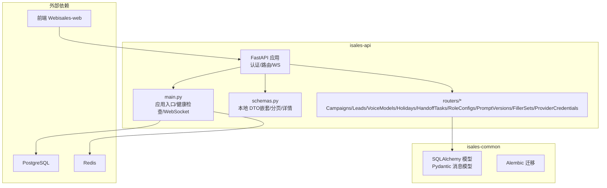
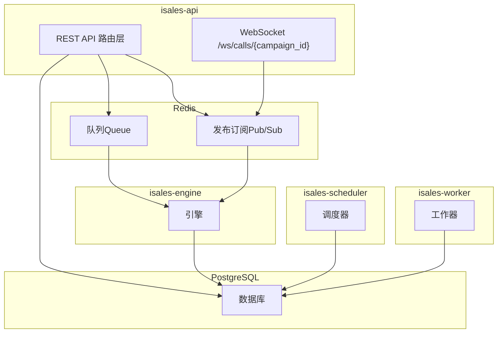
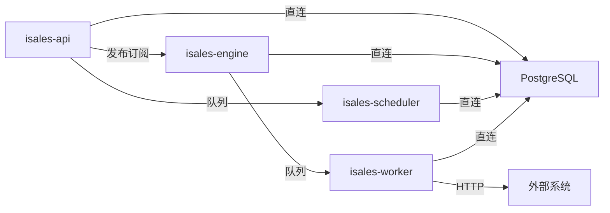

# API 接口设计

<cite>
**本文引用的文件**
- [README.md](file://README.md)
- [DESIGN.md](file://DESIGN.md)
- [service-communication/spec.md](file://openspec/specs/service-communication/spec.md)
- [data-model/spec.md](file://openspec/specs/data-model/spec.md)
- [message-contract/spec.md](file://openspec/specs/message-contract/spec.md)
- [2026-05-06-impl-api/tasks.md](file://openspec/changes/archive/2026-05-06-impl-api/tasks.md)
- [2026-05-23-web-admin-campaign-workflow/tasks.md](file://openspec/changes/archive/2026-05-23-web-admin-campaign-workflow/tasks.md)
- [2026-05-24-provider-credential-db-ssot/acceptance.md](file://openspec/changes/archive/2026-05-24-impl-provider-credential-db-ssot/acceptance.md)
</cite>

## 目录
1. [简介](#简介)
2. [项目结构](#项目结构)
3. [核心组件](#核心组件)
4. [架构总览](#架构总览)
5. [详细组件分析](#详细组件分析)
6. [依赖分析](#依赖分析)
7. [性能考虑](#性能考虑)
8. [故障排查指南](#故障排查指南)
9. [结论](#结论)
10. [附录](#附录)

## 简介
本文件面向 isales-api 的 RESTful API 接口设计，基于 FastAPI 构建，聚焦管理后台常用能力：Campaign 管理、Lead 管理、Call 记录查询、Provider 配置等。文档系统性阐述 HTTP 方法使用规范、URL 路径设计原则、请求/响应数据模型、API 版本管理策略、错误码与状态码使用规范，并提供认证头部设置、请求参数格式、响应数据结构的调用示例说明。同时，结合 OpenSpec 规范，明确参数验证机制、数据类型约束与必填字段标识，以及与引擎、调度器、工作器等服务的通信边界。

## 项目结构
- isales-api 是基于 FastAPI 的 HTTP 后台服务，负责管理 Campaign、Lead、Voice Model、Holiday、Handoff Task、Provider Credential 等资源的 CRUD，提供认证登录、WebSocket 实时事件订阅、以及与引擎/调度器的队列/发布订阅交互。
- 项目采用 OpenSpec 规划与演进，API 的数据模型、消息契约、服务通信通道均由 isales-common 统一管理，确保跨服务一致性与可追溯性。

**章节来源**
- [README.md:1-14](file://README.md#L1-L14)
- [DESIGN.md:45-56](file://DESIGN.md#L45-L56)

## 核心组件
- 认证与授权
  - 登录签发 JWT，用户信息查询，依赖 isales-common 的 JWT 校验与 OAuth2PasswordBearer。
- 资源路由
  - Campaigns：支持嵌套写入（子资源跟随更新），设备绑定/解绑，进度聚合查询。
  - Leads：CRUD、CSV 批量导入、分页与过滤。
  - Voice Models：CRUD、试听重定向。
  - Holidays：本地节假日 CRUD。
  - Handoff Tasks：列表/详情查询，生命周期阶段说明。
  - Role Configs / Prompt Versions / Filler Sets：角色配置、提示词版本、垫词集合与短语的 CRUD 与嵌套管理。
  - Provider Credentials：凭据的白名单校验、DB 存储（Fernet 对称加密）、重载提示。
- WebSocket 实时事件
  - /ws/calls/{campaign_id} 订阅引擎事件，JWT 鉴权，按 EngineEvent 裁判/分发。

**章节来源**
- [2026-05-06-impl-api/tasks.md:15-21](file://openspec/changes/archive/2026-05-06-impl-api/tasks.md#L15-L21)
- [2026-05-23-web-admin-campaign-workflow/tasks.md:9-22](file://openspec/changes/archive/2026-05-23-web-admin-campaign-workflow/tasks.md#L9-L22)
- [2026-05-24-provider-credential-db-ssot/acceptance.md:58-71](file://openspec/changes/archive/2026-05-24-impl-provider-credential-db-ssot/acceptance.md#L58-L71)

## 架构总览
isales-api 通过 Redis 队列与发布订阅与引擎、调度器、工作器进行交互，数据库统一使用 PostgreSQL。WebSocket 作为前端与引擎事件的桥接通道，实现“实时、可丢失”的事件广播。

**图示来源**
- [service-communication/spec.md:11-24](file://openspec/specs/service-communication/spec.md#L11-L24)
- [service-communication/spec.md:106-135](file://openspec/specs/service-communication/spec.md#L106-L135)

**章节来源**
- [service-communication/spec.md:31-47](file://openspec/specs/service-communication/spec.md#L31-L47)
- [service-communication/spec.md:64-76](file://openspec/specs/service-communication/spec.md#L64-L76)
- [service-communication/spec.md:78-85](file://openspec/specs/service-communication/spec.md#L78-L85)

## 详细组件分析

### 认证与授权（JWT）
- 登录接口：POST /auth/login（OAuth2PasswordRequestForm）
- 当前用户：GET /auth/me
- 依赖项：
  - JWT 签发与校验（HS256，密钥来自环境变量）
  - OAuth2PasswordBearer 令牌校验
  - 401 未认证与 WWW-Authenticate 头
- 示例
  - 请求头：Authorization: Bearer <JWT>
  - 成功响应：包含用户信息
  - 失败响应：401 未认证、422 参数校验失败

**章节来源**
- [2026-05-06-impl-api/tasks.md:15-21](file://openspec/changes/archive/2026-05-06-impl-api/tasks.md#L15-L21)

### Campaigns 管理
- 路径设计
  - GET /campaigns（分页）
  - GET /campaigns/{id}
  - POST /campaigns
  - PATCH /campaigns/{id}
  - DELETE /campaigns/{id}
  - GET /campaigns/{id}/progress
  - POST /campaigns/{id}/start
  - POST /campaigns/{id}/pause
  - POST/GET/DELETE /campaigns/{id}/devices（绑定/解绑设备）
- 嵌套写入
  - Campaign 创建/更新时，子资源（如 Filler Set/Phrase、Role Config、Prompt Version）跟随更新，采用单事务 upsert，删除子表通过 ON DELETE CASCADE 清理。
- 参数验证与数据模型
  - 本地 DTO：Page、NestedWrite、CampaignDetailRead 等
  - 字段类型与必填标识以 isales-common 的 Pydantic 模型为准
- 示例
  - 认证头：Authorization: Bearer <JWT>
  - 响应：200/201/204，404/422/500

**章节来源**
- [2026-05-06-impl-api/tasks.md:23-30](file://openspec/changes/archive/2026-05-06-impl-api/tasks.md#L23-L30)
- [2026-05-23-web-admin-campaign-workflow/tasks.md:9-22](file://openspec/changes/archive/2026-05-23-web-admin-campaign-workflow/tasks.md#L9-L22)
- [data-model/spec.md:28-50](file://openspec/specs/data-model/spec.md#L28-L50)

### Leads 管理与批量导入
- 路径设计
  - GET /leads（分页，支持 status、campaign_id 过滤）
  - GET /leads/{id}
  - POST /leads
  - PATCH /leads/{id}
  - DELETE /leads/{id}
  - POST /leads/import（multipart CSV）
- 导入行为
  - 1000 行批 flush，返回部分成功（200 + 结果对象）
  - 缺少必要列/格式错误返回 400
- 参数验证
  - 字段类型与必填标识遵循 isales-common 模型
- 示例
  - Content-Type: multipart/form-data
  - 响应：200 部分成功，包含成功/失败计数与错误明细

**章节来源**
- [2026-05-06-impl-api/tasks.md:32-39](file://openspec/changes/archive/2026-05-06-impl-api/tasks.md#L32-L39)

### Voice Models 管理
- 路径设计
  - GET /voice-models
  - GET /voice-models/{id}
  - POST /voice-models
  - PATCH /voice-models/{id}
  - DELETE /voice-models/{id}
  - GET /voice-models/{id}/sample（307 重定向到 sample_url）
- 参数验证
  - 字段类型与必填标识遵循 isales-common 模型
- 示例
  - 响应：200/201/204，404/422/500

**章节来源**
- [2026-05-06-impl-api/tasks.md:32-39](file://openspec/changes/archive/2026-05-06-impl-api/tasks.md#L32-L39)
- [data-model/spec.md:40-41](file://openspec/specs/data-model/spec.md#L40-L41)

### Holidays 管理
- 路径设计
  - GET /holidays（分页）
  - GET /holidays/{id}
  - POST /holidays
  - PATCH /holidays/{id}
  - DELETE /holidays/{id}
- 参数验证
  - 字段类型与必填标识遵循 isales-common 模型
- 示例
  - 响应：200/201/204，404/422/500

**章节来源**
- [2026-05-06-impl-api/tasks.md:32-39](file://openspec/changes/archive/2026-05-06-impl-api/tasks.md#L32-L39)
- [data-model/spec.md:31](file://openspec/specs/data-model/spec.md#L31)

### Handoff Tasks 查询
- 路径设计
  - GET /handoff-tasks（支持 status 过滤）
  - GET /handoff-tasks/{id}
- 生命周期说明
  - 阶段 2 仅提供查询；状态流转在阶段 3 由工作器实现
- 示例
  - 响应：200/404/422

**章节来源**
- [2026-05-06-impl-api/tasks.md:32-39](file://openspec/changes/archive/2026-05-06-impl-api/tasks.md#L32-L39)

### Role Configs / Prompt Versions / Filler Sets
- 路径设计
  - Role Configs：GET /role-configs（按 campaign_id + kind 过滤）/ POST / GET / PATCH / DELETE
  - Prompt Versions：CRUD（按 scope_type + scope_id 过滤），支持设 is_active（同作用域其余置 false）
  - Filler Sets：CRUD（按 campaign_id 过滤），嵌套 /filler-sets/{id}/phrases
- 参数验证
  - 字段类型与必填标识遵循 isales-common 模型
- 示例
  - 响应：200/201/204，404/422/500

**章节来源**
- [2026-05-23-web-admin-campaign-workflow/tasks.md:9-22](file://openspec/changes/archive/2026-05-23-web-admin-campaign-workflow/tasks.md#L9-L22)
- [data-model/spec.md:34-44](file://openspec/specs/data-model/spec.md#L34-L44)

### Provider Credentials 配置
- 路径设计
  - GET /provider-credentials（列表，masked）
  - GET /provider-credentials/{provider_id}
  - POST /provider-credentials（upsert，INSERT...ON CONFLICT DO UPDATE）
  - DELETE /provider-credentials/{id}
  - POST /provider-credentials/reload-hint
- 白名单与安全
  - ALLOWED_PROVIDER_IDS：{volcengine, openai, dashscope, mock}
  - ALLOWED_FIELD_NAMES：{api_key, app_key, app_token, endpoint, asr_endpoint, tts_endpoint, default_model, enabled}
  - DB 存储采用 Fernet 对称加密，返回值 masked
- 示例
  - 响应：200/201/204，404/422/500

**章节来源**
- [2026-05-24-provider-credential-db-ssot/acceptance.md:58-71](file://openspec/changes/archive/2026-05-24-impl-provider-credential-db-ssot/acceptance.md#L58-L71)

### WebSocket 实时事件订阅
- 路径设计
  - GET /ws/calls/{campaign_id}?token=<JWT>
- 行为规范
  - 服务端订阅 Redis Pub/Sub channel：engine:events:campaign:{id}
  - 直接转发 EngineEvent JSON（不重新包装）
  - 鉴权：JWT 校验失败立即关闭连接（close code 4401）
  - 多客户端：共享一个 Redis 订阅，避免连接膨胀
- 前端契约
  - 使用 TypeScript discriminated union（type 字段）解析消息
  - 遇到未知 type 仅 console.warn 并跳过，不中断连接
- 示例
  - 连接：ws://host/ws/calls/{campaign_id}?token=<JWT>
  - 断开：close code 4401（未鉴权）

**章节来源**
- [service-communication/spec.md:106-146](file://openspec/specs/service-communication/spec.md#L106-L146)

## 依赖分析
- 数据模型与迁移
  - 所有 SQLAlchemy 模型与 Alembic 迁移由 isales-common 管理，其他服务通过依赖间接访问。
- 消息契约
  - Redis 队列/发布订阅的消息体统一由 isales-common 的 Pydantic 模型定义，生产者/消费者引用同一模型类。
- 服务间通信
  - API 与引擎：Redis Pub/Sub（实时事件）
  - API 与调度器：Redis Queue（启动/暂停 Campaign）
  - API 与工作器：Redis Queue（通话结束处理）
  - 外部回调：HTTP（Webhook）

**图示来源**
- [service-communication/spec.md:11-24](file://openspec/specs/service-communication/spec.md#L11-L24)
- [data-model/spec.md:5-17](file://openspec/specs/data-model/spec.md#L5-L17)

**章节来源**
- [data-model/spec.md:5-17](file://openspec/specs/data-model/spec.md#L5-L17)
- [message-contract/spec.md:6-27](file://openspec/specs/message-contract/spec.md#L6-L27)

## 性能考虑
- 队列与发布订阅边界
  - 队列用于“必须送达，可异步处理”的工作派发；发布订阅用于“实时、可丢失”的事件广播。
- 并发控制
  - 跨引擎实例的全局并发使用 Redis 原子计数器（INCR/DECR），避免计数器泄漏。
- HTTP 调用限制
  - 服务间同步 HTTP 调用仅限必要场景（v1 仅调度器 → telephony-api），其他通信走 Redis 队列或发布订阅。
- WebSocket 连接
  - 单实例部署，共享 Redis 订阅，减少连接膨胀。

**章节来源**
- [service-communication/spec.md:31-47](file://openspec/specs/service-communication/spec.md#L31-L47)
- [service-communication/spec.md:45-63](file://openspec/specs/service-communication/spec.md#L45-L63)
- [service-communication/spec.md:64-76](file://openspec/specs/service-communication/spec.md#L64-L76)
- [service-communication/spec.md:127-131](file://openspec/specs/service-communication/spec.md#L127-L131)

## 故障排查指南
- 认证失败
  - 现象：401 未认证，WWW-Authenticate 头提示未提供或无效令牌
  - 处理：检查 Authorization: Bearer <JWT> 是否正确，确认密钥与过期时间
- 参数校验失败
  - 现象：422 参数校验错误
  - 处理：对照 isales-common 模型字段类型、必填标识与白名单（Provider Credentials）
- WebSocket 未鉴权
  - 现象：连接被关闭，close code 4401
  - 处理：确认 token 参数与 JWT 校验通过
- 事件未到达
  - 现象：前端未收到实时事件
  - 处理：确认 Redis Pub/Sub 订阅正常，campaign_id 正确，消息体符合 EngineEvent schema

**章节来源**
- [2026-05-06-impl-api/tasks.md:15-21](file://openspec/changes/archive/2026-05-06-impl-api/tasks.md#L15-L21)
- [service-communication/spec.md:112-125](file://openspec/specs/service-communication/spec.md#L112-L125)
- [message-contract/spec.md:34-37](file://openspec/specs/message-contract/spec.md#L34-L37)

## 结论
isales-api 基于 FastAPI 提供了完整的管理后台接口体系，围绕 Campaign、Lead、Voice Model、Holiday、Handoff Task、Role/Prompt/Filler、Provider Credential 等资源实现 CRUD 与嵌套写入，配合 JWT 认证、WebSocket 实时事件与严格的 OpenSpec 服务通信边界，确保了系统的可维护性与可扩展性。建议在后续版本中继续完善权限模型、回执机制与复杂分析报表，以满足更丰富的运营场景。

## 附录

### API 调用示例（路径与要点）
- 认证
  - POST /auth/login（OAuth2PasswordRequestForm）
  - GET /auth/me（携带 Authorization: Bearer <JWT>）
- Campaigns
  - GET /campaigns
  - GET /campaigns/{id}
  - POST /campaigns
  - PATCH /campaigns/{id}
  - DELETE /campaigns/{id}
  - GET /campaigns/{id}/progress
  - POST /campaigns/{id}/start
  - POST /campaigns/{id}/pause
  - POST/GET/DELETE /campaigns/{id}/devices
- Leads
  - GET /leads
  - GET /leads/{id}
  - POST /leads
  - PATCH /leads/{id}
  - DELETE /leads/{id}
  - POST /leads/import（multipart/csv）
- Voice Models
  - GET /voice-models
  - GET /voice-models/{id}
  - POST /voice-models
  - PATCH /voice-models/{id}
  - DELETE /voice-models/{id}
  - GET /voice-models/{id}/sample
- Holidays
  - GET /holidays
  - GET /holidays/{id}
  - POST /holidays
  - PATCH /holidays/{id}
  - DELETE /holidays/{id}
- Handoff Tasks
  - GET /handoff-tasks
  - GET /handoff-tasks/{id}
- Role Configs / Prompt Versions / Filler Sets
  - Role Configs：GET /role-configs、POST /、GET /{id}、PATCH /{id}、DELETE /{id}
  - Prompt Versions：CRUD（按 scope 过滤）
  - Filler Sets：CRUD（按 campaign_id 过滤），嵌套 /filler-sets/{id}/phrases
- Provider Credentials
  - GET /provider-credentials
  - GET /provider-credentials/{provider_id}
  - POST /provider-credentials
  - DELETE /provider-credentials/{id}
  - POST /provider-credentials/reload-hint
- WebSocket
  - GET /ws/calls/{campaign_id}?token=<JWT>

**章节来源**
- [2026-05-06-impl-api/tasks.md:23-39](file://openspec/changes/archive/2026-05-06-impl-api/tasks.md#L23-L39)
- [2026-05-23-web-admin-campaign-workflow/tasks.md:9-22](file://openspec/changes/archive/2026-05-23-web-admin-campaign-workflow/tasks.md#L9-L22)
- [2026-05-24-provider-credential-db-ssot/acceptance.md:58-71](file://openspec/changes/archive/2026-05-24-impl-provider-credential-db-ssot/acceptance.md#L58-L71)