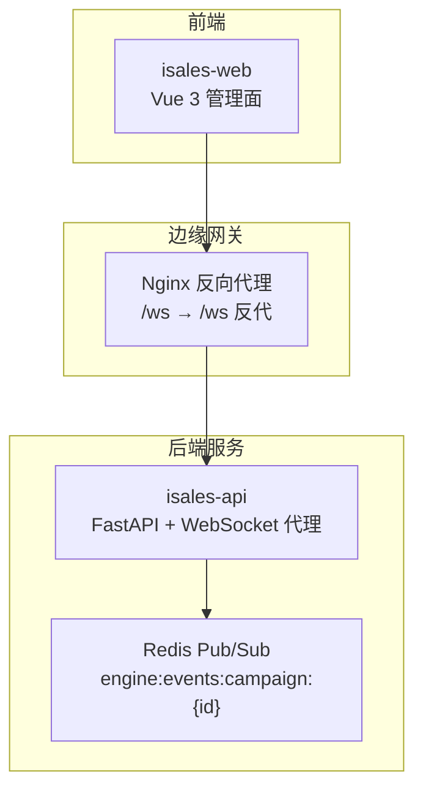
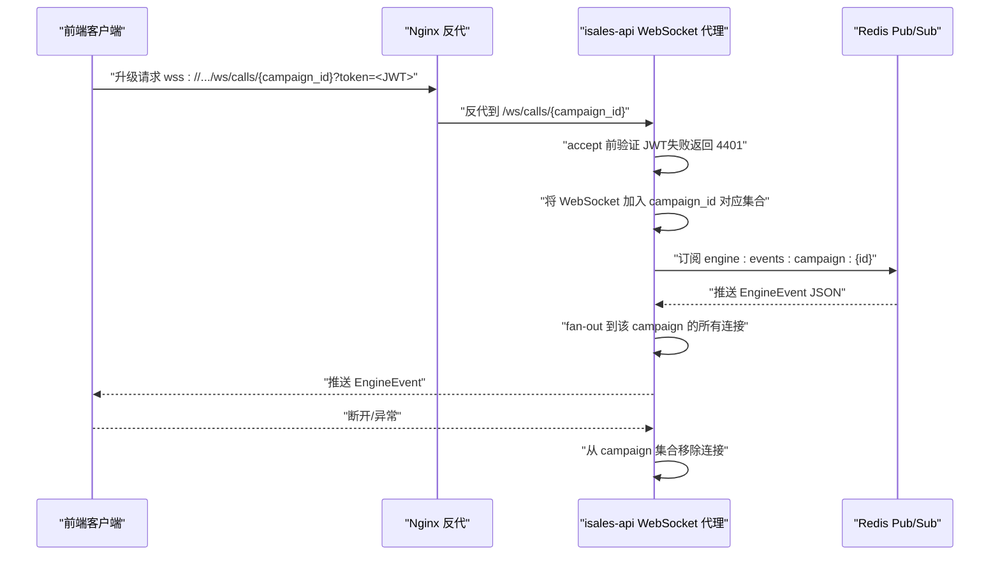
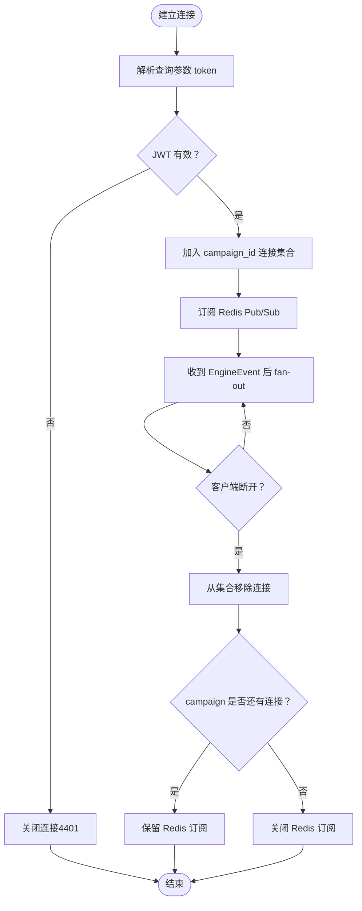
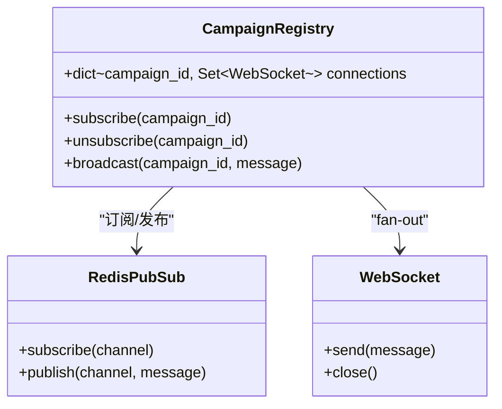
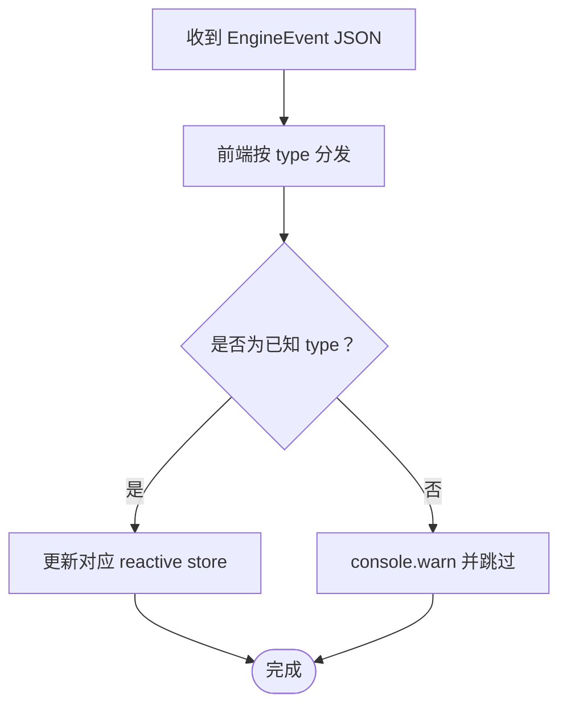
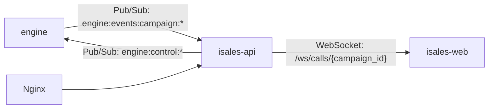

# WebSocket 代理服务

<cite>
**本文引用的文件**
- [README.md](file://README.md)
- [service-communication 规格说明（归档）](file://openspec/changes/archive/2026-05-06-impl-api/specs/service-communication/spec.md)
- [API 实施设计（归档）](file://openspec/changes/archive/2026-05-06-impl-api/design.md)
- [服务通信规格说明（云-边拆分）](file://openspec/changes/arch-cloud-edge-split/specs/service-communication/spec.md)
- [部署说明](file://deploy/README.md)
- [Nginx 反向代理配置](file://deploy/cloud/nginx/isales.conf)
- [运行手册（云）](file://deploy/RUNBOOK-cloud.md)
- [运行手册](file://deploy/RUNBOOK.md)
</cite>

## 目录
1. [简介](#简介)
2. [项目结构](#项目结构)
3. [核心组件](#核心组件)
4. [架构总览](#架构总览)
5. [详细组件分析](#详细组件分析)
6. [依赖关系分析](#依赖关系分析)
7. [性能考虑](#性能考虑)
8. [故障排查指南](#故障排查指南)
9. [结论](#结论)
10. [附录](#附录)

## 简介
本文件面向 isales-api 的 WebSocket 代理服务，围绕基于 FastAPI 的实时通信机制展开，系统性阐述连接建立流程、消息传递协议、心跳保活机制、连接池管理与消息路由策略，并提供使用示例、安全与异常处理要点，以及与前端实时监控、用户状态同步、系统通知等场景的对接方式。文档内容完全依据仓库内的 OpenSpec 规格与设计说明整理，确保技术实现与规范一致。

## 项目结构
- WebSocket 代理位于 isales-api 服务中，提供 `/ws/calls/{campaign_id}` WebSocket 端点，订阅 Redis Pub/Sub 通道并将事件 fan-out 推送给所有订阅该 campaign 的客户端。
- 前端通过 isales-web 订阅该 WebSocket，使用 EngineEvent 联合类型按 type 字段分发到 reactive store。
- 部署层通过 Nginx 将 /ws 请求反代到 isales-api，保持 Upgrade: websocket 头并设置较长的 proxy_read_timeout，以适配监控类长连接。

**图表来源**
- [服务通信规格说明（云-边拆分）:215-239](file://openspec/changes/arch-cloud-edge-split/specs/service-communication/spec.md#L215-L239)
- [Nginx 反向代理配置](file://deploy/cloud/nginx/isales.conf)

**章节来源**
- [README.md:7-13](file://README.md#L7-L13)
- [服务通信规格说明（云-边拆分）:215-239](file://openspec/changes/arch-cloud-edge-split/specs/service-communication/spec.md#L215-L239)
- [部署说明:17-21](file://deploy/README.md#L17-L21)

## 核心组件
- WebSocket 端点与路由
  - 路径：/ws/calls/{campaign_id}
  - 功能：订阅 Redis Pub/Sub 通道 engine:events:campaign:{id}，fan-out EngineEvent 给所有连接该 campaign 的客户端
- 鉴权与安全
  - 查询参数传 JWT：?token=<JWT>
  - 鉴权失败立即关闭连接并返回 close code 4401
- 连接管理与路由
  - 每 campaign_id 维护 Set[WebSocket]
  - 后台 asyncio task 订阅 Redis Pub/Sub，收到消息后 fan-out 给该 set 的所有连接
  - 多客户端订阅同一 campaign 时共享一个 Redis 订阅，避免 Redis 连接膨胀
- 消息协议
  - 直接传递 EngineEvent JSON（不重新包装），前端按 message-contract 规范解析
- 多实例限制
  - v1 单实例运行，多实例扩展（v2）需经 OpenSpec 变更提案

**章节来源**
- [服务通信规格说明（归档）:1-31](file://openspec/changes/archive/2026-05-06-impl-api/specs/service-communication/spec.md#L1-L31)
- [API 实施设计（归档）:41-53](file://openspec/changes/archive/2026-05-06-impl-api/design.md#L41-L53)
- [服务通信规格说明（云-边拆分）:215-239](file://openspec/changes/arch-cloud-edge-split/specs/service-communication/spec.md#L215-L239)

## 架构总览
WebSocket 代理采用“进程内字典 + asyncio 队列”的轻量连接管理方案：每个 campaign_id 对应一组 WebSocket 连接，后台任务统一订阅 Redis Pub/Sub 并将消息 fan-out 到该组连接。该设计满足 v1 单实例部署需求，避免每个 WS 连接独立订阅 Redis 导致的连接膨胀。

**图表来源**
- [API 实施设计（归档）:41-53](file://openspec/changes/archive/2026-05-06-impl-api/design.md#L41-L53)
- [服务通信规格说明（云-边拆分）:215-239](file://openspec/changes/arch-cloud-edge-split/specs/service-communication/spec.md#L215-L239)

## 详细组件分析

### 连接建立与鉴权流程
- 客户端连接路径：wss://.../ws/calls/{campaign_id}?token=<JWT>
- 鉴权策略：accept 前验证 JWT，失败立即关闭并返回 close code 4401
- 连接生命周期：加入 campaign 集合；断开后从集合移除；当 campaign 无连接时可保留或关闭 Redis 订阅（实现策略由实现决定）

**图表来源**
- [API 实施设计（归档）:41-53](file://openspec/changes/archive/2026-05-06-impl-api/design.md#L41-L53)
- [服务通信规格说明（云-边拆分）:215-239](file://openspec/changes/arch-cloud-edge-split/specs/service-communication/spec.md#L215-L239)

**章节来源**
- [API 实施设计（归档）:41-53](file://openspec/changes/archive/2026-05-06-impl-api/design.md#L41-L53)
- [服务通信规格说明（云-边拆分）:215-239](file://openspec/changes/arch-cloud-edge-split/specs/service-communication/spec.md#L215-L239)

### 消息路由与 fan-out 策略
- 每个 campaign_id 维护一个 WebSocket 集合
- 后台任务统一订阅 Redis Pub/Sub，收到消息后 fan-out 到该集合的所有连接
- 多客户端订阅同一 campaign 时共享一个 Redis 订阅，避免连接膨胀

**图表来源**
- [API 实施设计（归档）:47-53](file://openspec/changes/archive/2026-05-06-impl-api/design.md#L47-L53)

**章节来源**
- [API 实施设计（归档）:47-53](file://openspec/changes/archive/2026-05-06-impl-api/design.md#L47-L53)

### 消息协议与前端解析契约
- 服务端直接传递 EngineEvent JSON（不重新包装）
- 前端使用 TypeScript discriminated union（type 字段）解析，未知 type 仅警告跳过，不中断连接
- 新事件类型必须通过 OpenSpec change 同步到 isales-common 的 EngineEvent 联合类型后，前端再处理

**图表来源**
- [服务通信规格说明（云-边拆分）:236-249](file://openspec/changes/arch-cloud-edge-split/specs/service-communication/spec.md#L236-L249)

**章节来源**
- [服务通信规格说明（云-边拆分）:236-249](file://openspec/changes/arch-cloud-edge-split/specs/service-communication/spec.md#L236-L249)

### 心跳保活机制
- 云-边 gRPC 控制面具备心跳保活与断线重连机制（与 WebSocket 代理不同通道），用于边缘设备健康度监测与重连缓冲
- WebSocket 代理未在 OpenSpec 中定义专用心跳协议；建议前端在应用层维持 ping/pong 以检测连接健康

**章节来源**
- [服务通信规格说明（云-边拆分）:152-160](file://openspec/changes/arch-cloud-edge-split/specs/service-communication/spec.md#L152-L160)

### 连接池管理与资源控制
- 进程内字典维护 campaign_id → Set[WebSocket]
- 后台 asyncio task 订阅 Redis Pub/Sub，使用队列解耦订阅者与转发者，避免断线阻塞 Redis subscribe
- v1 单实例限制，多实例扩展（v2）需经 OpenSpec 变更提案

**章节来源**
- [API 实施设计（归档）:47-53](file://openspec/changes/archive/2026-05-06-impl-api/design.md#L47-L53)
- [服务通信规格说明（云-边拆分）:231-234](file://openspec/changes/arch-cloud-edge-split/specs/service-communication/spec.md#L231-L234)

## 依赖关系分析
- 通信通道矩阵
  - engine → api：Redis Pub/Sub（实时事件广播）
  - api → engine：Redis Pub/Sub（实时控制）
  - api ↔ 前端：WebSocket 代理（前端订阅 engine 事件）
- 部署依赖
  - Nginx 将 /ws 反代到 isales-api，保持 Upgrade/Connection 头，设置较长的 proxy_read_timeout
- 多实例限制
  - v1 单实例运行，多实例扩展（v2）需经 OpenSpec 变更提案

**图表来源**
- [服务通信规格说明（云-边拆分）:7-21](file://openspec/changes/arch-cloud-edge-split/specs/service-communication/spec.md#L7-L21)
- [Nginx 反向代理配置](file://deploy/cloud/nginx/isales.conf)

**章节来源**
- [服务通信规格说明（云-边拆分）:7-21](file://openspec/changes/arch-cloud-edge-split/specs/service-communication/spec.md#L7-L21)
- [Nginx 反向代理配置](file://deploy/cloud/nginx/isales.conf)

## 性能考虑
- 连接模型
  - v1 单实例，进程内字典 + asyncio 队列满足监控类长连接需求
  - WebSocket 客户端数量建议控制在几十路以内（仅监控用，非用户连接）
- Redis 订阅
  - 每 campaign 共享一个订阅，避免连接膨胀
- 反代超时
  - Nginx 设置 proxy_read_timeout ≥ 300 秒，避免监控类长连接被默认 60s 杀死
- 多实例扩展
  - v2 可选方案：sticky session 或 Redis Streams + 跨实例转发

**章节来源**
- [API 实施设计（归档）:99-99](file://openspec/changes/archive/2026-05-06-impl-api/design.md#L99-L99)
- [Nginx 反向代理配置](file://deploy/cloud/nginx/isales.conf)

## 故障排查指南
- WebSocket 连接失败（4401）
  - 可能原因：token 无效或过期
  - 处理建议：重新登录获取新 token，确认 token 未过期
- 连接被 Nginx 502
  - 可能原因：isales-api 重启或未就绪
  - 处理建议：检查 isales-api 服务状态，确认 proxy_connect_timeout 设置合理
- 长连接被断开
  - 可能原因：proxy_read_timeout 过短
  - 处理建议：确认 Nginx 配置中 proxy_read_timeout ≥ 300 秒
- 多实例部署问题
  - 可能原因：v1 限制单实例
  - 处理建议：遵循 v1 单实例部署；若需多实例，按 OpenSpec 变更提案设计 v2 方案

**章节来源**
- [运行手册（云）:218-218](file://deploy/RUNBOOK-cloud.md#L218-L218)
- [运行手册:174-174](file://deploy/RUNBOOK.md#L174-L174)
- [Nginx 反向代理配置](file://deploy/cloud/nginx/isales.conf)

## 结论
isales-api 的 WebSocket 代理服务以 OpenSpec 规范为依据，采用“进程内字典 + asyncio 队列”的轻量连接管理与 fan-out 路由策略，满足 v1 单实例部署下的实时监控需求。通过严格的鉴权、消息协议约束与前端解析契约，确保前后端协作稳定可靠。部署层面通过 Nginx 反代与超时配置保障长连接稳定性。未来多实例扩展需遵循 OpenSpec 变更流程，确保架构演进的一致性与安全性。

## 附录

### WebSocket 使用示例（步骤说明）
- 连接建立
  - 使用 wss://.../ws/calls/{campaign_id}?token=<JWT> 建立连接
  - 鉴权失败将返回 close code 4401
- 消息发送与接收
  - 服务端直接推送 EngineEvent JSON，前端按 type 字段分发到 reactive store
  - 未知 type 仅警告跳过，不中断连接
- 断线重连
  - 前端在应用层维持 ping/pong 以检测连接健康
  - 服务端在客户端断开后从 campaign 集合移除连接；当 campaign 无连接时可保留或关闭 Redis 订阅

**章节来源**
- [服务通信规格说明（云-边拆分）:215-249](file://openspec/changes/arch-cloud-edge-split/specs/service-communication/spec.md#L215-L249)
- [API 实施设计（归档）:41-53](file://openspec/changes/archive/2026-05-06-impl-api/design.md#L41-L53)

### 实时监控、用户状态同步与系统通知
- 实时监控数据推送
  - engine 通过 Redis Pub/Sub 发布 EngineEvent，WebSocket 代理 fan-out 给前端
- 用户状态同步
  - 前端根据 EngineEvent 的 type 字段更新对应 reactive store，实现用户状态同步
- 系统通知
  - 通过 EngineEvent 的新增类型与 OpenSpec 变更流程，后端引入新事件类型后，前端在变更实施时新增对应 handler

**章节来源**
- [服务通信规格说明（云-边拆分）:215-249](file://openspec/changes/arch-cloud-edge-split/specs/service-communication/spec.md#L215-L249)