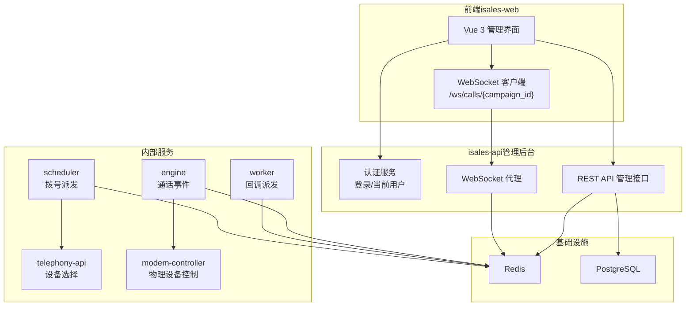
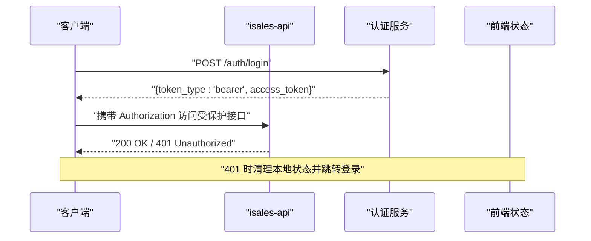
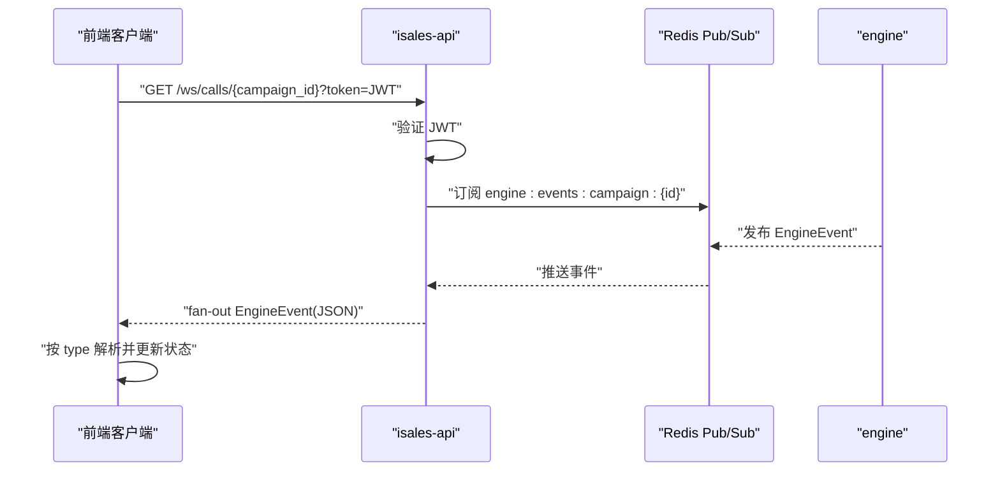
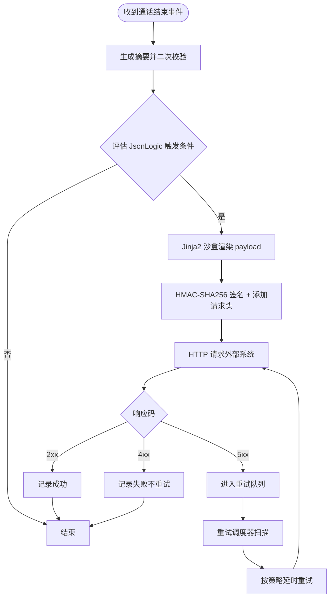
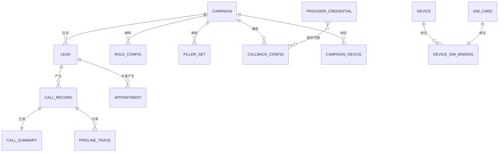

# isales-api 管理后台

<cite>
**本文引用的文件**
- [README.md](file://README.md)
- [DESIGN.md](file://DESIGN.md)
- [service-communication/spec.md](file://openspec/specs/service-communication/spec.md)
- [webhook-callback/spec.md](file://openspec/specs/webhook-callback/spec.md)
- [data-model/spec.md](file://openspec/specs/data-model/spec.md)
</cite>

## 目录
1. [简介](#简介)
2. [项目结构](#项目结构)
3. [核心组件](#核心组件)
4. [架构总览](#架构总览)
5. [详细组件分析](#详细组件分析)
6. [依赖分析](#依赖分析)
7. [性能考虑](#性能考虑)
8. [故障排查指南](#故障排查指南)
9. [结论](#结论)
10. [附录](#附录)

## 简介
本文件面向 isales-api 管理后台服务的技术文档，围绕基于 FastAPI 的 RESTful API 服务进行系统化说明。重点涵盖：
- 管理后台功能边界与接口设计（HTTP 方法、URL 模式、请求/响应模式）
- 用户认证与授权机制（JWT 签发、校验、路由守卫）
- WebSocket 代理服务（前端订阅通话事件）
- 消息契约与事件流（EngineEvent）
- Webhook 回调机制（触发条件、模板渲染、签名与重试）
- 与其他服务的交互模式（Redis 队列/Pub/Sub、HTTP、数据库直连）
- 错误处理策略与运维实践

## 项目结构
isales-api 作为独立服务，负责管理后台的 HTTP API、认证鉴权、以及将引擎事件通过 WebSocket 代理给前端。其核心职责由 OpenSpec 规范明确，包括服务通信通道、数据模型与 webhook 回调等。

```mermaid
graph TB
subgraph "管理后台服务isales-api"
API["REST API<br/>认证/管理接口"]
WS["WebSocket 代理<br/>/ws/calls/{campaign_id}"]
end
subgraph "内部服务"
ENGINE["通话引擎engine"]
SCHED["调度器scheduler"]
WORKER["后台任务worker"]
TELE["电话 APItelephony-api"]
MOD["调制解调器控制器modem-controller"]
end
subgraph "基础设施"
REDIS["Redis<br/>队列/Pub/Sub"]
PG["PostgreSQL<br/>数据持久化"]
end
API --> REDIS
API <- --> WS
ENGINE --> REDIS
SCHED --> REDIS
WORKER --> REDIS
SCHED --> TELE
ENGINE --> MOD
API --> PG
ENGINE --> PG
SCHED --> PG
WORKER --> PG
```

**图表来源**
- [service-communication/spec.md:11-24](file://openspec/specs/service-communication/spec.md#L11-L24)

**章节来源**
- [README.md:1-86](file://README.md#L1-L86)
- [DESIGN.md:1-75](file://DESIGN.md#L1-L75)

## 核心组件
- 认证与授权
  - JWT 签发与校验（HS256，密钥来自环境变量）
  - 登录接口与“当前用户”依赖注入
  - 前端路由守卫与状态管理配合
- REST API 管理接口
  - 管理后台所需的数据模型 CRUD 与业务操作入口
  - 与数据模型规范对齐的实体与字段
- WebSocket 代理
  - 将引擎事件通过 Redis Pub/Sub 转发至前端
  - 基于 JWT 的连接鉴权与 fan-out 策略
- Webhook 回调
  - 基于 JsonLogic 的触发条件
  - Jinja2 沙盒模板渲染
  - HMAC-SHA256 签名与指数退避重试
- 服务间通信
  - Redis 队列用于“必须送达”的工作派发
  - Redis Pub/Sub 用于“实时、可丢失”的事件广播
  - HTTP 仅用于必要的同步调用（如设备选择）

**章节来源**
- [service-communication/spec.md:106-150](file://openspec/specs/service-communication/spec.md#L106-L150)
- [webhook-callback/spec.md:1-231](file://openspec/specs/webhook-callback/spec.md#L1-L231)
- [data-model/spec.md:19-50](file://openspec/specs/data-model/spec.md#L19-L50)

## 架构总览
下图展示 isales-api 在整体系统中的角色与交互边界，包括认证、事件代理、回调处理与数据持久化。



**图表来源**
- [service-communication/spec.md:11-24](file://openspec/specs/service-communication/spec.md#L11-L24)
- [service-communication/spec.md:106-150](file://openspec/specs/service-communication/spec.md#L106-L150)

## 详细组件分析

### 认证与授权（JWT）
- 登录流程
  - 客户端提交用户名/密码，服务端校验后签发 JWT（HS256）
  - 前端将令牌放入 Authorization 请求头或查询参数
- 当前用户
  - 通过依赖注入获取当前用户上下文，结合 OAuth2 密码模式与 bearer 令牌
- 前端集成
  - Axios 请求拦截器自动附加令牌
  - 401 时统一处理（清理状态、跳转登录页）
  - 路由守卫未登录跳转登录，已登录访问登录页跳转仪表盘



**图表来源**
- [service-communication/spec.md:106-150](file://openspec/specs/service-communication/spec.md#L106-L150)

**章节来源**
- [service-communication/spec.md:106-150](file://openspec/specs/service-communication/spec.md#L106-L150)

### REST API 管理接口
- 设计原则
  - 与数据模型规范对齐，遵循统一的实体与字段定义
  - 服务间通信优先采用 Redis 队列/Pub/Sub，必要时使用 HTTP
- 接口范围（示例）
  - 认证相关：登录、获取当前用户
  - 管理相关：Campaign、Lead、Call、Appointment、Callback 配置与日志等
- 请求/响应模式
  - 统一使用 JSON
  - 错误响应包含明确的状态码与错误信息
- 与数据库交互
  - 通过 isales-common 模型直连 PostgreSQL，遵循“归属服务主导演进”的约定

**章节来源**
- [data-model/spec.md:19-50](file://openspec/specs/data-model/spec.md#L19-L50)
- [service-communication/spec.md:64-86](file://openspec/specs/service-communication/spec.md#L64-L86)

### WebSocket 代理服务
- 功能目标
  - 将引擎事件通过 Redis Pub/Sub 转发给前端 WebSocket 客户端
  - 仅向订阅同一 campaign 的客户端 fan-out，避免重复订阅
- 连接与鉴权
  - 客户端连接时携带 JWT 查询参数，服务端在 accept 前验证
  - 验证失败立即关闭连接（4401）
- 消息契约
  - 直接透传 EngineEvent JSON，前端按 discriminated union 解析
  - 新事件类型必须通过 OpenSpec 变更加入联合类型后前端再处理



**图表来源**
- [service-communication/spec.md:106-150](file://openspec/specs/service-communication/spec.md#L106-L150)

**章节来源**
- [service-communication/spec.md:106-150](file://openspec/specs/service-communication/spec.md#L106-L150)

### Webhook 回调机制
- 触发时机
  - 通话结束后由 worker 先生成摘要并二次校验，再评估触发条件
  - 严禁在通话期间实时触发
- 触发条件（JsonLogic）
  - 支持引用 call_summary、lead、call_record 等字段
- 模板渲染（Jinja2 沙盒）
  - 使用 SandboxedEnvironment 渲染 payload，禁用危险能力
- 签名与安全
  - HMAC-SHA256 签名，请求头包含时间戳与签名
  - signing_secret 通过 Fernet 加密存储，创建/轮换时一次性返回明文
- 重试策略
  - 指数退避 + 最大次数；失败时记录状态与下次重试时间
  - 重试调度器周期扫描并复用上次已存的请求体，保证“原触发时刻”事实一致



**图表来源**
- [webhook-callback/spec.md:1-231](file://openspec/specs/webhook-callback/spec.md#L1-L231)

**章节来源**
- [webhook-callback/spec.md:1-231](file://openspec/specs/webhook-callback/spec.md#L1-L231)

### 数据模型与实体
- 表归属与读写权
  - 每张表标注归属服务，写操作由归属服务主导
  - 多服务可读，遵循统一的模型与迁移来源
- 关键实体（摘自规范）
  - Campaign、Holiday、Agent、HandoffTask、RoleConfig、PromptVersion、PipelineTrace、Lead、CallRecord、CallSummary、Appointment、VoiceModel、FillerSet、FillerPhrase、CallbackConfig、CallbackLog、Device、SimCard、DeviceSimBinding、CampaignDevice、ProviderCredential



**图表来源**
- [data-model/spec.md:28-50](file://openspec/specs/data-model/spec.md#L28-L50)

**章节来源**
- [data-model/spec.md:19-50](file://openspec/specs/data-model/spec.md#L19-L50)

## 依赖分析
- 服务间通信
  - 队列：scheduler → engine、engine → worker
  - Pub/Sub：api ↔ engine（实时事件）
  - HTTP：scheduler → telephony-api（设备选择）
  - 外部回调：worker → 外部系统（HTTP）
- 数据持久化
  - 所有服务直连 PostgreSQL，统一迁移来源
- 基础设施
  - Redis 用于队列与 Pub/Sub，支撑高并发与低延迟事件广播

```mermaid
graph LR
SCHED["scheduler"] --> |队列| ENGINE["engine"]
ENGINE --> |队列| WORKER["worker"]
API["api"] < --> |Pub/Sub| ENGINE
SCHED --> |HTTP| TELE["telephony-api"]
WORKER --> |HTTP| EXTERNAL["外部系统"]
API --> PG["PostgreSQL"]
ENGINE --> PG
SCHED --> PG
WORKER --> PG
```

**图表来源**
- [service-communication/spec.md:11-24](file://openspec/specs/service-communication/spec.md#L11-L24)

**章节来源**
- [service-communication/spec.md:64-105](file://openspec/specs/service-communication/spec.md#L64-L105)

## 性能考虑
- 事件广播
  - WebSocket 代理仅对同一 campaign fan-out，避免重复订阅带来的 Redis 连接膨胀
- 并发控制
  - 跨实例全局并发使用 Redis 原子计数器，防止计数器泄漏
- 通信通道选择
  - 队列用于“必须送达”，Pub/Sub 用于“实时可丢失”，降低延迟与资源占用
- 数据库与缓存
  - 统一 PostgreSQL 实例，减少跨库事务与复杂性

**章节来源**
- [service-communication/spec.md:31-63](file://openspec/specs/service-communication/spec.md#L31-L63)
- [service-communication/spec.md:45-63](file://openspec/specs/service-communication/spec.md#L45-L63)

## 故障排查指南
- 认证问题
  - 401 未携带或无效令牌：检查前端拦截器与路由守卫逻辑
  - 令牌过期：重新登录获取新令牌
- WebSocket 连接
  - 4401：确认 token 参数与 JWT 有效
  - 无事件：检查 Redis 订阅与引擎事件发布
- Webhook 回调
  - failed_render：检查 JsonLogic 语法与字段引用
  - failed_http_4xx：外部系统返回 4xx，无需重试
  - exhausted：达到最大重试次数，检查外部系统健康与签名/超时设置
- 数据一致性
  - 确认 callback_log 与 callback_config 的状态流转与重试调度器扫描

**章节来源**
- [webhook-callback/spec.md:100-170](file://openspec/specs/webhook-callback/spec.md#L100-L170)
- [service-communication/spec.md:87-105](file://openspec/specs/service-communication/spec.md#L87-L105)

## 结论
isales-api 通过清晰的服务边界与通信规范，实现了管理后台的认证、数据管理、事件代理与回调派发能力。依托 Redis 队列/Pub/Sub 与 PostgreSQL 的统一数据模型，系统在 v1 单实例部署下具备良好的实时性与可维护性。随着扩展需求，可通过 OpenSpec 变更提案引入多实例扩展与更复杂的容错策略。

## 附录
- OpenSpec 相关规范索引
  - 服务通信通道矩阵与要求
  - Webhook 回调触发、模板、签名与重试
  - 数据模型与表归属
- 运维与部署
  - Linux/macOS 部署脚本与 systemd/launchd 服务管理
  - 环境变量与密钥管理（JWT、Fernet）

**章节来源**
- [DESIGN.md:1-75](file://DESIGN.md#L1-L75)
- [README.md:16-44](file://README.md#L16-L44)