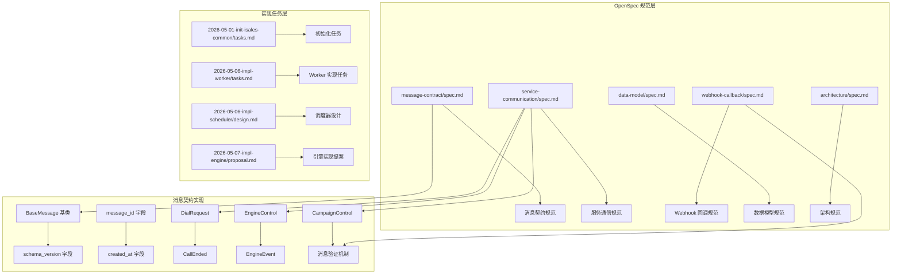
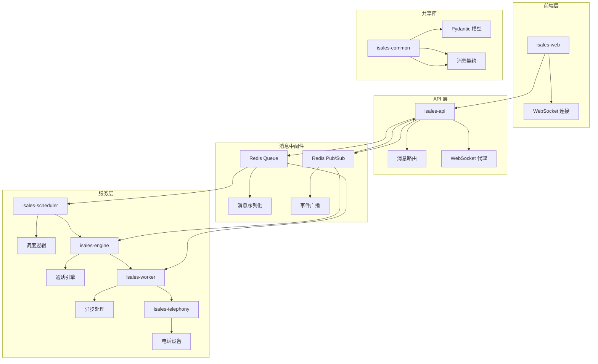
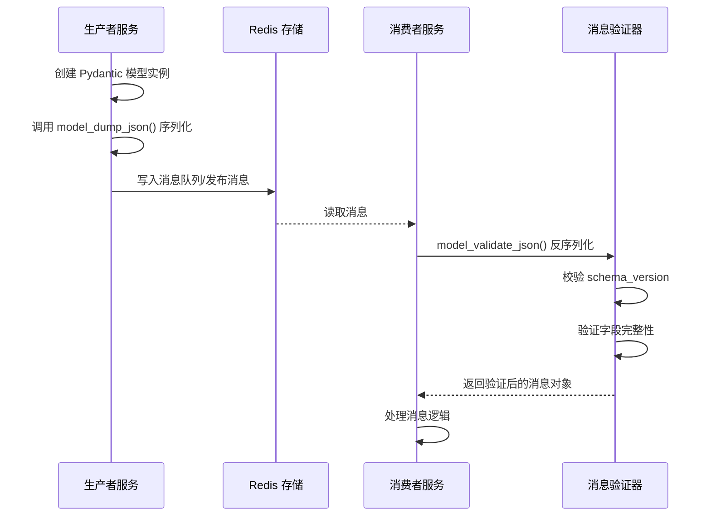
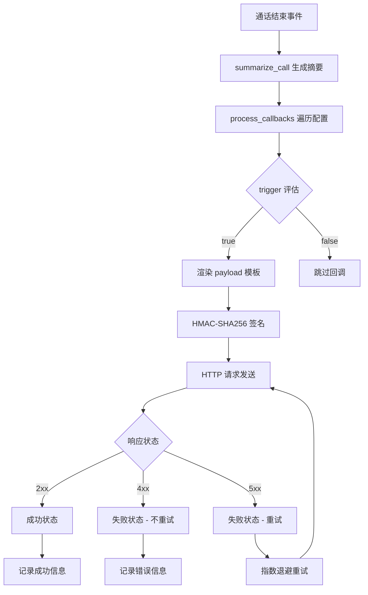
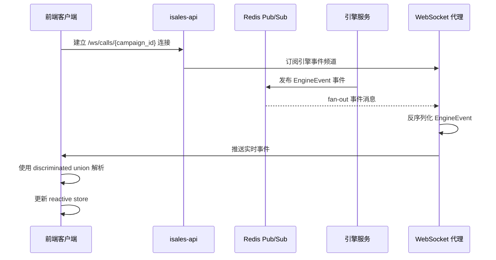
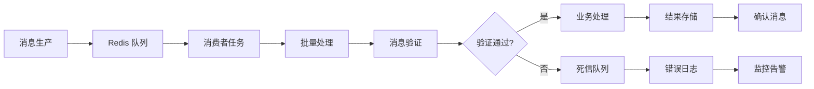
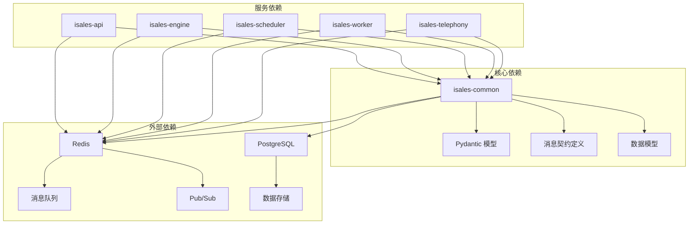

# 消息契约定义

<cite>
**本文档引用的文件**
- [message-contract/spec.md](file://openspec/specs/message-contract/spec.md)
- [service-communication/spec.md](file://openspec/specs/service-communication/spec.md)
- [webhook-callback/spec.md](file://openspec/specs/webhook-callback/spec.md)
- [data-model/spec.md](file://openspec/specs/data-model/spec.md)
- [architecture/spec.md](file://openspec/specs/architecture/spec.md)
- [2026-05-01-init-isales-common/tasks.md](file://openspec/changes/archive/2026-05-01-init-isales-common/tasks.md)
- [2026-05-06-impl-worker/tasks.md](file://openspec/changes/archive/2026-05-06-impl-worker/tasks.md)
- [2026-05-06-impl-scheduler/design.md](file://openspec/changes/archive/2026-05-06-impl-scheduler/design.md)
- [2026-05-07-impl-engine/proposal.md](file://openspec/changes/archive/2026-05-07-impl-engine/proposal.md)
</cite>

## 目录
1. [简介](#简介)
2. [项目结构](#项目结构)
3. [核心组件](#核心组件)
4. [架构概览](#架构概览)
5. [详细组件分析](#详细组件分析)
6. [依赖分析](#依赖分析)
7. [性能考虑](#性能考虑)
8. [故障排除指南](#故障排除指南)
9. [结论](#结论)

## 简介

isales-api 的消息契约定义基于 OpenSpec 规范，建立了一套完整的跨服务通信协议。该规范定义了消息格式标准、字段定义规则、数据类型约束，以及服务间通信的消息协议、事件定义和状态同步机制。

本规范的核心目标是确保所有跨服务的 Redis 消息体（队列消息与 Pub/Sub 事件）都集中在 isales-common 共享库中进行统一定义和管理，通过 Pydantic 模型确保消息的结构化、类型安全和版本兼容性。

## 项目结构

基于 OpenSpec 规范，消息契约相关的项目结构组织如下：

**图表来源**
- [message-contract/spec.md:1-85](file://openspec/specs/message-contract/spec.md#L1-L85)
- [service-communication/spec.md:1-150](file://openspec/specs/service-communication/spec.md#L1-L150)
- [webhook-callback/spec.md:1-231](file://openspec/specs/webhook-callback/spec.md#L1-L231)

**章节来源**
- [message-contract/spec.md:1-85](file://openspec/specs/message-contract/spec.md#L1-L85)
- [service-communication/spec.md:1-150](file://openspec/specs/service-communication/spec.md#L1-L150)

## 核心组件

### 消息基类与版本管理

所有消息类都继承统一的 `BaseMessage` 基类，包含以下核心字段：

- **schema_version**: 整数版本号，默认值为 1，在破坏性升级时递增
- **message_id**: UUID 类型的消息标识符，由生产者生成，便于追踪和去重
- **created_at**: datetime 类型的时间戳，记录消息的生产时间

这些字段确保了消息的可追踪性和版本兼容性管理。

### 消息类型定义

根据 v1 规范，必须包含以下五种核心消息类型：

1. **DialRequest**: 调度器到引擎队列的消息，包含潜在客户信息、历史摘要、prompt_versions 快照和 caller_id
2. **CallEnded**: 引擎到工作者队列的消息，包含 call_record_id 和终止原因
3. **EngineControl**: API 到引擎 Pub/Sub 的消息，包含手动挂断和转人工指令
4. **EngineEvent**: 引擎到 API Pub/Sub 的消息，包含状态变更、ASR 文本和 transcript 增量
5. **CampaignControl**: API 到调度器队列的消息，包含启动和暂停 campaign 指令

**章节来源**
- [message-contract/spec.md:25-52](file://openspec/specs/message-contract/spec.md#L25-L52)
- [2026-05-01-init-isales-common/tasks.md:68-78](file://openspec/changes/archive/2026-05-01-init-isales-common/tasks.md#L68-L78)

## 架构概览

消息契约在整个系统架构中的位置如下：

**图表来源**
- [architecture/spec.md:130-168](file://openspec/specs/architecture/spec.md#L130-L168)
- [service-communication/spec.md:11-25](file://openspec/specs/service-communication/spec.md#L11-L25)

## 详细组件分析

### 消息序列化与反序列化

消息契约定义了严格的消息序列化和反序列化流程：

**图表来源**
- [message-contract/spec.md:10-19](file://openspec/specs/message-contract/spec.md#L10-L19)
- [message-contract/spec.md:76-79](file://openspec/specs/message-contract/spec.md#L76-L79)

### Webhook 回调消息契约

Webhook 回调机制提供了异步触发外部系统的完整解决方案：

**图表来源**
- [webhook-callback/spec.md:5-13](file://openspec/specs/webhook-callback/spec.md#L5-L13)
- [webhook-callback/spec.md:100-133](file://openspec/specs/webhook-callback/spec.md#L100-L133)

### 实时推送消息机制

实时推送通过 WebSocket 实现，提供前端与引擎事件的实时通信：

**图表来源**
- [service-communication/spec.md:106-146](file://openspec/specs/service-communication/spec.md#L106-L146)

### 批处理消息处理

批处理消息通过队列机制实现，支持高吞吐量的消息处理：

**图表来源**
- [2026-05-06-impl-worker/tasks.md:42-49](file://openspec/changes/archive/2026-05-06-impl-worker/tasks.md#L42-L49)

**章节来源**
- [webhook-callback/spec.md:171-231](file://openspec/specs/webhook-callback/spec.md#L171-L231)
- [service-communication/spec.md:106-146](file://openspec/specs/service-communication/spec.md#L106-L146)

## 依赖分析

消息契约的依赖关系体现了系统的模块化设计：

**图表来源**
- [architecture/spec.md:73-86](file://openspec/specs/architecture/spec.md#L73-L86)
- [data-model/spec.md:52-60](file://openspec/specs/data-model/spec.md#L52-L60)

**章节来源**
- [architecture/spec.md:26-44](file://openspec/specs/architecture/spec.md#L26-L44)
- [data-model/spec.md:19-22](file://openspec/specs/data-model/spec.md#L19-L22)

## 性能考虑

消息契约设计充分考虑了性能优化：

### 序列化性能
- 使用 Pydantic 的 `.model_dump_json()` 方法进行高效的 JSON 序列化
- 避免不必要的中间对象创建，减少内存分配
- 批量处理模式下的消息合并优化

### 消息路由优化
- Redis 队列采用 BLPOP/LPUSH 模式，避免轮询开销
- Pub/Sub 事件采用 fan-out 模式，单次订阅多客户端分发
- WebSocket 连接池管理，避免重复订阅

### 缓存策略
- 消息版本信息的内存缓存
- Redis 连接池复用
- 会话状态的本地缓存

## 故障排除指南

### 常见问题及解决方案

#### 消息版本不兼容
**问题**: 消费者无法处理新版本消息
**解决方案**: 
- 检查 `schema_version` 字段是否在支持范围内
- 实现版本迁移逻辑，支持新旧版本并存
- 查看死信队列中的消息处理情况

#### 消息序列化错误
**问题**: 消息反序列化失败
**解决方案**:
- 验证 Pydantic 模型定义的完整性
- 检查字段类型和默认值设置
- 确认 JSON 格式符合预期

#### WebSocket 连接问题
**问题**: 前端无法接收实时事件
**解决方案**:
- 验证 JWT 令牌的有效性
- 检查 Redis Pub/Sub 订阅状态
- 确认消息格式符合 discriminated union 规范

#### Webhook 回调失败
**问题**: 外部系统接收不到回调
**解决方案**:
- 验证 HMAC 签名计算的正确性
- 检查重试策略配置
- 确认超时设置合理

**章节来源**
- [message-contract/spec.md:34-38](file://openspec/specs/message-contract/spec.md#L34-L38)
- [webhook-callback/spec.md:134-137](file://openspec/specs/webhook-callback/spec.md#L134-L137)

## 结论

isales-api 的消息契约定义通过 OpenSpec 规范建立了完整的跨服务通信框架。该框架具有以下特点：

1. **统一性**: 所有消息契约集中在 isales-common 共享库中，确保版本一致性和类型安全
2. **可扩展性**: 支持非破坏性变更和破坏性变更的演进策略
3. **可靠性**: 提供死信队列、重试机制和监控告警
4. **可观测性**: 通过 message_id 实现跨服务追踪
5. **性能优化**: 采用高效的序列化和消息路由机制

这套消息契约规范为 isales 系统的可靠运行提供了坚实的基础，支持从基础拨号功能到复杂 AI 通话引擎的完整业务场景。