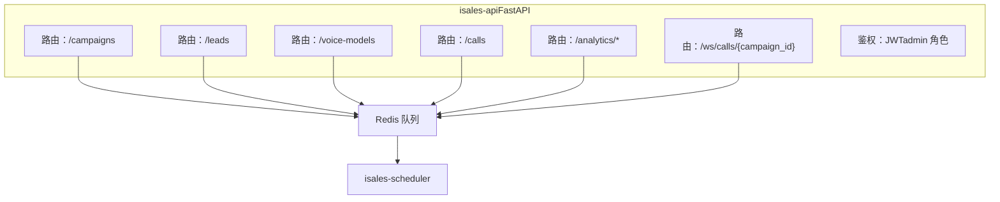
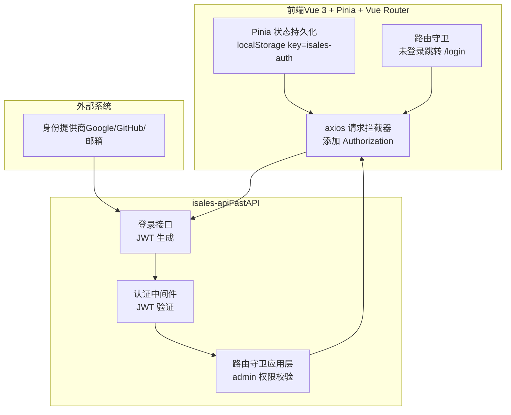
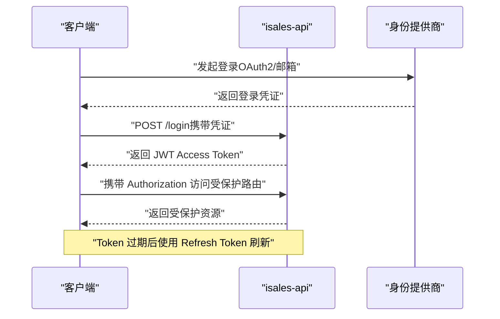
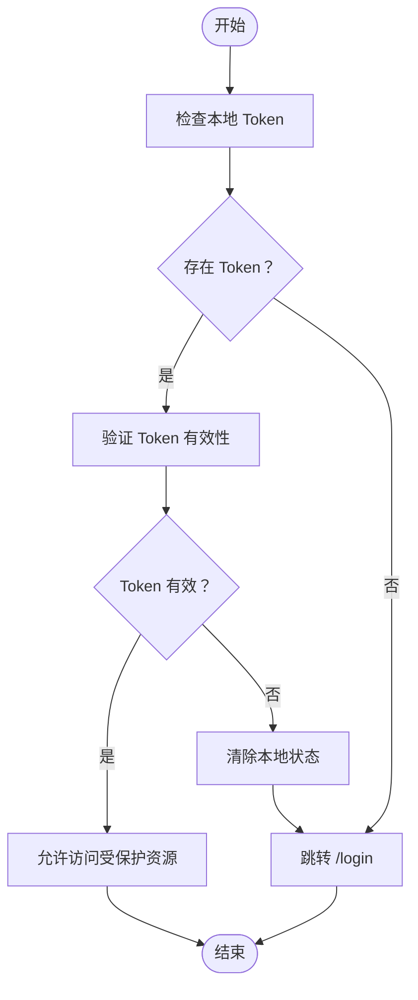
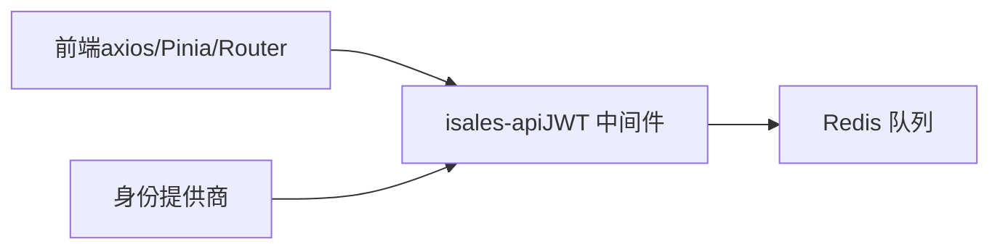

# 用户认证机制

<cite>
**本文引用的文件**
- [IMPLEMENTATION_PLAN.md](file://IMPLEMENTATION_PLAN.md)
- [DESIGN.md](file://DESIGN.md)
- [.claude\skills\openspec-explore\SKILL.md](file://.claude\skills\openspec-explore\SKILL.md)
</cite>

## 目录
1. [简介](#简介)
2. [项目结构](#项目结构)
3. [核心组件](#核心组件)
4. [架构总览](#架构总览)
5. [详细组件分析](#详细组件分析)
6. [依赖分析](#依赖分析)
7. [性能考虑](#性能考虑)
8. [故障排除指南](#故障排除指南)
9. [结论](#结论)
10. [附录](#附录)

## 简介
本文件面向 isales-api 的用户认证机制，基于现有仓库中的设计与实施计划文档进行系统化梳理与说明。根据仓库信息，isales-api 采用基于 FastAPI 的后端架构，并在阶段 2 中明确实现了“JWT（最小可用，先 admin 一种角色）”鉴权能力。本文将围绕以下主题展开：
- JWT Token 的生成、验证与刷新机制
- 用户登录流程、会话管理策略与权限控制模型
- 认证中间件的实现原理与安全策略配置
- Token 过期处理机制
- 管理员账户管理、角色权限分配与多租户认证的现状与演进建议

需要特别说明的是：当前仓库未包含 isales-api 的具体 Python 实现源码，因此本文对认证机制的描述严格基于仓库中已有的设计与实施计划文档；对于未在仓库中体现的功能（如多租户、完整的权限模型等），本文将以“现状与演进建议”的形式进行补充说明。

章节来源
- [IMPLEMENTATION_PLAN.md:95-147](file://IMPLEMENTATION_PLAN.md#L95-L147)
- [DESIGN.md:1-75](file://DESIGN.md#L1-L75)

## 项目结构
isales-api 位于“阶段 2：isales-telephony + isales-api”中，其目标是完成管理后台的 CRUD 功能，并实现最小可用的 JWT 鉴权。该阶段的 FastAPI 应用包含如下关键产出：
- 路由：campaigns、leads、voice-models、calls、analytics、WebSocket 等
- 鉴权：JWT（最小可用，先 admin 一种角色）
- 启动/暂停 Campaign：写 Redis 队列通知 scheduler

图表来源
- [IMPLEMENTATION_PLAN.md:127-147](file://IMPLEMENTATION_PLAN.md#L127-L147)

章节来源
- [IMPLEMENTATION_PLAN.md:95-147](file://IMPLEMENTATION_PLAN.md#L95-L147)

## 核心组件
- JWT 鉴权（admin 角色）
  - 依据实施计划，isales-api 在阶段 2 实现了“JWT（最小可用，先 admin 一种角色）”鉴权能力。这意味着当前系统以管理员角色为核心权限模型，尚未引入细粒度的角色与权限分配。
- 登录与会话
  - 仓库中未包含 isales-api 的具体登录实现代码，但前端相关实现已在任务清单中提及（如 axios 请求拦截器、Pinia 状态持久化、路由守卫等），这些前端能力与后端 JWT 配合使用，共同构成完整的认证闭环。
- 权限控制
  - 当前权限模型以 admin 角色为中心，未见细粒度权限（RBAC）与多租户隔离的实现文档。后续可通过在 FastAPI 中引入依赖注入、权限装饰器与租户上下文来扩展。

章节来源
- [IMPLEMENTATION_PLAN.md:127-147](file://IMPLEMENTATION_PLAN.md#L127-L147)
- [IMPLEMENTATION_PLAN.md:319-326](file://IMPLEMENTATION_PLAN.md#L319-L326)

## 架构总览
下图展示了 isales-api 的认证与会话管理在整体系统中的位置与交互：

说明
- 前端通过 axios 在请求头中携带 Authorization，后端通过认证中间件进行 JWT 验证。
- 路由守卫在应用层进一步校验 admin 权限。
- 身份提供商（Google/GitHub/邮箱）在仓库中被列为当前认证流程的一部分，但具体实现细节未在后端代码中体现。

图表来源
- [.claude\skills\openspec-explore\SKILL.md:177-200](file://.claude\skills\openspec-explore\SKILL.md#L177-L200)
- [IMPLEMENTATION_PLAN.md:127-147](file://IMPLEMENTATION_PLAN.md#L127-L147)

章节来源
- [.claude\skills\openspec-explore\SKILL.md:171-200](file://.claude\skills\openspec-explore\SKILL.md#L171-L200)
- [IMPLEMENTATION_PLAN.md:127-147](file://IMPLEMENTATION_PLAN.md#L127-L147)

## 详细组件分析

### JWT Token 生成、验证与刷新机制
- 生成
  - 登录成功后，后端生成 JWT Token，并通过响应返回给前端。前端使用 axios 请求拦截器将 Token 添加到 Authorization 头中。
- 验证
  - 认证中间件对受保护路由进行 JWT 验证，确保请求携带有效 Token。
- 刷新
  - 仓库未提供 JWT 刷新的具体实现细节。建议采用短期访问令牌 + 长期刷新令牌的策略，并在后端实现刷新接口与令牌黑名单管理。

图表来源
- [.claude\skills\openspec-explore\SKILL.md:177-200](file://.claude\skills\openspec-explore\SKILL.md#L177-L200)
- [IMPLEMENTATION_PLAN.md:127-147](file://IMPLEMENTATION_PLAN.md#L127-L147)

章节来源
- [.claude\skills\openspec-explore\SKILL.md:171-200](file://.claude\skills\openspec-explore\SKILL.md#L171-L200)
- [IMPLEMENTATION_PLAN.md:127-147](file://IMPLEMENTATION_PLAN.md#L127-L147)

### 用户登录流程与会话管理
- 登录流程
  - 前端通过 axios 发起登录请求，携带用户名/密码或第三方授权码。
  - 后端验证凭据后签发 JWT，并返回给前端。
- 会话管理
  - 前端使用 Pinia 状态持久化存储 Token，localStorage key 为 isales-auth。
  - 路由守卫在未登录时重定向至 /login，并在已登录访问 /login 时重定向至 /dashboard。
  - 401 时统一处理，清除状态并导航至登录页。

图表来源
- [IMPLEMENTATION_PLAN.md:17-24](file://IMPLEMENTATION_PLAN.md#L17-L24)

章节来源
- [IMPLEMENTATION_PLAN.md:17-24](file://IMPLEMENTATION_PLAN.md#L17-L24)

### 权限控制模型
- 现状
  - 当前权限模型以 admin 角色为核心，未见细粒度权限（RBAC）与多租户隔离的实现文档。
- 建议
  - 在 FastAPI 中引入依赖注入与权限装饰器，结合数据库中的角色与权限映射，实现资源级权限控制。
  - 多租户：在用户模型中引入租户字段，在认证中间件中解析并注入租户上下文，确保资源隔离。

章节来源
- [IMPLEMENTATION_PLAN.md:127-147](file://IMPLEMENTATION_PLAN.md#L127-L147)
- [DESIGN.md:68-75](file://DESIGN.md#L68-L75)

### 认证中间件实现原理与安全策略
- 实现原理
  - 前端 axios 请求拦截器统一添加 Authorization 头；后端认证中间件负责校验 JWT。
  - 应用层路由守卫进一步校验 admin 权限。
- 安全策略
  - 建议启用 HTTPS、设置安全的 Cookie 属性（Secure、HttpOnly、SameSite）与 CSRF 防护。
  - 对敏感接口启用速率限制与 IP 黑名单。
  - Token 过期与刷新策略需与前端协同，避免长时间持有高权限 Token。

章节来源
- [IMPLEMENTATION_PLAN.md:17-24](file://IMPLEMENTATION_PLAN.md#L17-L24)
- [IMPLEMENTATION_PLAN.md:127-147](file://IMPLEMENTATION_PLAN.md#L127-L147)

### Token 过期处理机制
- 当前状态
  - 仓库未提供具体的过期处理实现细节。
- 建议
  - 短期访问令牌 + 长期刷新令牌：访问令牌过期时，使用刷新令牌换取新的访问令牌。
  - 前端在收到 401 时统一处理：清除本地状态并跳转登录页；刷新令牌过期则引导重新登录。
  - 后端维护刷新令牌黑名单，防止被重复使用。

章节来源
- [IMPLEMENTATION_PLAN.md:127-147](file://IMPLEMENTATION_PLAN.md#L127-L147)

### 管理员账户管理与角色权限分配
- 现状
  - 当前权限模型以 admin 角色为核心，未见细粒度角色与权限分配的实现文档。
- 建议
  - 引入用户、角色、权限三张核心表，建立多对多映射。
  - 在 FastAPI 中通过依赖注入解析当前用户的角色与权限，结合装饰器实现路由级权限控制。
  - 为不同业务模块（如 campaigns、leads、voice-models 等）定义细粒度权限点。

章节来源
- [IMPLEMENTATION_PLAN.md:127-147](file://IMPLEMENTATION_PLAN.md#L127-L147)

### 多租户认证
- 现状
  - 仓库中明确指出“多租户、计费、配额管理（SaaS 化能力）”暂不在 v1 范围内。
- 建议
  - 在用户模型中引入租户字段，并在认证中间件中解析租户上下文。
  - 在路由层与数据层强制执行租户隔离，确保资源访问边界清晰。
  - 结合权限模型，为每个租户配置独立的角色与权限集合。

章节来源
- [DESIGN.md:68-75](file://DESIGN.md#L68-L75)

## 依赖分析
- 前端依赖后端 JWT 鉴权：axios 请求拦截器、Pinia 状态持久化、路由守卫。
- 后端依赖 Redis：用于启动/暂停 Campaign 的消息队列。
- 身份提供商：Google/GitHub/邮箱登录在当前认证流程中被列为入口。

图表来源
- [.claude\skills\openspec-explore\SKILL.md:177-200](file://.claude\skills\openspec-explore\SKILL.md#L177-L200)
- [IMPLEMENTATION_PLAN.md:127-147](file://IMPLEMENTATION_PLAN.md#L127-L147)

章节来源
- [.claude\skills\openspec-explore\SKILL.md:171-200](file://.claude\skills\openspec-explore\SKILL.md#L171-L200)
- [IMPLEMENTATION_PLAN.md:127-147](file://IMPLEMENTATION_PLAN.md#L127-L147)

## 性能考虑
- Token 验证成本
  - JWT 验证通常为 O(1)，但需注意签名算法与密钥管理的安全性。
- 前端状态管理
  - Pinia 状态持久化应避免频繁写入 localStorage，建议批量更新与去抖。
- 路由守卫与权限检查
  - 在应用层路由守卫中进行权限检查时，应尽量减少数据库查询次数，必要时引入缓存。

## 故障排除指南
- 401 未授权
  - 前端统一处理：清除本地状态并跳转登录页。
  - 后端确认：Token 是否过期、签名是否有效、是否被加入黑名单。
- 登录失败
  - 检查前端 axios 请求拦截器是否正确添加 Authorization。
  - 检查后端登录接口是否返回有效 Token。
- 路由跳转异常
  - 确认路由守卫逻辑：未登录跳转 /login（带 redirect query）；已登录访问 /login → /dashboard。

章节来源
- [IMPLEMENTATION_PLAN.md:17-24](file://IMPLEMENTATION_PLAN.md#L17-L24)

## 结论
isales-api 的认证体系在阶段 2 已实现最小可用的 JWT 鉴权（admin 角色），并与前端的 axios 拦截器、Pinia 状态持久化及路由守卫形成完整闭环。当前系统尚未包含多租户与细粒度权限控制的实现，建议在后续迭代中引入：
- JWT 刷新机制与令牌黑名单管理
- 基于角色的权限控制（RBAC）
- 多租户隔离与租户上下文注入
- 更完善的前端错误处理与用户体验优化

## 附录
- 相关任务与验收
  - JWT 鉴权 + 登录 + 路由守卫：前端 axios 拦截器 + Pinia 持久化 + 路由守卫；后端 JWT 鉴权与 admin 权限校验。
  - FastAPI 骨架 + JWT 鉴权：isales-api 的基础实现与认证能力落地。

章节来源
- [IMPLEMENTATION_PLAN.md:17-24](file://IMPLEMENTATION_PLAN.md#L17-L24)
- [IMPLEMENTATION_PLAN.md:319-326](file://IMPLEMENTATION_PLAN.md#L319-L326)