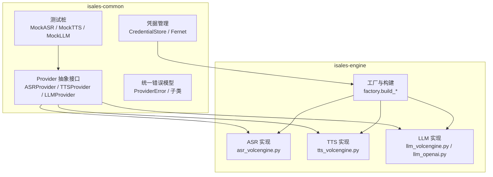
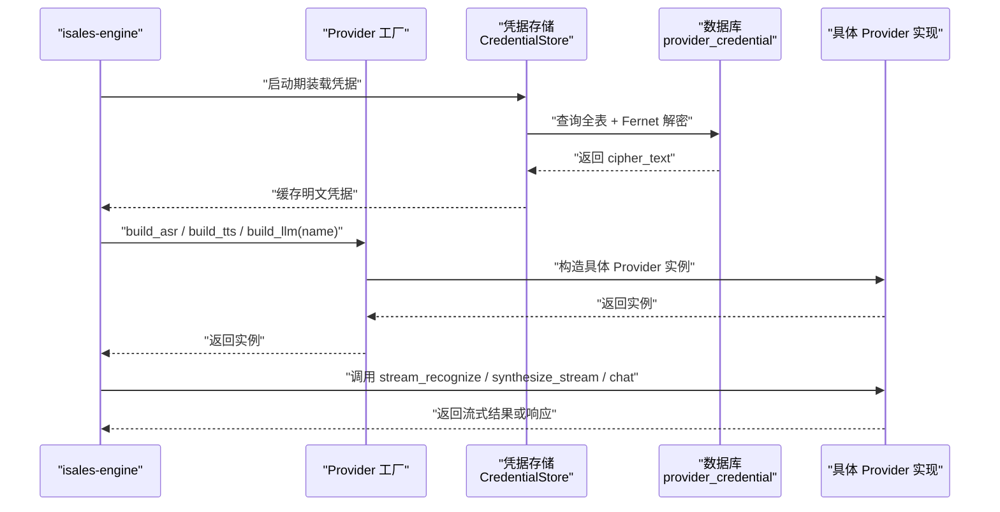
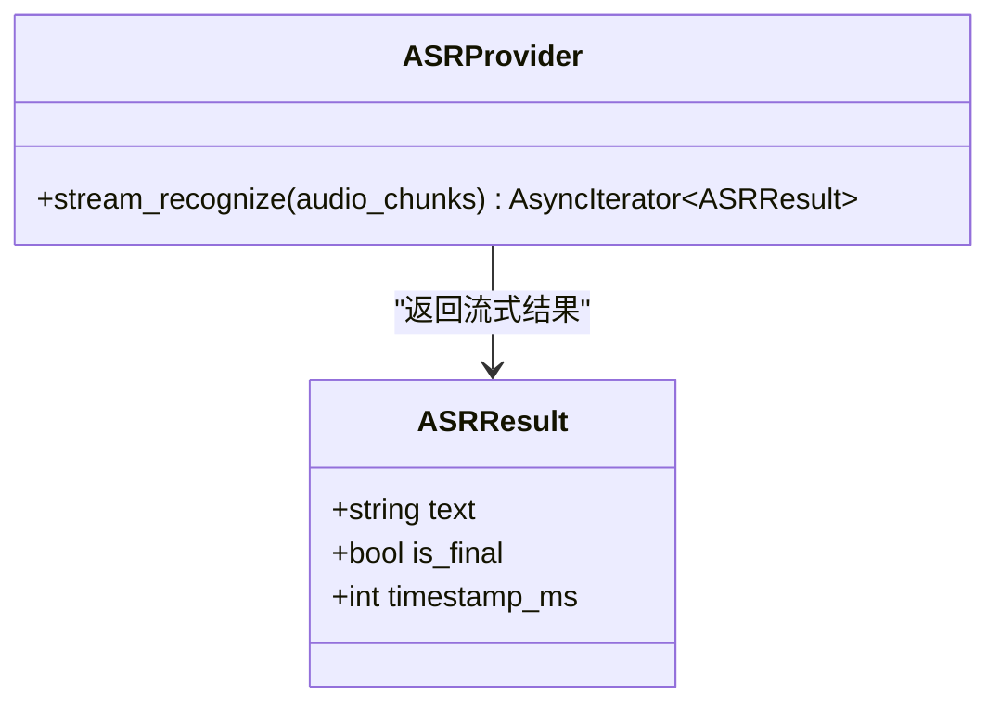
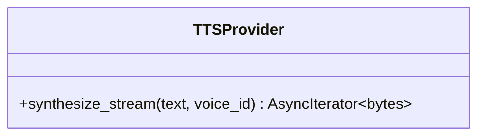
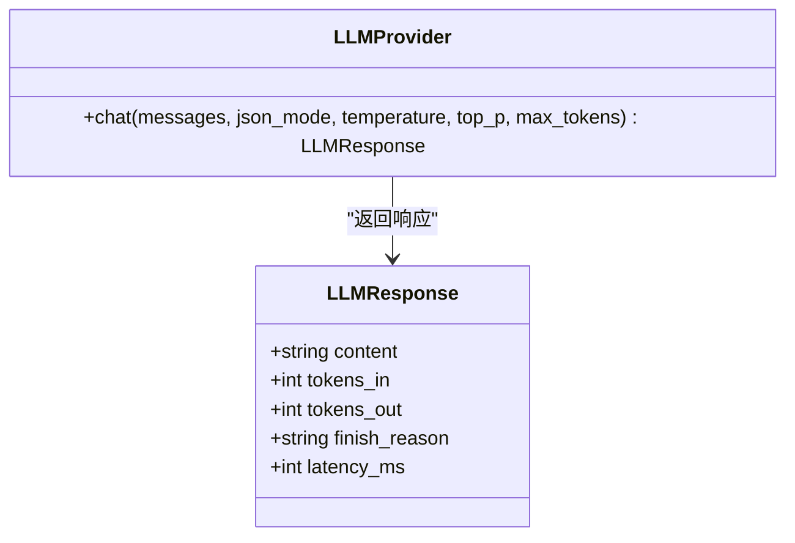
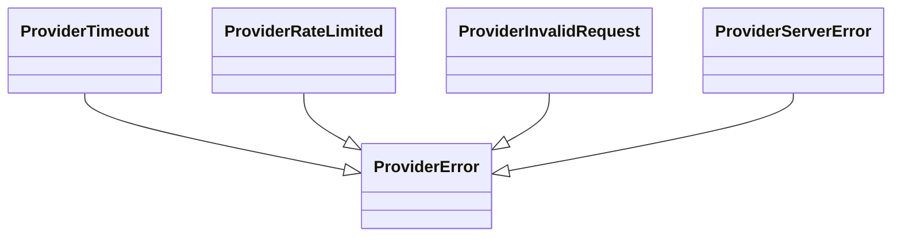
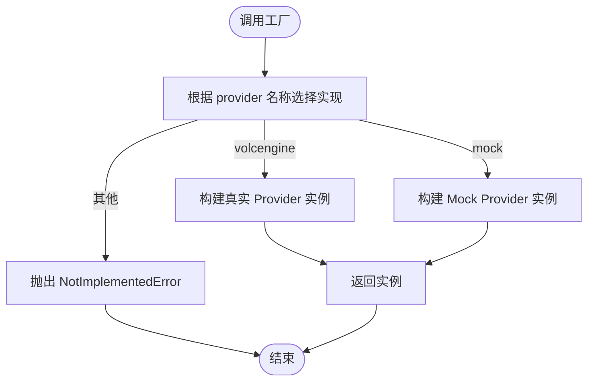
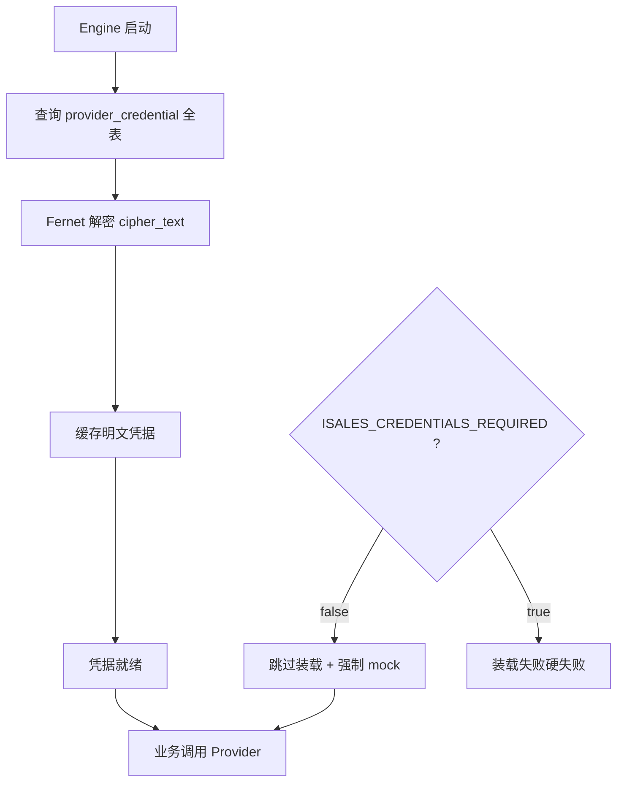
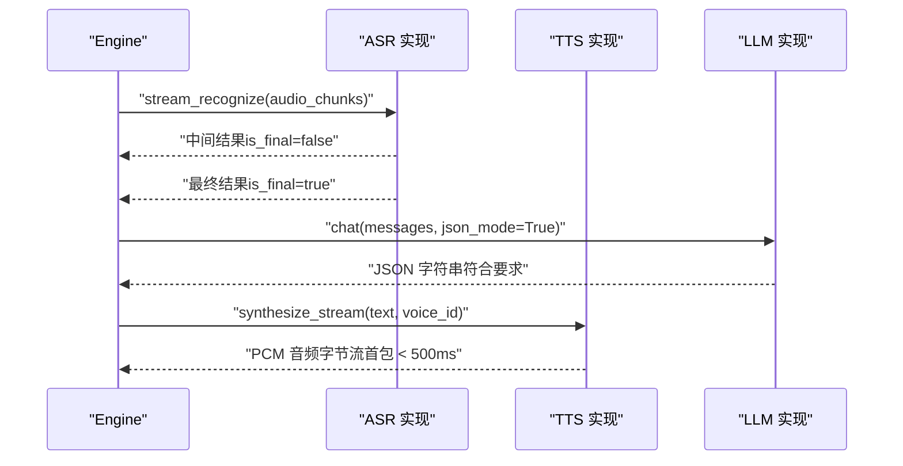
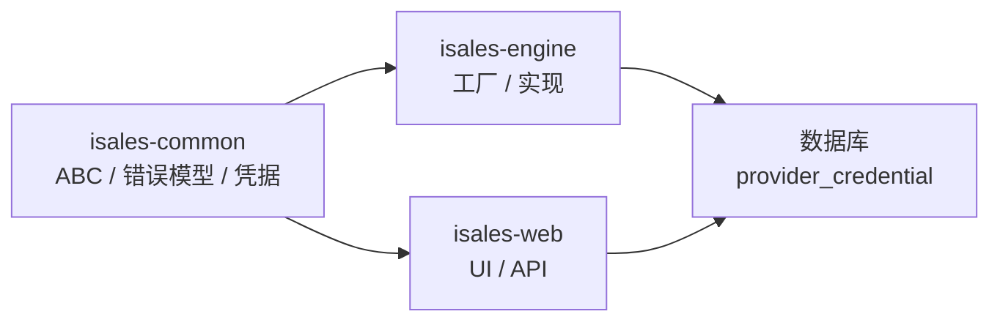

# Provider 抽象接口

<cite>
**本文引用的文件**
- [provider-abc 规格](file://openspec/specs/provider-abc/spec.md)
- [provider-credential 规格](file://openspec/specs/provider-credential/spec.md)
- [阶段 5 变更提案：实现引擎 Provider](file://openspec/changes/archive/2026-05-08-impl-engine-providers/proposal.md)
- [初始化 isales-common 任务清单](file://openspec/changes/archive/2026-05-01-init-isales-common/tasks.md)
- [凭据变更验收记录](file://openspec/changes/archive/2026-05-24-impl-provider-credential-db-ssot/acceptance.md)
</cite>

## 目录
1. [简介](#简介)
2. [项目结构](#项目结构)
3. [核心组件](#核心组件)
4. [架构总览](#架构总览)
5. [详细组件分析](#详细组件分析)
6. [依赖关系分析](#依赖关系分析)
7. [性能考虑](#性能考虑)
8. [故障排查指南](#故障排查指南)
9. [结论](#结论)
10. [附录](#附录)

## 简介
本文件面向 isales-common 的 Provider 抽象接口，系统化阐述 Provider 模式的架构设计与接口规范，涵盖 ASR、TTS、LLM 三大服务的抽象接口、统一错误模型、注册与工厂机制、动态加载与配置管理，以及凭据管理的安全存储与访问控制。文档基于 OpenSpec 规格与阶段 5 的实现提案，确保技术细节与部署实践的一致性。

## 项目结构
- Provider 抽象接口集中定义于 isales-common 的 providers 模块，包含：
  - 抽象基类：ASRProvider、TTSProvider、LLMProvider
  - 统一错误模型：ProviderError 及其子类
  - 测试桩：MockASRProvider、MockTTSProvider、MockLLMProvider
- Provider 实现位于 isales-engine 的 providers 子目录，遵循 ABC 接口并实现具体逻辑
- 凭据管理集中在 isales-common 的 credentials 模块，提供 CredentialStore 统一加密/解密/掩码能力

图表来源
- [provider-abc 规格:3-16](file://openspec/specs/provider-abc/spec.md#L3-L16)
- [阶段 5 变更提案：实现引擎 Provider:9-30](file://openspec/changes/archive/2026-05-08-impl-engine-providers/proposal.md#L9-L30)

章节来源
- [provider-abc 规格:3-16](file://openspec/specs/provider-abc/spec.md#L3-L16)
- [阶段 5 变更提案：实现引擎 Provider:9-30](file://openspec/changes/archive/2026-05-08-impl-engine-providers/proposal.md#L9-L30)

## 核心组件
- 抽象接口（ABC）
  - ASRProvider：异步流式识别接口 stream_recognize，返回 ASRResult 流
  - TTSProvider：异步流式合成接口 synthesize_stream，返回 PCM 音频字节流
  - LLMProvider：聊天接口 chat，支持 json_mode、温度、采样参数与令牌统计
- 统一错误模型
  - ProviderError 基类与子类：ProviderTimeout、ProviderRateLimited、ProviderInvalidRequest、ProviderServerError
- 测试桩
  - MockASRProvider / MockTTSProvider / MockLLMProvider，支持 pytest fixture
- 凭据管理
  - CredentialStore：统一 encrypt/decrypt/mask，Fernet 对称加密，主密钥 ISALES_FERNET_KEY
  - provider_credential 表：单一事实来源，字段包括 provider_id、field_name、cipher_text、updated_by、updated_at

章节来源
- [provider-abc 规格:17-66](file://openspec/specs/provider-abc/spec.md#L17-L66)
- [provider-credential 规格:51-91](file://openspec/specs/provider-credential/spec.md#L51-L91)
- [初始化 isales-common 任务清单:58-66](file://openspec/changes/archive/2026-05-01-init-isales-common/tasks.md#L58-L66)

## 架构总览
Provider 模式通过 isales-common 的 ABC 将业务层与具体供应商实现解耦。isales-engine 通过工厂方法按需构建 Provider 实例，运行时从 provider_credential 表加载凭据并进行解密缓存，确保凭据安全与一致性。

图表来源
- [provider-credential 规格:27-41](file://openspec/specs/provider-credential/spec.md#L27-L41)
- [阶段 5 变更提案：实现引擎 Provider:28-30](file://openspec/changes/archive/2026-05-08-impl-engine-providers/proposal.md#L28-L30)

## 详细组件分析

### ASR Provider 抽象接口
- 方法签名与职责
  - stream_recognize(audio_chunks): 异步迭代器，逐帧产出 ASRResult
- 数据模型
  - ASRResult：包含 text、is_final、timestamp_ms 字段
- 流式特性
  - 中间结果 is_final=false，句末 is_final=true
  - 中间结果用于打断检测，需持续推送
- 典型实现要点
  - WebSocket/流式 API 接入，支持重连与退避
  - 首包时延控制与错误兜底（ProviderServerError）

图表来源
- [provider-abc 规格:17-30](file://openspec/specs/provider-abc/spec.md#L17-L30)

章节来源
- [provider-abc 规格:17-30](file://openspec/specs/provider-abc/spec.md#L17-L30)
- [阶段 5 变更提案：实现引擎 Provider:15-21](file://openspec/changes/archive/2026-05-08-impl-engine-providers/proposal.md#L15-L21)

### TTS Provider 抽象接口
- 方法签名与职责
  - synthesize_stream(text, voice_id): 异步迭代器，逐块产出 PCM 音频字节
- 性能与体验
  - 首包应在 500ms 内开始返回，降低端到端延迟
  - 输出 PCM 8kHz 单声道 16-bit LE，便于后续处理
- 典型实现要点
  - 流式合成 API，超时/5xx 重试一次，最终失败抛 ProviderTimeout
  - voice_id 直接透传至供应商

图表来源
- [provider-abc 规格:31-44](file://openspec/specs/provider-abc/spec.md#L31-L44)

章节来源
- [provider-abc 规格:31-44](file://openspec/specs/provider-abc/spec.md#L31-L44)
- [阶段 5 变更提案：实现引擎 Provider:22-26](file://openspec/changes/archive/2026-05-08-impl-engine-providers/proposal.md#L22-L26)

### LLM Provider 抽象接口
- 方法签名与职责
  - chat(messages, json_mode, temperature, top_p, max_tokens): 返回 LLMResponse
- JSON Mode
  - json_mode=True 时启用供应商原生 JSON Mode 或等效约束
  - 供应商不支持时通过 system prompt + 后处理保证 JSON 输出
- 响应模型
  - LLMResponse：content、tokens_in、tokens_out、finish_reason、latency_ms
- 典型实现要点
  - 原生 JSON Mode：doubao-pro/doubao-lite、gpt-4o-mini/gpt-4o
  - 令牌统计与延迟采集，便于成本与性能监控

图表来源
- [provider-abc 规格:45-66](file://openspec/specs/provider-abc/spec.md#L45-L66)

章节来源
- [provider-abc 规格:45-66](file://openspec/specs/provider-abc/spec.md#L45-L66)
- [阶段 5 变更提案：实现引擎 Provider:9-14](file://openspec/changes/archive/2026-05-08-impl-engine-providers/proposal.md#L9-L14)

### 统一错误模型
- ProviderError 体系
  - ProviderTimeout：超时（asyncio.timeout/read timeout/连接 timeout）
  - ProviderRateLimited：429 限流
  - ProviderInvalidRequest：4xx 非 429、鉴权失败、响应非 JSON/缺字段
  - ProviderServerError：5xx、连接错误/DNS/SSL/WebSocket 1006 关闭
- 业务层使用
  - 依据异常类型进行降级、重试或切换 Provider

图表来源
- [provider-abc 规格:67-107](file://openspec/specs/provider-abc/spec.md#L67-L107)

章节来源
- [provider-abc 规格:67-107](file://openspec/specs/provider-abc/spec.md#L67-L107)

### Provider 注册机制与工厂
- 工厂方法
  - build_llm("openai"|"volcengine"|"mock")
  - build_asr("volcengine"|"mock")
  - build_tts("volcengine"|"mock")
- 默认行为
  - LLM/ASR/TTS 默认 Provider 为 volcengine（与规格一致）
  - invalid 名称抛出 NotImplementedError，预留后续扩展
- 业务层透明
  - 仅替换 isales-engine/providers 下实现类即可切换供应商

图表来源
- [阶段 5 变更提案：实现引擎 Provider:28-30](file://openspec/changes/archive/2026-05-08-impl-engine-providers/proposal.md#L28-L30)
- [provider-abc 规格:10-18](file://openspec/specs/provider-abc/spec.md#L10-L18)

章节来源
- [阶段 5 变更提案：实现引擎 Provider:28-30](file://openspec/changes/archive/2026-05-08-impl-engine-providers/proposal.md#L28-L30)
- [provider-abc 规格:10-18](file://openspec/specs/provider-abc/spec.md#L10-L18)

### 凭据管理与安全存储
- 单一事实来源
  - provider_credential 表为运行时凭据唯一来源，env 文件不得包含 provider 密钥字段
- 加密与解密
  - 使用 cryptography.fernet.Fernet，主密钥 ISALES_FERNET_KEY（url-safe base64 32 字节）
  - 所有持久化/前端暴露均通过 CredentialStore.encrypt/decrypt/mask
- 掩码策略
  - API 返回值统一掩码为 "<前4字符>********<后4字符>"，长度不足 8 的掩码为 "********"
- 表结构与约束
  - provider_id、field_name 唯一索引；普通索引 provider_id
  - 字段白名单：api_key、app_key、app_token、endpoint、default_model、enabled
- 启动期装载
  - engine 启动期一次性从 DB 装载 + Fernet 解密 + 缓存；失败硬失败（exit != 0）
  - dev/CI 可通过 ISALES_CREDENTIALS_REQUIRED=false 跳过装载并走 mock 分支

图表来源
- [provider-credential 规格:27-50](file://openspec/specs/provider-credential/spec.md#L27-L50)
- [凭据变更验收记录:200-244](file://openspec/changes/archive/2026-05-24-impl-provider-credential-db-ssot/acceptance.md#L200-L244)

章节来源
- [provider-credential 规格:6-50](file://openspec/specs/provider-credential/spec.md#L6-L50)
- [凭据变更验收记录:200-244](file://openspec/changes/archive/2026-05-24-impl-provider-credential-db-ssot/acceptance.md#L200-L244)

### 典型 Provider 实现示例（流程）
- ASR 实现（火山引擎）
  - WebSocket 流式识别，持续推送中间结果，句末标记 is_final=True
  - 断网重连（带退避），三次失败抛 ProviderServerError
- TTS 实现（火山引擎）
  - 首包 < 500ms，PCM 8kHz 单声道 16-bit LE
  - 超时/5xx 重试一次，最终失败抛 ProviderTimeout
- LLM 实现（火山/OpenAI）
  - 原生 JSON Mode：doubao-pro/doubao-lite、gpt-4o-mini/gpt-4o
  - tokens_in/out、finish_reason、latency_ms 从响应解析

图表来源
- [阶段 5 变更提案：实现引擎 Provider:15-26](file://openspec/changes/archive/2026-05-08-impl-engine-providers/proposal.md#L15-L26)

章节来源
- [阶段 5 变更提案：实现引擎 Provider:15-26](file://openspec/changes/archive/2026-05-08-impl-engine-providers/proposal.md#L15-L26)

## 依赖关系分析
- 组件内聚与耦合
  - isales-common 提供稳定 ABC 与错误模型，isales-engine 仅依赖接口
  - 凭据管理通过 CredentialStore 与 provider_credential 表解耦
- 外部依赖
  - Fernet 对称加密、WebSocket/HTTP 客户端、数据库访问
- 循环依赖规避
  - 工厂方法通过名称选择实现，避免直接导入具体实现

图表来源
- [provider-abc 规格:3-16](file://openspec/specs/provider-abc/spec.md#L3-L16)
- [provider-credential 规格:8-15](file://openspec/specs/provider-credential/spec.md#L8-L15)

章节来源
- [provider-abc 规格:3-16](file://openspec/specs/provider-abc/spec.md#L3-L16)
- [provider-credential 规格:8-15](file://openspec/specs/provider-credential/spec.md#L8-L15)

## 性能考虑
- ASR 首包时延
  - 中间结果持续推送，避免仅句末返回导致的延迟放大
- TTS 首包时延
  - 目标：< 500ms 首包，减少端到端等待
- 令牌统计与预算
  - 单通通话累计超预算触发告警事件，便于成本控制
- 重试与退避
  - ASR/TTS 实现采用指数退避与有限重试，平衡可靠性与用户体验

## 故障排查指南
- 超时/限流/非法请求/服务端错误
  - 依据 ProviderError 子类定位问题类型，执行相应降级或重试策略
- 凭据装载失败
  - 启动期 DB 不可达或 Fernet 解密失败：硬失败并记录 cred_load_failed
  - dev/CI 可通过 ISALES_CREDENTIALS_REQUIRED=false 跳过装载并走 mock
- 主密钥问题
  - ISALES_FERNET_KEY 格式不合法：初始化 Fernet 抛 ValueError，启动失败
- 掩码与审计
  - API 返回值统一掩码；更新记录包含 updated_by（JWT sub）与 updated_at

章节来源
- [provider-abc 规格:67-107](file://openspec/specs/provider-abc/spec.md#L67-L107)
- [provider-credential 规格:35-81](file://openspec/specs/provider-credential/spec.md#L35-L81)
- [凭据变更验收记录:200-244](file://openspec/changes/archive/2026-05-24-impl-provider-credential-db-ssot/acceptance.md#L200-L244)

## 结论
Provider 抽象接口通过稳定的 ABC、统一错误模型与工厂机制，实现了业务层与具体供应商实现的解耦。结合 provider_credential 表与 CredentialStore 的安全存储方案，既保障了凭据安全与一致性，又为多供应商切换与灰度发布提供了基础。阶段 5 的实现进一步完善了真实 Provider 的接入与实时打断检测，为端到端真实通话奠定基础。

## 附录
- 接口稳定性
  - ABC 方法签名视为公共 API，破坏性变更需经 OpenSpec 变更提案评估
- 测试与 Mock
  - isales_common.providers.testing 提供 MockASRProvider/MockTTSProvider/MockLLMProvider，支持本地与 CI 测试

章节来源
- [provider-abc 规格:117-130](file://openspec/specs/provider-abc/spec.md#L117-L130)
- [初始化 isales-common 任务清单:58-66](file://openspec/changes/archive/2026-05-01-init-isales-common/tasks.md#L58-L66)