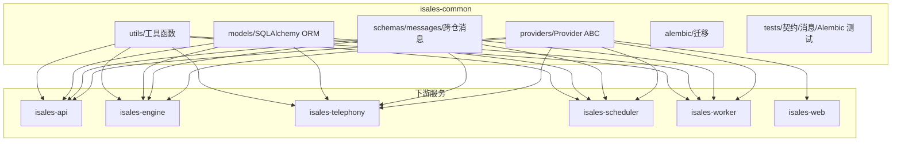
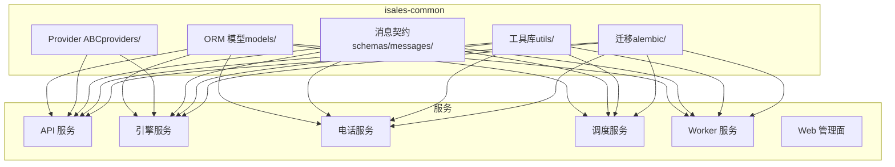
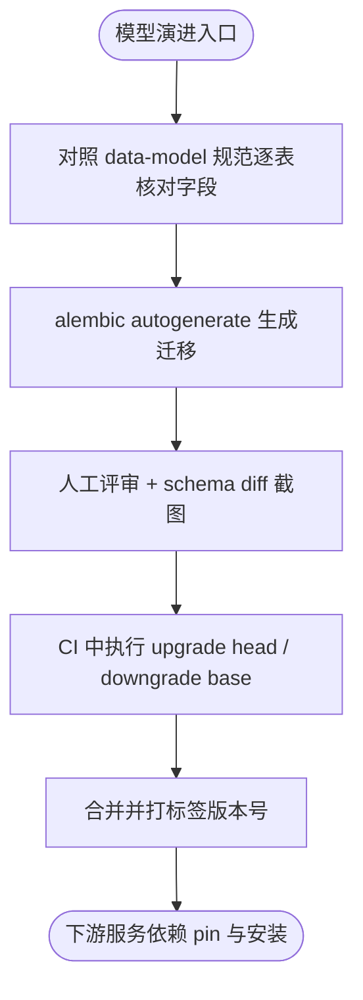
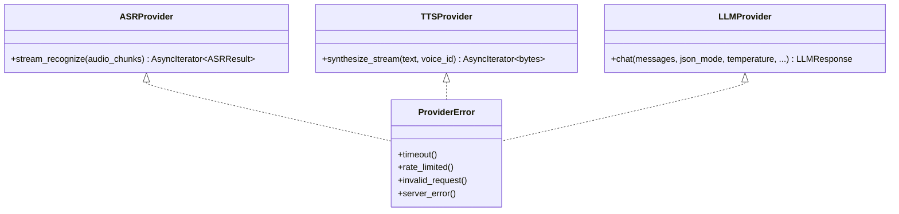
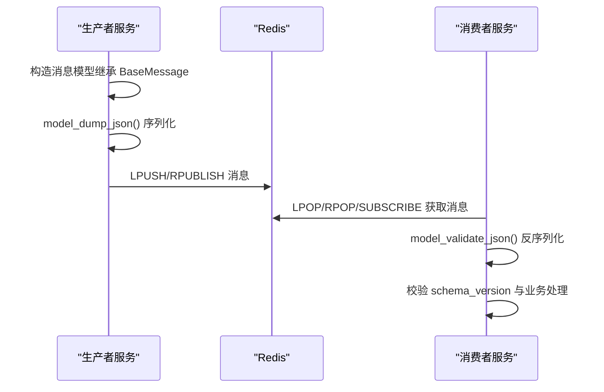
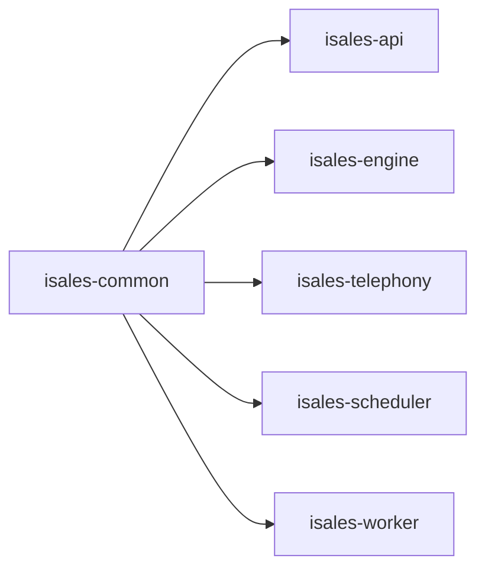

# isales-common 共享库

<cite>
**本文引用的文件**
- [README.md](file://README.md)
- [design.md](file://openspec/changes/archive/2026-05-01-init-isales-common/design.md)
- [spec.md（provider-abc）](file://openspec/changes/archive/2026-05-01-init-isales-common/specs/provider-abc/spec.md)
- [spec.md（message-contract）](file://openspec/changes/archive/2026-05-01-init-isales-common/specs/message-contract/spec.md)
- [spec.md（data-model）](file://openspec/specs/data-model/spec.md)
- [spec.md（service-communication）](file://openspec/specs/service-communication/spec.md)
- [spec.md（ai-pipeline）](file://openspec/specs/ai-pipeline/spec.md)
- [tasks.md（impl-api）](file://openspec/changes/archive/2026-05-06-impl-api/tasks.md)
- [tasks.md（impl-engine）](file://openspec/changes/archive/2026-05-07-impl-engine/tasks.md)
- [tasks.md（impl-telephony）](file://openspec/changes/archive/2026-05-06-impl-telephony/tasks.md)
- [RUNBOOK.md](file://deploy/RUNBOOK.md)
- [RUNBOOK-cloud.md](file://deploy/RUNBOOK-cloud.md)
- [STATE.md](file://deploy/cloud/STATE.md)
</cite>

## 目录
1. [简介](#简介)
2. [项目结构](#项目结构)
3. [核心组件](#核心组件)
4. [架构总览](#架构总览)
5. [组件详解](#组件详解)
6. [依赖关系分析](#依赖关系分析)
7. [性能考量](#性能考量)
8. [故障排查指南](#故障排查指南)
9. [结论](#结论)
10. [附录](#附录)

## 简介
isales-common 是 iSales 7 仓架构的共享基础设施库，为其余 6 个服务（isales-api、isales-engine、isales-telephony、isales-scheduler、isales-worker、isales-web）提供统一的数据模型、Provider 抽象接口、跨仓消息契约与工具函数。其目标是：
- 以 Pydantic 模型与 SQLAlchemy ORM 为数据层基石，提供稳定、可演进的 schema
- 以 Provider ABC（ASR/TTS/LLM）定义三方 AI 服务的统一接口契约，保障“切换供应商不改业务代码”
- 以 Pydantic 消息模型集中定义跨服务 Redis 通道的消息体，消除字段漂移
- 提供 Alembic 初始迁移与版本管理机制，配合下游服务的依赖 pin 与发布流程

## 项目结构
isales-common 采用“独立仓库 + 本地开发模式”的组织方式：其他服务通过本地相对路径或 Git Tag 引入该包，不发布到 PyPI。其核心目录与职责概览如下：
- providers/：Provider 抽象接口（ASR/TTS/LLM）与契约测试基座
- schemas/messages/：跨服务 Redis 消息体 Pydantic 模型，统一序列化/反序列化与版本控制
- models/：SQLAlchemy ORM 模型与 Alembic 迁移，按业务域模块化拆分
- utils/：通用工具（号码归一化、加解密、Redis 客户端工厂、音频常量等）
- alembic/：初始迁移与版本演进脚本
- tests/：Provider ABC 契约测试、消息体 round-trip 测试、Alembic 迁移测试

图表来源
- [design.md:41-96](file://openspec/changes/archive/2026-05-01-init-isales-common/design.md#L41-L96)
- [spec.md（service-communication）:1-24](file://openspec/specs/service-communication/spec.md#L1-L24)

章节来源
- [README.md:1-86](file://README.md#L1-L86)
- [design.md:27-96](file://openspec/changes/archive/2026-05-01-init-isales-common/design.md#L27-L96)

## 核心组件
- 数据模型（Pydantic + SQLAlchemy）
  - ORM 模型按域拆分（如 campaign、lead、call_record、device、agent、prompt、callback 等），通过单一 Base 统一纳入 Alembic 扫描
  - 每个资源提供 Create/Update/Read 三类 Pydantic Schema，明确输入边界与 from_attributes 转换
  - JSONB 字段以嵌套 Pydantic 模型显式约束，满足“字段 schema 文档”要求
- Provider 抽象接口（ABC）
  - ASRProvider：异步流式识别，返回中间结果与最终结果标记
  - TTSProvider：异步流式合成，输出 PCM 音频字节流
  - LLMProvider：chat 接口，强制 JSON Mode（供应商不支持时需等效保证）
  - 统一错误模型（ProviderError 及子类），便于上层统一处理超时/限流/无效请求/服务器错误
- 跨仓消息契约
  - 所有跨服务 Redis 消息体统一定义于 schemas/messages/，继承 BaseMessage（含 schema_version、message_id、created_at）
  - 生产者使用 .model_dump_json() 序列化；消费者使用 .model_validate_json() 反序列化
  - 消息演进区分非破坏性与破坏性，破坏性变更必须升版并经 OpenSpec 变更流程
- 工具函数库
  - 号码归一化（E.164）、对称加密（Fernet，密钥来自环境变量）、Redis 客户端工厂、音频格式常量与轻量校验
- 版本管理与迁移
  - v1 初始 schema 一次性迁移，后续每次变更走独立 alembic revision
  - 通过下游服务的 pyproject.toml pin 与 CI 验证，确保跨仓一致性

章节来源
- [design.md:54-96](file://openspec/changes/archive/2026-05-01-init-isales-common/design.md#L54-L96)
- [spec.md（provider-abc）:1-100](file://openspec/changes/archive/2026-05-01-init-isales-common/specs/provider-abc/spec.md#L1-L100)
- [spec.md（message-contract）:1-81](file://openspec/changes/archive/2026-05-01-init-isales-common/specs/message-contract/spec.md#L1-L81)
- [spec.md（data-model）:1-83](file://openspec/specs/data-model/spec.md#L1-L83)
- [spec.md（ai-pipeline）:1-166](file://openspec/specs/ai-pipeline/spec.md#L1-L166)

## 架构总览
isales-common 作为“契约与基础设施”的单一可信来源，向下提供模型与接口，向上支撑 7 仓的服务间通信与数据一致性。

图表来源
- [design.md:41-96](file://openspec/changes/archive/2026-05-01-init-isales-common/design.md#L41-L96)
- [spec.md（service-communication）:1-24](file://openspec/specs/service-communication/spec.md#L1-L24)

## 组件详解

### 数据模型设计（Pydantic + SQLAlchemy）
- 模型分层与依赖顺序
  - 分三批加载以避免循环依赖：无外键（A）、依赖 A（B）、依赖 B（C）
  - 每个资源提供 Create/Update/Read 三类 Schema，from_attributes=True 直接由 ORM 转换
- JSONB 字段约束
  - ORM 使用 Mapped[dict]/Mapped[list]；Schema 用嵌套 Pydantic 模型显式描述（如 TimeWindow、RetryPolicy、CallbackTrigger）
  - 与 data-model 规范对齐，确保 JSONB 字段具备“事实 schema 文档”
- 演进与迁移
  - v1 初始迁移一次性建模；后续迁移独立生成与评审
  - CI 中执行 alembic upgrade head 与 downgrade base 往返测试

图表来源
- [design.md:92-104](file://openspec/changes/archive/2026-05-01-init-isales-common/design.md#L92-L104)
- [spec.md（data-model）:1-83](file://openspec/specs/data-model/spec.md#L1-L83)

章节来源
- [design.md:41-67](file://openspec/changes/archive/2026-05-01-init-isales-common/design.md#L41-L67)
- [spec.md（data-model）:19-74](file://openspec/specs/data-model/spec.md#L19-L74)

### Provider 抽象接口（AI 服务提供商抽象）
- 接口契约
  - ASRProvider：异步流式识别，返回中间结果与最终结果标记
  - TTSProvider：异步流式合成，输出 PCM 音频字节流，首包尽快返回
  - LLMProvider：chat 接口，强制 JSON Mode（供应商不支持时需等效保证）
- 错误模型
  - ProviderError 基类与子类（ProviderTimeout/ProviderRateLimited/ProviderInvalidRequest/ProviderServerError）
  - 统一包装供应商原生异常，避免泄漏到业务层
- 契约测试
  - 提供 mock 实现与 pytest fixture，便于本地与 CI 测试

图表来源
- [spec.md（provider-abc）:17-77](file://openspec/changes/archive/2026-05-01-init-isales-common/specs/provider-abc/spec.md#L17-L77)

章节来源
- [spec.md（provider-abc）:1-100](file://openspec/changes/archive/2026-05-01-init-isales-common/specs/provider-abc/spec.md#L1-L100)

### 跨仓消息契约（Redis 通道消息体）
- 统一基类与版本字段
  - BaseMessage：schema_version（默认 1，破坏性升级 +1）、message_id（UUID）、created_at（时间戳）
- 序列化与反序列化
  - 生产者：.model_dump_json() 序列化
  - 消费者：.model_validate_json() 反序列化并校验 schema_version
- 通道矩阵与消息类
  - v1 必有消息类：DialRequest、CallEnded、EngineControl、EngineEvent、CampaignControl
  - 新增通道需经 OpenSpec 变更提案并在 isales-common 同步新增消息类

图表来源
- [spec.md（message-contract）:7-35](file://openspec/changes/archive/2026-05-01-init-isales-common/specs/message-contract/spec.md#L7-L35)

章节来源
- [spec.md（message-contract）:1-81](file://openspec/changes/archive/2026-05-01-init-isales-common/specs/message-contract/spec.md#L1-L81)

### 工具函数库与配置管理
- 工具函数边界
  - 包含：号码归一化（E.164）、加解密（Fernet，密钥来自环境变量）、Redis 客户端工厂、音频格式常量与轻量校验
  - 不包含：HTTP 客户端包装、日志格式化、配置加载（由各服务自行使用 pydantic-settings）
- 配置管理
  - 各服务使用 pydantic-settings 读取 ISALES_* 环境变量，isales-common 提供 Redis 客户端工厂与加密工具

章节来源
- [design.md:87-91](file://openspec/changes/archive/2026-05-01-init-isales-common/design.md#L87-L91)

### 版本管理与发布流程
- 依赖 pin 与版本号
  - 下游服务在 pyproject.toml 中 pin 依赖版本范围（如 >=0.1.x,<0.2）
  - isales-common 发布新版本后，下游服务同步 bump 并通过 CI 验证
- 迁移与回滚
  - 通过 alembic.ini 在 isales-common 目录执行迁移与回滚
  - 运维手册提供回滚步骤与状态检查

章节来源
- [tasks.md（impl-api）:1-21](file://openspec/changes/archive/2026-05-06-impl-api/tasks.md#L1-L21)
- [tasks.md（impl-engine）:1-14](file://openspec/changes/archive/2026-05-07-impl-engine/tasks.md#L1-L14)
- [tasks.md（impl-telephony）:13-22](file://openspec/changes/archive/2026-05-06-impl-telephony/tasks.md#L13-L22)
- [RUNBOOK.md:100-120](file://deploy/RUNBOOK.md#L100-L120)
- [RUNBOOK-cloud.md:460-530](file://deploy/RUNBOOK-cloud.md#L460-L530)
- [STATE.md:170-330](file://deploy/cloud/STATE.md#L170-L330)

## 依赖关系分析
- 包管理与分发
  - 使用 hatchling + pyproject.toml，本地 pip install -e ../isales-common 引入
  - CI 通过 git+ssh URL 或子模块方式拉取
- 服务间耦合与内聚
  - isales-common 仅提供“契约与基础设施”，不包含业务逻辑，降低耦合
  - 各服务通过依赖注入与工厂模式使用 common 的组件
- 外部依赖
  - SQLAlchemy 2.x + asyncpg、Pydantic 2.x、Alembic、aioredis、httpx 等

图表来源
- [design.md:29-39](file://openspec/changes/archive/2026-05-01-init-isales-common/design.md#L29-L39)

章节来源
- [design.md:29-39](file://openspec/changes/archive/2026-05-01-init-isales-common/design.md#L29-L39)

## 性能考量
- 异步与流式
  - Provider 接口均为异步流式，减少阻塞与连接池压力
  - TTS 首包尽快返回，降低端到端延迟
- 序列化与传输
  - 消息统一使用 Pydantic JSON 序列化，便于调试与可观测性
- 并发与资源
  - 全局并发控制使用 Redis 原子计数器，避免泄漏
  - 数据库直连 + 单一 PG 实例，减少跨库事务与网络开销

章节来源
- [spec.md（provider-abc）:31-44](file://openspec/changes/archive/2026-05-01-init-isales-common/specs/provider-abc/spec.md#L31-L44)
- [spec.md（service-communication）:45-63](file://openspec/specs/service-communication/spec.md#L45-L63)

## 故障排查指南
- 消息反序列化失败
  - 检查 schema_version 是否在消费者支持范围内；不支持时记录告警并按死信处理
  - 确认生产者使用 .model_dump_json()，消费者使用 .model_validate_json()
- Provider 调用异常
  - 统一包装为 ProviderError 子类；上层按超时/限流/无效请求/服务器错误分支处理
- 数据库迁移问题
  - 在 isales-common 目录执行 alembic upgrade head/downgrade base 进行往返测试
- 部署与回滚
  - 参考运维手册中的回滚步骤与状态检查，确保版本 pin 与安装顺序正确

章节来源
- [spec.md（message-contract）:31-40](file://openspec/changes/archive/2026-05-01-init-isales-common/specs/message-contract/spec.md#L31-L40)
- [RUNBOOK.md:100-120](file://deploy/RUNBOOK.md#L100-L120)
- [RUNBOOK-cloud.md:460-530](file://deploy/RUNBOOK-cloud.md#L460-L530)
- [STATE.md:170-330](file://deploy/cloud/STATE.md#L170-L330)

## 结论
isales-common 通过“契约先行”的设计，将数据模型、Provider 接口与跨仓消息体标准化，为 7 仓提供了稳定、可演进的共享基础设施。其关键价值在于：
- 以 Provider ABC 实现“切换供应商不改业务代码”
- 以统一消息契约消除字段漂移与序列化差异
- 以 Alembic 迁移与版本管理保障 schema 演进的可控性
- 以工具库与配置管理降低各服务重复实现的成本

## 附录
- 最佳实践
  - 模型演进：严格对照 data-model 规范，人工评审 + CI 往返测试
  - Provider 实现：继承 ABC 并实现全部抽象方法；统一错误包装；提供 mock 测试
  - 消息演进：非破坏性变更保持 schema_version 不变；破坏性变更升版并同步下游
  - 配置管理：各服务自行加载 ISALES_* 环境变量；isales-common 提供工厂与工具
- 使用示例（路径指引）
  - Provider 接口使用：参考 isales-engine 的 providers 目录实现，继承 isales-common 的 ABC
  - 消息体使用：生产者使用 isales-common 的消息模型进行 .model_dump_json()；消费者使用 .model_validate_json()
  - 数据模型使用：各服务通过 isales-common 的 ORM 模型进行查询与更新，避免自建 schema

章节来源
- [tasks.md（impl-engine）:1-14](file://openspec/changes/archive/2026-05-07-impl-engine/tasks.md#L1-L14)
- [tasks.md（impl-api）:1-21](file://openspec/changes/archive/2026-05-06-impl-api/tasks.md#L1-L21)
- [tasks.md（impl-telephony）:13-22](file://openspec/changes/archive/2026-05-06-impl-telephony/tasks.md#L13-L22)