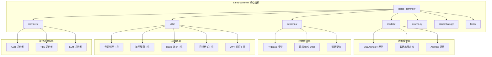
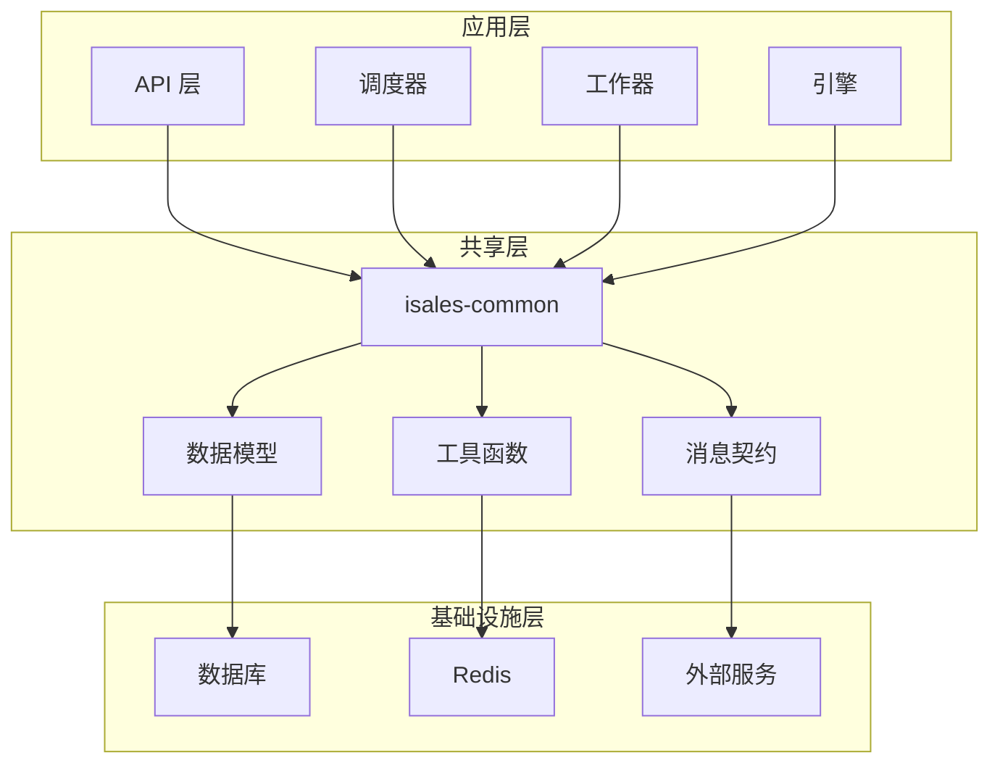
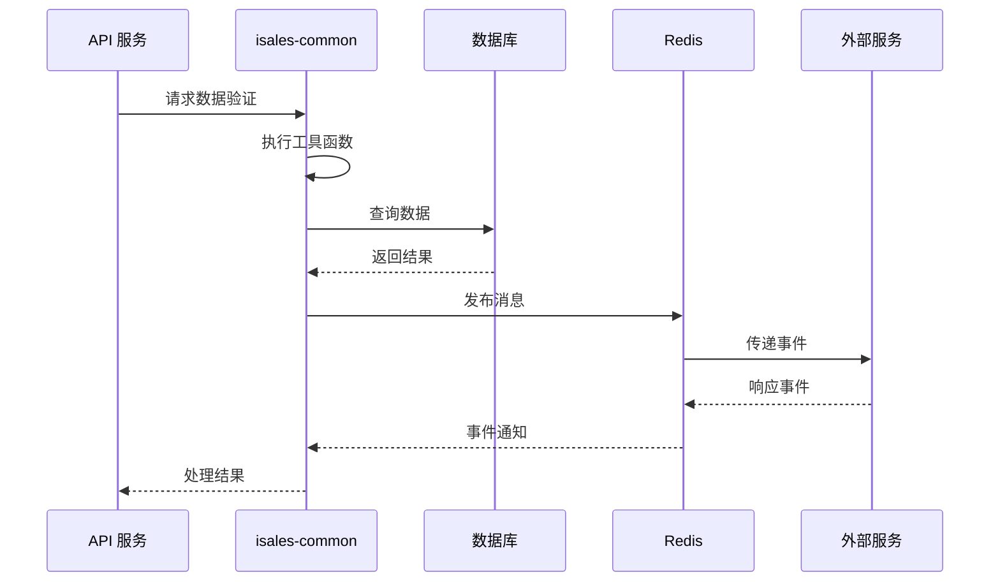
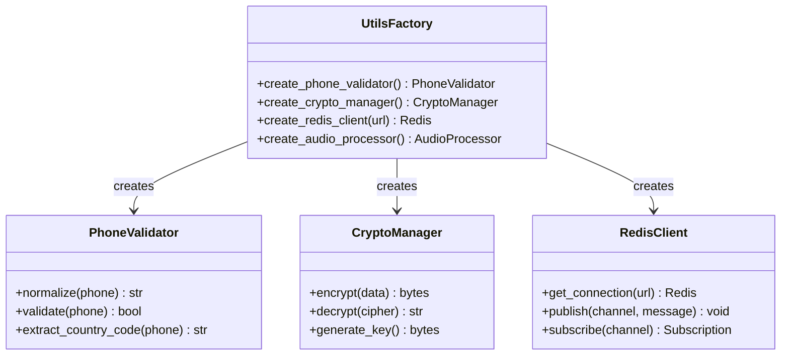
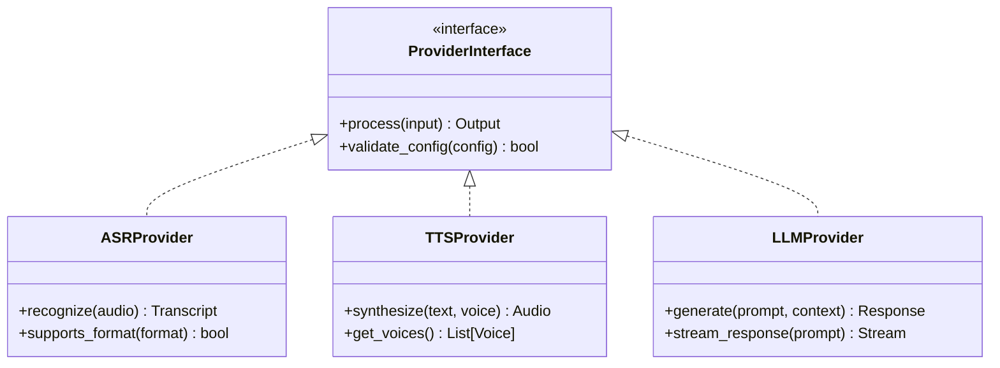
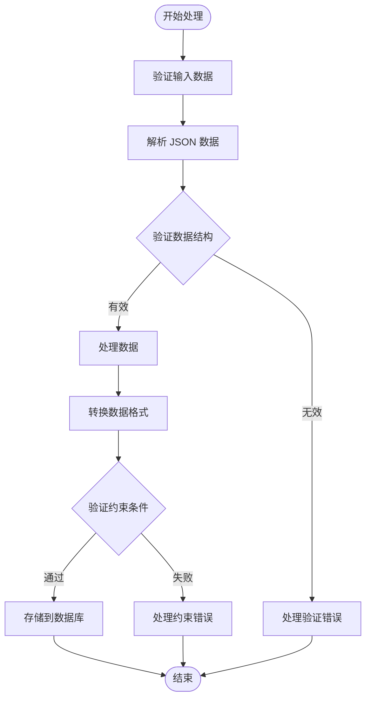
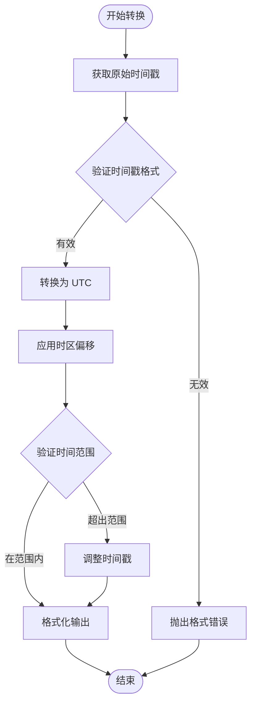
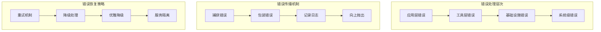
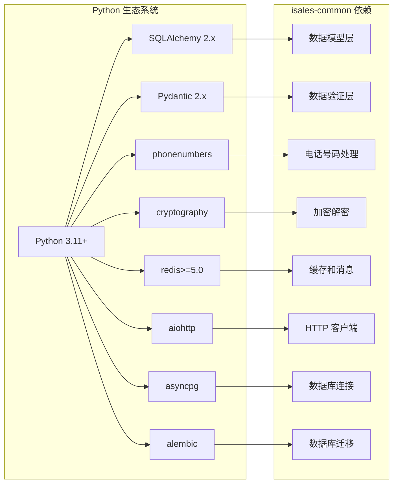

# 工具函数库

<cite>
**本文档引用的文件**
- [README.md](file://README.md)
- [IMPLEMENTATION_PLAN.md](file://IMPLEMENTATION_PLAN.md)
- [check_env_consistency.py](file://deploy/linux/scripts/check_env_consistency.py)
- [2026-05-01-init-isales-common/tasks.md](file://openspec/changes/archive/2026-05-01-init-isales-common/tasks.md)
- [2026-05-06-impl-telephony/tasks.md](file://openspec/changes/archive/2026-05-06-impl-telephony/tasks.md)
- [2026-05-24-impl-provider-credential-db-ssot/tasks.md](file://openspec/changes/archive/2026-05-24-impl-provider-credential-db-ssot/tasks.md)
- [message-contract/spec.md](file://openspec/specs/message-contract/spec.md)
</cite>

## 目录
1. [简介](#简介)
2. [项目结构](#项目结构)
3. [核心组件](#核心组件)
4. [架构概览](#架构概览)
5. [详细组件分析](#详细组件分析)
6. [依赖关系分析](#依赖关系分析)
7. [性能考虑](#性能考虑)
8. [故障排除指南](#故障排除指南)
9. [结论](#结论)

## 简介

isales-common 是 iSales 项目的核心工具函数库，负责提供跨服务共享的工具函数、数据模型和通用算法。该库采用模块化设计，包含数据处理、格式转换、验证工具和通用算法等功能，为整个 iSales 生态系统提供统一的基础设施支持。

根据项目设计规范，isales-common 采用 Python 3.11+ 开发，使用现代的 Python 生态系统技术栈，包括 SQLAlchemy 2.x、Pydantic 2.x、asyncpg、Alembic 等核心依赖。

## 项目结构

isales-common 采用清晰的模块化组织结构，按照功能领域进行划分：



**图表来源**
- [IMPLEMENTATION_PLAN.md:66-94](file://IMPLEMENTATION_PLAN.md#L66-L94)
- [2026-05-01-init-isales-common/tasks.md:11-18](file://openspec/changes/archive/2026-05-01-init-isales-common/tasks.md#L11-L18)

**章节来源**
- [IMPLEMENTATION_PLAN.md:66-94](file://IMPLEMENTATION_PLAN.md#L66-L94)
- [2026-05-01-init-isales-common/tasks.md:1-18](file://openspec/changes/archive/2026-05-01-init-isales-common/tasks.md#L1-L18)

## 核心组件

### 枚举系统 (enums.py)

isales-common 提供了完整的枚举系统，定义了通话系统中各种状态和类型的标准化表示：

- **通话状态 (CallStatus)**: 定义通话生命周期中的各种状态
- **角色类型 (RoleKind)**: 包括 role、judge、polish 等不同角色
- **转人工状态 (TransferStatus)**: 转接流程的状态管理
- **设备状态 (DeviceStatus)**: 通话设备的运行状态
- **代理状态 (AgentStatus)**: 人工代理的工作状态
- **回调状态 (CallbackStatus)**: 回调任务的执行状态
- **生成状态 (GenerationStatus)**: AI 内容生成的状态

### 工具函数模块

#### 电话号码处理工具 (utils/phone.py)
- **E.164 格式归一化**: 将各种格式的电话号码转换为标准的 E.164 格式
- **号码有效性验证**: 验证电话号码的格式正确性
- **区域码提取**: 从完整号码中提取国家代码和本地号码部分

#### 加密解密工具 (utils/crypto.py)
- **Fernet 对称加密**: 使用 Fernet 算法进行安全的数据加密
- **密钥管理**: 从环境变量 ISALES_FERNET_KEY 读取加密密钥
- **密文存储**: 提供加密后的数据存储和解密功能

#### Redis 连接工具 (utils/redis.py)
- **异步客户端工厂**: 提供 Redis 异步连接的创建和管理
- **连接池管理**: 优化 Redis 连接的复用和生命周期管理
- **配置驱动**: 支持通过 URL 配置不同的 Redis 实例

#### 音频格式工具 (utils/audio.py)
- **采样率常量**: 定义常用的音频采样率（8k/16k/24k Hz）
- **格式验证**: 验证音频文件的格式和质量
- **音频处理**: 提供基本的音频格式转换和验证功能

#### JWT 验证工具 (utils/jwt.py)
- **HS256 签名验证**: 验证 JWT 令牌的完整性和有效性
- **过期时间检查**: 自动检测令牌是否过期
- **声明解析**: 解析 JWT 中的用户声明信息

**章节来源**
- [2026-05-01-init-isales-common/tasks.md:11-18](file://openspec/changes/archive/2026-05-01-init-isales-common/tasks.md#L11-L18)
- [2026-05-06-impl-telephony/tasks.md:8](file://openspec/changes/archive/2026-05-06-impl-telephony/tasks.md#L8)

## 架构概览

isales-common 采用分层架构设计，确保各层之间的职责分离和松耦合：



**图表来源**
- [README.md:7-14](file://README.md#L7-L14)
- [message-contract/spec.md:1-32](file://openspec/specs/message-contract/spec.md#L1-L32)

### 数据流架构



**图表来源**
- [message-contract/spec.md:10-18](file://openspec/specs/message-contract/spec.md#L10-L18)

## 详细组件分析

### 工具函数库设计模式

#### 工厂模式 (Factory Pattern)
isales-common 采用工厂模式来创建和管理各种连接和服务：



**图表来源**
- [2026-05-01-init-isales-common/tasks.md:14-16](file://openspec/changes/archive/2026-05-01-init-isales-common/tasks.md#L14-L16)

#### 策略模式 (Strategy Pattern)
对于不同的提供者实现，isales-common 采用策略模式来支持可插拔的外部服务集成：



**图表来源**
- [IMPLEMENTATION_PLAN.md:72-73](file://IMPLEMENTATION_PLAN.md#L72-L73)

### 数据处理流程

#### JSONB 数据处理流程



**图表来源**
- [message-contract/spec.md:10-18](file://openspec/specs/message-contract/spec.md#L10-L18)

#### 时间戳转换流程



**图表来源**
- [2026-05-01-init-isales-common/tasks.md:11](file://openspec/changes/archive/2026-05-01-init-isales-common/tasks.md#L11)

### 错误处理机制

#### 统一错误处理架构



**图表来源**
- [check_env_consistency.py:118-156](file://deploy/linux/scripts/check_env_consistency.py#L118-L156)

**章节来源**
- [check_env_consistency.py:1-161](file://deploy/linux/scripts/check_env_consistency.py#L1-L161)

## 依赖关系分析

### 核心依赖关系



**图表来源**
- [2026-05-01-init-isales-common/tasks.md:5](file://openspec/changes/archive/2026-05-01-init-isales-common/tasks.md#L5)

### 版本兼容性矩阵

| 组件 | 最低版本 | 推荐版本 | 兼容性状态 |
|------|----------|----------|------------|
| Python | 3.11 | 3.11+ | ✅ 完全兼容 |
| SQLAlchemy | 2.0 | 2.x | ✅ 向后兼容 |
| Pydantic | 2.0 | 2.x | ✅ 向后兼容 |
| phonenumbers | - | latest | ✅ 兼容 |
| cryptography | - | latest | ✅ 兼容 |
| redis | 5.0 | 5.x | ✅ 向后兼容 |

**章节来源**
- [2026-05-01-init-isales-common/tasks.md:5](file://openspec/changes/archive/2026-05-01-init-isales-common/tasks.md#L5)

## 性能考虑

### 性能优化策略

#### 连接池管理
- **Redis 连接池**: 使用连接池减少连接建立开销
- **数据库连接池**: 配置合适的连接池大小和超时设置
- **HTTP 连接复用**: 复用 HTTP 客户端连接

#### 缓存策略
- **内存缓存**: 使用 LRU 缓存存储频繁访问的数据
- **分布式缓存**: 利用 Redis 缓存热点数据
- **智能缓存失效**: 基于 TTL 和数据变更的缓存更新策略

#### 异步处理
- **异步 I/O**: 使用 asyncio 处理 I/O 密集型操作
- **并发控制**: 限制并发数量避免资源耗尽
- **背压处理**: 实现合理的流量控制机制

### 性能监控指标

| 指标类型 | 目标值 | 监控方法 | 告警阈值 |
|----------|--------|----------|----------|
| 工具函数执行时间 | < 100ms | 代码注释统计 | > 500ms |
| Redis 连接数 | < 50 | 连接池监控 | > 100 |
| 数据库查询时间 | < 500ms | SQL 日志分析 | > 2s |
| 内存使用 | < 1GB | 系统监控 | > 2GB |

## 故障排除指南

### 常见问题诊断

#### 环境变量配置问题
```python
# 检查必要的环境变量
required_vars = [
    'ISALES_DATABASE_URL',
    'ISALES_REDIS_URL', 
    'ISALES_JWT_SECRET',
    'ISALES_FERNET_KEY'
]

for var in required_vars:
    if not os.getenv(var):
        raise ValueError(f"缺少必要的环境变量: {var}")
```

#### 数据库连接问题
- **连接超时**: 检查数据库服务器状态和网络连接
- **认证失败**: 验证数据库凭据和权限设置
- **连接池耗尽**: 调整连接池配置参数

#### Redis 连接问题
- **连接失败**: 检查 Redis 服务器状态和防火墙设置
- **认证错误**: 验证 Redis 认证配置
- **内存不足**: 监控 Redis 内存使用情况

### 错误处理最佳实践

#### 结构化错误处理
```python
try:
    # 执行可能失败的操作
    result = risky_operation()
except SpecificException as e:
    # 记录详细的错误信息
    logger.error({
        'operation': 'risky_operation',
        'error': str(e),
        'context': {'user_id': user_id, 'request_id': request_id}
    })
    # 返回友好的错误响应
    return create_error_response('操作失败，请稍后重试')
except Exception as e:
    # 处理未预期的错误
    logger.critical('未处理的异常', exc_info=e)
    return create_error_response('系统内部错误')
```

#### 重试机制设计
```python
@retry(max_attempts=3, backoff_factor=0.3, status_forcelist=[503])
def unreliable_operation():
    response = requests.get('https://api.example.com/data')
    response.raise_for_status()
    return response.json()
```

**章节来源**
- [check_env_consistency.py:118-156](file://deploy/linux/scripts/check_env_consistency.py#L118-L156)

## 结论

isales-common 工具函数库为 iSales 项目提供了坚实的基础支撑，通过模块化的架构设计和完善的工具函数集合，实现了跨服务的一致性和可维护性。该库的设计充分考虑了性能优化、错误处理和版本兼容性，为整个系统的稳定运行提供了保障。

未来的发展方向包括：
- 扩展更多的工具函数模块
- 增强性能监控和诊断能力
- 完善单元测试覆盖率
- 优化异步处理性能
- 加强安全性和合规性检查

通过持续的迭代和改进，isales-common 将继续为 iSales 生态系统提供可靠、高效的工具函数支持。