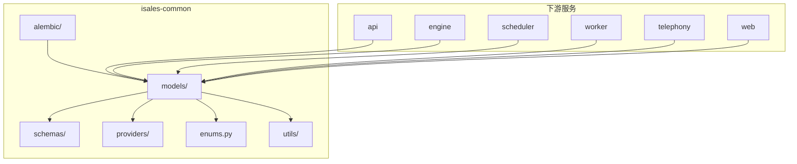
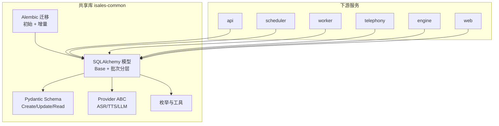
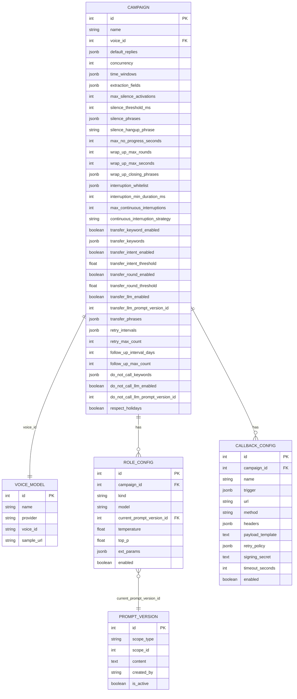
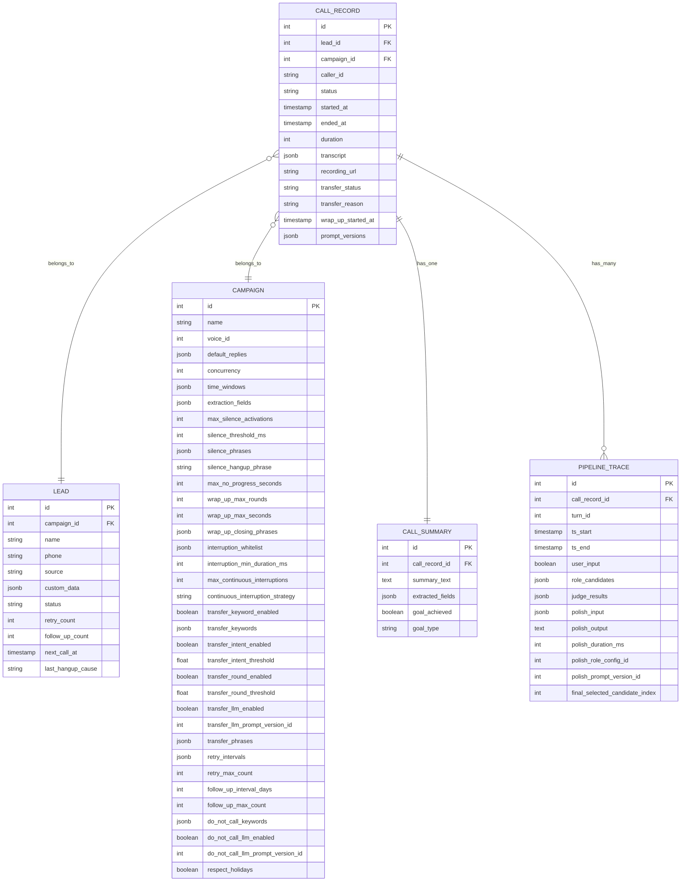
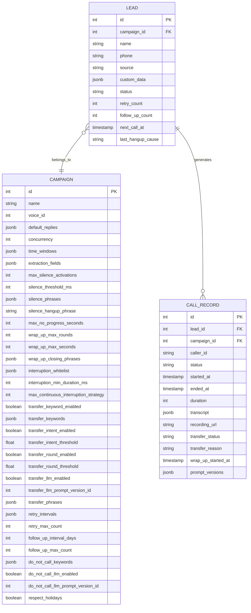
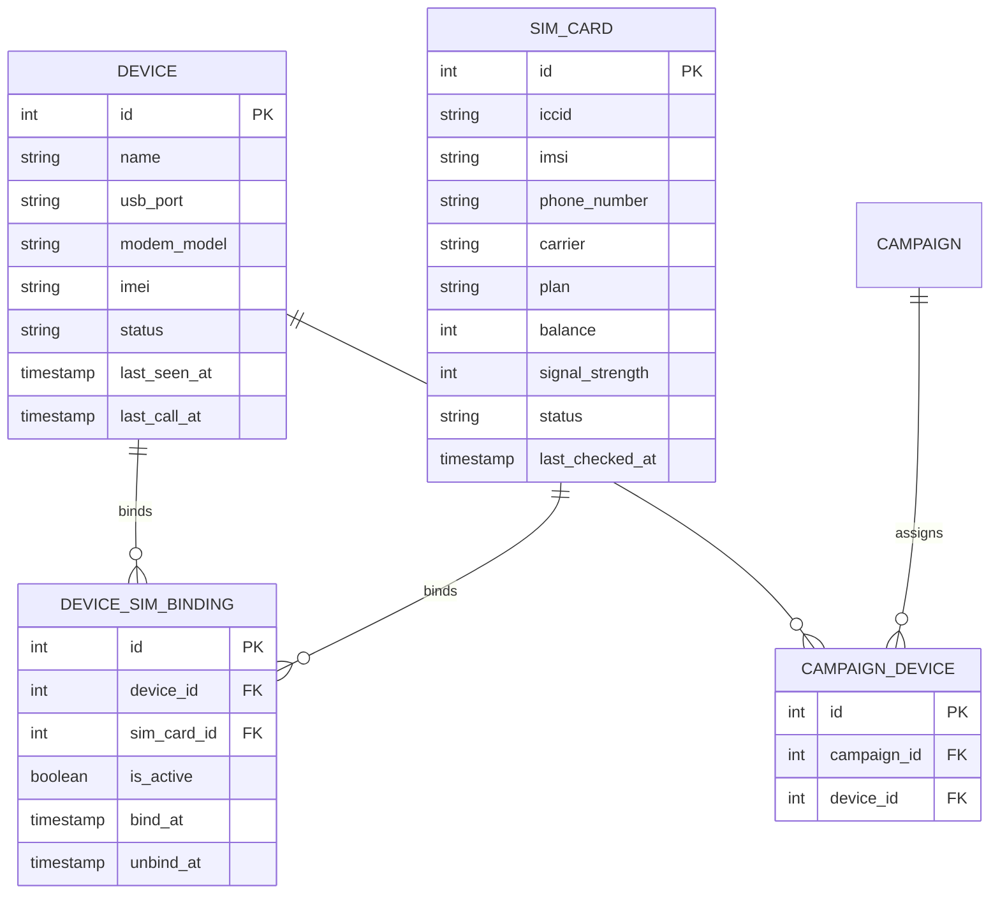
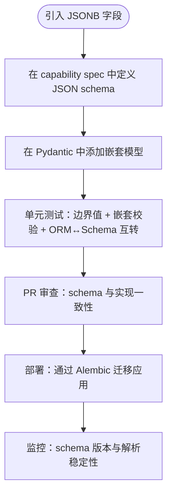
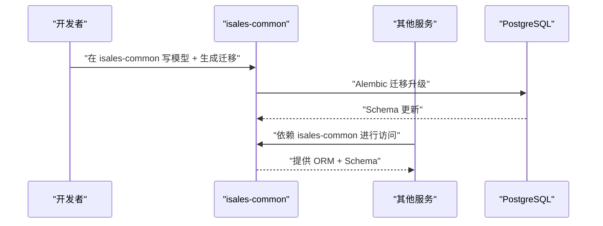
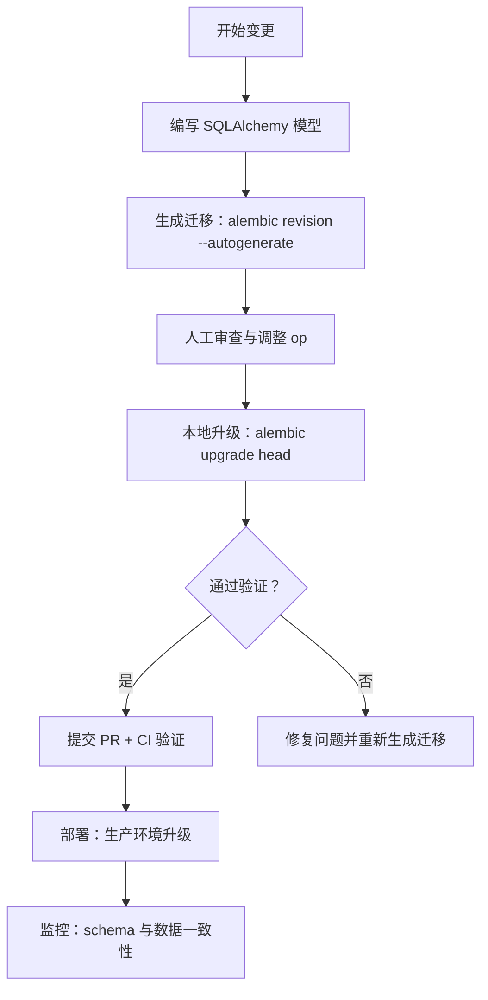
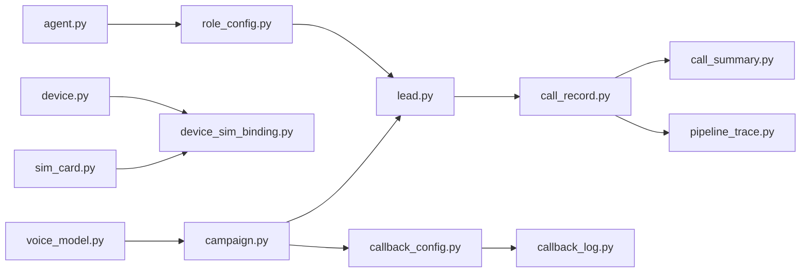

# 数据模型设计

<cite>
**本文档引用的文件**
- [spec.md](file://openspec/specs/data-model/spec.md)
- [design.md](file://openspec/changes/archive/2026-05-01-init-isales-common/design.md)
- [tasks.md](file://openspec/changes/archive/2026-05-01-init-isales-common/tasks.md)
- [proposal.md](file://openspec/changes/archive/2026-05-01-init-isales-common/proposal.md)
- [migrate.sh](file://deploy/linux/scripts/migrate.sh)
- [proposal.md](file://openspec/changes/archive/2026-05-06-impl-telephony/proposal.md)
- [tasks.md](file://openspec/changes/archive/2026-05-06-impl-telephony/tasks.md)
- [tasks.md](file://openspec/changes/campaign-fixed-greeting/tasks.md)
- [IMPLEMENTATION_PLAN.md](file://IMPLEMENTATION_PLAN.md)
</cite>

## 目录
1. [简介](#简介)
2. [项目结构](#项目结构)
3. [核心组件](#核心组件)
4. [架构总览](#架构总览)
5. [详细组件分析](#详细组件分析)
6. [依赖关系分析](#依赖关系分析)
7. [性能考虑](#性能考虑)
8. [故障排查指南](#故障排查指南)
9. [结论](#结论)
10. [附录](#附录)

## 简介
本文件面向 isales-common 数据模型设计，系统阐述 SQLAlchemy 模型设计原则、表结构定义、字段约束与关系映射，重点覆盖 campaign、call_record、lead、device 等关键实体，并说明 JSONB 字段使用规范、schema 约束与跨服务表归属原则。同时提供模型定义示例的代码片段路径、最佳实践（数据验证、序列化与反序列化）、Alembic 迁移管理机制与数据库版本控制策略。

## 项目结构
isales-common 采用模块化组织方式，将 SQLAlchemy 模型按业务域拆分至 models/ 目录，Pydantic Schema 按资源拆分至 schemas/ 目录，Provider 接口位于 providers/，公共枚举与工具位于 enums.py 与 utils/。迁移管理由 Alembic 负责，初始迁移一次性创建全部表，后续变更以增量迁移推进。

**图表来源**
- [design.md: 41-52:41-52](file://openspec/changes/archive/2026-05-01-init-isales-common/design.md#L41-L52)
- [IMPLEMENTATION_PLAN.md: 66-94:66-94](file://IMPLEMENTATION_PLAN.md#L66-L94)

**章节来源**
- [design.md: 41-52:41-52](file://openspec/changes/archive/2026-05-01-init-isales-common/design.md#L41-L52)
- [IMPLEMENTATION_PLAN.md: 66-94:66-94](file://IMPLEMENTATION_PLAN.md#L66-L94)

## 核心组件
- SQLAlchemy 模型：按批次分层构建，避免循环依赖，确保外键依赖链正确。
- Pydantic Schema：与 ORM 一一对应，提供 Create/Update/Read 三态模型，JSONB 字段以嵌套模型显式约束。
- Provider ABC：ASR/TTS/LLM 三套异步接口，统一输入输出模型与 JSON Mode 支持。
- 枚举与工具：统一的状态枚举与通用工具（号码归一化、加解密、Redis 客户端工厂）。
- Alembic 迁移：初始一次性迁移 + 后续增量迁移，保证数据库演进的可追溯性。

**章节来源**
- [design.md: 54-77:54-77](file://openspec/changes/archive/2026-05-01-init-isales-common/design.md#L54-L77)
- [design.md: 87-91:87-91](file://openspec/changes/archive/2026-05-01-init-isales-common/design.md#L87-L91)
- [design.md: 92-96:92-96](file://openspec/changes/archive/2026-05-01-init-isales-common/design.md#L92-L96)

## 架构总览
isales-common 作为共享库，统一管理数据模型与迁移，下游服务通过依赖该包进行数据库访问。数据库统一为 PostgreSQL，跨服务通信通过 Redis 消息体 schema 保持一致性。

**图表来源**
- [design.md: 11-26:11-26](file://openspec/changes/archive/2026-05-01-init-isales-common/design.md#L11-L26)
- [design.md: 41-52:41-52](file://openspec/changes/archive/2026-05-01-init-isales-common/design.md#L41-L52)

**章节来源**
- [design.md: 11-26:11-26](file://openspec/changes/archive/2026-05-01-init-isales-common/design.md#L11-L26)
- [design.md: 41-52:41-52](file://openspec/changes/archive/2026-05-01-init-isales-common/design.md#L41-L52)

## 详细组件分析

### campaign 实体设计
- 设计理念：campaign 为核心调度与配置中心，承载通话策略、重试与跟进规则、转人工阈值、JSONB 配置等。
- 关键字段与业务含义：
  - 名称与语音模板：name、voice_id
  - 并发与时间窗：concurrency、time_windows(JSONB)
  - 抽取字段与目标达成：extraction_fields(JSONB)、goal_achievement
  - 静默激活与静默挂断：max_silence_activations、silence_threshold_ms、silence_hangup_phrase
  - 安静短语与连续静默策略：silence_phrases(JSONB)、continuous_interruption_strategy
  - 转人工关键词与意图识别：transfer_keyword_enabled、transfer_keywords(JSONB)、transfer_intent_enabled、transfer_intent_threshold、transfer_round_enabled、transfer_round_threshold、transfer_llm_enabled、transfer_llm_prompt_version_id、transfer_phrases(JSONB)
  - 重试策略：retry_intervals(JSONB)、retry_max_count
  - 跟进周期：follow_up_interval_days、follow_up_max_count
  - 黑名单关键词与 LLM 判定：do_not_call_keywords(JSONB)、do_not_call_llm_enabled、do_not_call_llm_prompt_version_id
  - 节假日尊重：respect_holidays
- JSONB 字段约束：所有 JSONB 字段均附带 schema 描述，确保字段结构与类型约束清晰。
- 关系映射：与 voice_model 的外键关联；与 role_config、filler_set、callback_config 等通过主键关联。
- 最佳实践：
  - 使用 Pydantic 嵌套模型对 JSONB 字段进行结构化约束。
  - 在 API 层对 JSONB 字段进行严格校验与默认值处理。
  - 通过 Alembic 迁移管理 JSONB 字段的新增与变更。

**图表来源**
- [spec.md: 28-50:28-50](file://openspec/specs/data-model/spec.md#L28-L50)

**章节来源**
- [spec.md: 28-50:28-50](file://openspec/specs/data-model/spec.md#L28-L50)
- [design.md: 63-67:63-67](file://openspec/changes/archive/2026-05-01-init-isales-common/design.md#L63-L67)

### call_record 实体设计
- 设计理念：call_record 记录每次通话的生命周期与交互细节，支持转人工、转写与提示词版本追踪。
- 关键字段与业务含义：
  - 关联字段：lead_id、campaign_id、caller_id
  - 状态与时间：status、started_at、ended_at、duration
  - 转写与转人工：transcript(JSONB)、transfer_status、transfer_reason
  - Wrap-up 阶段：wrap_up_started_at
  - 提示词版本：prompt_versions(JSONB)
  - 录音链接：recording_url
- JSONB 字段约束：transcript 与 prompt_versions 以嵌套模型约束结构，确保转写事件与提示词版本的可解析性。
- 关系映射：与 lead、campaign 的外键关联；与 call_summary、pipeline_trace 通过主键关联。
- 最佳实践：
  - 将转写事件按时间窗口组织，便于检索与审计。
  - 对提示词版本进行版本号追踪，支持回溯与对比。

**图表来源**
- [spec.md: 37-44:37-44](file://openspec/specs/data-model/spec.md#L37-L44)

**章节来源**
- [spec.md: 37-44:37-44](file://openspec/specs/data-model/spec.md#L37-L44)
- [design.md: 63-67:63-67](file://openspec/changes/archive/2026-05-01-init-isales-common/design.md#L63-L67)

### lead 实体设计
- 设计理念：lead 代表潜在客户，承载重试次数、跟进次数、下次呼叫时间与最后挂断原因等 Retry-Followup 逻辑所需信息。
- 关键字段与业务含义：
  - 基本信息：name、phone、source、custom_data(JSONB)
  - 状态与统计：status、retry_count、follow_up_count
  - 时间与原因：next_call_at、last_hangup_cause
- JSONB 字段约束：custom_data 以嵌套模型约束结构，确保自定义字段的可解析性。
- 关系映射：与 campaign 的外键关联；与 call_record 通过主键关联。
- 最佳实践：
  - 在 API 层对 next_call_at 进行时区与有效性校验。
  - 对 last_hangup_cause 进行枚举化，便于统计与报表。

**图表来源**
- [spec.md: 37-38:37-38](file://openspec/specs/data-model/spec.md#L37-L38)

**章节来源**
- [spec.md: 37-38:37-38](file://openspec/specs/data-model/spec.md#L37-L38)
- [design.md: 63-67:63-67](file://openspec/changes/archive/2026-05-01-init-isales-common/design.md#L63-L67)

### device 实体设计
- 设计理念：device 代表拨号设备，承载设备状态、硬件信息与最近活动时间，支持 Telephony 服务的设备选择与健康监控。
- 关键字段与业务含义：
  - 硬件信息：name、usb_port、modem_model、imei
  - 状态与时间：status、last_seen_at、last_call_at
- JSONB 字段约束：无 JSONB 字段。
- 关系映射：与 sim_card 通过 device_sim_binding 关联；与 campaign 通过 campaign_device 关联。
- 最佳实践：
  - 在 Telephony 服务中使用行级锁进行设备选择的并发安全。
  - 对 last_call_at 进行时区与时效校验，确保设备活跃度判断准确。

**图表来源**
- [spec.md: 46-49:46-49](file://openspec/specs/data-model/spec.md#L46-L49)

**章节来源**
- [spec.md: 46-49:46-49](file://openspec/specs/data-model/spec.md#L46-L49)
- [proposal.md: 9-13:9-13](file://openspec/changes/archive/2026-05-06-impl-telephony/proposal.md#L9-L13)
- [tasks.md: 5-10:5-10](file://openspec/changes/archive/2026-05-06-impl-telephony/tasks.md#L5-L10)

### JSONB 字段使用规范与 Schema 约束
- 使用规范：
  - JSONB 字段用于半结构化的配置或事件流，必须附带 schema 描述。
  - 任何新引入的 JSONB 字段必须在对应 capability spec 中描述其 JSON schema（键、值类型、必填可选）。
  - JSONB 不替代关系建模：强结构与外键关系应使用独立表与外键，不得用 JSONB 简化。
- Schema 约束：
  - 在 Pydantic 中以嵌套模型显式描述 JSONB 结构，作为约束的事实来源。
  - 通过单元测试验证边界值、空值、超长、JSONB 嵌套校验与 ORM ↔ Schema 互转。
- 示例路径：
  - JSONB 嵌套模型定义：[schemas/jsonb/...:50-50](file://openspec/changes/archive/2026-05-01-init-isales-common/tasks.md#L50-L50)
  - 转写事件与提示词版本嵌套模型：[schemas/call.py:53-53](file://openspec/changes/archive/2026-05-01-init-isales-common/tasks.md#L53-L53)

**图表来源**
- [spec.md: 61-74:61-74](file://openspec/specs/data-model/spec.md#L61-L74)
- [design.md: 63-67:63-67](file://openspec/changes/archive/2026-05-01-init-isales-common/design.md#L63-L67)

**章节来源**
- [spec.md: 61-74:61-74](file://openspec/specs/data-model/spec.md#L61-L74)
- [design.md: 63-67:63-67](file://openspec/changes/archive/2026-05-01-init-isales-common/design.md#L63-L67)

### 跨服务表归属原则
- 归属决定：每张表标记其主要业务归属，归属决定 schema 演进与 PR 主导权，多个服务可读写但归属仅一个。
- 生命周期归属：当某张关联表的生命周期跟随归属 A 而非归属 B（例如 campaign_device 跟随 campaign 的启停而非 device 的插拔），归属设为 A。
- 表清单完整性：所有持久化表必须包含且仅包含 data-model spec 中列出的表集合。
- 迁移单一来源：Alembic 迁移仅由 isales-common 管理，其他服务不得引入独立迁移工具。

**图表来源**
- [spec.md: 9-17:9-17](file://openspec/specs/data-model/spec.md#L9-L17)
- [spec.md: 19-26:19-26](file://openspec/specs/data-model/spec.md#L19-L26)

**章节来源**
- [spec.md: 9-17:9-17](file://openspec/specs/data-model/spec.md#L9-L17)
- [spec.md: 19-26:19-26](file://openspec/specs/data-model/spec.md#L19-L26)

### 数据验证、序列化与反序列化最佳实践
- 数据验证：
  - 使用 Pydantic 对输入进行严格校验，Create/Update/Read 三态模型分别约束必填、可选与完整字段。
  - 对 JSONB 字段使用嵌套模型进行结构化约束，确保字段类型与必填性。
- 序列化与反序列化：
  - ORM ↔ Schema 互转时启用 from_attributes=True，确保直接从 ORM 对象构造 Schema。
  - 跨服务消息体统一使用 Pydantic 模型，避免裸 dict，确保字段名与类型一致性。
- 示例路径：
  - 通用基类与 from_attributes 配置：[schemas/_base.py:49-49](file://openspec/changes/archive/2026-05-01-init-isales-common/tasks.md#L49-L49)
  - CallRecordRead 嵌套模型：[schemas/call.py:53-53](file://openspec/changes/archive/2026-05-01-init-isales-common/tasks.md#L53-L53)

**章节来源**
- [design.md: 54-59:54-59](file://openspec/changes/archive/2026-05-01-init-isales-common/design.md#L54-L59)
- [design.md: 63-67:63-67](file://openspec/changes/archive/2026-05-01-init-isales-common/design.md#L63-L67)

### Alembic 迁移管理机制与数据库版本控制策略
- 初始迁移策略：v1 用一条迁移把 19 张表全部建好，随后每次 schema 变更走单独的 Alembic revision。
- 迁移命名与流程：遵循现有风格（revision id + verb_topic），本地运行 upgrade head 验证，必要时手工调整生成的 op。
- 部署与回滚：部署脚本中通过 alembic.ini 指定配置，支持 dry-run 与实际升级；回滚通过 downgrade -1 实现。
- 示例路径：
  - 初始一次性迁移与后续增量迁移：[design.md: 92-96:92-96](file://openspec/changes/archive/2026-05-01-init-isales-common/design.md#L92-L96)
  - 增量迁移示例（campaign greeting 字段）：[tasks.md:9-12](file://openspec/changes/campaign-fixed-greeting/tasks.md#L9-L12)
  - 部署脚本中的 Alembic 调用：[migrate.sh:39-60](file://deploy/linux/scripts/migrate.sh#L39-L60)

**图表来源**
- [design.md: 92-96:92-96](file://openspec/changes/archive/2026-05-01-init-isales-common/design.md#L92-L96)
- [tasks.md:9-12](file://openspec/changes/campaign-fixed-greeting/tasks.md#L9-L12)
- [migrate.sh:39-60](file://deploy/linux/scripts/migrate.sh#L39-L60)

**章节来源**
- [design.md: 92-96:92-96](file://openspec/changes/archive/2026-05-01-init-isales-common/design.md#L92-L96)
- [tasks.md:9-12](file://openspec/changes/campaign-fixed-greeting/tasks.md#L9-L12)
- [migrate.sh:39-60](file://deploy/linux/scripts/migrate.sh#L39-L60)

## 依赖关系分析
- 模型分批顺序：批次 A（无外键）→ 批次 B（依赖 A）→ 批次 C（依赖 B），避免循环依赖。
- 外键关系：campaign → role_config、lead → campaign、call_record → lead/campaign、call_summary → call_record、pipeline_trace → call_record、callback_log → callback_config/call_record。
- 下游依赖：api/engine/scheduler/worker/telephony/web 通过依赖 isales-common 获取 ORM 与 Schema。

**图表来源**
- [design.md: 47-52:47-52](file://openspec/changes/archive/2026-05-01-init-isales-common/design.md#L47-L52)

**章节来源**
- [design.md: 47-52:47-52](file://openspec/changes/archive/2026-05-01-init-isales-common/design.md#L47-L52)

## 性能考虑
- 异步会话与连接池：使用 SQLAlchemy 2.x 异步 session，结合 asyncpg 与连接池管理，减少阻塞。
- 查询优化：合理使用索引（如时间字段、状态字段、外键字段），避免 N+1 查询；对 JSONB 字段建立 GIN 索引以提升查询性能。
- 事务边界：严格控制事务范围，避免长时间持有锁；对高并发场景使用行级锁（如设备选择）。
- 缓存策略：对热点数据（如 voice_model、prompt_version）进行缓存，降低数据库压力。

## 故障排查指南
- 迁移失败：
  - 检查 alembic.ini 配置与数据库连接字符串。
  - 使用 dry-run 查看历史迁移，确认缺失的迁移文件。
  - 逐条迁移回放，定位具体失败步骤。
- 数据不一致：
  - 对比 ORM 与 Schema 的字段定义，确保 from_attributes=True 正确配置。
  - 校验 JSONB 字段的嵌套模型与实际数据结构是否一致。
- 性能问题：
  - 分析慢查询日志，检查索引使用情况。
  - 评估事务范围与锁竞争，优化并发策略。

**章节来源**
- [migrate.sh:39-60](file://deploy/linux/scripts/migrate.sh#L39-L60)
- [design.md: 106-116:106-116](file://openspec/changes/archive/2026-05-01-init-isales-common/design.md#L106-L116)

## 结论
isales-common 通过统一的数据模型设计、严格的 JSONB 字段约束、清晰的跨服务归属原则与完善的 Alembic 迁移管理，为 7 仓库微服务架构提供了稳定可靠的数据基础设施。遵循本文档的最佳实践，可确保模型演进的可控性、数据的一致性与系统的可维护性。

## 附录
- 代码片段路径示例：
  - campaign 模型字段定义：[models/campaign.py:31-31](file://openspec/changes/archive/2026-05-01-init-isales-common/tasks.md#L31-L31)
  - call_record 模型字段定义：[models/call_record.py:41-41](file://openspec/changes/archive/2026-05-01-init-isales-common/tasks.md#L41-L41)
  - lead 模型字段定义：[models/lead.py:40-40](file://openspec/changes/archive/2026-05-01-init-isales-common/tasks.md#L40-L40)
  - device 模型字段定义：[models/device.py:26-26](file://openspec/changes/archive/2026-05-01-init-isales-common/tasks.md#L26-L26)
  - JSONB 嵌套模型：[schemas/jsonb/...:50-50](file://openspec/changes/archive/2026-05-01-init-isales-common/tasks.md#L50-L50)
  - CallRecordRead 嵌套模型：[schemas/call.py:53-53](file://openspec/changes/archive/2026-05-01-init-isales-common/tasks.md#L53-L53)
  - 设备选择请求/响应 Schema：[schemas/device.py:5-6](file://openspec/changes/archive/2026-05-06-impl-telephony/tasks.md#L5-L6)
  - 增量迁移示例：[alembic/versions/...:9-12](file://openspec/changes/campaign-fixed-greeting/tasks.md#L9-L12)