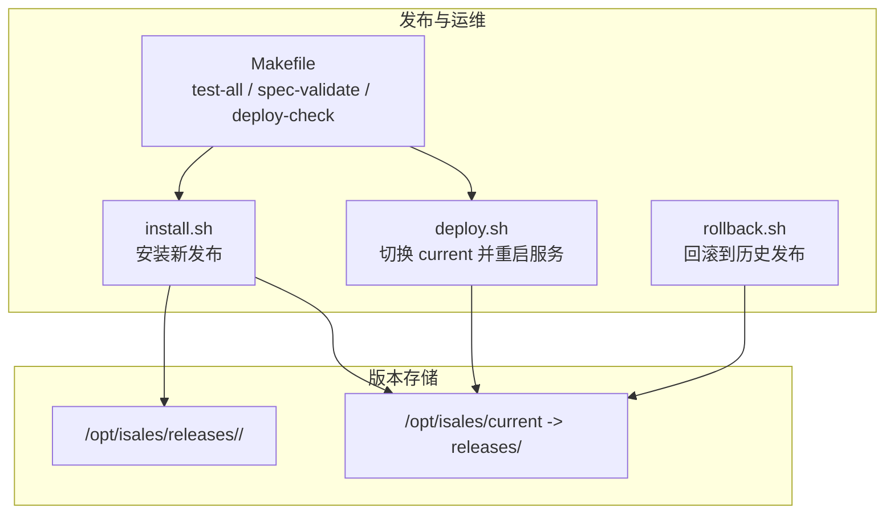
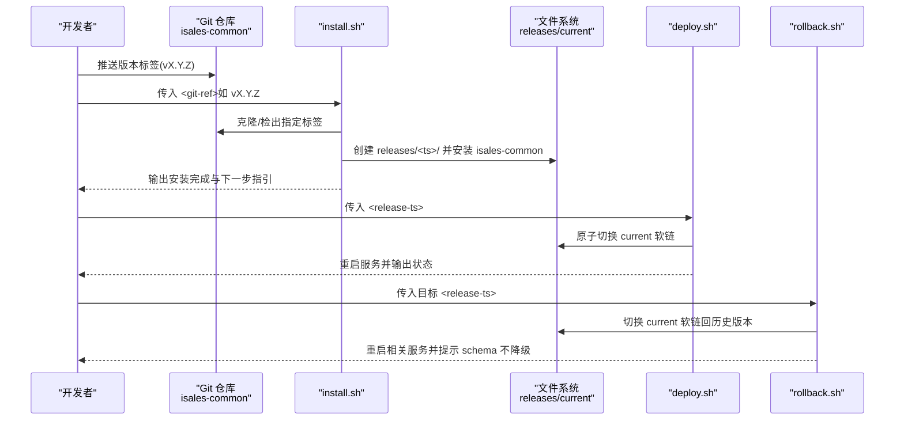
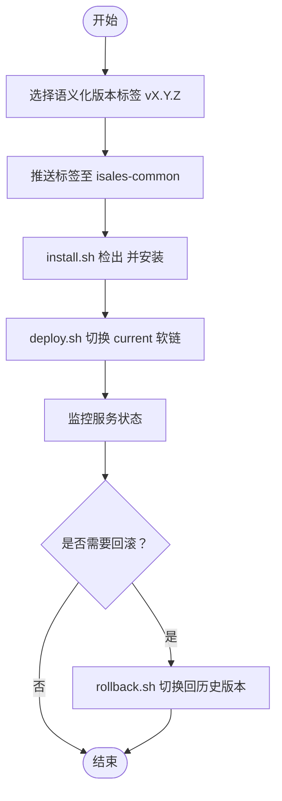
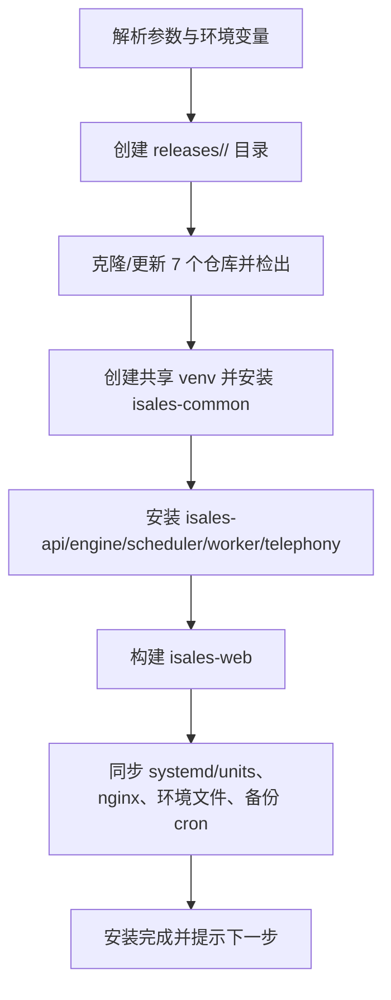
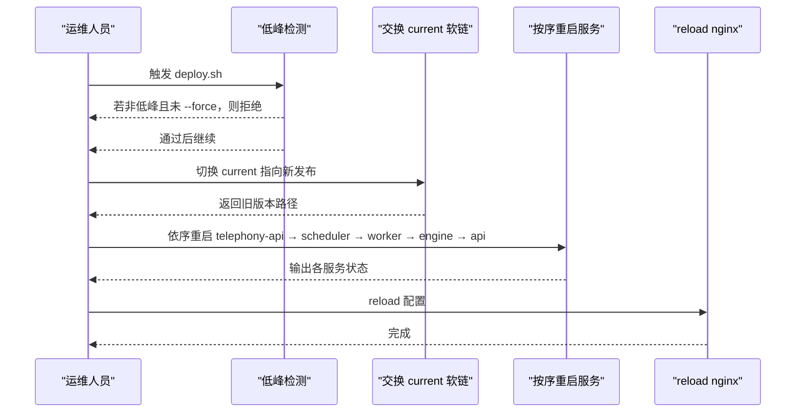
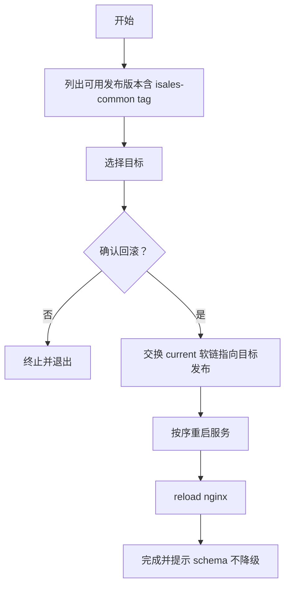
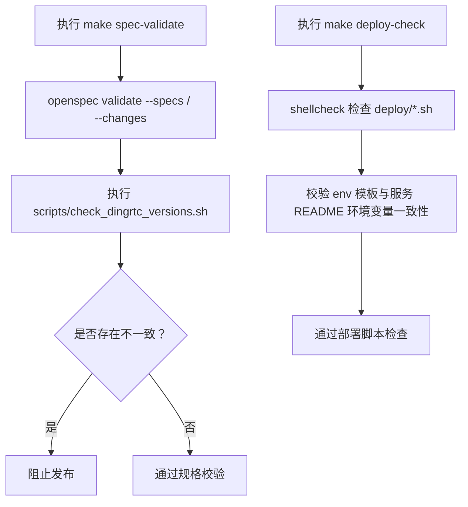
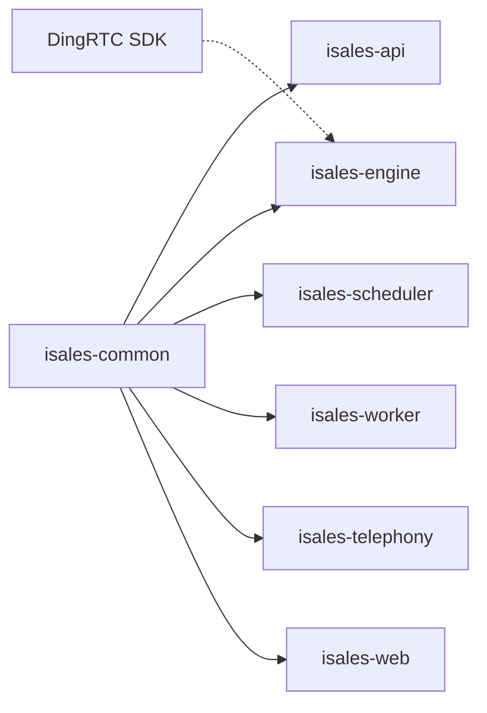

# 版本管理机制

<cite>
**本文引用的文件**
- [README.md](file://README.md)
- [DESIGN.md](file://DESIGN.md)
- [deploy/README.md](file://deploy/README.md)
- [deploy/linux/scripts/install.sh](file://deploy/linux/scripts/install.sh)
- [deploy/linux/scripts/deploy.sh](file://deploy/linux/scripts/deploy.sh)
- [deploy/linux/scripts/rollback.sh](file://deploy/linux/scripts/rollback.sh)
- [Makefile](file://Makefile)
- [scripts/check_dingrtc_versions.sh](file://scripts/check_dingrtc_versions.sh)
- [deploy/cloud/README.md](file://deploy/cloud/README.md)
- [deploy/edge/README.md](file://deploy/edge/README.md)
</cite>

## 目录
1. [简介](#简介)
2. [项目结构](#项目结构)
3. [核心组件](#核心组件)
4. [架构总览](#架构总览)
5. [详细组件分析](#详细组件分析)
6. [依赖关系分析](#依赖关系分析)
7. [性能考量](#性能考量)
8. [故障排查指南](#故障排查指南)
9. [结论](#结论)
10. [附录](#附录)

## 简介
本文件面向 isales-common 跨仓共享组件的版本管理机制，系统阐述版本号规范、发布周期、兼容性保证、升级触发条件、影响评估与回滚机制，并结合仓库提供的部署脚本与运维手册，给出依赖管理策略、版本锁定与发布流程的质量保障措施。目标是帮助读者在理解现有机制的基础上，安全、可控地进行版本升级与发布。

## 项目结构
- 仓库采用“主仓 + 多子仓”的组织方式，isales-common 作为 Pydantic/SQLAlchemy 模型与跨仓共享 schema 的核心，被 isales-api、isales-engine、isales-scheduler、isales-worker、isales-telephony、isales-web 等服务以开发模式依赖。
- 发布与运维通过 deploy/ 目录下的脚本完成，统一采用“按时间戳的 releases 目录 + current 原子软链”的发布模型，确保切换与回滚原子且可逆。
- Makefile 提供跨仓测试与规格校验的入口，辅助质量门禁。

图表来源
- [deploy/linux/scripts/install.sh:1-275](file://deploy/linux/scripts/install.sh#L1-L275)
- [deploy/linux/scripts/deploy.sh:1-139](file://deploy/linux/scripts/deploy.sh#L1-L139)
- [deploy/linux/scripts/rollback.sh:1-114](file://deploy/linux/scripts/rollback.sh#L1-L114)
- [Makefile:1-30](file://Makefile#L1-L30)

章节来源
- [README.md:1-86](file://README.md#L1-L86)
- [deploy/README.md:1-112](file://deploy/README.md#L1-L112)

## 核心组件
- 版本号与发布标签
  - 示例使用语义化版本标签，如 v0.1.0、v1.0.0，用于 install.sh 的 <git-ref> 参数。
  - isales-common 作为共享依赖，会在 install.sh 中优先安装，确保其他服务依赖的稳定性。
- 发布模型
  - 每次安装在 /opt/isales/releases/<ts>/ 下生成新的发布目录，随后通过 deploy.sh 原子切换 current 软链，实现零停机或低停机窗口的切换。
- 回滚机制
  - rollback.sh 将 current 指针切换回历史发布，不触碰数据库 schema，避免数据回退风险。
- 质量门禁
  - Makefile 的 spec-validate 与 deploy-check 作为发布前置检查，确保 OpenSpec 规范一致性与部署脚本质量。

章节来源
- [README.md:32-44](file://README.md#L32-L44)
- [deploy/linux/scripts/install.sh:106-116](file://deploy/linux/scripts/install.sh#L106-L116)
- [deploy/linux/scripts/deploy.sh:10-16](file://deploy/linux/scripts/deploy.sh#L10-L16)
- [deploy/linux/scripts/rollback.sh:10-13](file://deploy/linux/scripts/rollback.sh#L10-L13)
- [Makefile:8-17](file://Makefile#L8-L17)

## 架构总览
下图展示 isales-common 在跨仓共享组件中的版本管理与发布流程，强调版本号、安装、切换与回滚的关键节点。

图表来源
- [deploy/linux/scripts/install.sh:106-116](file://deploy/linux/scripts/install.sh#L106-L116)
- [deploy/linux/scripts/install.sh:259-272](file://deploy/linux/scripts/install.sh#L259-L272)
- [deploy/linux/scripts/deploy.sh:70-78](file://deploy/linux/scripts/deploy.sh#L70-L78)
- [deploy/linux/scripts/rollback.sh:89-110](file://deploy/linux/scripts/rollback.sh#L89-L110)

## 详细组件分析

### 组件A：版本号与标签策略
- 语义化版本（SemVer）
  - 使用 X.Y.Z 格式的主/次/补丁版本号，示例出现在 README 与 cloud/edge 部署说明中。
  - 仓库未定义强制的 pre-release 或 metadata 规则，建议遵循“功能新增为次版本、破坏性变更为主版本、修复为补丁”的通用实践。
- 标签命名与引用
  - install.sh 的 <git-ref> 参数即为版本标签；install.sh 会基于该标签克隆并检出对应提交。
  - rollback.sh 通过列出 releases 目录并读取 isales-common 的 tag 描述，辅助选择回滚目标。

图表来源
- [README.md:32-44](file://README.md#L32-L44)
- [deploy/linux/scripts/install.sh:37-49](file://deploy/linux/scripts/install.sh#L37-L49)
- [deploy/linux/scripts/rollback.sh:52-63](file://deploy/linux/scripts/rollback.sh#L52-L63)

章节来源
- [README.md:32-44](file://README.md#L32-L44)
- [deploy/linux/scripts/install.sh:37-49](file://deploy/linux/scripts/install.sh#L37-L49)
- [deploy/linux/scripts/rollback.sh:52-63](file://deploy/linux/scripts/rollback.sh#L52-L63)

### 组件B：安装与发布流程（install.sh）
- 关键步骤
  - 解析参数与环境变量（如 ISALES_GIT_BASE、ISALES_REPOS），创建 releases/<ts>/ 目录。
  - 克隆/更新 7 个仓库并检出 <git-ref>。
  - 创建共享 venv，先安装 isales-common，再安装其余服务，确保依赖顺序正确。
  - 构建 isales-web，同步 systemd/units、nginx 配置、环境文件与备份 cron。
- 版本锁定与依赖管理
  - 通过 pip 安装 isales-common 与各服务的开发模式路径，形成对 isales-common 的显式依赖。
  - 由于未发现 requirements.txt 或 pyproject.toml 的版本锁定片段，建议在 isales-common 的 pyproject.toml 或 setup.cfg 中明确版本约束，或在 CI 中引入 pip-tools/lockfile 以固定依赖版本。

图表来源
- [deploy/linux/scripts/install.sh:85-102](file://deploy/linux/scripts/install.sh#L85-L102)
- [deploy/linux/scripts/install.sh:106-116](file://deploy/linux/scripts/install.sh#L106-L116)
- [deploy/linux/scripts/install.sh:119-126](file://deploy/linux/scripts/install.sh#L119-L126)
- [deploy/linux/scripts/install.sh:128-194](file://deploy/linux/scripts/install.sh#L128-L194)
- [deploy/linux/scripts/install.sh:196-236](file://deploy/linux/scripts/install.sh#L196-L236)
- [deploy/linux/scripts/install.sh:238-255](file://deploy/linux/scripts/install.sh#L238-L255)

章节来源
- [deploy/linux/scripts/install.sh:1-275](file://deploy/linux/scripts/install.sh#L1-L275)

### 组件C：发布切换与重启（deploy.sh）
- 低峰期门禁
  - 默认在低峰时段（如 22:00–08:00）才允许重启 engine 服务，否则需显式传入 --force。
- 原子切换
  - 通过交换 current 软链实现原子切换，避免部分服务启动导致的不一致。
- 重启顺序
  - 按照拓扑依赖顺序依次重启服务，最后 reload nginx，必要时可选择重启 modem-controller。

图表来源
- [deploy/linux/scripts/deploy.sh:51-68](file://deploy/linux/scripts/deploy.sh#L51-L68)
- [deploy/linux/scripts/deploy.sh:70-78](file://deploy/linux/scripts/deploy.sh#L70-L78)
- [deploy/linux/scripts/deploy.sh:80-114](file://deploy/linux/scripts/deploy.sh#L80-L114)
- [deploy/linux/scripts/deploy.sh:116-128](file://deploy/linux/scripts/deploy.sh#L116-L128)

章节来源
- [deploy/linux/scripts/deploy.sh:1-139](file://deploy/linux/scripts/deploy.sh#L1-L139)

### 组件D：回滚机制（rollback.sh）
- 行为特征
  - 仅切换 current 软链，不触碰数据库 schema；若需降级 schema，请参考 RUNBOOK 中的专用流程。
  - 支持列出可用发布版本，读取 isales-common 的 tag 信息辅助决策。
- 适用场景
  - 服务启动失败、配置错误、第三方 SDK 版本不兼容等，可在不回退数据的前提下快速恢复。

图表来源
- [deploy/linux/scripts/rollback.sh:42-63](file://deploy/linux/scripts/rollback.sh#L42-L63)
- [deploy/linux/scripts/rollback.sh:78-110](file://deploy/linux/scripts/rollback.sh#L78-L110)

章节来源
- [deploy/linux/scripts/rollback.sh:1-114](file://deploy/linux/scripts/rollback.sh#L1-L114)

### 组件E：质量门禁与规格一致性（Makefile 与脚本）
- 跨仓测试
  - test-all 顺序运行各仓测试，任一失败即返回非零，确保跨仓改动不会破坏整体功能。
- OpenSpec 规格校验
  - spec-validate 校验所有 specs 与 active changes，同时执行 DingRTC 版本一致性检查，阻断版本/哈希不一致问题进入发布。
- 部署脚本静态检查
  - deploy-check 对 deploy/ 下的 bash 脚本进行 shellcheck，并比对 env 模板与各服务 README 的环境变量列表，确保部署一致性。

图表来源
- [Makefile:8-17](file://Makefile#L8-L17)
- [Makefile:19-29](file://Makefile#L19-L29)
- [scripts/check_dingrtc_versions.sh](file://scripts/check_dingrtc_versions.sh)

章节来源
- [Makefile:1-30](file://Makefile#L1-L30)

### 组件F：跨仓共享组件的依赖管理与版本锁定
- 现状
  - install.sh 显式安装 isales-common，确保其他服务依赖其最新标签版本。
  - 未在仓库中发现 requirements.txt 或 pyproject.toml 的版本锁定片段。
- 建议
  - 在 isales-common 的 pyproject.toml/setup.cfg 中明确版本约束，或引入 pip-tools 生成 lockfile，CI 中使用 pip-sync 或 pip install -r requirements.txt 来固定依赖。
  - 对于第三方 SDK（如 DingRTC），结合 spec-validate 中的版本一致性检查，确保 SDK 版本、SHA256 与文档一致。

章节来源
- [deploy/linux/scripts/install.sh:106-116](file://deploy/linux/scripts/install.sh#L106-L116)
- [Makefile:8-17](file://Makefile#L8-L17)

### 组件G：发布流程与质量保证
- 发布流程（Linux 主机）
  - provision → edit env → install vX.Y.Z → migrate → deploy <release-ts>
- 发布流程（Cloud/Edge 模型）
  - provision → install-dingrtc-sdk（Cloud）→ edit env → install vX.Y.Z → migrate → activate（Cloud）/ install（Edge）→ 启动服务
- 质量保证
  - 通过 Makefile 的 test-all、spec-validate、deploy-check 构建三道质量门；配合 rollback 机制降低发布风险。

章节来源
- [deploy/README.md:63-81](file://deploy/README.md#L63-L81)
- [deploy/cloud/README.md:71-92](file://deploy/cloud/README.md#L71-L92)
- [deploy/edge/README.md:55-75](file://deploy/edge/README.md#L55-L75)

## 依赖关系分析
- 组件耦合
  - isales-common 为共享依赖，install.sh 中优先安装，确保其他服务的依赖稳定。
  - deploy.sh/rollback.sh 仅操作 current 软链与服务重启，不直接修改数据库 schema，降低耦合风险。
- 外部依赖
  - DingRTC SDK（Cloud 模式）通过独立脚本安装，版本与哈希在 spec-validate 中被严格校验。
- 循环依赖
  - 未发现循环依赖迹象；各服务通过 isales-common 单向依赖。

图表来源
- [deploy/linux/scripts/install.sh:106-116](file://deploy/linux/scripts/install.sh#L106-L116)
- [deploy/cloud/README.md:77-78](file://deploy/cloud/README.md#L77-L78)
- [Makefile:8-17](file://Makefile#L8-L17)

章节来源
- [deploy/linux/scripts/install.sh:106-116](file://deploy/linux/scripts/install.sh#L106-L116)
- [deploy/cloud/README.md:77-78](file://deploy/cloud/README.md#L77-L78)

## 性能考量
- 发布窗口
  - deploy.sh 的低峰期门禁避免 engine 重启带来的通话中断，建议将发布安排在业务低谷时段。
- 原子切换
  - current 软链切换为 O(1)，避免逐文件替换的 IO 开销，提升切换效率。
- 重启顺序
  - 严格的依赖顺序减少服务间等待与冲突，缩短恢复时间。

## 故障排查指南
- 发布失败
  - 检查 install.sh 是否成功创建 venv 与安装 isales-common；核对 <git-ref> 是否存在。
- 服务无法启动
  - 使用 deploy.sh 的 dry-run 与 force 选项谨慎验证；查看各服务最近日志定位问题。
- 回滚确认
  - rollback.sh 会提示 schema 不降级，若需降级请参考 RUNBOOK 中的专用流程。
- 环境变量不一致
  - 使用 deploy-check 校验 env 模板与服务 README 的环境变量列表，避免遗漏或拼写错误。

章节来源
- [deploy/linux/scripts/install.sh:259-272](file://deploy/linux/scripts/install.sh#L259-L272)
- [deploy/linux/scripts/deploy.sh:90-103](file://deploy/linux/scripts/deploy.sh#L90-L103)
- [deploy/linux/scripts/rollback.sh:80-87](file://deploy/linux/scripts/rollback.sh#L80-L87)
- [Makefile:19-29](file://Makefile#L19-L29)

## 结论
isales-common 的版本管理机制以“标签驱动 + 原子软链切换”为核心，结合 install.sh/ deploy.sh/ rollback.sh 的标准化流程，实现了可追踪、可回滚、低风险的发布与运维。通过 Makefile 的跨仓测试与规格校验，以及对第三方 SDK 的版本一致性检查，进一步提升了发布质量与稳定性。建议在 isales-common 中完善版本约束与 lockfile，以强化依赖管理与可重复构建。

## 附录
- 版本升级操作指南（概要）
  - 选择语义化版本标签 vX.Y.Z，确保 isales-common 与相关服务的兼容性。
  - 在 CI 中执行 make spec-validate 与 make deploy-check，通过后再进行安装。
  - 使用 install.sh 安装新版本，执行 migrate（如涉及 schema 变更），在低峰期使用 deploy.sh 切换。
  - 如遇问题，使用 rollback.sh 快速回滚，必要时参考 RUNBOOK 进行 schema 降级。
- 向后兼容性检查与破坏性变更处理
  - 在 OpenSpec 设计文档中记录破坏性变更的影响范围与迁移路径。
  - 通过 Makefile 的 test-all 与 spec-validate 提前发现潜在问题。
  - 对第三方 SDK（如 DingRTC）保持版本与哈希的一致性，避免隐式破坏性变更。

章节来源
- [README.md:75-85](file://README.md#L75-L85)
- [DESIGN.md:49-55](file://DESIGN.md#L49-L55)
- [Makefile:1-30](file://Makefile#L1-L30)