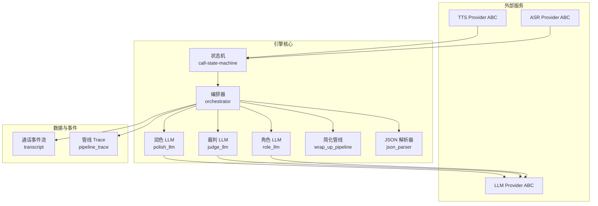
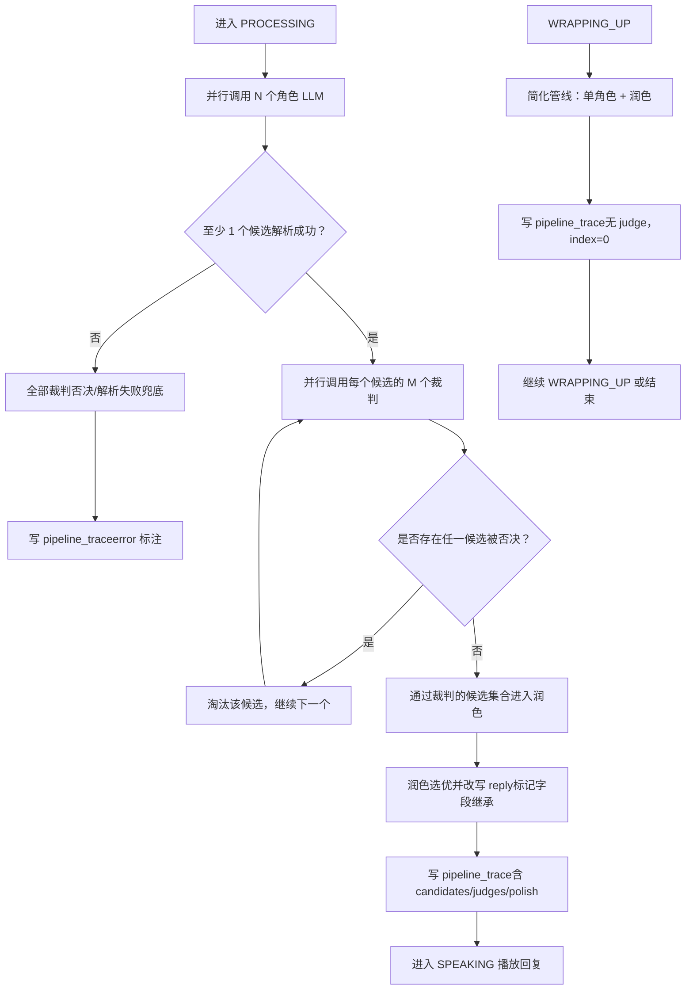
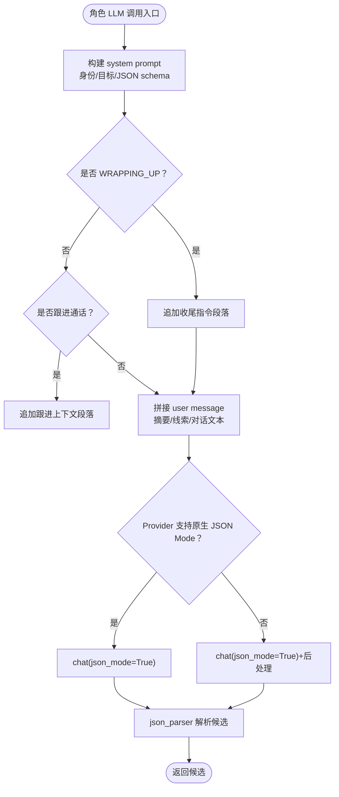
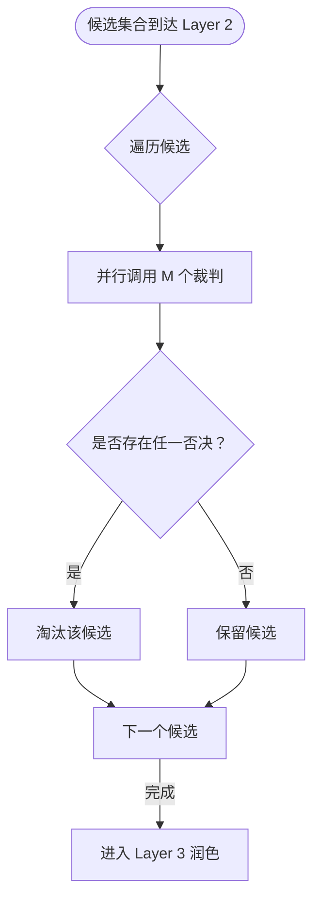
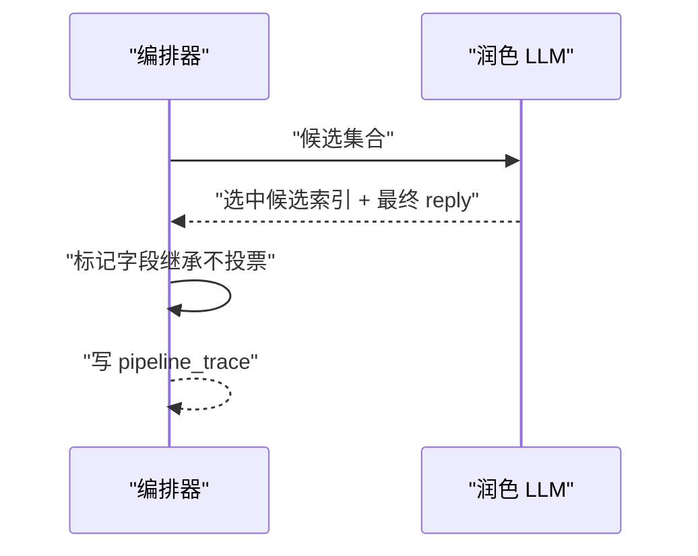
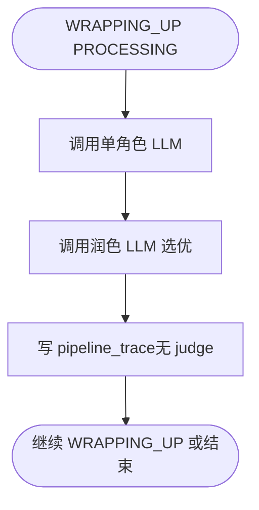
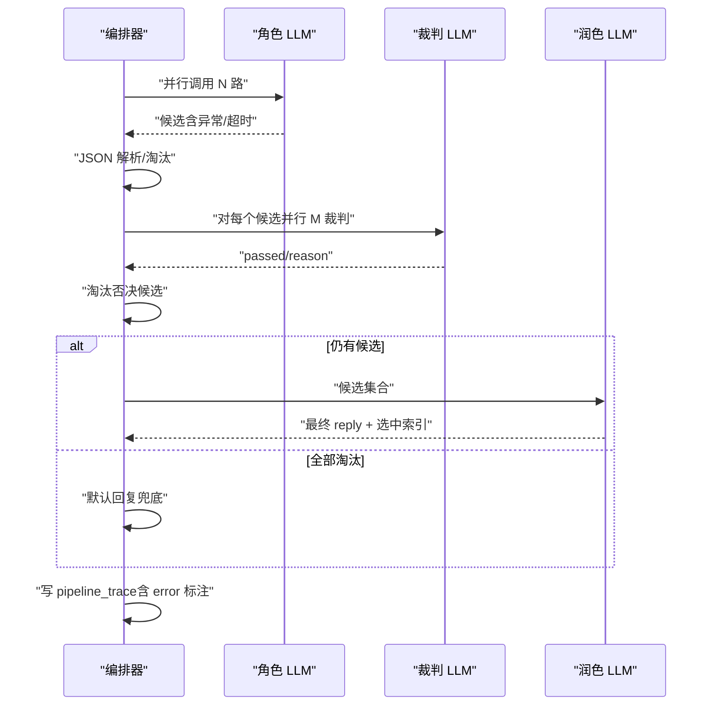
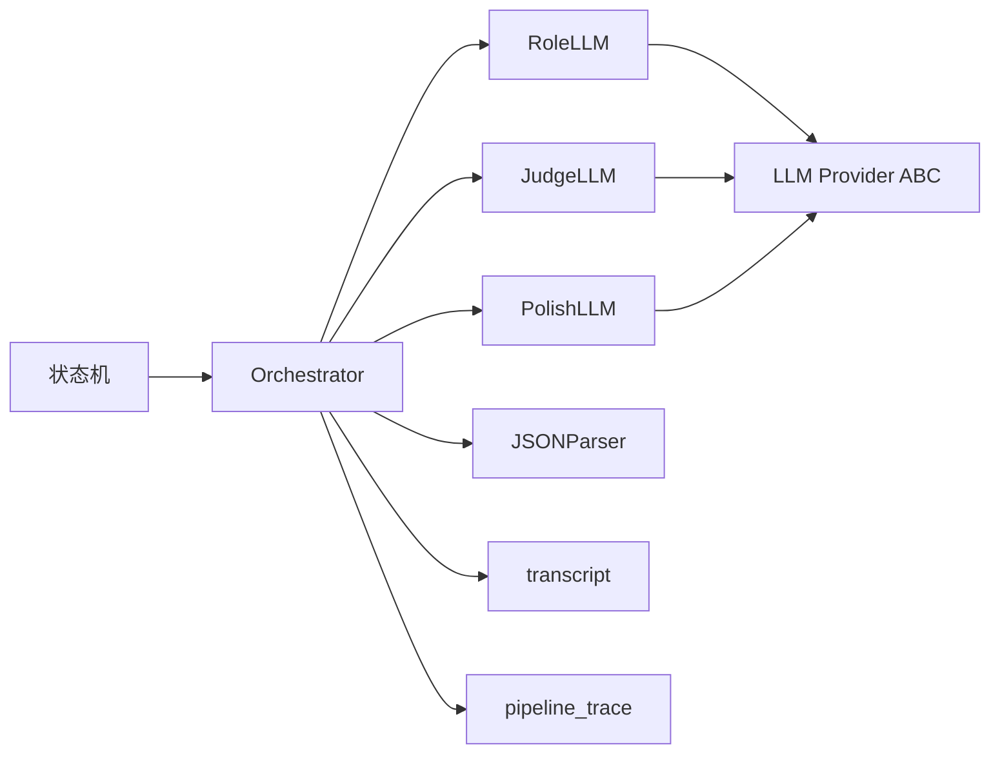

# AI 三层管线

<cite>
**本文引用的文件**
- [ai-pipeline 规范](file://openspec/specs/ai-pipeline/spec.md)
- [角色提示词规范](file://openspec/specs/role-prompt/spec.md)
- [Provider ABC 规范](file://openspec/specs/provider-abc/spec.md)
- [通话状态机规范](file://openspec/specs/call-state-machine/spec.md)
- [通话事件流规范](file://openspec/specs/transcript/spec.md)
- [实现计划（模块清单）](file://IMPLEMENTATION_PLAN.md)
- [阶段 4 设计（mock 行为细节）](file://openspec/changes/archive/2026-05-07-impl-engine/design.md)
- [阶段 4 提案（编排契约）](file://openspec/changes/archive/2026-05-07-impl-engine/proposal.md)
- [阶段 4 提案（错误模型契约）](file://openspec/changes/archive/2026-05-08-impl-engine-providers/proposal.md)
- [架构（云端编排）](file://openspec/changes/arch-cloud-edge-split/specs/architecture/spec.md)
- [跟进对话上下文变更任务](file://openspec/changes/archive/2026-05-29-engine-judge-dialog-context/tasks.md)
</cite>

## 目录
1. [引言](#引言)
2. [项目结构](#项目结构)
3. [核心组件](#核心组件)
4. [架构总览](#架构总览)
5. [组件详解](#组件详解)
6. [依赖关系分析](#依赖关系分析)
7. [性能考量](#性能考量)
8. [故障排查指南](#故障排查指南)
9. [结论](#结论)
10. [附录](#附录)

## 引言
本文件面向 isales-engine 的 AI 三层管线，系统化阐述“N 个角色 LLM 并行 PK → N×M 个裁判 LLM 并行审查 → 1 个润色 LLM 选优拟人化”的整体编排、角色配置与提示词工程、裁判审查流程与决策机制、简化管线在 WRAPPING_UP 的应用与限制，以及与 Provider ABC、状态机、事件流的集成方式。文档同时给出关键流程的时序图与数据流图，帮助读者快速理解并落地实现。

## 项目结构
- 三层管线位于 openspec/specs/ai-pipeline/spec.md，定义了编排契约、失败兜底、降级路径与 pipeline_trace 写入要求。
- 角色提示词与上下文注入位于 openspec/specs/role-prompt/spec.md，明确 prompt 组装、JSON Mode 强制策略、收尾与跟进上下文追加。
- Provider ABC 规范（provider-abc/spec.md）定义了 LLM/ASR/TTS 的统一接口与错误模型，确保编排层与真实 Provider 的解耦。
- 通话状态机（call-state-machine/spec.md）定义状态集合、转换规则与关键边界（如 WRAPPING_UP、TRANSFERRING、ACTIVATING），并与三层管线在 PROCESSING 与 SPEAKING 等节点协同。
- 通话事件流（transcript/spec.md）定义 transcript、pipeline_trace 的存储与字段约束，确保调试与审计分离。
- 实现计划（IMPLEMENTATION_PLAN.md）列出引擎侧模块清单，包括 orchestrator、role_llm、judge_llm、polish_llm、wrap_up_pipeline、json_parser 等。
- 阶段 4 设计/提案与架构变更进一步明确了 mock 行为、错误模型契约、云端编排职责与对话历史注入细节。

**图表来源**
- [ai-pipeline 规范:1-166](file://openspec/specs/ai-pipeline/spec.md#L1-L166)
- [角色提示词规范:1-238](file://openspec/specs/role-prompt/spec.md#L1-L238)
- [Provider ABC 规范:1-131](file://openspec/specs/provider-abc/spec.md#L1-L131)
- [通话状态机规范:1-190](file://openspec/specs/call-state-machine/spec.md#L1-L190)
- [通话事件流规范:1-127](file://openspec/specs/transcript/spec.md#L1-L127)
- [实现计划（模块清单）:194-212](file://IMPLEMENTATION_PLAN.md#L194-L212)

**章节来源**
- [ai-pipeline 规范:1-166](file://openspec/specs/ai-pipeline/spec.md#L1-L166)
- [角色提示词规范:1-238](file://openspec/specs/role-prompt/spec.md#L1-L238)
- [Provider ABC 规范:1-131](file://openspec/specs/provider-abc/spec.md#L1-L131)
- [通话状态机规范:1-190](file://openspec/specs/call-state-machine/spec.md#L1-L190)
- [通话事件流规范:1-127](file://openspec/specs/transcript/spec.md#L1-L127)
- [实现计划（模块清单）:194-212](file://IMPLEMENTATION_PLAN.md#L194-L212)

## 核心组件
- 编排器（orchestrator）：负责三层并行编排、收集候选、并行裁判、润色选优、兜底与降级、pipeline_trace 写入。
- 角色 LLM（role_llm）：N 路并行调用，强制 JSON Mode，按角色提示词组装 user message，解析候选。
- 裁判 LLM（judge_llm）：对每个候选并行执行 M 次审查，仅基于 reply 字段判定，任一否决即淘汰。
- 润色 LLM（polish_llm）：从通过裁判的候选中选优并改写 reply，保持标记字段继承。
- 简化管线（wrap_up_pipeline）：WRAPPING_UP 期间单角色 + 润色，不 PK 不裁判。
- JSON 解析器（json_parser）：两步保护（json.loads → 正则提取 → 失败标记），淘汰解析失败候选。
- Provider ABC：统一 LLM/ASR/TTS 接口与错误模型，保障编排层与真实 Provider 解耦。
- 状态机（call-state-machine）：定义状态转换与边界，PROCESSING 与 SPEAKING 等节点与三层管线紧密耦合。
- 事件流与 Trace：transcript 与 pipeline_trace 分离存储，确保运营可见与调试可观测。

**章节来源**
- [实现计划（模块清单）:194-212](file://IMPLEMENTATION_PLAN.md#L194-L212)
- [Provider ABC 规范:48-107](file://openspec/specs/provider-abc/spec.md#L48-L107)
- [通话状态机规范:46-145](file://openspec/specs/call-state-machine/spec.md#L46-L145)
- [通话事件流规范:77-127](file://openspec/specs/transcript/spec.md#L77-L127)

## 架构总览
三层管线在云端单实例内并发执行，不将 AI 编排卸载至云厂商托管智能体 SaaS。N 个角色 LLM 与 N×M 个裁判 LLM 并行，润色 LLM 在通过裁判的候选中选优。编排器在每轮 PROCESSING 完成后写入 pipeline_trace，无论成功、兜底、降级还是异常路径。WRAPPING_UP 期间走简化管线，不启用 PK 与裁判。

**图表来源**
- [ai-pipeline 规范:20-84](file://openspec/specs/ai-pipeline/spec.md#L20-L84)
- [通话状态机规范:60-84](file://openspec/specs/call-state-machine/spec.md#L60-L84)

**章节来源**
- [架构（云端编排）:125-143](file://openspec/changes/arch-cloud-edge-split/specs/architecture/spec.md#L125-L143)
- [ai-pipeline 规范:1-166](file://openspec/specs/ai-pipeline/spec.md#L1-L166)

## 组件详解

### 角色 LLM（N 个）与提示词工程
- 组装结构：system message + 单条 user message；system 内容包含角色身份、目标、JSON 输出 schema，可按 WRAPPING_UP 追加收尾指令；user message 顺序包含跟进摘要、线索信息、整通对话文本。
- JSON Mode 强制：优先使用 Provider 原生 JSON Mode；不支持时在 system prompt 末尾贴 schema 描述，并通过后处理（json.loads → 正则提取 → 失败标记）保证输出为 JSON。
- 跟进上下文：WRAPPING_UP 期间在 system prompt 末尾追加“当前状态：收尾对话”指令；跟进通话在 system prompt 末尾追加上次通话摘要与提醒，user message 中放入 last_call_summary。
- prompt_versions 快照：通话开始时一次性记录各角色/裁判/润色的 prompt_version_id，便于回放与调试。

**图表来源**
- [角色提示词规范:21-176](file://openspec/specs/role-prompt/spec.md#L21-L176)
- [阶段 4 设计（mock 行为细节）:214-224](file://openspec/changes/archive/2026-05-07-impl-engine/design.md#L214-L224)

**章节来源**
- [角色提示词规范:21-176](file://openspec/specs/role-prompt/spec.md#L21-L176)
- [阶段 4 设计（mock 行为细节）:214-224](file://openspec/changes/archive/2026-05-07-impl-engine/design.md#L214-L224)

### 裁判 LLM（N×M 个）与决策机制
- 输入约束：仅包含候选 reply 字段，不审查标记字段；user message 由 engine 按标准格式拼装“对话历史”与“候选回复”两段。
- 并行策略：对每个候选并行调用 M 个裁判；任一裁判否决即淘汰该候选，不进入润色。
- 评审一致性：对话历史段严格按“用户：/AI：”格式渲染，首轮无历史时渲染显式占位，避免空历史误导。

**图表来源**
- [ai-pipeline 规范:30-38](file://openspec/specs/ai-pipeline/spec.md#L30-L38)
- [角色提示词规范:177-229](file://openspec/specs/role-prompt/spec.md#L177-L229)

**章节来源**
- [ai-pipeline 规范:30-38](file://openspec/specs/ai-pipeline/spec.md#L30-L38)
- [角色提示词规范:177-229](file://openspec/specs/role-prompt/spec.md#L177-L229)

### 润色 LLM（1 个）与选优机制
- 输入：通过裁判的候选集合；输出：最终 reply 与被选中候选索引。
- 标记字段继承：goal_achieved、goal_type、extracted 直接从被选中候选继承，不进行投票合并。
- 降级策略：润色超时/异常/JSON 错时，取“第一个通过裁判的候选”的 reply 作为兜底，不重试润色。

**图表来源**
- [ai-pipeline 规范:85-116](file://openspec/specs/ai-pipeline/spec.md#L85-L116)

**章节来源**
- [ai-pipeline 规范:85-116](file://openspec/specs/ai-pipeline/spec.md#L85-L116)

### 简化管线（WRAPPING_UP）
- 应用范围：WRAPPING_UP 状态下任何 PROCESSING。
- 执行策略：单角色 LLM（取 sort_order 最小或显式指定）+ 润色 LLM；不启用 PK 与裁判。
- pipeline_trace：仅 1 条候选、空 judge 结果、index=0、无 error 字段。

**图表来源**
- [ai-pipeline 规范:150-158](file://openspec/specs/ai-pipeline/spec.md#L150-L158)

**章节来源**
- [ai-pipeline 规范:150-158](file://openspec/specs/ai-pipeline/spec.md#L150-L158)

### 编排器（orchestrator）与错误处理
- 并行策略：N 路角色 LLM 与 FILLER 同时启动，收集全部结果（含超时/异常）。
- 兜底路径：
  - 全部候选解析失败：走默认回复兜底（从 campaign.default_replies 随机抽取）。
  - 全部裁判否决：走默认回复兜底，写 transcript default_reply_used 事件。
  - 润色失败：取第一个通过裁判的候选 reply 作为兜底。
- pipeline_trace 写入：每轮 PROCESSING 完成后写入，异常路径同样写入（标注 error 字段），写入失败不影响通话主路径（try/except 包裹，最多重试 3 次）。

**图表来源**
- [ai-pipeline 规范:40-84](file://openspec/specs/ai-pipeline/spec.md#L40-L84)
- [阶段 4 提案（编排契约）:24-37](file://openspec/changes/archive/2026-05-07-impl-engine/proposal.md#L24-L37)

**章节来源**
- [ai-pipeline 规范:40-84](file://openspec/specs/ai-pipeline/spec.md#L40-L84)
- [阶段 4 提案（编排契约）:24-37](file://openspec/changes/archive/2026-05-07-impl-engine/proposal.md#L24-L37)

### 角色配置系统与提示词模板变量
- 配置维度：每个角色/裁判/润色拥有独立 role_config，包含 model、temperature、top_p、ext_params、prompt_version 等。
- prompt_versions：记录 prompt 历史，通话开始时写入 call_record.prompt_versions，支持调试回放。
- 模板建议：system prompt 推荐包含“角色身份/目标/判定标准/可提取字段/输出格式/话术规范”，用户可完全覆写。
- 动态参数注入：通过 role-prompt 的三段式 user message 注入线索信息、跟进摘要与整通对话文本，确保上下文完整。

**章节来源**
- [角色提示词规范:57-176](file://openspec/specs/role-prompt/spec.md#L57-L176)
- [通话事件流规范:77-96](file://openspec/specs/transcript/spec.md#L77-L96)

### Provider ABC 与错误模型
- 统一接口：LLMProvider.chat 必须支持 messages、json_mode、temperature、top_p、max_tokens；TTSProvider.synthesize_stream 返回 PCM 流；ASRProvider.stream_recognize 返回流式识别结果。
- 错误模型：统一包装为 ProviderError 子类（ProviderTimeout、ProviderRateLimited、ProviderInvalidRequest、ProviderServerError），用于编排层降级决策。
- mock 行为：阶段 4 使用 isales_common.providers.testing 的 MockLLMProvider 等，按 prompt 关键字返回确定性输出，驱动测试覆盖。

**章节来源**
- [Provider ABC 规范:48-107](file://openspec/specs/provider-abc/spec.md#L48-L107)
- [阶段 4 提案（错误模型契约）:67-70](file://openspec/changes/archive/2026-05-08-impl-engine-providers/proposal.md#L67-L70)
- [阶段 4 设计（mock 行为细节）:214-224](file://openspec/changes/archive/2026-05-07-impl-engine/design.md#L214-L224)

### 状态机与三层管线的协同
- PROCESSING：LISTENING → PROCESSING，同时启动 FILLER；PROCESSING 完成 → SPEAKING；若 goal_achieved=true → SPEAKING → WRAPPING_UP。
- WRAPPING_UP：期间 PROCESSING 走简化管线，不启用 PK/裁判/垫词；轮数或时长耗尽 → 播挂断话术 → END。
- TRANSFERRING：期间不调用 AI 管线，仅保持 ASR 流式工作；衔接话术播完 → END（marked_for_handoff）。

**章节来源**
- [通话状态机规范:46-145](file://openspec/specs/call-state-machine/spec.md#L46-L145)

## 依赖关系分析
- 编排器依赖角色/裁判/润色模块与 JSON 解析器；角色/裁判/润色模块依赖 Provider ABC；状态机驱动编排器的触发与边界。
- pipeline_trace 与 transcript 分离存储，编排器负责写入；事件流规范约束字段与存储位置，避免相互污染。
- mock 行为与 Provider ABC 契约确保实现层与真实 Provider 解耦，便于阶段 5 真接入替换。

**图表来源**
- [实现计划（模块清单）:194-212](file://IMPLEMENTATION_PLAN.md#L194-L212)
- [Provider ABC 规范:1-131](file://openspec/specs/provider-abc/spec.md#L1-L131)
- [通话事件流规范:77-127](file://openspec/specs/transcript/spec.md#L77-L127)

**章节来源**
- [实现计划（模块清单）:194-212](file://IMPLEMENTATION_PLAN.md#L194-L212)
- [Provider ABC 规范:1-131](file://openspec/specs/provider-abc/spec.md#L1-L131)
- [通话事件流规范:77-127](file://openspec/specs/transcript/spec.md#L77-L127)

## 性能考量
- 并行度：N 路角色 LLM 与 N×M 路裁判并行，最大化覆盖整个管线延迟；FILLER 与角色 LLM 同时启动，缩短端到端等待。
- Token 监控：记录 prompt_tokens/completion_tokens，累计超预算触发告警；避免成本失控。
- 降级与兜底：在 Provider 全部超时/异常时仍写 pipeline_trace，保障可观测性；润色失败降级取首个通过候选，减少额外等待。
- mock 验收：阶段 4 使用 mock LLM/ASR/TTS，确保端到端 5 轮对话、打断、沉默激活、转人工、兜底、润色降级、WRAPPING_UP 全套验收。

**章节来源**
- [ai-pipeline 规范:11-16](file://openspec/specs/ai-pipeline/spec.md#L11-L16)
- [阶段 4 设计（mock 行为细节）:122-144](file://openspec/changes/archive/2026-05-07-impl-engine/design.md#L122-L144)
- [阶段 4 提案（编排契约）:77-83](file://openspec/changes/archive/2026-05-07-impl-engine/proposal.md#L77-L83)

## 故障排查指南
- pipeline_trace 写入失败：最多重试 3 次（指数退避），失败仅记录 ERROR 日志，不阻塞通话主路径。
- 全部角色 LLM 失败：写 pipeline_trace，error 标注为 all_roles_failed，不阻塞通话。
- 全部候选解析失败：走默认回复兜底，写 transcript default_reply_used 事件。
- 全部裁判否决：走默认回复兜底，写 transcript default_reply_used 事件，pipeline_trace 标注 error=all_candidates_rejected。
- 润色失败：取第一个通过裁判的候选 reply 作为兜底，pipeline_trace 记录 polish_output 与 error=polish_failed_fallback_to_first_passed。
- Provider 错误分类：依据 ProviderError 子类（超时/限流/服务端错误/非法请求）进行降级与重试策略。

**章节来源**
- [ai-pipeline 规范:45-84](file://openspec/specs/ai-pipeline/spec.md#L45-L84)
- [阶段 4 提案（错误模型契约）:67-70](file://openspec/changes/archive/2026-05-08-impl-engine-providers/proposal.md#L67-L70)

## 结论
isales-engine 的 AI 三层管线通过“并行角色 PK + 并行裁判审查 + 润色选优拟人化”的组合，在云端单实例内实现高并发与低延迟。编排器在每轮 PROCESSING 完成后写入 pipeline_trace，确保可观测性与可审计性；简化管线在 WRAPPING_UP 下的应用与限制清晰明确。配合 Provider ABC 与 mock 行为，系统实现了与真实 Provider 的解耦与可控的端到端验收。

## 附录
- mock 行为细节（prompt 关键字驱动确定性输出）：用于阶段 4 测试覆盖，确保短轮对话、兜底、润色降级、目标达成等场景可复现。
- 跟进对话上下文变更：实际代码已覆盖 judge 对话历史注入，验证了对话历史在裁判端的正确拼装。

**章节来源**
- [阶段 4 设计（mock 行为细节）:214-224](file://openspec/changes/archive/2026-05-07-impl-engine/design.md#L214-L224)
- [跟进对话上下文变更任务:33-46](file://openspec/changes/archive/2026-05-29-engine-judge-dialog-context/tasks.md#L33-L46)