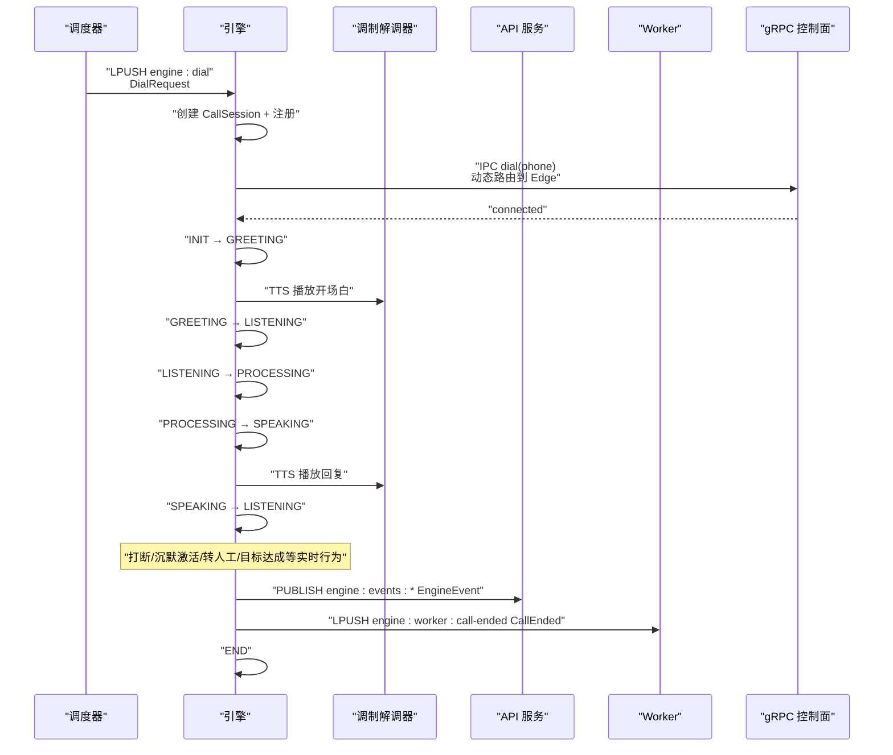
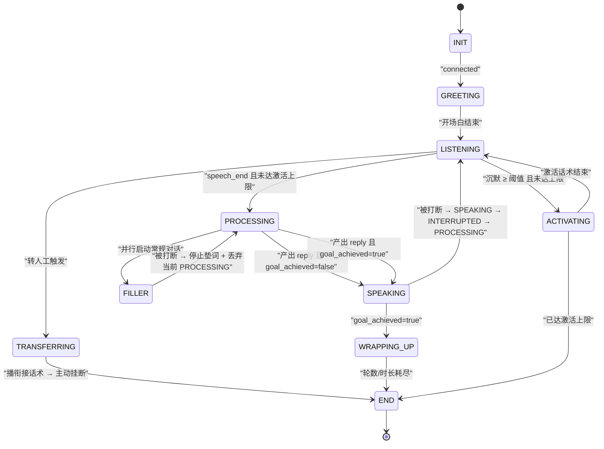
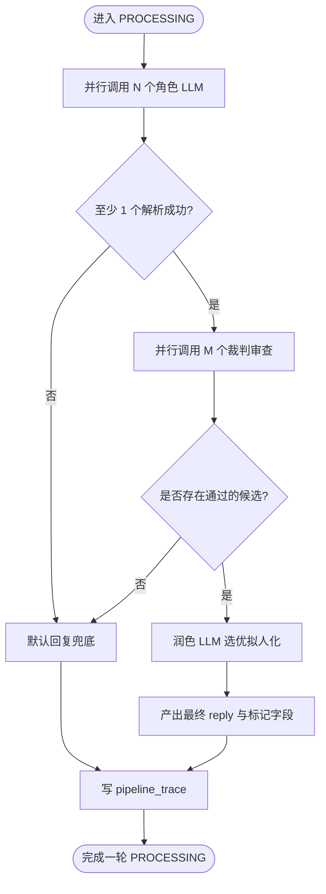
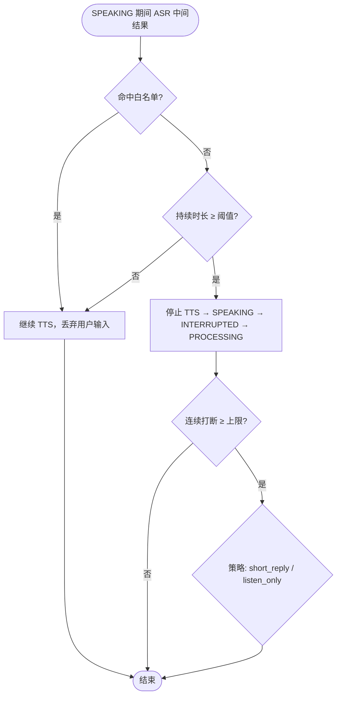
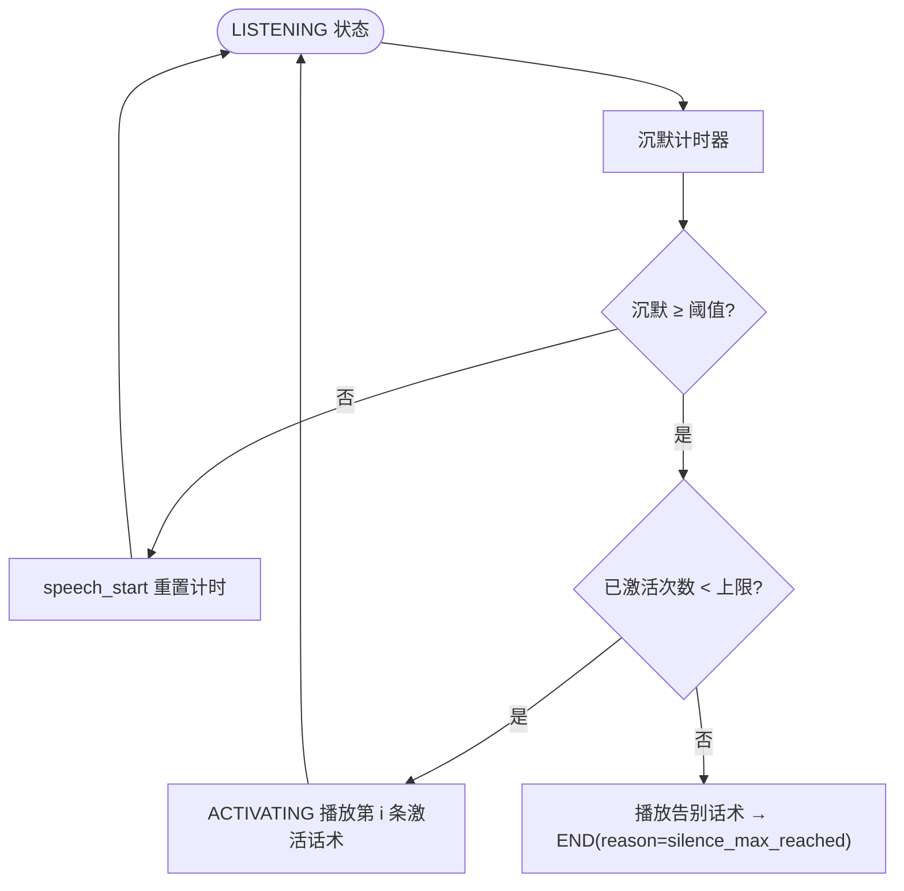
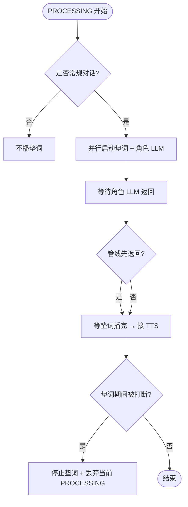
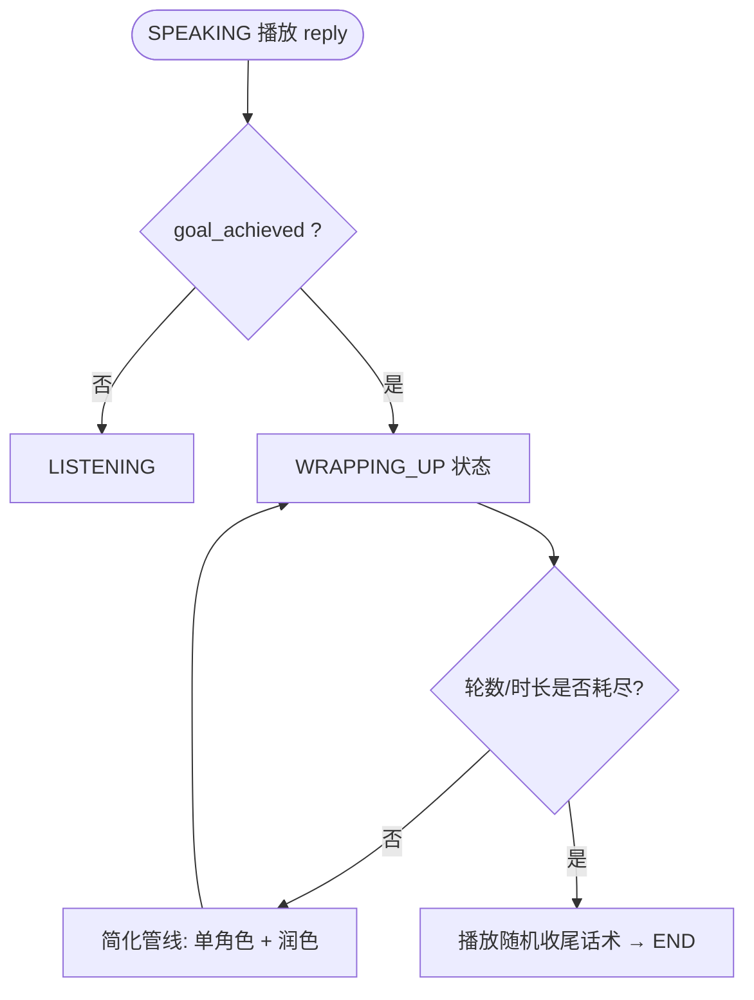
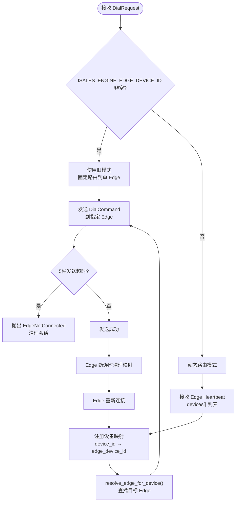
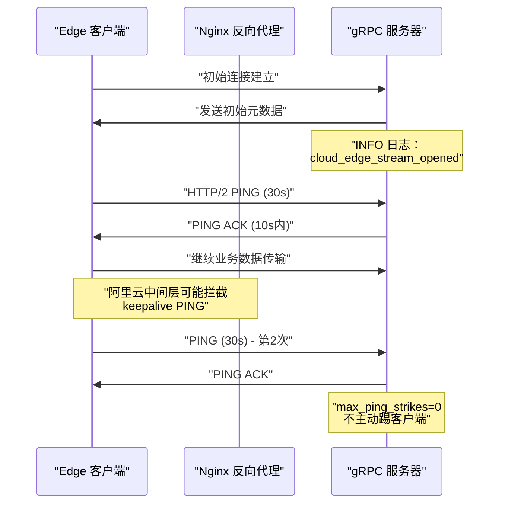

# isales-engine 实时通话引擎

<cite>
**本文档引用的文件**
- [README.md](file://README.md)
- [DESIGN.md](file://DESIGN.md)
- [IMPLEMENTATION_PLAN.md](file://IMPLEMENTATION_PLAN.md)
- [call-state-machine/spec.md](file://openspec/specs/call-state-machine/spec.md)
- [ai-pipeline/spec.md](file://openspec/specs/ai-pipeline/spec.md)
- [interruption-detection/spec.md](file://openspec/specs/interruption-detection/spec.md)
- [silence-activation/spec.md](file://openspec/specs/silence-activation/spec.md)
- [filler/spec.md](file://openspec/specs/filler/spec.md)
- [goal-achievement/spec.md](file://openspec/specs/goal-achievement/spec.md)
- [impl-engine/proposal.md](file://openspec/changes/archive/2026-05-07-impl-engine/proposal.md)
- [engine-send-timeout-multi-edge/design.md](file://openspec/changes/engine-send-timeout-multi-edge/design.md)
- [cloud-edge-grpc-keepalive/design.md](file://openspec/changes/cloud-edge-grpc-keepalive/design.md)
- [cloud-edge-grpc-keepalive/tasks.md](file://openspec/changes/cloud-edge-grpc-keepalive/tasks.md)
- [cloud-edge-grpc-keepalive/proposal.md](file://openspec/changes/cloud-edge-grpc-keepalive/proposal.md)
- [deploy/cloud/nginx/isales.conf](file://deploy/cloud/nginx/isales.conf)
</cite>

## 目录
1. [简介](#简介)
2. [项目结构](#项目结构)
3. [核心组件](#核心组件)
4. [架构总览](#架构总览)
5. [详细组件分析](#详细组件分析)
6. [依赖关系分析](#依赖关系分析)
7. [性能考量](#性能考量)
8. [故障排查指南](#故障排查指南)
9. [结论](#结论)
10. [附录](#附录)

## 简介
isales-engine 是 iSales 系统的实时通话引擎，负责驱动单通电话的完整生命周期：从拨号、开场白、对话、AI 三层管线处理，到打断检测、沉默激活、目标达成收尾、转人工与通话结束。其核心是以状态机为"总线"，将 AI 三层管线（角色 LLM、裁判 LLM、润色 LLM）、打断检测、沉默激活、垫词管理、目标达成检测等实时行为模块有机串联，形成高实时性、低耦合、可测试的系统。

**更新** 本版本新增 gRPC 云端边缘控制面增强功能，包括 5 秒发送超时保护机制、动态路由到特定 Edge 实例、自动清理连接丢失的映射关系等关键改进，显著提升了系统的稳定性与可扩展性。

## 项目结构
- 仓库定位：isales-engine 是独立的 Python 服务，作为实时通话引擎，消费调度器队列，驱动状态机与 AI 管线，落库事件与统计，并通过 Pub/Sub 与 API/Worker 通信。
- 与 isales-common 的关系：isales-engine 依赖 isales-common 的数据模型、Provider 抽象、消息契约与枚举，确保跨服务一致性。
- 服务边界：engine 通过 Redis 队列与 API/Worker 通信，通过 Unix Socket 与 modem-controller 通信（阶段 6 真实硬件接入后），并通过 Pub/Sub 向 API 推送事件。

```mermaid
graph TB
subgraph "调度与管理"
S["isales-scheduler<br/>队列: engine:dial"]
A["isales-api<br/>Pub/Sub: engine:events:*"]
W["isales-worker<br/>队列: engine:worker:call-ended"]
end
subgraph "实时引擎"
E["isales-engine<br/>状态机 + AI 管线 + gRPC 控制面"]
T["modem-controller<br/>IPC: dial/hangup/audio"]
end
subgraph "云端边缘控制面"
G["gRPC Server<br/>keepalive + 超时保护"]
H["Edge 实例<br/>设备映射 + 心跳"]
end
S --> E
E --> A
E --> W
E <- --> T
E --> G
G --> H
```

**图表来源**
- [IMPLEMENTATION_PLAN.md: 190-261:190-261](file://IMPLEMENTATION_PLAN.md#L190-L261)
- [README.md: 6-14:6-14](file://README.md#L6-L14)
- [engine-send-timeout-multi-edge/design.md: 37-59:37-59](file://openspec/changes/engine-send-timeout-multi-edge/design.md#L37-L59)
- [cloud-edge-grpc-keepalive/design.md: 3-6:3-6](file://openspec/changes/cloud-edge-grpc-keepalive/design.md#L3-L6)

**章节来源**
- [README.md: 6-14:6-14](file://README.md#L6-L14)
- [DESIGN.md: 9-21:9-21](file://DESIGN.md#L9-L21)

## 核心组件
- 状态机与会话：CallSession 维护对话上下文（对话历史、完整转录、垫词使用记录、沉默激活计数、连续打断计数、WRAPPING_UP 双计数器、prompt 版本快照、当前轮次等），状态机提供统一事件驱动 API，非法转移抛异常并记录 state_error。
- AI 三层管线：角色 LLM 并行候选 → 裁判 LLM 并行审查 → 润色 LLM 选优拟人化；每轮 PROCESSING 写 pipeline_trace；支持默认回复兜底、润色降级、简化管线（WRAPPING_UP）。
- 实时行为模块：
  - 打断检测：双条件（白名单/时长）判定，不可撤销；连续打断保护（short_reply/listen_only）。
  - 沉默激活：LISTENING 超阈值触发 ACTIVATING，带次数上限与话术复用；与转人工优先级明确。
  - 垫词管理：PROCESSING 期间与管线并行启动，垫词播完后接管 TTS；被打断立即停止并开启新一轮。
  - 目标达成：角色 LLM 结构化标记驱动实时判定，达成后进入 WRAPPING_UP 简化管线，双计数器收尾。
  - 转人工：四种触发条件（关键词/意图/轮次/LLM）OR 命中，进入 TRANSFERRING 播衔接话术后主动挂断。
- 事件与消息：EngineEvent 推送（call_started/state_changed/asr/ai_reply/hangup/pipeline_completed），EngineControl 消费（ManualHangup/ForceTransfer），CallEnded 派发至 worker。
- **云端边缘控制面**：gRPC 服务器提供长连接双向流，支持 keepalive 心跳、5秒发送超时保护、动态设备路由与自动映射清理，确保多 Edge 实例的稳定控制。

**更新** 新增云端边缘控制面组件，提供高可靠性的 gRPC 通信基础设施，支持多 Edge 并行处理与动态路由。

**章节来源**
- [IMPLEMENTATION_PLAN.md: 190-261:190-261](file://IMPLEMENTATION_PLAN.md#L190-L261)
- [impl-engine/proposal.md: 18-131:18-131](file://openspec/changes/archive/2026-05-07-impl-engine/proposal.md#L18-L131)
- [engine-send-timeout-multi-edge/design.md: 24-70:24-70](file://openspec/changes/engine-send-timeout-multi-edge/design.md#L24-L70)
- [cloud-edge-grpc-keepalive/design.md: 24-44:24-44](file://openspec/changes/cloud-edge-grpc-keepalive/design.md#L24-L44)

## 架构总览
引擎采用"状态机驱动 + 事件发布 + gRPC 控制面"的架构，所有实时行为通过状态转换触发，AI 管线与实时模块在状态机的统一调度下协同工作。新增的 gRPC 控制面提供稳定的云端边缘通信，支持多 Edge 实例并行处理与动态路由。



**图表来源**
- [IMPLEMENTATION_PLAN.md: 190-261:190-261](file://IMPLEMENTATION_PLAN.md#L190-L261)
- [impl-engine/proposal.md: 92-131:92-131](file://openspec/changes/archive/2026-05-07-impl-engine/proposal.md#L92-L131)
- [engine-send-timeout-multi-edge/design.md: 42-59:42-59](file://openspec/changes/engine-send-timeout-multi-edge/design.md#L42-L59)

## 详细组件分析

### 状态机与状态转换
- 状态集合：INIT/GREETING/LISTENING/SPEAKING/INTERRUPTED/FILLER/PROCESSING/WRAPPING_UP/ACTIVATING/TRANSFERRING/END。
- 合法转移：状态机维护 LEGAL_TRANSITIONS，非法转移抛 IllegalTransition 并写 state_error。
- 起始与终止：调度器派发 → INIT；进入 END 后落库并派发 CallEnded，不再发生状态转换。
- 事件驱动：每次转换写 transcript 事件，便于前端/运维调试。



**图表来源**
- [call-state-machine/spec.md: 7-190:7-190](file://openspec/specs/call-state-machine/spec.md#L7-L190)

**章节来源**
- [call-state-machine/spec.md: 23-190:23-190](file://openspec/specs/call-state-machine/spec.md#L23-L190)

### AI 三层管线架构
- 编排：N 个角色 LLM 并行 → N×M 个裁判 LLM 并行审查 → 1 个润色 LLM 选优拟人化。
- 并行覆盖：角色 LLM 与垫词同时启动，覆盖管线延迟。
- 失败兜底：全部角色失败、全部裁判否决、润色失败等均有明确兜底路径，且每轮 PROCESSING 均写 pipeline_trace。
- 简化管线：WRAPPING_UP 期间走单角色 + 润色，不启用 PK/裁判。



**图表来源**
- [ai-pipeline/spec.md: 7-166:7-166](file://openspec/specs/ai-pipeline/spec.md#L7-L166)

**章节来源**
- [ai-pipeline/spec.md: 7-166:7-166](file://openspec/specs/ai-pipeline/spec.md#L7-L166)

### 打断检测机制
- 双条件判定：白名单短语命中或时长 < 阈值 → 不视为打断；否则立刻停止 TTS，状态 SPEAKING → INTERRUPTED → PROCESSING。
- 不可撤销：一旦判定打断，不回退 TTS。
- 连续打断保护：超过上限触发 short_reply（prompt 追加"请用一句话回应"）或 listen_only（纯听引导）策略；完整 SPEAKING 后计数器清零。



**图表来源**
- [interruption-detection/spec.md: 7-94:7-94](file://openspec/specs/interruption-detection/spec.md#L7-L94)

**章节来源**
- [interruption-detection/spec.md: 7-94:7-94](file://openspec/specs/interruption-detection/spec.md#L7-L94)

### 沉默激活策略
- 计时起点：max(用户最后一次 speech_end, AI 上一轮 TTS 播完时刻)。
- 触发条件：LISTENING 超过 silence_threshold_ms 且已激活次数 < max_silence_activations → ACTIVATING。
- 话术策略：按 silence_phrases 顺序使用，不足时复用最后一条；超量截取前 N 条。
- 与转人工优先级：转人工触发优先于沉默激活。
- 达上限挂断：播放 silence_hangup_phrase 后 END(reason=silence_max_reached)。



**图表来源**
- [silence-activation/spec.md: 7-99:7-99](file://openspec/specs/silence-activation/spec.md#L7-L99)

**章节来源**
- [silence-activation/spec.md: 7-99:7-99](file://openspec/specs/silence-activation/spec.md#L7-L99)

### 垫词管理系统
- 触发场景：仅常规对话 PROCESSING；GREETING 后首轮、WRAPPING_UP、TRANSFERRING、ACTIVATING、收尾告别不播。
- 启动时机：与 AI 管线同时启动；管线先返回 → 等垫词播完再接 reply。
- 集合策略：多 filler_set 按 sort_order 轮询；同一通电话集内随机不重复，用尽后清空记录。
- 失败兜底：预生成未完成/下载失败 → 跳过垫词，允许"无声延迟"。



**图表来源**
- [filler/spec.md: 7-132:7-132](file://openspec/specs/filler/spec.md#L7-L132)

**章节来源**
- [filler/spec.md: 7-132:7-132](file://openspec/specs/filler/spec.md#L7-L132)

### 目标达成检测与 WRAPPING_UP
- 实时判定：角色 LLM 在 JSON 输出中标注 goal_achieved/goal_type/extracted；engine 实时读取并驱动状态转换。
- 进入 WRAPPING_UP：当前轮 SPEAKING 正常播放 reply 后进入 WRAPPING_UP，随后走简化管线（单角色 + 润色）。
- 双计数器：轮数耗尽或累计时长耗尽触发挂断，播放随机收尾话术后 END(reason=wrap_up_completed)。
- 特殊情况：新问题/反悔/主动挂机/转人工触发时按 spec 处理，不退回主管线。



**图表来源**
- [goal-achievement/spec.md: 44-126:44-126](file://openspec/specs/goal-achievement/spec.md#L44-L126)

**章节来源**
- [goal-achievement/spec.md: 44-126:44-126](file://openspec/specs/goal-achievement/spec.md#L44-L126)

### 转人工机制
- 触发条件：关键词/意图/轮次/LLM 四种独立可配置，OR 命中即触发。
- TRANSFERRING 流程：随机播放衔接话术 → 主动挂断 → 写入 call_record.transfer_status/transfer_reason → END(reason=marked_for_handoff)。
- 期间策略：保持 ASR 流式工作以补录最后 transcript；不调用 AI 管线。

**章节来源**
- [impl-engine/proposal.md: 62-71:62-71](file://openspec/changes/archive/2026-05-07-impl-engine/proposal.md#L62-L71)

### gRPC 云端边缘控制面增强

#### 5秒发送超时保护机制
**新增** 为解决 Edge 半连接导致的会话僵死问题，新增了 gRPC 出站队列超时保护机制：

- **问题背景**：`_ServerStream._outbound` 队列 `maxsize=64`，`put()` 无超时。Edge 半连接时 `put()` 永久阻塞，导致 session 僵死占满并发槽。
- **解决方案**：`_ServerStream.send()` 用 `asyncio.wait_for(self._outbound.put(message), timeout=self._send_timeout_s)` 包裹
- **超时配置**：默认 5.0 秒，可通过 `ISALES_ENGINE_GRPC_SEND_TIMEOUT_S` 环境变量配置
- **异常处理**：超时后抛 `EdgeNotConnected(edge_device_id)`，上层 `RtcTelephonyClient.dial()` 会正确清理 session

#### 动态路由到特定 Edge 实例
**新增** 支持多 Edge 并行处理，根据设备 ID 动态路由到拥有该设备的 Edge 实例：

- **映射机制**：`_device_to_edge: dict[int, str]` 存储 `device_id → edge_device_id` 映射
- **心跳注册**：Edge 发送 Heartbeat 时更新设备映射关系
- **路由逻辑**：`resolve_edge_for_device(device_id: int) → str` 未找到时抛 `EdgeNotConnected`
- **兼容性**：`ISALES_ENGINE_EDGE_DEVICE_ID` 环境变量非空 → 旧的单 Edge 模式；为空 → 动态路由模式

#### 自动清理连接丢失的映射关系
**新增** 当 Edge 断连时自动清理相关映射关系：

- **断连清理**：`_deregister_stream` 时清理该 edge 拥有的所有 device 映射
- **路由保护**：未找到设备映射时抛 `EdgeNotConnected`，避免错误路由
- **会话恢复**：清理后重新建立连接的 Edge 可重新注册设备映射



**图表来源**
- [engine-send-timeout-multi-edge/design.md: 26-59:26-59](file://openspec/changes/engine-send-timeout-multi-edge/design.md#L26-L59)

**章节来源**
- [engine-send-timeout-multi-edge/design.md: 11-70:11-70](file://openspec/changes/engine-send-timeout-multi-edge/design.md#L11-L70)

### gRPC keepalive 心跳机制

#### 30秒周期 keepalive 保护
**更新** 为解决阿里云网络层可能存在的 stateful firewall 杀连接问题：

- **参数配置**：`grpc.keepalive_time_ms = 30000` + `grpc.keepalive_timeout_ms = 10000` + `keepalive_permit_without_calls = 1`
- **PING 频率**：每 30 秒发一次 HTTP/2 PING，10 秒内必须收到 PING ACK
- **断连检测**：超时后视为 transport 失败，触发客户端重连机制
- **日志监控**：新增 INFO 级别日志记录 `cloud_edge_stream_connected` 和 `cloud_edge_stream_opened`

#### 10秒最小时间间隔与 0次最大打击
**新增** 优化 keepalive 行为以适应云边控制面特点：

- **最小间隔**：`grpc.http2.min_time_between_pings_ms = 10000` 避免被 gRPC 默认反DDoS逻辑误判
- **最大打击**：`grpc.http2.max_ping_strikes = 0` 永远不主动踢客户端，确保受信 Edge 的稳定性
- **安全考虑**：cloud-edge 凭 JWT 认证 + 单实例少量受信 Edge，攻击面接近零



**图表来源**
- [cloud-edge-grpc-keepalive/design.md: 47-95:47-95](file://openspec/changes/cloud-edge-grpc-keepalive/design.md#L47-L95)

**章节来源**
- [cloud-edge-grpc-keepalive/design.md: 24-159:24-159](file://openspec/changes/cloud-edge-grpc-keepalive/design.md#L24-L159)
- [cloud-edge-grpc-keepalive/tasks.md: 8-13:8-13](file://openspec/changes/cloud-edge-grpc-keepalive/tasks.md#L8-L13)

## 依赖关系分析
- 与 isales-common 的依赖：数据模型、Provider ABC、消息契约、枚举与工具函数。
- 与调度器/Worker/API 的通信：Redis 队列（engine:dial/engine:worker:call-ended）、Pub/Sub（engine:events:*、engine:control:*）。
- 与 modem-controller 的通信：阶段 6 通过 IPC（Unix Socket）拨号/挂断/音频流。
- **云端边缘控制面**：通过 gRPC 服务器与 Edge 实例建立长连接双向流，支持 keepalive 心跳与动态路由。

**更新** 新增云端边缘控制面通信依赖，提供稳定的 gRPC 通信基础设施。

```mermaid
graph LR
Common["isales-common<br/>模型/Provider/消息契约"] --> Engine["isales-engine"]
Scheduler["isales-scheduler<br/>engine:dial"] --> Engine
Engine --> API["isales-api<br/>engine:events:*"]
Engine --> Worker["isales-worker<br/>engine:worker:call-ended"]
Engine <- --> Modem["modem-controller<br/>IPC"]
Engine --> GRPC["gRPC 控制面<br/>keepalive + 超时保护"]
GRPC --> Edge["Edge 实例<br/>设备映射 + 心跳"]
```

**图表来源**
- [IMPLEMENTATION_PLAN.md: 190-261:190-261](file://IMPLEMENTATION_PLAN.md#L190-L261)
- [engine-send-timeout-multi-edge/design.md: 37-59:37-59](file://openspec/changes/engine-send-timeout-multi-edge/design.md#L37-L59)
- [cloud-edge-grpc-keepalive/design.md: 3-6:3-6](file://openspec/changes/cloud-edge-grpc-keepalive/design.md#L3-L6)

**章节来源**
- [IMPLEMENTATION_PLAN.md: 190-261:190-261](file://IMPLEMENTATION_PLAN.md#L190-L261)

## 性能考量
- 延迟覆盖：角色 LLM 与垫词并行启动，覆盖管线与 TTS 延迟；垫词播完后再接 reply，保证节奏稳定。
- 超时与兜底：润色失败/全部裁判否决/全部角色失败均有明确兜底与降级路径，pipeline_trace 写入具备幂等与失败容忍。
- 并发控制：全局 Redis 并发计数器，异常清理时 DECR 防泄漏；阶段 4 并发压力测试（10 路）通过。
- 音频时延：PCM 双向管道与 ALSA buffer 调优，阶段 6 时进行基准压测，超阈值单独排查。
- **gRPC 性能优化**：5秒发送超时保护防止会话僵死，30秒 keepalive 心跳确保长连接稳定性，动态路由支持多 Edge 并行处理。

**更新** 新增 gRPC 性能优化考量，包括超时保护、keepalive 心跳和动态路由机制。

## 故障排查指南
- 状态机非法转移：检查 LEGAL_TRANSITIONS 与事件来源，关注 transcript 中 state_error 事件，定位模块与事件名称。
- 并发计数器泄漏：确认 ENGINE 进 END 时 DECR，异常清理时也 DECR；启动时清理孤儿计数。
- 发布失败不影响通话：EngineEvent 发布 fire-and-forget，失败仅记录 WARN 日志。
- 真实硬件问题：modem 插拔/重连/串口冲突等，需结合 udev 监听与串口锁处理。
- 回调失败重试：callback 失败按 retry_policy 重排，关注回调日志与重试队列。
- **gRPC 连接问题**：检查 keepalive 日志 `cloud_edge_stream_opened` 和 `cloud_edge_stream_connected`，确认 30秒 PING 正常。
- **动态路由问题**：验证 Edge Heartbeat 中 devices 字段是否正确发送，检查设备映射是否在断连时正确清理。
- **超时异常**：监控 `EdgeNotConnected` 异常，检查 ISALES_ENGINE_GRPC_SEND_TIMEOUT_S 配置是否合理。

**更新** 新增 gRPC 相关故障排查指南，包括连接问题、动态路由问题和超时异常处理。

**章节来源**
- [impl-engine/proposal.md: 60-131:60-131](file://openspec/changes/archive/2026-05-07-impl-engine/proposal.md#L60-L131)
- [engine-send-timeout-multi-edge/design.md: 67-70:67-70](file://openspec/changes/engine-send-timeout-multi-edge/design.md#L67-L70)
- [cloud-edge-grpc-keepalive/design.md: 127-141:127-141](file://openspec/changes/cloud-edge-grpc-keepalive/design.md#L127-L141)

## 结论
isales-engine 以状态机为核心，将 AI 三层管线与实时行为模块解耦并统一调度，实现了高实时性、低耦合、可观测的通话处理系统。通过严格的事件契约、失败兜底与并发控制，引擎在阶段 4 即可完成端到端 mock 通话验收，并为阶段 5/6 的真实 Provider 与硬件接入奠定坚实基础。

**更新** 本版本通过新增 gRPC 云端边缘控制面增强功能，显著提升了系统的稳定性与可扩展性。5秒发送超时保护机制有效防止会话僵死，动态路由支持多 Edge 并行处理，keepalive 心跳确保长连接稳定性，为大规模部署提供了可靠的技术支撑。

## 附录
- 术语
  - CALL_RECORD：通话记录，包含 transcript、pipeline_trace、hangup_cause、wrap_up_started_at 等。
  - DIALOG_HISTORY：角色 LLM 上下文，不含 silence_activation/silence_hangup_phrase。
  - FULL_TRANSCRIPT：完整事件流，含全部事件（含激活/转人工/目标达成等）。
  - PIPELINE_TRACE：每轮 PROCESSING 的候选/裁判/润色记录，落库持久化。
  - **gRPC 控制面**：云端边缘通信基础设施，提供 keepalive 心跳、超时保护与动态路由功能。
  - **Edge 实例**：云端边缘设备，通过 gRPC 与引擎建立长连接，负责实际的通话处理。
- 配置要点（示例）
  - 打断：interruption_whitelist、interruption_min_duration_ms、max_continuous_interruptions、continuous_interruption_strategy
  - 沉默激活：silence_threshold_ms、max_silence_activations、silence_phrases、silence_hangup_phrase
  - 目标达成：wrap_up_max_rounds、wrap_up_max_seconds、wrap_up_closing_phrases
  - 垫词：filler_set 与 filler_phrase 的预生成与轮询策略
  - **gRPC 控制面**：ISALES_ENGINE_GRPC_SEND_TIMEOUT_S（默认 5.0 秒）、ISALES_ENGINE_EDGE_DEVICE_ID（动态路由模式需为空）
  - **keepalive 配置**：grpc.keepalive_time_ms=30000、grpc.keepalive_timeout_ms=10000、keepalive_permit_without_calls=1
  - **Nginx 配置**：grpc_read_timeout 3600s、grpc_send_timeout 3600s，支持 30秒 keepalive 心跳

**更新** 新增 gRPC 控制面与 keepalive 相关配置要点，为部署和运维提供参考。