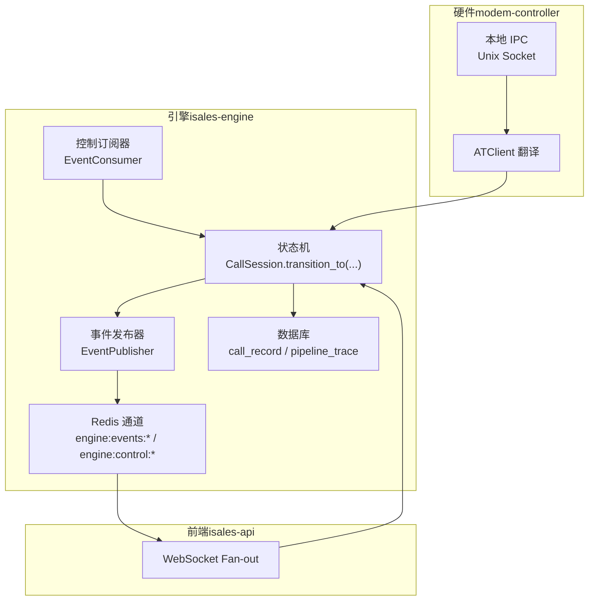
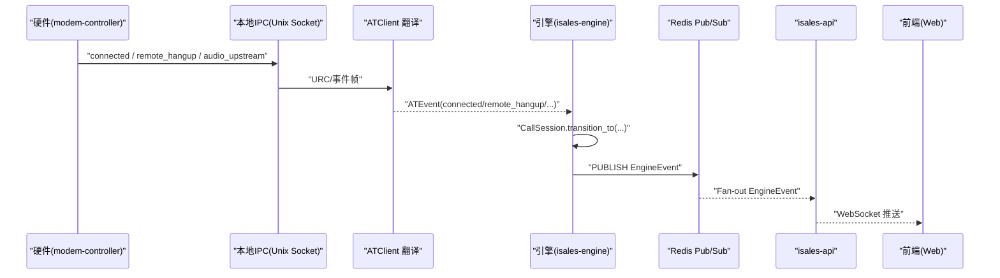
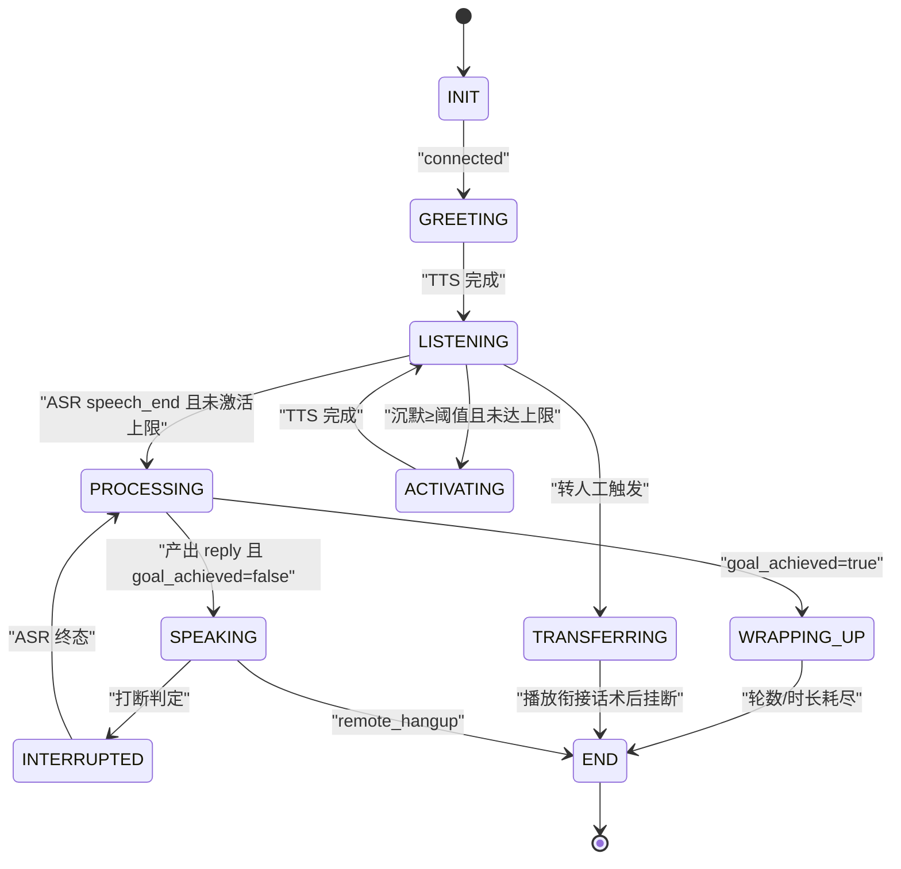
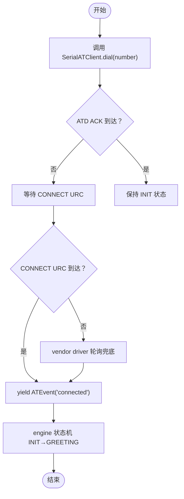
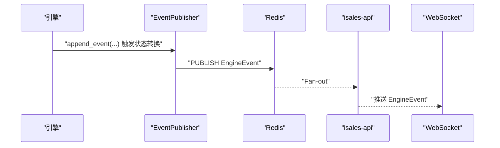

# 事件处理机制

<cite>
**本文引用的文件**
- [DESIGN.md](file://DESIGN.md)
- [call-state-machine 规格](file://openspec/specs/call-state-machine/spec.md)
- [device-hardware 规格](file://openspec/specs/device-hardware/spec.md)
- [service-communication 规格](file://openspec/specs/service-communication/spec.md)
- [message-contract 规格](file://openspec/specs/message-contract/spec.md)
- [isales-engine 设计（2026-05-07）](file://openspec/changes/archive/2026-05-07-impl-engine/design.md)
- [isales-engine 任务清单（2026-05-07）](file://openspec/changes/archive/2026-05-07-impl-engine/tasks.md)
- [isales-api 服务通信规格（2026-05-06）](file://openspec/changes/archive/2026-05-06-impl-api/specs/service-communication/spec.md)
- [isales-api 提案（2026-05-06）](file://openspec/changes/archive/2026-05-06-impl-api/proposal.md)
- [isales-worker 任务清单（2026-05-06）](file://openspec/changes/archive/2026-05-06-impl-worker/tasks.md)
</cite>

## 目录
1. [简介](#简介)
2. [项目结构](#项目结构)
3. [核心组件](#核心组件)
4. [架构总览](#架构总览)
5. [详细组件分析](#详细组件分析)
6. [依赖分析](#依赖分析)
7. [性能考虑](#性能考虑)
8. [故障排查指南](#故障排查指南)
9. [结论](#结论)
10. [附录](#附录)

## 简介
本文件系统化阐述 isales-engine 的事件驱动架构与实现，覆盖事件类型定义、事件传递机制、事件处理流程、事件持久化策略，以及硬件事件（ATD、CONNECT、remote_hangup 等）、IPC 事件翻译、状态机事件触发条件。同时给出事件优先级管理、事件队列处理、事件重试与错误恢复策略，以及性能优化方案（异步处理、批量处理、资源池管理），并提供事件监控与调试方法（事件日志、事件追踪、故障诊断工具）。

## 项目结构
- 事件处理位于 isales-engine 仓库，遵循 OpenSpec 分层规范：状态机、AI 三层管线、实时行为模块（打断、垫词、沉默激活、转人工）、转录与追踪、服务通信与消息契约。
- 事件在引擎内部以 CallSession 为中心的状态机驱动，通过统一的 transition_to API 触发状态转换，并在转换时写入 transcript 事件。
- 事件通过 Redis Pub/Sub 向 isales-api 转发，再由 API fan-out 到前端 WebSocket 客户端。
- 硬件事件由 modem-controller 通过本地 IPC（Unix socket）上报，经 ATClient 翻译为 ATEvent，再上抛为 EngineEvent。



**图表来源**
- [isales-engine 设计（2026-05-07）](file://openspec/changes/archive/2026-05-07-impl-engine/design.md)
- [service-communication 规格](file://openspec/specs/service-communication/spec.md)
- [device-hardware 规格](file://openspec/specs/device-hardware/spec.md)

**章节来源**
- [DESIGN.md](file://DESIGN.md)
- [isales-engine 设计（2026-05-07）](file://openspec/changes/archive/2026-05-07-impl-engine/design.md)

## 核心组件
- 状态机与事件驱动：CallSession 作为状态与上下文载体，统一通过 transition_to 触发状态转换，所有转换均写入 transcript 事件，非法转移抛出异常并记录 state_error。
- 事件发布与订阅：EngineEvent 通过 Redis Pub/Sub 发布，EngineControl 通过 PSUBSCRIBE 订阅，按 call_id 分发到 SessionManager。
- 硬件事件翻译：SerialATClient 将串口 URC 翻译为 ATEvent（connected、remote_hangup 等），再由 engine 状态机驱动状态转换。
- 传输与持久化：transcript 与 pipeline_trace 分别写入 call_record 与独立表，DB 写入采用批量提交与重试策略，确保一致性与韧性。
- 通信契约：message-contract 规定跨服务消息体必须使用 isales-common 的 Pydantic 模型，避免裸 dict 与字段不一致。

**章节来源**
- [call-state-machine 规格](file://openspec/specs/call-state-machine/spec.md)
- [isales-engine 设计（2026-05-07）](file://openspec/changes/archive/2026-05-07-impl-engine/design.md)
- [message-contract 规格](file://openspec/specs/message-contract/spec.md)

## 架构总览
引擎采用“事件驱动 + 状态机”的核心架构，结合 Redis Pub/Sub 实现实时事件广播与控制下发。硬件事件通过本地 IPC 与 ATClient 翻译，确保状态转换严格由 IPC 事件驱动，避免 ATD 命令 ACK 单独触发。



**图表来源**
- [device-hardware 规格](file://openspec/specs/device-hardware/spec.md)
- [isales-engine 设计（2026-05-07）](file://openspec/changes/archive/2026-05-07-impl-engine/design.md)
- [service-communication 规格](file://openspec/specs/service-communication/spec.md)

## 详细组件分析

### 状态机与事件类型
- 状态集合：INIT、GREETING、LISTENING、SPEAKING、INTERRUPTED、FILLER、PROCESSING、WRAPPING_UP、ACTIVATING、TRANSFERRING、END。
- 合法转移：由 LEGAL_TRANSITIONS 约束，非法转移抛出异常并记录 state_error，支持可忽略与不可忽略两类恢复策略。
- 事件类型：EngineEvent（按 message-contract 规格定义），前端通过 discriminated union 解析；新增事件类型需通过 OpenSpec 变更同步。



**图表来源**
- [call-state-machine 规格](file://openspec/specs/call-state-machine/spec.md)

**章节来源**
- [call-state-machine 规格](file://openspec/specs/call-state-machine/spec.md)
- [service-communication 规格](file://openspec/specs/service-communication/spec.md)

### 硬件事件与 IPC 翻译机制
- IPC 协议：engine → modem-controller 指令（dial/hangup/audio_downstream），modem-controller → engine 事件（call_progress/connected/audio_upstream/remote_hangup/device_error）。
- ATClient 翻译：ATD ACK 不触发 connected；仅在 CONNECT URC 到达后 yield connected；远端挂断通过 URC 映射为 hangup_cause；本端主动挂断 yield cause=manual_hangup。
- 翻译契约：状态转换仅由 IPC 事件触发，不因 ATD 命令 ACK 单独触发。



**图表来源**
- [device-hardware 规格](file://openspec/specs/device-hardware/spec.md)

**章节来源**
- [device-hardware 规格](file://openspec/specs/device-hardware/spec.md)

### 事件传递与持久化策略
- 事件发布：EngineEvent 通过 Redis Pub/Sub 发布到 engine:events:campaign:{id}，前端通过 WebSocket 订阅 fan-out。
- 控制订阅：PSUBSCRIBE engine:control:campaign:*，反序列化 EngineControl，按 call_id 分发到 SessionManager。
- 持久化：transcript 写入 call_record.transcript（JSONB）；pipeline_trace 每轮一条，END 时事务批量提交；DB/Redis 短暂不可用时采用重试与降级策略。



**图表来源**
- [isales-engine 设计（2026-05-07）](file://openspec/changes/archive/2026-05-07-impl-engine/design.md)
- [service-communication 规格](file://openspec/specs/service-communication/spec.md)

**章节来源**
- [isales-engine 设计（2026-05-07）](file://openspec/changes/archive/2026-05-07-impl-engine/design.md)
- [message-contract 规格](file://openspec/specs/message-contract/spec.md)

### 事件优先级与队列处理
- 事件优先级：转人工（TRANSFERRING）优先于沉默激活与收尾（WRAPPING_UP）；连续打断保护与沉默计时起点按 spec 约定。
- 队列处理：DialRequest 通过 BLPOP 消费；CallEnded 通过 LPUSH；并发计数器通过 Redis INCR/DECR；DLQ 用于 schema 不兼容的死信。
- 控制通道：单订阅任务（subscribe_loop）统一处理 EngineControl，按 call_id 分发，不存在的 call_id 静默丢弃。

**章节来源**
- [isales-engine 设计（2026-05-07）](file://openspec/changes/archive/2026-05-07-impl-engine/design.md)
- [isales-worker 任务清单（2026-05-06）](file://openspec/changes/archive/2026-05-06-impl-worker/tasks.md)

### 事件重试与错误恢复
- Redis 抖动：发布器/订阅器内部带退避重连；LPUSH/DECR 失败重试 3 次，最终失败记录 ERROR 日志，session 仍清理。
- DB 抖动：END 时事务提交失败指数退避重试 3 次；最终失败记录 ERROR 日志，接受丢一次 call_record。
- Provider 抖动：单 LLM 超时/异常淘汰候选；全部失败默认回复兜底。
- 优雅停机：SIGTERM 触发，取消所有任务，写 hangup{engine_shutdown}，DECR 并发计数器，超时强制退出。

**章节来源**
- [isales-engine 设计（2026-05-07）](file://openspec/changes/archive/2026-05-07-impl-engine/design.md)

## 依赖分析
- 服务间依赖：scheduler → engine:dial；engine → engine:worker:call-ended；engine → engine:events:*；api → engine:control:*。
- 消息契约：所有跨服务消息体使用 isales-common 的 Pydantic 模型，禁止裸 dict。
- 通道契约：WebSocket 直传 EngineEvent JSON，前端用 discriminated union 解析，未知 type 仅 warn 跳过。

```mermaid
graph LR
SCH["scheduler"] --> |"BLPOP engine:dial"| ENG["engine"]
ENG --> |"LPUSH engine:worker:call-ended"| WRK["worker"]
ENG --> |"PUBLISH engine:events:*"| API["api"]
API --> |"WS Fan-out"| WEB["web"]
API <--|"PSUBSCRIBE engine:control:*"| ENG
```

**图表来源**
- [isales-engine 设计（2026-05-07）](file://openspec/changes/archive/2026-05-07-impl-engine/design.md)
- [service-communication 规格](file://openspec/specs/service-communication/spec.md)
- [message-contract 规格](file://openspec/specs/message-contract/spec.md)

**章节来源**
- [isales-api 服务通信规格（2026-05-06）](file://openspec/changes/archive/2026-05-06-impl-api/specs/service-communication/spec.md)
- [isales-api 提案（2026-05-06）](file://openspec/changes/archive/2026-05-06-impl-api/proposal.md)

## 性能考虑
- 异步处理：全 asyncio，事件发布 fire-and-forget，不阻塞主路径；发布超时 2s，避免单次 publish 卡死。
- 批量处理：END 时事务批量写入 call_record 与 pipeline_trace，降低 fsync 次数。
- 资源池管理：进程内 SessionManager，单实例部署（v1 ≤8 路并发），避免跨进程协议带来的复杂度。
- 通信优化：IPC 帧 newline-delimited JSON，音频流与控制消息共用同一 socket，减少编解码开销。

**章节来源**
- [isales-engine 设计（2026-05-07）](file://openspec/changes/archive/2026-05-07-impl-engine/design.md)
- [device-hardware 规格](file://openspec/specs/device-hardware/spec.md)

## 故障排查指南
- 事件日志：transcript 与 pipeline_trace 记录完整事件流与管线轨迹；非法转移记录 state_error，便于定位。
- 事件追踪：message-contract 要求消息体使用统一 Pydantic 模型，便于跨服务一致性校验与追踪。
- 故障诊断：
  - Redis 抖动：关注发布/订阅器内部退避与 WARN 日志；必要时检查网络与连接数。
  - DB 抖动：关注 END 时事务重试日志；核对 call_record 是否丢失。
  - Provider 抖动：关注 pipeline_trace 中 error 字段与兜底回复；逐步替换 Provider。
  - 硬件事件：检查 IPC 帧格式与 session_id 字段，确认 ATClient 翻译是否正确。

**章节来源**
- [isales-engine 设计（2026-05-07）](file://openspec/changes/archive/2026-05-07-impl-engine/design.md)
- [message-contract 规格](file://openspec/specs/message-contract/spec.md)

## 结论
isales-engine 的事件处理机制以状态机为核心，通过统一的事件驱动 API 与严格的契约约束，实现了硬件事件翻译、IPC 事件上抛、实时事件广播与持久化落盘。借助 Redis Pub/Sub 与 WebSocket 的 fan-out 能力，引擎与前端形成高内聚、低耦合的事件生态。在性能方面，异步与批量策略有效降低了延迟与 I/O 压力；在可靠性方面，重试与降级策略保障了系统在基础设施抖动下的韧性。未来可在 v2 扩展多实例与跨实例转发，进一步提升弹性与可用性。

## 附录
- 术语
  - EngineEvent：引擎发布的实时事件，前端通过 WebSocket 订阅。
  - EngineControl：API 下发的控制指令，按 call_id 分发到引擎。
  - ATEvent：modem-controller 通过 ATClient 翻译的底层事件。
  - HangupCause：统一的挂断原因枚举，贯穿硬件、引擎、工作流与重试逻辑。
- 参考
  - OpenSpec 各能力规范与变更提案，确保事件类型与处理流程的演进受控。