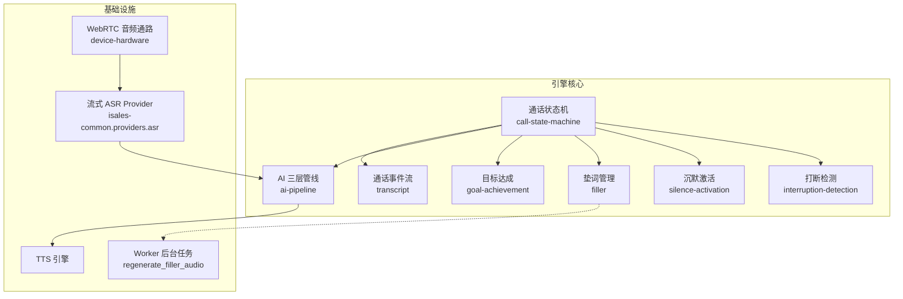
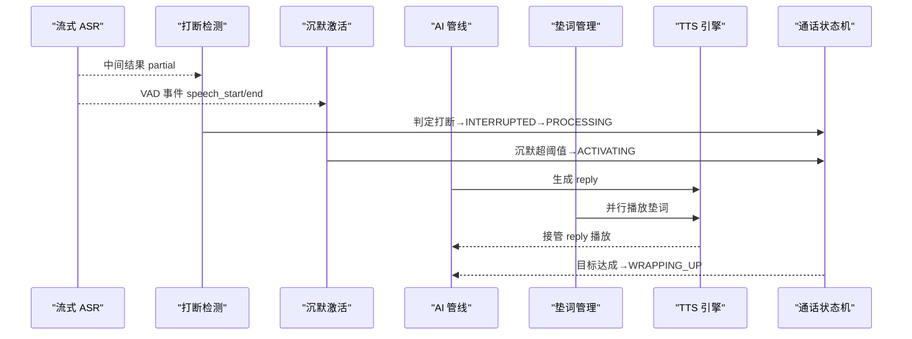
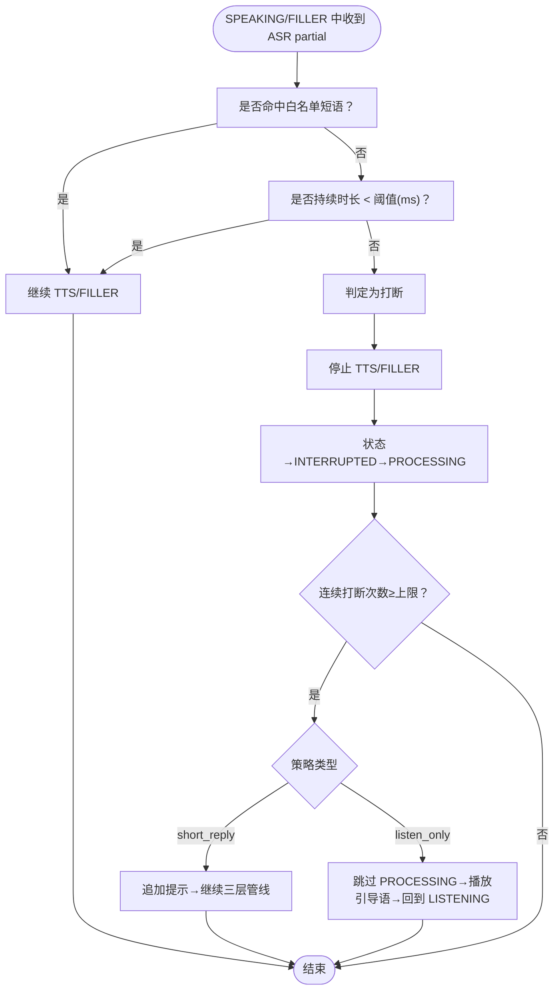
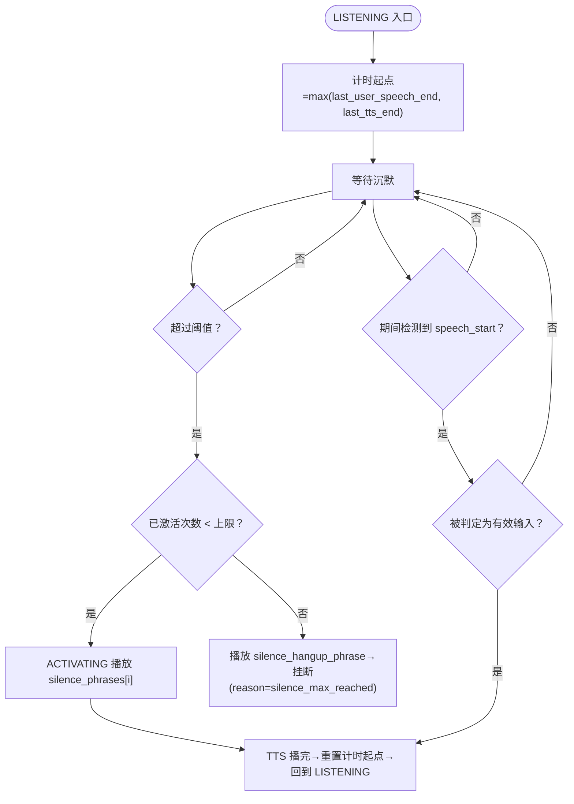
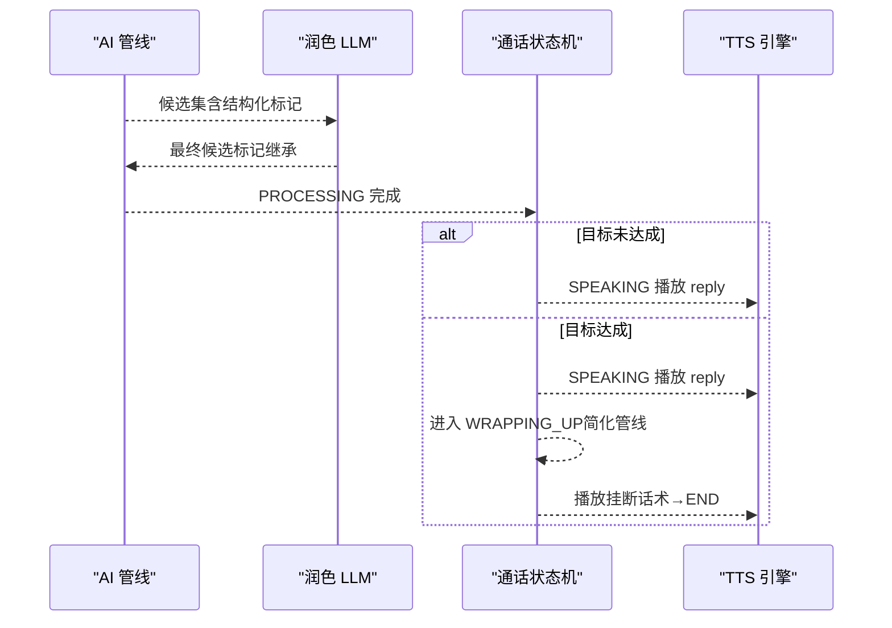
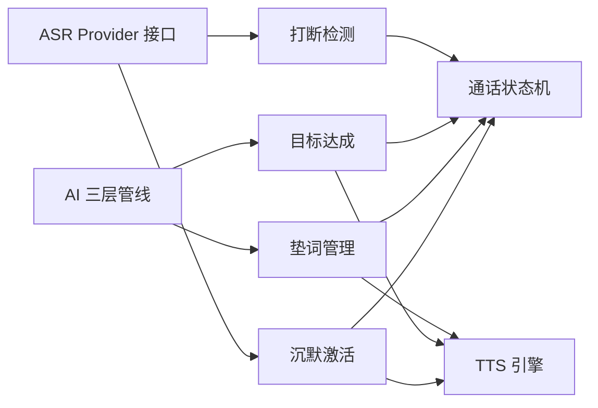

# 实时处理模块

<cite>
**本文引用的文件**
- [interruption-detection 规范](file://openspec/specs/interruption-detection/spec.md)
- [silence-activation 规范](file://openspec/specs/silence-activation/spec.md)
- [filler 规范](file://openspec/specs/filler/spec.md)
- [goal-achievement 规范](file://openspec/specs/goal-achievement/spec.md)
- [通话状态机 规范](file://openspec/specs/call-state-machine/spec.md)
- [AI 三层管线 规范](file://openspec/specs/ai-pipeline/spec.md)
- [通话事件流 规范](file://openspec/specs/transcript/spec.md)
- [设计索引](file://DESIGN.md)
- [实现计划](file://IMPLEMENTATION_PLAN.md)
- [设备硬件 规范](file://openspec/specs/device-hardware/spec.md)
- [部署拓扑 规范](file://openspec/specs/deployment-topology/spec.md)
- [阿里 RTC PoC 结果](file://openspec/v1-roadmap-aliyun-rtc-poc-result.md)
- [联合 MVP Gate 设计](file://openspec/changes/joint-mvp-gate-13301035545/design.md)
- [引擎实现设计（存档）](file://openspec/changes/archive/2026-05-07-impl-engine/design.md)
- [引擎实现任务清单（存档）](file://openspec/changes/archive/2026-05-07-impl-engine/tasks.md)
</cite>

## 目录
1. [简介](#简介)
2. [项目结构](#项目结构)
3. [核心组件](#核心组件)
4. [架构总览](#架构总览)
5. [详细组件分析](#详细组件分析)
6. [依赖关系分析](#依赖关系分析)
7. [性能考量](#性能考量)
8. [故障排查指南](#故障排查指南)
9. [结论](#结论)
10. [附录](#附录)

## 简介
本文件为 isales-engine 的实时处理模块技术文档，聚焦四大实时子系统：打断检测机制（interruption-detection）、沉默激活策略（silence-activation）、垫词管理系统（filler）和目标达成检测（goal-achievement）。文档系统阐述各模块的算法原理、触发条件、处理逻辑与相互协作机制，解释打断判定标准、沉默激活阈值、垫词播放时机控制与目标达成评估方法，并提供实时音频流处理示例与模块间同步协调策略。

## 项目结构
实时处理模块位于引擎核心，围绕通话状态机组织，通过统一事件驱动实现模块协同。整体采用单进程异步架构，结合云-边 WebRTC 音频通路与流式 ASR/LLM/TTS 管线，确保低延迟与高可靠性。



**图表来源**
- [通话状态机 规范:1-190](file://openspec/specs/call-state-machine/spec.md#L1-L190)
- [AI 三层管线 规范:1-166](file://openspec/specs/ai-pipeline/spec.md#L1-L166)
- [设备硬件 规范:167-186](file://openspec/specs/device-hardware/spec.md#L167-L186)
- [部署拓扑 规范:180-191](file://openspec/specs/deployment-topology/spec.md#L180-L191)

**章节来源**
- [设计索引:1-75](file://DESIGN.md#L1-L75)
- [部署拓扑 规范:180-191](file://openspec/specs/deployment-topology/spec.md#L180-L191)

## 核心组件
- 打断检测（interruption-detection）：基于流式 ASR 中间结果与 VAD 事件，在 SPEAKING/FILLER 状态下以“白名单短语命中”和“持续时长阈值”双条件判定是否打断，一旦判定不可撤销，立即停止 TTS/FILLER 并进入 INTERRUPTED→PROCESSING。
- 沉默激活（silence-activation）：在 LISTENING 状态下以“max(用户 speech_end, AI 上一轮 TTS 播完时刻)”为计时起点，超过阈值触发 ACTIVATING，按顺序播放激活话术，达到上限后挂断；激活后重新计时。
- 垫词管理（filler）：在常规 PROCESSING 期间与 AI 管线并行启动垫词播放，垫词播完后接管 reply 的 TTS；多 filler_set 轮询、集内随机不重复；预生成音频，失败时允许无声延迟。
- 目标达成（goal-achievement）：由角色 LLM 在每轮 JSON 输出中标注 goal_achieved/goal_type/extracted，实时判定后进入 WRAPPING_UP 状态，走简化管线并按轮数/时长主动挂断；收尾期间用户新问题不退回主管线。

**章节来源**
- [interruption-detection 规范:1-94](file://openspec/specs/interruption-detection/spec.md#L1-L94)
- [silence-activation 规范:1-99](file://openspec/specs/silence-activation/spec.md#L1-L99)
- [filler 规范:1-132](file://openspec/specs/filler/spec.md#L1-L132)
- [goal-achievement 规范:1-126](file://openspec/specs/goal-achievement/spec.md#L1-L126)

## 架构总览
实时处理模块以通话状态机为核心，四大模块通过统一事件驱动在状态转换节点协同工作。ASR 提供流式中间结果与 VAD 事件，AI 管线在 PROCESSING 期间并行运行，TTS 在 SPEAKING/ACTIVATING/FILLER 等状态播放。垫词与 AI 管线并行，确保响应节奏稳定；目标达成触发 WRAPPING_UP 简化管线；打断与沉默激活遵循不可撤销与优先级规则。



**图表来源**
- [通话状态机 规范:46-145](file://openspec/specs/call-state-machine/spec.md#L46-L145)
- [AI 三层管线 规范:7-84](file://openspec/specs/ai-pipeline/spec.md#L7-L84)
- [interruption-detection 规范:7-56](file://openspec/specs/interruption-detection/spec.md#L7-L56)
- [silence-activation 规范:7-81](file://openspec/specs/silence-activation/spec.md#L7-L81)
- [filler 规范:7-77](file://openspec/specs/filler/spec.md#L7-L77)

## 详细组件分析

### 打断检测机制（interruption-detection）
- 判定标准
  - 双条件：任一条件满足即非打断
    - 白名单短语命中（如“嗯”“好的”等）
    - 持续时长 < 阈值（默认 800ms）
  - 满足打断条件：非白名单且持续时长 ≥ 阈值，立即停止 TTS/FILLER，状态进入 INTERRUPTED→PROCESSING，使用 ASR 终态结果作为本轮用户输入。
- 不可撤销策略：一旦进入 INTERRUPTED，即使后续 partial 命中白名单也不回退。
- 连续打断保护：连续循环超过上限（默认 3）触发保护策略
  - short_reply：在调用三层管线前追加“请用一句话回应”的提示
  - listen_only：跳过 PROCESSING，直接播放引导语后回到 LISTENING
- 与 FILLER/WRAPPING_UP 交互：在上述状态下保持一致判定逻辑，仅调整后续 PROCESSING 路径。



**图表来源**
- [interruption-detection 规范:7-56](file://openspec/specs/interruption-detection/spec.md#L7-L56)

**章节来源**
- [interruption-detection 规范:7-56](file://openspec/specs/interruption-detection/spec.md#L7-L56)
- [通话状态机 规范:110-127](file://openspec/specs/call-state-machine/spec.md#L110-L127)
- [AI 三层管线 规范:13-18](file://openspec/specs/ai-pipeline/spec.md#L13-L18)

### 沉默激活策略（silence-activation）
- 沉默检测与激活触发
  - 计时起点：max(用户最后一次 speech_end, AI 上一轮 TTS 播完时刻)
  - 超过阈值（默认 5000ms）且未达激活上限（默认 2）→ 进入 ACTIVATING，按顺序播放 silence_phrases[i]
  - 达到上限→播放 silence_hangup_phrase 后主动挂断（reason=silence_max_reached）
  - 期间用户说话且被判定为有效输入→计时器复位，走正常 LISTENING→PROCESSING
- 激活后重新计时：每次 ACTIVATING TTS 播完后以 TTS 播完时刻为新起点，不累加原始沉默时长
- 话术顺序与复用：按 silence_phrases 下标顺序使用；不足时复用最后一条；多余时仅使用前 max_silence_activations 条
- 与角色 LLM 上下文隔离：silence_activation 写入 full_transcript，但不进入 dialog_history



**图表来源**
- [silence-activation 规范:7-81](file://openspec/specs/silence-activation/spec.md#L7-L81)
- [通话状态机 规范:85-98](file://openspec/specs/call-state-machine/spec.md#L85-L98)

**章节来源**
- [silence-activation 规范:7-81](file://openspec/specs/silence-activation/spec.md#L7-L81)
- [通话事件流 规范:58-76](file://openspec/specs/transcript/spec.md#L58-L76)

### 垫词管理系统（filler）
- 触发场景白名单：仅在常规 PROCESSING 触发；开场白后首轮 PROCESSING、WRAPPING_UP、转人工/沉默激活/告别/挂断期间不播
- 启动时机与衔接：与 AI 管线并行启动；管线先返回时等垫词播完再接 reply；快响应场景仍播完整段垫词以维持节奏
- 多 filler_set 轮询：按 sort_order 升序循环；每通电话从最小 sort_order 的 set 起步
- 集内随机不重复：每通电话维护已用短语集合，用完清空；避免同通电话重复使用同一短语
- 预生成与失败兜底：垫词音频预先用指定音色 TTS 生成并存储到 OSS；运行时不得实时生成；失败场景跳过垫词，允许“无声延迟”
- 与打断交互：垫词期间被打断→立即停止垫词、丢弃当前 PROCESSING、把用户输入作为新一轮处理

```mermaid
flowchart TD
ProcEnter(["PROCESSING 入口"]) --> SceneOK{"是否在触发场景白名单？"}
SceneOK --> |否| Skip["不播垫词"]
SceneOK --> |是| Parallel["与 AI 管线并行启动垫词"]
Parallel --> PipelineReady{"AI 管线先返回？"}
PipelineReady --> |是| WaitFiller["等垫词播完"]
PipelineReady --> |否| FastPath{"响应时间<500ms？"}
FastPath --> |是| WaitFiller
FastPath --> |否| PlayReply["直接播放 reply"]
WaitFiller --> PlayReply
PlayReply --> Break{"期间被打断？"}
Break --> |是| StopFiller["停止垫词→丢弃当前 PROCESSING→新一轮"}
Break --> |否| End(["结束"])
```

**图表来源**
- [filler 规范:7-77](file://openspec/specs/filler/spec.md#L7-L77)
- [通话状态机 规范:119-127](file://openspec/specs/call-state-machine/spec.md#L119-L127)

**章节来源**
- [filler 规范:7-110](file://openspec/specs/filler/spec.md#L7-L110)
- [AI 三层管线 规范:65-69](file://openspec/specs/ai-pipeline/spec.md#L65-L69)

### 目标达成检测（goal-achievement）
- 实时判定：由角色 LLM 在每轮 JSON 输出中自带结构化标记（goal_achieved, goal_type, extracted），engine 实时读取；通话结束后 worker 仅记录最后一轮标记
- 目标定义：Campaign 不固化目标 schema，全部写在角色 prompt 中，支持多目标类型
- 三层管线对结构化标记的处理：裁判仅审 reply；润色仅改写 reply，标记字段直接继承（不投票合并）
- 进入 WRAPPING_UP：当润色返回 goal_achieved=true，先正常播放当前轮 reply，再进入 WRAPPING_UP；后续走简化管线（单角色+润色，不启用 PK/裁判）
- 收尾双计数器：轮数计数器或时长计数器任一耗尽，播放挂断话术后主动挂断（reason=wrap_up_completed）
- 特殊情况：WRAPPING_UP 期间用户提出新问题不退回主管线；转人工触发让位；用户主动挂断直接进入 END



**图表来源**
- [goal-achievement 规范:7-62](file://openspec/specs/goal-achievement/spec.md#L7-L62)
- [AI 三层管线 规范:150-158](file://openspec/specs/ai-pipeline/spec.md#L150-L158)

**章节来源**
- [goal-achievement 规范:7-126](file://openspec/specs/goal-achievement/spec.md#L7-L126)
- [通话状态机 规范:75-84](file://openspec/specs/call-state-machine/spec.md#L75-L84)

## 依赖关系分析
- 与状态机耦合：四大模块均通过状态转换节点接入状态机，确保事件驱动与一致性
- 与 AI 管线耦合：PROCESSING 期间并行运行，垫词与管线并行；目标达成触发 WRAPPING_UP 简化管线
- 与 ASR Provider 抽象：打断与沉默激活均基于流式 ASR partial 与 VAD 事件，必须实现统一接口
- 与音频通路耦合：云-边 WebRTC 通路提供 PCM 音频，打断/沉默/垫词/目标达成均依赖该通路的低延迟特性



**图表来源**
- [通话状态机 规范:46-145](file://openspec/specs/call-state-machine/spec.md#L46-L145)
- [AI 三层管线 规范:7-166](file://openspec/specs/ai-pipeline/spec.md#L7-L166)
- [interruption-detection 规范:54-66](file://openspec/specs/interruption-detection/spec.md#L54-L66)
- [设备硬件 规范:167-186](file://openspec/specs/device-hardware/spec.md#L167-L186)

**章节来源**
- [通话状态机 规范:46-145](file://openspec/specs/call-state-machine/spec.md#L46-L145)
- [AI 三层管线 规范:7-166](file://openspec/specs/ai-pipeline/spec.md#L7-L166)

## 性能考量
- 低延迟音频通路：通过 WebRTC 与 audio-bridge 实现云-边 PCM 传输，减少额外重采样与缓冲区堆积
- 并行处理：打断检测与沉默激活采用后台任务/事件驱动，避免阻塞主处理循环
- 快响应节奏：垫词与 AI 管线并行，快响应场景仍播完整垫词，维持稳定对话节拍
- 失败兜底：垫词失败允许“无声延迟”，避免引入额外延迟或异常路径

**章节来源**
- [阿里 RTC PoC 结果:80-125](file://openspec/v1-roadmap-aliyun-rtc-poc-result.md#L80-L125)
- [设备硬件 规范:178-186](file://openspec/specs/device-hardware/spec.md#L178-L186)
- [filler 规范:78-110](file://openspec/specs/filler/spec.md#L78-L110)

## 故障排查指南
- 状态机非法转移
  - 现象：出现 state_error 事件
  - 排查：检查事件触发是否属于当前状态合法转移集合；必要时强制进入 END(reason=engine_internal_error)
- 打断判定异常
  - 现象：频繁误打断或漏打断
  - 排查：核对白名单配置与 interruption_min_duration_ms；确认 ASR partial/VAD 事件来源与时间戳
- 沉默激活未触发或过早触发
  - 现象：沉默激活未按预期触发或在用户说话时触发
  - 排查：确认计时起点是否为 max(speech_end, last_tts_end)；检查 silence_threshold_ms 与 max_silence_activations
- 垫词播放异常
  - 现象：垫词未播放或重复播放
  - 排查：检查 filler_set.sort_order 与集内已用短语集合；确认 generation_status 与 audio_url
- 目标达成未生效
  - 现象：目标达成标记未触发 WRAPPING_UP
  - 排查：确认角色 LLM 输出是否包含正确的 JSON 结构化标记；检查润色是否正确继承标记字段

**章节来源**
- [通话状态机 规范:33-44](file://openspec/specs/call-state-machine/spec.md#L33-L44)
- [通话事件流 规范:24-56](file://openspec/specs/transcript/spec.md#L24-L56)

## 结论
实时处理模块通过统一的状态机与事件驱动，将打断检测、沉默激活、垫词管理与目标达成有机整合，形成低延迟、高可靠、可扩展的实时语音对话系统。四大模块在 SPEAKING/FILLER/PROCESSING/WRAPPING_UP 等关键状态节点协同，既保证用户体验，又确保业务规则的严格执行。

## 附录
- 实施计划与里程碑：参见 IMPLEMENTATION_PLAN.md
- 联合 MVP Gate 验收目标：参见联合 MVP Gate 设计
- 引擎实现设计要点（存档）：参见引擎实现设计（存档）

**章节来源**
- [实现计划](file://IMPLEMENTATION_PLAN.md)
- [联合 MVP Gate 设计:36-63](file://openspec/changes/joint-mvp-gate-13301035545/design.md#L36-L63)
- [引擎实现设计（存档）:144-154](file://openspec/changes/archive/2026-05-07-impl-engine/design.md#L144-L154)
- [引擎实现任务清单（存档）:69-87](file://openspec/changes/archive/2026-05-07-impl-engine/tasks.md#L69-L87)