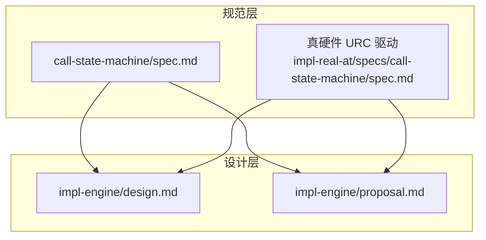
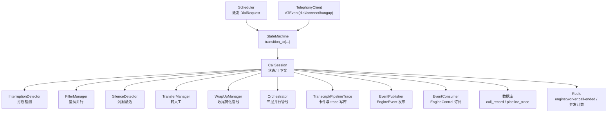
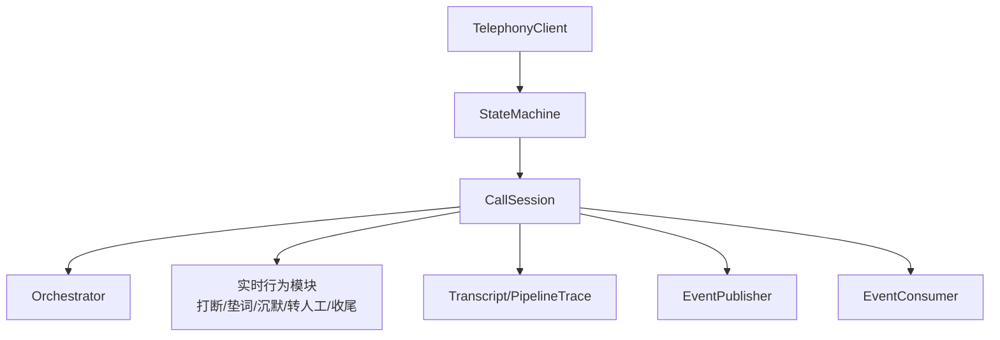

# 状态机设计

<cite>
**本文引用的文件**
- [状态机规范](file://openspec/specs/call-state-machine/spec.md)
- [引擎实现设计（2026-05-07）](file://openspec/changes/archive/2026-05-07-impl-engine/design.md)
- [引擎实现提案（2026-05-07）](file://openspec/changes/archive/2026-05-07-impl-engine/proposal.md)
- [真硬件 URC 驱动状态转换（2026-05-17）](file://openspec/changes/archive/2026-05-17-impl-real-at/specs/call-state-machine/spec.md)
- [状态机规范（2026-05-07）](file://openspec/changes/archive/2026-05-07-impl-engine/specs/call-state-machine/spec.md)
</cite>

## 目录
1. [引言](#引言)
2. [项目结构](#项目结构)
3. [核心组件](#核心组件)
4. [架构总览](#架构总览)
5. [详细组件分析](#详细组件分析)
6. [依赖分析](#依赖分析)
7. [性能考虑](#性能考虑)
8. [故障排查指南](#故障排查指南)
9. [结论](#结论)

## 引言
本文件面向 isales-engine 的状态机设计，系统化阐述基于状态机驱动的通话生命周期管理。文档覆盖状态集合、合法转移规则、关键转换场景（拨号成功进入开场白、开场白完成进入监听、打断处理、沉默激活、转人工流程等）、非法状态转移的处理机制、连续打断保护策略、FILLER 状态的并行性设计，以及事件驱动 API、transcript 记录机制与错误处理策略。目标是帮助开发者与运维人员准确理解状态机契约、调试与扩展状态转换。

## 项目结构
状态机相关规范与实现主要分布在 openspec 的 specs 与 changes 子目录中：
- 规范层：call-state-machine/spec.md 明确状态集合、转换规则与事件契约
- 设计层：impl-engine/design.md 与 proposal.md 描述状态机实现方案、API、transcript 与错误处理
- 真硬件 URC 驱动：impl-real-at/specs/call-state-machine/spec.md 固化 AT 事件到状态转换的映射

图表来源
- [状态机规范:1-190](file://openspec/specs/call-state-machine/spec.md#L1-L190)
- [真硬件 URC 驱动状态转换（2026-05-17）:1-29](file://openspec/changes/archive/2026-05-17-impl-real-at/specs/call-state-machine/spec.md#L1-L29)
- [引擎实现设计（2026-05-07）:75-81](file://openspec/changes/archive/2026-05-07-impl-engine/design.md#L75-L81)
- [引擎实现提案（2026-05-07）:18-22](file://openspec/changes/archive/2026-05-07-impl-engine/proposal.md#L18-L22)

章节来源
- [状态机规范:1-190](file://openspec/specs/call-state-machine/spec.md#L1-L190)
- [引擎实现设计（2026-05-07）:75-81](file://openspec/changes/archive/2026-05-07-impl-engine/design.md#L75-L81)
- [引擎实现提案（2026-05-07）:18-22](file://openspec/changes/archive/2026-05-07-impl-engine/proposal.md#L18-L22)

## 核心组件
- CallSession：承载状态机上下文（当前状态、历史、对话历史、完整事件流、管线 trace、提示词版本快照、填充短语集游标、沉默激活计数、连续打断计数、WRAPPING_UP 双计数器、当前轮次 ID、定时器任务等）
- StateMachine：统一的 transition_to(new_state, reason, meta) API，维护 LEGAL_TRANSITIONS，非法转移抛 IllegalTransition 并写 transcript
- Transcript 与 PipelineTrace：事件落盘与管线 trace 落库，确保每轮 PROCESSING 都有 trace
- 事件驱动：所有状态转换由统一事件触发，转换时追加事件到 transcript

章节来源
- [引擎实现设计（2026-05-07）:56-73](file://openspec/changes/archive/2026-05-07-impl-engine/design.md#L56-L73)
- [引擎实现设计（2026-05-07）:75-81](file://openspec/changes/archive/2026-05-07-impl-engine/design.md#L75-L81)
- [引擎实现设计（2026-05-07）:238-242](file://openspec/changes/archive/2026-05-07-impl-engine/design.md#L238-L242)
- [引擎实现提案（2026-05-07）:18-22](file://openspec/changes/archive/2026-05-07-impl-engine/proposal.md#L18-L22)

## 架构总览
状态机位于 engine 的核心，调度器派发 DialRequest 启动 CallSession，随后通过 TelephonyClient 的 ATEvent 驱动状态转换。实时行为模块（打断、垫词、沉默激活、转人工、目标达成）均通过状态转换接入，所有转换写入 transcript，并在非法转移时抛出异常并记录 state_error。

图表来源
- [引擎实现设计（2026-05-07）:47-54](file://openspec/changes/archive/2026-05-07-impl-engine/design.md#L47-L54)
- [引擎实现设计（2026-05-07）:168-172](file://openspec/changes/archive/2026-05-07-impl-engine/design.md#L168-L172)
- [引擎实现设计（2026-05-07）:174-178](file://openspec/changes/archive/2026-05-07-impl-engine/design.md#L174-L178)
- [引擎实现设计（2026-05-07）:180-184](file://openspec/changes/archive/2026-05-07-impl-engine/design.md#L180-L184)
- [引擎实现设计（2026-05-07）:186-190](file://openspec/changes/archive/2026-05-07-impl-engine/design.md#L186-L190)
- [引擎实现提案（2026-05-07）:84-91](file://openspec/changes/archive/2026-05-07-impl-engine/proposal.md#L84-L91)
- [状态机规范:46-48](file://openspec/specs/call-state-machine/spec.md#L46-L48)

## 详细组件分析

### 状态集合与合法转移
- 状态集合：INIT、GREETING、LISTENING、SPEAKING、INTERRUPTED、FILLER、PROCESSING、WRAPPING_UP、ACTIVATING、TRANSFERRING、END
- 合法转移：StateMachine 内维护 LEGAL_TRANSITIONS，任何不属于当前状态合法转移集合的事件将抛 IllegalTransition，并在 transcript 中追加 state_error 事件
- 起始与终止：INIT 为起始状态；进入 END 后不再发生状态转换，落库 call_record 并派发“通话结束”消息

章节来源
- [状态机规范:5-21](file://openspec/specs/call-state-machine/spec.md#L5-L21)
- [状态机规范:23-31](file://openspec/specs/call-state-machine/spec.md#L23-L31)
- [引擎实现设计（2026-05-07）:75-81](file://openspec/changes/archive/2026-05-07-impl-engine/design.md#L75-L81)

### 关键状态转换场景
- 拨号成功进入开场白：modem-controller 上报 connected → INIT → GREETING，启动开场白 TTS
- 开场白完成进入监听：GREETING → LISTENING
- SPEAKING 期间打断：SPEAKING → INTERRUPTED → PROCESSING，立刻停 TTS
- 用户正常说完进入处理：LISTENING → PROCESSING，同时启动 FILLER
- 处理完成进入回复：PROCESSING → SPEAKING（产出 reply）
- 目标达成进入收尾：PROCESSING → SPEAKING（先播放当前轮 reply）→ WRAPPING_UP
- 收尾结束：WRAPPING_UP 结束 → END（reason=wrap_up_completed）
- 沉默触发激活：LISTENING → ACTIVATING（达到沉默阈值且未达激活上限）
- 激活上限挂断：沉默触发但激活次数已达上限 → 播放 silence_hangup_phrase → END（reason=silence_max_reached）
- 转人工触发：任一转人工触发条件命中 → TRANSFERRING（播衔接话术→主动挂断）→ END（reason=marked_for_handoff）
- 长时间无进展挂断：超过 max_no_progress_seconds → END（reason=no_progress_timeout）
- 用户挂机：modem-controller 上报 remote_hangup → END（reason=透传 hangup_cause）

章节来源
- [状态机规范:46-108](file://openspec/specs/call-state-machine/spec.md#L46-L108)
- [真硬件 URC 驱动状态转换（2026-05-17）:12-25](file://openspec/changes/archive/2026-05-17-impl-real-at/specs/call-state-machine/spec.md#L12-L25)

### 非法状态转移与错误处理
- 非法转移抛异常：任何模块触发的目标不在 LEGAL_TRANSITIONS 集合内 → 抛 IllegalTransition
- transcript 记录：写入 state_error 事件（包含 attempted、from_state、to_state、ts）
- 可恢复与不可恢复：
  - 可忽略：如 ASR partial 在 PROCESSING 期间 → 模块继续，状态机不改 state
  - 不可忽略：如 PROCESSING 期间 telephony_client 心跳丢失 → 模块强制进 END(reason=engine_internal_error)，跳过合法性校验

章节来源
- [状态机规范:33-44](file://openspec/specs/call-state-machine/spec.md#L33-L44)
- [引擎实现设计（2026-05-07）:75-81](file://openspec/changes/archive/2026-05-07-impl-engine/design.md#L75-L81)

### 连续打断保护策略
- 维护连续打断计数器：当连续 INTERRUPTED → PROCESSING → SPEAKING → INTERRUPTED 循环超过阈值，触发保护策略
- 完整轮次清零：当用户完成一轮无打断的 SPEAKING（SPEAKING TTS 完整播完未被打断）→ 计数器清零

章节来源
- [状态机规范:110-117](file://openspec/specs/call-state-machine/spec.md#L110-L117)

### FILLER 状态的并行性设计
- 并行启动：FILLER 与 PROCESSING 同时启动；PROCESSING 返回 reply 后等待 FILLER 完成再播放 TTS
- 打断处理：FILLER 期间被打断 → 立即停垫词、终止当前 PROCESSING、状态 → PROCESSING（新一轮，使用新 ASR 终态结果）

章节来源
- [状态机规范:119-126](file://openspec/specs/call-state-machine/spec.md#L119-L126)

### WRAPPING_UP 期间的简化管线
- 简化管线：WRAPPING_UP 下不启用 PK/裁判/垫词，仅单角色 LLM + 润色
- 特殊行为：WRAPPING_UP 期间用户提出新问题 → 走简化管线，状态在 WRAPPING_UP 内闭环

章节来源
- [状态机规范:128-135](file://openspec/specs/call-state-machine/spec.md#L128-L135)

### TRANSFERRING 状态边界
- 状态期间限制：TRANSFERRING 期间不调用 AI 管线；可保持 ASR 流式工作以补录最后一条 transcript
- 结束流程：衔接话术播完后直接进入 END（v1 不存在转接成功/失败二级分支）

章节来源
- [状态机规范:137-144](file://openspec/specs/call-state-machine/spec.md#L137-L144)

### 事件驱动 API 与 transcript 记录
- 统一 API：transition_to(new_state, reason, meta) 是唯一改状态入口
- 事件写入：每次转换时追加事件到 transcript，自动计算相对时间戳
- 事件类型：greeting、user_speech、ai_reply 等进入 dialog_history；系统话术（如 silence_activation）不入 dialog_history

章节来源
- [状态机规范:46-48](file://openspec/specs/call-state-machine/spec.md#L46-L48)
- [引擎实现设计（2026-05-07）:238-242](file://openspec/changes/archive/2026-05-07-impl-engine/design.md#L238-L242)

### 真硬件 URC 驱动状态转换
- 仅由 SerialATClient 翻译出的 ATEvent（经 IPC 上抛）触发状态转换
- ATD ACK 后状态停留在 INIT：必须等待 IPC connected 事件才触发 INIT → GREETING
- ATD 被拒绝立即结束：INIT → END（reason=透传 cause），transcript 记录 state_error

章节来源
- [状态机规范:146-158](file://openspec/specs/call-state-machine/spec.md#L146-L158)
- [真硬件 URC 驱动状态转换（2026-05-17）:3-25](file://openspec/changes/archive/2026-05-17-impl-real-at/specs/call-state-machine/spec.md#L3-L25)

### hangup_cause 单一来源与透传
- 统一枚举：hangup_cause 来源于 HangupCause 枚举，禁止各模块自定义平行词汇表
- 远端透传：remote_hangup 事件的 cause 透传到 END.reason
- 应用层区分：engine 主动 hangup 的 cause（如 manual_hangup）不作为 END.reason 使用

章节来源
- [状态机规范:170-185](file://openspec/specs/call-state-machine/spec.md#L170-L185)
- [真硬件 URC 驱动状态转换（2026-05-17）:17-25](file://openspec/changes/archive/2026-05-17-impl-real-at/specs/call-state-machine/spec.md#L17-L25)

## 依赖分析
- 状态机依赖：CallSession（上下文）、StateMachine（转换规则）、Transcript/PipelineTrace（事件与 trace）、TelephonyClient（ATEvent 驱动）
- 实时行为模块：打断检测、垫词、沉默激活、转人工、收尾管理均通过状态转换接入
- 通信边界：EngineEvent 发布采用 fire-and-forget；EngineControl 订阅按 campaign 分发

图表来源
- [引擎实现设计（2026-05-07）:168-178](file://openspec/changes/archive/2026-05-07-impl-engine/design.md#L168-L178)
- [引擎实现设计（2026-05-07）:180-184](file://openspec/changes/archive/2026-05-07-impl-engine/design.md#L180-L184)
- [引擎实现提案（2026-05-07）:84-91](file://openspec/changes/archive/2026-05-07-impl-engine/proposal.md#L84-L91)

章节来源
- [引擎实现设计（2026-05-07）:168-190](file://openspec/changes/archive/2026-05-07-impl-engine/design.md#L168-L190)
- [引擎实现提案（2026-05-07）:92-101](file://openspec/changes/archive/2026-05-07-impl-engine/proposal.md#L92-L101)

## 性能考虑
- 三层管线并行：Layer 1（N 路角色 PK）gather 等待全部完成；Layer 2（M 路裁判）并行；Layer 3（润色）单次调用
- 响应优先：FILLER 与 PROCESSING 并行，管线先返回后等待垫词播完再播放 TTS
- 超时与降级：单 LLM 8s 超时；全部失败走默认回复兜底；pipeline_trace 每轮必写，失败不影响通话主路径
- 发布与控制：EngineEvent fire-and-forget，publish 失败仅记录日志；EngineControl 单订阅任务分发

章节来源
- [引擎实现设计（2026-05-07）:91-108](file://openspec/changes/archive/2026-05-07-impl-engine/design.md#L91-L108)
- [引擎实现设计（2026-05-07）:138-142](file://openspec/changes/archive/2026-05-07-impl-engine/design.md#L138-L142)
- [引擎实现设计（2026-05-07）:168-172](file://openspec/changes/archive/2026-05-07-impl-engine/design.md#L168-L172)
- [引擎实现设计（2026-05-07）:174-178](file://openspec/changes/archive/2026-05-07-impl-engine/design.md#L174-L178)

## 故障排查指南
- 非法转移定位：关注 transcript 中 state_error 事件，结合 IllegalTransition 异常快速定位模块越权触发
- 事件流核对：通过 transcript 与 pipeline_trace 核对每轮 PROCESSING 的执行路径与错误原因
- 真硬件事件：确认 ATEvent 来源与 IPC 上报顺序，避免因 ATD ACK/中间 URC 单独触发导致状态提前转移
- hangup_cause 校验：确保 END.reason 与远端 cause 一致，避免将所有远端挂断映射为 user_hangup
- 优雅停机：SIGTERM 时取消所有 session 任务并写 hangup{engine_shutdown}，确保并发计数器正确释放

章节来源
- [状态机规范:33-44](file://openspec/specs/call-state-machine/spec.md#L33-L44)
- [状态机规范:170-185](file://openspec/specs/call-state-machine/spec.md#L170-L185)
- [真硬件 URC 驱动状态转换（2026-05-17）:12-25](file://openspec/changes/archive/2026-05-17-impl-real-at/specs/call-state-machine/spec.md#L12-L25)
- [引擎实现设计（2026-05-07）:186-190](file://openspec/changes/archive/2026-05-07-impl-engine/design.md#L186-L190)

## 结论
isales-engine 的状态机以 call-state-machine 规范为核心，通过统一的 transition_to API、严格的合法转移集合与 transcript 记录，实现了对打断、垫词、沉默激活、转人工、目标达成与收尾等实时行为的编排。配合真硬件 URC 驱动与 hangup_cause 单一来源契约，状态机在运行时具备高可维护性与可观测性。建议在扩展新状态或转换时，严格遵循“事件驱动 + 合法转移 + 事件落盘”的设计原则，并通过单元测试覆盖所有路径与异常分支。