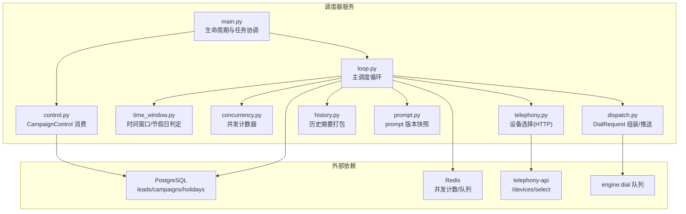
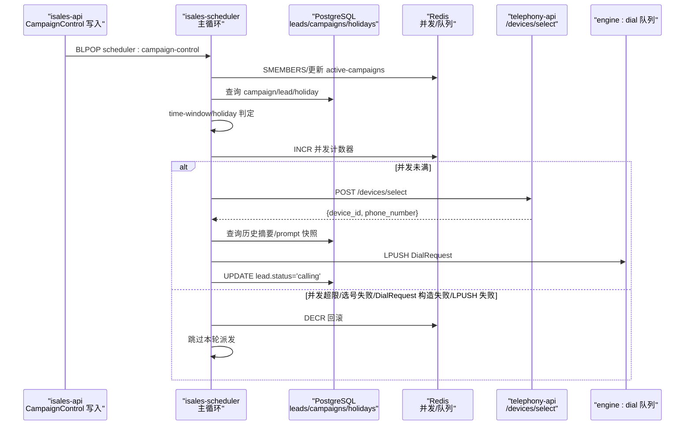
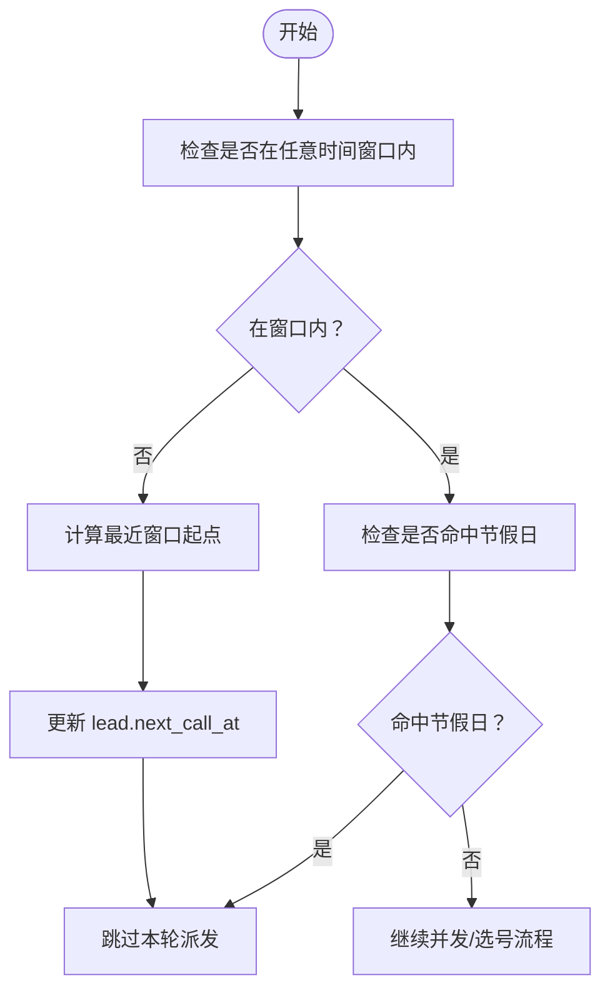
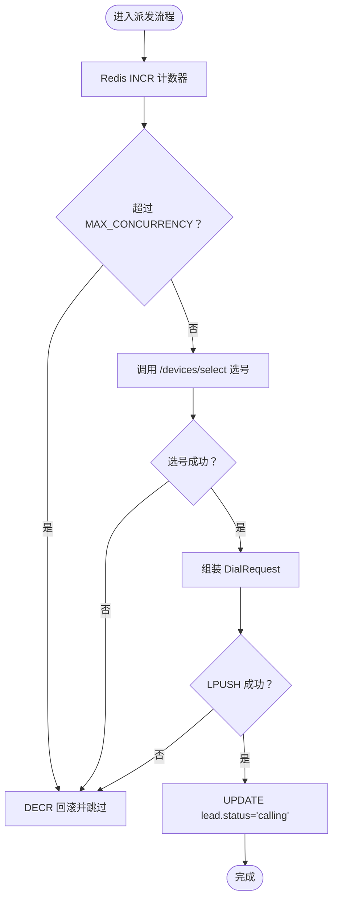
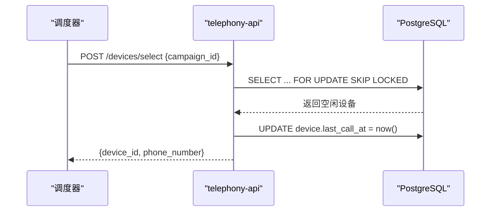
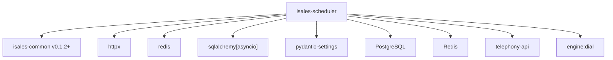

# isales-scheduler 调度器

<cite>
**本文档引用的文件**
- [proposal.md](file://openspec/changes/archive/2026-05-06-impl-scheduler/proposal.md)
- [design.md](file://openspec/changes/archive/2026-05-06-impl-scheduler/design.md)
- [spec.md（重试跟进）](file://openspec/specs/retry-followup/spec.md)
- [spec.md（时间窗口）](file://openspec/specs/time-window/spec.md)
- [tasks.md](file://openspec/changes/archive/2026-05-06-impl-scheduler/tasks.md)
- [scheduler.env.example（通用）](file://deploy/env/scheduler.env.example)
- [scheduler.env.example（云边拆分）](file://deploy/cloud/env/scheduler.env.example)
- [device-hardware（选号API）](file://openspec/specs/device-hardware/spec.md)
- [arch-cloud-edge-split（选号演进）](file://openspec/changes/arch-cloud-edge-split/specs/device-hardware/spec.md)
</cite>

## 目录
1. [简介](#简介)
2. [项目结构](#项目结构)
3. [核心组件](#核心组件)
4. [架构概览](#架构概览)
5. [详细组件分析](#详细组件分析)
6. [依赖分析](#依赖分析)
7. [性能考虑](#性能考虑)
8. [故障排除指南](#故障排除指南)
9. [结论](#结论)
10. [附录](#附录)

## 简介
isales-scheduler 是 isales 外呼系统中的调度器服务，负责从数据库中扫描待处理的线索（lead），根据配置的时间窗口和节假日策略进行过滤，结合全局并发控制，将合适的线索分配给可用的通话引擎实例。调度器采用 asyncio 单任务循环模型，每分钟执行一次调度 tick，确保在可通话时间内高效、有序地派发外呼任务。

调度器的关键职责包括：
- 维护活动营销活动集合（通过消费 CampaignControl 消息）
- 基于时间窗口和节假日规则筛选可拨线索
- 全局并发上限控制（Redis INCR/DECR）
- 设备选择（HTTP 调用 telephony-api 或云边拆分后的 PG 直接选择）
- 组装 DialRequest 并推送到 engine:dial 队列
- 仅在"窗外重排"场景更新 next_call_at，其他状态写入由 worker 负责

## 项目结构
isales-scheduler 为独立的 Python 仓库，采用异步架构，核心目录结构如下：
- isales_scheduler/
  - __init__.py, main.py：入口与生命周期管理
  - settings.py：环境变量配置读取
  - db.py：异步数据库会话工厂
  - redis_client.py：异步 Redis 客户端包装
  - control.py：CampaignControl 消费任务
  - loop.py：主调度循环
  - time_window.py：时间窗口与节假日判定
  - concurrency.py：全局并发计数器
  - telephony.py：设备选择（HTTP 方案）
  - history.py：历史摘要打包
  - prompt.py：prompt 版本快照
  - dispatch.py：DialRequest 组装与推送
- tests/：pytest 测试套件
- scripts/：开发用脚本（如 fake_engine_consumer.py）

**图表来源**
- [proposal.md: 7-48:7-48](file://openspec/changes/archive/2026-05-06-impl-scheduler/proposal.md#L7-L48)
- [design.md: 35-52:35-52](file://openspec/changes/archive/2026-05-06-impl-scheduler/design.md#L35-L52)

**章节来源**
- [proposal.md: 7-48:7-48](file://openspec/changes/archive/2026-05-06-impl-scheduler/proposal.md#L7-L48)
- [design.md: 35-52:35-52](file://openspec/changes/archive/2026-05-06-impl-scheduler/design.md#L35-L52)

## 核心组件
- 生命周期与任务协调：main.py 负责启动 CampaignControl 消费任务与调度循环任务，优雅停机时取消并等待任务完成。
- 主调度循环：每分钟执行一次 tick，遍历活动营销活动，按时间窗口/节假日过滤、并发上限检查、设备选择、历史摘要与 prompt 快照组装、DialRequest 推送。
- CampaignControl 消费：后台任务阻塞 BLPOP scheduler:campaign-control，反序列化后更新 Redis SET 与进程内缓存，失败则写入 DLQ。
- 时间窗口与节假日：判定当前是否在 campaign.time_windows 任一窗口内，以及是否命中 campaign.respect_holidays=true 的节假日。
- 全局并发计数器：Redis INCR/DECR 原子操作，超过上限立即回滚，失败路径统一 DECR。
- 设备选择：HTTP POST telephony-api/devices/select 获取 device_id 与 phone_number；云边拆分后改为 PG 直接选择（FOR UPDATE SKIP LOCKED）。
- 历史摘要与 prompt 快照：跟进通话时取最近 N 条 call_summary，当前 prompt_versions 快照注入 DialRequest。
- DialRequest 组装与推送：构造 DialRequest（Pydantic 校验）并 LPUSH 到 engine:dial 队列；成功后仅将 lead.status 更新为 calling。

**章节来源**
- [proposal.md: 12-29:12-29](file://openspec/changes/archive/2026-05-06-impl-scheduler/proposal.md#L12-L29)
- [design.md: 45-137:45-137](file://openspec/changes/archive/2026-05-06-impl-scheduler/design.md#L45-L137)
- [tasks.md: 25-38:25-38](file://openspec/changes/archive/2026-05-06-impl-scheduler/tasks.md#L25-L38)

## 架构概览
调度器与上下游服务的交互关系如下：

**图表来源**
- [proposal.md: 18-29:18-29](file://openspec/changes/archive/2026-05-06-impl-scheduler/proposal.md#L18-L29)
- [design.md: 95-137:95-137](file://openspec/changes/archive/2026-05-06-impl-scheduler/design.md#L95-L137)

## 详细组件分析

### 时间窗口与节假日判定
- Campaign 级多窗口配置：campaign.time_windows 为 JSONB 数组，支持多个窗口（星期几 + 起止时间）。
- 时区策略：统一按服务器时区（如 Asia/Shanghai）解读窗口与 next_call_at。
- 节假日策略：campaign.respect_holidays 控制是否遵循全局 holiday 表；命中节假日当日整日 skip。
- 窗外线索推迟：当前不在窗口内但满足 next_call_at <= now 的线索，计算最近窗口起点并更新 next_call_at，本次跳过。

**图表来源**
- [spec.md（时间窗口）: 51-77:51-77](file://openspec/specs/time-window/spec.md#L51-L77)

**章节来源**
- [spec.md（时间窗口）: 7-77:7-77](file://openspec/specs/time-window/spec.md#L7-L77)
- [tasks.md: 25-31:25-31](file://openspec/changes/archive/2026-05-06-impl-scheduler/tasks.md#L25-L31)

### 全局并发控制机制
- Redis INCR/DECR 原子计数：派发前 INCR，超 MAX_CONCURRENCY 立即 DECR 并跳过；任何失败路径（选号失败、DialRequest 构造失败、LPUSH 失败）均 DECR 回滚。
- 计数器键名：isales:concurrency:active；与架构/设计约定一致。
- 泄漏防护：阶段 4 引入 call_session TTL 兜底，本阶段通过日志警告协助运维监测。

**图表来源**
- [design.md: 95-102:95-102](file://openspec/changes/archive/2026-05-06-impl-scheduler/design.md#L95-L102)

**章节来源**
- [design.md: 95-102:95-102](file://openspec/changes/archive/2026-05-06-impl-scheduler/design.md#L95-L102)
- [tasks.md: 33-38:33-38](file://openspec/changes/archive/2026-05-06-impl-scheduler/tasks.md#L33-L38)

### 设备选择策略（HTTP 方案）
- 选号 API：POST {TELEPHONY_API_BASE}/devices/select，请求体 {campaign_id}，响应体 {device_id, phone_number}。
- 负载均衡：按 device.last_call_at 最早优先（NULL 视为最早）。
- 并发安全：事务内 SELECT ... FOR UPDATE SKIP LOCKED + 更新 last_call_at，避免并发重复选中同一设备。
- 超时策略：短超时（< 1s），网络错误/5xx 直接回滚并跳过本轮。

**图表来源**
- [device-hardware（选号API）: 12-24:12-24](file://openspec/specs/device-hardware/spec.md#L12-L24)

**章节来源**
- [device-hardware（选号API）: 12-24:12-24](file://openspec/specs/device-hardware/spec.md#L12-L24)
- [design.md: 104-112:104-112](file://openspec/changes/archive/2026-05-06-impl-scheduler/design.md#L104-L112)

### 云边拆分后的设备选择演进
- 云边拆分后，telephony-api 的 /devices/select HTTP 接口不再使用；云端调度器直接基于云内 PG 的 device 表进行选择。
- 选号算法：取 campaign 关联的 device，过滤 status=idle 且 sim 绑定活跃，按 last_call_at 最早优先，无空闲设备则暂停重试。

**章节来源**
- [arch-cloud-edge-split（选号演进）: 91-102:91-102](file://openspec/changes/arch-cloud-edge-split/specs/device-hardware/spec.md#L91-L102)

### 历史摘要与 prompt 快照
- 跟进通话时取 lead 最近 N 条 call_summary（N 由配置项 ISALES_SCHEDULER_HISTORY_N 控制），字段裁剪为 call_record_id/summary/ended_at。
- prompt 快照：取 role_config/prompt_version 当前 active 版本，注入 DialRequest。
- 非跟进通话不查 call_summary，减少 DB 压力。

**章节来源**
- [design.md: 113-129:113-129](file://openspec/changes/archive/2026-05-06-impl-scheduler/design.md#L113-L129)
- [spec.md（重试跟进）: 52-69:52-69](file://openspec/specs/retry-followup/spec.md#L52-L69)

### DialRequest 组装与推送
- 使用 isales-common 的 Pydantic 类构造 DialRequest，包含 lead 信息、is_follow_up、follow_up_count、历史摘要、prompt 快照等。
- LPUSH 到 engine:dial 队列；成功后仅将 lead.status 更新为 calling，避免重复派发。

**章节来源**
- [proposal.md: 25-29:25-29](file://openspec/changes/archive/2026-05-06-impl-scheduler/proposal.md#L25-L29)
- [design.md: 130-137:130-137](file://openspec/changes/archive/2026-05-06-impl-scheduler/design.md#L130-L137)

### CampaignControl 消费与活动集合维护
- 后台任务 BLPOP scheduler:campaign-control，反序列化为 StartCampaign/PauseCampaign/ResumeCampaign。
- Redis SET scheduler:active-campaigns 持久化 + 进程内缓存；启动时 SMEMBERS 重建缓存；实时同步两端。
- schema_version 不支持时写入 DLQ 并记录日志。

**章节来源**
- [proposal.md: 12-16:12-16](file://openspec/changes/archive/2026-05-06-impl-scheduler/proposal.md#L12-L16)
- [design.md: 45-52:45-52](file://openspec/changes/archive/2026-05-06-impl-scheduler/design.md#L45-L52)

## 依赖分析
- Python 3.11+，异步框架统一（与 api/telephony 一致）
- 依赖库：isales-common（v0.1.2+）、httpx、redis、sqlalchemy[asyncio]、pydantic-settings
- 外部服务：PostgreSQL（数据库）、Redis（并发计数/队列）、telephony-api（HTTP 选号）
- 队列：engine:dial（Redis 列表）

**图表来源**
- [tasks.md: 7-13:7-13](file://openspec/changes/archive/2026-05-06-impl-scheduler/tasks.md#L7-L13)

**章节来源**
- [tasks.md: 7-13:7-13](file://openspec/changes/archive/2026-05-06-impl-scheduler/tasks.md#L7-L13)

## 性能考虑
- 调度周期：每分钟一次 tick，配置项 ISALES_SCHEDULER_TICK_INTERVAL（秒）可调，默认 60s。
- 限批策略：每 campaign 限批 N 条（ISALES_SCHEDULER_BATCH_SIZE），避免单 campaign 占尽 tick。
- 并发上限：MAX_CONCURRENCY（ISALES_MAX_CONCURRENCY）控制全局并发，防止资源过载。
- 选号超时：HTTP 选号短超时（< 1s），失败留给下一 tick，降低对整体批处理的影响。
- 历史摘要裁剪：N 条限制避免 DialRequest 体积过大导致 token 超限。
- 节假日批量更新：单 tick 仅更新 LIMIT N 条 lead.next_call_at，避免锁表问题。

**章节来源**
- [design.md: 37-43:37-43](file://openspec/changes/archive/2026-05-06-impl-scheduler/design.md#L37-L43)
- [design.md: 71-77:71-77](file://openspec/changes/archive/2026-05-06-impl-scheduler/design.md#L71-L77)
- [design.md: 104-112:104-112](file://openspec/changes/archive/2026-05-06-impl-scheduler/design.md#L104-L112)
- [design.md: 113-120:113-120](file://openspec/changes/archive/2026-05-06-impl-scheduler/design.md#L113-L120)
- [design.md: 166-168:166-168](file://openspec/changes/archive/2026-05-06-impl-scheduler/design.md#L166-L168)

## 故障排除指南
- 并发计数器泄漏：阶段 4 引入 call_session TTL 兜底；本阶段通过日志警告协助运维监测。
- 选号失败回滚：网络错误/5xx 自动 DECR 回滚并跳过本轮，下一 tick 自然重试。
- DLQ 处理：CampaignControl schema_version 不兼容消息写入 scheduler:dlq，需定期巡检与报警。
- 窗外线索推进：若发现大量线索 next_call_at 被推进，检查 time-window 配置与时区设置。
- 节假日影响：尊重节假日的 campaign 在节假日当天整日 skip，可通过调整 campaign 配置或临时禁用节假日策略缓解。

**章节来源**
- [design.md: 160-171:160-171](file://openspec/changes/archive/2026-05-06-impl-scheduler/design.md#L160-L171)
- [proposal.md: 41-48:41-48](file://openspec/changes/archive/2026-05-06-impl-scheduler/proposal.md#L41-L48)

## 结论
isales-scheduler 通过明确的调度契约与严格的边界划分，实现了在可通话时间窗口内、受全局并发限制的前提下，将合适的线索高效分配给通话引擎。其设计强调：
- 调度与状态写入的硬契约：仅在派发成功后写入 calling 状态，其他状态与 next_call_at 计算由 worker 负责
- 时间窗口与节假日的强约束：确保窗外不分配新任务，通话进行中跨边界也不强制中断
- 并发控制与资源保护：Redis 原子计数器与失败回滚机制保障资源不泄漏
- 可扩展性：云边拆分后设备选择演进至 PG 直接选择，减少外部依赖

## 附录

### 环境变量配置
- 通用配置（适用于非云边拆分部署）
  - ISALES_DATABASE_URL：数据库连接
  - ISALES_REDIS_URL：Redis 连接
  - ISALES_SCHEDULER_TICK_INTERVAL：调度 tick 间隔（秒）
  - ISALES_SCHEDULER_BATCH_SIZE：每 campaign 限批大小
  - ISALES_SCHEDULER_HISTORY_N：历史摘要条数
  - ISALES_MAX_CONCURRENCY：全局并发上限
  - TZ：服务器时区（如 Asia/Shanghai）

- 云边拆分配置（scheduler.env.example）
  - ISALES_DATABASE_URL / ISALES_REDIS_URL：与 api/engine/worker 保持一致
  - ISALES_SCHEDULER_TICK_INTERVAL / ISALES_SCHEDULER_BATCH_SIZE / ISALES_SCHEDULER_HISTORY_N / ISALES_MAX_CONCURRENCY
  - TZ：Asia/Shanghai

**章节来源**
- [scheduler.env.example（通用）: 12-20:12-20](file://deploy/env/scheduler.env.example#L12-L20)
- [scheduler.env.example（云边拆分）: 6-24:6-24](file://deploy/cloud/env/scheduler.env.example#L6-L24)