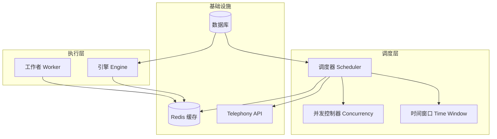
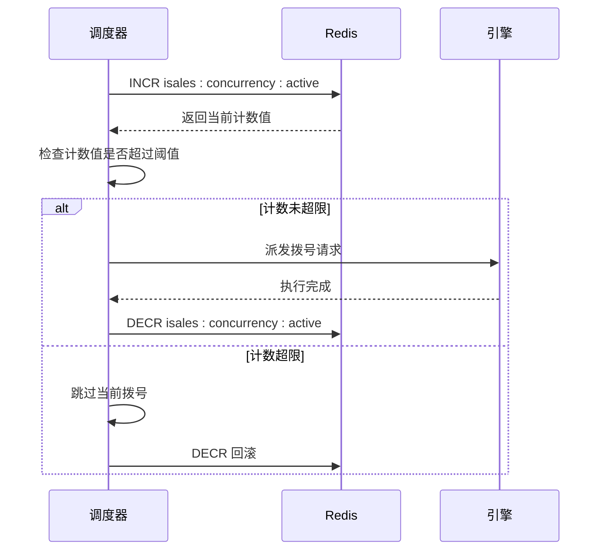
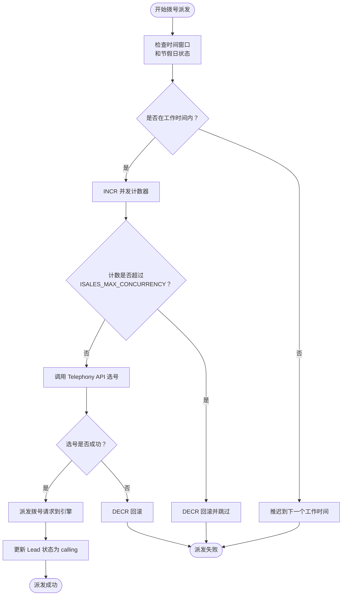
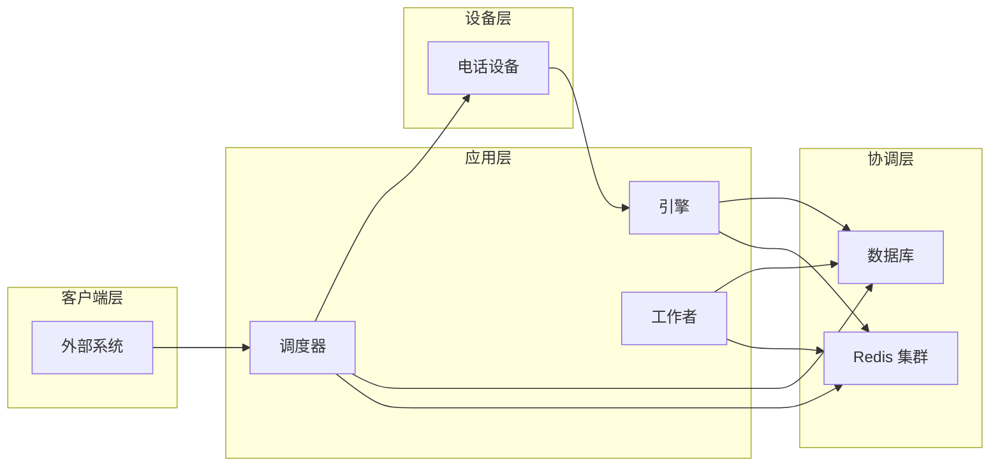
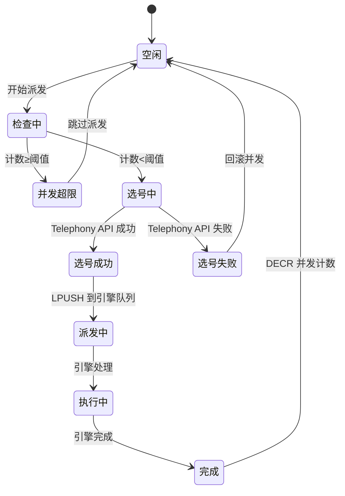
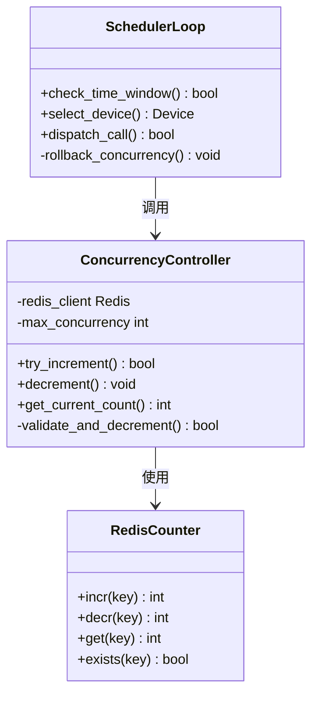
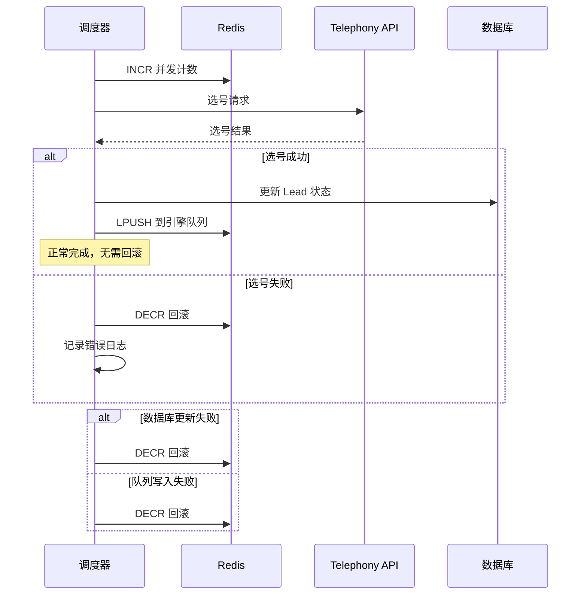
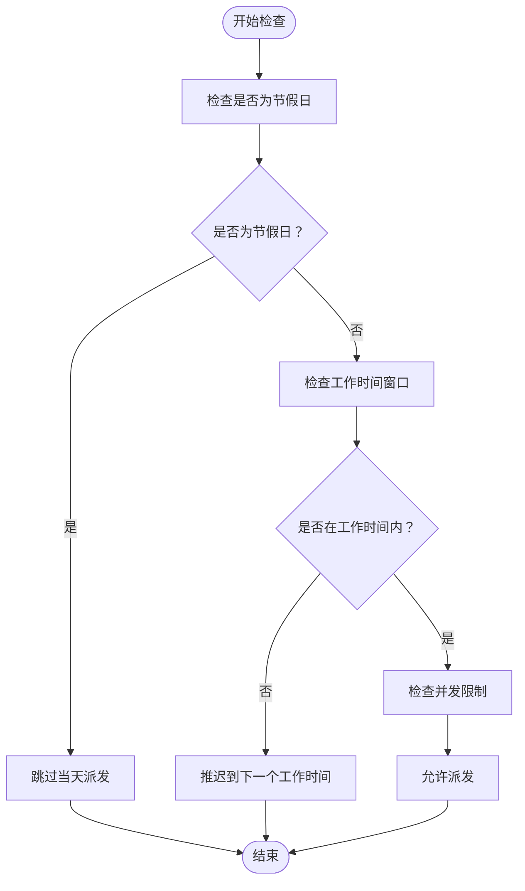
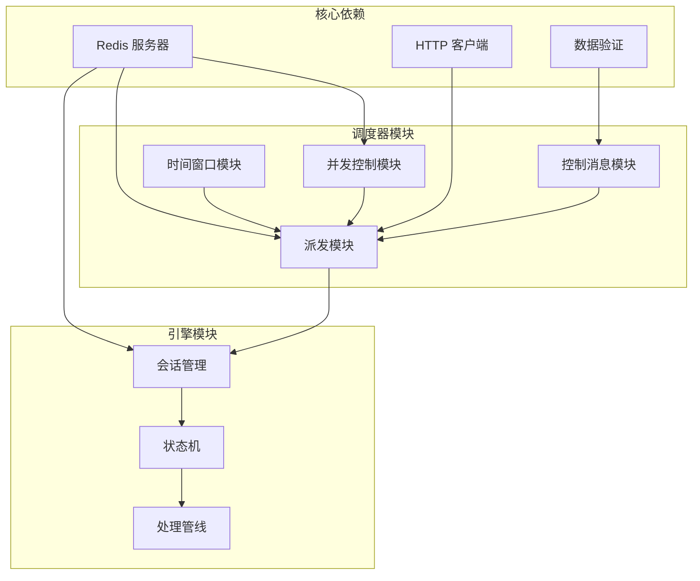
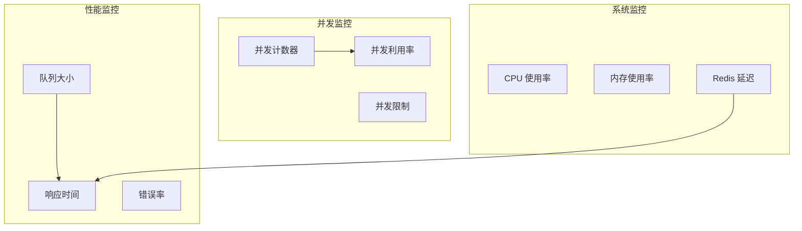

# 并发控制机制

<cite>
**本文档引用的文件**
- [设计文档（调度器）](file://openspec/changes/archive/2026-05-06-impl-scheduler/design.md)
- [实施任务清单（调度器）](file://openspec/changes/archive/2026-05-06-impl-scheduler/tasks.md)
- [设计文档（引擎）](file://openspec/changes/archive/2026-05-07-impl-engine/design.md)
- [架构规范](file://openspec/specs/architecture/spec.md)
- [服务通信规范](file://openspec/specs/service-communication/spec.md)
- [时间窗口规范](file://openspec/specs/time-window/spec.md)
- [retry-followup 规范](file://openspec/specs/retry-followup/spec.md)
</cite>

## 目录
1. [简介](#简介)
2. [项目结构](#项目结构)
3. [核心组件](#核心组件)
4. [架构概览](#架构概览)
5. [详细组件分析](#详细组件分析)
6. [依赖关系分析](#依赖关系分析)
7. [性能考虑](#性能考虑)
8. [故障排除指南](#故障排除指南)
9. [结论](#结论)

## 简介

本文档详细阐述了 isales 系统中的并发控制系统，重点解释调度器如何通过 Redis 计数器实现全局并发限制来防止系统过载。该系统采用分布式原子计数机制，在拨号派发前进行并发检查，确保系统资源的合理分配和负载均衡。

## 项目结构

isales 系统采用微服务架构，主要包含以下核心组件：



**图表来源**
- [设计文档（调度器）:1-190](file://openspec/changes/archive/2026-05-06-impl-scheduler/design.md#L1-L190)
- [设计文档（引擎）:1-310](file://openspec/changes/archive/2026-05-07-impl-engine/design.md#L1-L310)

**章节来源**
- [设计文档（调度器）:1-190](file://openspec/changes/archive/2026-05-06-impl-scheduler/design.md#L1-L190)
- [设计文档（引擎）:1-310](file://openspec/changes/archive/2026-05-07-impl-engine/design.md#L1-L310)

## 核心组件

### Redis 并发计数器

系统使用 Redis 作为全局并发控制的核心组件，通过原子操作确保计数的准确性。

#### 计数器键值设计
- **键名**: `isales:concurrency:active`
- **数据类型**: Redis Integer Counter
- **作用域**: 全局系统范围
- **最大值**: 由 `ISALES_MAX_CONCURRENCY` 环境变量配置

#### 原子操作流程



**图表来源**
- [设计文档（调度器）:95-102](file://openspec/changes/archive/2026-05-06-impl-scheduler/design.md#L95-L102)

### 调度器并发控制模块

调度器负责在拨号派发前进行并发检查，确保系统不会超负荷运行。

#### 并发检查流程



**图表来源**
- [设计文档（调度器）:55-57](file://openspec/changes/archive/2026-05-06-impl-scheduler/design.md#L55-L57)

**章节来源**
- [设计文档（调度器）:95-102](file://openspec/changes/archive/2026-05-06-impl-scheduler/design.md#L95-L102)
- [实施任务清单（调度器）:33-38](file://openspec/changes/archive/2026-05-06-impl-scheduler/tasks.md#L33-L38)

## 架构概览

### 分布式并发控制架构



**图表来源**
- [架构规范](file://openspec/specs/architecture/spec.md)
- [服务通信规范](file://openspec/specs/service-communication/spec.md)

### 并发控制生命周期



**图表来源**
- [设计文档（调度器）:95-102](file://openspec/changes/archive/2026-05-06-impl-scheduler/design.md#L95-L102)
- [设计文档（引擎）:180-184](file://openspec/changes/archive/2026-05-07-impl-engine/design.md#L180-L184)

## 详细组件分析

### 并发控制算法实现

#### 原子 INCR 操作

系统使用 Redis 的原子 INCR 操作来实现并发计数的增加：



**图表来源**
- [设计文档（调度器）:95-102](file://openspec/changes/archive/2026-05-06-impl-scheduler/design.md#L95-L102)
- [实施任务清单（调度器）:33-38](file://openspec/changes/archive/2026-05-06-impl-scheduler/tasks.md#L33-L38)

#### 异常回滚机制

系统实现了完善的异常回滚机制，确保在各种失败情况下都能正确释放并发资源：



**图表来源**
- [设计文档（调度器）:55-57](file://openspec/changes/archive/2026-05-06-impl-scheduler/design.md#L55-L57)

**章节来源**
- [设计文档（调度器）:95-102](file://openspec/changes/archive/2026-05-06-impl-scheduler/design.md#L95-L102)
- [设计文档（调度器）:160-170](file://openspec/changes/archive/2026-05-06-impl-scheduler/design.md#L160-L170)

### 时间窗口集成

并发控制系统与时间窗口功能紧密集成，确保只在允许的时间范围内进行拨号派发：

#### 时间窗口检查流程



**图表来源**
- [时间窗口规范](file://openspec/specs/time-window/spec.md)
- [设计文档（调度器）:79-85](file://openspec/changes/archive/2026-05-06-impl-scheduler/design.md#L79-L85)

**章节来源**
- [设计文档（调度器）:79-94](file://openspec/changes/archive/2026-05-06-impl-scheduler/design.md#L79-L94)

## 依赖关系分析

### 组件间依赖关系



**图表来源**
- [设计文档（调度器）:1-190](file://openspec/changes/archive/2026-05-06-impl-scheduler/design.md#L1-L190)
- [设计文档（引擎）:1-310](file://openspec/changes/archive/2026-05-07-impl-engine/design.md#L1-L310)

### 外部依赖分析

系统对外部组件的依赖关系相对简单，主要依赖 Redis 和 Telephony API：

| 依赖组件 | 用途 | 版本要求 | 备注 |
|---------|------|----------|------|
| Redis | 全局并发计数器 | 无特定版本要求 | 原子操作支持 |
| httpx | Telephony API 调用 | 无特定版本要求 | 异步 HTTP 客户端 |
| pydantic | 数据验证 | v0.1.2 | 消息格式验证 |
| sqlalchemy | 数据库访问 | asyncio 版本 | 异步 ORM |

**章节来源**
- [设计文档（调度器）:1-190](file://openspec/changes/archive/2026-05-06-impl-scheduler/design.md#L1-L190)

## 性能考虑

### 并发参数调优指南

#### 最大并发数设置

根据系统硬件配置和业务需求，合理设置最大并发数：

| 硬件配置 | 推荐最大并发数 | 说明 |
|----------|----------------|------|
| 低配服务器 (2核4GB) | 4-8 | 适合开发测试环境 |
| 中配服务器 (4核8GB) | 8-16 | 生产环境基础配置 |
| 高配服务器 (8核16GB+) | 16-32 | 大规模生产环境 |
| GPU加速服务器 | 32+ | 需要大量并发处理能力 |

#### 环境变量配置

```bash
# 调度器配置
export ISALES_MAX_CONCURRENCY=8          # 最大并发数
export ISALES_SCHEDULER_TICK_INTERVAL=60 # 调度周期(秒)
export ISALES_SCHEDULER_BATCH_SIZE=10    # 每批处理数量
export ISALES_SCHEDULER_HISTORY_N=3      # 历史摘要数量
```

#### 性能监控指标

| 监控指标 | 目标值 | 告警阈值 | 说明 |
|----------|--------|----------|------|
| 并发计数器 | < ISALES_MAX_CONCURRENCY | ≥ ISALES_MAX_CONCURRENCY | 实时监控 |
| 调度延迟 | < 10秒 | > 30秒 | 派发响应时间 |
| 选号成功率 | > 95% | < 90% | Telephony API 性能 |
| 队列积压 | < 100条 | > 500条 | 引擎处理能力 |
| 错误率 | < 1% | > 5% | 系统稳定性 |

**章节来源**
- [设计文档（调度器）:177-188](file://openspec/changes/archive/2026-05-06-impl-scheduler/design.md#L177-L188)

### 性能优化建议

1. **Redis 性能优化**
   - 使用 Redis Cluster 进行水平扩展
   - 合理设置连接池大小
   - 启用 Redis 持久化策略

2. **调度器优化**
   - 调整 TICK_INTERVAL 参数
   - 优化 BATCH_SIZE 避免过度批次
   - 实现智能重试机制

3. **网络优化**
   - 使用连接复用减少 TCP 建立开销
   - 实现超时和重试策略
   - 监控网络延迟和丢包率

## 故障排除指南

### 常见问题诊断

#### 并发计数器泄漏

**症状**: 并发计数器持续增长且无法下降

**诊断步骤**:
1. 检查引擎是否正常完成通话并发送 CallEnded
2. 验证 DECR 操作是否被执行
3. 检查 Redis 连接状态和权限

**解决方案**:
```python
# 引擎优雅停机时的回滚处理
def graceful_shutdown():
    for session in active_sessions:
        session.transition_to(END, reason='engine_shutdown')
        # 确保 DECR 操作执行
        decrement_concurrency()
```

#### 选号失败处理

**症状**: 大量选号请求失败导致并发计数器异常

**诊断步骤**:
1. 检查 Telephony API 的可用性和响应时间
2. 验证网络连接和防火墙设置
3. 监控 API 错误码和重试次数

**解决方案**:
```python
# 选号失败的回滚机制
def handle_device_selection_failure():
    decrement_concurrency()
    log_warn("Device selection failed, concurrency rolled back")
    # 等待一段时间后重试
    await asyncio.sleep(RETRY_DELAY)
```

#### 队列积压问题

**症状**: 引擎队列持续增长影响系统性能

**诊断步骤**:
1. 检查引擎处理速度和资源使用情况
2. 监控数据库连接池状态
3. 分析队列消息内容和处理时间

**解决方案**:
```python
# 动态调整处理策略
def adjust_processing_rate(current_queue_size):
    if current_queue_size > HIGH_WATERMARK:
        return 'slow_down'
    elif current_queue_size < LOW_WATERMARK:
        return 'speed_up'
    else:
        return 'maintain'
```

**章节来源**
- [设计文档（调度器）:160-170](file://openspec/changes/archive/2026-05-06-impl-scheduler/design.md#L160-L170)
- [设计文档（引擎）:250-257](file://openspec/changes/archive/2026-05-07-impl-engine/design.md#L250-L257)

### 监控和告警

#### 关键监控指标



**图表来源**
- [服务通信规范](file://openspec/specs/service-communication/spec.md)

#### 告警配置建议

| 告警级别 | 指标阈值 | 告警条件 | 处理时限 |
|----------|----------|----------|----------|
| 严重 | 并发利用率 ≥ 95% | 连续 5 分钟 | 15 分钟内解决 |
| 重要 | 队列大小 ≥ 1000 | 连续 10 分钟 | 30 分钟内解决 |
| 次要 | 错误率 ≥ 5% | 连续 15 分钟 | 1 小时内解决 |

## 结论

isales 系统的并发控制系统通过 Redis 原子计数器实现了可靠的全局并发限制，有效防止系统过载。该系统具有以下特点：

1. **可靠性**: 使用 Redis 原子操作确保计数准确性
2. **可扩展性**: 支持水平扩展和分布式部署
3. **可观测性**: 完善的监控和告警机制
4. **健壮性**: 全面的异常回滚和故障恢复机制

通过合理的参数配置和持续的性能监控，系统能够在保证服务质量的同时最大化利用硬件资源。建议根据实际业务需求和硬件配置进行参数调优，并建立完善的监控告警体系来确保系统的稳定运行。