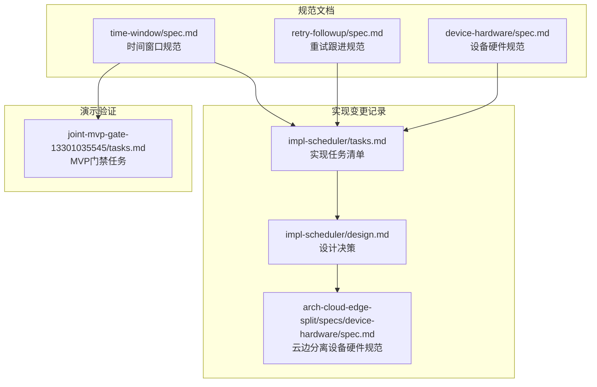
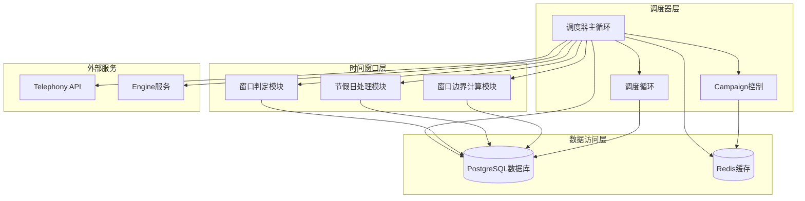
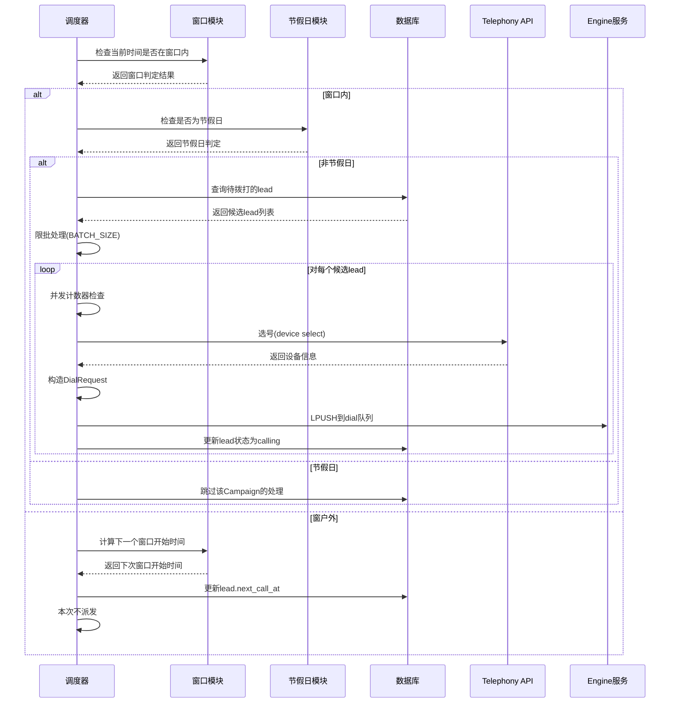
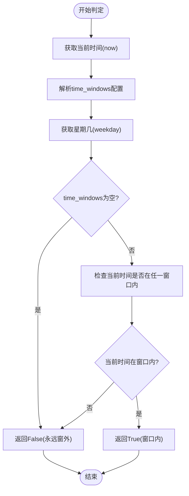
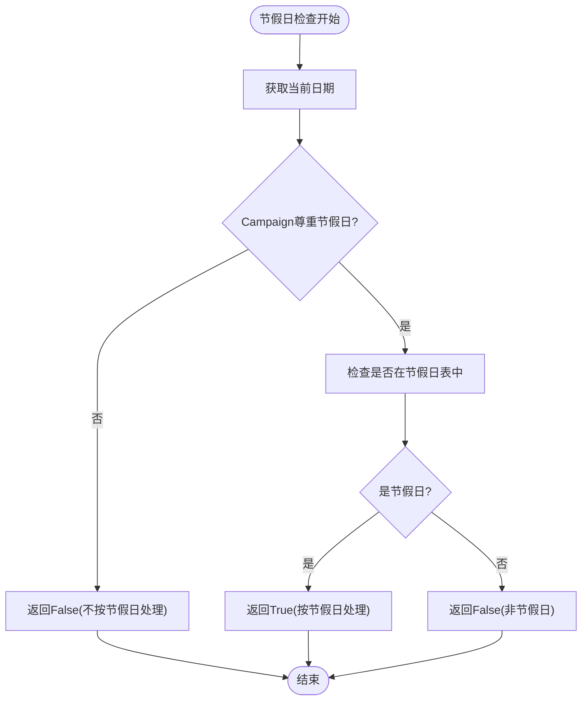
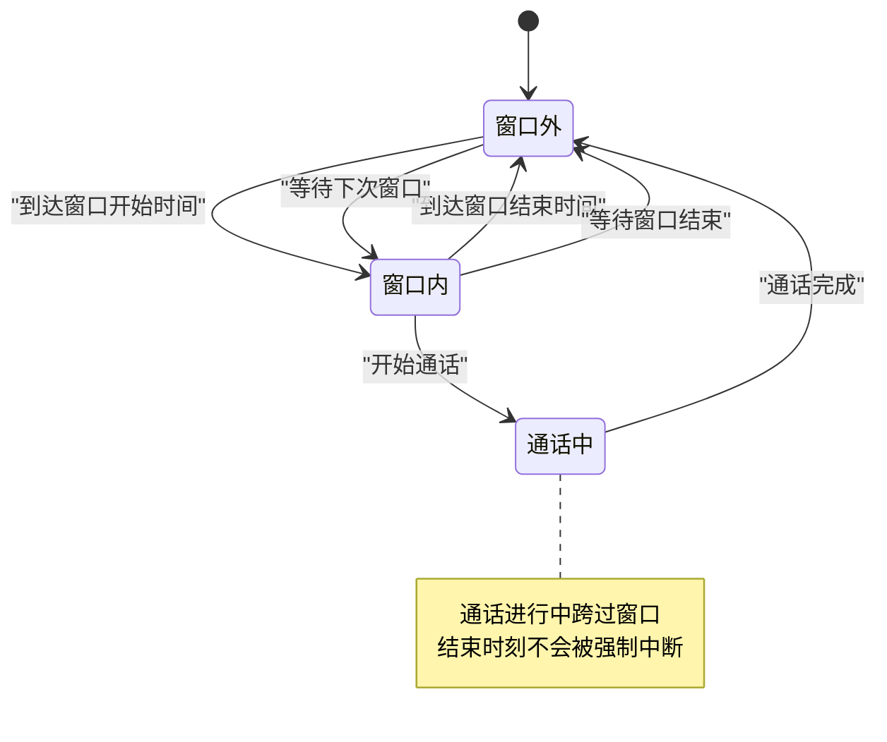
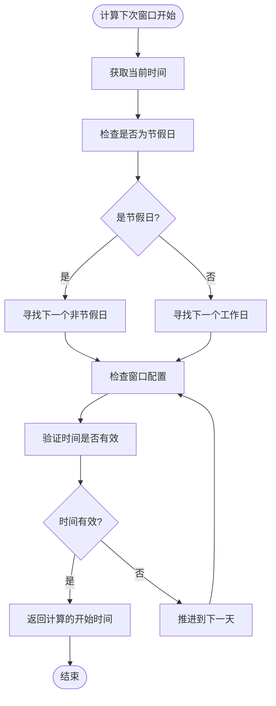
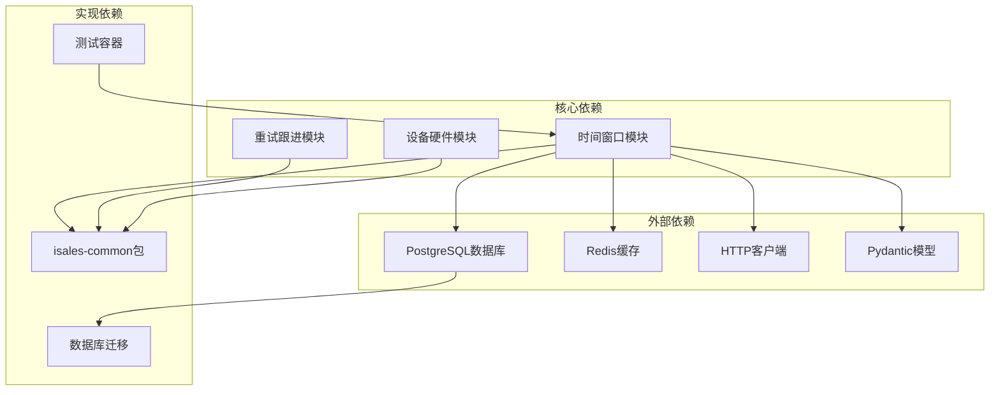
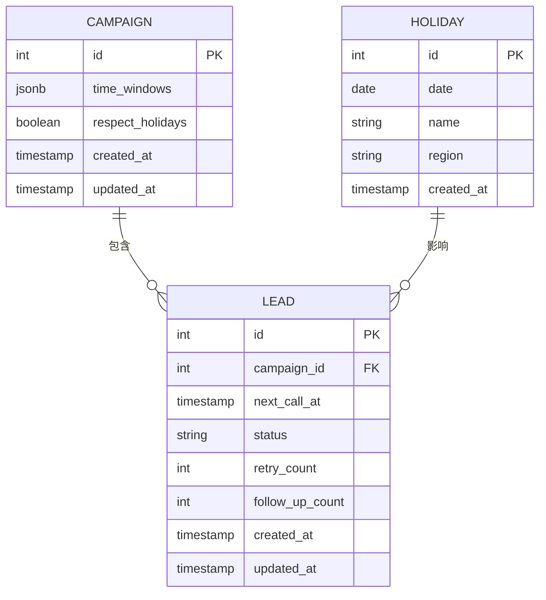

# 时间窗口管理

<cite>
**本文引用的文件**
- [openspec/specs/time-window/spec.md](file://openspec/specs/time-window/spec.md)
- [openspec/changes/archive/2026-05-06-impl-scheduler/tasks.md](file://openspec/changes/archive/2026-05-06-impl-scheduler/tasks.md)
- [openspec/changes/archive/2026-05-06-impl-scheduler/design.md](file://openspec/changes/archive/2026-05-06-impl-scheduler/design.md)
- [openspec/specs/retry-followup/spec.md](file://openspec/specs/retry-followup/spec.md)
- [openspec/specs/device-hardware/spec.md](file://openspec/specs/device-hardware/spec.md)
- [openspec/changes/arch-cloud-edge-split/specs/device-hardware/spec.md](file://openspec/changes/arch-cloud-edge-split/specs/device-hardware/spec.md)
- [openspec/changes/joint-mvp-gate-13301035545/tasks.md](file://openspec/changes/joint-mvp-gate-13301035545/tasks.md)
</cite>

## 目录
1. [引言](#引言)
2. [项目结构](#项目结构)
3. [核心组件](#核心组件)
4. [架构概览](#架构概览)
5. [详细组件分析](#详细组件分析)
6. [依赖关系分析](#依赖关系分析)
7. [性能考虑](#性能考虑)
8. [故障排除指南](#故障排除指南)
9. [结论](#结论)
10. [附录](#附录)

## 引言

时间窗口管理系统是智能外呼调度系统的核心组成部分，负责根据Campaign配置的时间窗口规则来控制外呼的可拨打时间段。该系统确保调度器只在允许的时间段内向引擎派发新的拨打任务，从而遵守业务合规要求和客户偏好。

系统的主要目标包括：
- 定义可通话时间窗口的配置模型和时区策略
- 处理节假日对窗口的影响
- 实现窗外lead的调度规则和跨边界保护
- 确保窗口判定在调度器派发前完成，防止引擎在窗外接收新任务

## 项目结构

时间窗口管理功能主要分布在以下文件中：



**图表来源**
- [openspec/specs/time-window/spec.md:1-86](file://openspec/specs/time-window/spec.md#L1-L86)
- [openspec/changes/archive/2026-05-06-impl-scheduler/tasks.md:1-83](file://openspec/changes/archive/2026-05-06-impl-scheduler/tasks.md#L1-L83)

**章节来源**
- [openspec/specs/time-window/spec.md:1-86](file://openspec/specs/time-window/spec.md#L1-L86)
- [openspec/changes/archive/2026-05-06-impl-scheduler/tasks.md:1-83](file://openspec/changes/archive/2026-05-06-impl-scheduler/tasks.md#L1-L83)

## 核心组件

### 时间窗口配置模型

时间窗口系统采用Campaign级别的多窗口配置，支持灵活的时间段设置：

| 字段 | 类型 | 描述 |
|------|------|------|
| `campaign.time_windows` | JSONB array | 时间窗口列表，每个元素包含星期几(days)、开始时间(start)、结束时间(end) |
| `campaign.respect_holidays` | bool | 是否遵从全局节假日表，默认true |
| `holiday` | 表 | 全局节假日表，包含日期、名称、地区信息 |

### 核心功能模块

系统包含以下核心功能模块：

1. **窗口判定模块** (`is_in_window`)
   - 解析JSONB数组格式的time_windows配置
   - 基于weekday + start/end时间进行判定
   - 支持多时段配置和跨日边界处理

2. **节假日处理模块** (`is_holiday`)
   - 检查当前日期是否在全局节假日表中
   - 支持地区特定的节假日配置
   - 与Campaign的尊重节假日设置结合使用

3. **窗口边界计算模块** (`next_window_start`)
   - 计算最近的窗口开始时刻
   - 处理跨日、跨周、节假日的复杂场景
   - 支持窗口为空数组的边界情况

**章节来源**
- [openspec/specs/time-window/spec.md:79-86](file://openspec/specs/time-window/spec.md#L79-L86)
- [openspec/changes/archive/2026-05-06-impl-scheduler/tasks.md:25-31](file://openspec/changes/archive/2026-05-06-impl-scheduler/tasks.md#L25-L31)

## 架构概览

时间窗口管理系统采用分层架构设计，确保职责清晰和可维护性：



**图表来源**
- [openspec/changes/archive/2026-05-06-impl-scheduler/design.md:35-69](file://openspec/changes/archive/2026-05-06-impl-scheduler/design.md#L35-L69)
- [openspec/changes/archive/2026-05-06-impl-scheduler/tasks.md:53-61](file://openspec/changes/archive/2026-05-06-impl-scheduler/tasks.md#L53-L61)

### 调度流程

系统的核心调度流程如下：



**图表来源**
- [openspec/changes/archive/2026-05-06-impl-scheduler/tasks.md:55-61](file://openspec/changes/archive/2026-05-06-impl-scheduler/tasks.md#L55-L61)
- [openspec/specs/retry-followup/spec.md:140-158](file://openspec/specs/retry-followup/spec.md#L140-L158)

## 详细组件分析

### 时间窗口判定算法

时间窗口判定是系统的核心逻辑，负责确定当前时间是否在允许的窗口范围内：



**图表来源**
- [openspec/changes/archive/2026-05-06-impl-scheduler/tasks.md:27](file://openspec/changes/archive/2026-05-06-impl-scheduler/tasks.md#L27)

#### 窗口配置示例

系统支持灵活的多时段配置，例如工作日双时段加周末单时段的复杂场景：

| 星期 | 开始时间 | 结束时间 | 状态 |
|------|----------|----------|------|
| 周一至周五 | 09:00 | 12:00 | 窗口内 |
| 周一至周五 | 14:00 | 18:00 | 窗口内 |
| 周六 | 10:00 | 16:00 | 窗口内 |
| 周日 | - | - | 窗口外 |

### 节假日处理机制

节假日处理模块确保在法定节假日期间暂停外呼活动：



**图表来源**
- [openspec/changes/archive/2026-05-06-impl-scheduler/tasks.md:28-29](file://openspec/changes/archive/2026-05-06-impl-scheduler/tasks.md#L28-L29)

### 窗口边界保护机制

系统实现了严格的窗口边界保护，确保通话不会被强制中断：



**图表来源**
- [openspec/specs/time-window/spec.md:70-77](file://openspec/specs/time-window/spec.md#L70-L77)

### 下次窗口开始时间计算

当lead处于窗外状态时，系统需要计算下次窗口开始时间：



**图表来源**
- [openspec/changes/archive/2026-05-06-impl-scheduler/tasks.md:29](file://openspec/changes/archive/2026-05-06-impl-scheduler/tasks.md#L29)

**章节来源**
- [openspec/specs/time-window/spec.md:51-68](file://openspec/specs/time-window/spec.md#L51-L68)
- [openspec/changes/archive/2026-05-06-impl-scheduler/tasks.md:27-31](file://openspec/changes/archive/2026-05-06-impl-scheduler/tasks.md#L27-L31)

## 依赖关系分析

时间窗口管理系统与其他组件的依赖关系如下：



**图表来源**
- [openspec/changes/archive/2026-05-06-impl-scheduler/tasks.md:7](file://openspec/changes/archive/2026-05-06-impl-scheduler/tasks.md#L7)
- [openspec/specs/device-hardware/spec.md:251-272](file://openspec/specs/device-hardware/spec.md#L251-L272)

### 数据模型关系



**图表来源**
- [openspec/specs/time-window/spec.md:79-86](file://openspec/specs/time-window/spec.md#L79-L86)
- [openspec/specs/retry-followup/spec.md:160-176](file://openspec/specs/retry-followup/spec.md#L160-L176)

**章节来源**
- [openspec/changes/archive/2026-05-06-impl-scheduler/tasks.md:1-14](file://openspec/changes/archive/2026-05-06-impl-scheduler/tasks.md#L1-L14)
- [openspec/specs/time-window/spec.md:79-86](file://openspec/specs/time-window/spec.md#L79-L86)

## 性能考虑

### 并发控制机制

系统采用全局并发计数器来控制同时进行的通话数量：

| 组件 | 功能 | 实现方式 |
|------|------|----------|
| `try_increment(redis)` | 原子递增并发计数 | 使用Redis INCR命令，超过最大值时立即DECR并返回False |
| `decrement(redis)` | 并发计数回滚 | 使用Lua脚本或先GET再DECR，保护下界≥0 |
| 计数器键名 | `isales:concurrency:active` | 与架构设计保持一致 |

### 批处理优化

调度器采用限批处理策略来避免单个Campaign占用过多资源：

- **批次大小配置**：通过环境变量`ISALES_SCHEDULER_BATCH_SIZE`控制每批处理的lead数量
- **时间间隔配置**：通过`ISALES_SCHEDULER_TICK_INTERVAL`控制调度循环间隔
- **主动Campaign集合**：使用Redis SET存储活跃Campaign，避免频繁查询数据库

### 内存管理

系统采用多种内存优化策略：

- **进程内缓存**：活跃Campaign集合使用进程内set缓存，减少Redis调用
- **节假日缓存**：当月节假日表缓存到内存中，避免重复查询
- **连接池管理**：数据库和Redis连接使用异步连接池，提高并发性能

**章节来源**
- [openspec/changes/archive/2026-05-06-impl-scheduler/tasks.md:33-38](file://openspec/changes/archive/2026-05-06-impl-scheduler/tasks.md#L33-L38)
- [openspec/changes/archive/2026-05-06-impl-scheduler/design.md:71-77](file://openspec/changes/archive/2026-05-06-impl-scheduler/design.md#L71-L77)

## 故障排除指南

### 常见问题诊断

#### 窗口判定异常

**症状**：系统在应该允许外呼的时间段内拒绝派发

**排查步骤**：
1. 检查服务器时区配置是否正确
2. 验证Campaign的time_windows配置格式
3. 确认当前日期是否被误识别为节假日
4. 检查lead的next_call_at时间戳

#### 节假日处理错误

**症状**：节假日当天仍然派发外呼任务

**排查步骤**：
1. 验证`respect_holidays`字段设置
2. 检查holiday表中的节假日记录
3. 确认地区配置(region字段)是否正确
4. 验证数据库连接和权限

#### 并发控制失效

**症状**：超过最大并发限制仍然继续派发

**排查步骤**：
1. 检查Redis连接状态
2. 验证并发计数器键值是否存在
3. 确认DECR回滚逻辑是否正常执行
4. 检查是否有并发计数器泄漏

### 调试工具和监控

系统提供了多种调试和监控手段：

- **日志记录**：详细的调试日志输出，包括窗口判定过程、节假日检查结果、并发计数器状态
- **性能监控**：关键指标的实时监控，包括调度频率、处理延迟、错误率
- **测试工具**：完整的单元测试覆盖所有场景，包括边界情况和异常处理

**章节来源**
- [openspec/changes/archive/2026-05-06-impl-scheduler/design.md:160-171](file://openspec/changes/archive/2026-05-06-impl-scheduler/design.md#L160-L171)

## 结论

时间窗口管理系统通过精心设计的架构和严格的规范约束，为智能外呼系统提供了可靠的合规保障。系统的主要优势包括：

1. **规范先行**：通过详细的需求规格和场景描述，确保实现的一致性和正确性
2. **模块化设计**：清晰的功能模块划分，便于维护和扩展
3. **边界保护**：严格的窗口边界保护机制，确保通话质量和合规性
4. **性能优化**：合理的并发控制和批处理策略，保证系统的高效运行
5. **故障处理**：完善的错误处理和回滚机制，提高系统的可靠性

该系统为后续的引擎集成和更复杂的业务场景奠定了坚实的基础，是智能外呼系统中不可或缺的关键组件。

## 附录

### 最佳实践指南

#### 时间窗口配置最佳实践

1. **合理设置窗口数量**：一般建议不超过3个主要窗口，避免过于复杂的配置
2. **考虑业务特点**：根据目标客户的作息时间和文化背景设置合适的窗口
3. **节假日规划**：提前规划主要节假日的窗口调整，确保业务连续性
4. **测试验证**：在生产环境部署前进行充分的测试验证

#### 配置示例参考

```json
[
  {
    "days": ["mon","tue","wed","thu","fri"],
    "start": "09:00",
    "end": "12:00"
  },
  {
    "days": ["mon","tue","wed","thu","fri"],
    "start": "14:00",
    "end": "18:00"
  },
  {
    "days": ["sat"],
    "start": "10:00",
    "end": "16:00"
  }
]
```

#### 常见应用场景

1. **企业客服热线**：工作日9:00-12:00和14:00-18:00的双时段配置
2. **销售外呼**：工作日10:00-19:00的长时段配置
3. **银行催收**：工作日9:00-17:00的严格时段配置
4. **保险营销**：工作日9:30-18:00的灵活时段配置