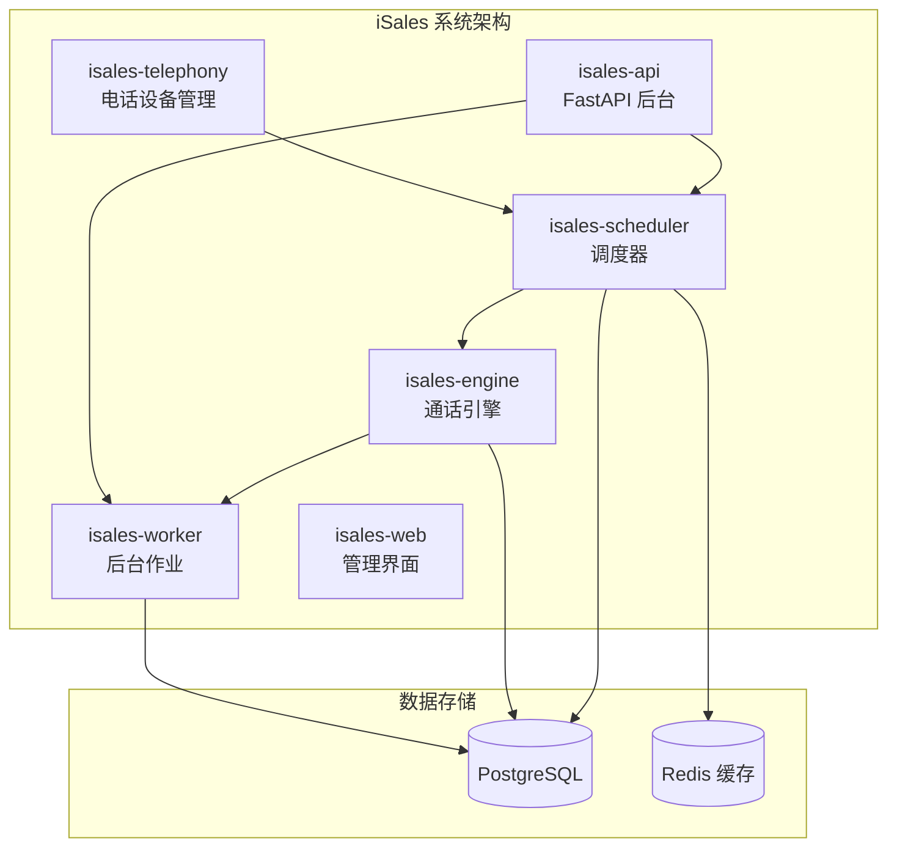
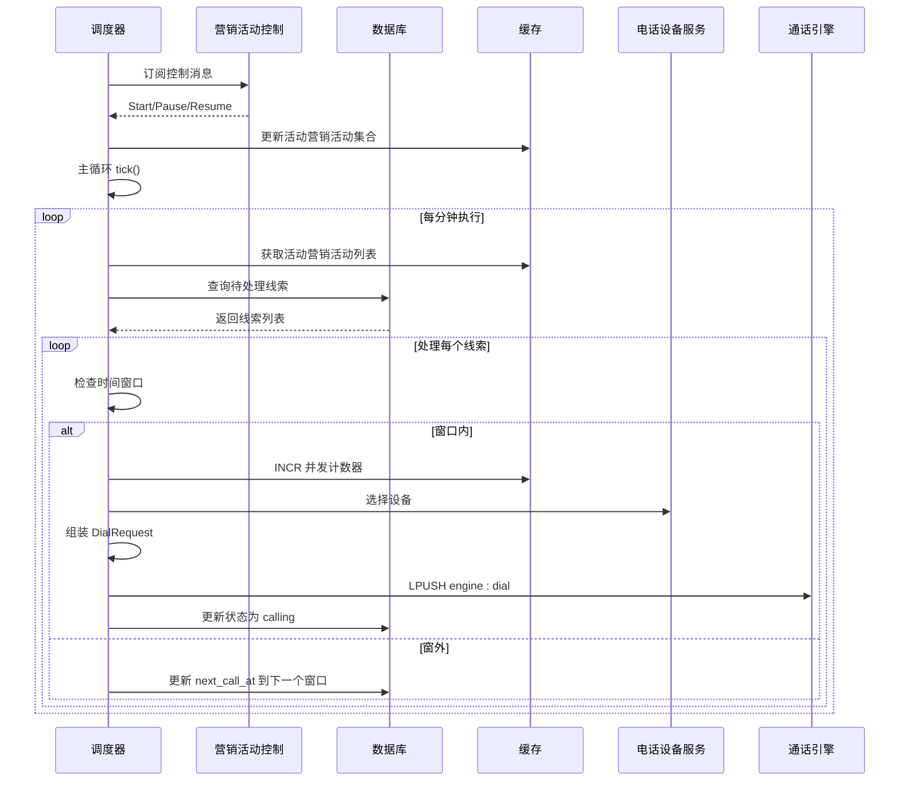
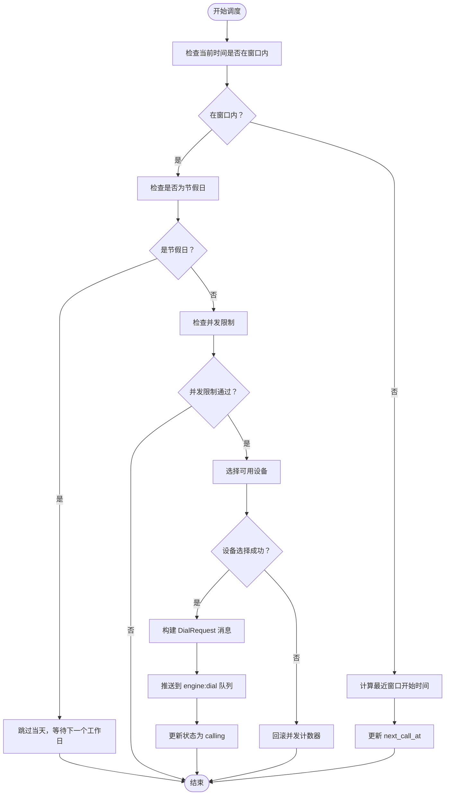
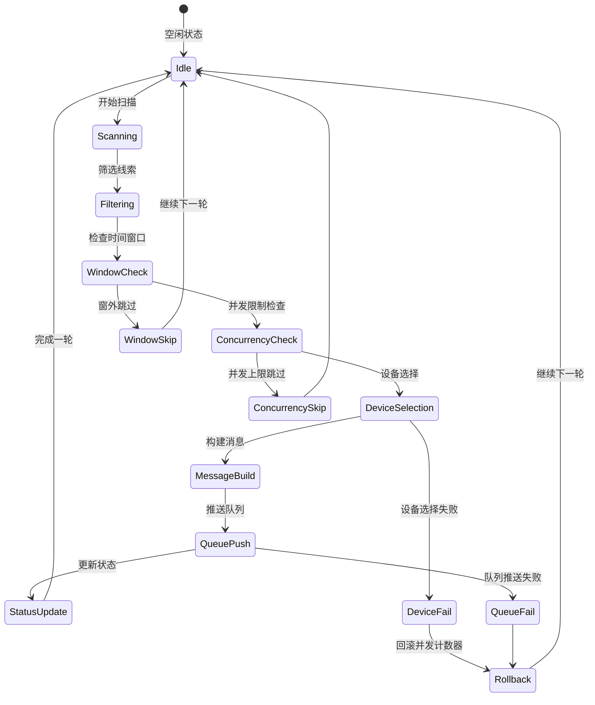
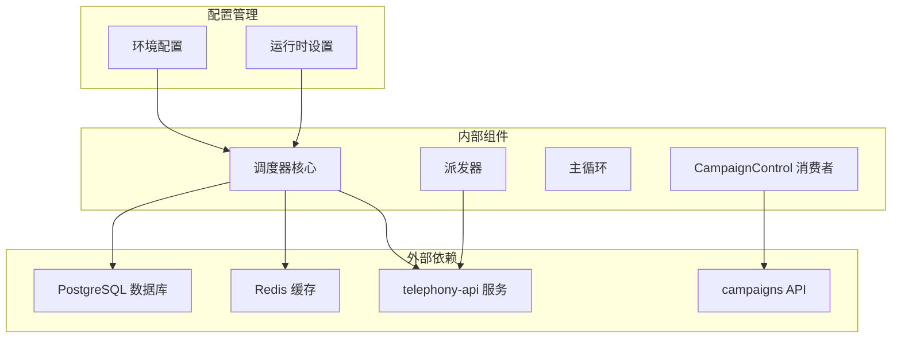

# 线索调度算法

<cite>
**本文档引用的文件**
- [README.md](file://README.md)
- [DESIGN.md](file://DESIGN.md)
- [retry-followup 规格](file://openspec/specs/retry-followup/spec.md)
- [time-window 规格](file://openspec/specs/time-window/spec.md)
- [data-model 规格](file://openspec/specs/data-model/spec.md)
- [scheduler 设计文档](file://openspec/changes/archive/2026-05-06-impl-scheduler/design.md)
- [scheduler 任务清单](file://openspec/changes/archive/2026-05-06-impl-scheduler/tasks.md)
- [scheduler 环境配置示例](file://deploy/cloud/env/scheduler.env.example)
- [scheduler systemd 服务](file://deploy/cloud/systemd/isales-scheduler.service)
- [scheduler macOS plist](file://deploy/macos/plist/com.isales.scheduler.plist)
</cite>

## 目录
1. [简介](#简介)
2. [项目结构](#项目结构)
3. [核心组件](#核心组件)
4. [架构概览](#架构概览)
5. [详细组件分析](#详细组件分析)
6. [依赖分析](#依赖分析)
7. [性能考虑](#性能考虑)
8. [故障排查指南](#故障排查指南)
9. [结论](#结论)

## 简介

isales-scheduler 是 iSales AI 外呼系统中的核心调度组件，负责从数据库中扫描待处理线索并进行智能派发。该调度器实现了基于时间窗口、节假日、并发限制和重试/跟进策略的综合调度算法。

根据项目文档，调度器采用每分钟执行一次的主循环机制，通过扫描活动的营销活动（Campaign），筛选符合条件的线索（new、retrying、following_up），并在满足时间条件（next_call_at）的情况下进行派发决策。

## 项目结构

基于仓库结构，isales-scheduler 作为独立的服务组件，与其他核心服务协同工作：

**图表来源**
- [README.md:1-14](file://README.md#L1-L14)
- [DESIGN.md:39-44](file://DESIGN.md#L39-L44)

**章节来源**
- [README.md:1-14](file://README.md#L1-L14)
- [DESIGN.md:39-44](file://DESIGN.md#L39-L44)

## 核心组件

### 调度主循环

调度器采用单 asyncio 任务的主循环设计，每分钟执行一次调度周期：

- **执行频率**：每分钟启动一次主循环
- **循环结构**：`while True: tick(); await asyncio.sleep(TICK_INTERVAL)`
- **配置项**：TICK_INTERVAL 从环境变量读取，单位为秒

### 活动营销活动扫描

系统维护一个 Redis SET 作为活动营销活动的真相源：
- **持久化存储**：Redis SET `scheduler:active-campaigns`
- **进程内缓存**：内存中的 `set[int]` 缓存
- **同步机制**：CampaignControl 消费时同时更新 Redis 和进程缓存

### 线索筛选条件

调度器从数据库中筛选待处理线索，采用以下条件：

1. **状态筛选**：`status ∈ {new, retrying, following_up}`
2. **时间条件**：`(next_call_at IS NULL OR next_call_at <= now)`
3. **排序规则**：按 `next_call_at ASC` 排序
4. **批量限制**：每批次最多处理 N 条线索（N 为配置项）

### 派发决策流程

成功的派发需要满足以下步骤：

1. **时间窗口检查**：验证当前时间是否在营销活动的时间窗口内
2. **节假日检查**：确认当天是否为节假日
3. **并发限制检查**：通过 Redis INCR 检查全局并发计数器
4. **设备选择**：调用 telephony-api `/devices/select` 选择设备和主叫号码
5. **消息组装**：构建 DialRequest 消息（包含线索信息、跟进标识、历史摘要等）
6. **队列推送**：将消息推送到 `engine:dial` 队列

**章节来源**
- [scheduler 设计文档:37-44](file://openspec/changes/archive/2026-05-06-impl-scheduler/design.md#L37-L44)
- [scheduler 任务清单:58-59](file://openspec/changes/archive/2026-05-06-impl-scheduler/tasks.md#L58-L59)
- [retry-followup 规格:127-133](file://openspec/specs/retry-followup/spec.md#L127-L133)

## 架构概览

调度器的整体架构遵循 iSales 系统的设计原则，实现了服务间的清晰职责分离：

**图表来源**
- [scheduler 设计文档:45-52](file://openspec/changes/archive/2026-05-06-impl-scheduler/design.md#L45-L52)
- [retry-followup 规格:125-133](file://openspec/specs/retry-followup/spec.md#L125-L133)

## 详细组件分析

### 时间窗口管理系统

时间窗口系统是调度算法的核心组成部分，负责确保通话在合规的时间范围内进行：

**图表来源**
- [time-window 规格:51-69](file://openspec/specs/time-window/spec.md#L51-L69)
- [retry-followup 规格:150-153](file://openspec/specs/retry-followup/spec.md#L150-L153)

### 并发控制机制

调度器采用 Redis INCR 机制实现全局并发控制：

- **并发计数器**：使用 Redis INCR 实现原子递增
- **回滚机制**：任何步骤失败时执行 DECR 回滚
- **配置管理**：并发上限通过配置项控制

### 故障转移处理

系统实现了完善的故障转移和错误处理机制：

**图表来源**
- [retry-followup 规格:145-148](file://openspec/specs/retry-followup/spec.md#L145-L148)
- [scheduler 任务清单:57](file://openspec/changes/archive/2026-05-06-impl-scheduler/tasks.md#L57)

### 调度策略示例

#### 负载均衡机制

调度器通过以下机制实现负载均衡：

1. **设备轮询**：通过 `/devices/select` 接口自动选择可用设备
2. **时间片分配**：不同营销活动独立处理，避免相互影响
3. **批量处理**：每批次最多处理 N 条线索，防止饥饿现象

#### 资源限制检查

系统实施多层次的资源限制：

- **数据库连接池**：限制同时活跃的数据库连接数
- **Redis 连接池**：控制 Redis 并发访问
- **网络超时**：为 telephony-api 调用设置合理超时
- **内存使用**：限制进程内存使用量

#### 性能优化方案

针对调度器的性能优化建议：

1. **索引优化**：确保 `lead(campaign_id, status, next_call_at)` 复合索引
2. **批量查询**：使用 LIMIT 控制每批次处理数量
3. **缓存策略**：缓存节假日信息和营销活动配置
4. **异步处理**：充分利用 asyncio 实现非阻塞 I/O

**章节来源**
- [scheduler 设计文档:71-78](file://openspec/changes/archive/2026-05-06-impl-scheduler/design.md#L71-L78)
- [scheduler 任务清单:56](file://openspec/changes/archive/2026-05-06-impl-scheduler/tasks.md#L56)

## 依赖分析

调度器依赖于多个核心服务和组件：

**图表来源**
- [DESIGN.md:40-44](file://DESIGN.md#L40-L44)
- [scheduler 设计文档:54-61](file://openspec/changes/archive/2026-05-06-impl-scheduler/design.md#L54-L61)

**章节来源**
- [DESIGN.md:40-44](file://DESIGN.md#L40-L44)
- [scheduler 设计文档:54-61](file://openspec/changes/archive/2026-05-06-impl-scheduler/design.md#L54-L61)

## 性能考虑

### 数据库性能优化

1. **查询优化**：使用合适的索引和查询条件减少数据库负载
2. **连接池管理**：合理配置数据库连接池大小
3. **批量操作**：合并相似的数据库操作

### 缓存策略

1. **Redis 缓存**：缓存活动营销活动列表和节假日信息
2. **进程内缓存**：缓存频繁访问的配置信息
3. **失效策略**：设置合理的缓存失效时间

### 监控指标

建议监控以下关键指标：
- 调度成功率
- 平均调度延迟
- 并发使用率
- 数据库查询响应时间
- Redis 命中率

## 故障排查指南

### 常见问题诊断

1. **调度器不工作**
   - 检查 systemd 服务状态
   - 验证环境配置文件
   - 查看日志输出

2. **线索无法派发**
   - 检查时间窗口配置
   - 验证设备可用性
   - 确认并发限制设置

3. **性能问题**
   - 监控数据库连接池使用
   - 检查 Redis 连接状态
   - 分析查询执行计划

### 调试工具

- **日志分析**：查看调度器日志中的错误信息
- **指标监控**：使用 Prometheus 监控关键指标
- **数据库分析**：使用 EXPLAIN 分析慢查询

**章节来源**
- [scheduler 环境配置示例](file://deploy/cloud/env/scheduler.env.example)
- [scheduler systemd 服务](file://deploy/cloud/systemd/isales-scheduler.service)
- [scheduler macOS plist](file://deploy/macos/plist/com.isales.scheduler.plist)

## 结论

isales-scheduler 通过精心设计的调度算法和架构，实现了高效、可靠的线索派发系统。其核心特点包括：

1. **严格的职责分离**：调度器专注于派发决策，状态更新由 worker 负责
2. **完善的错误处理**：每一步都具备回滚机制，确保系统稳定性
3. **灵活的时间管理**：支持复杂的营销活动配置和节假日处理
4. **可扩展的架构**：基于 Redis 和 PostgreSQL 的分布式设计

该调度器为 iSales 系统提供了坚实的基础设施，支持大规模的 AI 外呼业务场景。