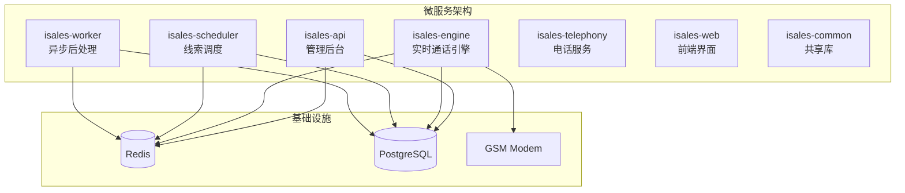
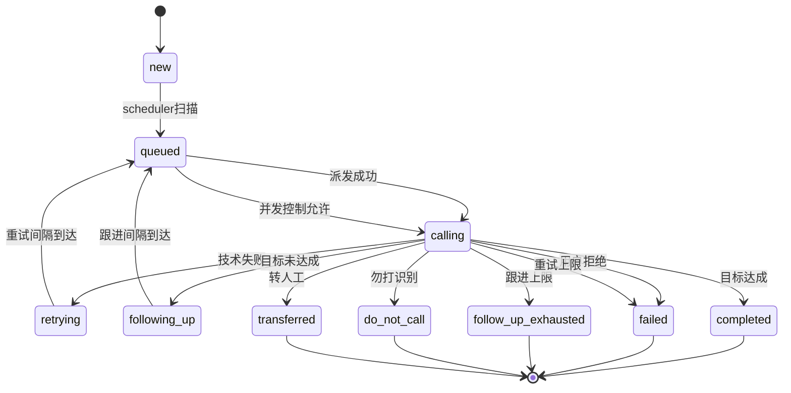
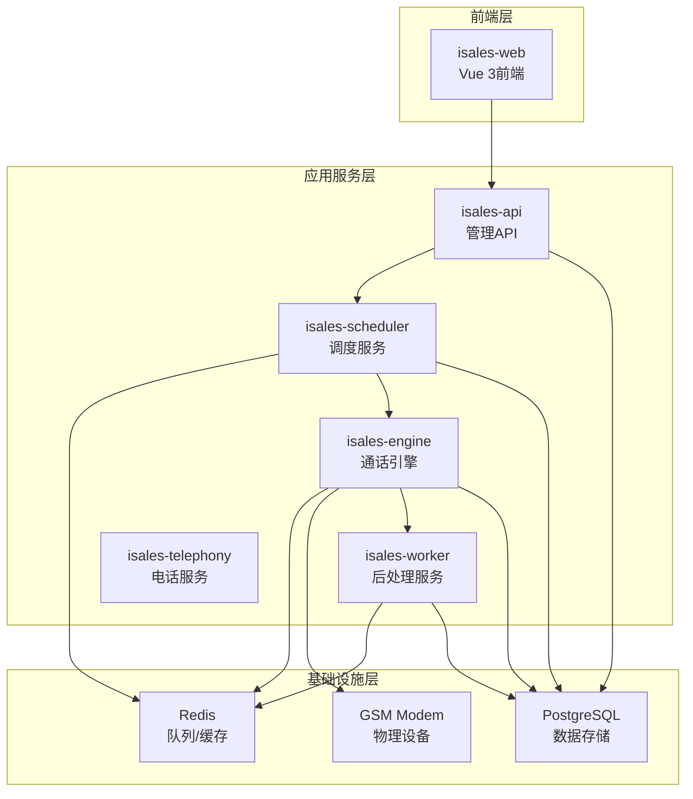
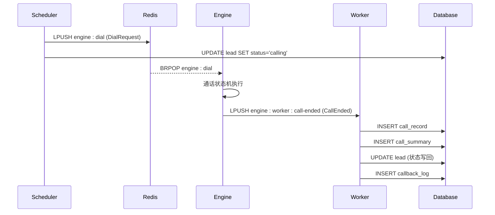
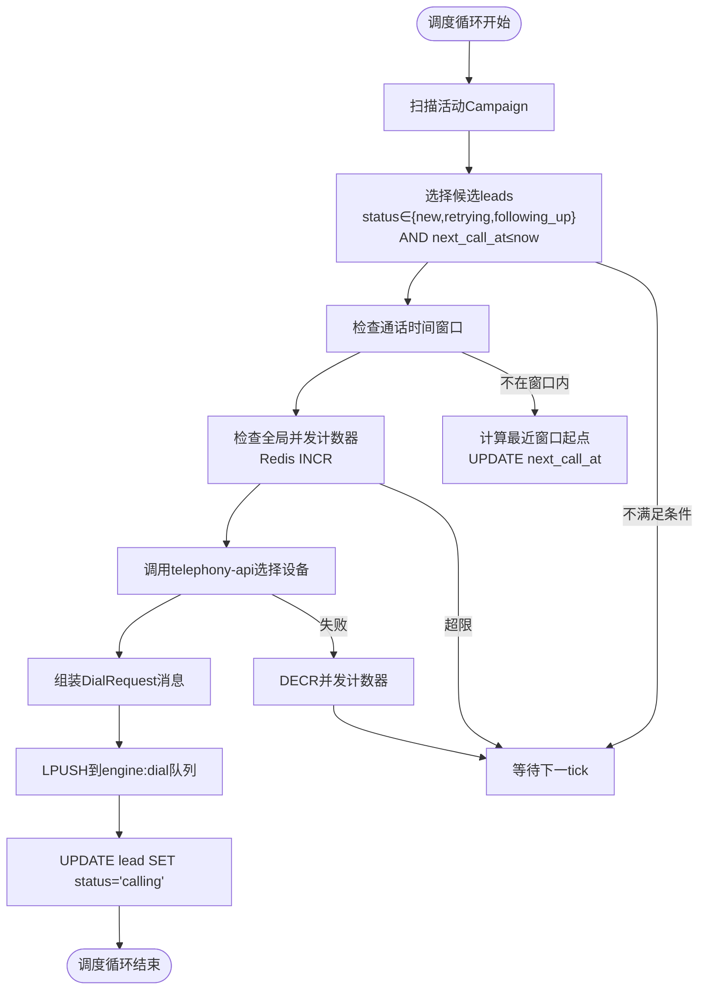
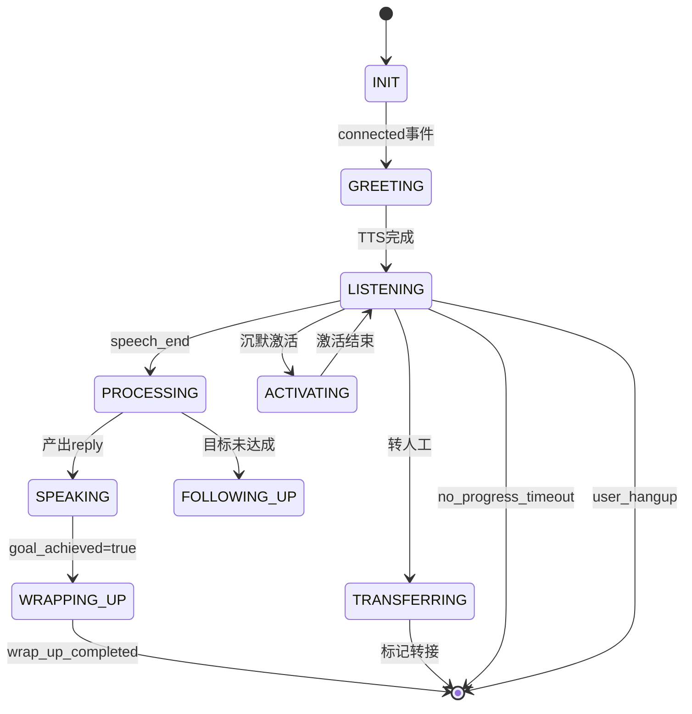
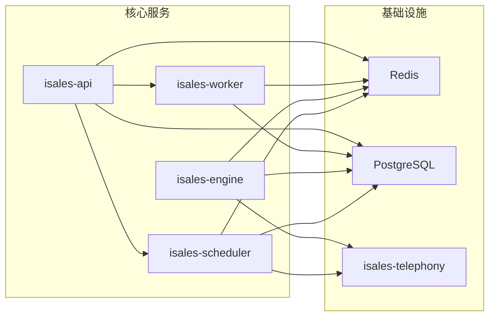
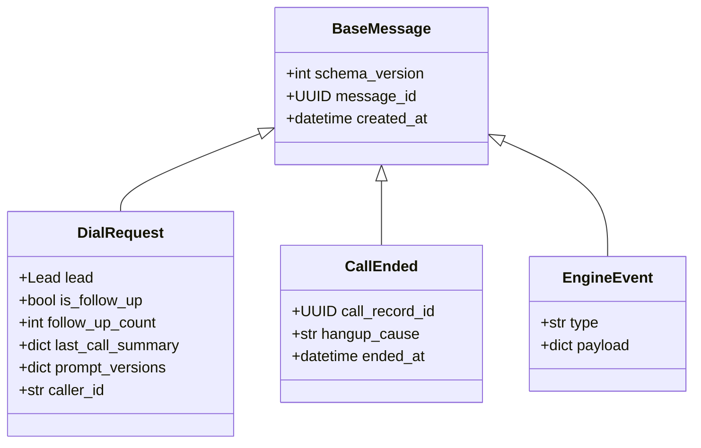

# Lead状态机管理

<cite>
**本文档引用的文件**
- [call-state-machine/spec.md](file://openspec/specs/call-state-machine/spec.md)
- [retry-followup/spec.md](file://openspec/specs/retry-followup/spec.md)
- [data-model/spec.md](file://openspec/specs/data-model/spec.md)
- [architecture/spec.md](file://openspec/specs/architecture/spec.md)
- [deployment-topology/spec.md](file://openspec/specs/deployment-topology/spec.md)
- [service-communication/spec.md](file://openspec/specs/service-communication/spec.md)
- [message-contract/spec.md](file://openspec/specs/message-contract/spec.md)
- [worker/design.md](file://openspec/changes/archive/2026-05-06-impl-worker/design.md)
- [worker/proposal.md](file://openspec/changes/archive/2026-05-06-impl-worker/proposal.md)
- [scheduler/design.md](file://openspec/changes/archive/2026-05-06-impl-scheduler/design.md)
- [scheduler/proposal.md](file://openspec/changes/archive/2026-05-06-impl-scheduler/proposal.md)
</cite>

## 目录
1. [引言](#引言)
2. [项目结构](#项目结构)
3. [核心组件](#核心组件)
4. [架构概览](#架构概览)
5. [详细组件分析](#详细组件分析)
6. [依赖分析](#依赖分析)
7. [性能考虑](#性能考虑)
8. [故障排除指南](#故障排除指南)
9. [结论](#结论)

## 引言

本文档为Lead状态机管理系统提供全面的技术文档，详细说明了iSales系统中lead表的状态字段设计和流转规则。该系统采用微服务架构，通过7个独立仓库实现完整的电话营销自动化流程。

系统的核心价值在于：
- **状态机规范化**：定义了严格的lead状态流转规则和边界条件
- **并发控制保障**：通过Redis原子计数器确保全局并发一致性
- **事务一致性**：通过行级守卫和消息契约保证数据一致性
- **可扩展性**：支持重试、跟进、勿打识别等多种业务场景

## 项目结构

iSales系统采用7个独立仓库的微服务架构，每个仓库承担明确的职责边界：



**图表来源**
- [architecture/spec.md:130-168](file://openspec/specs/architecture/spec.md#L130-L168)

**章节来源**
- [architecture/spec.md:1-168](file://openspec/specs/architecture/spec.md#L1-168)
- [deployment-topology/spec.md:1-414](file://openspec/specs/deployment-topology/spec.md#L1-L414)

## 核心组件

### Lead状态机核心状态

Lead状态机包含以下核心状态：

| 状态 | 含义 | 触发条件 | 终态标识 |
|------|------|----------|----------|
| `new` | 新建线索 | lead创建时的初始状态 | 否 |
| `queued` | 排队等待 | scheduler扫描候选线索 | 否 |
| `calling` | 通话中 | scheduler派发成功 | 否 |
| `retrying` | 重试中 | 技术原因失败后的重试 | 否 |
| `following_up` | 跟进中 | 目标未达成的二次外呼 | 否 |
| `completed` | 完成 | 目标达成的通话结束 | 是 |
| `failed` | 失败 | 重试上限或用户明确拒绝 | 是 |
| `follow_up_exhausted` | 跟进耗尽 | 跟进次数达到上限 | 是 |
| `do_not_call` | 勿打 | 用户明确拒绝再次联系 | 是 |
| `transferred` | 已转人工 | 人工转接触发 | 是 |

### 状态流转图



**图表来源**
- [retry-followup/spec.md:90-118](file://openspec/specs/retry-followup/spec.md#L90-L118)

**章节来源**
- [retry-followup/spec.md:90-176](file://openspec/specs/retry-followup/spec.md#L90-L176)

## 架构概览

### 系统架构图



**图表来源**
- [architecture/spec.md:130-168](file://openspec/specs/architecture/spec.md#L130-L168)
- [service-communication/spec.md:7-25](file://openspec/specs/service-communication/spec.md#L7-L25)

### 数据流架构



**图表来源**
- [service-communication/spec.md:11-18](file://openspec/specs/service-communication/spec.md#L11-L18)
- [worker/proposal.md:12-16](file://openspec/changes/archive/2026-05-06-impl-worker/proposal.md#L12-L16)

**章节来源**
- [service-communication/spec.md:1-150](file://openspec/specs/service-communication/spec.md#L1-L150)
- [message-contract/spec.md:1-85](file://openspec/specs/message-contract/spec.md#L1-L85)

## 详细组件分析

### Scheduler组件

#### 调度流程



**图表来源**
- [retry-followup/spec.md:123-133](file://openspec/specs/retry-followup/spec.md#L123-L133)
- [retry-followup/spec.md:140-148](file://openspec/specs/retry-followup/spec.md#L140-L148)

#### 并发控制机制

Scheduler使用Redis原子计数器实现全局并发控制：

- **计数器名称**: `isales:concurrency:active`
- **操作时机**: 
  - 派发前: `INCR` 检查并发上限
  - 引擎结束: `DECR` 释放资源
- **防泄漏机制**: 定期对账和系统重启清理

**章节来源**
- [retry-followup/spec.md:120-158](file://openspec/specs/retry-followup/spec.md#L120-L158)
- [scheduler/design.md:160-171](file://openspec/changes/archive/2026-05-06-impl-scheduler/design.md#L160-L171)

### Worker组件

#### 状态写回流程

```mermaid
sequenceDiagram
participant E as Engine
participant Q as Redis
participant W as Worker
participant DB as Database
E->>Q : LPUSH engine : worker : call-ended
Q-->>W : BLPOP engine : worker : call-ended
W->>DB : 读取call_record
W->>DB : 读取call_summary
W->>DB : 读取campaign配置
W->>DB : 读取transcript
W->>DB : INSERT call_summary
W->>DB : INSERT callback_log
W->>DB : UPDATE lead
WHERE id= : id AND status='calling'
SET status= : new_status,
retry_count= : rc,
follow_up_count= : fc,
next_call_at= : nca,
last_hangup_cause= : hc
Note over W,DB : 行级守卫防止竞态条件
```

**图表来源**
- [worker/design.md:106-112](file://openspec/changes/archive/2026-05-06-impl-worker/design.md#L106-L112)
- [worker/proposal.md:40-51](file://openspec/changes/archive/2026-05-06-impl-worker/proposal.md#L40-L51)

#### 决策矩阵

Worker根据通话结果进行状态决策：

| hangup_cause类别 | retry_count | follow_up_count | 决策结果 |
|------------------|-------------|-----------------|----------|
| {no_answer, user_busy, network_out_of_order, temporary_failure} | retry_count+1 < retry_max_count | 任意 | retrying, retry_count++, next_call_at计算 |
| 同上但已达上限 | 任意 | 任意 | failed |
| call_rejected | 任意 | 任意 | failed |
| {normal_clearing, wrap_up_completed, silence_max_reached} | 任意 | goal_achieved=true | completed |
| 同上但goal_achieved=false且follow_up_count+1 < follow_up_max_count | 任意 | 任意 | following_up, follow_up_count++, next_call_at计算 |
| 同上但已达上限或follow_up_max_count=0 | 任意 | 任意 | follow_up_exhausted |
| marked_for_handoff | 任意 | 任意 | transferred |
| do_not_call识别 | 任意 | 任意 | do_not_call, next_call_at=NULL |

**章节来源**
- [worker/design.md:114-128](file://openspec/changes/archive/2026-05-06-impl-worker/design.md#L114-L128)
- [worker/proposal.md:42-51](file://openspec/changes/archive/2026-05-06-impl-worker/proposal.md#L42-L51)

### Engine组件

#### 通话状态机

Engine负责单通通话的实时状态管理：



**图表来源**
- [call-state-machine/spec.md:23-31](file://openspec/specs/call-state-machine/spec.md#L23-L31)

**章节来源**
- [call-state-machine/spec.md:1-190](file://openspec/specs/call-state-machine/spec.md#L1-L190)

### 数据模型

#### Lead表结构

| 字段名 | 类型 | 说明 | 约束 |
|--------|------|------|------|
| `id` | UUID | 主键 | PK |
| `name` | String | 姓名 |  |
| `phone` | String | 电话号码 |  |
| `source` | String | 线索来源 |  |
| `custom_data` | JSONB | 自定义数据 |  |
| `status` | Enum | 状态字段 | new/queued/calling/retrying/following_up/completed/failed/follow_up_exhausted/do_not_call/transferred |
| `retry_count` | Integer | 已重试次数 | DEFAULT 0 |
| `follow_up_count` | Integer | 已跟进次数 | DEFAULT 0 |
| `next_call_at` | Timestamp | 下次拨打时间 |  |
| `last_hangup_cause` | String | 上次通话挂断原因 |  |

**章节来源**
- [data-model/spec.md:37-38](file://openspec/specs/data-model/spec.md#L37-L38)

## 依赖分析

### 服务间依赖关系



**图表来源**
- [architecture/spec.md:26-44](file://openspec/specs/architecture/spec.md#L26-L44)

### 消息契约

所有跨服务消息通过isales-common统一管理：



**图表来源**
- [message-contract/spec.md:25-51](file://openspec/specs/message-contract/spec.md#L25-L51)

**章节来源**
- [service-communication/spec.md:1-150](file://openspec/specs/service-communication/spec.md#L1-L150)
- [message-contract/spec.md:1-85](file://openspec/specs/message-contract/spec.md#L1-L85)

## 性能考虑

### 并发控制策略

系统采用多层并发控制确保性能和一致性：

1. **全局并发控制**：Redis原子计数器
2. **本地资源管理**：engine进程内资源池
3. **队列背压**：Redis队列长度限制
4. **超时机制**：各组件设置合理的超时时间

### 缓存策略

- **热点数据缓存**：campaign配置、设备状态
- **临时状态缓存**：通话过程中的中间状态
- **结果缓存**：已完成的查询结果

### 监控指标

关键性能指标包括：
- 调度延迟：从候选到通话建立的时间
- 通话时长：平均通话时长分布
- 成功率：接通率、目标达成率
- 并发利用率：CPU、内存、网络使用率

## 故障排除指南

### 常见问题及解决方案

#### 状态写回失败

**现象**：lead状态长时间保持在`calling`状态
**原因**：
- Worker进程异常退出
- 数据库连接失败
- 竞态条件导致行级更新失败

**解决方案**：
1. 检查Worker日志中的异常信息
2. 验证数据库连接配置
3. 确认行级守卫条件是否满足
4. 查看Redis队列堆积情况

#### 并发控制异常

**现象**：系统出现并发超限或资源泄漏
**原因**：
- Redis计数器异常
- 引擎异常退出未正确DECR
- 网络分区导致计数器不同步

**解决方案**：
1. 手动检查Redis计数器值
2. 重启相关服务进行清理
3. 实施定期对账机制
4. 监控计数器异常告警

#### 消息丢失

**现象**：通话结束后状态未更新
**原因**：
- Redis连接异常
- Worker进程崩溃
- 消息序列化失败

**解决方案**：
1. 检查Redis服务状态
2. 验证消息序列化格式
3. 实施消息重试机制
4. 建立死信队列处理

**章节来源**
- [worker/design.md:155-167](file://openspec/changes/archive/2026-05-06-impl-worker/design.md#L155-L167)
- [scheduler/design.md:160-171](file://openspec/changes/archive/2026-05-06-impl-scheduler/design.md#L160-L171)

## 结论

Lead状态机管理系统通过规范化的状态设计、严格的并发控制和完善的事务一致性保证，实现了高效的电话营销自动化流程。系统的主要优势包括：

1. **状态机规范化**：明确了所有状态的含义和转换条件
2. **并发控制保障**：通过Redis原子操作确保全局一致性
3. **消息契约标准化**：统一的消息格式和传输协议
4. **可扩展性强**：支持多种业务场景和未来功能扩展

该系统为iSales平台提供了可靠的基础能力，支持企业级的电话营销自动化需求。通过持续的监控和优化，系统能够稳定支撑大规模的并发处理需求。