# Scheduler调度数据流

<cite>
**本文档引用的文件**
- [DESIGN.md](file://openspec/changes/archive/2026-05-06-impl-scheduler/design.md)
- [proposal.md](file://openspec/changes/archive/2026-05-06-impl-scheduler/proposal.md)
- [retry-followup/spec.md](file://openspec/specs/retry-followup/spec.md)
- [time-window/spec.md](file://openspec/specs/time-window/spec.md)
- [device-hardware/spec.md](file://openspec/specs/device-hardware/spec.md)
- [task.md](file://openspec/changes/archive/2026-05-06-impl-scheduler/tasks.md)
- [README.md](file://README.md)
- [IMPLEMENTATION_PLAN.md](file://IMPLEMENTATION_PLAN.md)
</cite>

## 目录
1. [简介](#简介)
2. [项目结构](#项目结构)
3. [核心组件](#核心组件)
4. [架构概览](#架构概览)
5. [详细组件分析](#详细组件分析)
6. [依赖分析](#依赖分析)
7. [性能考虑](#性能考虑)
8. [故障排除指南](#故障排除指南)
9. [结论](#结论)

## 简介

iSales调度器（isales-scheduler）是外呼系统的核心组件，负责将线索（Lead）按照时间窗口、节假日、并发限制和重试策略进行智能调度。该系统采用异步架构设计，通过7个关键步骤实现高效的外呼调度流程。

调度器的主要职责包括：
- 维护活动Campaign集合
- 扫描符合条件的候选线索
- 检查可通话时间窗口
- 管理全局并发计数器
- 选择合适的通信设备
- 组装DialRequest消息
- 推送到engine:dial队列

## 项目结构

基于OpenSpec规范文档，调度器系统采用分层架构设计：

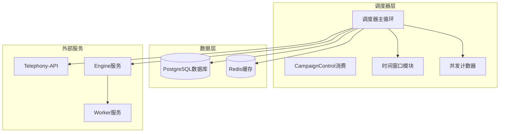

**图表来源**
- [DESIGN.md: 150-190:150-190](file://openspec/changes/archive/2026-05-06-impl-scheduler/design.md#L150-L190)
- [proposal.md: 7-48:7-48](file://openspec/changes/archive/2026-05-06-impl-scheduler/proposal.md#L7-L48)

**章节来源**
- [DESIGN.md: 1-190:1-190](file://openspec/changes/archive/2026-05-06-impl-scheduler/design.md#L1-L190)
- [README.md: 1-86:1-86](file://README.md#L1-L86)

## 核心组件

### 调度主循环架构

调度器采用单任务异步循环设计，每分钟执行一次调度tick：

```mermaid
sequenceDiagram
participant Loop as 调度主循环
participant Campaign as Campaign扫描
participant Filter as 候选过滤
participant Window as 时间窗口检查
participant Concurrency as 并发计数器
participant Device as 设备选择
participant Dial as DialRequest组装
participant Queue as 队列推送
Loop->>Campaign : 扫描活动Campaign集合
Campaign->>Filter : 获取候选线索
Filter->>Window : 检查时间窗口
Window->>Concurrency : 检查全局并发
Concurrency->>Device : 选择通信设备
Device->>Dial : 组装DialRequest
Dial->>Queue : 推送到engine : dial队列
Queue->>Loop : 等待下次tick
```

**图表来源**
- [DESIGN.md: 37-43:37-43](file://openspec/changes/archive/2026-05-06-impl-scheduler/design.md#L37-L43)
- [retry-followup/spec.md: 119-134:119-134](file://openspec/specs/retry-followup/spec.md#L119-L134)

### 状态写入边界契约

调度器与Worker之间的状态写入边界是系统设计的关键约束：

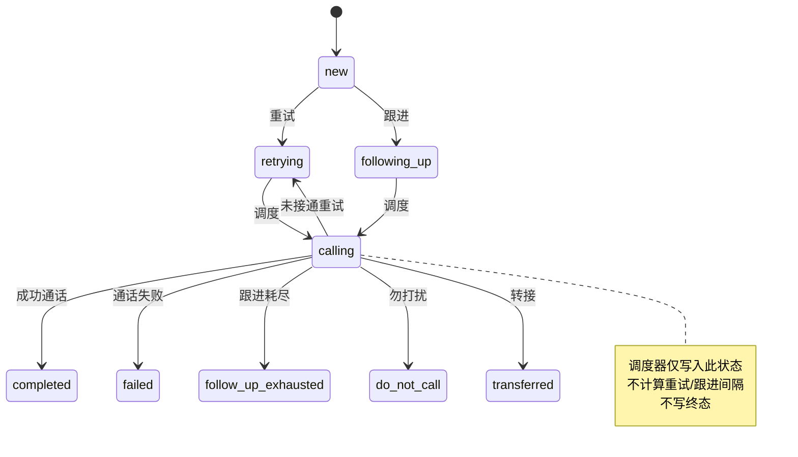

**图表来源**
- [retry-followup/spec.md: 140-158:140-158](file://openspec/specs/retry-followup/spec.md#L140-L158)

**章节来源**
- [DESIGN.md: 130-158:130-158](file://openspec/changes/archive/2026-05-06-impl-scheduler/design.md#L130-L158)
- [retry-followup/spec.md: 119-158:119-158](file://openspec/specs/retry-followup/spec.md#L119-L158)

## 架构概览

调度器系统遵循分层架构原则，各组件职责明确：

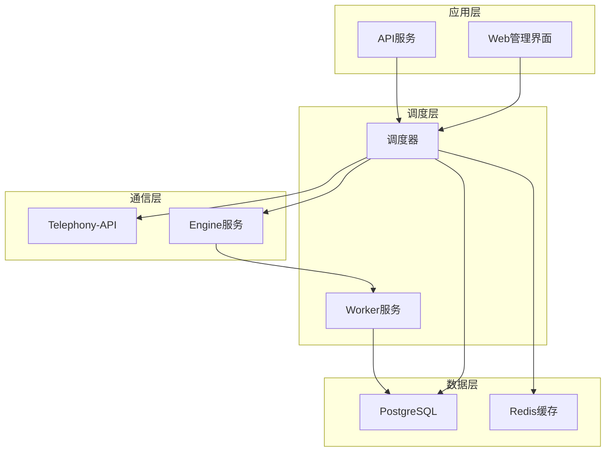

**图表来源**
- [DESIGN.md: 1-10:1-10](file://openspec/changes/archive/2026-05-06-impl-scheduler/design.md#L1-L10)
- [IMPLEMENTATION_PLAN.md: 150-172:150-172](file://IMPLEMENTATION_PLAN.md#L150-L172)

## 详细组件分析

### 1. 活动Campaign扫描

活动Campaign集合通过Redis SET进行持久化管理，进程内维护缓存副本：

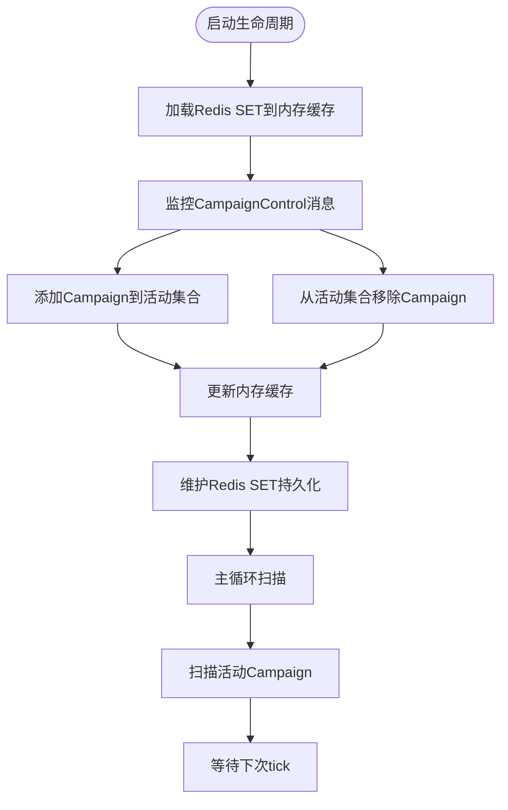

**图表来源**
- [DESIGN.md: 45-52:45-52](file://openspec/changes/archive/2026-05-06-impl-scheduler/design.md#L45-L52)
- [proposal.md: 12-16:12-16](file://openspec/changes/archive/2026-05-06-impl-scheduler/proposal.md#L12-L16)

**章节来源**
- [DESIGN.md: 45-52:45-52](file://openspec/changes/archive/2026-05-06-impl-scheduler/design.md#L45-L52)
- [proposal.md: 12-16:12-16](file://openspec/changes/archive/2026-05-06-impl-scheduler/proposal.md#L12-L16)

### 2. 候选Lead筛选

候选线索筛选遵循严格的条件过滤：

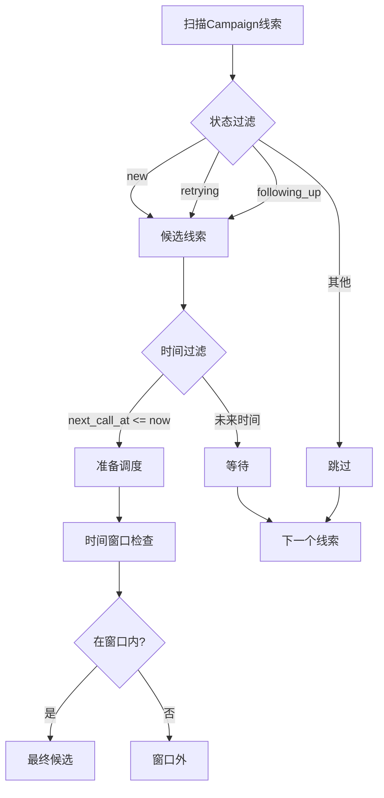

**图表来源**
- [retry-followup/spec.md: 127-128:127-128](file://openspec/specs/retry-followup/spec.md#L127-L128)

**章节来源**
- [retry-followup/spec.md: 127-128:127-128](file://openspec/specs/retry-followup/spec.md#L127-L128)

### 3. 可通话时间窗口检查

时间窗口检查是调度决策的核心环节：

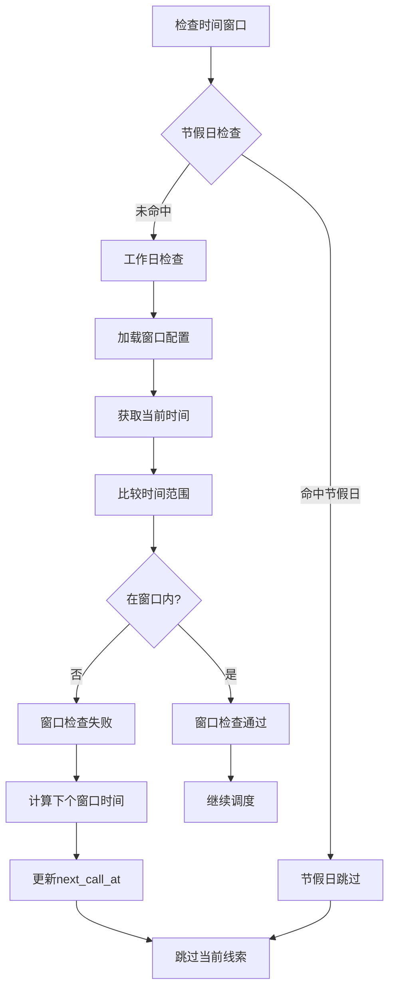

**图表来源**
- [time-window/spec.md: 51-78:51-78](file://openspec/specs/time-window/spec.md#L51-L78)
- [DESIGN.md: 79-86:79-86](file://openspec/changes/archive/2026-05-06-impl-scheduler/design.md#L79-L86)

**章节来源**
- [time-window/spec.md: 1-86:1-86](file://openspec/specs/time-window/spec.md#L1-L86)
- [DESIGN.md: 79-86:79-86](file://openspec/changes/archive/2026-05-06-impl-scheduler/design.md#L79-L86)

### 4. 全局并发计数器管理

并发计数器采用Redis原子操作确保线程安全：

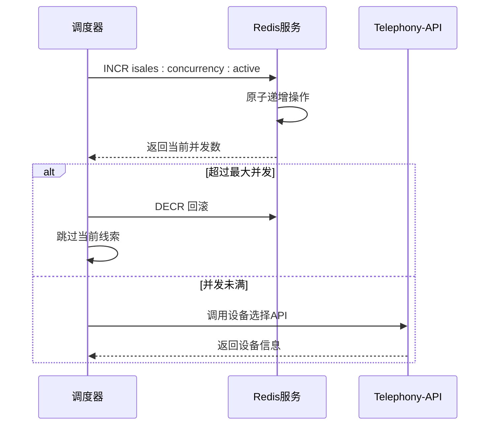

**图表来源**
- [DESIGN.md: 95-102:95-102](file://openspec/changes/archive/2026-05-06-impl-scheduler/design.md#L95-L102)
- [task.md: 33-38:33-38](file://openspec/changes/archive/2026-05-06-impl-scheduler/tasks.md#L33-L38)

**章节来源**
- [DESIGN.md: 95-102:95-102](file://openspec/changes/archive/2026-05-06-impl-scheduler/design.md#L95-L102)
- [task.md: 33-38:33-38](file://openspec/changes/archive/2026-05-06-impl-scheduler/tasks.md#L33-L38)

### 5. 设备选择

设备选择通过Telephony-API实现负载均衡：

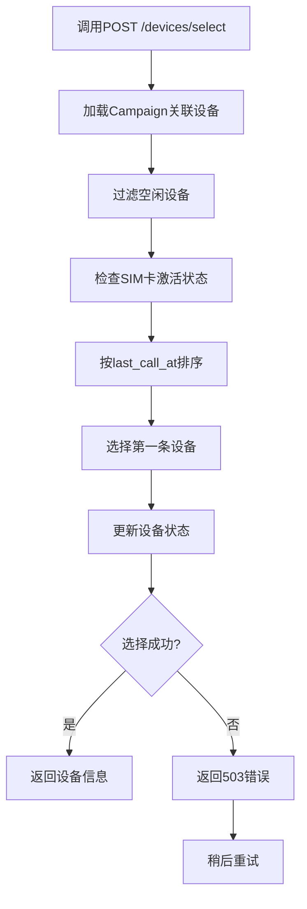

**图表来源**
- [device-hardware/spec.md: 12-25:12-25](file://openspec/specs/device-hardware/spec.md#L12-L25)

**章节来源**
- [device-hardware/spec.md: 1-30:1-30](file://openspec/specs/device-hardware/spec.md#L1-L30)

### 6. DialRequest组装

DialRequest包含完整的通话上下文信息：

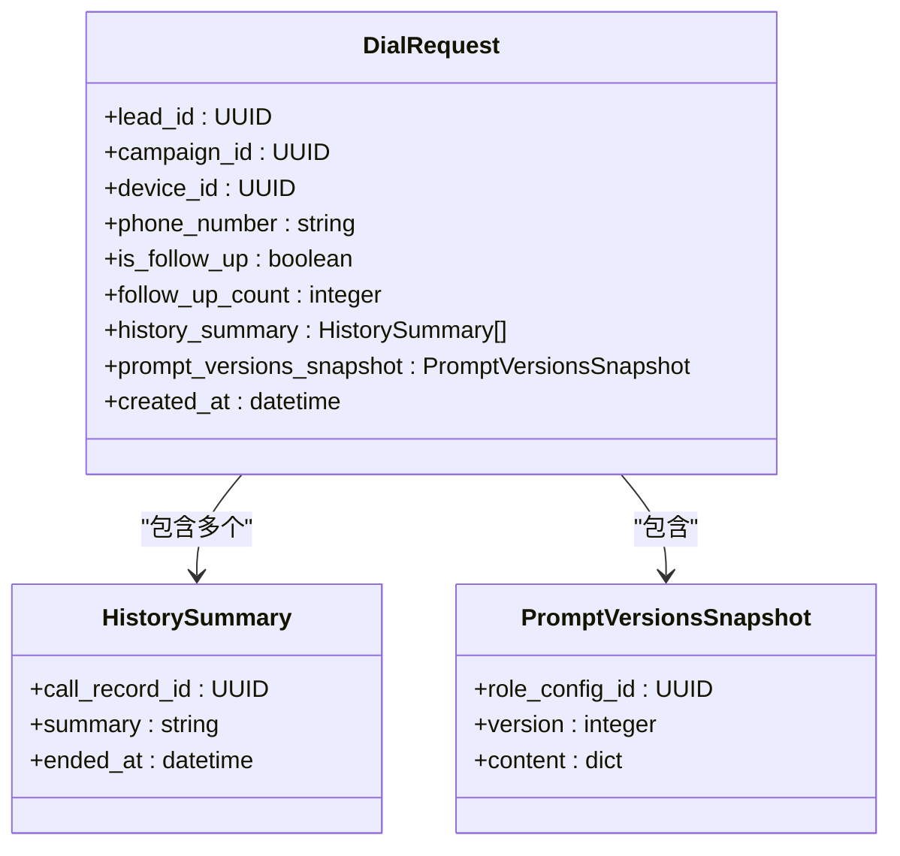

**图表来源**
- [proposal.md: 26-28:26-28](file://openspec/changes/archive/2026-05-06-impl-scheduler/proposal.md#L26-L28)

**章节来源**
- [proposal.md: 26-28:26-28](file://openspec/changes/archive/2026-05-06-impl-scheduler/proposal.md#L26-L28)

### 7. 队列推送

最终将DialRequest推送到engine:dial队列：

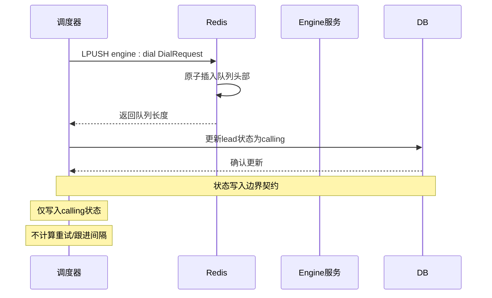

**图表来源**
- [retry-followup/spec.md: 140-143:140-143](file://openspec/specs/retry-followup/spec.md#L140-L143)

**章节来源**
- [retry-followup/spec.md: 140-143:140-143](file://openspec/specs/retry-followup/spec.md#L140-L143)

## 依赖分析

调度器系统依赖关系清晰，各组件职责分离：

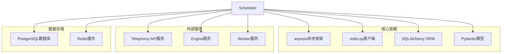

**图表来源**
- [DESIGN.md: 5-11:5-11](file://openspec/changes/archive/2026-05-06-impl-scheduler/design.md#L5-L11)

**章节来源**
- [DESIGN.md: 5-11:5-11](file://openspec/changes/archive/2026-05-06-impl-scheduler/design.md#L5-L11)

## 性能考虑

调度器在设计时充分考虑了性能优化：

### 并发控制策略
- 单实例部署，避免分布式锁开销
- Redis原子操作确保并发安全
- 限批处理防止单Campaign占用过多资源

### 缓存策略
- Redis SET持久化活动Campaign集合
- 进程内内存缓存减少Redis访问
- CampaignControl消息实时同步

### 超时和重试
- Telephony-API调用超时小于1秒
- 网络错误和5xx错误自动回滚
- 下次tick自然重试，避免长时间阻塞

## 故障排除指南

### 常见问题及解决方案

#### 调度器无法启动
1. 检查环境变量配置
2. 验证Redis和PostgreSQL连接
3. 确认isales-common版本兼容

#### 并发计数器异常
1. 检查Redis连接状态
2. 验证INCR/DECR操作原子性
3. 监控并发计数器泄漏

#### 设备选择失败
1. 检查Telephony-API服务状态
2. 验证设备空闲状态
3. 确认SIM卡激活状态

#### 队列推送失败
1. 检查Redis队列状态
2. 验证DialRequest序列化
3. 确认Engine服务可用性

**章节来源**
- [DESIGN.md: 160-172:160-172](file://openspec/changes/archive/2026-05-06-impl-scheduler/design.md#L160-L172)

## 结论

iSales调度器通过精心设计的7步调度流程，实现了高效、可靠的外呼调度系统。系统采用异步架构、严格的边界契约和完善的错误处理机制，确保了在高并发场景下的稳定运行。

关键设计亮点：
- 明确的调度步骤和错误处理策略
- 严格的调度器与Worker状态写入边界
- 基于Redis的全局并发控制
- 完善的时间窗口和节假日处理
- 可扩展的架构设计支持后续演进

该系统为后续的Engine和Worker服务提供了坚实的基础，支撑整个iSales外呼系统的稳定运行。