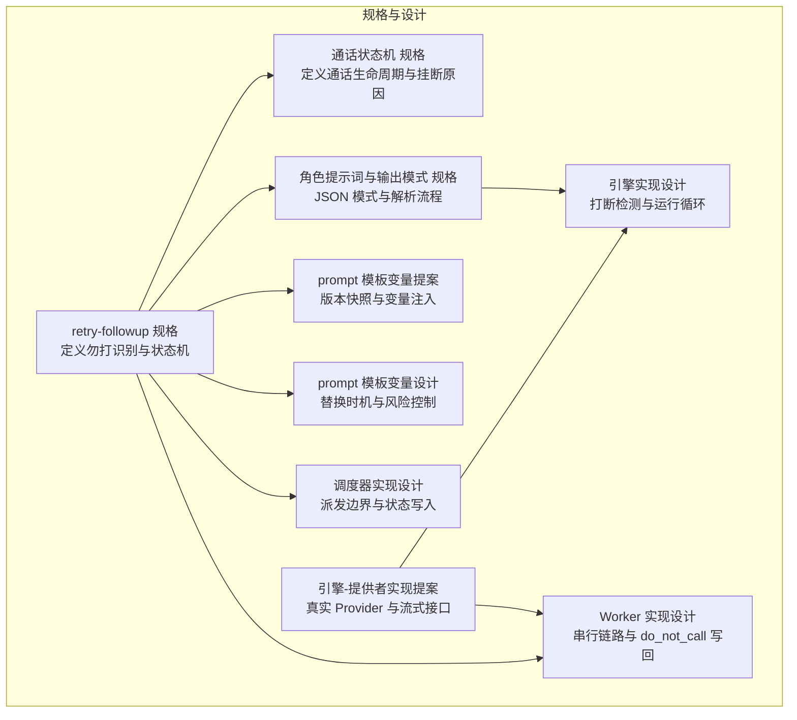
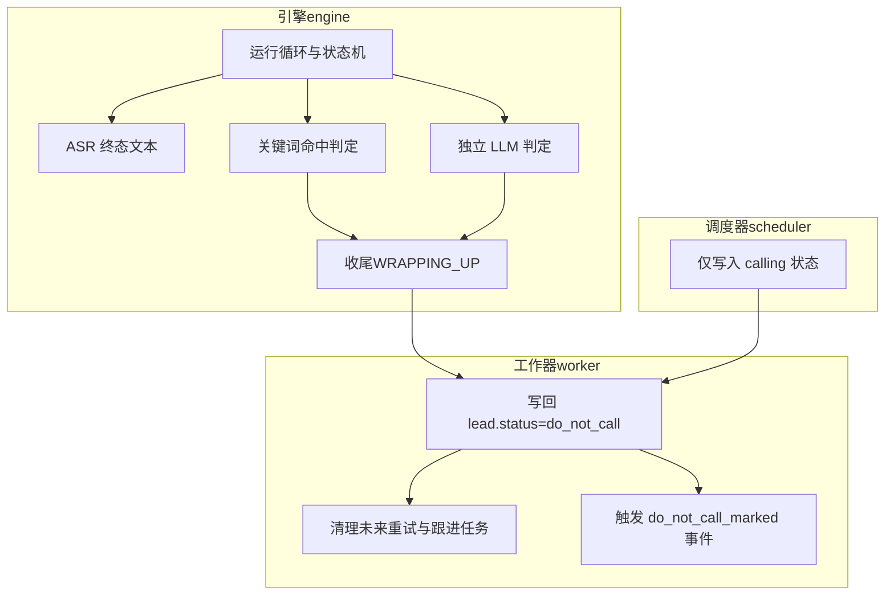
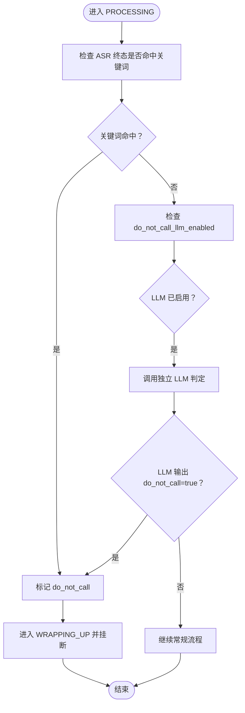
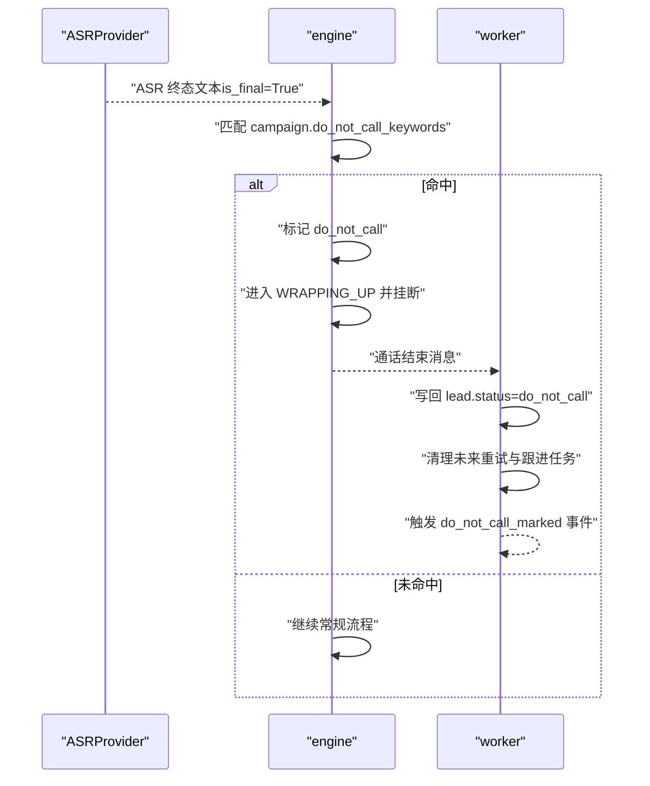
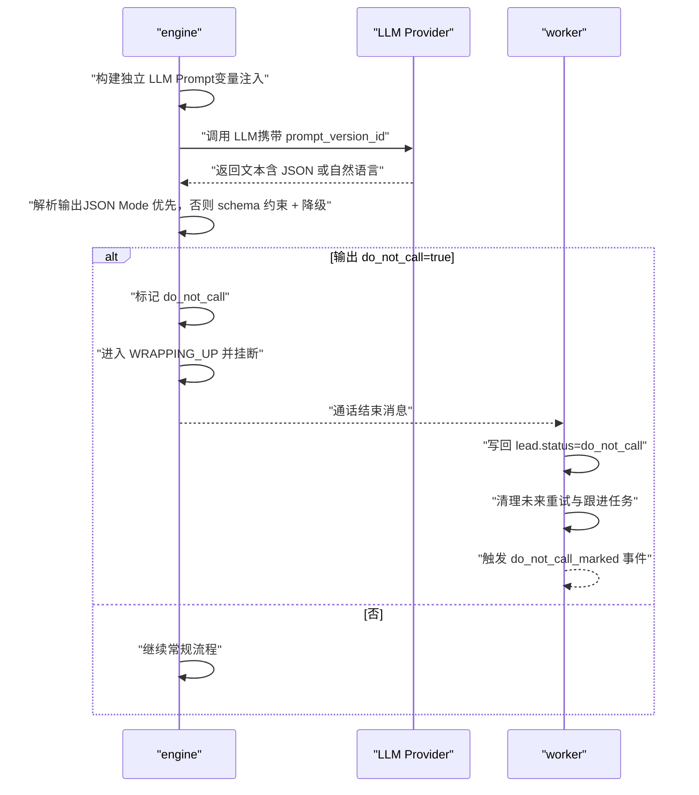
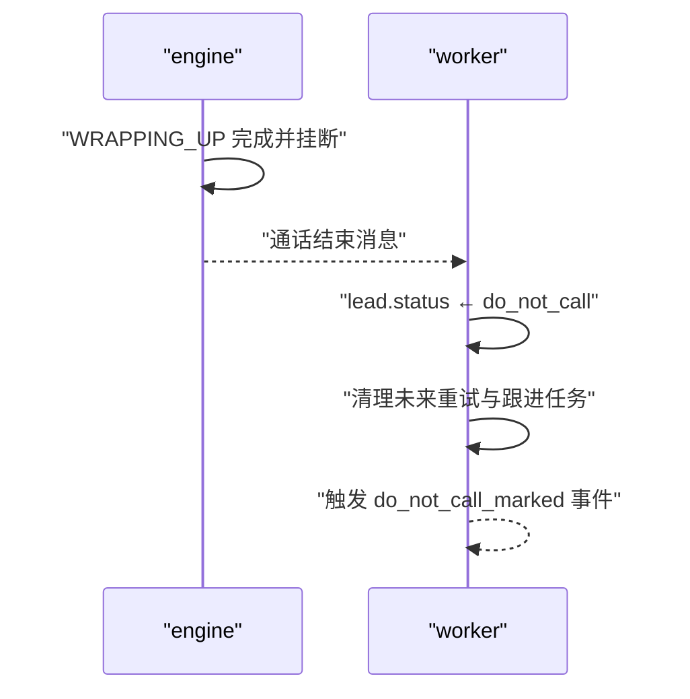
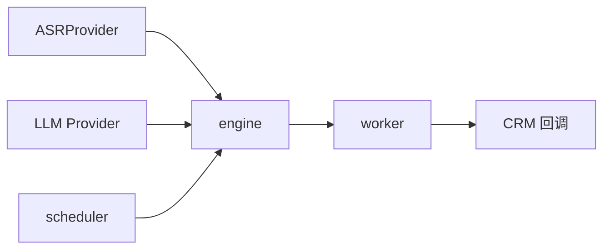

# 勿打识别

<cite>
**本文引用的文件**
- [retry-followup 规格](file://openspec/specs/retry-followup/spec.md)
- [通话状态机 规格](file://openspec/specs/call-state-machine/spec.md)
- [角色提示词与输出模式 规格](file://openspec/specs/role-prompt/spec.md)
- [prompt 模板变量变更提案](file://openspec/changes/archive/2026-05-29-prompt-template-vars-SUPERSEDED/proposal.md)
- [prompt 模板变量变更设计](file://openspec/changes/archive/2026-05-29-prompt-template-vars-SUPERSEDED/design.md)
- [引擎实现设计（打断检测等）](file://openspec/changes/archive/2026-05-07-impl-engine/design.md)
- [引擎-提供者实现提案](file://openspec/changes/archive/2026-05-08-impl-engine-providers/proposal.md)
- [调度器实现设计](file://openspec/changes/archive/2026-05-06-impl-scheduler/design.md)
- [Worker 实现设计](file://openspec/changes/archive/2026-05-06-impl-worker/design.md)
</cite>

## 目录
1. [简介](#简介)
2. [项目结构](#项目结构)
3. [核心组件](#核心组件)
4. [架构总览](#架构总览)
5. [详细组件分析](#详细组件分析)
6. [依赖分析](#依赖分析)
7. [性能考虑](#性能考虑)
8. [故障排查指南](#故障排查指南)
9. [结论](#结论)
10. [附录](#附录)

## 简介
本文件面向“勿打识别”系统，基于仓库内现有规格与设计文档，系统化阐述以下能力与流程：
- 双重 OR 关系设计：关键词命中与独立 LLM 判定两条路径，任一命中即触发标记与收尾。
- 关键词命中机制：ASR 终态结果匹配 campaign.do_not_call_keywords 的实现原则与触发时机。
- 独立 LLM 判定机制：do_not_call_llm_enabled 开关、prompt_version_id 版本管理、LLM 输出解析与判定。
- 标记后的处理流程：状态更新、未来调度任务清理、do_not_call_marked 事件触发。
- 配置示例、触发场景分析与异常处理策略。

## 项目结构
本仓库以“规格/设计”为主，核心实现位于各子服务（engine/scheduler/worker 等），勿打识别相关契约与流程在规格文档中明确。下图给出与“勿打识别”直接相关的规格与设计模块关系：

图表来源
- [retry-followup 规格:71-89](file://openspec/specs/retry-followup/spec.md#L71-L89)
- [通话状态机 规格:1-190](file://openspec/specs/call-state-machine/spec.md#L1-L190)
- [角色提示词与输出模式 规格:135-157](file://openspec/specs/role-prompt/spec.md#L135-L157)
- [prompt 模板变量变更提案:52-85](file://openspec/changes/archive/2026-05-29-prompt-template-vars-SUPERSEDED/proposal.md#L52-L85)
- [prompt 模板变量变更设计:159-177](file://openspec/changes/archive/2026-05-29-prompt-template-vars-SUPERSEDED/design.md#L159-L177)
- [引擎实现设计（打断检测等）:144-154](file://openspec/changes/archive/2026-05-07-impl-engine/design.md#L144-L154)
- [引擎-提供者实现提案:7-57](file://openspec/changes/archive/2026-05-08-impl-engine-providers/proposal.md#L7-L57)
- [调度器实现设计:35-52](file://openspec/changes/archive/2026-05-06-impl-scheduler/design.md#L35-L52)
- [Worker 实现设计:35-55](file://openspec/changes/archive/2026-05-06-impl-worker/design.md#L35-L55)

章节来源
- [retry-followup 规格:71-110](file://openspec/specs/retry-followup/spec.md#L71-L110)
- [通话状态机 规格:1-190](file://openspec/specs/call-state-machine/spec.md#L1-L190)

## 核心组件
- 勿打识别规则与状态机
  - 双重 OR 关系：关键词命中或独立 LLM 判定任一成立即标记 do_not_call，并进入收尾流程。
  - 状态机：在 WRAPPING_UP 结束后挂断，挂断原因遵循统一枚举。
- 关键词命中机制
  - 输入：ASR 终态结果文本；匹配：campaign.do_not_call_keywords 数组中任意短语命中。
  - 触发：LISTENING → PROCESSING 期间，或 SPEAKING/FILLER 结束后进入 PROCESSING 的首个环节。
- 独立 LLM 判定机制
  - 开关：campaign.do_not_call_llm_enabled 控制是否启用。
  - Prompt 版本：通过 prompt_version_id 快照与变量注入，确保可追溯与一致性。
  - 输出解析：优先原生 JSON Mode；不支持时采用系统提示词末尾 schema 约束 + 降级解析。
- 标记后的处理
  - 引擎侧：完成礼貌告别（WRAPPING_UP）后挂断。
  - Worker 侧：设置 lead.status=do_not_call，清理该 lead 的未来重试与跟进任务；可触发 do_not_call_marked 事件通知 CRM。

章节来源
- [retry-followup 规格:71-89](file://openspec/specs/retry-followup/spec.md#L71-L89)
- [通话状态机 规格:75-84](file://openspec/specs/call-state-machine/spec.md#L75-L84)
- [角色提示词与输出模式 规格:135-157](file://openspec/specs/role-prompt/spec.md#L135-L157)
- [prompt 模板变量变更提案:52-85](file://openspec/changes/archive/2026-05-29-prompt-template-vars-SUPERSEDED/proposal.md#L52-L85)
- [prompt 模板变量变更设计:159-177](file://openspec/changes/archive/2026-05-29-prompt-template-vars-SUPERSEDED/design.md#L159-L177)
- [Worker 实现设计:35-55](file://openspec/changes/archive/2026-05-06-impl-worker/design.md#L35-L55)

## 架构总览
下图展示“勿打识别”的跨模块协作：engine 在通话过程中进行识别判定，worker 在通话结束后写回状态并清理未来调度。

图表来源
- [retry-followup 规格:71-89](file://openspec/specs/retry-followup/spec.md#L71-L89)
- [通话状态机 规格:75-84](file://openspec/specs/call-state-machine/spec.md#L75-L84)
- [Worker 实现设计:35-55](file://openspec/changes/archive/2026-05-06-impl-worker/design.md#L35-L55)
- [调度器实现设计:35-52](file://openspec/changes/archive/2026-05-06-impl-scheduler/design.md#L35-L52)

## 详细组件分析

### 双重 OR 关系设计原理
- 设计要点
  - 两条路径并行存在，任一命中即触发标记与收尾。
  - 标记后统一进入 WRAPPING_UP，完成后挂断，保证礼貌告别。
- 触发边界
  - 关键词命中：在 ASR 终态文本中匹配 campaign.do_not_call_keywords。
  - 独立 LLM 判定：当 do_not_call_llm_enabled=true 且 LLM 输出 {"do_not_call": true}。

图表来源
- [retry-followup 规格:71-89](file://openspec/specs/retry-followup/spec.md#L71-L89)
- [通话状态机 规格:75-84](file://openspec/specs/call-state-machine/spec.md#L75-L84)

章节来源
- [retry-followup 规格:71-89](file://openspec/specs/retry-followup/spec.md#L71-L89)

### 关键词命中机制（ASR 终态匹配）
- 输入与匹配
  - 输入：ASRProvider 返回的终态文本（is_final=True）。
  - 匹配：campaign.do_not_call_keywords 数组中任意短语命中即触发。
- 触发时机
  - 在 LISTENING → PROCESSING 转换后，或 SPEAKING/FILLER 结束后进入 PROCESSING 的首个环节进行判定。
- 与状态机的关系
  - 命中后进入 WRAPPING_UP，随后挂断，挂断原因遵循统一枚举。

图表来源
- [retry-followup 规格:75-78](file://openspec/specs/retry-followup/spec.md#L75-L78)
- [通话状态机 规格:65-68](file://openspec/specs/call-state-machine/spec.md#L65-L68)

章节来源
- [retry-followup 规格:75-78](file://openspec/specs/retry-followup/spec.md#L75-L78)
- [通话状态机 规格:65-68](file://openspec/specs/call-state-machine/spec.md#L65-L68)

### 独立 LLM 判定机制
- 开关与版本
  - do_not_call_llm_enabled：控制是否启用独立 LLM 判定。
  - prompt_version_id：记录判定时使用的 prompt 版本，随通话写入 call_record.prompt_versions。
- Prompt 注入与替换
  - 变量注入：支持 ${role_prompt}、${campaign_name}、${lead_name}、${lead_phone}、${lead_custom_data} 等。
  - 替换时机：在 runtime_config.load_runtime_config 阶段一次性完成，不影响热路径。
- 输出解析与降级
  - 优先原生 JSON Mode；不支持时在 system prompt 末尾追加 schema 描述，按 json.loads → 正则提取 {...} → 降级为文本的顺序解析。
  - 单角色解析失败即淘汰，全部失败进入“全部裁判否决”路径（与勿打判定无关，但体现解析健壮性）。

图表来源
- [retry-followup 规格:80-83](file://openspec/specs/retry-followup/spec.md#L80-L83)
- [角色提示词与输出模式 规格:135-157](file://openspec/specs/role-prompt/spec.md#L135-L157)
- [prompt 模板变量变更提案:52-85](file://openspec/changes/archive/2026-05-29-prompt-template-vars-SUPERSEDED/proposal.md#L52-L85)
- [prompt 模板变量变更设计:159-177](file://openspec/changes/archive/2026-05-29-prompt-template-vars-SUPERSEDED/design.md#L159-L177)

章节来源
- [retry-followup 规格:80-83](file://openspec/specs/retry-followup/spec.md#L80-L83)
- [角色提示词与输出模式 规格:135-157](file://openspec/specs/role-prompt/spec.md#L135-L157)
- [prompt 模板变量变更提案:52-85](file://openspec/changes/archive/2026-05-29-prompt-template-vars-SUPERSEDED/proposal.md#L52-L85)
- [prompt 模板变量变更设计:159-177](file://openspec/changes/archive/2026-05-29-prompt-template-vars-SUPERSEDED/design.md#L159-L177)

### 标记后的处理流程（状态更新、清理与事件）
- 状态更新
  - 引擎侧：完成礼貌告别（WRAPPING_UP）后挂断。
  - Worker 侧：写回 lead.status=do_not_call。
- 未来调度任务清理
  - Worker 侧：移除该 lead 所有未来重试与跟进任务。
- do_not_call_marked 事件
  - Worker 侧：可触发该事件，通知 CRM 等回调配置。

图表来源
- [retry-followup 规格:85-89](file://openspec/specs/retry-followup/spec.md#L85-L89)
- [Worker 实现设计:35-55](file://openspec/changes/archive/2026-05-06-impl-worker/design.md#L35-L55)

章节来源
- [retry-followup 规格:85-89](file://openspec/specs/retry-followup/spec.md#L85-L89)
- [Worker 实现设计:35-55](file://openspec/changes/archive/2026-05-06-impl-worker/design.md#L35-L55)

### 配置示例与触发场景
- 配置项
  - campaign.do_not_call_keywords：JSONB 数组，例如 ["不要打", "别打", "勿打"]。
  - campaign.do_not_call_llm_enabled：布尔，启用独立 LLM 判定。
  - campaign.do_not_call_llm_prompt_version_id：FK，指定独立 LLM 的 prompt 版本。
- 触发场景
  - 关键词命中：ASR 终态文本包含任一关键词。
  - 独立 LLM 判定：LLM 输出 {"do_not_call": true} 且开关开启。
- 状态机与挂断原因
  - 标记后统一进入 WRAPPING_UP 并挂断，挂断原因遵循统一枚举。

章节来源
- [retry-followup 规格:168-170](file://openspec/specs/retry-followup/spec.md#L168-L170)
- [通话状态机 规格:170-186](file://openspec/specs/call-state-machine/spec.md#L170-L186)

### 异常处理策略
- LLM 解析失败
  - 单角色 JSON 解析失败即淘汰，全部失败进入“全部裁判否决”路径（与勿打判定无关）。
- Prompt 变量替换
  - 未知变量保留字面并记录警告日志；历史遗留变量可通过数据迁移清理。
- Provider 失败兜底
  - ASR/TTS/LLM Provider 失败时按各自实现的兜底策略处理（如重试、降级、取消音频输出等）。

章节来源
- [角色提示词与输出模式 规格:145-149](file://openspec/specs/role-prompt/spec.md#L145-L149)
- [prompt 模板变量变更设计:159-177](file://openspec/changes/archive/2026-05-29-prompt-template-vars-SUPERSEDED/design.md#L159-L177)
- [引擎-提供者实现提案:15-27](file://openspec/changes/archive/2026-05-08-impl-engine-providers/proposal.md#L15-L27)

## 依赖分析
- 模块耦合
  - engine 依赖 ASR 终态文本与 LLM 输出；依赖调度器仅写入 calling 状态，避免越权写终态。
  - worker 依赖 engine 的通话结束消息，负责写回状态与清理任务。
- 外部依赖
  - ASR/TTS/LLM 通过 Provider ABC 抽象，便于替换供应商。
- 版本与可追溯性
  - prompt_version_id 快照与变量注入确保历史可回放与一致性。

图表来源
- [引擎-提供者实现提案:7-57](file://openspec/changes/archive/2026-05-08-impl-engine-providers/proposal.md#L7-L57)
- [Worker 实现设计:35-55](file://openspec/changes/archive/2026-05-06-impl-worker/design.md#L35-L55)
- [调度器实现设计:35-52](file://openspec/changes/archive/2026-05-06-impl-scheduler/design.md#L35-L52)

章节来源
- [引擎-提供者实现提案:7-57](file://openspec/changes/archive/2026-05-08-impl-engine-providers/proposal.md#L7-L57)
- [Worker 实现设计:35-55](file://openspec/changes/archive/2026-05-06-impl-worker/design.md#L35-L55)
- [调度器实现设计:35-52](file://openspec/changes/archive/2026-05-06-impl-scheduler/design.md#L35-L52)

## 性能考虑
- LLM 解析路径
  - 优先原生 JSON Mode，减少后处理开销；不支持时采用 schema 约束 + 降级，避免额外解析成本。
- Prompt 变量替换
  - 在加载阶段一次性完成，避免热路径重复计算。
- Provider 失败与取消
  - TTS 取消传播至底层音频输出，避免缓冲残留；Provider 失败时重试/降级策略减少对整体流程的影响。

## 故障排查指南
- 关键词未命中
  - 检查 ASR 终态文本是否正确传入；确认 campaign.do_not_call_keywords 是否包含目标短语。
- 独立 LLM 未触发
  - 确认 do_not_call_llm_enabled 已开启；检查 prompt_version_id 是否正确；核对 LLM 输出是否满足 {"do_not_call": true}。
- 状态未更新为 do_not_call
  - 确认 worker 串行链路是否完整执行（summarize → process_callbacks → update_lead_state）；检查是否在写回前被其他模块覆盖。
- 未来任务未清理
  - 确认 worker 写回 lead.status 后执行了清理逻辑；核对回调重试调度器是否独立运行。
- 日志与告警
  - 关注 LLM 解析失败、未知变量替换警告、Provider 超时/限流/错误等日志。

章节来源
- [Worker 实现设计:35-55](file://openspec/changes/archive/2026-05-06-impl-worker/design.md#L35-L55)
- [prompt 模板变量变更设计:159-177](file://openspec/changes/archive/2026-05-29-prompt-template-vars-SUPERSEDED/design.md#L159-L177)
- [引擎-提供者实现提案:15-27](file://openspec/changes/archive/2026-05-08-impl-engine-providers/proposal.md#L15-L27)

## 结论
勿打识别通过“双重 OR 关系”确保高覆盖率与鲁棒性：关键词命中与独立 LLM 判定互为补充。配合统一的 prompt 版本管理、严格的输出解析与降级策略，以及清晰的标记后处理流程（状态更新、任务清理、事件通知），系统在工程上具备可追溯、可演进与可运维的特性。建议在生产中结合日志与回放能力，持续验证关键词与 LLM 判定的准确性与稳定性。

## 附录
- 相关配置字段
  - campaign.do_not_call_keywords：JSONB 数组
  - campaign.do_not_call_llm_enabled：布尔
  - campaign.do_not_call_llm_prompt_version_id：FK
- 相关状态与挂断原因
  - lead.status：do_not_call 为终态
  - 挂断原因：遵循统一枚举，标记后进入 WRAPPING_UP 并挂断

章节来源
- [retry-followup 规格:168-170](file://openspec/specs/retry-followup/spec.md#L168-L170)
- [通话状态机 规格:170-186](file://openspec/specs/call-state-machine/spec.md#L170-L186)