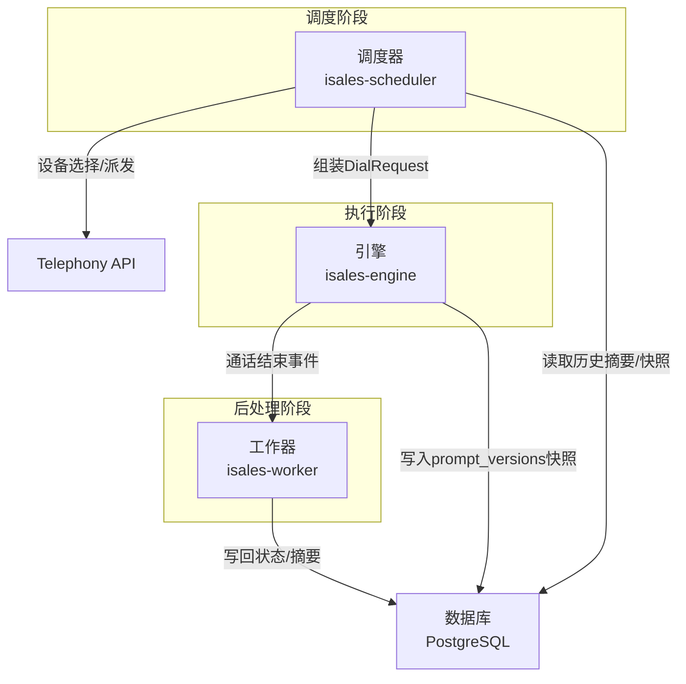
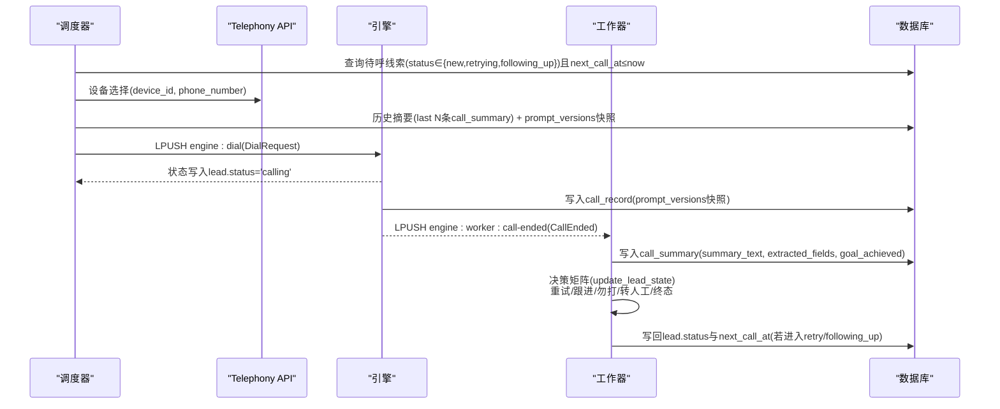
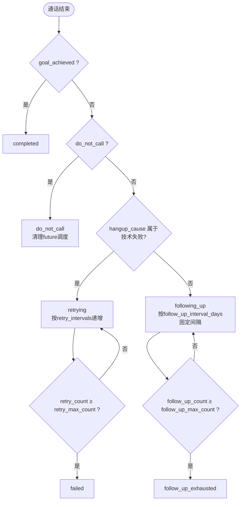
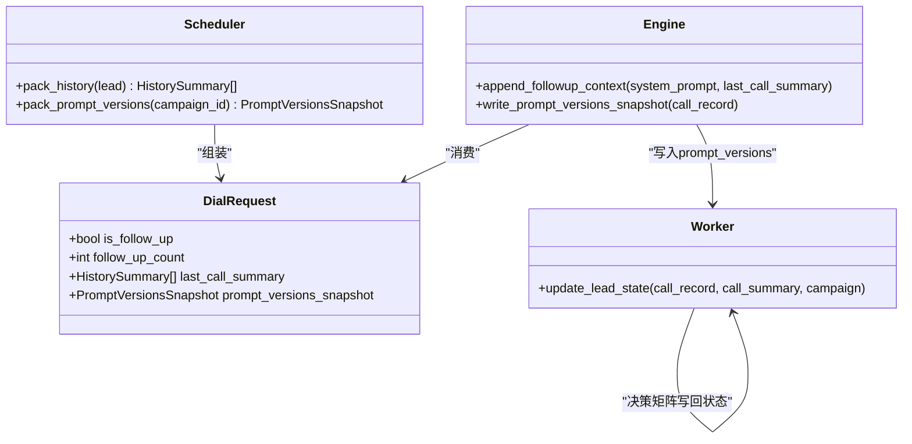
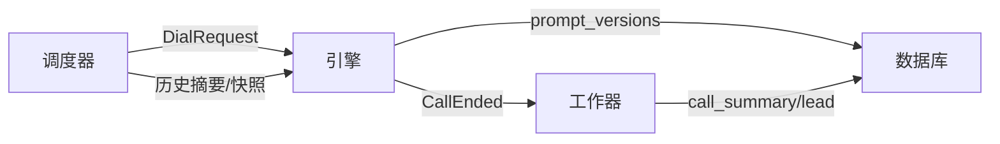

# 跟进机制

<cite>
**本文档引用的文件**
- [retry-followup 规格说明](file://openspec/specs/retry-followup/spec.md)
- [角色提示规格说明](file://openspec/specs/role-prompt/spec.md)
- [通话状态机规格说明](file://openspec/specs/call-state-machine/spec.md)
- [数据模型规格说明](file://openspec/specs/data-model/spec.md)
- [调度器实现提案](file://openspec/changes/archive/2026-05-06-impl-scheduler/proposal.md)
- [调度器设计决策](file://openspec/changes/archive/2026-05-06-impl-scheduler/design.md)
- [调度器任务清单](file://openspec/changes/archive/2026-05-06-impl-scheduler/tasks.md)
- [调度器实现提案（旧版）](file://openspec/changes/archive/2026-05-06-impl-scheduler/spec.md)
- [工作器实现提案](file://openspec/changes/archive/2026-05-06-impl-worker/proposal.md)
- [工作器设计决策](file://openspec/changes/archive/2026-05-06-impl-worker/design.md)
- [引擎实现提案](file://openspec/changes/archive/2026-05-07-impl-engine/proposal.md)
- [引擎设计决策](file://openspec/changes/archive/2026-05-07-impl-engine/design.md)
- [Web 管理界面规格说明](file://openspec/specs/web-admin-ui/spec.md)
</cite>

## 目录
1. [简介](#简介)
2. [项目结构](#项目结构)
3. [核心组件](#核心组件)
4. [架构总览](#架构总览)
5. [详细组件分析](#详细组件分析)
6. [依赖关系分析](#依赖关系分析)
7. [性能考量](#性能考量)
8. [故障排查指南](#故障排查指南)
9. [结论](#结论)
10. [附录](#附录)

## 简介
本文件系统化阐述 iSales 系统中的“跟进机制”，涵盖设计理念、触发条件、固定间隔策略、上限控制、上下文增强（历史摘要注入、role-prompt 追加、prompt_versions 快照管理），以及完整的跟进通话流程与配置最佳实践。目标读者既包括工程团队，也包括产品与运营人员，帮助大家在理解机制原理的同时，安全高效地配置与使用跟进能力。

## 项目结构
跟进机制横跨三个阶段的服务：调度器（scheduler）、引擎（engine）、工作器（worker），并通过若干规范（retry-followup、role-prompt、call-state-machine、data-model）定义行为契约与数据模型。

图表来源
- [调度器实现提案:18-33](file://openspec/changes/archive/2026-05-06-impl-scheduler/proposal.md#L18-L33)
- [工作器实现提案:12-16](file://openspec/changes/archive/2026-05-06-impl-worker/proposal.md#L12-L16)
- [引擎实现提案:12-16](file://openspec/changes/archive/2026-05-07-impl-engine/proposal.md#L12-L16)

章节来源
- [调度器实现提案:1-48](file://openspec/changes/archive/2026-05-06-impl-scheduler/proposal.md#L1-L48)
- [工作器实现提案:1-72](file://openspec/changes/archive/2026-05-06-impl-worker/proposal.md#L1-L72)
- [引擎实现提案:7-131](file://openspec/changes/archive/2026-05-07-impl-engine/proposal.md#L7-L131)

## 核心组件
- 调度器（scheduler）
  - 负责扫描待呼线索、时间窗口与节假日判定、并发控制、设备选择、历史摘要与 prompt_versions 快照打包、派发 DialRequest。
- 引擎（engine）
  - 消费 DialRequest，启动通话状态机，按角色提示规范组装 prompt，执行三层管线，写入 call_record 与 pipeline_trace，并在结束时派发 CallEnded。
- 工作器（worker）
  - 消费 CallEnded，生成 call_summary，处理回调，依据 retry-followup 决策矩阵写回 lead 状态与下次拨打时间。
- 数据模型与规范
  - campaign、lead、call_record、call_summary、role_config、prompt_version 等表字段与状态机契约，确保三阶段协作的一致性。

章节来源
- [数据模型规格说明:28-51](file://openspec/specs/data-model/spec.md#L28-L51)
- [retry-followup 规格说明:90-118](file://openspec/specs/retry-followup/spec.md#L90-L118)

## 架构总览
跟进机制遵循“调度-执行-后处理”三层分工，状态写回边界清晰：调度器仅负责派发与部分 next_call_at 推迟（窗外重排），其余状态变更与 next_call_at 计算均由工作器完成。

图表来源
- [调度器实现提案:18-33](file://openspec/changes/archive/2026-05-06-impl-scheduler/proposal.md#L18-L33)
- [工作器实现提案:12-16](file://openspec/changes/archive/2026-05-06-impl-worker/proposal.md#L12-L16)
- [工作器设计决策:114-129](file://openspec/changes/archive/2026-05-06-impl-worker/design.md#L114-L129)

## 详细组件分析

### 触发条件与状态机
- 正常结束但目标未达成且非 do_not_call：进入 following_up，等待 follow_up_interval_days 的固定间隔后再次外呼。
- 非 do_not_call 且非技术失败：若目标未达成，进入 following_up；若达成，进入 completed。
- 技术失败：进入 retrying，按 retry_intervals 指数退避，达到 retry_max_count 后进入 failed。
- 勿打识别：任一命中（ASR关键词或独立 LLM 判定）→ do_not_call，清理未来调度任务。

图表来源
- [retry-followup 规格说明:14-50](file://openspec/specs/retry-followup/spec.md#L14-L50)
- [工作器设计决策:114-129](file://openspec/changes/archive/2026-05-06-impl-worker/design.md#L114-L129)

章节来源
- [retry-followup 规格说明:9-50](file://openspec/specs/retry-followup/spec.md#L9-L50)
- [工作器设计决策:114-129](file://openspec/changes/archive/2026-05-06-impl-worker/design.md#L114-L129)

### 固定间隔策略与上限控制
- 跟进间隔策略：固定间隔 + 最大次数。每次跟进时间 = 上次通话结束时间 + N × follow_up_interval_days。
- 上限控制：达到 follow_up_max_count 后进入 follow_up_exhausted，不再排队。
- 重试策略：指数退避数组 + 最大次数；达到 retry_max_count 后进入 failed。

章节来源
- [retry-followup 规格说明:38-50](file://openspec/specs/retry-followup/spec.md#L38-L50)
- [retry-followup 规格说明:24-36](file://openspec/specs/retry-followup/spec.md#L24-L36)

### 跟进上下文增强机制
- 历史摘要注入：调度器在派发跟进通话时，从 call_summary 表取近 N 条摘要，放入 DialRequest 的 last_call_summary 字段，供引擎直接使用。
- role-prompt 追加：引擎在 system prompt 末尾追加“跟进上下文”段落，提醒开场与话术避免重复。
- prompt_versions 快照：通话开始时冻结当前 prompt 版本快照，写入 call_record.prompt_versions，避免调度与执行时刻不一致。

图表来源
- [角色提示规格说明:112-130](file://openspec/specs/role-prompt/spec.md#L112-L130)
- [调度器实现提案:26-28](file://openspec/changes/archive/2026-05-06-impl-scheduler/proposal.md#L26-L28)
- [引擎实现提案:38-38](file://openspec/changes/archive/2026-05-07-impl-engine/proposal.md#L38-L38)

章节来源
- [角色提示规格说明:52-70](file://openspec/specs/role-prompt/spec.md#L52-L70)
- [角色提示规格说明:112-130](file://openspec/specs/role-prompt/spec.md#L112-L130)
- [调度器实现提案:26-28](file://openspec/changes/archive/2026-05-06-impl-scheduler/proposal.md#L26-L28)
- [引擎实现提案:38-38](file://openspec/changes/archive/2026-05-07-impl-engine/proposal.md#L38-L38)

### 调度器派发边界与数据流
- 调度循环：每分钟扫描 active campaigns，按 next_call_at ASC 限批取数，执行时间窗口/节假日/并发/选号/打包/派发。
- 状态写入边界：仅将 lead.status 写为 calling；next_call_at 的重试/跟进计算由工作器写回。
- 窗外重排：仅在调度器允许写回 next_call_at 的场景（窗外 lead 推迟到最近窗口起点）。

章节来源
- [调度器实现提案:18-33](file://openspec/changes/archive/2026-05-06-impl-scheduler/proposal.md#L18-L33)
- [调度器设计决策:130-137](file://openspec/changes/archive/2026-05-06-impl-scheduler/design.md#L130-L137)
- [retry-followup 规格说明:140-158](file://openspec/specs/retry-followup/spec.md#L140-L158)

### 工作器决策矩阵与状态回写
- 决策矩阵覆盖：技术失败重试、call_rejected、目标达成/未达成跟进、转人工、勿打、上限终态。
- race 保护：使用 UPDATE lead SET ... WHERE id=:id AND status='calling'，防止与调度器竞态。

章节来源
- [工作器实现提案:40-51](file://openspec/changes/archive/2026-05-06-impl-worker/proposal.md#L40-L51)
- [工作器设计决策:114-129](file://openspec/changes/archive/2026-05-06-impl-worker/design.md#L114-L129)

### 引擎 prompt 组装与上下文注入
- 三段式组装：system message + 单条 user message；user message 包含“上次通话纪要”“线索信息”“对话历史”。
- WRAPPING_UP 与跟进上下文：在 system prompt 末尾追加收尾指令与跟进上下文段落；历史摘要来自 DialRequest。

章节来源
- [角色提示规格说明:21-46](file://openspec/specs/role-prompt/spec.md#L21-L46)
- [角色提示规格说明:93-130](file://openspec/specs/role-prompt/spec.md#L93-L130)
- [引擎实现提案:32-38](file://openspec/changes/archive/2026-05-07-impl-engine/proposal.md#L32-L38)

## 依赖关系分析
- 调度器依赖 Telephony API 获取设备与号码，依赖数据库读取历史摘要与 prompt_versions 快照。
- 引擎依赖 isales-common 的 DialRequest/CallEnded 等 Pydantic 类，依赖 provider 抽象进行 LLM/ASR/TTS 调用。
- 工作器依赖数据库写入 call_summary 与 lead 状态，依赖回调配置进行 webhook 通知。

图表来源
- [调度器实现提案:26-28](file://openspec/changes/archive/2026-05-06-impl-scheduler/proposal.md#L26-L28)
- [引擎实现提案:12-16](file://openspec/changes/archive/2026-05-07-impl-engine/proposal.md#L12-L16)
- [工作器实现提案:12-16](file://openspec/changes/archive/2026-05-06-impl-worker/proposal.md#L12-L16)

章节来源
- [调度器实现提案:1-48](file://openspec/changes/archive/2026-05-06-impl-scheduler/proposal.md#L1-L48)
- [引擎实现提案:7-131](file://openspec/changes/archive/2026-05-07-impl-engine/proposal.md#L7-L131)
- [工作器实现提案:1-72](file://openspec/changes/archive/2026-05-06-impl-worker/proposal.md#L1-L72)

## 性能考量
- 调度循环频率：每分钟 tick，满足外呼场景延迟需求；单任务模型简化并发。
- 并发控制：Redis 原子 INCR/DECR，超过上限立即回滚，避免资源争用。
- 历史摘要与 prompt_versions：仅在调度器打包，避免引擎重复查库。
- 窗外 lead 推迟：按最近窗口起点更新 next_call_at，减少无效尝试。

章节来源
- [调度器设计决策:35-52](file://openspec/changes/archive/2026-05-06-impl-scheduler/design.md#L35-L52)
- [调度器实现提案:20-33](file://openspec/changes/archive/2026-05-06-impl-scheduler/proposal.md#L20-L33)
- [调度器任务清单:33-38](file://openspec/changes/archive/2026-05-06-impl-scheduler/tasks.md#L33-L38)

## 故障排查指南
- 调度器派发失败
  - 现象：lead.status 保持原值，Redis 并发计数器回滚。
  - 排查：检查 Telephony API 选号接口、DialRequest 构造、Redis 并发上限。
- 工作器写回 race
  - 现象：UPDATE 0 行，日志警告。
  - 排查：确认调度器已先写 lead.status='calling'，再由工作器写回。
- 跟进未触发
  - 现象：目标未达成但未进入 following_up。
  - 排查：确认 hangup_cause 属于正常结束、call_summary.goal_achieved=false、lead.status ≠ do_not_call。
- 历史摘要缺失
  - 现象：跟进时未看到“上次通话纪要”。
  - 排查：确认调度器已打包 last_call_summary 并写入 DialRequest；引擎直接使用该字段。
- prompt_versions 不一致
  - 现象：调试回放 prompt 内容与当时不符。
  - 排查：确认通话开始时已冻结 prompt_versions 快照并写入 call_record。

章节来源
- [调度器实现提案:145-149](file://openspec/changes/archive/2026-05-06-impl-scheduler/proposal.md#L145-L149)
- [工作器实现提案:50-51](file://openspec/changes/archive/2026-05-06-impl-worker/proposal.md#L50-L51)
- [角色提示规格说明:150-176](file://openspec/specs/role-prompt/spec.md#L150-L176)
- [引擎设计决策:244-248](file://openspec/changes/archive/2026-05-07-impl-engine/design.md#L244-L248)

## 结论
跟进机制通过“固定间隔 + 上限”的策略，结合历史摘要与 role-prompt 追加，有效避免重复沟通并提升转化效率。调度-执行-后处理的职责分离与严格的写回边界，保证了系统的稳定性与可观测性。配合合理的配置与监控，可实现高质量的外呼体验与业务目标。

## 附录

### 跟进通话完整流程示例
- 触发条件：通话正常结束（normal_clearing/wrap_up_completed/silence_max_reached）且目标未达成，且非 do_not_call。
- 调度器：取 lead、校验时间窗口、并发、选号、打包历史摘要与 prompt_versions、派发 DialRequest。
- 引擎：消费 DialRequest，组装 role-prompt（追加跟进上下文），执行三层管线，结束时派发 CallEnded。
- 工作器：生成 call_summary，按决策矩阵写回 lead.status 与 next_call_at（若进入 following_up）。

章节来源
- [retry-followup 规格说明:14-17](file://openspec/specs/retry-followup/spec.md#L14-L17)
- [调度器实现提案:18-33](file://openspec/changes/archive/2026-05-06-impl-scheduler/proposal.md#L18-L33)
- [工作器实现提案:12-16](file://openspec/changes/archive/2026-05-06-impl-worker/proposal.md#L12-L16)
- [角色提示规格说明:112-130](file://openspec/specs/role-prompt/spec.md#L112-L130)

### 配置最佳实践
- follow_up_interval_days
  - 建议：根据业务节奏与客户感知设置（如 3/7/14 天），避免过于频繁导致扰民。
- follow_up_max_count
  - 建议：结合目标达成率与成本预算设定上限（如 2-4 次），避免无限跟进。
- retry_intervals 与 retry_max_count
  - 建议：采用指数退避数组（如 60/240/1440 分钟），并设置合理上限，避免资源浪费。
- do_not_call 识别
  - 建议：开启关键词与独立 LLM 判定，确保命中后礼貌收尾并清理未来调度。
- prompt_versions 快照
  - 建议：编辑 prompt 后及时发布新版本，通话开始时冻结快照，保障回放一致性。

章节来源
- [retry-followup 规格说明:38-50](file://openspec/specs/retry-followup/spec.md#L38-L50)
- [retry-followup 规格说明:71-88](file://openspec/specs/retry-followup/spec.md#L71-L88)
- [角色提示规格说明:150-176](file://openspec/specs/role-prompt/spec.md#L150-L176)
- [Web 管理界面规格说明:61-84](file://openspec/specs/web-admin-ui/spec.md#L61-L84)