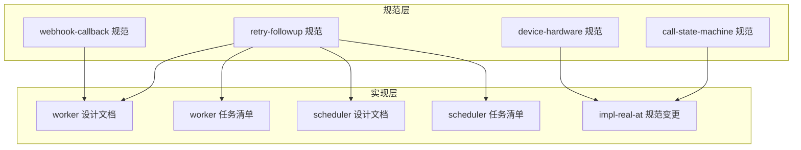
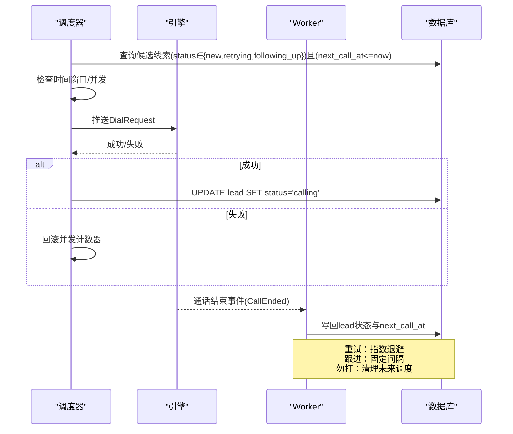
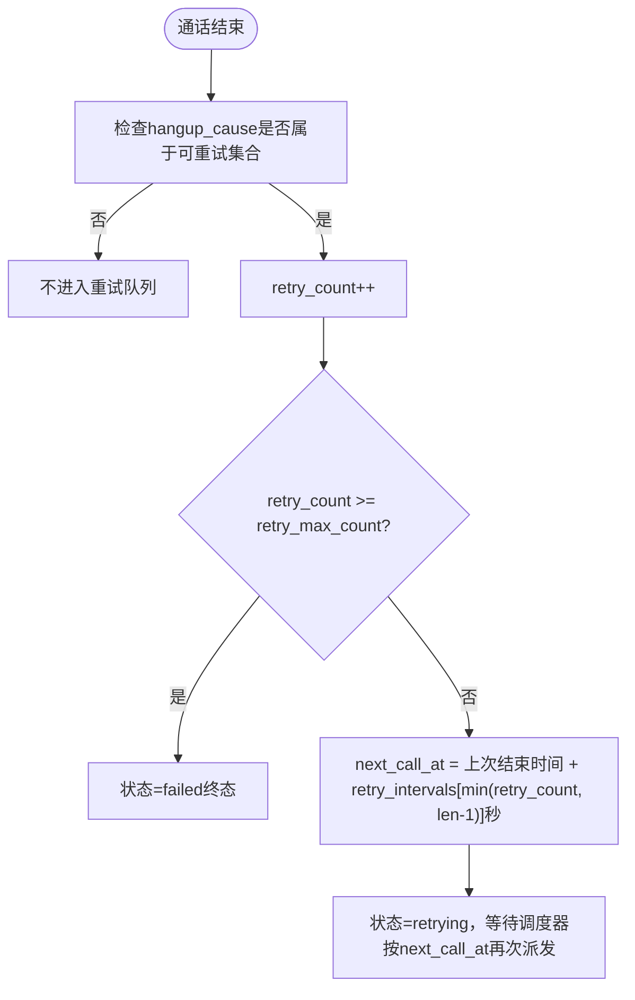
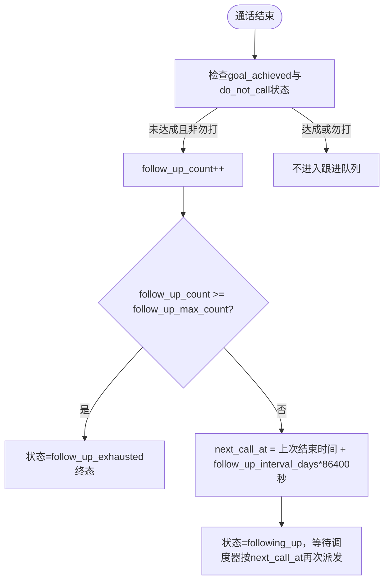
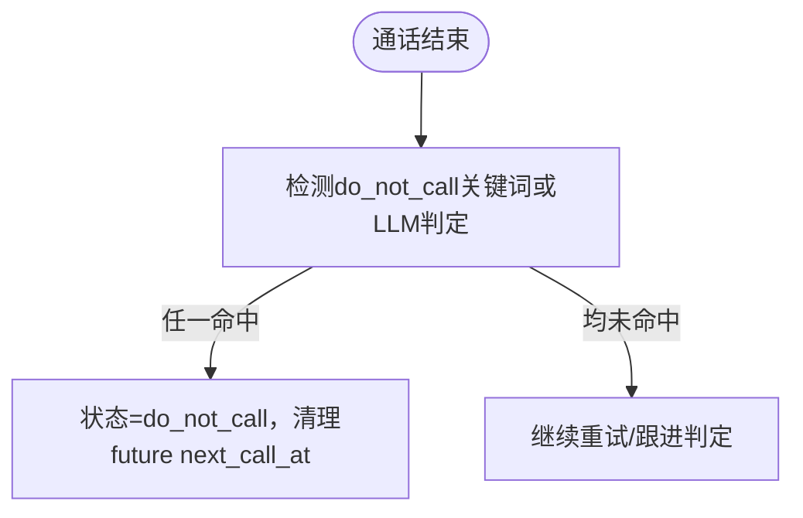
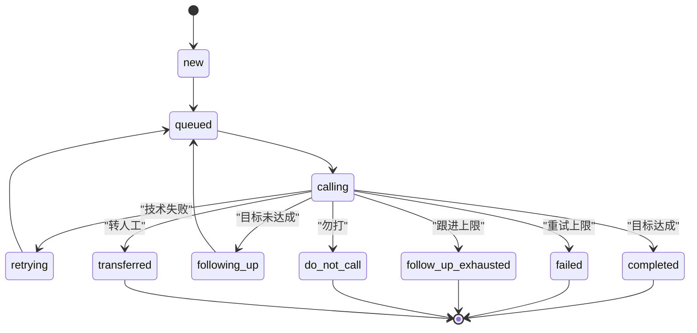
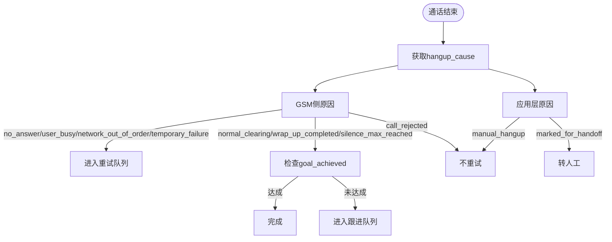
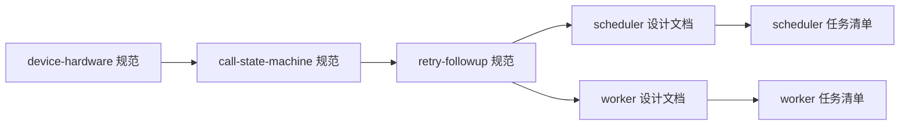

# 重试与跟进策略

<cite>
**本文引用的文件**
- [retry-followup 规范](file://openspec/specs/retry-followup/spec.md)
- [call-state-machine 规范](file://openspec/specs/call-state-machine/spec.md)
- [device-hardware 规范](file://openspec/specs/device-hardware/spec.md)
- [webhook-callback 规范](file://openspec/changes/archive/2026-05-06-impl-worker/specs/webhook-callback/spec.md)
- [worker 设计文档](file://openspec/changes/2026-05-06-impl-worker/design.md)
- [worker 任务清单](file://openspec/changes/2026-05-06-impl-worker/tasks.md)
- [scheduler 设计文档](file://openspec/changes/2026-05-06-impl-scheduler/design.md)
- [scheduler 任务清单](file://openspec/changes/2026-05-06-impl-scheduler/tasks.md)
- [impl-real-at 规范变更](file://openspec/changes/2026-05-17-impl-real-at/specs/call-state-machine/spec.md)
</cite>

## 目录
1. [简介](#简介)
2. [项目结构](#项目结构)
3. [核心组件](#核心组件)
4. [架构总览](#架构总览)
5. [详细组件分析](#详细组件分析)
6. [依赖关系分析](#依赖关系分析)
7. [性能考量](#性能考量)
8. [故障排查指南](#故障排查指南)
9. [结论](#结论)
10. [附录](#附录)

## 简介
本文件面向“重试与跟进策略系统”，系统性阐述调度器如何区分并管理两类机制：
- 重试：针对通话因技术原因未完成的情况，采用指数退避策略进行再次拨打。
- 跟进：针对通话正常结束但目标未达成的情况，采用固定间隔进行二次外呼。

文档还涵盖：
- 两者的概念差异、触发条件、间隔策略与上限处理
- 重试的指数退避算法、跟进的固定间隔机制
- “勿打”识别的双重OR关系
- lead状态机的完整流转
- 各种hangup_cause的分类处理、状态转换规则与异常处理
- 配置示例与最佳实践建议

## 项目结构
本系统相关规范与实现分布在以下位置：
- 规范层：openspec/specs 与 openspec/changes 下的各版本变更
- 实现层：openspec/changes/2026-05-06-impl-worker 与 2026-05-06-impl-scheduler 的设计与任务清单

**图表来源**
- [retry-followup 规范](file://openspec/specs/retry-followup/spec.md)
- [call-state-machine 规范](file://openspec/specs/call-state-machine/spec.md)
- [device-hardware 规范](file://openspec/specs/device-hardware/spec.md)
- [webhook-callback 规范](file://openspec/changes/archive/2026-05-06-impl-worker/specs/webhook-callback/spec.md)
- [worker 设计文档](file://openspec/changes/2026-05-06-impl-worker/design.md)
- [worker 任务清单](file://openspec/changes/2026-05-06-impl-worker/tasks.md)
- [scheduler 设计文档](file://openspec/changes/2026-05-06-impl-scheduler/design.md)
- [scheduler 任务清单](file://openspec/changes/2026-05-06-impl-scheduler/tasks.md)
- [impl-real-at 规范变更](file://openspec/changes/2026-05-17-impl-real-at/specs/call-state-machine/spec.md)

**章节来源**
- [retry-followup 规范](file://openspec/specs/retry-followup/spec.md)
- [worker 设计文档](file://openspec/changes/2026-05-06-impl-worker/design.md)
- [scheduler 设计文档](file://openspec/changes/2026-05-06-impl-scheduler/design.md)

## 核心组件
- 重试与跟进策略规范：定义两类机制的独立性、触发条件、间隔策略、上限与“勿打”识别。
- 调度器（Scheduler）：负责扫描候选线索、检查时间窗口与并发、选号并派发至引擎；仅写入“calling”状态，重试/跟进的next_call_at与状态变更由Worker承担。
- Worker：消费通话结束事件，基于hangup_cause与目标达成情况决定后续状态与下次拨打时间；实现回调重试调度器。
- 状态机（Engine）：定义通话生命周期状态与转换，确保hangup_cause统一来源并透传到END.reason。
- 硬件/驱动（Device/Hardware）：将GSM侧URC翻译为统一hangup_cause，支撑重试与跟进决策。

**章节来源**
- [retry-followup 规范](file://openspec/specs/retry-followup/spec.md)
- [call-state-machine 规范](file://openspec/specs/call-state-machine/spec.md)
- [device-hardware 规范](file://openspec/specs/device-hardware/spec.md)
- [worker 设计文档](file://openspec/changes/2026-05-06-impl-worker/design.md)
- [scheduler 设计文档](file://openspec/changes/2026-05-06-impl-scheduler/design.md)

## 架构总览
系统采用“调度器负责派发，Worker负责写回”的职责分离：
- Scheduler：每分钟主循环扫描候选线索，检查时间窗口与并发，选号并推送DialRequest；成功后仅将lead状态置为“calling”，不写入重试/跟进/终态。
- Worker：消费通话结束事件，综合hangup_cause与目标达成情况，决定lead后续状态与next_call_at；若命中“勿打”，则清理未来调度任务。

**图表来源**
- [scheduler 设计文档](file://openspec/changes/2026-05-06-impl-scheduler/design.md)
- [worker 设计文档](file://openspec/changes/2026-05-06-impl-worker/design.md)
- [retry-followup 规范](file://openspec/specs/retry-followup/spec.md)

## 详细组件分析

### 重试机制（指数退避）
- 触发条件：通话以技术失败结束（hangup_cause ∈ {no_answer, user_busy, network_out_of_order, temporary_failure}）。
- 间隔策略：指数退避数组 + 最大次数。第N次重试间隔 = retry_intervals[N-1]；超出数组长度时使用最后一项。
- 上限处理：重试次数累计达到retry_max_count时，lead状态进入failed（终态）。
- next_call_at计算：使用当前重试次数对应的间隔秒数（数组索引取min(retry_count, len-1)）。

**图表来源**
- [retry-followup 规范](file://openspec/specs/retry-followup/spec.md)
- [worker 任务清单](file://openspec/changes/2026-05-06-impl-worker/tasks.md)

**章节来源**
- [retry-followup 规范](file://openspec/specs/retry-followup/spec.md)
- [worker 任务清单](file://openspec/changes/2026-05-06-impl-worker/tasks.md)

### 跟进机制（固定间隔）
- 触发条件：通话正常结束（hangup_cause ∈ {normal_clearing, wrap_up_completed, silence_max_reached}）且call_summary.goal_achieved=false且lead.status≠do_not_call。
- 间隔策略：固定间隔。每次跟进时间 = 上一次通话结束时间 + N × follow_up_interval_days。
- 上限处理：跟进次数达到follow_up_max_count时，lead状态进入follow_up_exhausted（终态）。
- next_call_at计算：使用固定天数间隔（follow_up_interval_days × 86400秒）。

**图表来源**
- [retry-followup 规范](file://openspec/specs/retry-followup/spec.md)
- [worker 任务清单](file://openspec/changes/2026-05-06-impl-worker/tasks.md)

**章节来源**
- [retry-followup 规范](file://openspec/specs/retry-followup/spec.md)
- [worker 任务清单](file://openspec/changes/2026-05-06-impl-worker/tasks.md)

### “勿打”识别（双重OR关系）
- 两种识别机制：关键词命中 + 独立LLM判定；任一命中即标记lead.status=do_not_call并清理未来调度任务。
- 标记后的处理：Worker将lead状态置为do_not_call，移除该lead所有未来重试与跟进任务；可触发do_not_call_marked事件通知CRM。

**图表来源**
- [retry-followup 规范](file://openspec/specs/retry-followup/spec.md)
- [worker 任务清单](file://openspec/changes/2026-05-06-impl-worker/tasks.md)

**章节来源**
- [retry-followup 规范](file://openspec/specs/retry-followup/spec.md)
- [worker 任务清单](file://openspec/changes/2026-05-06-impl-worker/tasks.md)

### lead状态机与流转
- 状态集合：new → queued → calling → retrying → queued（重试）；或 calling → completed（达成）；或 calling → following_up → queued（跟进）；或 calling → failed（重试上限）；或 calling → follow_up_exhausted（跟进上限）；或 calling → do_not_call（勿打）；或 calling → transferred（转人工）。
- 终态：completed / failed / follow_up_exhausted / do_not_call / transferred。
- 终态不再被调度器扫描；调度器仅在派发成功后写入“calling”，其余状态写回由Worker承担。

**图表来源**
- [retry-followup 规范](file://openspec/specs/retry-followup/spec.md)

**章节来源**
- [retry-followup 规范](file://openspec/specs/retry-followup/spec.md)

### hangup_cause分类与状态转换规则
- 统一来源：所有模块的hangup_cause取值来自isales_common.enums.HangupCause枚举，禁止自定义平行词汇表。
- GSM侧枚举：no_answer / user_busy / network_out_of_order / temporary_failure / normal_clearing / call_rejected / user_hangup
- 应用层枚举：wrap_up_completed / silence_max_reached / marked_for_handoff / no_progress_timeout / manual_hangup
- manual_hangup不进入重试逻辑；call_rejected不进入重试队列（视为用户明确拒绝）。
- 状态机将远端hangup_cause透传到END.reason，避免笼统映射为user_hangup。

**图表来源**
- [call-state-machine 规范](file://openspec/specs/call-state-machine/spec.md)
- [device-hardware 规范](file://openspec/specs/device-hardware/spec.md)
- [impl-real-at 规范变更](file://openspec/changes/2026-05-17-impl-real-at/specs/call-state-machine/spec.md)

**章节来源**
- [call-state-machine 规范](file://openspec/specs/call-state-machine/spec.md)
- [device-hardware 规范](file://openspec/specs/device-hardware/spec.md)
- [impl-real-at 规范变更](file://openspec/changes/2026-05-17-impl-real-at/specs/call-state-machine/spec.md)

### 回调重试调度器（补充说明）
- 策略：指数退避 + 最大次数；失败时按策略重试，达到max_attempts置exhausted。
- 复用request_body：重试时直接复用上次已存的request_body，避免触发条件随lead状态变化而改变。
- 独立task：每分钟扫描pending_retry且next_retry_at<=now的任务，按next_retry_at升序取一批重试。

**章节来源**
- [webhook-callback 规范](file://openspec/changes/archive/2026-05-06-impl-worker/specs/webhook-callback/spec.md)
- [worker 设计文档](file://openspec/changes/2026-05-06-impl-worker/design.md)

## 依赖关系分析
- 调度器与Worker的职责边界：调度器仅写入“calling”，其余状态写回由Worker承担，避免竞态。
- 状态机与hangup_cause：状态机将远端hangup_cause透传到END.reason，确保决策一致性。
- 硬件/驱动：将GSM侧URC翻译为统一hangup_cause，支撑重试与跟进决策。

**图表来源**
- [device-hardware 规范](file://openspec/specs/device-hardware/spec.md)
- [call-state-machine 规范](file://openspec/specs/call-state-machine/spec.md)
- [retry-followup 规范](file://openspec/specs/retry-followup/spec.md)
- [scheduler 设计文档](file://openspec/changes/2026-05-06-impl-scheduler/design.md)
- [worker 设计文档](file://openspec/changes/2026-05-06-impl-worker/design.md)

**章节来源**
- [retry-followup 规范](file://openspec/specs/retry-followup/spec.md)
- [call-state-machine 规范](file://openspec/specs/call-state-machine/spec.md)
- [device-hardware 规范](file://openspec/specs/device-hardware/spec.md)
- [scheduler 设计文档](file://openspec/changes/2026-05-06-impl-scheduler/design.md)
- [worker 设计文档](file://openspec/changes/2026-05-06-impl-worker/design.md)

## 性能考量
- 调度器每分钟主循环：扫描候选线索、检查时间窗口与并发、选号并推送DialRequest；成功后仅写入“calling”，避免重复派发。
- Worker写回采用行级守卫（UPDATE ... WHERE id=... AND status='calling'），防止竞态；若0行受影响则记录WARN日志。
- 回调重试调度器独立task，周期性扫描pending_retry任务，避免阻塞主线程。
- 并发控制：全局并发计数器原子INCR/DECR，失败时回滚并跳过该线索。

**章节来源**
- [scheduler 设计文档](file://openspec/changes/2026-05-06-impl-scheduler/design.md)
- [worker 设计文档](file://openspec/changes/2026-05-06-impl-worker/design.md)
- [worker 任务清单](file://openspec/changes/2026-05-06-impl-worker/tasks.md)

## 故障排查指南
- 调度器派发失败：检查时间窗口、并发计数器、选号接口、DialRequest构造与LPUSH；失败时DECR回滚并发并保持lead状态不变。
- Worker写回失败：确认行级守卫是否生效（status='calling'）；若0行受影响，检查是否scheduler尚未派发或已被其他worker写过。
- hangup_cause不一致：确保所有模块使用统一的isales_common.enums.HangupCause枚举；manual_hangup不应进入重试逻辑。
- “勿打”未生效：检查关键词命中与独立LLM判定是否开启；确认标记后清理了future next_call_at。
- 回调重试异常：确认retry_policy配置正确；检查是否达到max_attempts导致exhausted；确保复用request_body避免语义漂移。

**章节来源**
- [scheduler 任务清单](file://openspec/changes/2026-05-06-impl-scheduler/tasks.md)
- [worker 任务清单](file://openspec/changes/2026-05-06-impl-worker/tasks.md)
- [call-state-machine 规范](file://openspec/specs/call-state-machine/spec.md)
- [retry-followup 规范](file://openspec/specs/retry-followup/spec.md)
- [webhook-callback 规范](file://openspec/changes/archive/2026-05-06-impl-worker/specs/webhook-callback/spec.md)

## 结论
本系统通过清晰的职责划分与严格的规范约束，实现了重试与跟进两大机制的独立管理：
- 重试采用指数退避，保障技术失败场景下的高效恢复；
- 跟进采用固定间隔，聚焦目标未达成场景的持续跟进；
- “勿打”识别采用双重OR关系，确保合规与用户体验；
- 状态机与hangup_cause统一来源，消除歧义；
- 调度器与Worker的边界清晰，避免竞态与重复派发。

## 附录

### 配置示例与最佳实践
- 重试配置
  - retry_intervals：例如[60, 240, 1440]（单位：分钟），表示第1、2、3次分别间隔60、240、1440分钟，第4次及以后沿用1440分钟。
  - retry_max_count：例如3，达到后进入failed终态。
- 跟进配置
  - follow_up_interval_days：例如3，表示每次跟进间隔3天。
  - follow_up_max_count：例如2，达到后进入follow_up_exhausted终态。
- “勿打”配置
  - do_not_call_keywords：例如["不要打","别打","勿打"]。
  - do_not_call_llm_enabled：启用独立LLM判定时设置为true。
- 最佳实践
  - 重试与跟进的间隔数组应结合业务SLA与客户体验权衡，避免过于频繁打扰。
  - “勿打”关键词与LLM判定应定期校准，减少误判。
  - 调度器与Worker的边界必须严格执行，避免竞态与重复派发。
  - hangup_cause必须统一使用isales_common.enums.HangupCause枚举，确保跨模块一致性。

**章节来源**
- [retry-followup 规范](file://openspec/specs/retry-followup/spec.md)
- [worker 任务清单](file://openspec/changes/2026-05-06-impl-worker/tasks.md)
- [scheduler 任务清单](file://openspec/changes/2026-05-06-impl-scheduler/tasks.md)