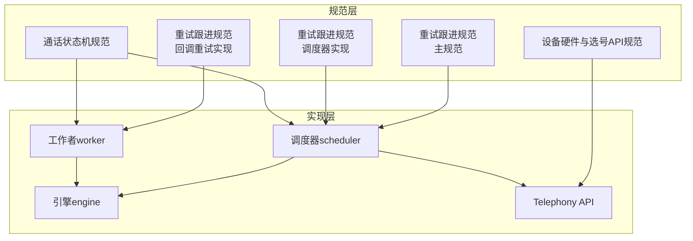
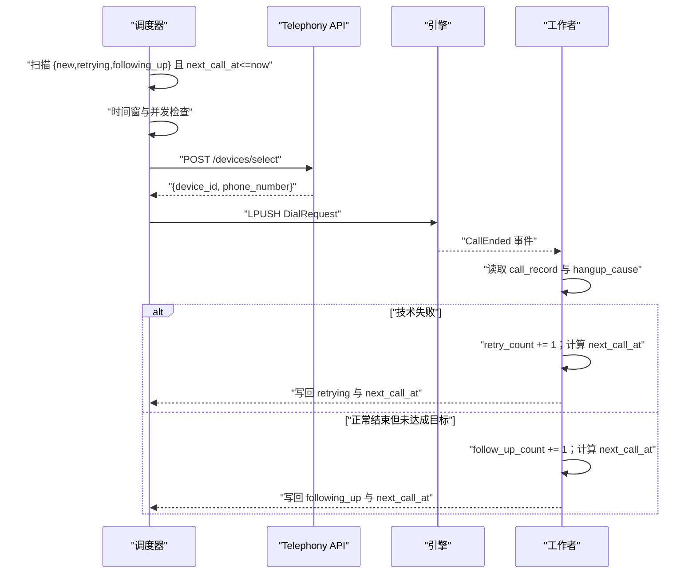
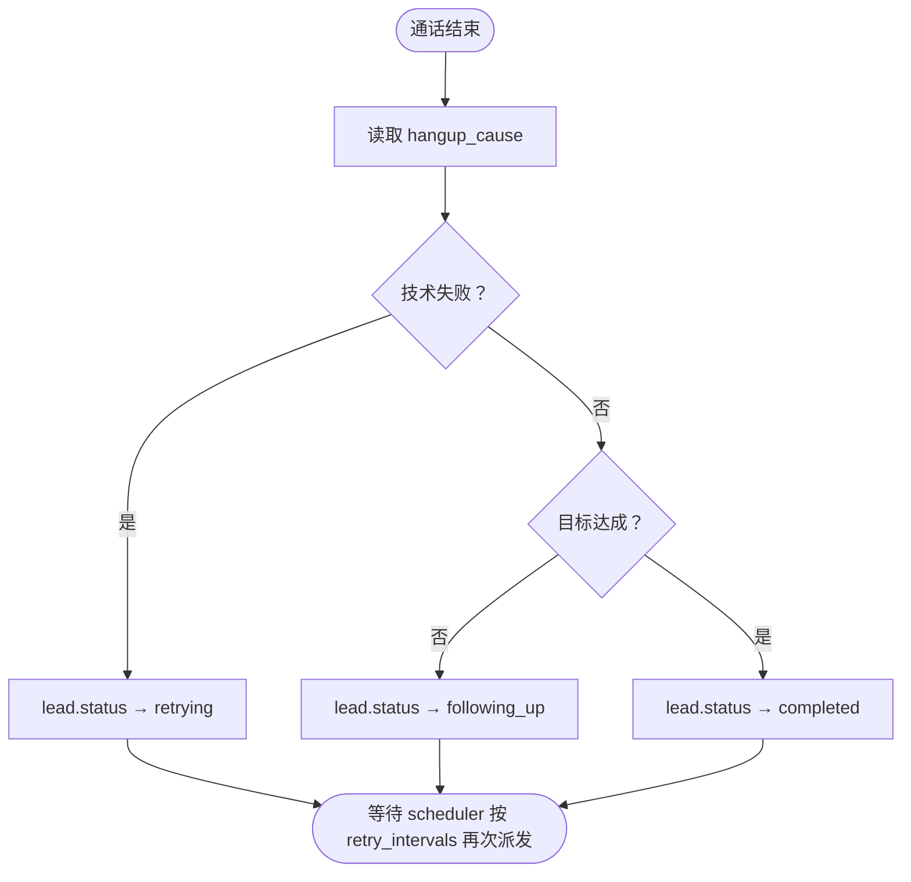
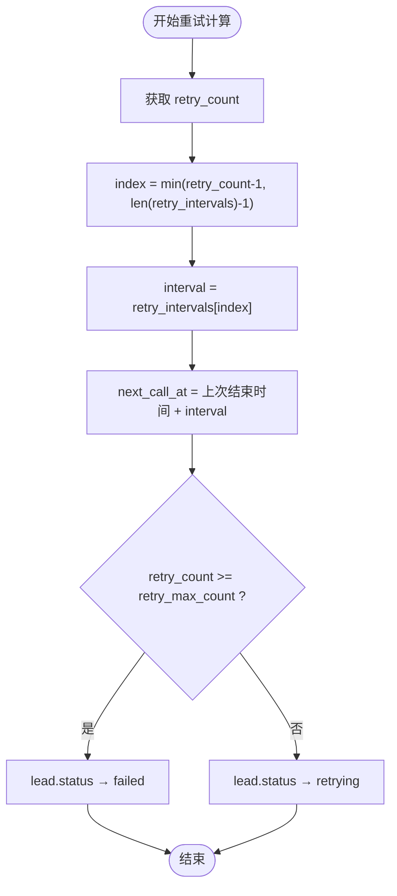
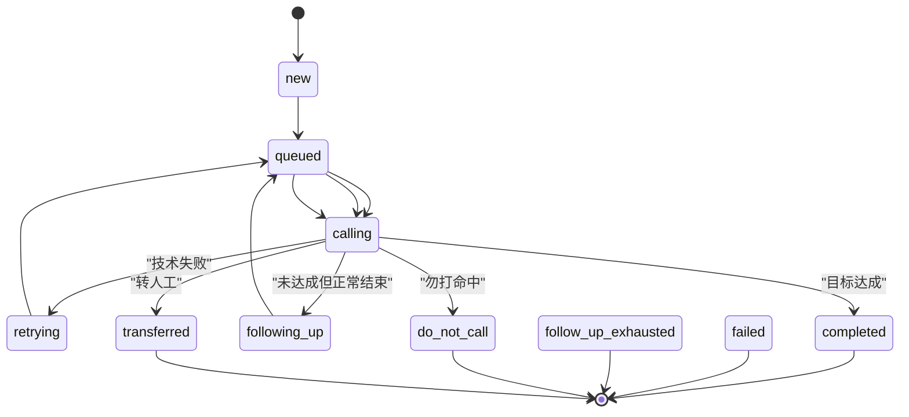
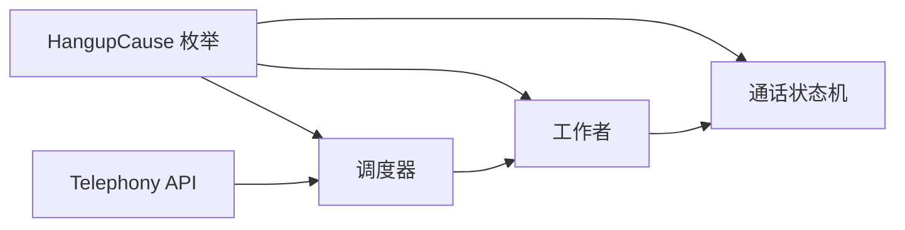

# 重试机制

<cite>
**本文引用的文件**
- [重试跟进规范（主规范）](file://openspec/specs/retry-followup/spec.md)
- [重试跟进规范（变更归档-调度器实现）](file://openspec/changes/archive/2026-05-06-impl-scheduler/specs/retry-followup/spec.md)
- [重试跟进规范（变更归档-回调重试实现）](file://openspec/changes/archive/2026-05-06-impl-worker/specs/webhook-callback/spec.md)
- [调度器设计（并发与时间窗）](file://openspec/changes/archive/2026-05-06-impl-scheduler/design.md)
- [调度器提案（调度循环与边界）](file://openspec/changes/archive/2026-05-06-impl-scheduler/proposal.md)
- [调度器任务清单（调度循环与边界）](file://openspec/changes/archive/2026-05-06-impl-scheduler/tasks.md)
- [通话状态机规范（hangup_cause 枚举与单一来源）](file://openspec/specs/call-state-machine/spec.md)
- [通话状态机规范（变更归档-真实AT实现）](file://openspec/changes/archive/2026-05-17-impl-real-at/specs/call-state-machine/spec.md)
- [设备硬件与选号API规范](file://openspec/specs/device-hardware/spec.md)
- [设备硬件规范（变更归档-真实AT实现）](file://openspec/changes/archive/2026-05-17-impl-real-at/specs/device-hardware/spec.md)
- [重试调度器实现要点（回调重试）](file://openspec/changes/archive/2026-05-06-impl-worker/design.md)
- [重试调度器任务清单（回调重试）](file://openspec/changes/archive/2026-05-06-impl-worker/tasks.md)
</cite>

## 目录
1. [简介](#简介)
2. [项目结构](#项目结构)
3. [核心组件](#核心组件)
4. [架构总览](#架构总览)
5. [详细组件分析](#详细组件分析)
6. [依赖关系分析](#依赖关系分析)
7. [性能考虑](#性能考虑)
8. [故障排查指南](#故障排查指南)
9. [结论](#结论)
10. [附录](#附录)

## 简介
本文件系统化阐述 isales 项目的重试机制，涵盖以下关键主题：
- 重试触发条件与 hangup_cause 分类处理（no_answer、user_busy、network_out_of_order、temporary_failure）
- 指数退避算法的数学原理与实现细节
- retry_intervals 配置格式与约束
- retry_max_count 的上限控制机制
- 具体配置示例与第 N 次重试间隔计算过程
- 重试次数累计与状态转换规则
- 异常情况处理、性能优化建议与最佳实践

## 项目结构
重试机制相关的内容主要分布在以下位置：
- 主规范与变更归档：openspec/specs 与 openspec/changes/archive/*/specs
- 调度器与回调重试的实现细节：design.md、tasks.md
- 通话状态机与 hangup_cause 的统一枚举：call-state-machine
- 设备硬件与选号 API：device-hardware

**图表来源**
- [重试跟进规范（主规范）:1-176](file://openspec/specs/retry-followup/spec.md#L1-L176)
- [重试跟进规范（变更归档-调度器实现）:1-176](file://openspec/changes/archive/2026-05-06-impl-scheduler/specs/retry-followup/spec.md#L1-L176)
- [重试跟进规范（变更归档-回调重试实现）:1-36](file://openspec/changes/archive/2026-05-06-impl-worker/specs/webhook-callback/spec.md#L1-L36)
- [通话状态机规范（主规范）:160-190](file://openspec/specs/call-state-machine/spec.md#L160-L190)
- [设备硬件与选号API规范:171-193](file://openspec/specs/device-hardware/spec.md#L171-L193)

**章节来源**
- [重试跟进规范（主规范）:1-176](file://openspec/specs/retry-followup/spec.md#L1-L176)
- [调度器设计（并发与时间窗）:35-85](file://openspec/changes/archive/2026-05-06-impl-scheduler/design.md#L35-L85)

## 核心组件
- 重试触发条件与 hangup_cause 分类
  - 技术失败导致的通话未完成：no_answer、user_busy、network_out_of_order、temporary_failure
  - 触发 lead 状态从 new/retrying/following_up → retrying，并由 scheduler 按 campaign.retry_intervals 排队再次拨打
- 指数退避与上限控制
  - 第 N 次重试间隔 = retry_intervals[N-1]；超出数组长度时沿用最后一项
  - 重试次数累计达到 retry_max_count 时，lead 状态进入 failed（终态）
- 调度边界与状态写入契约
  - scheduler 仅负责派发（new/retrying/following_up → calling），不写终态或计算 next_call_at（除窗外重排）
  - worker 负责根据 hangup_cause 与目标达成情况写回后续状态与 next_call_at

**章节来源**
- [重试跟进规范（主规范）:9-37](file://openspec/specs/retry-followup/spec.md#L9-L37)
- [重试跟进规范（主规范）:120-159](file://openspec/specs/retry-followup/spec.md#L120-L159)
- [通话状态机规范（主规范）:174-186](file://openspec/specs/call-state-machine/spec.md#L174-L186)

## 架构总览
重试机制涉及调度器、工作者、引擎与 Telephony API 的协同：
- 调度器扫描符合条件的 lead，进行时间窗与并发检查，选号并派发 DialRequest
- 引擎执行拨号，通话结束后产生 call_record 与 hangup_cause
- 工作者根据 hangup_cause 与目标达成情况决定是否重试或跟进，并写回 lead 状态与下次拨打时间
- Telephony API 提供选号服务，确保设备可用与负载均衡

**图表来源**
- [调度器提案（调度循环与边界）:18-33](file://openspec/changes/archive/2026-05-06-impl-scheduler/proposal.md#L18-L33)
- [调度器任务清单（调度循环与边界）:25-38](file://openspec/changes/archive/2026-05-06-impl-scheduler/tasks.md#L25-L38)
- [重试跟进规范（主规范）:120-159](file://openspec/specs/retry-followup/spec.md#L120-L159)

## 详细组件分析

### hangup_cause 分类与触发条件
- 技术失败类别：no_answer、user_busy、network_out_of_order、temporary_failure
- 通话正常结束但未达成目标：normal_clearing、wrap_up_completed、silence_max_reached（结合目标达成标志）
- 明确拒绝：call_rejected（不进入重试队列）
- 主动挂断：manual_hangup（不进入重试队列）

**图表来源**
- [重试跟进规范（主规范）:9-22](file://openspec/specs/retry-followup/spec.md#L9-L22)
- [通话状态机规范（主规范）:174-186](file://openspec/specs/call-state-machine/spec.md#L174-L186)

**章节来源**
- [重试跟进规范（主规范）:9-22](file://openspec/specs/retry-followup/spec.md#L9-L22)
- [通话状态机规范（主规范）:174-186](file://openspec/specs/call-state-machine/spec.md#L174-L186)

### 指数退避算法与实现细节
- 数学原理
  - 第 N 次重试间隔 = retry_intervals[N-1]
  - 当 N 超过数组长度时，沿用最后一项（即固定最大间隔）
- 实现要点
  - retry_count 由工作者在每次重试时自增
  - next_call_at = 上次通话结束时间 + 当前间隔
  - 超过 retry_max_count 后进入 failed（终态）

**图表来源**
- [重试跟进规范（主规范）:24-37](file://openspec/specs/retry-followup/spec.md#L24-L37)

**章节来源**
- [重试跟进规范（主规范）:24-37](file://openspec/specs/retry-followup/spec.md#L24-L37)

### retry_intervals 配置格式与约束
- 格式：JSONB 数组，元素为正整数（单位：分钟）
- 约束：
  - 数组长度决定前几次重试的间隔
  - 超出数组长度后沿用最后一项
  - 建议采用指数增长序列以提升成功率并控制峰值压力

**章节来源**
- [重试跟进规范（主规范）:24-31](file://openspec/specs/retry-followup/spec.md#L24-L31)
- [重试跟进规范（主规范）:160-165](file://openspec/specs/retry-followup/spec.md#L160-L165)

### retry_max_count 上限控制机制
- 达到上限后 lead 状态进入 failed（终态），不再排队
- 该上限用于防止无限重试，保护系统资源

**章节来源**
- [重试跟进规范（主规范）:33-37](file://openspec/specs/retry-followup/spec.md#L33-L37)

### 具体配置示例与第 N 次重试间隔计算
- 示例：retry_intervals = [60, 240, 1440]（分钟）
- 第 4 次重试：index = min(4-1, 3-1) = 2，interval = 1440 分钟
- next_call_at = 上次通话结束时间 + 1440 分钟

**章节来源**
- [重试跟进规范（主规范）:28-31](file://openspec/specs/retry-followup/spec.md#L28-L31)

### 重试次数累计与状态转换规则
- 累计规则
  - 每次因技术失败进入 retrying 时，retry_count 自增
  - 达到上限后直接进入 failed
- 状态机规则
  - new/retrying/following_up → calling（调度器派发）
  - calling → completed/failed/following_up/do_not_call/transferred（工作者写回）
  - 终态包括：completed、failed、follow_up_exhausted、do_not_call、transferred

**图表来源**
- [重试跟进规范（主规范）:90-112](file://openspec/specs/retry-followup/spec.md#L90-L112)

**章节来源**
- [重试跟进规范（主规范）:90-112](file://openspec/specs/retry-followup/spec.md#L90-L112)

### 异常情况处理
- 4xx 错误：不触发重试，直接置为 failed_http_4xx
- 5xx/超时/连接失败：触发重试，retry_count 自增，next_retry_at = now + 当前间隔；达到 max_attempts 后置为 exhausted
- 重试调度器需复用上次已存的 request_body，避免因 lead 状态变化导致 payload 与“原触发时刻”不一致

**章节来源**
- [重试跟进规范（变更归档-回调重试实现）:17-36](file://openspec/changes/archive/2026-05-06-impl-worker/specs/webhook-callback/spec.md#L17-L36)
- [重试调度器实现要点（回调重试）:98-104](file://openspec/changes/archive/2026-05-06-impl-worker/design.md#L98-L104)
- [重试调度器任务清单（回调重试）:42-49](file://openspec/changes/archive/2026-05-06-impl-worker/tasks.md#L42-L49)

### 性能优化建议
- 指数退避序列设计：避免过长的初始间隔，平衡成功率与等待时间
- 并发控制：利用全局并发计数器限制同时拨打电话数量，避免系统过载
- 时间窗与节假日：合理配置 time_windows 与节假日列表，减少无效拨打电话
- 选号策略：Telephony API 采用负载均衡策略，优先选择最近一次通话最久远的设备

**章节来源**
- [调度器设计（并发与时间窗）:35-85](file://openspec/changes/archive/2026-05-06-impl-scheduler/design.md#L35-L85)
- [设备硬件与选号API规范:180-193](file://openspec/specs/device-hardware/spec.md#L180-L193)

### 最佳实践
- hangup_cause 统一来源于单一枚举，避免模块间词汇表不一致
- 调度器与工作者的状态写入边界清晰：调度器仅派发，工作者负责状态与时间计算
- 重试策略与上限配置应结合业务 SLA 与系统承载能力制定
- 对于“勿打”识别，建议同时启用关键词命中与独立 LLM 判定，任一命中即标记并清理未来调度任务

**章节来源**
- [通话状态机规范（主规范）:174-186](file://openspec/specs/call-state-machine/spec.md#L174-L186)
- [重试跟进规范（主规范）:71-89](file://openspec/specs/retry-followup/spec.md#L71-L89)

## 依赖关系分析
- hangup_cause 的统一枚举确保调度器、工作者与状态机之间的一致性
- 调度器依赖 Telephony API 的选号接口，保障设备可用性与负载均衡
- 工作者依赖 call_record 中的 hangup_cause 与目标达成标志，决定后续状态与时间

**图表来源**
- [通话状态机规范（主规范）:174-186](file://openspec/specs/call-state-machine/spec.md#L174-L186)
- [设备硬件与选号API规范:171-193](file://openspec/specs/device-hardware/spec.md#L171-L193)

**章节来源**
- [通话状态机规范（主规范）:174-186](file://openspec/specs/call-state-machine/spec.md#L174-L186)
- [设备硬件与选号API规范:171-193](file://openspec/specs/device-hardware/spec.md#L171-L193)

## 性能考虑
- 指数退避有助于缓解网络拥塞，提高整体成功率
- 并发上限与时间窗控制可避免系统抖动与资源争用
- 选号接口的负载均衡策略减少热点设备的压力

## 故障排查指南
- 重试未生效
  - 检查 hangup_cause 是否属于技术失败类别
  - 确认 retry_count 与 retry_max_count 的配置
- 重试间隔异常
  - 核对 retry_intervals 数组索引与长度
  - 确认第 N 次重试是否超出数组长度并沿用最后一项
- 状态未正确转换
  - 确认调度器仅写入 calling，后续状态由工作者写回
  - 检查终端态（failed、follow_up_exhausted、do_not_call、transferred）是否阻止调度器再次扫描

**章节来源**
- [重试跟进规范（主规范）:114-159](file://openspec/specs/retry-followup/spec.md#L114-L159)
- [重试调度器任务清单（回调重试）:42-49](file://openspec/changes/archive/2026-05-06-impl-worker/tasks.md#L42-L49)

## 结论
本重试机制通过统一的 hangup_cause 枚举、明确的触发条件、指数退避与上限控制，以及清晰的调度与工作者职责边界，实现了稳定、可控且可扩展的自动重试能力。配合时间窗、并发控制与选号策略，可在保证业务质量的同时有效保护系统资源。

## 附录
- 配置字段参考
  - campaign.retry_intervals：JSONB 数组（分钟）
  - campaign.retry_max_count：整数
  - campaign.follow_up_interval_days：整数（天）
  - campaign.follow_up_max_count：整数
  - lead.retry_count：整数
  - lead.follow_up_count：整数
  - lead.next_call_at：时间戳
  - lead.last_hangup_cause：字符串
  - lead.status：枚举（new/queued/calling/retrying/following_up/completed/failed/follow_up_exhausted/do_not_call/transferred）

**章节来源**
- [重试跟进规范（主规范）:160-176](file://openspec/specs/retry-followup/spec.md#L160-L176)