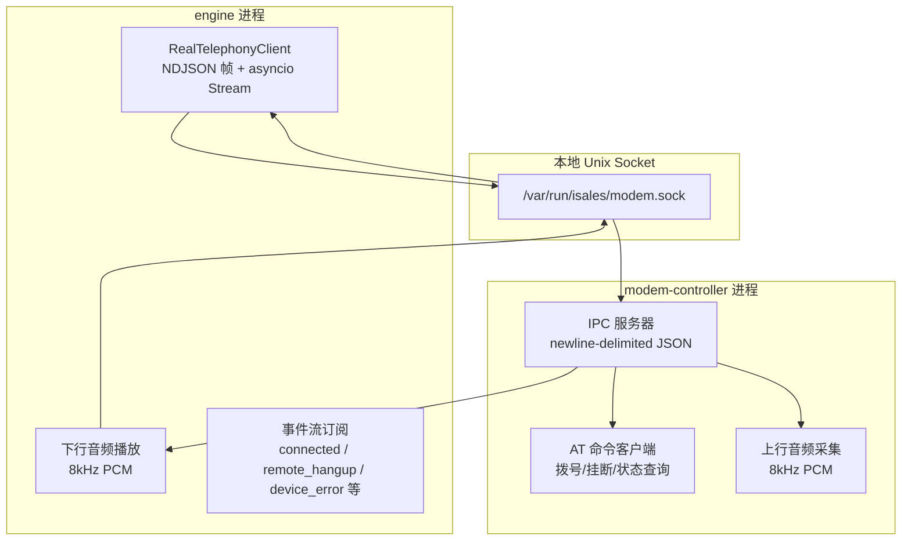
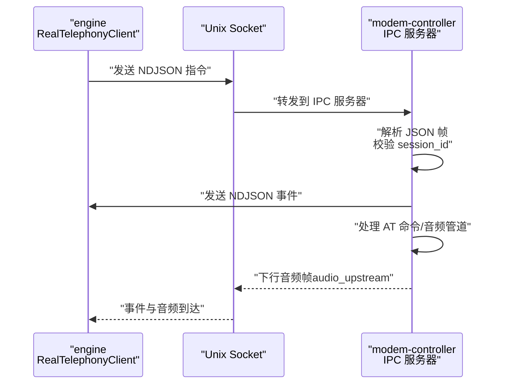
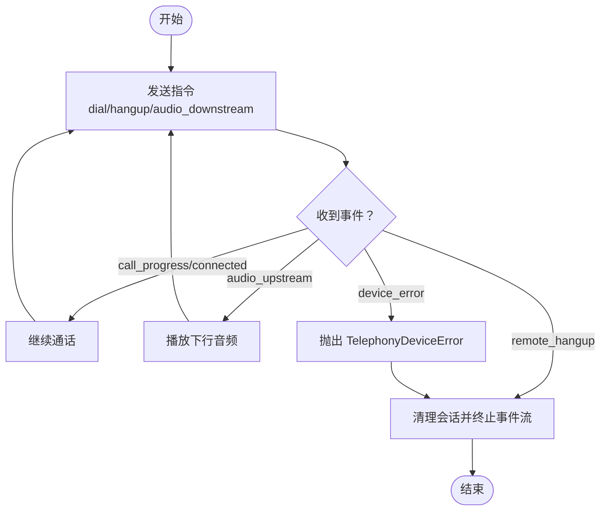

# IPC 通信协议

<cite>
**本文档引用的文件**
- [device-hardware 规格（变更归档）](file://openspec/changes/archive/2026-05-09-prep-stage8-cleanup/specs/device-hardware/spec.md)
- [IPC 帧格式（变更归档）](file://openspec/changes/archive/2026-05-06-impl-telephony/specs/device-hardware/spec.md)
- [调制解调器控制器实现提案（变更归档）](file://openspec/changes/archive/2026-05-09-impl-modem-controller/proposal.md)
- [调制解调器控制器实现任务（变更归档）](file://openspec/changes/archive/2026-05-09-impl-modem-controller/tasks.md)
- [设备硬件规格（最新）](file://openspec/specs/device-hardware/spec.md)
</cite>

## 目录
1. [简介](#简介)
2. [项目结构](#项目结构)
3. [核心组件](#核心组件)
4. [架构总览](#架构总览)
5. [详细组件分析](#详细组件分析)
6. [依赖关系分析](#依赖关系分析)
7. [性能考虑](#性能考虑)
8. [故障排查指南](#故障排查指南)
9. [结论](#结论)
10. [附录](#附录)

## 简介
本文件面向 engine ↔ modem-controller 之间的本地 Unix socket IPC 通信协议，提供从消息格式、事件类型、数据传输机制到错误处理与连接管理的完整技术说明。协议采用 newline-delimited JSON 帧格式，支持双向独立流，指令与事件严格区分，并通过 session_id 实现会话关联与追踪。

## 项目结构
- 协议定义与规范位于 openspec 目录，包含设备硬件规格与变更归档中的 IPC 要求。
- 调制解调器控制器实现提案与任务文档描述了 engine 侧 RealTelephonyClient 的连接、消息编解码与音频处理流程。
- 本协议文档基于上述规范与实现说明进行系统化整理与可视化呈现。

图表来源
- [调制解调器控制器实现提案（变更归档）](file://openspec/changes/archive/2026-05-09-impl-modem-controller/proposal.md#L11)
- [调制解调器控制器实现任务（变更归档）:73-76](file://openspec/changes/archive/2026-05-09-impl-modem-controller/tasks.md#L73-L76)

章节来源
- [调制解调器控制器实现提案（变更归档）](file://openspec/changes/archive/2026-05-09-impl-modem-controller/proposal.md#L11)
- [调制解调器控制器实现任务（变更归档）:73-76](file://openspec/changes/archive/2026-05-09-impl-modem-controller/tasks.md#L73-L76)

## 核心组件
- 指令端（engine → modem-controller）
  - dial：发起拨号，携带设备标识与号码，以及 session_id。
  - hangup：主动挂断。
  - audio_downstream：推送下行音频 PCM 帧（base64 编码）。
- 事件端（modem-controller → engine）
  - call_progress：通话进度事件，包含状态（如 ringing）。
  - connected：通话已接通。
  - audio_upstream：上报上行音频 PCM 帧（base64 编码）。
  - remote_hangup：远端挂断，包含原因。
  - device_error：设备错误，包含错误码。
- 会话管理
  - session_id 由调用方（engine）提供，事件帧仅暴露该字段，不暴露内部生成的 UUID。
  - 若调用方省略 session_id，modem-controller 可使用内部生成的 UUID 回填至后续事件帧，但不得单独暴露为 call_id。

章节来源
- [设备硬件规格（变更归档）:10-27](file://openspec/changes/archive/2026-05-09-prep-stage8-cleanup/specs/device-hardware/spec.md#L10-L27)
- [设备硬件规格（最新）:110-130](file://openspec/specs/device-hardware/spec.md#L110-L130)
- [IPC 帧格式（变更归档）:1-26](file://openspec/changes/archive/2026-05-06-impl-telephony/specs/device-hardware/spec.md#L1-L26)

## 架构总览
- 通信通道：本地 Unix socket（单主机部署）。
- 消息格式：newline-delimited JSON 帧，每条消息以换行结尾，单条消息内不允许出现裸换行。
- 传输模型：双向独立异步 Stream（asyncio），消息不互相阻塞，不假设严格的请求/响应配对。
- 音频流：v1 版本音频与控制消息在同一 socket 传输；未来可演进为独立流通道以降低 JSON 编解码开销。

图表来源
- [IPC 帧格式（变更归档）:5-26](file://openspec/changes/archive/2026-05-06-impl-telephony/specs/device-hardware/spec.md#L5-L26)
- [调制解调器控制器实现任务（变更归档）:73-76](file://openspec/changes/archive/2026-05-09-impl-modem-controller/tasks.md#L73-L76)

章节来源
- [IPC 帧格式（变更归档）:5-26](file://openspec/changes/archive/2026-05-06-impl-telephony/specs/device-hardware/spec.md#L5-L26)
- [调制解调器控制器实现提案（变更归档）](file://openspec/changes/archive/2026-05-09-impl-modem-controller/proposal.md#L11)

## 详细组件分析

### 指令格式（engine → modem-controller）
- dial
  - 字段：cmd=dial、device_id、number、session_id。
  - 语义：发起拨号，等待 connected 或 hangup 事件。
- hangup
  - 字段：cmd=hangup、session_id。
  - 语义：主动挂断通话。
- audio_downstream
  - 字段：cmd=audio_downstream、session_id、pcm_chunk（base64）。
  - 语义：推送下行音频帧，调用方保证 50ms 节奏。

章节来源
- [设备硬件规格（变更归档）:10-15](file://openspec/changes/archive/2026-05-09-prep-stage8-cleanup/specs/device-hardware/spec.md#L10-L15)
- [设备硬件规格（最新）:110-118](file://openspec/specs/device-hardware/spec.md#L110-L118)
- [调制解调器控制器实现任务（变更归档）:74-76](file://openspec/changes/archive/2026-05-09-impl-modem-controller/tasks.md#L74-L76)

### 事件格式（modem-controller → engine）
- call_progress
  - 字段：event=call_progress、session_id、state。
  - 语义：通话进度更新（如 ringing）。
- connected
  - 字段：event=connected、session_id。
  - 语义：通话已接通。
- audio_upstream
  - 字段：event=audio_upstream、session_id、pcm_chunk（base64）。
  - 语义：上报上行音频帧。
- remote_hangup
  - 字段：event=remote_hangup、session_id、cause。
  - 语义：远端挂断及原因。
- device_error
  - 字段：event=device_error、session_id、code。
  - 语义：设备错误及错误码。

章节来源
- [设备硬件规格（变更归档）:17-27](file://openspec/changes/archive/2026-05-09-prep-stage8-cleanup/specs/device-hardware/spec.md#L17-L27)
- [设备硬件规格（最新）:120-130](file://openspec/specs/device-hardware/spec.md#L120-L130)

### 消息分帧与大小限制
- newline-delimited JSON：每条消息以换行结尾；消息内字符串字段若含换行需按 JSON 标准转义为 \\n。
- 不完整帧处理：接收方读到 EOF 但缓冲区存在未结束数据（无 \n）时，视为协议错误，关闭连接并告警。
- 单条消息大小上限：≤ 1 MiB；超限发送方拒绝发送、接收方关闭连接并告警。

章节来源
- [IPC 帧格式（变更归档）:7-21](file://openspec/changes/archive/2026-05-06-impl-telephony/specs/device-hardware/spec.md#L7-L21)

### 双向独立流与会话管理
- 双向独立异步 Stream：engine 与 modem-controller 同时读写，消息不互相阻塞；不假设严格的请求/响应配对。
- session_id 管理：由调用方（engine）提供；事件帧仅暴露 session_id，不暴露内部生成的 UUID；若省略，modem-controller 可用内部 UUID 回填后续事件帧，但不得单独暴露为 call_id。

章节来源
- [IPC 帧格式（变更归档）:22-26](file://openspec/changes/archive/2026-05-06-impl-telephony/specs/device-hardware/spec.md#L22-L26)
- [设备硬件规格（变更归档）:3-5](file://openspec/changes/archive/2026-05-09-prep-stage8-cleanup/specs/device-hardware/spec.md#L3-L5)
- [设备硬件规格（最新）:142-146](file://openspec/specs/device-hardware/spec.md#L142-L146)

### 音频流与 AT 命令处理
- 音频流：v1 版本音频与控制消息在同一 socket 传输；engine 侧以 50ms 节奏推送下行音频帧（base64）。
- AT 命令：modem-controller 通过 AT 客户端执行拨号/挂断/状态查询等操作，并将 URC（如 RING/NO CARRIER/BUSY/+CLIP）转化为事件帧。

章节来源
- [调制解调器控制器实现任务（变更归档）:74-76](file://openspec/changes/archive/2026-05-09-impl-modem-controller/tasks.md#L74-L76)
- [调制解调器控制器实现提案（变更归档）:8-11](file://openspec/changes/archive/2026-05-09-impl-modem-controller/proposal.md#L8-L11)

### 连接管理与错误处理
- 设备错误事件：modem-controller 通过 device_error 事件向 engine 报告错误码；engine 侧将其转换为 TelephonyDeviceError 并终止会话。
- 连接断开：socket EOF 时，对所有活跃会话广播 device_error("ipc_disconnected") 并关闭事件流。
- 会话清理：收到 remote_hangup 或 device_error 后，engine 侧关闭会话并终止事件流。

图表来源
- [调制解调器控制器实现任务（变更归档）:74-79](file://openspec/changes/archive/2026-05-09-impl-modem-controller/tasks.md#L74-L79)

章节来源
- [调制解调器控制器实现任务（变更归档）:74-79](file://openspec/changes/archive/2026-05-09-impl-modem-controller/tasks.md#L74-L79)

## 依赖关系分析
- engine 依赖：RealTelephonyClient 通过本地 Unix socket 与 modem-controller 交互；依赖 asyncio Stream 实现异步读写。
- modem-controller 依赖：IPC 服务器负责 NDJSON 帧解析与转发；AT 客户端负责拨号/挂断/状态查询；音频管道负责上行/下行 PCM 处理。
- 协议一致性：双方均遵循 newline-delimited JSON、单条消息大小上限与 session_id 管理要求。

图表来源
- [调制解调器控制器实现提案（变更归档）](file://openspec/changes/archive/2026-05-09-impl-modem-controller/proposal.md#L11)

章节来源
- [调制解调器控制器实现提案（变更归档）](file://openspec/changes/archive/2026-05-09-impl-modem-controller/proposal.md#L11)

## 性能考虑
- 单条消息大小限制（≤ 1 MiB）：确保最大 PCM 帧与控制元数据安全传输，避免内存压力与解析开销。
- 双向独立流：避免指令与音频交错导致的阻塞，提升吞吐与实时性。
- 音频节拍：下行音频以 50ms 节奏推送，兼顾实时性与网络负载。
- 后续优化：v1 音频与控制在同一 socket；未来可拆分为独立流通道以减少 JSON 编解码开销。

章节来源
- [IPC 帧格式（变更归档）:17-26](file://openspec/changes/archive/2026-05-06-impl-telephony/specs/device-hardware/spec.md#L17-L26)
- [设备硬件规格（最新）:132-135](file://openspec/specs/device-hardware/spec.md#L132-L135)

## 故障排查指南
- 协议错误
  - 现象：接收方读到 EOF 且缓冲区存在未结束数据。
  - 处理：关闭连接并告警；检查发送端是否正确追加换行与转义换行字符。
- 消息过大
  - 现象：发送/接收单条消息超过 1 MiB。
  - 处理：发送方拒绝发送；接收方关闭连接并告警；检查音频帧大小与编码策略。
- 连接断开
  - 现象：socket EOF。
  - 处理：对所有活跃会话广播 device_error("ipc_disconnected")；检查 socket 路径与权限。
- 设备错误
  - 现象：收到 device_error 事件。
  - 处理：根据错误码定位问题（如信号丢失、SIM 欠费等）；必要时触发硬件告警上报。

章节来源
- [IPC 帧格式（变更归档）:12-21](file://openspec/changes/archive/2026-05-06-impl-telephony/specs/device-hardware/spec.md#L12-L21)
- [调制解调器控制器实现任务（变更归档）:78-79](file://openspec/changes/archive/2026-05-09-impl-modem-controller/tasks.md#L78-L79)

## 结论
本文档系统梳理了 engine 与 modem-controller 之间的 IPC 通信协议，明确了指令与事件的消息结构、分帧规则、大小限制、双向独立流与 session_id 管理策略，并提供了连接断开与设备错误的处理建议。遵循这些规范可确保协议一致性与运行稳定性，并为后续音频流独立化与性能优化奠定基础。

## 附录
- 术语
  - session_id：会话标识，由调用方提供并在事件帧中唯一暴露。
  - NDJSON：newline-delimited JSON，每条消息以换行结尾。
  - URC：Unsolicited Result Code，调制解调器主动上报的结果码（如 RING/NO CARRIER）。