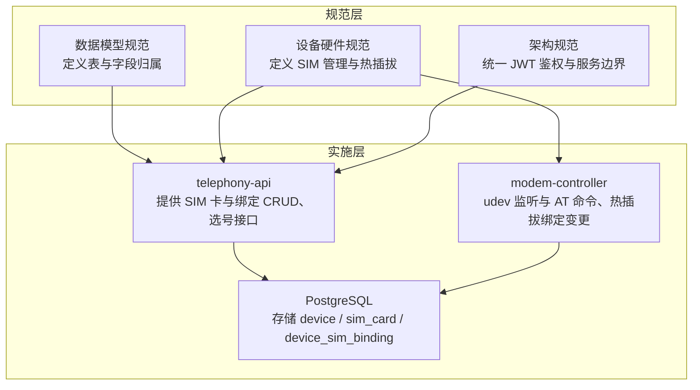
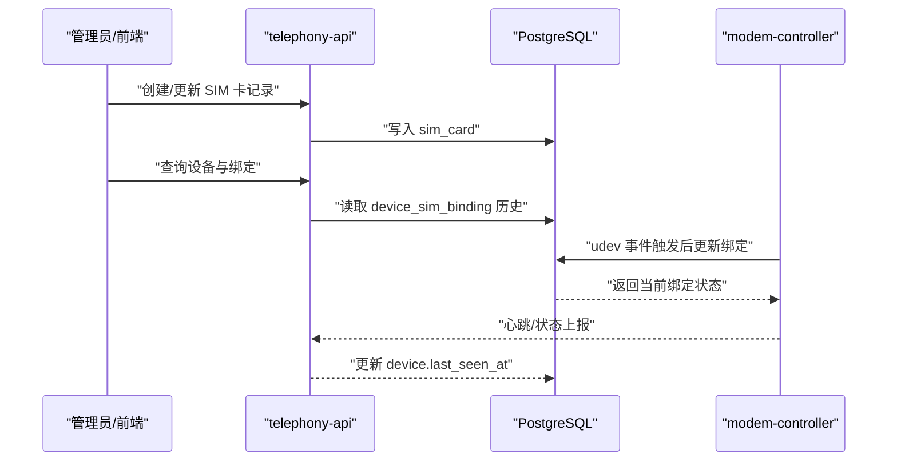
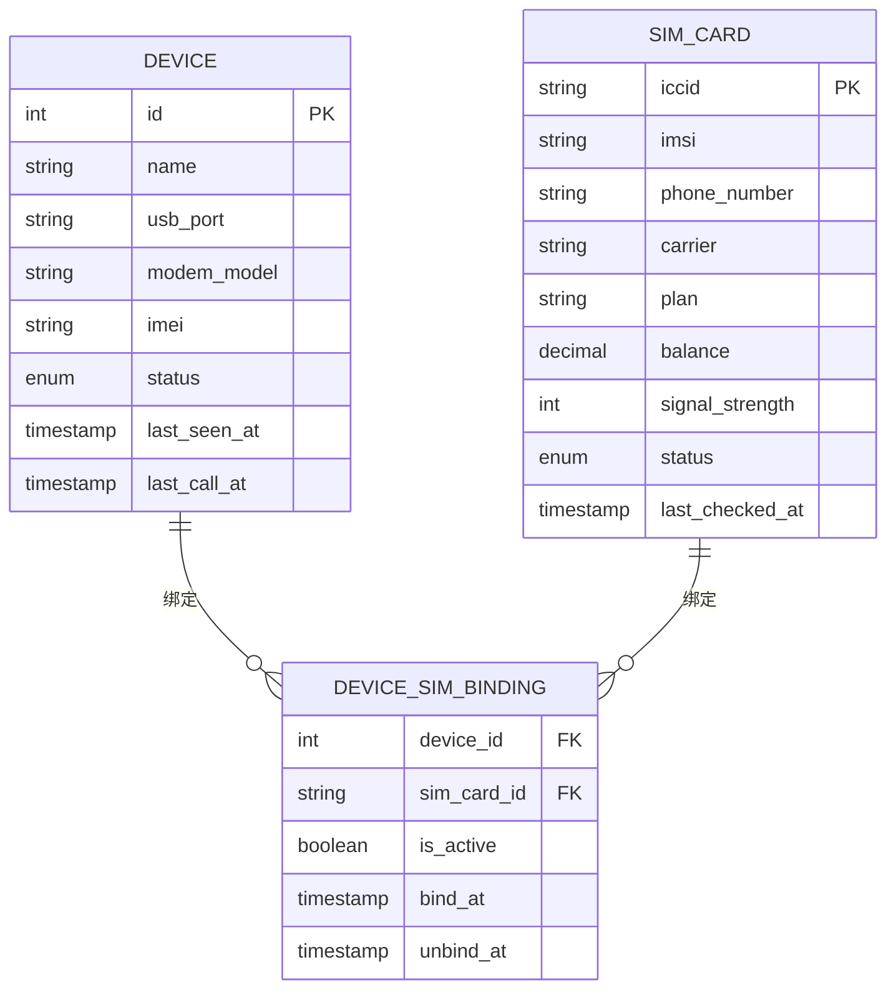
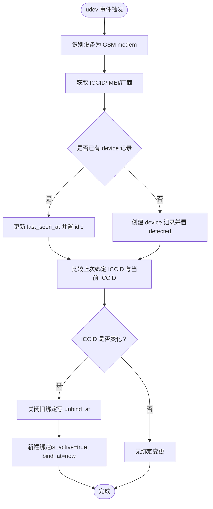
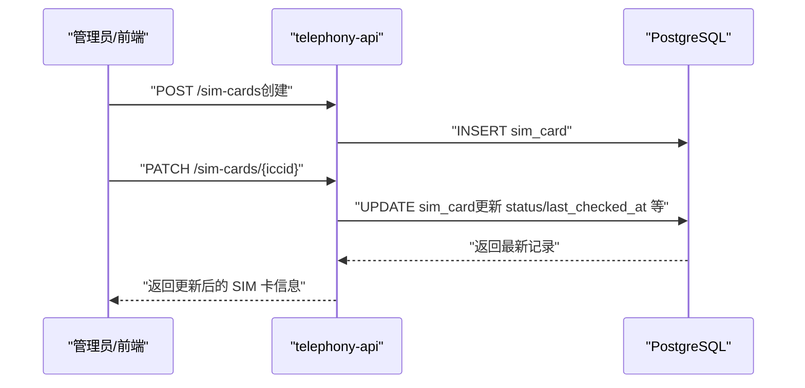
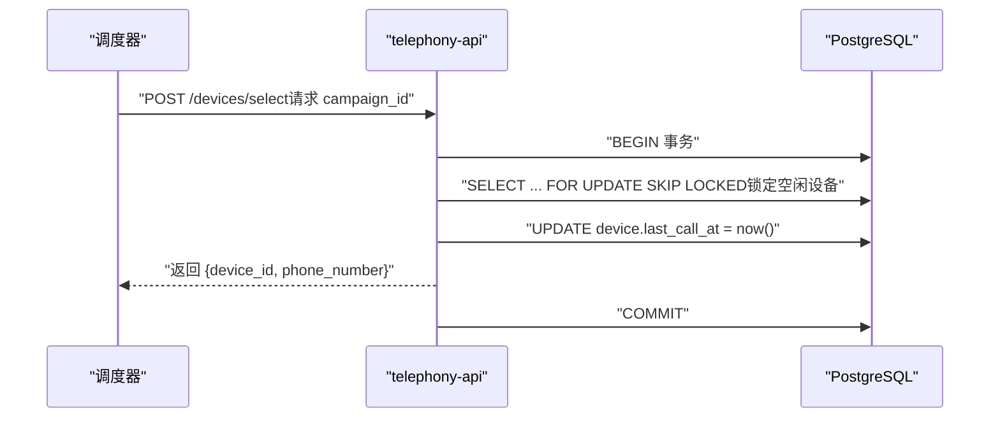
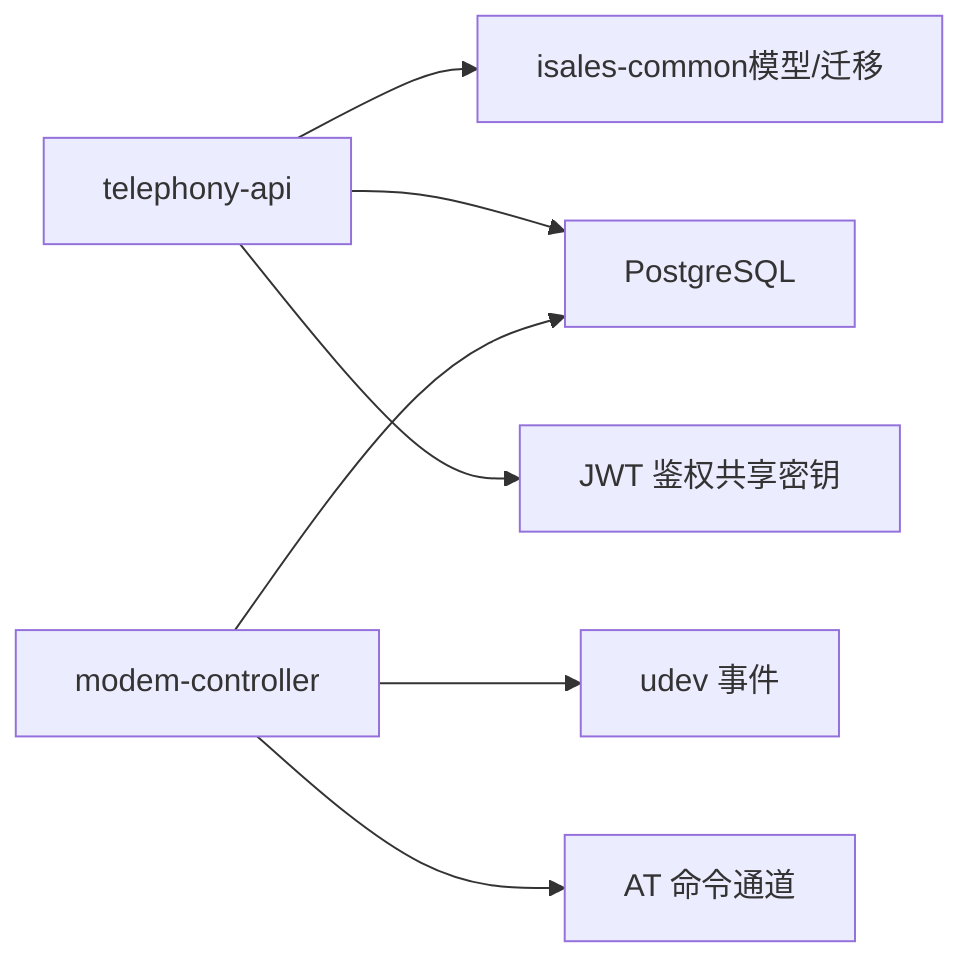

# SIM 卡管理

<cite>
**本文引用的文件**
- [openspec/specs/data-model/spec.md](file://openspec/specs/data-model/spec.md)
- [openspec/specs/device-hardware/spec.md](file://openspec/specs/device-hardware/spec.md)
- [openspec/changes/archive/2026-05-06-impl-telephony/proposal.md](file://openspec/changes/archive/2026-05-06-impl-telephony/proposal.md)
- [openspec/changes/archive/2026-05-06-impl-telephony/tasks.md](file://openspec/changes/archive/2026-05-06-impl-telephony/tasks.md)
- [openspec/changes/archive/2026-05-01-clarify-stage2-boundaries/specs/architecture/spec.md](file://openspec/changes/archive/2026-05-01-clarify-stage2-boundaries/specs/architecture/spec.md)
- [openspec/changes/archive/2026-05-09-impl-modem-controller/specs/device-hardware/spec.md](file://openspec/changes/archive/2026-05-09-impl-modem-controller/specs/device-hardware/spec.md)
</cite>

## 目录
1. [简介](#简介)
2. [项目结构](#项目结构)
3. [核心组件](#核心组件)
4. [架构总览](#架构总览)
5. [详细组件分析](#详细组件分析)
6. [依赖分析](#依赖分析)
7. [性能考虑](#性能考虑)
8. [故障排查指南](#故障排查指南)
9. [结论](#结论)
10. [附录](#附录)

## 简介
本文件面向 SIM 卡管理系统，基于仓库中的规范与实施文档，系统化阐述 SIM 卡资料化管理的设计与实现要点，包括：
- SIM 卡表字段定义与语义
- 设备与 SIM 卡绑定表的设计与绑定历史记录
- 热插拔检测机制与唯一活跃约束
- SIM 卡管理的关键流程：注册、绑定变更、状态更新与数据一致性保障
- 与 telephony-api、modem-controller 的交互边界与数据一致性契约

## 项目结构
本项目围绕“数据模型规范”和“设备硬件规范”展开，SIM 卡管理相关的核心内容集中在以下文件：
- 数据模型规范：定义表与字段归属、约束与跨服务一致性
- 设备硬件规范：定义 SIM 卡资料化管理、热插拔检测、绑定历史与唯一活跃约束
- 实施提案与任务清单：体现 telephony-api 的 CRUD 与选号接口实现、并发安全与测试目标
- 架构规范：统一 JWT 鉴权与服务间调用边界，支撑 SIM 卡管理的 API 访问

**图表来源**
- [openspec/specs/data-model/spec.md:29-49](file://openspec/specs/data-model/spec.md#L29-L49)
- [openspec/specs/device-hardware/spec.md:69-105](file://openspec/specs/device-hardware/spec.md#L69-L105)
- [openspec/changes/archive/2026-05-01-clarify-stage2-boundaries/specs/architecture/spec.md:3-30](file://openspec/changes/archive/2026-05-01-clarify-stage2-boundaries/specs/architecture/spec.md#L3-L30)

**章节来源**
- [openspec/specs/data-model/spec.md:19-49](file://openspec/specs/data-model/spec.md#L19-L49)
- [openspec/specs/device-hardware/spec.md:1-525](file://openspec/specs/device-hardware/spec.md#L1-L525)
- [openspec/changes/archive/2026-05-06-impl-telephony/proposal.md:7-40](file://openspec/changes/archive/2026-05-06-impl-telephony/proposal.md#L7-L40)
- [openspec/changes/archive/2026-05-01-clarify-stage2-boundaries/specs/architecture/spec.md:1-30](file://openspec/changes/archive/2026-05-01-clarify-stage2-boundaries/specs/architecture/spec.md#L1-L30)

## 核心组件
- SIM 卡表（sim_card）
  - 字段：iccid、imsi、phone_number、carrier、plan、balance、signal_strength、status、last_checked_at
  - 归属：telephony；详细规范见设备硬件规范
- 设备 SIM 绑定表（device_sim_binding）
  - 字段：device_id、sim_card_id、is_active、bind_at、unbind_at
  - 归属：telephony；记录绑定历史与唯一活跃约束
- 设备表（device）
  - 字段：id、name、usb_port、modem_model、imei、status、last_seen_at、last_call_at
  - 归属：telephony；与 SIM 卡管理协同，支撑选号与健康监控

上述表均属于 telephony 服务的职责范围，且统一在 PostgreSQL 实例中持久化。

**章节来源**
- [openspec/specs/data-model/spec.md:46-48](file://openspec/specs/data-model/spec.md#L46-L48)
- [openspec/specs/device-hardware/spec.md:517-525](file://openspec/specs/device-hardware/spec.md#L517-L525)

## 架构总览
SIM 卡管理涉及三类角色与两条关键路径：
- 角色
  - telephony-api：提供 SIM 卡与绑定的 CRUD、选号接口，负责数据一致性与并发安全
  - modem-controller：负责 udev 监听、AT 命令、热插拔检测与绑定变更
  - 数据库：PostgreSQL，承载 device、sim_card、device_sim_binding
- 路径
  - 管理路径：web 管理员通过 telephony-api 管理 SIM 卡与绑定
  - 运行路径：modem-controller 基于 udev 事件自动维护 SIM 与设备的绑定关系

**图表来源**
- [openspec/specs/device-hardware/spec.md:88-105](file://openspec/specs/device-hardware/spec.md#L88-L105)
- [openspec/specs/device-hardware/spec.md:208-226](file://openspec/specs/device-hardware/spec.md#L208-L226)
- [openspec/specs/data-model/spec.md:46-48](file://openspec/specs/data-model/spec.md#L46-L48)

## 详细组件分析

### SIM 卡表（sim_card）字段定义与语义
- iccid：SIM 卡硬件唯一标识，用于识别与去重
- imsi：国际移动用户识别码
- phone_number：主叫号码来源，用于外呼展示与记录
- carrier：运营商（移动/联通/电信等）
- plan：套餐类型或计费计划
- balance：账户余额（可用于限额控制）
- signal_strength：信号强度（v1 心跳路径暂不回写，后续版本可能扩展）
- status：SIM 卡状态（active/suspended/arrears/flagged）
- last_checked_at：最近检查时间，用于健康度与账务同步

字段归属与详细规范由设备硬件规范定义，telephony 服务负责维护与查询。

**章节来源**
- [openspec/specs/data-model/spec.md:46-47](file://openspec/specs/data-model/spec.md#L46-L47)
- [openspec/specs/device-hardware/spec.md:69-76](file://openspec/specs/device-hardware/spec.md#L69-L76)

### 设备 SIM 绑定表（device_sim_binding）设计与绑定历史
- device_id、sim_card_id：建立设备与 SIM 的多对多关系（通过 is_active 标识当前活跃绑定）
- is_active：唯一活跃约束，同一设备同一时刻仅允许一条 is_active=true
- bind_at、unbind_at：记录绑定开始与解除时间，形成绑定历史轨迹
- 归属：telephony；用于记录绑定历史与校验唯一活跃

**图表来源**
- [openspec/specs/data-model/spec.md:46-48](file://openspec/specs/data-model/spec.md#L46-L48)
- [openspec/specs/device-hardware/spec.md:517-525](file://openspec/specs/device-hardware/spec.md#L517-L525)

**章节来源**
- [openspec/specs/data-model/spec.md:47-48](file://openspec/specs/data-model/spec.md#L47-L48)
- [openspec/specs/device-hardware/spec.md:78-86](file://openspec/specs/device-hardware/spec.md#L78-L86)

### 热插拔检测机制与绑定变更处理
- udev 自动检测：modem-controller 监听 USB 设备 add/remove 事件
  - add：识别 GSM modem、获取 ICCID/IMEI、更新设备状态与 last_seen_at；若 ICCID 变化则关闭旧绑定并建立新绑定
  - remove：设备 offline，关闭当前活跃绑定
- 唯一活跃约束：同一设备同一时刻仅允许一条 is_active=true
- 绑定历史：通过 unbind_at 记录解除时间，bind_at 记录开始时间

**图表来源**
- [openspec/specs/device-hardware/spec.md:88-105](file://openspec/specs/device-hardware/spec.md#L88-L105)

**章节来源**
- [openspec/specs/device-hardware/spec.md:88-105](file://openspec/specs/device-hardware/spec.md#L88-L105)

### SIM 卡注册流程与状态更新
- 注册流程
  - 通过 telephony-api 的 SIM 卡 CRUD 接口创建/更新 sim_card 记录
  - 字段填写：iccid、imsi、phone_number、carrier、plan、balance、signal_strength、status、last_checked_at
- 状态更新
  - status 字段用于表达 active/suspended/arrears/flagged 等状态
  - last_checked_at 用于记录最近检查时间，便于健康度与账务同步

**图表来源**
- [openspec/changes/archive/2026-05-06-impl-telephony/proposal.md:21-22](file://openspec/changes/archive/2026-05-06-impl-telephony/proposal.md#L21-L22)

**章节来源**
- [openspec/changes/archive/2026-05-06-impl-telephony/proposal.md:21-22](file://openspec/changes/archive/2026-05-06-impl-telephony/proposal.md#L21-L22)

### 绑定变更处理与数据一致性
- 唯一活跃约束：同一设备同一时刻仅允许一条 is_active=true
- 并发安全：选号接口采用单事务 + 行级锁，确保并发场景下不重复分配同一设备
- 绑定历史：通过 unbind_at 与 bind_at 记录完整的历史轨迹，便于审计与排障

**图表来源**
- [openspec/specs/device-hardware/spec.md:180-193](file://openspec/specs/device-hardware/spec.md#L180-L193)

**章节来源**
- [openspec/specs/device-hardware/spec.md:180-193](file://openspec/specs/device-hardware/spec.md#L180-L193)

### 数据一致性保证与 API 访问边界
- JWT 共享体系：isales-api 为唯一签发方，telephony-api 仅验证；isales-web 可直连 telephony-api
- 服务间调用：v1 单主机部署下内部调用可免 JWT，但需限制监听地址为 loopback/内部网段
- 数据库统一：所有表位于同一 PostgreSQL 实例，避免分布式事务

**章节来源**
- [openspec/changes/archive/2026-05-01-clarify-stage2-boundaries/specs/architecture/spec.md:3-30](file://openspec/changes/archive/2026-05-01-clarify-stage2-boundaries/specs/architecture/spec.md#L3-L30)
- [openspec/specs/data-model/spec.md:52-60](file://openspec/specs/data-model/spec.md#L52-L60)

## 依赖分析
- 组件耦合
  - telephony-api 依赖 isales-common 提供的 Pydantic 模型与数据库迁移
  - modem-controller 依赖 udev 事件与 AT 命令通道，与 telephony-api 通过心跳与绑定变更进行数据同步
- 外部依赖
  - PostgreSQL：统一存储与事务保证
  - JWT：统一鉴权与服务间信任

**图表来源**
- [openspec/changes/archive/2026-05-06-impl-telephony/proposal.md:9-13](file://openspec/changes/archive/2026-05-06-impl-telephony/proposal.md#L9-L13)
- [openspec/changes/archive/2026-05-01-clarify-stage2-boundaries/specs/architecture/spec.md:3-30](file://openspec/changes/archive/2026-05-01-clarify-stage2-boundaries/specs/architecture/spec.md#L3-L30)

**章节来源**
- [openspec/changes/archive/2026-05-06-impl-telephony/proposal.md:9-13](file://openspec/changes/archive/2026-05-06-impl-telephony/proposal.md#L9-L13)
- [openspec/changes/archive/2026-05-01-clarify-stage2-boundaries/specs/architecture/spec.md:3-30](file://openspec/changes/archive/2026-05-01-clarify-stage2-boundaries/specs/architecture/spec.md#L3-L30)

## 性能考虑
- 选号接口的并发安全通过数据库行级锁实现，避免重复分配；建议在高并发场景下合理设置数据库连接池与锁等待策略
- 心跳与 watchdog 机制降低对 udev 的强依赖，提升设备离线检测的鲁棒性
- 绑定历史记录采用时间戳字段，便于快速检索与审计

## 故障排查指南
- 设备离线判定
  - udev 拔出事件：立即置设备 offline
  - 心跳缺失：watchdog 将超过阈值未心跳的设备置 offline（幂等保护）
- 绑定异常
  - 同一设备多条 is_active=true：检查唯一活跃约束是否被违反，必要时回滚或修复
  - 绑定历史缺失：核对 unbind_at/bind_at 是否正确写入
- API 访问
  - JWT 验证失败：确认 isales-api 为唯一签发方，telephony-api 使用相同密钥验证
  - 服务间调用：确保内部调用仅在 loopback/内部网段，避免暴露到公网

**章节来源**
- [openspec/specs/device-hardware/spec.md:64-68](file://openspec/specs/device-hardware/spec.md#L64-L68)
- [openspec/specs/device-hardware/spec.md:222-236](file://openspec/specs/device-hardware/spec.md#L222-L236)
- [openspec/changes/archive/2026-05-01-clarify-stage2-boundaries/specs/architecture/spec.md:27-30](file://openspec/changes/archive/2026-05-01-clarify-stage2-boundaries/specs/architecture/spec.md#L27-L30)

## 结论
SIM 卡管理系统通过清晰的数据模型与严格的约束（唯一活跃、绑定历史、心跳兜底）实现了设备与 SIM 的可靠绑定与状态管理。telephony-api 提供了完整的 CRUD 与选号接口，modem-controller 通过 udev 与 AT 命令自动维护热插拔场景下的绑定一致性。JWT 共享体系与单库统一架构进一步保障了系统的安全性与一致性。

## 附录
- 相关任务与实施目标
  - telephony-api：跑通 device/sim_card/binding CRUD 与 /devices/select 并发安全
  - 测试：pytest 全绿，包含集成测试与并发测试

**章节来源**
- [openspec/changes/archive/2026-05-06-impl-telephony/tasks.md:24-40](file://openspec/changes/archive/2026-05-06-impl-telephony/tasks.md#L24-L40)