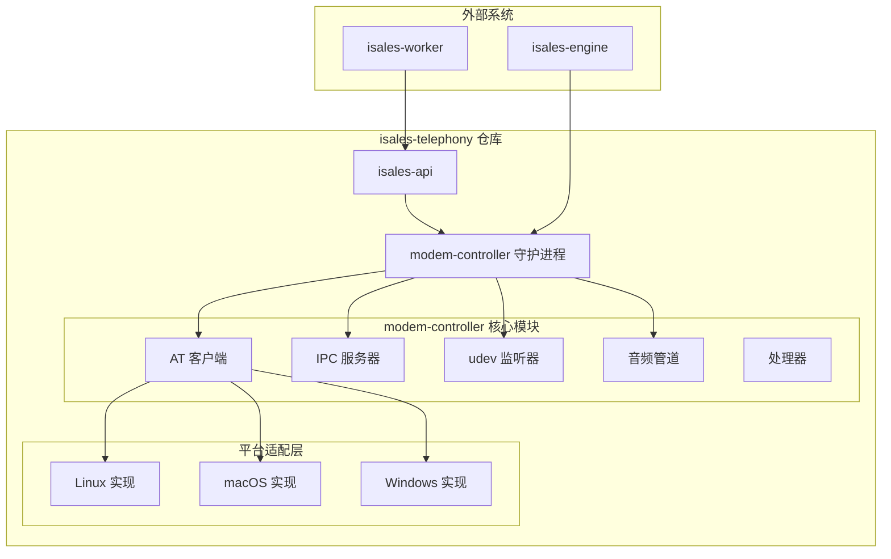
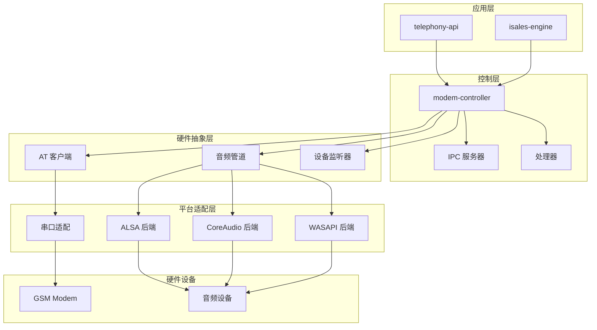
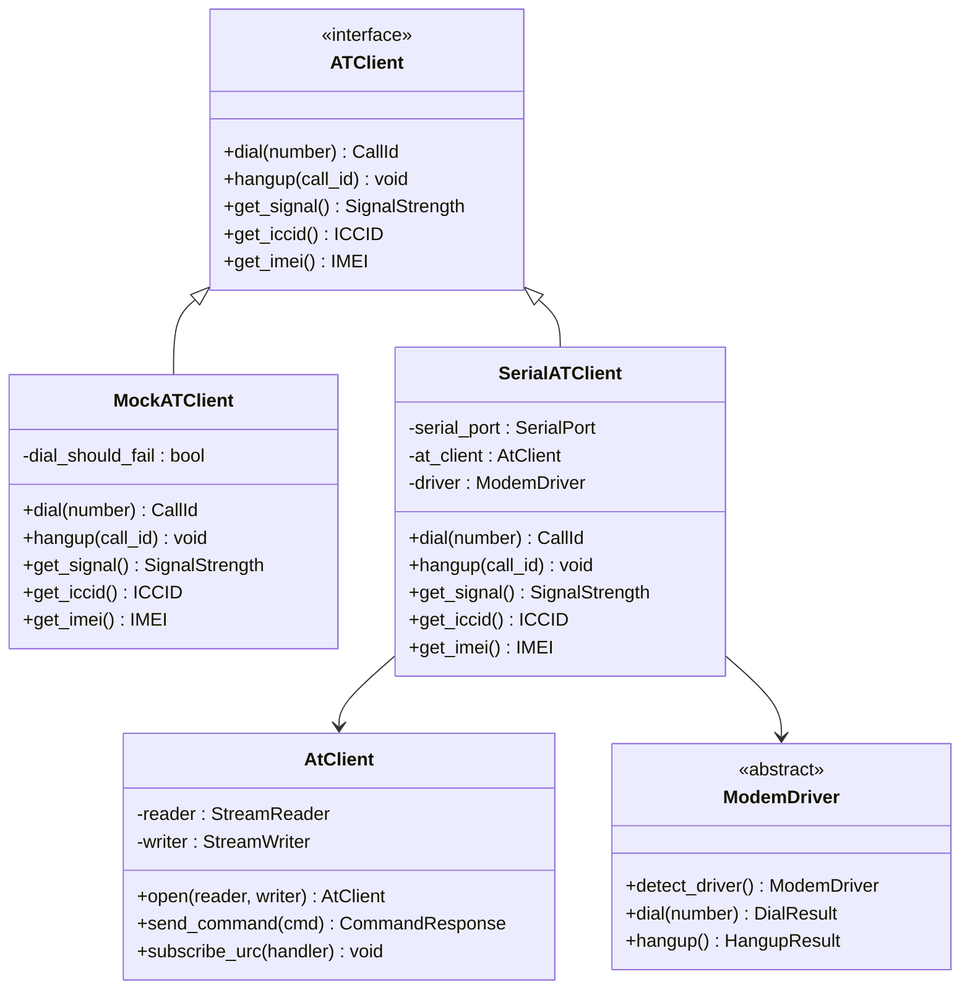
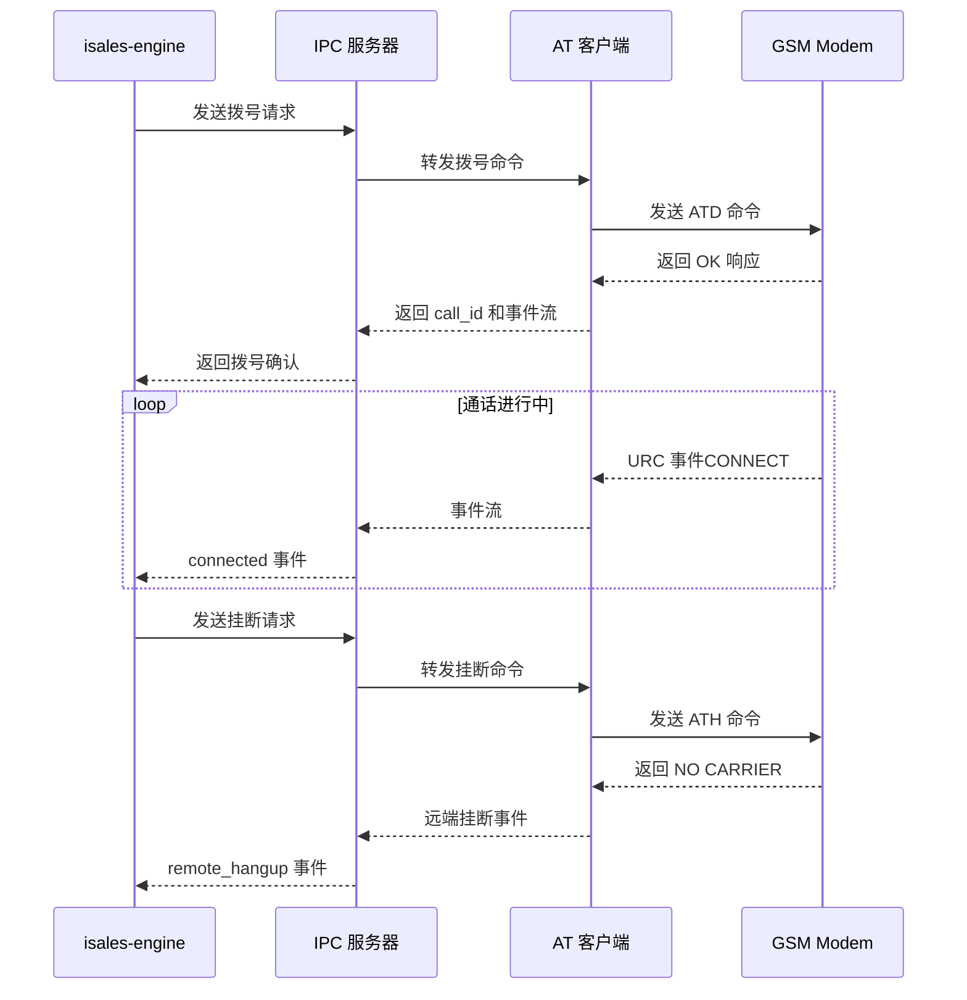
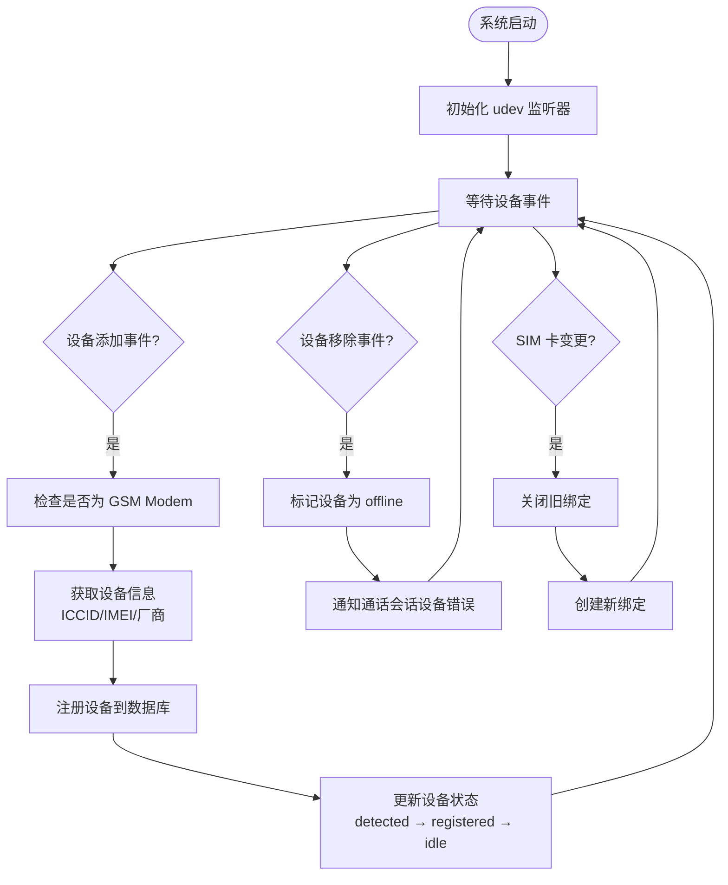
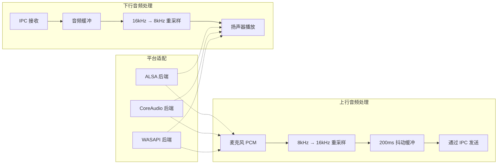
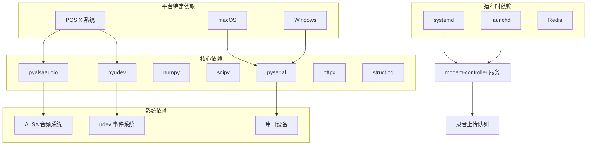

# isales-telephony 硬件控制

<cite>
**本文档引用的文件**
- [device-hardware 规范](file://openspec/specs/device-hardware/spec.md)
- [telephony 实施设计](file://openspec/changes/archive/2026-05-06-impl-telephony/design.md)
- [modem-controller 实施提案](file://openspec/changes/archive/2026-05-09-impl-modem-controller/proposal.md)
- [modem-controller 实施任务](file://openspec/changes/archive/2026-05-09-impl-modem-controller/tasks.md)
- [macOS 平台硬件规范](file://openspec/changes/archive/2026-05-12-impl-deploy-macos/specs/device-hardware/spec.md)
- [真实 AT 客户端规范](file://openspec/changes/archive/2026-05-17-impl-real-at/specs/device-hardware/spec.md)
- [isales 项目总览](file://README.md)
</cite>

## 目录
1. [简介](#简介)
2. [项目结构](#项目结构)
3. [核心组件](#核心组件)
4. [架构概览](#架构概览)
5. [详细组件分析](#详细组件分析)
6. [依赖关系分析](#依赖关系分析)
7. [性能考虑](#性能考虑)
8. [故障排除指南](#故障排除指南)
9. [结论](#结论)

## 简介

isales-telephony 硬件控制服务是一个专为 USB GSM Modem 设计的自研硬件设备管理系统。该系统实现了完整的通话设备硬件层控制，包括设备管理、SIM 卡管理、调制解调器控制和音频处理功能。

系统采用双进程架构：`telephony-api` HTTP 服务负责设备/SIM 管理与设备选择，`modem-controller` 守护进程负责底层硬件控制。该设计遵循 OpenSpec 规范，不使用任何开源 PBX 组件（如 FreeSWITCH / Asterisk / chan_dongle）。

## 项目结构

基于 OpenSpec 规范，isales-telephony 项目采用模块化设计，主要包含以下核心模块：

**图表来源**
- [device-hardware 规范:14-19](file://openspec/specs/device-hardware/spec.md#L14-L19)
- [modem-controller 实施提案:7-16](file://openspec/changes/archive/2026-05-09-impl-modem-controller/proposal.md#L7-L16)

**章节来源**
- [isales 项目总览:1-14](file://README.md#L1-L14)
- [device-hardware 规范:14-19](file://openspec/specs/device-hardware/spec.md#L14-L19)

## 核心组件

### 设备管理系统

设备管理系统负责 USB GSM Modem 的全生命周期管理，包括设备发现、注册、状态监控等功能。

**设备状态机**：
- `unknown` → `detected` → `registered` → `idle` → `dialing` → `in_call` → `idle`
- 任何状态 → `offline`（USB 拔出）
- `idle` / `in_call` → `flagged`（健康度低）
- `detected` → `error`（AT 初始化失败）

**设备管理功能**：
- 自动设备发现：通过 udev/pyudev 监听 USB 设备添加/移除事件
- 设备注册：获取 ICCID、厂商、IMEI 等设备信息
- 状态同步：实时更新设备状态和最后可见时间
- SIM 卡绑定：管理设备与 SIM 卡的绑定关系

**章节来源**
- [device-hardware 规范:45-67](file://openspec/specs/device-hardware/spec.md#L45-L67)
- [device-hardware 规范:88-104](file://openspec/specs/device-hardware/spec.md#L88-L104)

### SIM 卡管理系统

SIM 卡管理系统提供完整的 SIM 卡资料化管理功能，支持多维度的 SIM 卡信息存储和查询。

**SIM 卡数据模型**：
- `iccid`：硬件唯一标识（必填）
- `imsi`：国际移动用户识别码
- `phone_number`：来电显示号码（caller_id 来源）
- `carrier`：运营商（移动/联通/电信）
- `plan`：套餐信息
- `balance`：账户余额
- `signal_strength`：信号强度
- `status`：状态（active/suspended/arrears/flagged）
- `last_checked_at`：最后检查时间

**绑定管理**：
- `device_sim_binding` 表记录设备与 SIM 卡的绑定历史
- 同一设备同一时刻最多 1 条 `is_active=true`
- 热插拔时自动处理 SIM 卡变更

**章节来源**
- [device-hardware 规范:69-86](file://openspec/specs/device-hardware/spec.md#L69-L86)

### 调制解调器控制系统

调制解调器控制系统通过 AT 命令协议与 USB GSM Modem 通信，实现完整的拨号、挂断和状态查询功能。

**AT 命令支持**：
- 拨号：`ATD<number>;`（拨号命令）
- 挂断：`ATH`（挂断命令）
- 信号检测：`AT+CSQ`（获取信号强度）
- ICCID 查询：`AT+CCID`（获取 SIM 卡序列号）
- IMEI 查询：`AT+CGSN`（获取设备序列号）
- 注网状态：`AT+CGREG`（获取网络注册状态）

**URC（非请求响应）处理**：
- `RING`：振铃指示
- `NO CARRIER`：无载波（远端挂断）
- `BUSY`：忙音
- `+CLIP`：主叫号码
- `+CIEV`：语音呼叫激活通知

**章节来源**
- [device-hardware 规范:35-38](file://openspec/specs/device-hardware/spec.md#L35-L38)
- [device-hardware 规范:301-320](file://openspec/specs/device-hardware/spec.md#L301-L320)

### 音频处理系统

音频处理系统实现双向 PCM 音频流处理，支持 8kHz/16kHz 重采样和抖动缓冲。

**音频规格**：
- 上行：8kHz 16-bit 线性 PCM → 重采样 16kHz → 发送到 engine
- 下行：engine TTS PCM → 重采样 8kHz → ALSA 播放
- 帧格式：8kHz/16-bit/LE/mono/20ms 帧（160 samples = 320 字节）

**音频管道架构**：
- `CaptureBackend`：音频采集后端抽象
- `PlaybackBackend`：音频播放后端抽象  
- `AudioPipe`：跨平台音频管道协调器
- 抖动缓冲：固定 200ms（4 个 50ms 帧）
- 重采样：使用 `scipy.signal.resample_poly`

**章节来源**
- [device-hardware 规范:40-43](file://openspec/specs/device-hardware/spec.md#L40-L43)
- [device-hardware 规范:21-27](file://openspec/specs/device-hardware/spec.md#L21-L27)

## 架构概览

系统采用分层架构设计，确保硬件控制的可靠性和可扩展性：

**图表来源**
- [device-hardware 规范:26-28](file://openspec/specs/device-hardware/spec.md#L26-L28)
- [modem-controller 实施提案:7-16](file://openspec/changes/archive/2026-05-09-impl-modem-controller/proposal.md#L7-L16)

## 详细组件分析

### AT 客户端实现

AT 客户端是调制解调器控制的核心组件，提供统一的 AT 命令接口抽象。

**图表来源**
- [modem-controller 实施提案:7-16](file://openspec/changes/archive/2026-05-09-impl-modem-controller/proposal.md#L7-L16)
- [telephony 实施设计:56-62](file://openspec/changes/archive/2026-05-06-impl-telephony/design.md#L56-L62)

**章节来源**
- [modem-controller 实施提案:7-16](file://openspec/changes/archive/2026-05-09-impl-modem-controller/proposal.md#L7-L16)
- [真实 AT 客户端规范:3-21](file://openspec/changes/archive/2026-05-17-impl-real-at/specs/device-hardware/spec.md#L3-L21)

### IPC 通信协议

IPC 通信采用 Unix Socket + 行分隔 JSON 格式，确保消息的可靠传输和解析。

**图表来源**
- [device-hardware 规范:106-130](file://openspec/specs/device-hardware/spec.md#L106-L130)

**章节来源**
- [device-hardware 规范:106-170](file://openspec/specs/device-hardware/spec.md#L106-L170)

### 设备发现与状态管理

设备发现系统通过 udev 监听 USB 设备变化，自动管理设备的生命周期。

**图表来源**
- [device-hardware 规范:88-104](file://openspec/specs/device-hardware/spec.md#L88-L104)

**章节来源**
- [device-hardware 规范:88-104](file://openspec/specs/device-hardware/spec.md#L88-L104)

### 音频处理流水线

音频处理系统实现高效的双向音频流处理，支持实时重采样和缓冲管理。

**图表来源**
- [device-hardware 规范:21-27](file://openspec/specs/device-hardware/spec.md#L21-L27)

**章节来源**
- [device-hardware 规范:21-43](file://openspec/specs/device-hardware/spec.md#L21-L43)

## 依赖关系分析

系统依赖关系呈现清晰的层次结构，确保各组件间的松耦合和高内聚。

**图表来源**
- [modem-controller 实施提案:52-58](file://openspec/changes/archive/2026-05-09-impl-modem-controller/proposal.md#L52-L58)

**章节来源**
- [modem-controller 实施提案:52-58](file://openspec/changes/archive/2026-05-09-impl-modem-controller/proposal.md#L52-L58)

## 性能考虑

系统在设计时充分考虑了性能优化和资源管理：

### 并发处理
- 使用 asyncio 实现异步 I/O 操作
- 多并发会话支持：每个通话会话独立的 pump 协程
- IPC 单进程串口资源池化，避免资源竞争

### 内存管理
- 抖动缓冲固定大小（200ms），防止内存无限增长
- 音频帧大小标准化（20ms 帧），便于内存分配和回收
- 及时释放不再使用的音频缓冲区

### 网络优化
- Unix Socket 本地通信，避免网络延迟
- 行分隔 JSON 格式，简化解析和减少内存拷贝
- 单条消息大小限制（≤ 1 MiB），防止内存溢出

### 硬件优化
- 串口独占访问，防止设备竞争
- 音频重采样使用高效的 scipy 实现
- 平台特定优化：ALSA 直接访问、WASAPI 低延迟模式

## 故障排除指南

### 常见硬件问题

**串口设备无法访问**：
- 检查用户是否在 dialout 组中
- 验证串口路径是否正确（/dev/ttyUSB* 或 /dev/cu.usbmodem*）
- 确认串口未被其他进程占用

**设备未被识别**：
- 检查 udev 规则是否正确安装
- 验证设备是否在支持的厂商列表中
- 确认设备驱动已正确加载

**音频设备问题**：
- 检查 ALSA 配置和权限
- 验证音频设备索引是否正确
- 确认音频格式设置符合设备要求

### 软件问题

**IPC 连接问题**：
- 检查 Unix Socket 文件是否存在和权限正确
- 验证 IPC 服务器是否正常运行
- 确认消息格式符合规范

**AT 命令超时**：
- 检查串口波特率设置
- 验证设备是否正确响应 AT 命令
- 确认没有其他程序占用串口

**音频延迟过高**：
- 调整抖动缓冲大小
- 检查系统负载情况
- 验证音频设备驱动性能

**章节来源**
- [device-hardware 规范:335-342](file://openspec/specs/device-hardware/spec.md#L335-L342)
- [device-hardware 规范:394-397](file://openspec/specs/device-hardware/spec.md#L394-L397)

## 结论

isales-telephony 硬件控制服务是一个设计精良、实现完善的自研硬件设备管理系统。该系统成功实现了以下关键目标：

1. **完整的硬件控制**：通过 AT 命令协议完全控制 USB GSM Modem，支持拨号、挂断、状态查询等核心功能

2. **可靠的设备管理**：实现设备自动发现、注册、状态监控和 SIM 卡绑定管理

3. **高效的音频处理**：提供双向 PCM 音频流处理，支持实时重采样和抖动缓冲

4. **跨平台支持**：通过平台抽象层支持 Linux、macOS 和 Windows 平台

5. **生产就绪**：采用 systemd/launchd 服务管理，具备完善的部署和监控能力

该系统遵循 OpenSpec 规范，不依赖任何开源 PBX 组件，为 isales 项目的通话功能提供了稳定可靠的硬件基础。通过模块化设计和清晰的架构分层，系统具备良好的可维护性和扩展性，为未来的功能增强奠定了坚实基础。