# 设备管理

<cite>
**本文引用的文件**
- [设备硬件规范（主版本）](file://openspec/specs/device-hardware/spec.md)
- [通话状态机规范](file://openspec/specs/call-state-machine/spec.md)
- [数据模型规范](file://openspec/specs/data-model/spec.md)
- [设备硬件规范（联合MVP门禁）](file://openspec/changes/joint-mvp-gate-13301035545/specs/device-hardware/spec.md)
- [设备硬件规范（部署macOS）](file://openspec/changes/archive/2026-05-12-impl-deploy-macos/specs/device-hardware/spec.md)
- [设备硬件规范（实现AT通道）](file://openspec/changes/archive/2026-05-17-impl-real-at/specs/device-hardware/spec.md)
- [设备硬件规范（实现modem-controller）](file://openspec/changes/archive/2026-05-09-impl-modem-controller/specs/device-hardware/spec.md)
- [设备硬件规范（telephony阶段2）](file://openspec/changes/archive/2026-05-06-impl-telephony/design.md)
- [Windows客户端核心设计](file://openspec/changes/archive/2026-05-17-windows-client-core/design.md)
- [macOS边缘ARTC接入设计](file://openspec/changes/archive/2026-05-17-windows-client-core/design.md)
</cite>

## 目录
1. [简介](#简介)
2. [项目结构](#项目结构)
3. [核心组件](#核心组件)
4. [架构总览](#架构总览)
5. [详细组件分析](#详细组件分析)
6. [依赖分析](#依赖分析)
7. [性能考虑](#性能考虑)
8. [故障排查指南](#故障排查指南)
9. [结论](#结论)
10. [附录](#附录)

## 简介
本文件面向设备管理系统，系统性阐述设备状态机的设计与实现，覆盖从 unknown → detected → registered → idle → dialing → in_call → idle 的完整状态转换过程。文档还详细说明设备初始化流程（USB设备检测、AT命令初始化、设备注册与状态管理），并提供设备管理示例（设备发现机制、状态转换条件、错误处理与设备生命周期管理）。最后，文档给出设备表结构设计、状态字段定义与设备间关系映射，帮助开发者快速理解并正确实现设备管理子系统。

## 项目结构
设备管理相关规范分布在多个OpenSpec文件中，核心包括：
- 设备硬件规范（主版本）：定义设备状态机、USB检测、AT命令通道、IPC协议、SIM卡管理、心跳与失联探测等
- 通话状态机规范：定义引擎侧通话状态机，与设备状态机协同驱动端到端通话生命周期
- 数据模型规范：定义设备表、SIM卡表、设备SIM绑定表、活动设备-活动设备绑定表等核心数据结构
- 变更记录中的设备硬件规范：包含平台抽象层、Windows/macOS实现细节、AT通道真实实现策略等

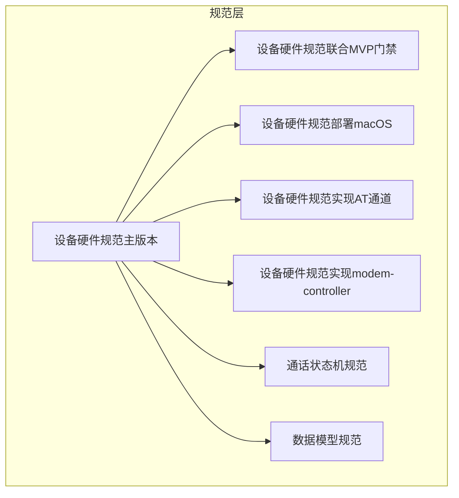

**图表来源**
- [设备硬件规范（主版本）:1-525](file://openspec/specs/device-hardware/spec.md#L1-L525)
- [通话状态机规范:1-190](file://openspec/specs/call-state-machine/spec.md#L1-L190)
- [数据模型规范:1-83](file://openspec/specs/data-model/spec.md#L1-L83)

**章节来源**
- [设备硬件规范（主版本）:1-525](file://openspec/specs/device-hardware/spec.md#L1-L525)
- [通话状态机规范:1-190](file://openspec/specs/call-state-machine/spec.md#L1-L190)
- [数据模型规范:1-83](file://openspec/specs/data-model/spec.md#L1-L83)

## 核心组件
- 设备状态机：定义设备在系统中的状态流转，包括未知、检测到、注册、空闲、拨号中、通话中、离线、标记为健康度低、初始化失败等状态
- USB设备监听器：负责检测USB GSM Modem的插入与拔出事件，并同步设备状态
- AT命令通道：通过串口发送AT命令，完成设备初始化、拨号、挂断、查询信号强度等
- IPC协议：engine与modem-controller之间的Unix socket通信协议，承载拨号、挂断、音频流与事件上报
- SIM卡资料化管理：维护SIM卡元数据与设备绑定历史
- 心跳与失联探测：modem-controller定期心跳上报，worker进行失联探测，兜底设备离线状态

**章节来源**
- [设备硬件规范（主版本）:45-105](file://openspec/specs/device-hardware/spec.md#L45-L105)
- [设备硬件规范（实现AT通道）:1-73](file://openspec/changes/archive/2026-05-17-impl-real-at/specs/device-hardware/spec.md#L1-L73)
- [设备硬件规范（实现modem-controller）:1-20](file://openspec/changes/archive/2026-05-09-impl-modem-controller/specs/device-hardware/spec.md#L1-L20)
- [数据模型规范:46-49](file://openspec/specs/data-model/spec.md#L46-L49)

## 架构总览
设备管理系统的整体架构围绕“设备状态机”展开，结合USB监听、AT通道、IPC通信与心跳探测，形成完整的设备生命周期管理闭环。

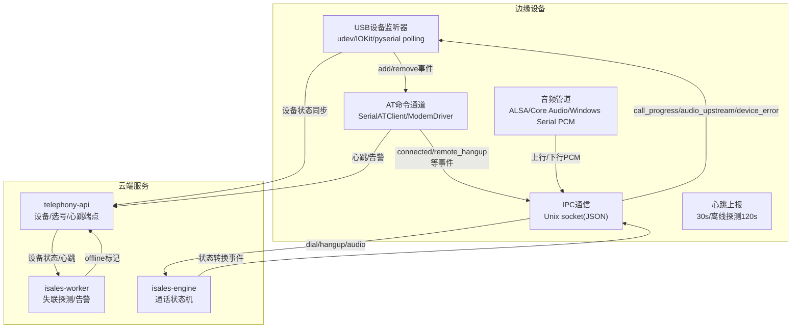

**图表来源**
- [设备硬件规范（主版本）:26-136](file://openspec/specs/device-hardware/spec.md#L26-L136)
- [设备硬件规范（实现modem-controller）:1-20](file://openspec/changes/archive/2026-05-09-impl-modem-controller/specs/device-hardware/spec.md#L1-L20)
- [通话状态机规范:1-190](file://openspec/specs/call-state-machine/spec.md#L1-L190)

## 详细组件分析

### 设备状态机与生命周期
设备状态机定义了设备在系统中的状态流转，确保设备从插入到通话结束的全生命周期可控、可观测、可恢复。

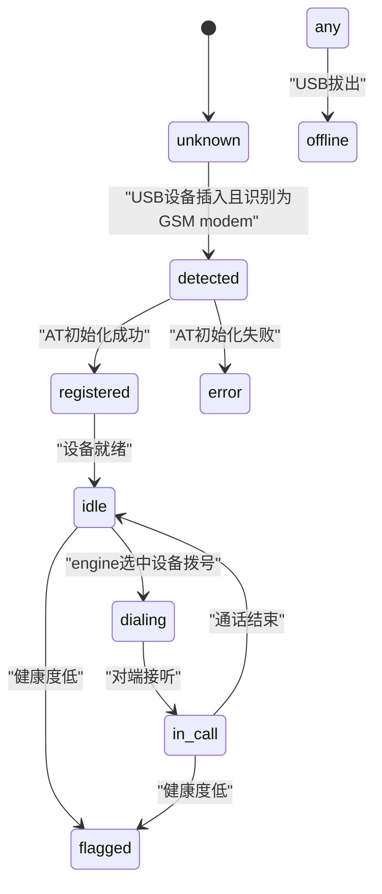

**图表来源**
- [设备硬件规范（主版本）:45-67](file://openspec/specs/device-hardware/spec.md#L45-L67)

关键状态转换条件与触发事件：
- 设备插入后初始化：检测到USB设备且识别为GSM modem → 状态=detected；初始化成功后→registered→idle
- 拨号期间状态：engine调用dial接口选中设备 → 状态=dialing → 接通后in_call → 挂断后idle
- USB拔出：udev检测到USB设备拔出 → 对应设备状态立即置offline；正在使用的call_session收到device_error事件并优雅清理
- 健康度低：idle/in_call状态下标记flagged（健康度低）

**章节来源**
- [设备硬件规范（主版本）:54-67](file://openspec/specs/device-hardware/spec.md#L54-L67)
- [设备硬件规范（联合MVP门禁）:12-25](file://openspec/changes/joint-mvp-gate-13301035545/specs/device-hardware/spec.md#L12-L25)

### 设备初始化流程（USB检测、AT命令初始化、注册与状态管理）
设备初始化流程由USB监听器、AT命令通道与状态管理共同完成，确保设备从检测到可用的完整路径。

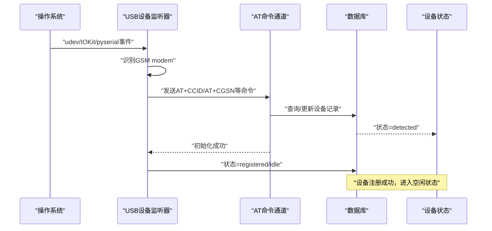

**图表来源**
- [设备硬件规范（主版本）:88-105](file://openspec/specs/device-hardware/spec.md#L88-L105)
- [设备硬件规范（实现AT通道）:15-22](file://openspec/changes/archive/2026-05-17-impl-real-at/specs/device-hardware/spec.md#L15-L22)

初始化流程要点：
- USB监听器在收到设备add事件后，识别为GSM modem，发送AT+CCID/AT+CGSN等命令获取ICCID/IMEI等元数据
- 根据DB中是否存在设备记录，更新last_seen_at并置idle或创建新记录置detected
- 初始化成功后，设备状态从detected→registered→idle
- 初始化失败则置error状态并通过cloud-edge上报HardwareAlert

**章节来源**
- [设备硬件规范（主版本）:88-105](file://openspec/specs/device-hardware/spec.md#L88-L105)
- [设备硬件规范（实现AT通道）:15-22](file://openspec/changes/archive/2026-05-17-impl-real-at/specs/device-hardware/spec.md#L15-L22)

### 设备发现机制与错误处理
设备发现机制通过平台抽象层实现，支持Linux udev、macOS IOKit与Windows pyserial polling三种路径，统一事件投递。

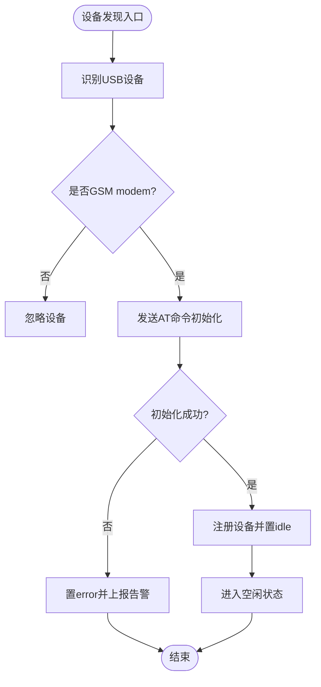

**图表来源**
- [设备硬件规范（部署macOS）:44-51](file://openspec/changes/archive/2026-05-12-impl-deploy-macos/specs/device-hardware/spec.md#L44-L51)
- [设备硬件规范（实现AT通道）:15-22](file://openspec/changes/archive/2026-05-17-impl-real-at/specs/device-hardware/spec.md#L15-L22)

错误处理策略：
- AT初始化失败：设备状态置error，上报HardwareAlert
- USB拔出：设备状态立即置offline，正在使用的call_session收到device_error事件并优雅清理
- 心跳缺失：超过120s无心跳，worker将设备状态置offline

**章节来源**
- [设备硬件规范（部署macOS）:44-51](file://openspec/changes/archive/2026-05-12-impl-deploy-macos/specs/device-hardware/spec.md#L44-L51)
- [设备硬件规范（实现modem-controller）:17-26](file://openspec/changes/archive/2026-05-09-impl-modem-controller/specs/device-hardware/spec.md#L17-L26)

### 设备与SIM卡关系映射
设备与SIM卡通过device_sim_binding表进行绑定管理，支持热插拔场景下的绑定变更与唯一活跃约束。

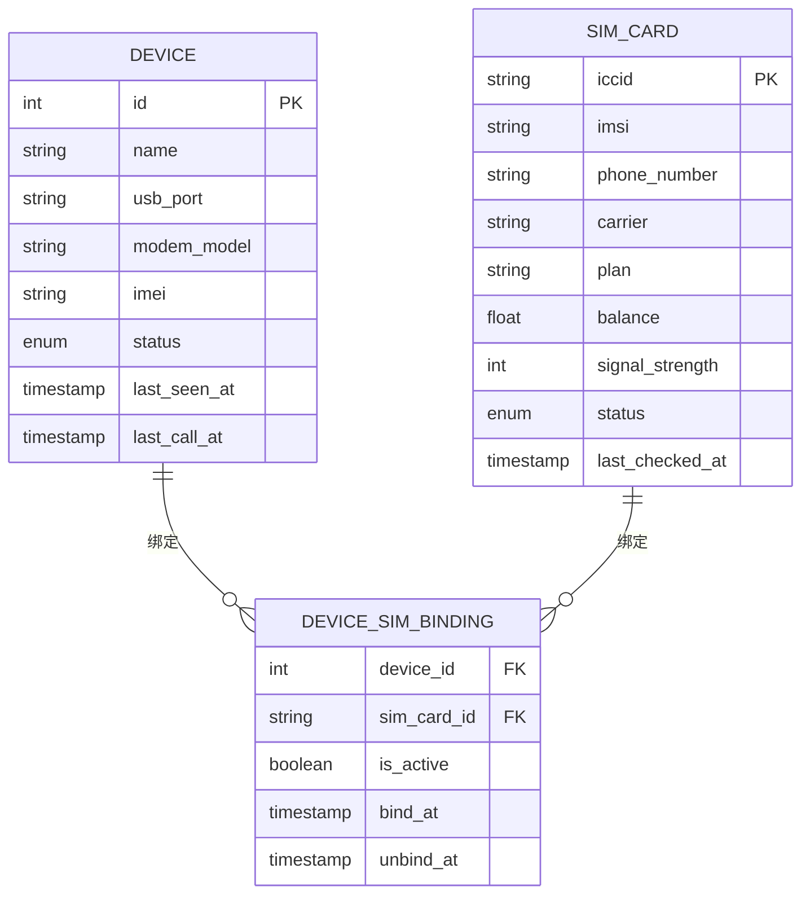

**图表来源**
- [数据模型规范:46-49](file://openspec/specs/data-model/spec.md#L46-L49)

关系说明：
- device与device_sim_binding：一对多，记录设备的绑定历史
- sim_card与device_sim_binding：一对多，记录SIM卡的绑定历史
- 唯一活跃约束：同一设备同一时刻最多一条is_active=true的绑定记录

**章节来源**
- [数据模型规范:46-49](file://openspec/specs/data-model/spec.md#L46-L49)
- [设备硬件规范（主版本）:69-87](file://openspec/specs/device-hardware/spec.md#L69-L87)

### 选设备API与并发安全
telephony-api提供POST /devices/select接口，按策略选择空闲且SIM活跃的设备，保证并发安全。

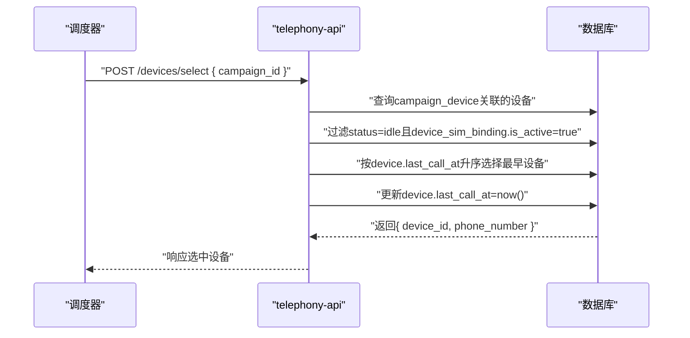

**图表来源**
- [设备硬件规范（主版本）:171-193](file://openspec/specs/device-hardware/spec.md#L171-L193)

并发安全策略：
- 选号成功后立即回写device.last_call_at，避免并发请求重复选中同一台设备
- 实现可采用事务+行级锁或乐观锁，确保并发安全

**章节来源**
- [设备硬件规范（主版本）:171-193](file://openspec/specs/device-hardware/spec.md#L171-L193)

### 心跳与失联探测
modem-controller每30s向telephony-api发送心跳，isales-worker每30s运行watchdog，超过120s无心跳的设备置offline。

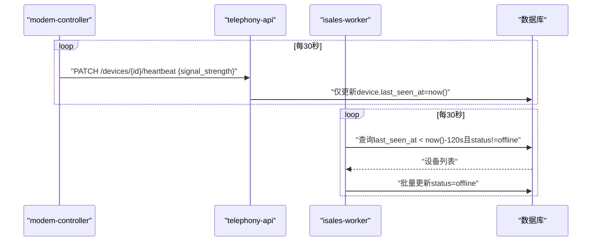

**图表来源**
- [设备硬件规范（实现modem-controller）:1-20](file://openspec/changes/archive/2026-05-09-impl-modem-controller/specs/device-hardware/spec.md#L1-L20)

竞态处理：
- udev拔出与watchdog同时检测到同一设备时，udev路径直接置status=offline；watchdog使用WHERE status!='offline'守卫，幂等更新
- 心跳恢复：进程崩溃后恢复，心跳仅更新last_seen_at，status恢复由udev注册路径或运维手动PATCH触发

**章节来源**
- [设备硬件规范（实现modem-controller）:17-26](file://openspec/changes/archive/2026-05-09-impl-modem-controller/specs/device-hardware/spec.md#L17-L26)

### IPC协议与音频管道
engine与modem-controller通过Unix socket进行双向通信，消息以newline-delimited JSON帧格式传输，音频流与控制消息共用通道。

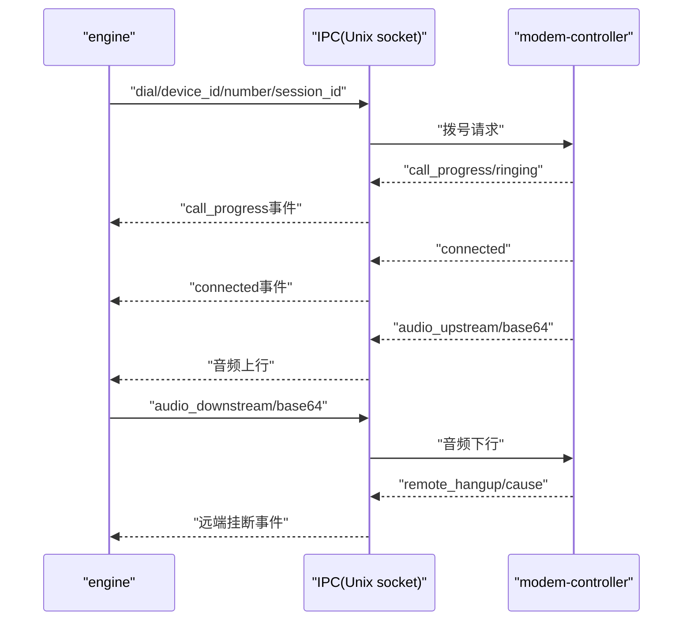

**图表来源**
- [设备硬件规范（主版本）:106-170](file://openspec/specs/device-hardware/spec.md#L106-L170)

音频管道：
- 上行：8kHz/16bit/LE/mono，重采样至16kHz后传输给engine
- 下行：engine TTS PCM重采样至8kHz后通过ALSA/PortAudio/WASAPI/Serial PCM输出

**章节来源**
- [设备硬件规范（主版本）:40-44](file://openspec/specs/device-hardware/spec.md#L40-L44)
- [设备硬件规范（主版本）:106-170](file://openspec/specs/device-hardware/spec.md#L106-L170)

### Windows平台实现要点
Windows平台通过pyserial polling实现USB监听，音频通过Serial PCM-over-COM传输，遵循统一的平台抽象层。

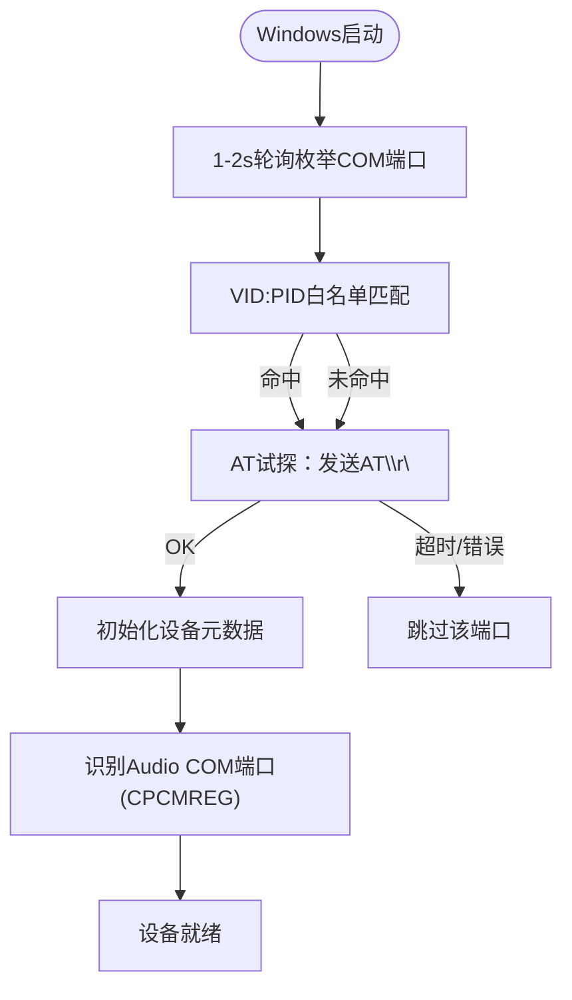

**图表来源**
- [设备硬件规范（主版本）:344-422](file://openspec/specs/device-hardware/spec.md#L344-L422)

Windows平台特性：
- USB监听：使用pyserial枚举COM端口，1-2s轮询，VID:PID白名单+AT试探回退
- 音频：通过Audio COM端口进行Serial PCM传输，帧格式8kHz/16bit/LE/mono
- CPCMREG协议：通话连接/挂断时启用/释放音频通道，失败上报HardwareAlert

**章节来源**
- [设备硬件规范（主版本）:344-422](file://openspec/specs/device-hardware/spec.md#L344-L422)
- [Windows客户端核心设计:79-97](file://openspec/changes/archive/2026-05-17-windows-client-core/design.md#L79-L97)

## 依赖分析
设备管理子系统的关键依赖关系如下：

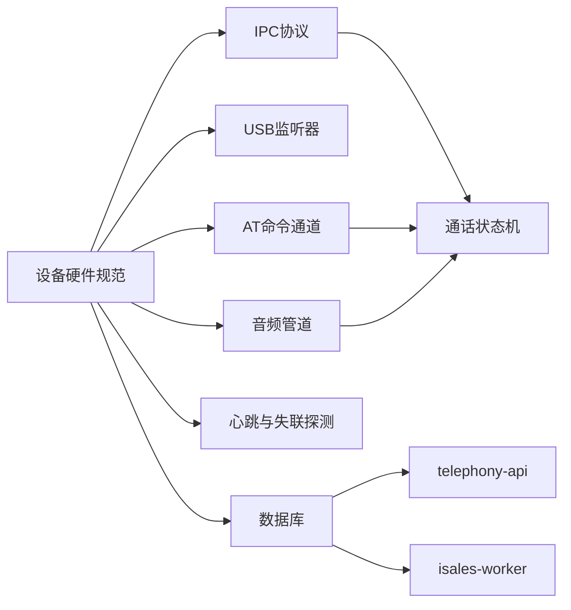

**图表来源**
- [设备硬件规范（主版本）:26-136](file://openspec/specs/device-hardware/spec.md#L26-L136)
- [通话状态机规范:1-190](file://openspec/specs/call-state-machine/spec.md#L1-L190)

耦合与内聚：
- 设备状态机与IPC协议耦合紧密，状态转换由事件驱动
- USB监听器、AT通道、音频管道通过平台抽象层与业务解耦
- 心跳与失联探测与设备状态机相互补充，提高鲁棒性

**章节来源**
- [设备硬件规范（主版本）:26-136](file://openspec/specs/device-hardware/spec.md#L26-L136)
- [通话状态机规范:1-190](file://openspec/specs/call-state-machine/spec.md#L1-L190)

## 性能考虑
- 心跳频率：modem-controller每30s心跳，worker每30s扫描，避免频繁IO
- 轮询策略：Windows/macOS端1-2s轮询，CPU占用<0.1%，满足实时性要求
- 音频延迟：端到端延迟≤200ms（macOS/ALSA），Windows Serial PCM路径≤50ms（P95）
- 并发控制：选设备API通过事务/行级锁或乐观锁保证并发安全，避免重复选中

[本节为通用指导，无需列出章节来源]

## 故障排查指南
常见问题与处理建议：
- 设备初始化失败：检查AT命令响应、串口权限、设备是否被其他进程占用
- USB拔出未及时离线：确认udev/IOKit监听器正常运行，必要时启用心跳兜底
- 心跳缺失：检查网络连通性、防火墙策略、modem-controller进程状态
- 音频无声：确认Audio COM端口识别正确、CPCMREG启用成功、帧格式匹配
- 并发选号冲突：检查事务/锁实现，确保last_call_at写入原子性

**章节来源**
- [设备硬件规范（实现AT通道）:327-334](file://openspec/changes/archive/2026-05-17-impl-real-at/specs/device-hardware/spec.md#L327-L334)
- [设备硬件规范（实现modem-controller）:17-26](file://openspec/changes/archive/2026-05-09-impl-modem-controller/specs/device-hardware/spec.md#L17-L26)

## 结论
设备管理系统通过明确的状态机设计、可靠的USB监听与AT通道、严格的IPC协议与心跳机制，实现了从设备发现到通话结束的全生命周期管理。平台抽象层确保了Linux、macOS与Windows的统一实现，数据模型与并发策略保障了系统的可扩展性与稳定性。按照本文档的规范与最佳实践，可以高效构建并维护高质量的设备管理子系统。

[本节为总结性内容，无需列出章节来源]

## 附录
- 设备表字段：id、name、usb_port、modem_model、imei、status、last_seen_at、last_call_at
- SIM卡表字段：iccid、imsi、phone_number、carrier、plan、balance、signal_strength、status、last_checked_at
- 设备SIM绑定表字段：device_id、sim_card_id、is_active、bind_at、unbind_at
- 活动设备-活动设备绑定表：campaign_device，记录活动设备与活动的关联关系

**章节来源**
- [数据模型规范:46-49](file://openspec/specs/data-model/spec.md#L46-L49)