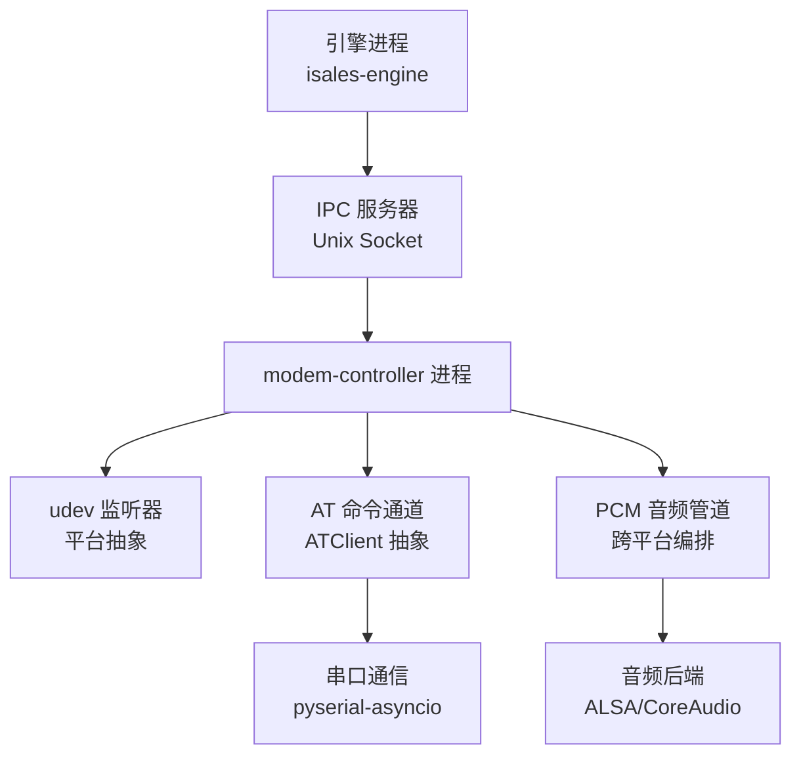
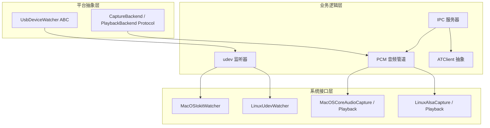
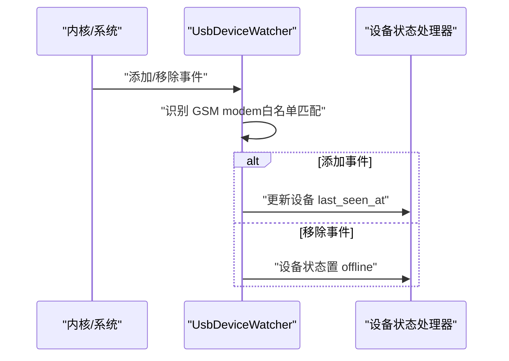
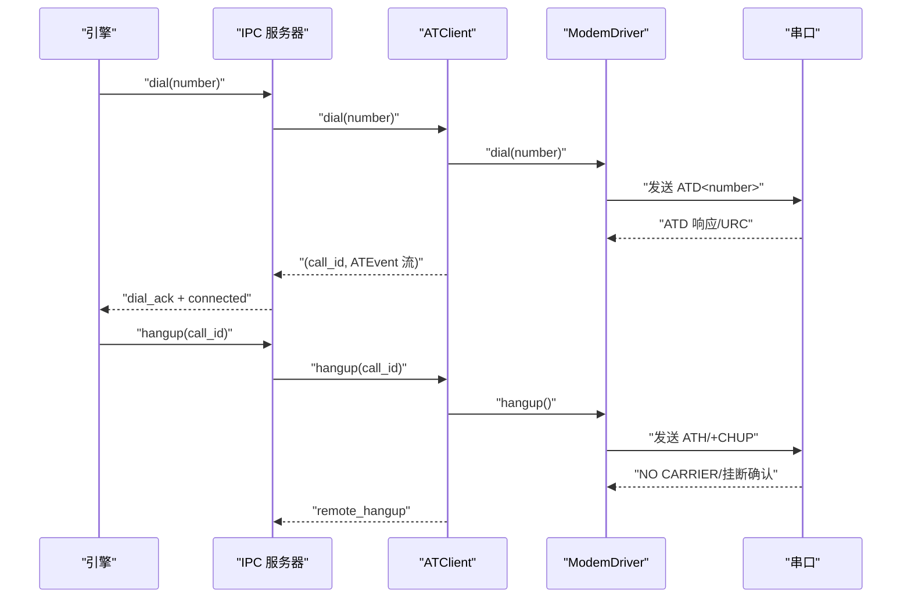
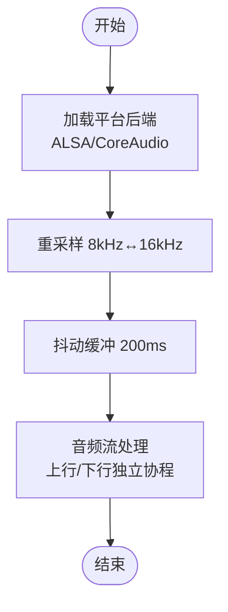
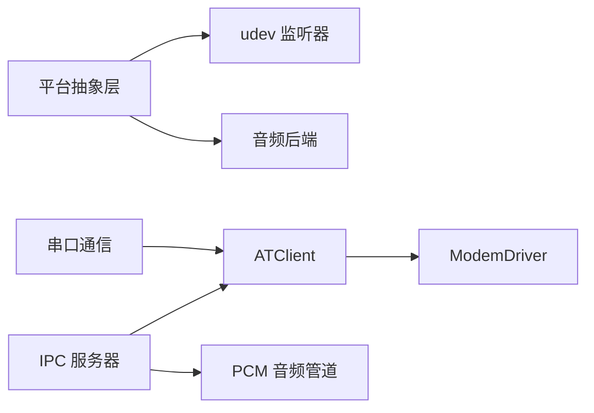

# 调制解调器控制

<cite>
**本文引用的文件**
- [README.md](file://README.md)
- [proposal.md](file://openspec/changes/archive/2026-05-09-impl-modem-controller/proposal.md)
- [tasks.md](file://openspec/changes/archive/2026-05-09-impl-modem-controller/tasks.md)
- [device-hardware 规格.md](file://openspec/changes/archive/2026-05-09-impl-modem-controller/specs/device-hardware/spec.md)
- [device-hardware 规格（2026-05-17）.md](file://openspec/changes/archive/2026-05-17-impl-real-at/specs/device-hardware/spec.md)
- [设计文档（2026-05-17）.md](file://openspec/changes/archive/2026-05-17-impl-real-at/design.md)
- [验收记录（2026-05-17）.md](file://openspec/changes/archive/2026-05-17-impl-real-at/acceptance.md)
- [平台抽象规格（2026-05-12）.md](file://openspec/changes/archive/2026-05-12-impl-deploy-macos/specs/device-hardware/spec.md)
- [平台迁移任务（2026-05-12）.md](file://openspec/changes/archive/2026-05-12-impl-deploy-macos/tasks.md)
- [Windows 平台设计（2026-05-17）.md](file://openspec/changes/archive/2026-05-17-windows-client-core/design.md)
</cite>

## 目录
1. [简介](#简介)
2. [项目结构](#项目结构)
3. [核心组件](#核心组件)
4. [架构总览](#架构总览)
5. [详细组件分析](#详细组件分析)
6. [依赖关系分析](#依赖关系分析)
7. [性能考虑](#性能考虑)
8. [故障排查指南](#故障排查指南)
9. [结论](#结论)
10. [附录](#附录)

## 简介
本技术文档面向调制解调器控制系统（modem-controller）的实现与使用，聚焦三大职责：udev 监听器、AT 命令通道、PCM 音频管道。文档基于仓库内的 OpenSpec 规格与实施任务记录，系统阐述了 AT 命令处理机制（拨号、挂断、信号查询、卡号查询、IMEI 查询等）、设备状态转换与 AT 命令执行的关系、初始化失败处理、设备错误检测与故障恢复策略，并提供串口通信协议、命令执行流程与错误处理策略的具体示例。

## 项目结构
modem-controller 作为独立守护进程，位于 isales-telephony 仓库中，通过 systemd/launchd 管理生命周期，提供 Unix Socket IPC 与 isales-engine 交互。其核心模块包括：
- udev 监听器：跨平台抽象（Linux 使用 pyudev，macOS 采用轮询），负责设备插拔事件捕获与设备状态同步
- AT 命令通道：ATClient 抽象（MockATClient 与 SerialATClient），负责拨号、挂断、信号/卡号/IMEI 查询与 URC 翻译
- PCM 音频管道：跨平台音频编排（重采样、抖动缓冲）与平台后端（ALSA/CoreAudio）

图表来源
- [proposal.md: 7-16:7-16](file://openspec/changes/archive/2026-05-09-impl-modem-controller/proposal.md#L7-L16)
- [proposal.md: 40-46:40-46](file://openspec/changes/archive/2026-05-09-impl-modem-controller/proposal.md#L40-L46)

章节来源
- [README.md: 16-30:16-30](file://README.md#L16-L30)
- [proposal.md: 7-16:7-16](file://openspec/changes/archive/2026-05-09-impl-modem-controller/proposal.md#L7-L16)

## 核心组件
- udev 监听器：监听 USB 添加/移除事件，识别 GSM modem 设备，更新设备最近在线时间与状态
- AT 命令通道：提供 ATClient 抽象，支持拨号（ATD）、挂断（ATH）、信号查询（AT+CSQ）、卡号查询（AT+CCID）、IMEI 查询（AT+CGSN）等命令
- PCM 音频管道：提供跨平台音频编排（8kHz↔16kHz 重采样、200ms 抖动缓冲），按平台抽象选择 ALSA/CoreAudio 后端

章节来源
- [proposal.md: 8-13:8-13](file://openspec/changes/archive/2026-05-09-impl-modem-controller/proposal.md#L8-L13)
- [proposal.md: 40-46:40-46](file://openspec/changes/archive/2026-05-09-impl-modem-controller/proposal.md#L40-L46)

## 架构总览
modem-controller 通过平台抽象层隔离操作系统差异，业务代码不直接依赖平台原生绑定。三大职责通过 IPC 与引擎交互，设备状态机贯穿拨号、通话、挂断全流程。

图表来源
- [平台抽象规格（2026-05-12）.md: 1-19:1-19](file://openspec/changes/archive/2026-05-12-impl-deploy-macos/specs/device-hardware/spec.md#L1-L19)
- [平台抽象规格（2026-05-12）.md: 21-36:21-36](file://openspec/changes/archive/2026-05-12-impl-deploy-macos/specs/device-hardware/spec.md#L21-L36)
- [平台迁移任务（2026-05-12）.md: 6-14:6-14](file://openspec/changes/archive/2026-05-12-impl-deploy-macos/tasks.md#L6-L14)

## 详细组件分析

### udev 监听器
职责
- 监听 USB 添加/移除事件，识别 GSM modem（按白名单 vendor/product 匹配），更新设备最近在线时间
- 移除事件将设备状态置为 offline，并通知通话会话进行清理

实现要点
- Linux 使用 pyudev 实时监听内核 netlink 事件
- macOS 采用 1Hz 轮询比较设备集合差集推导事件
- 事件类型与异常为平台中立数据类与异常，业务层不感知原生句柄

图表来源
- [平台抽象规格（2026-05-12）.md: 44-51:44-51](file://openspec/changes/archive/2026-05-12-impl-deploy-macos/specs/device-hardware/spec.md#L44-L51)
- [proposal.md: 32-34:32-34](file://openspec/changes/archive/2026-05-09-impl-modem-controller/proposal.md#L32-L34)

章节来源
- [proposal.md: 32-34:32-34](file://openspec/changes/archive/2026-05-09-impl-modem-controller/proposal.md#L32-L34)
- [平台抽象规格（2026-05-12）.md: 44-51:44-51](file://openspec/changes/archive/2026-05-12-impl-deploy-macos/specs/device-hardware/spec.md#L44-L51)

### AT 命令通道
职责
- 提供 ATClient 抽象，支持拨号（ATD）、挂断（ATH）、信号查询（AT+CSQ）、卡号查询（AT+CCID）、IMEI 查询（AT+CGSN）
- 通过 ModemDriver 适配不同厂商（A7670/SIM800C/Quectel UC20），并进行 URC（Unsolicited Result Code）翻译

实现策略
- 环境变量严格分派：ISALES_MODEM_SERIAL_PATH 指定串口路径；ISALES_ALLOW_MOCK_AT=1 时使用 MockATClient；否则抛错退出
- 串口竞争互斥：使用独占锁防止多实例竞争同一串口
- 并发设计：dial 立即返回 call_id，后台协程持续推送 ATEvent 流

图表来源
- [device-hardware 规格（2026-05-17）.md: 3-22:3-22](file://openspec/changes/archive/2026-05-17-impl-real-at/specs/device-hardware/spec.md#L3-L22)
- [设计文档（2026-05-17）.md: 43-45:43-45](file://openspec/changes/archive/2026-05-17-impl-real-at/design.md#L43-L45)

章节来源
- [device-hardware 规格（2026-05-17）.md: 3-22:3-22](file://openspec/changes/archive/2026-05-17-impl-real-at/specs/device-hardware/spec.md#L3-L22)
- [设计文档（2026-05-17）.md: 22-45:22-45](file://openspec/changes/archive/2026-05-17-impl-real-at/design.md#L22-L45)

### PCM 音频管道
职责
- 提供跨平台音频编排：8kHz↔16kHz 重采样、200ms 抖动缓冲、上行回调
- 通过平台抽象选择 ALSA（Linux）或 CoreAudio（macOS）后端

实现要点
- 音频编排器负责重采样与缓冲，业务层仅导入抽象接口
- 平台后端以 Protocol 形式注册，按 sys.platform 动态选择

图表来源
- [platforms 抽象规格（2026-05-12）.md: 21-36:21-36](file://openspec/changes/archive/2026-05-12-impl-deploy-macos/specs/device-hardware/spec.md#L21-L36)
- [platforms 迁移任务（2026-05-12）.md: 11-13:11-13](file://openspec/changes/archive/2026-05-12-impl-deploy-macos/tasks.md#L11-L13)

章节来源
- [platforms 抽象规格（2026-05-12）.md: 21-36:21-36](file://openspec/changes/archive/2026-05-12-impl-deploy-macos/specs/device-hardware/spec.md#L21-L36)
- [platforms 迁移任务（2026-05-12）.md: 11-13:11-13](file://openspec/changes/archive/2026-05-12-impl-deploy-macos/tasks.md#L11-L13)

## 依赖关系分析
- 平台抽象层：UsbDeviceWatcher ABC 与 CaptureBackend/PlaybackBackend Protocol 将平台特定实现与业务逻辑解耦
- 串口通信：pyserial-asyncio 负责 AT 命令帧格式与 URC 队列；fcntl/msvcrt.locking 用于串口独占锁
- 音频后端：ALSA（Linux）与 CoreAudio（macOS）通过 Protocol 注册，跨平台编排器统一调度
- IPC 协议：Unix Socket + NDJSON，支持 dial/hangup/status/audio_downstream 指令与事件流

图表来源
- [proposal.md: 8-13:8-13](file://openspec/changes/archive/2026-05-09-impl-modem-controller/proposal.md#L8-L13)
- [platforms 抽象规格（2026-05-12）.md: 1-19:1-19](file://openspec/changes/archive/2026-05-12-impl-deploy-macos/specs/device-hardware/spec.md#L1-L19)

章节来源
- [proposal.md: 8-13:8-13](file://openspec/changes/archive/2026-05-09-impl-modem-controller/proposal.md#L8-L13)
- [platforms 抽象规格（2026-05-12）.md: 1-19:1-19](file://openspec/changes/archive/2026-05-12-impl-deploy-macos/specs/device-hardware/spec.md#L1-L19)

## 性能考虑
- 串口通信：115200 8N1 波特率，命令-响应配对与超时控制，避免阻塞；URC 解析与事件流异步推送
- 音频编排：重采样采用多项式插值，抖动缓冲固定 200ms；上行/下行独立协程降低耦合
- 平台抽象：按 sys.platform 动态选择实现，避免在不适用平台加载重型后端

## 故障排查指南
常见问题与处理
- 串口被占用：构造 SerialATClient 时尝试独占锁，若失败抛出 BusyDeviceError，需释放占用或更换串口
- 环境变量配置错误：未设置 ISALES_MODEM_SERIAL_PATH 且未开启 ISALES_ALLOW_MOCK_AT=1 时，进程直接退出；请按规范设置或使用 MockATClient
- 设备状态异常：udev 与心跳共同兜底，若设备长时间无心跳，watchdog 将设备标记为 offline；恢复后需通过 udev 注册或手动更新状态
- Windows 平台限制：当前 SerialATClient 依赖 fcntl（Linux/macOS），Windows 需后续平台层重构（msvcrt.locking/no-op）以支持

章节来源
- [device-hardware 规格（2026-05-17）.md: 60-64:60-64](file://openspec/changes/archive/2026-05-17-impl-real-at/specs/device-hardware/spec.md#L60-L64)
- [验收记录（2026-05-17）.md: 35-51:35-51](file://openspec/changes/archive/2026-05-17-impl-real-at/acceptance.md#L35-L51)

## 结论
modem-controller 通过平台抽象层与 ATClient 抽象，实现了稳定可靠的 udev 监听、AT 命令通道与 PCM 音频管道。其严格的环境分派与错误语义确保了生产环境的确定性，结合心跳与 watchdog 的双重兜底，提升了设备可用性与故障恢复能力。建议在生产部署中严格遵循环境变量配置与串口独占策略，并在 Windows 平台完成平台层重构以支持 SerialATClient。

## 附录
- 环境变量与部署要点
  - ISALES_MODEM_SERIAL_PATH：指定串口路径（Linux:/dev/ttyUSB*，macOS:/dev/cu.usbmodem*）
  - ISALES_ALLOW_MOCK_AT：启用 MockATClient（仅开发/CI/无硬件本地调试）
  - ISALES_MODEM_DRIVER：可选驱动提示（a7670/sim800c/quectel_uc20）
  - 其他：IPC 路径、ALSA 卡索引、录音目录、API 基础地址与鉴权令牌等

章节来源
- [proposal.md: 59-66:59-66](file://openspec/changes/archive/2026-05-09-impl-modem-controller/proposal.md#L59-L66)
- [device-hardware 规格（2026-05-17）.md: 291-294:291-294](file://openspec/changes/archive/2026-05-17-impl-real-at/specs/device-hardware/spec.md#L291-L294)