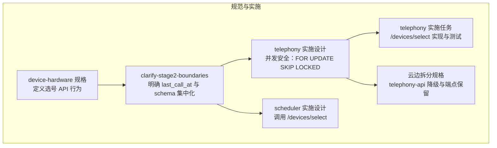
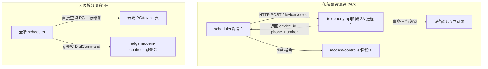
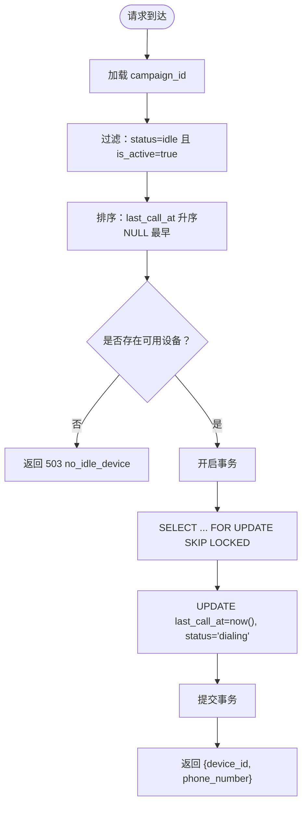
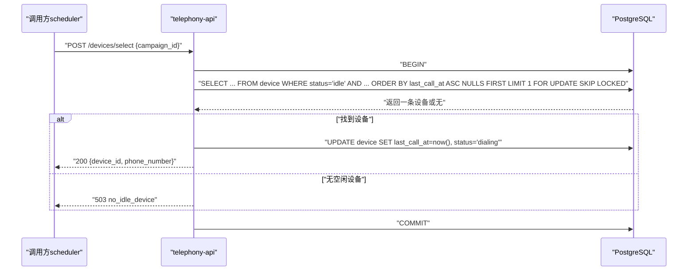
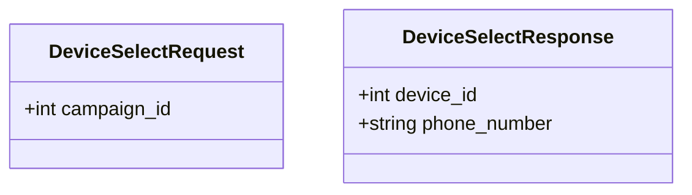
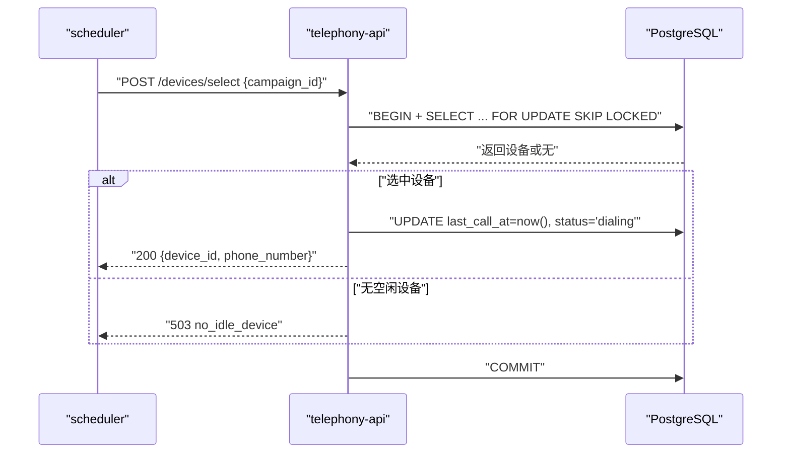
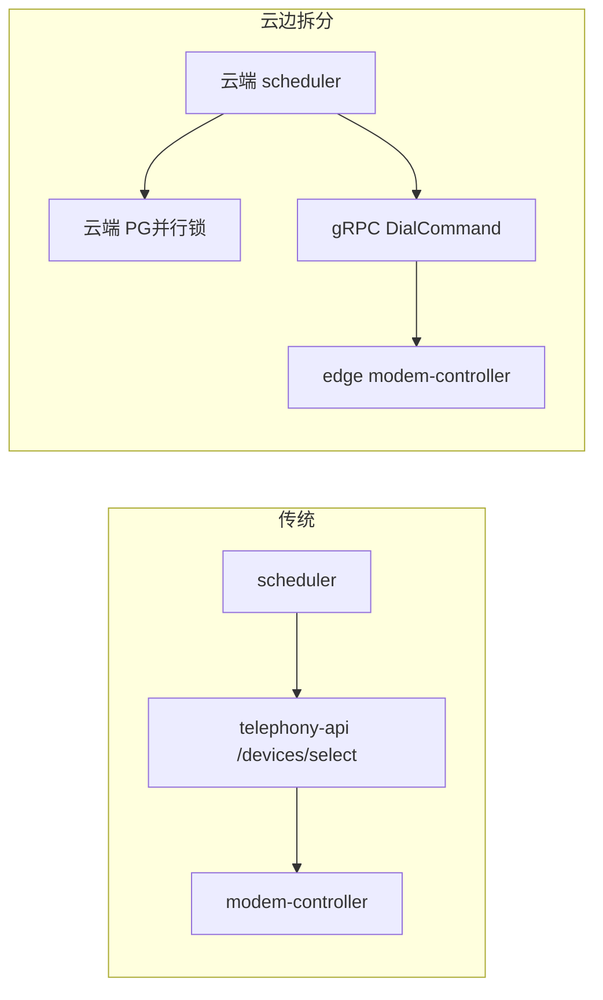
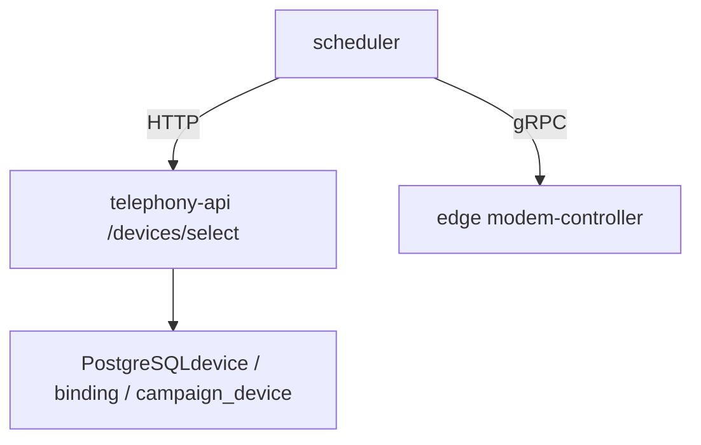

# 选号 API

<cite>
**本文引用的文件**
- [IMPLEMENTATION_PLAN.md](file://IMPLEMENTATION_PLAN.md)
- [device-hardware 规格（选号 API）.md](file://openspec/specs/device-hardware/spec.md)
- [clarify-stage2-boundaries（选号 API）.md](file://openspec/changes/archive/2026-05-01-clarify-stage2-boundaries/specs/device-hardware/spec.md)
- [telephony 实施设计（并发选号）.md](file://openspec/changes/archive/2026-05-06-impl-telephony/design.md)
- [telephony 实施任务（/devices/select）.md](file://openspec/changes/archive/2026-05-06-impl-telephony/tasks.md)
- [scheduler 实施设计（选号调用）.md](file://openspec/changes/archive/2026-05-06-impl-scheduler/design.md)
- [云边拆分（telephony-api 降级）.md](file://openspec/changes/arch-cloud-edge-split/specs/device-hardware/spec.md)
</cite>

## 目录
1. [简介](#简介)
2. [项目结构](#项目结构)
3. [核心组件](#核心组件)
4. [架构总览](#架构总览)
5. [详细组件分析](#详细组件分析)
6. [依赖分析](#依赖分析)
7. [性能考量](#性能考量)
8. [故障排查指南](#故障排查指南)
9. [结论](#结论)
10. [附录](#附录)

## 简介
本文面向“选号 API”的技术文档，围绕 POST /devices/select 的设计与实现进行系统化说明。重点覆盖：
- 选号算法：基于设备状态与绑定有效性过滤，按 last_call_at 最早优先（NULL 视为最早）。
- 负载均衡策略：通过 last_call_at 字段实现均匀分配，避免热点设备。
- 并发控制机制：事务 + 行级锁 SELECT ... FOR UPDATE SKIP LOCKED，确保并发安全。
- 请求与响应模型：Pydantic 定义由 isales-common 集中提供，请求体包含 campaign_id，响应体包含 device_id 与 phone_number。
- 错误处理与可观测性：无空闲设备返回 503；并发测试验证不撞车；云边拆分后 telephony-api 降级保留该端点以供本地工具使用。
- 性能优化与扩展性：PG 原生 SKIP LOCKED、紧凑事务、最小写路径；云边形态下选号逻辑迁移至云端。

## 项目结构
- 选号 API 的规范与实施分布在多个 OpenSpec 变更与实施计划中：
  - device-hardware 规格定义了选号 API 的入参与行为。
  - clarify-stage2-boundaries 对边界进行澄清，明确 last_call_at 字段与 schema 集中化。
  - telephony 实施设计与任务明确了并发安全的 PG 行级锁实现与测试。
  - scheduler 实施设计说明了调用方如何使用该 API。
  - 云边拆分规格说明了 telephony-api 的角色降级与端点保留。

**章节来源**
- [IMPLEMENTATION_PLAN.md:95-126](file://IMPLEMENTATION_PLAN.md#L95-L126)
- [device-hardware 规格（选号 API）.md:251-272](file://openspec/specs/device-hardware/spec.md#L251-L272)
- [clarify-stage2-boundaries（选号 API）.md:1-46](file://openspec/changes/archive/2026-05-01-clarify-stage2-boundaries/specs/device-hardware/spec.md#L1-L46)
- [telephony 实施设计（并发选号）.md:29-42](file://openspec/changes/archive/2026-05-06-impl-telephony/design.md#L29-L42)
- [telephony 实施任务（/devices/select）.md:33-40](file://openspec/changes/archive/2026-05-06-impl-telephony/tasks.md#L33-L40)
- [scheduler 实施设计（选号调用）.md:105](file://openspec/changes/archive/2026-05-06-impl-scheduler/design.md#L105)
- [云边拆分（telephony-api 降级）.md:92-110](file://openspec/changes/arch-cloud-edge-split/specs/device-hardware/spec.md#L92-L110)

## 核心组件
- 选号 API（POST /devices/select）
  - 请求体：DeviceSelectRequest（字段 campaign_id: int）
  - 响应体：DeviceSelectResponse（字段 device_id: int、phone_number: str）
  - 调用方：scheduler（阶段 3）通过 HTTP 调用 telephony-api
  - 服务端：telephony-api（阶段 2A 进程 1），实现并发安全与负载均衡
- 选号算法
  - 过滤条件：设备状态为 idle，SIM 绑定为 active
  - 排序策略：按 device.last_call_at 升序，NULL 视为最早
  - 选中后写回：在响应返回前更新 device.last_call_at = now()，并设置状态为 dialing
- 并发控制
  - 事务内执行：SELECT ... FOR UPDATE SKIP LOCKED + UPDATE last_call_at = now(), status = 'dialing'
  - 保障：并发请求不会选中同一台 idle 设备
- 错误处理
  - 无空闲设备：返回 503 no_idle_device
- 调用链与部署
  - 传统形态：scheduler → telephony-api /devices/select → modem-controller 拨号
  - 云边拆分后：云端 scheduler 直接基于云内 PG 查询并行锁，dial 指令经 gRPC 下发至边缘

**章节来源**
- [clarify-stage2-boundaries（选号 API）.md:7-24](file://openspec/changes/archive/2026-05-01-clarify-stage2-boundaries/specs/device-hardware/spec.md#L7-L24)
- [device-hardware 规格（选号 API）.md:251-272](file://openspec/specs/device-hardware/spec.md#L251-L272)
- [telephony 实施设计（并发选号）.md:29-42](file://openspec/changes/archive/2026-05-06-impl-telephony/design.md#L29-L42)
- [telephony 实施任务（/devices/select）.md:35-39](file://openspec/changes/archive/2026-05-06-impl-telephony/tasks.md#L35-L39)
- [scheduler 实施设计（选号调用）.md:105](file://openspec/changes/archive/2026-05-06-impl-scheduler/design.md#L105)
- [云边拆分（telephony-api 降级）.md:92-110](file://openspec/changes/arch-cloud-edge-split/specs/device-hardware/spec.md#L92-L110)

## 架构总览
下图展示了选号 API 在不同阶段的架构差异与调用关系：

**图示来源**
- [IMPLEMENTATION_PLAN.md:254-255](file://IMPLEMENTATION_PLAN.md#L254-L255)
- [telephony 实施任务（/devices/select）.md:35](file://openspec/changes/archive/2026-05-06-impl-telephony/tasks.md#L35)
- [云边拆分（telephony-api 降级）.md:92-110](file://openspec/changes/arch-cloud-edge-split/specs/device-hardware/spec.md#L92-L110)

**章节来源**
- [IMPLEMENTATION_PLAN.md:254-255](file://IMPLEMENTATION_PLAN.md#L254-L255)
- [telephony 实施任务（/devices/select）.md:35](file://openspec/changes/archive/2026-05-06-impl-telephony/tasks.md#L35)
- [云边拆分（telephony-api 降级）.md:92-110](file://openspec/changes/arch-cloud-edge-split/specs/device-hardware/spec.md#L92-L110)

## 详细组件分析

### 1) 选号算法与负载均衡
- 输入参数
  - campaign_id：用于限定候选设备集（通过 campaign_device 中间表关联）
- 过滤条件
  - 设备状态为 idle
  - SIM 绑定为 active
- 选择策略
  - 按 device.last_call_at 升序排序，NULL 视为最早，优先选中
- 写回策略
  - 在响应返回前更新 device.last_call_at = now()，并设置状态为 dialing，确保并发安全

**图示来源**
- [clarify-stage2-boundaries（选号 API）.md:12-24](file://openspec/changes/archive/2026-05-01-clarify-stage2-boundaries/specs/device-hardware/spec.md#L12-L24)
- [telephony 实施设计（并发选号）.md:29-42](file://openspec/changes/archive/2026-05-06-impl-telephony/design.md#L29-L42)

**章节来源**
- [clarify-stage2-boundaries（选号 API）.md:12-24](file://openspec/changes/archive/2026-05-01-clarify-stage2-boundaries/specs/device-hardware/spec.md#L12-L24)
- [telephony 实施设计（并发选号）.md:29-42](file://openspec/changes/archive/2026-05-06-impl-telephony/design.md#L29-L42)

### 2) 并发控制机制（事务 + SELECT ... FOR UPDATE SKIP LOCKED）
- 事务边界
  - 选号与写回在同一事务内，保证原子性
- 行级锁
  - 使用 SELECT ... FOR UPDATE SKIP LOCKED，避免阻塞，提升吞吐
- 并发测试
  - 10 台 idle 设备 + 10 个 SIM，11 次并发请求，断言 10 台被选中一次，1 次 503

**图示来源**
- [telephony 实施设计（并发选号）.md:29-42](file://openspec/changes/archive/2026-05-06-impl-telephony/design.md#L29-L42)
- [telephony 实施任务（/devices/select）.md:35-39](file://openspec/changes/archive/2026-05-06-impl-telephony/tasks.md#L35-L39)

**章节来源**
- [telephony 实施设计（并发选号）.md:29-42](file://openspec/changes/archive/2026-05-06-impl-telephony/design.md#L29-L42)
- [telephony 实施任务（/devices/select）.md:35-39](file://openspec/changes/archive/2026-05-06-impl-telephony/tasks.md#L35-L39)

### 3) 请求与响应模型（Pydantic）
- 请求模型：DeviceSelectRequest（字段 campaign_id: int）
- 响应模型：DeviceSelectResponse（字段 device_id: int、phone_number: str）
- 模型集中化：由 isales-common 提供，调用方可直接引用，避免 schema 不一致

**图示来源**
- [device-hardware 规格（选号 API）.md:251-272](file://openspec/specs/device-hardware/spec.md#L251-L272)
- [clarify-stage2-boundaries（选号 API）.md:28-45](file://openspec/changes/archive/2026-05-01-clarify-stage2-boundaries/specs/device-hardware/spec.md#L28-L45)

**章节来源**
- [device-hardware 规格（选号 API）.md:251-272](file://openspec/specs/device-hardware/spec.md#L251-L272)
- [clarify-stage2-boundaries（选号 API）.md:28-45](file://openspec/changes/archive/2026-05-01-clarify-stage2-boundaries/specs/device-hardware/spec.md#L28-L45)

### 4) API 示例与调用流程
- 示例场景
  - 设备过滤条件：status=idle 且 is_active=true
  - 选号策略：last_call_at 最早优先（NULL 视为最早）
  - 并发安全：事务 + SELECT ... FOR UPDATE SKIP LOCKED
- 调用方行为
  - scheduler 调用 telephony-api 的 /devices/select，超时 < 1s，网络错误/5xx → 回滚并发计数器并跳过本轮
- 云边拆分后的变化
  - 云端 scheduler 直接查询 PG 并行锁，dial 指令经 gRPC 下发至边缘

**图示来源**
- [scheduler 实施设计（选号调用）.md:105](file://openspec/changes/archive/2026-05-06-impl-scheduler/design.md#L105)
- [telephony 实施任务（/devices/select）.md:35-39](file://openspec/changes/archive/2026-05-06-impl-telephony/tasks.md#L35-L39)

**章节来源**
- [scheduler 实施设计（选号调用）.md:105](file://openspec/changes/archive/2026-05-06-impl-scheduler/design.md#L105)
- [telephony 实施任务（/devices/select）.md:35-39](file://openspec/changes/archive/2026-05-06-impl-telephony/tasks.md#L35-L39)

### 5) 云边拆分下的演进
- 传统：scheduler → telephony-api HTTP /devices/select → modem-controller
- 云边拆分：云端 scheduler 直接查询 PG 并行锁，dial 指令经 gRPC 下发至边缘
- telephony-api 端点降级：保留 /devices/select 用于本地工具与边缘维护，标注弃用头信息

**图示来源**
- [IMPLEMENTATION_PLAN.md:254-255](file://IMPLEMENTATION_PLAN.md#L254-L255)
- [云边拆分（telephony-api 降级）.md:92-110](file://openspec/changes/arch-cloud-edge-split/specs/device-hardware/spec.md#L92-L110)

**章节来源**
- [IMPLEMENTATION_PLAN.md:254-255](file://IMPLEMENTATION_PLAN.md#L254-L255)
- [云边拆分（telephony-api 降级）.md:92-110](file://openspec/changes/arch-cloud-edge-split/specs/device-hardware/spec.md#L92-L110)

## 依赖分析
- 调用方依赖
  - scheduler 依赖 telephony-api 的 /devices/select，使用 isales-common 的 DeviceSelectRequest/Response
- 服务端依赖
  - telephony-api 依赖数据库（device、device_sim_binding、campaign_device 中间表）
  - 依赖 PG 行级锁能力（FOR UPDATE SKIP LOCKED）
- 云边拆分后的依赖变化
  - scheduler 直接依赖云端 PG，不再依赖 telephony-api 的 HTTP 选号入口

**图示来源**
- [scheduler 实施设计（选号调用）.md:105](file://openspec/changes/archive/2026-05-06-impl-scheduler/design.md#L105)
- [telephony 实施任务（/devices/select）.md:35](file://openspec/changes/archive/2026-05-06-impl-telephony/tasks.md#L35)
- [云边拆分（telephony-api 降级）.md:92-110](file://openspec/changes/arch-cloud-edge-split/specs/device-hardware/spec.md#L92-L110)

**章节来源**
- [scheduler 实施设计（选号调用）.md:105](file://openspec/changes/archive/2026-05-06-impl-scheduler/design.md#L105)
- [telephony 实施任务（/devices/select）.md:35](file://openspec/changes/archive/2026-05-06-impl-telephony/tasks.md#L35)
- [云边拆分（telephony-api 降级）.md:92-110](file://openspec/changes/arch-cloud-edge-split/specs/device-hardware/spec.md#L92-L110)

## 性能考量
- 并发与吞吐
  - 使用 PG 的 SKIP LOCKED，避免锁竞争导致的阻塞，提升并发选中成功率
  - 事务内紧凑写路径，减少锁持有时间
- 数据库层面
  - 通过 last_call_at 字段实现负载均衡，降低热点设备概率
  - 事务提交后立即返回，缩短 RTT
- 云边形态
  - 云端 scheduler 直接查询 PG 并行锁，减少一次 HTTP 调用开销
  - dial 指令经 gRPC 下发，降低网络往返与序列化成本

**章节来源**
- [telephony 实施设计（并发选号）.md:29-42](file://openspec/changes/archive/2026-05-06-impl-telephony/design.md#L29-L42)
- [云边拆分（telephony-api 降级）.md:92-110](file://openspec/changes/arch-cloud-edge-split/specs/device-hardware/spec.md#L92-L110)

## 故障排查指南
- 503 no_idle_device
  - 现象：无空闲设备或无满足条件的设备
  - 排查：检查设备状态、SIM 绑定有效性、last_call_at 是否长期未更新
- 并发冲突与重复选中
  - 现象：偶发同一设备被多次选中
  - 排查：确认事务 + FOR UPDATE SKIP LOCKED 是否正确执行；检查锁粒度与隔离级别
- 调用方超时与网络错误
  - 现象：scheduler 调用 /devices/select 超时或 5xx
  - 排查：telephony-api 健康状态、数据库连接池、PG 负载；scheduler 回滚并发计数器逻辑
- 云边形态下的调用
  - 现象：云端 scheduler 无法选号
  - 排查：确认云端 PG 可达性、并行锁可用性、gRPC dial 指令下发路径

**章节来源**
- [telephony 实施任务（/devices/select）.md:37-39](file://openspec/changes/archive/2026-05-06-impl-telephony/tasks.md#L37-L39)
- [scheduler 实施设计（选号调用）.md:105](file://openspec/changes/archive/2026-05-06-impl-scheduler/design.md#L105)

## 结论
POST /devices/select 通过明确的过滤条件、基于 last_call_at 的负载均衡策略以及事务 + 行级锁的并发控制，实现了高可靠、高性能的设备选中能力。在云边拆分后，选号逻辑迁移至云端，结合 gRPC dial 指令，进一步降低了调用链路复杂度与延迟。schema 集中化与严格的并发测试保障了系统的可演进性与稳定性。

## 附录
- 相关 OpenSpec 变更与任务
  - clarify-stage2-boundaries：明确 last_call_at 与 schema 集中化
  - telephony 实施设计与任务：并发安全与测试
  - scheduler 实施设计：调用方集成
  - 云边拆分：telephony-api 降级与端点保留

**章节来源**
- [IMPLEMENTATION_PLAN.md:95-126](file://IMPLEMENTATION_PLAN.md#L95-L126)
- [clarify-stage2-boundaries（选号 API）.md:1-46](file://openspec/changes/archive/2026-05-01-clarify-stage2-boundaries/specs/device-hardware/spec.md#L1-L46)
- [telephony 实施设计（并发选号）.md:29-42](file://openspec/changes/archive/2026-05-06-impl-telephony/design.md#L29-L42)
- [telephony 实施任务（/devices/select）.md:33-40](file://openspec/changes/archive/2026-05-06-impl-telephony/tasks.md#L33-L40)
- [scheduler 实施设计（选号调用）.md:105](file://openspec/changes/archive/2026-05-06-impl-scheduler/design.md#L105)
- [云边拆分（telephony-api 降级）.md:92-110](file://openspec/changes/arch-cloud-edge-split/specs/device-hardware/spec.md#L92-L110)