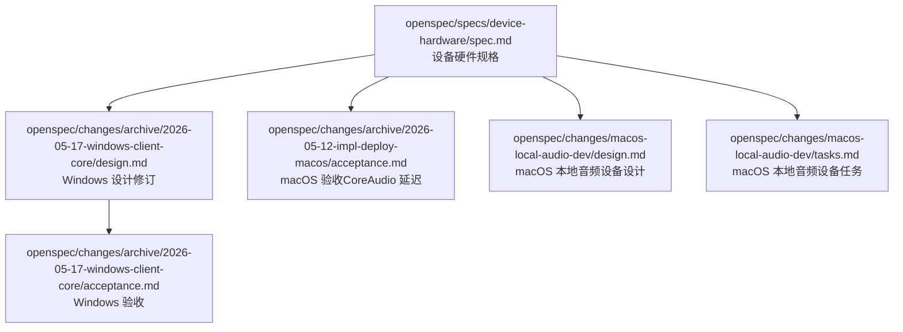
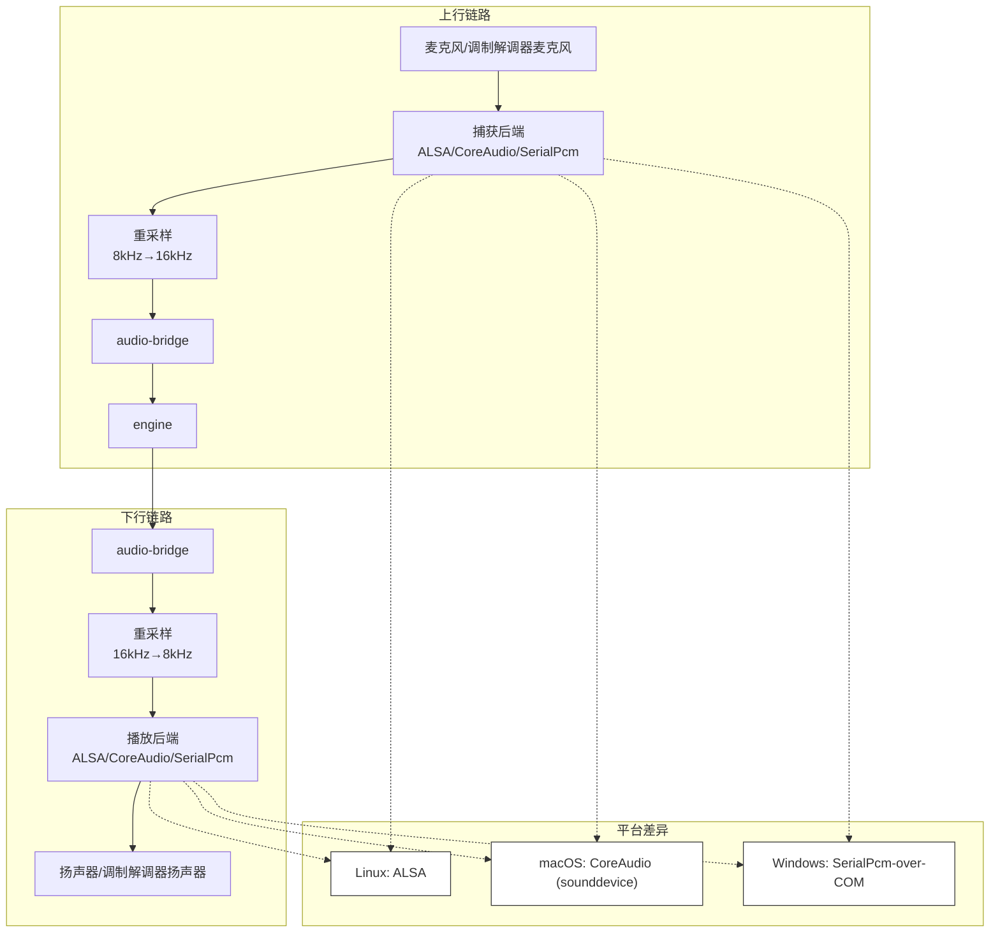
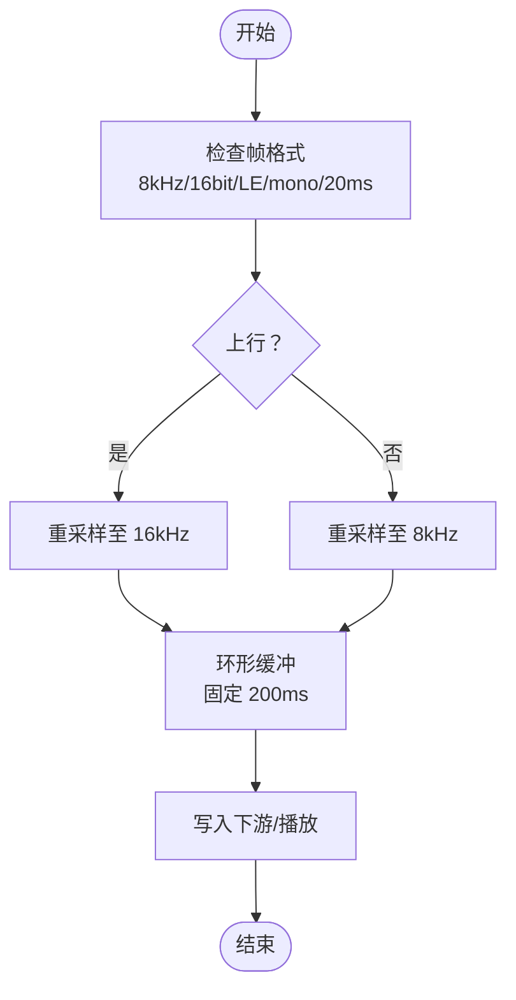
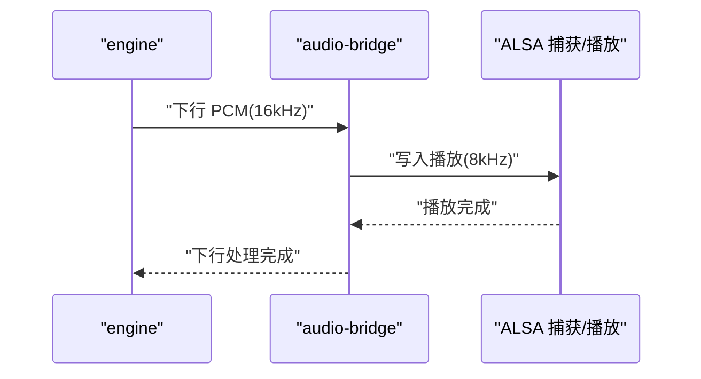
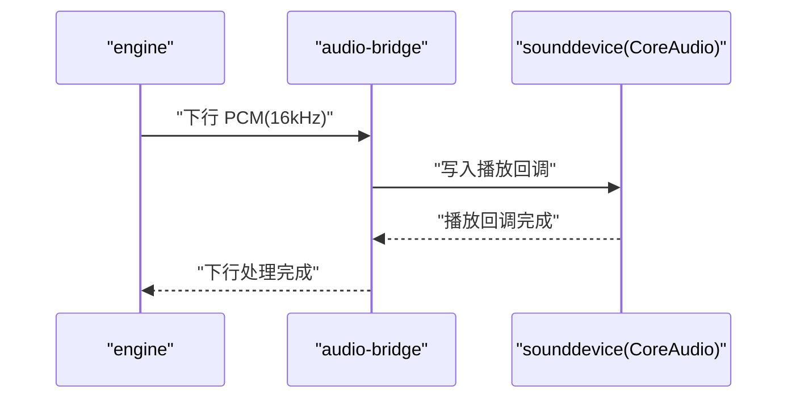
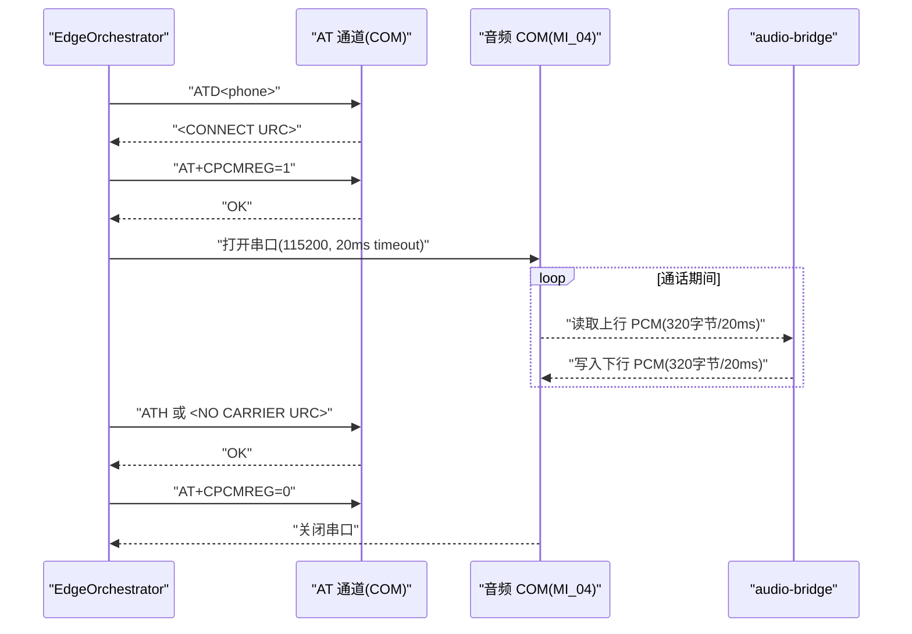
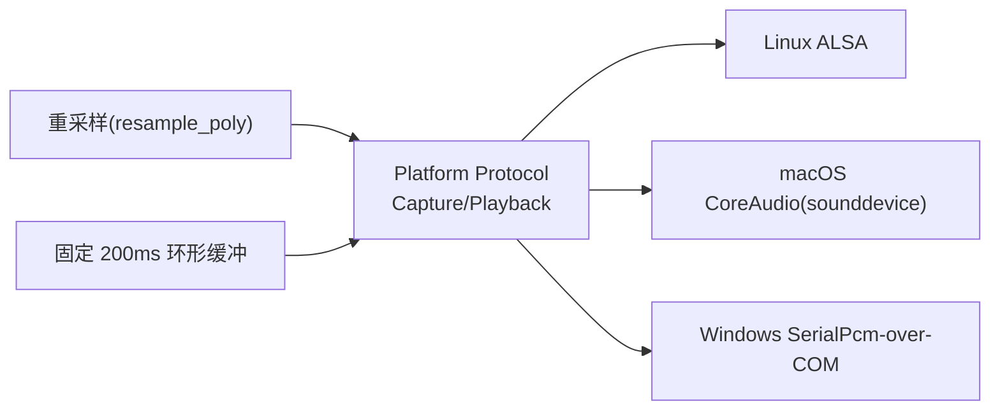

# 音频处理

<cite>
**本文引用的文件**
- [device-hardware 规格](file://openspec/specs/device-hardware/spec.md)
- [Windows 客户端核心设计修订](file://openspec/changes/archive/2026-05-17-windows-client-core/design.md)
- [Windows 客户端核心验收](file://openspec/changes/archive/2026-05-17-windows-client-core/acceptance.md)
- [macOS 本地音频设备设计](file://openspec/changes/macos-local-audio-dev/design.md)
- [macOS 本地音频设备任务](file://openspec/changes/macos-local-audio-dev/tasks.md)
- [macOS 验收（CoreAudio 延迟框架）](file://openspec/changes/archive/2026-05-12-impl-deploy-macos/acceptance.md)
</cite>

## 目录
1. [引言](#引言)
2. [项目结构](#项目结构)
3. [核心组件](#核心组件)
4. [架构总览](#架构总览)
5. [详细组件分析](#详细组件分析)
6. [依赖分析](#依赖分析)
7. [性能考虑](#性能考虑)
8. [故障排查指南](#故障排查指南)
9. [结论](#结论)
10. [附录](#附录)

## 引言
本技术文档面向音频处理系统，聚焦于 PCM 音频管道的设计与实现，系统性阐述“上行 8kHz 16-bit 线性 PCM → 重采样 16kHz → engine；下行 engine TTS PCM → 重采样 8kHz → ALSA 播放”的双向传输机制。文档还覆盖不同平台的音频实现差异：Linux ALSA、macOS CoreAudio、Windows SerialPcm-over-COM，并给出音频帧格式、重采样算法、延迟控制策略与平台特定后端的落地要点。最后提供音频质量优化与性能调优建议。

## 项目结构
音频处理相关的内容主要沉淀在 openspec 变更与规格文档中，涉及设备硬件层、平台后端选择、帧格式与重采样策略、延迟目标与验收方法等。下图展示与音频处理相关的核心文件与它们在仓库中的位置：

图表来源
- [device-hardware 规格](file://openspec/specs/device-hardware/spec.md)
- [Windows 客户端核心设计修订](file://openspec/changes/archive/2026-05-17-windows-client-core/design.md)
- [Windows 客户端核心验收](file://openspec/changes/archive/2026-05-17-windows-client-core/acceptance.md)
- [macOS 本地音频设备设计](file://openspec/changes/macos-local-audio-dev/design.md)
- [macOS 本地音频设备任务](file://openspec/changes/macos-local-audio-dev/tasks.md)
- [macOS 验收（CoreAudio 延迟框架）](file://openspec/changes/archive/2026-05-12-impl-deploy-macos/acceptance.md)

章节来源
- [device-hardware 规格](file://openspec/specs/device-hardware/spec.md)
- [Windows 客户端核心设计修订](file://openspec/changes/archive/2026-05-17-windows-client-core/design.md)
- [Windows 客户端核心验收](file://openspec/changes/archive/2026-05-17-windows-client-core/acceptance.md)
- [macOS 本地音频设备设计](file://openspec/changes/macos-local-audio-dev/design.md)
- [macOS 本地音频设备任务](file://openspec/changes/macos-local-audio-dev/tasks.md)
- [macOS 验收（CoreAudio 延迟框架）](file://openspec/changes/archive/2026-05-12-impl-deploy-macos/acceptance.md)

## 核心组件
- 音频帧格式与重采样
  - 上行：8 kHz / 16-bit / LE / mono / 20 ms 帧（modem 物理通道原生），在 audio-bridge 内进行 upsample 至 16 kHz。
  - 下行：16 kHz / 16-bit / LE / mono / 20 ms 帧，在 audio-bridge 内进行 downsample 至 8 kHz 后写入音频 COM。
  - 重采样算法：采用 scipy.signal.resample_poly（多相滤波，整数比 1:2，兼顾速度与质量）。
- 音频管道与平台后端
  - Linux：ALSA（/dev/snd/pcmC*D*c）双向流转。
  - macOS：CoreAudio（sounddevice 作为 PortAudio CFFI 绑定）。
  - Windows：SerialPcm-over-COM（modem 的 MI_04 串口承载私有 PCM 字节流协议）。
- 生命周期与控制
  - 通话建立后通过 AT+CPCMREG=1 启用音频串口字节流；通话结束或远端挂断后 AT+CPCMREG=0 释放。
  - 音频后端在生命周期内保持纯字节流 IO，不常驻音频流；生命周期编排由 Orchestrator 负责。

章节来源
- [device-hardware 规格](file://openspec/specs/device-hardware/spec.md)
- [Windows 客户端核心设计修订](file://openspec/changes/archive/2026-05-17-windows-client-core/design.md)
- [Windows 客户端核心验收](file://openspec/changes/archive/2026-05-17-windows-client-core/acceptance.md)
- [macOS 本地音频设备设计](file://openspec/changes/macos-local-audio-dev/design.md)
- [macOS 本地音频设备任务](file://openspec/changes/macos-local-audio-dev/tasks.md)

## 架构总览
下图展示音频处理在不同平台上的端到端路径与关键交互点，包括上行采集、重采样、下行播放与平台后端适配。

图表来源
- [device-hardware 规格](file://openspec/specs/device-hardware/spec.md)
- [Windows 客户端核心设计修订](file://openspec/changes/archive/2026-05-17-windows-client-core/design.md)
- [macOS 本地音频设备设计](file://openspec/changes/macos-local-audio-dev/design.md)

## 详细组件分析

### 组件 A：音频帧格式与重采样
- 帧格式
  - 上行：8 kHz / 16-bit / LE / mono / 20 ms 帧（modem 物理通道原生），与 macOS / Linux 后端约定一致。
  - 下行：16 kHz / 16-bit / LE / mono / 20 ms 帧，经 downsample 至 8 kHz 后写入音频 COM。
- 重采样算法
  - 采用 scipy.signal.resample_poly（整数比 1:2），兼顾速度与质量；替代方案包括 libsoxr（复杂度更高）、手写滤波器（易出错）、audioop（兼容性好但质量一般）。
- 环形缓冲与抖动控制
  - 固定 200 ms 环形缓冲，不足时填充静音、过量时丢弃最旧数据，避免自适应带来的延迟波动。

图表来源
- [Windows 客户端核心设计修订](file://openspec/changes/archive/2026-05-17-windows-client-core/design.md)
- [device-hardware 规格](file://openspec/specs/device-hardware/spec.md)

章节来源
- [device-hardware 规格](file://openspec/specs/device-hardware/spec.md)
- [Windows 客户端核心设计修订](file://openspec/changes/archive/2026-05-17-windows-client-core/design.md)
- [Windows 客户端核心验收](file://openspec/changes/archive/2026-05-17-windows-client-core/acceptance.md)

### 组件 B：平台后端实现（Linux ALSA）
- 捕获与播放
  - 通过 ALSA 设备（/dev/snd/pcmC*D*c）进行双向音频流转，遵循 8 kHz 帧格式。
- 重采样与延迟
  - 与 audio-bridge 内部重采样路径一致，无需额外适配。
- 延迟目标
  - 与 macOS CoreAudio 的延迟框架保持一致的验收思路（虽未在 Linux 上直接给出 P95 数字，但策略一致）。

图表来源
- [device-hardware 规格](file://openspec/specs/device-hardware/spec.md)

章节来源
- [device-hardware 规格](file://openspec/specs/device-hardware/spec.md)

### 组件 C：平台后端实现（macOS CoreAudio）
- 捕获与播放
  - 使用 sounddevice 作为 PortAudio 的现代 CFFI 绑定，直接回调提供 int16 mono numpy 数组，与 PcmFrame 形状对接。
- 设备枚举与导入控制
  - 通过 sd.query_devices() 枚举系统设备；开发模式下可通过 CLI flag 指定输入/输出设备名称或索引。
- 延迟框架与验收
  - 验收中展示了模块导入与设备查询的测试路径；在缺少 USB Audio CODEC 的硬件条件下，延迟测试被跳过，强调了真实硬件或代理回环的重要性。

图表来源
- [macOS 本地音频设备设计](file://openspec/changes/macos-local-audio-dev/design.md)
- [macOS 验收（CoreAudio 延迟框架）](file://openspec/changes/archive/2026-05-12-impl-deploy-macos/acceptance.md)

章节来源
- [macOS 本地音频设备设计](file://openspec/changes/macos-local-audio-dev/design.md)
- [macOS 本地音频设备任务](file://openspec/changes/macos-local-audio-dev/tasks.md)
- [macOS 验收（CoreAudio 延迟框架）](file://openspec/changes/archive/2026-05-12-impl-deploy-macos/acceptance.md)

### 组件 D：平台后端实现（Windows SerialPcm-over-COM）
- 设备识别
  - 通过 pyserial 枚举 COM 端口，结合 VID:PID 白名单与 AT 试探（向疑似 modem 的 COM 发送 AT 命令，200 ms 内返回 OK 视为命中）识别 AT 通道与音频 COM。
- 音频通道与生命周期
  - 音频 COM（典型为 MI_04，Class=Ports）承载私有 PCM 字节流协议；通过 AT+CPCMREG=1 启用字节流，AT+CPCMREG=0 释放。
  - 串口一次性打开并跨通话复用，进程退出时关闭。
- 帧格式与时序
  - 8 kHz / 16-bit / LE / mono / 20 ms 帧；pyserial read(N) 在 timeout 内阻塞返回 N 字节（N=320），天然形成 20 ms 帧。
- 端到端延迟
  - P95 ≤ 50 ms（端到端，从 modem mic 采样到 audio-bridge 拿到 PCM，以及反向 audio-bridge 推流到 modem speaker 输出）；不达标时可调整 read timeout 或减少帧数，并上报 HardwareAlert。

图表来源
- [Windows 客户端核心设计修订](file://openspec/changes/archive/2026-05-17-windows-client-core/design.md)
- [Windows 客户端核心验收](file://openspec/changes/archive/2026-05-17-windows-client-core/acceptance.md)
- [device-hardware 规格](file://openspec/specs/device-hardware/spec.md)

章节来源
- [Windows 客户端核心设计修订](file://openspec/changes/archive/2026-05-17-windows-client-core/design.md)
- [Windows 客户端核心验收](file://openspec/changes/archive/2026-05-17-windows-client-core/acceptance.md)
- [device-hardware 规格](file://openspec/specs/device-hardware/spec.md)

### 组件 E：音频延迟控制与平台一致性
- Linux 与 macOS
  - 延迟控制策略：固定 200 ms 环形缓冲，不足填静音、过量丢最旧；与 20 ms 帧配合，确保端到端延迟稳定。
- Windows
  - 通过 20 ms timeout 与 320 字节帧自然对齐，避免 PortAudio 时钟域；端到端 P95 ≤ 50 ms。
- 平台一致性
  - 三平台均采用 8 kHz 帧格式与 20 ms 帧长度，上层重采样代码零修改，后端抽象通过 Protocol（CaptureBackend.read_chunk()/PlaybackBackend.write_chunk()）屏蔽差异。

章节来源
- [device-hardware 规格](file://openspec/specs/device-hardware/spec.md)
- [Windows 客户端核心设计修订](file://openspec/changes/archive/2026-05-17-windows-client-core/design.md)
- [Windows 客户端核心验收](file://openspec/changes/archive/2026-05-17-windows-client-core/acceptance.md)
- [macOS 本地音频设备设计](file://openspec/changes/macos-local-audio-dev/design.md)

## 依赖分析
- 平台后端抽象
  - 通过 CaptureBackend/PlaybackBackend Protocol 抽象，屏蔽 Linux ALSA、macOS CoreAudio、Windows SerialPcm 的差异，上层 audio-bridge 与引擎无需感知平台。
- 重采样与缓冲
  - scipy.signal.resample_poly 作为主路径，具备良好的速度与质量平衡；固定 200 ms 环形缓冲降低自适应复杂度。
- 设备识别与导入
  - macOS 通过 sounddevice 自动发现设备；Windows 通过 VID:PID 白名单 + AT 试探识别；Linux 通过 ALSA 设备路径。

图表来源
- [device-hardware 规格](file://openspec/specs/device-hardware/spec.md)
- [Windows 客户端核心设计修订](file://openspec/changes/archive/2026-05-17-windows-client-core/design.md)
- [macOS 本地音频设备设计](file://openspec/changes/macos-local-audio-dev/design.md)

章节来源
- [device-hardware 规格](file://openspec/specs/device-hardware/spec.md)
- [Windows 客户端核心设计修订](file://openspec/changes/archive/2026-05-17-windows-client-core/design.md)
- [macOS 本地音频设备设计](file://openspec/changes/macos-local-audio-dev/design.md)

## 性能考虑
- 重采样质量与速度
  - 采用整数比 1:2 的 resample_poly，兼顾速度与质量；如需进一步优化，可考虑在 Windows/macOS 上回退到 audioop 作为兜底。
- 帧大小与 IPC 开销
  - 50 ms 帧在 v1 中被选择，平衡 ASR 通用粒度与 IPC 开销；20 ms 过碎、100 ms 延迟增加明显。
- 缓冲策略
  - 固定 200 ms 环形缓冲，避免自适应带来的延迟波动；不足时填充静音、过量时丢弃最旧，确保实时性。
- Windows 串口参数
  - 115200 波特率、20 ms timeout、8N1，读取 320 字节自然形成 20 ms 帧；避免回调与 PortAudio 时钟域，与 modem 8 kHz 物理时钟同步。

章节来源
- [Windows 客户端核心设计修订](file://openspec/changes/archive/2026-05-17-windows-client-core/design.md)
- [Windows 客户端核心验收](file://openspec/changes/archive/2026-05-17-windows-client-core/acceptance.md)
- [device-hardware 规格](file://openspec/specs/device-hardware/spec.md)

## 故障排查指南
- Windows：WASAPI 回退导致“静默错误”
  - 现象：在 Windows 上，若 modem 未注册 USB Audio Class endpoint，WASAPI 回退可能静默指向笔记本麦克风/扬声器，导致“客户端启动但 AI 听不到”。
  - 处理：采用 SerialPcm-over-COM 路径，若 audio 串口找不到、CPCMREG 失败或 COM 被占用，将硬失败并上报 HardwareAlert。
- macOS：设备缺失与延迟测试
  - 现象：若硬件仅输出设备（无输入），或缺少黑洞回环驱动，延迟测试会被跳过。
  - 处理：获取具备 USB Audio CODEC 的真实 GSM modem 或在测试环境安装双声道回环驱动后重跑。
- Linux：ALSA 设备路径
  - 现象：设备路径变化或权限问题导致无法打开。
  - 处理：确认 /dev/snd/pcmC*D*c 可用，检查权限与设备状态。

章节来源
- [Windows 客户端核心设计修订](file://openspec/changes/archive/2026-05-17-windows-client-core/design.md)
- [Windows 客户端核心验收](file://openspec/changes/archive/2026-05-17-windows-client-core/acceptance.md)
- [macOS 验收（CoreAudio 延迟框架）](file://openspec/changes/archive/2026-05-12-impl-deploy-macos/acceptance.md)
- [device-hardware 规格](file://openspec/specs/device-hardware/spec.md)

## 结论
本音频处理系统围绕“8 kHz/16-bit/LE/mono/20 ms 帧”的统一约定，通过上行 upsample 与下行 downsample 的整数比重采样，实现了跨平台的一致性与低耦合。Linux 使用 ALSA、macOS 使用 CoreAudio（sounddevice）、Windows 采用 SerialPcm-over-COM，均通过 Platform Protocol 抽象屏蔽差异。延迟控制采用固定 200 ms 环形缓冲与严格的端到端 SLA（Windows P95 ≤ 50 ms），并在平台层面提供了稳健的验收与故障排查路径。

## 附录
- 音频帧格式速览
  - 上行：8 kHz / 16-bit / LE / mono / 20 ms 帧
  - 下行：16 kHz / 16-bit / LE / mono / 20 ms 帧
- 重采样算法
  - 主路径：scipy.signal.resample_poly（整数比 1:2）
  - 兜底：audioop（兼容性最佳）
- 平台后端
  - Linux：ALSA
  - macOS：CoreAudio（sounddevice）
  - Windows：SerialPcm-over-COM（MI_04）