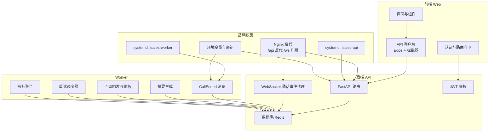
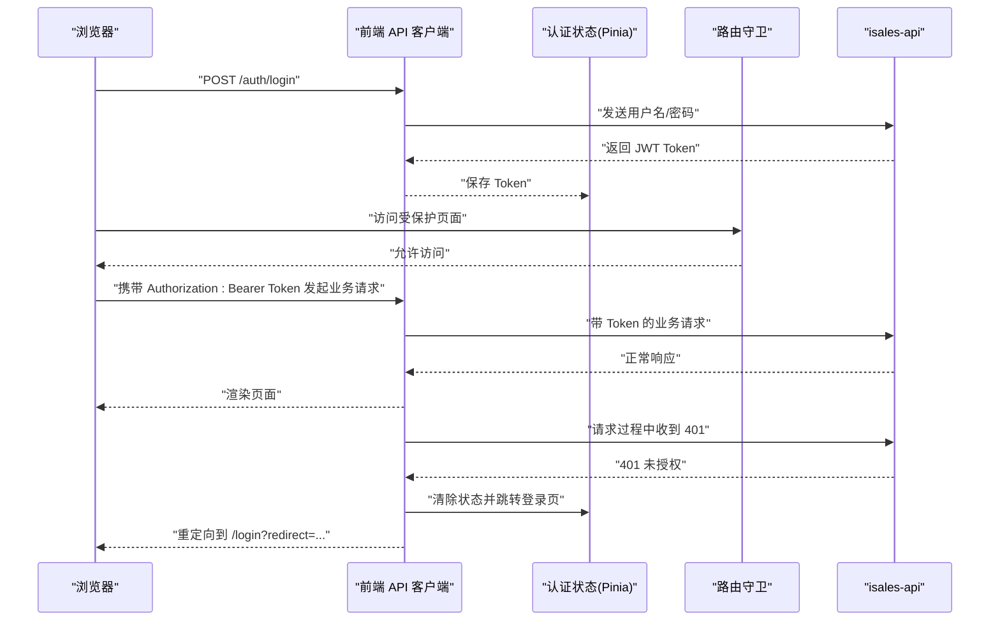
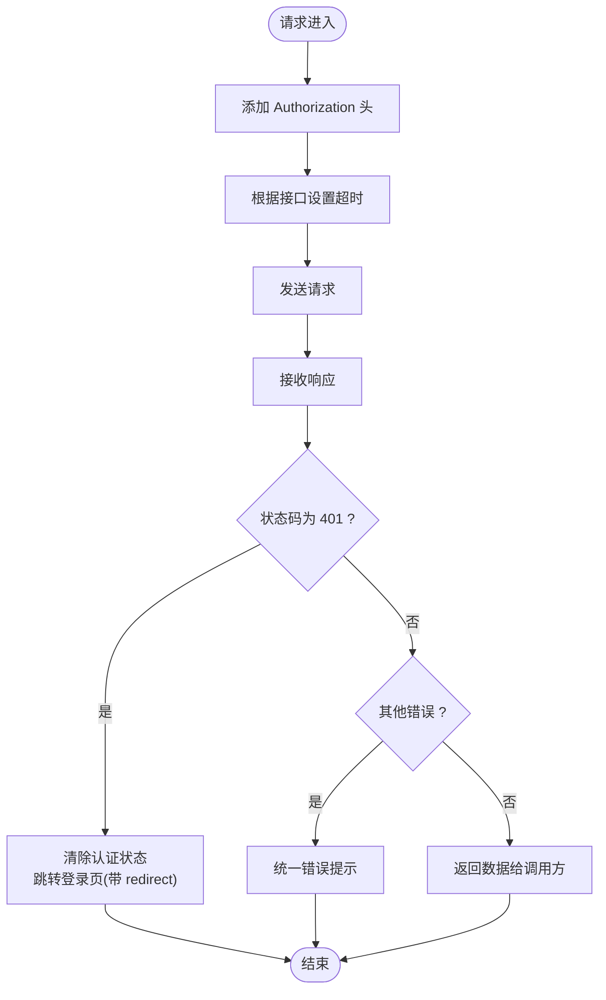
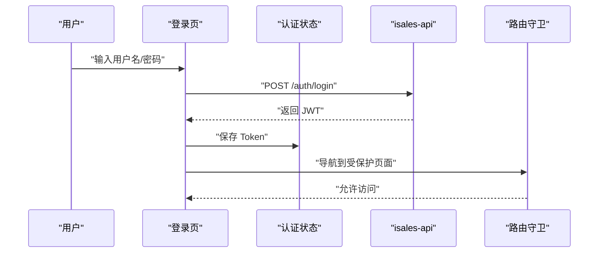
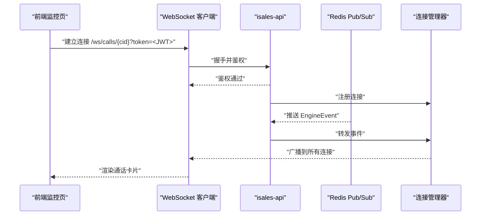
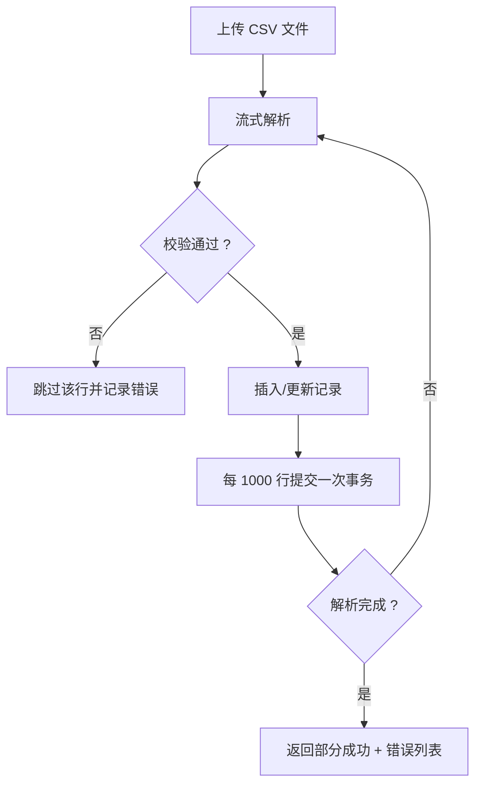
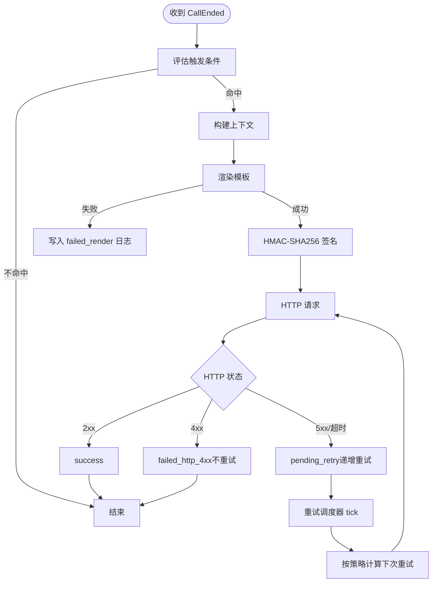
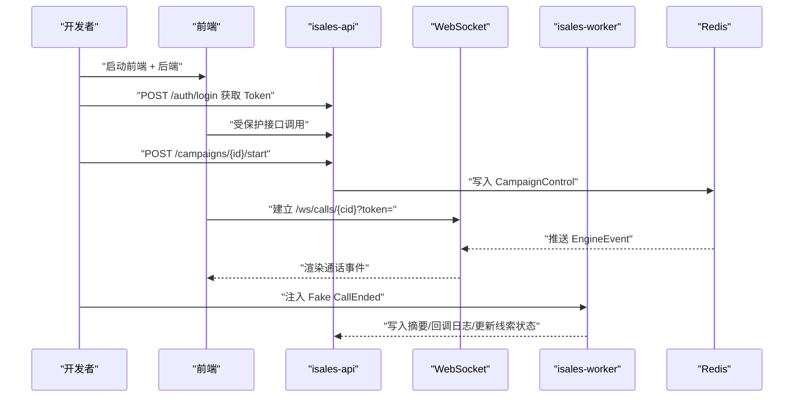
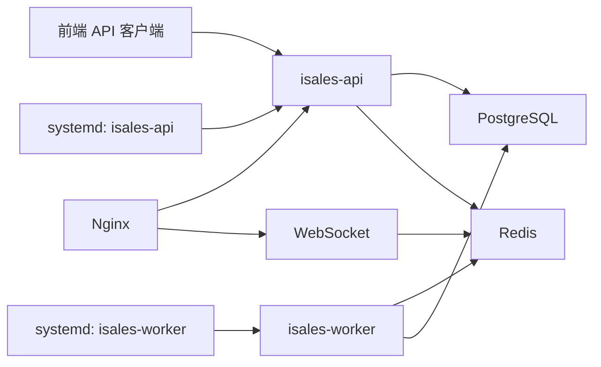

# API 集成

<cite>
**本文引用的文件**
- [设计说明（API 实施）](file://openspec/changes/archive/2026-05-06-impl-api/design.md)
- [任务清单（API 实施）](file://openspec/changes/archive/2026-05-06-impl-api/tasks.md)
- [任务清单（Web 实施）](file://openspec/changes/archive/2026-05-08-impl-web/tasks.md)
- [任务清单（Worker 实施）](file://openspec/changes/archive/2026-05-06-impl-worker/tasks.md)
- [API 端点规范](file://openspec/changes/archive/2026-05-06-impl-api/specs/service-communication/spec.md)
- [部署说明（云环境）](file://deploy/cloud/README.md)
- [系统服务配置（isales-api）](file://deploy/cloud/systemd/isales-api.service)
- [系统服务配置（isales-worker）](file://deploy/cloud/systemd/isales-worker.service)
- [环境变量示例（api.env.example）](file://deploy/env/api.env.example)
- [环境变量示例（telephony-api.env.example）](file://deploy/env/telephony-api.env.example)
- [Nginx 反向代理配置](file://deploy/cloud/nginx/isales.conf)
</cite>

## 目录
1. [简介](#简介)
2. [项目结构](#项目结构)
3. [核心组件](#核心组件)
4. [架构总览](#架构总览)
5. [详细组件分析](#详细组件分析)
6. [依赖关系分析](#依赖关系分析)
7. [性能考虑](#性能考虑)
8. [故障排查指南](#故障排查指南)
9. [结论](#结论)
10. [附录](#附录)

## 简介
本文件面向 API 集成的工程实践，围绕前端与后端 API 的集成方式进行系统化说明。内容涵盖 HTTP 请求封装、错误处理、请求/响应拦截器、认证与 Token 管理、请求重试与超时处理、RESTful API 调用、文件上传下载、分页数据处理、批量操作、API 客户端设计模式、Mock 数据策略以及联调测试方法。文档基于 isales 项目的实施规范与任务清单，结合后端 API 的端点设计与前端 Web 客户端的集成实践，提供可操作的参考。

## 项目结构
isales 项目包含多个子模块，其中与 API 集成直接相关的关键部分如下：
- 后端 API（isales-api）：提供 RESTful API、WebSocket 通话事件代理、JWT 鉴权、CSV 批量导入、数据分析等能力
- 前端 Web（isales-web）：基于 Vue 3 + Vite + Axios 的前端应用，负责 API 客户端封装、认证与路由守卫、UI 展示
- Worker（isales-worker）：负责通话结束后的摘要生成、回调触发、重试调度与指标聚合
- 部署与环境：systemd 服务配置、Nginx 反向代理、环境变量与密钥管理

**图表来源**
- [任务清单（API 实施）](file://openspec/changes/archive/2026-05-06-impl-api/tasks.md)
- [任务清单（Web 实施）](file://openspec/changes/archive/2026-05-08-impl-web/tasks.md)
- [任务清单（Worker 实施）](file://openspec/changes/archive/2026-05-06-impl-worker/tasks.md)
- [系统服务配置（isales-api）](file://deploy/cloud/systemd/isales-api.service)
- [系统服务配置（isales-worker）](file://deploy/cloud/systemd/isales-worker.service)
- [Nginx 反向代理配置](file://deploy/cloud/nginx/isales.conf)

**章节来源**
- [任务清单（API 实施）](file://openspec/changes/archive/2026-05-06-impl-api/tasks.md)
- [任务清单（Web 实施）](file://openspec/changes/archive/2026-05-08-impl-web/tasks.md)
- [任务清单（Worker 实施）](file://openspec/changes/archive/2026-05-06-impl-worker/tasks.md)
- [系统服务配置（isales-api）](file://deploy/cloud/systemd/isales-api.service)
- [系统服务配置（isales-worker）](file://deploy/cloud/systemd/isales-worker.service)
- [Nginx 反向代理配置](file://deploy/cloud/nginx/isales.conf)

## 核心组件
- API 客户端（Axios 封装与拦截器）
  - 请求拦截器：统一注入 Authorization 头（Bearer Token）
  - 响应拦截器：处理 401 未授权，触发登出与路由跳转
  - 超时控制：针对特定接口设置合理超时（如 CSV 导入 5 分钟）
- 认证与 Token 管理
  - JWT HS256 签发，24 小时过期
  - 前端使用 Pinia + 持久化插件管理登录状态与 Token
  - 路由守卫：未登录跳转登录页，已登录访问登录页跳转仪表盘
- WebSocket 通话事件代理
  - 使用 query 参数携带 JWT 进行鉴权
  - 进程内连接管理 + Redis Pub/Sub 转发
- 后端 API 能力
  - Campaigns 嵌套写入（单事务 + 全量替换）
  - Leads CSV 批量导入（流式解析 + 部分成功）
  - Analytics 聚合接口（7 日时间窗）
  - Call 查询与摘要接口
  - Callbacks 触发、签名与重试
- Mock 数据与联调测试
  - 开发脚本：fake_engine_events.py、fake_call_end.py
  - 测试覆盖：JWT 路径、CSV 导入、回调重试、指标聚合等

**章节来源**
- [任务清单（Web 实施）](file://openspec/changes/archive/2026-05-08-impl-web/tasks.md)
- [设计说明（API 实施）](file://openspec/changes/archive/2026-05-06-impl-api/design.md)
- [任务清单（Worker 实施）](file://openspec/changes/archive/2026-05-06-impl-worker/tasks.md)

## 架构总览
以下序列图展示了前端登录、获取 Token、发起受保护请求以及处理 401 未授权的整体流程。

**图表来源**
- [任务清单（Web 实施）](file://openspec/changes/archive/2026-05-08-impl-web/tasks.md)
- [设计说明（API 实施）](file://openspec/changes/archive/2026-05-06-impl-api/design.md)

## 详细组件分析

### 前端 API 客户端与拦截器
- 请求拦截器
  - 自动将 Token 注入 Authorization 头（Bearer 方案）
  - 对特定接口设置超时（如 CSV 导入 5 分钟）
- 响应拦截器
  - 处理 401 未授权：调用登出逻辑，清空状态，跳转登录页并携带 redirect 参数
  - 其他错误：统一错误提示与日志上报
- 认证状态管理
  - 使用 Pinia + 持久化插件（localStorage key 为固定标识），避免循环依赖
  - 登录采用 OAuth2 密码模式，解析 JWT payload 中的角色信息
- 路由守卫
  - 未登录访问受保护路由 → 跳转登录页（带 redirect）
  - 已登录访问 /login → 跳转仪表盘

**图表来源**
- [任务清单（Web 实施）](file://openspec/changes/archive/2026-05-08-impl-web/tasks.md)

**章节来源**
- [任务清单（Web 实施）](file://openspec/changes/archive/2026-05-08-impl-web/tasks.md)

### 认证机制与 Token 管理
- JWT 签发
  - HS256 算法，24 小时过期
  - 无 refresh token，过期后需重新登录
- 前端状态
  - Pinia store 持久化存储 Token 与用户信息
  - 登出仅清理状态，导航职责交由调用方，避免循环依赖
- 路由守卫
  - 未登录 → /login（带 redirect）
  - 已登录访问 /login → /dashboard

**图表来源**
- [设计说明（API 实施）](file://openspec/changes/archive/2026-05-06-impl-api/design.md)
- [任务清单（Web 实施）](file://openspec/changes/archive/2026-05-08-impl-web/tasks.md)

**章节来源**
- [设计说明（API 实施）](file://openspec/changes/archive/2026-05-06-impl-api/design.md)
- [任务清单（Web 实施）](file://openspec/changes/archive/2026-05-08-impl-web/tasks.md)

### WebSocket 通话事件代理
- 鉴权方式
  - query 参数携带 JWT（浏览器 WebSocket API 不支持自定义 header）
- 连接管理
  - 进程内维护每个 campaign_id 的连接集合
  - 后台任务订阅 Redis Pub/Sub，收到消息后 fan-out 给该集合的所有连接
- 重连与心跳
  - 前端 WebSocket 包装类支持指数退避重连与心跳检测（具体实现见前端任务清单）

**图表来源**
- [设计说明（API 实施）](file://openspec/changes/archive/2026-05-06-impl-api/design.md)
- [任务清单（Web 实施）](file://openspec/changes/archive/2026-05-08-impl-web/tasks.md)

**章节来源**
- [设计说明（API 实施）](file://openspec/changes/archive/2026-05-06-impl-api/design.md)
- [任务清单（Web 实施）](file://openspec/changes/archive/2026-05-08-impl-web/tasks.md)

### 后端 API 端点与数据处理
- Campaigns 嵌套写入
  - 单事务 upsert + 全量替换 children（先删后插），任意子项失败回滚
  - 通过 ON DELETE CASCADE 清理子表，确保一致性
- Leads CSV 批量导入
  - multipart/form-data 流式解析，遇到非法行跳过并记录错误
  - HTTP 200 返回部分成功，超过阈值错误率才 400
- Analytics 聚合
  - 三个 endpoint：接通率、目标达成率、时长分布
  - 默认最近 7 天时间窗，支持查询参数覆盖
- Calls 查询与摘要
  - 支持按 campaign_id、lead_id、status 过滤与分页
  - 详情包含转录与录音链接，摘要接口返回 CallSummary

**图表来源**
- [设计说明（API 实施）](file://openspec/changes/archive/2026-05-06-impl-api/design.md)
- [任务清单（API 实施）](file://openspec/changes/archive/2026-05-06-impl-api/tasks.md)

**章节来源**
- [设计说明（API 实施）](file://openspec/changes/archive/2026-05-06-impl-api/design.md)
- [任务清单（API 实施）](file://openspec/changes/archive/2026-05-06-impl-api/tasks.md)

### 回调触发、签名与重试
- 触发与上下文
  - 使用 JsonLogic 评估触发条件，构建上下文（goal_achieved、goal_type、extracted、lead、call）
- 模板渲染与签名
  - Jinja2 Sandbox 渲染 payload，异常转换为 RenderError
  - HMAC-SHA256 签名，包含时间戳与 Content-Type
- HTTP 调用与状态分类
  - 200 → success；400 → failed_http_4xx（不重试）；500/超时 → pending_retry（递增重试计数与下次重试时间）
- 重试调度器
  - 定时扫描 pending_retry 且到达下次重试时间的记录
  - 依据 retry_policy 递增重试间隔，超过最大次数标记 exhausted

**图表来源**
- [任务清单（Worker 实施）](file://openspec/changes/archive/2026-05-06-impl-worker/tasks.md)

**章节来源**
- [任务清单（Worker 实施）](file://openspec/changes/archive/2026-05-06-impl-worker/tasks.md)

### Mock 数据策略与联调测试
- 开发脚本
  - fake_engine_events.py：周期性推送多种 EngineEvent 到 Redis，用于 WebSocket 端到端验证
  - fake_call_end.py：注入一条 CallEnded 消息，驱动 Worker 三阶段处理链
- 测试覆盖
  - JWT 登录路径（成功/密码错误/未知用户/422/有效 me/缺失/无效/过期）
  - CSV 导入（部分成功/错误率阈值/性能验证）
  - 回调重试（2xx/4xx/5xx/超时/重试上限）
  - 指标聚合（7 日聚合正确性）
- 联调流程
  - 前端：/auth/login 获取 Token → 受保护路由与业务接口
  - 后端：/campaigns/{id}/start 触发 CampaignControl 消息
  - WebSocket：/ws/calls/{cid}?token= 验证事件流
  - Worker：CallEnded → 摘要 → 回调 → 重试 → 指标

**图表来源**
- [任务清单（API 实施）](file://openspec/changes/archive/2026-05-06-impl-api/tasks.md)
- [任务清单（Web 实施）](file://openspec/changes/archive/2026-05-08-impl-web/tasks.md)
- [任务清单（Worker 实施）](file://openspec/changes/archive/2026-05-06-impl-worker/tasks.md)

**章节来源**
- [任务清单（API 实施）](file://openspec/changes/archive/2026-05-06-impl-api/tasks.md)
- [任务清单（Web 实施）](file://openspec/changes/archive/2026-05-08-impl-web/tasks.md)
- [任务清单（Worker 实施）](file://openspec/changes/archive/2026-05-06-impl-worker/tasks.md)

## 依赖关系分析
- 组件耦合
  - 前端 API 客户端与后端 API 路由强耦合于端点契约与鉴权方案
  - WebSocket 与 Redis Pub/Sub 解耦，通过连接管理器集中转发
  - Worker 与 API 通过 Redis 消息队列解耦，支持异步处理与重试
- 外部依赖
  - PostgreSQL/Redis：数据库与缓存
  - systemd：服务生命周期管理
  - Nginx：反向代理与 WebSocket 升级

**图表来源**
- [系统服务配置（isales-api）](file://deploy/cloud/systemd/isales-api.service)
- [系统服务配置（isales-worker）](file://deploy/cloud/systemd/isales-worker.service)
- [Nginx 反向代理配置](file://deploy/cloud/nginx/isales.conf)

**章节来源**
- [系统服务配置（isales-api）](file://deploy/cloud/systemd/isales-api.service)
- [系统服务配置（isales-worker）](file://deploy/cloud/systemd/isales-worker.service)
- [Nginx 反向代理配置](file://deploy/cloud/nginx/isales.conf)

## 性能考虑
- WebSocket 连接管理
  - 单实例部署，进程内 dict 维护连接集合，避免多实例广播带来的复杂性
  - 后台任务统一订阅 Redis，减少重复订阅导致的连接膨胀
- CSV 导入
  - 流式解析 + 分批提交（每 1000 行），降低内存占用与锁竞争
- 指标聚合
  - 7 日聚合窗口，避免预聚合带来的维护成本，满足当前数据规模下的查询性能
- 前端重连与心跳
  - 指数退避重连与心跳检测，提升弱网环境下的稳定性

**章节来源**
- [设计说明（API 实施）](file://openspec/changes/archive/2026-05-06-impl-api/design.md)
- [任务清单（Worker 实施）](file://openspec/changes/archive/2026-05-06-impl-worker/tasks.md)
- [任务清单（Web 实施）](file://openspec/changes/archive/2026-05-08-impl-web/tasks.md)

## 故障排查指南
- 401 未授权
  - 现象：受保护接口返回 401
  - 处理：前端拦截器触发登出与路由跳转，检查 Token 是否过期或丢失
- CSV 导入失败
  - 现象：部分成功 + 错误列表；错误率过高返回 400
  - 处理：检查字段完整性与号码格式；关注错误列表定位问题行
- 回调重试异常
  - 现象：HTTP 500/超时 → pending_retry；400 → failed_http_4xx；超过上限 → exhausted
  - 处理：查看回调日志状态与重试策略，修复上游服务或网络问题
- WebSocket 无法连接
  - 现象：连接被关闭或鉴权失败
  - 处理：确认 query 参数中的 JWT 有效；检查后端日志与连接管理器状态

**章节来源**
- [任务清单（Web 实施）](file://openspec/changes/archive/2026-05-08-impl-web/tasks.md)
- [任务清单（API 实施）](file://openspec/changes/archive/2026-05-06-impl-api/tasks.md)
- [任务清单（Worker 实施）](file://openspec/changes/archive/2026-05-06-impl-worker/tasks.md)

## 结论
isales 项目的 API 集成以“前后端分离 + 消息队列解耦”为核心设计，前端通过 Axios 拦截器实现统一认证与错误处理，后端提供 RESTful API 与 WebSocket 事件代理，并通过 Worker 实现异步处理与重试。整体方案在 v1 数据规模下具备良好的性能与可维护性，同时提供了完善的 Mock 数据与测试策略，便于联调与持续演进。

## 附录
- 端点规范与契约
  - 参考服务通信规范文档，确保前后端对端点、请求/响应格式与错误码保持一致
- 部署与运维
  - 使用 systemd 管理服务生命周期，Nginx 提供反向代理与 WebSocket 升级
  - 环境变量与密钥通过共享配置文件管理，确保 API 与 Telephony API 的密钥一致性

**章节来源**
- [API 端点规范](file://openspec/changes/archive/2026-05-06-impl-api/specs/service-communication/spec.md)
- [部署说明（云环境）](file://deploy/cloud/README.md)
- [环境变量示例（api.env.example）](file://deploy/env/api.env.example)
- [环境变量示例（telephony-api.env.example）](file://deploy/env/telephony-api.env.example)
- [系统服务配置（isales-api）](file://deploy/cloud/systemd/isales-api.service)
- [系统服务配置（isales-worker）](file://deploy/cloud/systemd/isales-worker.service)
- [Nginx 反向代理配置](file://deploy/cloud/nginx/isales.conf)